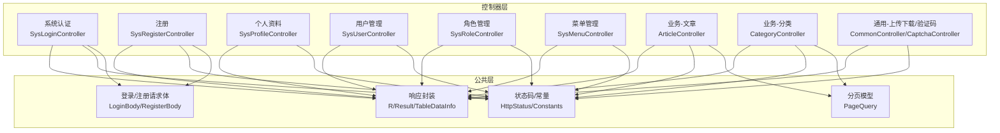
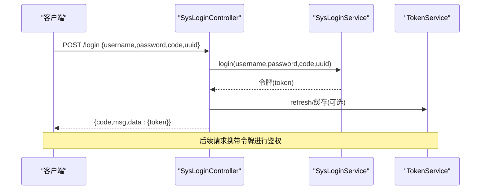
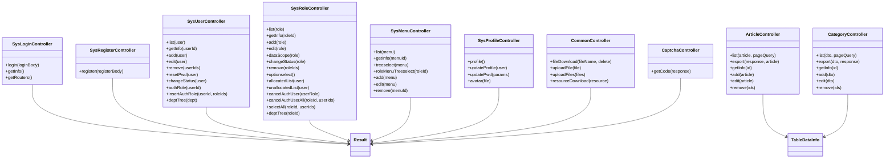

# API接口文档

<cite>
**本文引用的文件**
- [SysLoginController.java](file://blog-admin/src/main/java/blog/web/controller/system/SysLoginController.java)
- [SysRegisterController.java](file://blog-admin/src/main/java/blog/web/controller/system/SysRegisterController.java)
- [ArticleController.java](file://blog-admin/src/main/java/blog/web/controller/business/ArticleController.java)
- [CategoryController.java](file://blog-admin/src/main/java/blog/web/controller/business/CategoryController.java)
- [SysUserController.java](file://blog-admin/src/main/java/blog/web/controller/system/SysUserController.java)
- [SysProfileController.java](file://blog-admin/src/main/java/blog/web/controller/system/SysProfileController.java)
- [SysMenuController.java](file://blog-admin/src/main/java/blog/web/controller/system/SysMenuController.java)
- [SysRoleController.java](file://blog-admin/src/main/java/blog/web/controller/system/SysRoleController.java)
- [CommonController.java](file://blog-admin/src/main/java/blog/web/controller/common/CommonController.java)
- [CaptchaController.java](file://blog-admin/src/main/java/blog/web/controller/common/CaptchaController.java)
- [R.java](file://blog-common/src/main/java/blog/common/base/resp/R.java)
- [Result.java](file://blog-common/src/main/java/blog/common/base/resp/Result.java)
- [TableDataInfo.java](file://blog-common/src/main/java/blog/common/base/resp/TableDataInfo.java)
- [HttpStatus.java](file://blog-common/src/main/java/blog/common/constant/HttpStatus.java)
- [Constants.java](file://blog-common/src/main/java/blog/common/constant/Constants.java)
- [LoginBody.java](file://blog-common/src/main/java/blog/common/core/domain/model/LoginBody.java)
- [RegisterBody.java](file://blog-common/src/main/java/blog/common/core/domain/model/RegisterBody.java)
- [PageQuery.java](file://blog-common/src/main/java/blog/common/base/req/PageQuery.java)
</cite>

## 目录
1. [简介](#简介)
2. [项目结构](#项目结构)
3. [核心组件](#核心组件)
4. [架构总览](#架构总览)
5. [详细组件分析](#详细组件分析)
6. [依赖关系分析](#依赖关系分析)
7. [性能考量](#性能考量)
8. [故障排查指南](#故障排查指南)
9. [结论](#结论)
10. [附录](#附录)

## 简介
本文件为 Leejie 博客系统的完整 API 接口文档，覆盖认证与会话、业务（文章、分类）、系统管理（用户、角色、菜单）以及通用能力（上传、下载、验证码）等模块。文档统一规范了 RESTful 接口的 HTTP 方法、URL 路径、请求参数、响应格式、状态码与错误处理，并提供参数校验规则、响应示例与调用示例，帮助开发者快速集成。

## 项目结构
后端采用多模块分层设计：admin 控制器层负责对外暴露 REST 接口；common 提供基础响应体、分页与常量；system/biz/service 实现业务逻辑与数据访问。

图表来源
- [SysLoginController.java:56-90](file://blog-admin/src/main/java/blog/web/controller/system/SysLoginController.java#L56-L90)
- [SysRegisterController.java:27-34](file://blog-admin/src/main/java/blog/web/controller/system/SysRegisterController.java#L27-L34)
- [SysProfileController.java:47-81](file://blog-admin/src/main/java/blog/web/controller/system/SysProfileController.java#L47-L81)
- [SysUserController.java:97-112](file://blog-admin/src/main/java/blog/web/controller/system/SysUserController.java#L97-L112)
- [SysRoleController.java:78-83](file://blog-admin/src/main/java/blog/web/controller/system/SysRoleController.java#L78-L83)
- [SysMenuController.java:48-53](file://blog-admin/src/main/java/blog/web/controller/system/SysMenuController.java#L48-L53)
- [ArticleController.java:45-70](file://blog-admin/src/main/java/blog/web/controller/business/ArticleController.java#L45-L70)
- [CategoryController.java:42-70](file://blog-admin/src/main/java/blog/web/controller/business/CategoryController.java#L42-L70)
- [CommonController.java:44-84](file://blog-admin/src/main/java/blog/web/controller/common/CommonController.java#L44-L84)
- [CaptchaController.java:45-85](file://blog-admin/src/main/java/blog/web/controller/common/CaptchaController.java#L45-L85)
- [R.java:12-73](file://blog-common/src/main/java/blog/common/base/resp/R.java#L12-L73)
- [Result.java:14-101](file://blog-common/src/main/java/blog/common/base/resp/Result.java#L14-L101)
- [TableDataInfo.java:14-64](file://blog-common/src/main/java/blog/common/base/resp/TableDataInfo.java#L14-L64)
- [HttpStatus.java:8-93](file://blog-common/src/main/java/blog/common/constant/HttpStatus.java#L8-L93)
- [Constants.java:12-127](file://blog-common/src/main/java/blog/common/constant/Constants.java#L12-L127)
- [PageQuery.java:24-74](file://blog-common/src/main/java/blog/common/base/req/PageQuery.java#L24-L74)
- [LoginBody.java:8-60](file://blog-common/src/main/java/blog/common/core/domain/model/LoginBody.java#L8-L60)
- [RegisterBody.java:8-10](file://blog-common/src/main/java/blog/common/core/domain/model/RegisterBody.java#L8-L10)

章节来源
- [SysLoginController.java:33-124](file://blog-admin/src/main/java/blog/web/controller/system/SysLoginController.java#L33-L124)
- [SysRegisterController.java:19-36](file://blog-admin/src/main/java/blog/web/controller/system/SysRegisterController.java#L19-L36)
- [SysProfileController.java:35-136](file://blog-admin/src/main/java/blog/web/controller/system/SysProfileController.java#L35-L136)
- [SysUserController.java:42-233](file://blog-admin/src/main/java/blog/web/controller/system/SysUserController.java#L42-L233)
- [SysRoleController.java:40-240](file://blog-admin/src/main/java/blog/web/controller/system/SysRoleController.java#L40-L240)
- [SysMenuController.java:30-125](file://blog-admin/src/main/java/blog/web/controller/system/SysMenuController.java#L30-L125)
- [ArticleController.java:36-102](file://blog-admin/src/main/java/blog/web/controller/business/ArticleController.java#L36-L102)
- [CategoryController.java:31-107](file://blog-admin/src/main/java/blog/web/controller/business/CategoryController.java#L31-L107)
- [CommonController.java:28-142](file://blog-admin/src/main/java/blog/web/controller/common/CommonController.java#L28-L142)
- [CaptchaController.java:28-87](file://blog-admin/src/main/java/blog/web/controller/common/CaptchaController.java#L28-L87)
- [R.java:12-107](file://blog-common/src/main/java/blog/common/base/resp/R.java#L12-L107)
- [Result.java:14-205](file://blog-common/src/main/java/blog/common/base/resp/Result.java#L14-L205)
- [TableDataInfo.java:14-98](file://blog-common/src/main/java/blog/common/base/resp/TableDataInfo.java#L14-L98)
- [HttpStatus.java:8-93](file://blog-common/src/main/java/blog/common/constant/HttpStatus.java#L8-L93)
- [Constants.java:12-235](file://blog-common/src/main/java/blog/common/constant/Constants.java#L12-L235)
- [PageQuery.java:24-128](file://blog-common/src/main/java/blog/common/base/req/PageQuery.java#L24-L128)
- [LoginBody.java:8-60](file://blog-common/src/main/java/blog/common/core/domain/model/LoginBody.java#L8-L60)
- [RegisterBody.java:8-10](file://blog-common/src/main/java/blog/common/core/domain/model/RegisterBody.java#L8-L10)

## 核心组件
- 统一响应体
  - R<T>：泛型响应体，包含 code、msg、data，提供 ok/fail 工厂方法。
  - Result：Map 扩展响应体，包含 code/msg/data 标签键，提供 success/warn/error 工厂方法。
  - TableDataInfo<T>：分页响应容器，包含 total、rows、code、msg。
- 状态码与常量
  - HttpStatus：标准 HTTP 状态码映射，含 SUCCESS、ERROR、UNAUTHORIZED 等。
  - Constants：令牌前缀、验证码有效期、JWT 声明键等常量。
- 分页模型
  - PageQuery：支持 pageNum/pageSize、orderByColumn/isAsc 排序与安全转义。
- 请求体模型
  - LoginBody：用户名、密码、验证码、uuid。
  - RegisterBody：继承 LoginBody 的注册请求体。

章节来源
- [R.java:12-107](file://blog-common/src/main/java/blog/common/base/resp/R.java#L12-L107)
- [Result.java:14-205](file://blog-common/src/main/java/blog/common/base/resp/Result.java#L14-L205)
- [TableDataInfo.java:14-98](file://blog-common/src/main/java/blog/common/base/resp/TableDataInfo.java#L14-L98)
- [HttpStatus.java:8-93](file://blog-common/src/main/java/blog/common/constant/HttpStatus.java#L8-L93)
- [Constants.java:12-127](file://blog-common/src/main/java/blog/common/constant/Constants.java#L12-L127)
- [PageQuery.java:24-128](file://blog-common/src/main/java/blog/common/base/req/PageQuery.java#L24-L128)
- [LoginBody.java:8-60](file://blog-common/src/main/java/blog/common/core/domain/model/LoginBody.java#L8-L60)
- [RegisterBody.java:8-10](file://blog-common/src/main/java/blog/common/core/domain/model/RegisterBody.java#L8-L10)

## 架构总览
系统通过 Spring MVC 暴露 REST 接口，控制器统一返回 Result 或 R 封装体，配合权限注解与日志注解实现鉴权与审计。上传下载与验证码通过通用控制器提供。

图表来源
- [SysLoginController.java:56-64](file://blog-admin/src/main/java/blog/web/controller/system/SysLoginController.java#L56-L64)
- [Constants.java:101-106](file://blog-common/src/main/java/blog/common/constant/Constants.java#L101-L106)

章节来源
- [SysLoginController.java:56-90](file://blog-admin/src/main/java/blog/web/controller/system/SysLoginController.java#L56-L90)
- [Constants.java:101-106](file://blog-common/src/main/java/blog/common/constant/Constants.java#L101-L106)

## 详细组件分析

### 认证与会话接口
- 登录
  - 方法与路径：POST /login
  - 请求体：LoginBody
    - username：字符串，必填
    - password：字符串，必填
    - code：字符串，必填（验证码）
    - uuid：字符串，必填（验证码标识）
  - 响应：Result，包含 token 键
  - 示例响应：
    - 成功：{code: 200, msg: "操作成功", data: {token: "..."}}
    - 失败：{code: 401/403/500, msg: "..."}
- 获取用户信息
  - 方法与路径：GET /getInfo
  - 权限：需登录
  - 响应：Result，包含 user、roles、permissions、isDefaultModifyPwd、isPasswordExpired
- 获取路由信息
  - 方法与路径：GET /getRouters
  - 权限：需登录
  - 响应：Result，包含菜单树构建结果
- 注册
  - 方法与路径：POST /register
  - 请求体：RegisterBody（继承 LoginBody）
  - 响应：Result，若系统未开启注册则返回错误提示
- 验证码
  - 方法与路径：GET /captchaImage
  - 响应：Result，包含 captchaEnabled、uuid、img（Base64）

章节来源
- [SysLoginController.java:56-122](file://blog-admin/src/main/java/blog/web/controller/system/SysLoginController.java#L56-L122)
- [SysRegisterController.java:27-34](file://blog-admin/src/main/java/blog/web/controller/system/SysRegisterController.java#L27-L34)
- [CaptchaController.java:45-85](file://blog-admin/src/main/java/blog/web/controller/common/CaptchaController.java#L45-L85)
- [LoginBody.java:8-60](file://blog-common/src/main/java/blog/common/core/domain/model/LoginBody.java#L8-L60)
- [RegisterBody.java:8-10](file://blog-common/src/main/java/blog/common/core/domain/model/RegisterBody.java#L8-L10)

### 业务接口

#### 文章管理
- 查询列表
  - 方法与路径：GET /system/article/list
  - 权限：system:article:list
  - 查询参数：Article 对象属性 + PageQuery
  - 响应：TableDataInfo<Article>
- 导出列表
  - 方法与路径：POST /system/article/export
  - 权限：system:article:export
  - 请求体：Article（可选过滤条件）
  - 响应：Excel 文件下载
- 获取详情
  - 方法与路径：GET /system/article/{id}
  - 权限：system:article:query
  - 响应：Result，data 为 Article
- 新增
  - 方法与路径：POST /system/article
  - 权限：system:article:add
  - 请求体：Article
  - 响应：Result（影响行数或布尔）
- 修改
  - 方法与路径：PUT /system/article
  - 权限：system:article:edit
  - 请求体：Article
  - 响应：Result
- 删除
  - 方法与路径：DELETE /system/article/{ids}
  - 权限：system:article:remove
  - 响应：Result

章节来源
- [ArticleController.java:45-100](file://blog-admin/src/main/java/blog/web/controller/business/ArticleController.java#L45-L100)
- [TableDataInfo.java:57-64](file://blog-common/src/main/java/blog/common/base/resp/TableDataInfo.java#L57-L64)
- [PageQuery.java:62-74](file://blog-common/src/main/java/blog/common/base/req/PageQuery.java#L62-L74)

#### 文章分类
- 查询列表
  - 方法与路径：GET /biz/category/list
  - 权限：biz:category:list
  - 查询参数：CategoryDTO + PageQuery
  - 响应：TableDataInfo<CategoryVO>
- 导出列表
  - 方法与路径：POST /biz/category/export
  - 权限：biz:category:export
  - 响应：Excel 文件下载
- 获取详情
  - 方法与路径：GET /biz/category/{id}
  - 权限：biz:category:query
  - 参数：id（非空）
  - 响应：R<CategoryVO>
- 新增
  - 方法与路径：POST /biz/category
  - 权限：biz:category:add
  - 请求体：CategoryDTO（按 AddGroup 校验）
  - 响应：R<Void>
- 修改
  - 方法与路径：PUT /biz/category
  - 权限：biz:category:edit
  - 请求体：CategoryDTO（按 EditGroup 校验）
  - 响应：R<Void>
- 删除
  - 方法与路径：DELETE /biz/category/{ids}
  - 权限：biz:category:remove
  - 参数：ids（非空数组）
  - 响应：R<Void>

章节来源
- [CategoryController.java:42-105](file://blog-admin/src/main/java/blog/web/controller/business/CategoryController.java#L42-L105)

### 系统管理接口

#### 用户管理
- 查询列表
  - 方法与路径：GET /system/user/list
  - 权限：system:user:list
  - 查询参数：SysUser + 分页（内置分页）
  - 响应：TableDataInfo
- 导出
  - 方法与路径：POST /system/user/export
  - 权限：system:user:export
  - 响应：Excel 文件下载
- 导入
  - 方法与路径：POST /system/user/importData
  - 权限：system:user:import
  - 表单参数：file（Excel）、updateSupport（布尔）
  - 响应：Result（导入结果消息）
- 导入模板
  - 方法与路径：POST /system/user/importTemplate
  - 权限：system:user:import
  - 响应：Excel 文件下载
- 获取详情
  - 方法与路径：GET /system/user 或 GET /system/user/{userId}
  - 权限：system:user:query
  - 响应：Result，包含用户信息、岗位与角色列表
- 新增
  - 方法与路径：POST /system/user
  - 权限：system:user:add
  - 请求体：SysUser（唯一性校验：用户名/手机/邮箱）
  - 响应：Result
- 修改
  - 方法与路径：PUT /system/user
  - 权限：system:user:edit
  - 请求体：SysUser（唯一性校验与数据范围校验）
  - 响应：Result
- 删除
  - 方法与路径：DELETE /system/user/{userIds}
  - 权限：system:user:remove
  - 响应：Result（不可删除自身）
- 重置密码
  - 方法与路径：PUT /system/user/resetPwd
  - 权限：system:user:resetPwd
  - 请求体：SysUser（含新密码）
  - 响应：Result
- 状态变更
  - 方法与路径：PUT /system/user/changeStatus
  - 权限：system:user:edit
  - 请求体：SysUser（状态）
  - 响应：Result
- 授权角色-查看
  - 方法与路径：GET /system/user/authRole/{userId}
  - 权限：system:user:query
  - 响应：Result（用户与可授权角色）
- 授权角色-设置
  - 方法与路径：PUT /system/user/authRole
  - 权限：system:user:edit
  - 查询参数：userId、roleIds
  - 响应：Result
- 部门树
  - 方法与路径：GET /system/user/deptTree
  - 权限：system:user:list
  - 查询参数：SysDept
  - 响应：Result（部门树）

章节来源
- [SysUserController.java:58-232](file://blog-admin/src/main/java/blog/web/controller/system/SysUserController.java#L58-L232)

#### 个人资料
- 获取资料
  - 方法与路径：GET /system/user/profile
  - 权限：需登录
  - 响应：Result（用户+角色组+岗位组）
- 修改资料
  - 方法与路径：PUT /system/user/profile
  - 权限：需登录
  - 请求体：SysUser（昵称、邮箱、手机、性别）
  - 响应：Result（唯一性校验）
- 修改密码
  - 方法与路径：PUT /system/user/profile/updatePwd
  - 权限：需登录
  - 请求体：Map（oldPassword、newPassword）
  - 响应：Result（旧密码匹配、新旧不能相同、加密存储）
- 头像上传
  - 方法与路径：POST /system/user/profile/avatar
  - 权限：需登录
  - 表单参数：avatarfile（图片）
  - 响应：Result（返回 imgUrl 并刷新缓存）

章节来源
- [SysProfileController.java:47-134](file://blog-admin/src/main/java/blog/web/controller/system/SysProfileController.java#L47-L134)

#### 角色管理
- 查询列表
  - 方法与路径：GET /system/role/list
  - 权限：system:role:list
  - 响应：TableDataInfo
- 导出
  - 方法与路径：POST /system/role/export
  - 权限：system:role:export
  - 响应：Excel 文件下载
- 获取详情
  - 方法与路径：GET /system/role/{roleId}
  - 权限：system:role:query
  - 响应：Result
- 新增
  - 方法与路径：POST /system/role
  - 权限：system:role:add
  - 请求体：SysRole（名称/键唯一性校验）
  - 响应：Result
- 修改
  - 方法与路径：PUT /system/role
  - 权限：system:role:edit
  - 请求体：SysRole（名称/键唯一性校验、权限缓存刷新）
  - 响应：Result
- 数据范围
  - 方法与路径：PUT /system/role/dataScope
  - 权限：system:role:edit
  - 请求体：SysRole
  - 响应：Result
- 状态变更
  - 方法与路径：PUT /system/role/changeStatus
  - 权限：system:role:edit
  - 请求体：SysRole
  - 响应：Result
- 删除
  - 方法与路径：DELETE /system/role/{roleIds}
  - 权限：system:role:remove
  - 响应：Result
- 角色选择框
  - 方法与路径：GET /system/role/optionselect
  - 权限：system:role:query
  - 响应：Result
- 已分配/未分配用户列表
  - 方法与路径：GET /system/role/authUser/allocatedList
  - 权限：system:role:list
  - 响应：TableDataInfo
- 取消授权
  - 方法与路径：PUT /system/role/authUser/cancel
  - 权限：system:role:edit
  - 请求体：SysUserRole
  - 响应：Result
- 批量取消/批量授权
  - 方法与路径：PUT /system/role/authUser/cancelAll
  - 权限：system:role:edit
  - 请求体：roleId、userIds
  - 响应：Result
- 获取角色部门树
  - 方法与路径：GET /system/role/deptTree/{roleId}
  - 权限：system:role:query
  - 响应：Result（checkedKeys + depts）

章节来源
- [SysRoleController.java:58-239](file://blog-admin/src/main/java/blog/web/controller/system/SysRoleController.java#L58-L239)

#### 菜单管理
- 查询列表
  - 方法与路径：GET /system/menu/list
  - 权限：system:menu:list
  - 查询参数：SysMenu
  - 响应：Result（菜单列表）
- 获取详情
  - 方法与路径：GET /system/menu/{menuId}
  - 权限：system:menu:query
  - 响应：Result
- 菜单树
  - 方法与路径：GET /system/menu/treeselect
  - 权限：system:menu:list
  - 查询参数：SysMenu
  - 响应：Result（菜单树选择）
- 角色菜单树
  - 方法与路径：GET /system/menu/roleMenuTreeselect/{roleId}
  - 权限：system:menu:list
  - 响应：Result（checkedKeys + menus）
- 新增
  - 方法与路径：POST /system/menu
  - 权限：system:menu:add
  - 请求体：SysMenu（名称唯一性、外链 http(s) 校验）
  - 响应：Result
- 修改
  - 方法与路径：PUT /system/menu
  - 权限：system:menu:edit
  - 请求体：SysMenu（名称唯一性、外链 http(s) 校验、父级自指校验）
  - 响应：Result
- 删除
  - 方法与路径：DELETE /system/menu/{menuId}
  - 权限：system:menu:remove
  - 响应：Result（存在子菜单或已分配时拒绝）

章节来源
- [SysMenuController.java:38-124](file://blog-admin/src/main/java/blog/web/controller/system/SysMenuController.java#L38-L124)

### 通用能力

#### 上传与下载
- 单文件上传
  - 方法与路径：POST /common/upload
  - 权限：无（公开）
  - 表单参数：file
  - 响应：Result（url、fileName、newFileName、originalFilename）
- 多文件上传
  - 方法与路径：POST /common/uploads
  - 权限：无（公开）
  - 表单参数：files（列表）
  - 响应：Result（逗号分隔的 urls/fileNames/newFileNames/originalFilenames）
- 通用下载
  - 方法与路径：GET /common/download
  - 权限：无（公开）
  - 查询参数：fileName、delete（可选）
  - 响应：二进制文件流
- 资源下载
  - 方法与路径：GET /common/download/resource
  - 权限：无（公开）
  - 查询参数：resource
  - 响应：二进制文件流

章节来源
- [CommonController.java:44-140](file://blog-admin/src/main/java/blog/web/controller/common/CommonController.java#L44-L140)

#### 验证码
- 生成验证码
  - 方法与路径：GET /captchaImage
  - 权限：无（公开）
  - 响应：Result（captchaEnabled、uuid、img）

章节来源
- [CaptchaController.java:45-85](file://blog-admin/src/main/java/blog/web/controller/common/CaptchaController.java#L45-L85)

## 依赖关系分析

图表来源
- [SysLoginController.java:56-122](file://blog-admin/src/main/java/blog/web/controller/system/SysLoginController.java#L56-L122)
- [SysRegisterController.java:27-34](file://blog-admin/src/main/java/blog/web/controller/system/SysRegisterController.java#L27-L34)
- [SysUserController.java:97-232](file://blog-admin/src/main/java/blog/web/controller/system/SysUserController.java#L97-L232)
- [SysRoleController.java:78-239](file://blog-admin/src/main/java/blog/web/controller/system/SysRoleController.java#L78-L239)
- [SysMenuController.java:38-124](file://blog-admin/src/main/java/blog/web/controller/system/SysMenuController.java#L38-L124)
- [ArticleController.java:45-100](file://blog-admin/src/main/java/blog/web/controller/business/ArticleController.java#L45-L100)
- [CategoryController.java:42-105](file://blog-admin/src/main/java/blog/web/controller/business/CategoryController.java#L42-L105)
- [SysProfileController.java:47-134](file://blog-admin/src/main/java/blog/web/controller/system/SysProfileController.java#L47-L134)
- [CommonController.java:44-140](file://blog-admin/src/main/java/blog/web/controller/common/CommonController.java#L44-L140)
- [CaptchaController.java:45-85](file://blog-admin/src/main/java/blog/web/controller/common/CaptchaController.java#L45-L85)
- [Result.java:14-101](file://blog-common/src/main/java/blog/common/base/resp/Result.java#L14-L101)
- [TableDataInfo.java:14-64](file://blog-common/src/main/java/blog/common/base/resp/TableDataInfo.java#L14-L64)

## 性能考量
- 分页与排序
  - PageQuery 支持多字段排序与安全转义，避免 SQL 注入风险。
  - 默认不分页时 pageNum/pageSize 会回退到合理默认值，注意大数据量场景下的分页参数设置。
- 缓存与令牌
  - 登录成功后生成令牌并可刷新权限缓存，减少重复查询。
  - 验证码写入 Redis 并设置过期时间，建议结合缓存清理策略。
- 文件上传
  - 上传路径与 URL 前缀在配置中集中管理，建议对大文件上传做超时与并发控制。

## 故障排查指南
- 常见状态码
  - 200 成功、204 无返回数据、400 参数错误、401 未授权、403 禁止访问、404 资源不存在、405 方法不允许、409 资源冲突、415 不支持的媒体类型、500 系统错误、601 系统警告。
- 参数校验
  - 登录/注册：username/password/code/uuid 必填。
  - 文章分类新增/编辑：按 AddGroup/EditGroup 校验；删除 ids 非空。
  - 用户管理：新增/修改时用户名/手机号/邮箱唯一性校验；删除不可删除自身。
  - 菜单管理：名称唯一、外链地址必须以 http(s) 开头、父级不可自指。
- 错误处理
  - 统一通过 Result/R 包装，错误消息包含明确提示；分页排序参数错误将抛出业务异常。
- 日志与审计
  - 使用 @Log 注解标记业务类型（新增/修改/删除/导入/导出/授权），便于审计追踪。

章节来源
- [HttpStatus.java:8-93](file://blog-common/src/main/java/blog/common/constant/HttpStatus.java#L8-L93)
- [Result.java:129-163](file://blog-common/src/main/java/blog/common/base/resp/Result.java#L129-L163)
- [PageQuery.java:98-112](file://blog-common/src/main/java/blog/common/base/req/PageQuery.java#L98-L112)
- [SysMenuController.java:82-108](file://blog-admin/src/main/java/blog/web/controller/system/SysMenuController.java#L82-L108)
- [SysUserController.java:120-154](file://blog-admin/src/main/java/blog/web/controller/system/SysUserController.java#L120-L154)
- [CategoryController.java:77-92](file://blog-admin/src/main/java/blog/web/controller/business/CategoryController.java#L77-L92)

## 结论
本接口文档基于实际代码实现，统一了响应格式、状态码与参数校验规则，明确了认证流程与业务边界。建议在生产环境启用权限拦截、限流与日志审计，并对敏感操作增加二次确认与操作凭证。

## 附录

### 响应格式规范
- 成功响应
  - Result：{code: 200, msg: "...", data: {...}}
  - R<T>：{code: 200, msg: "...", data: {...}}
  - 分页：TableDataInfo{code: 200, msg: "...", total, rows}
- 错误响应
  - Result：{code: 400/401/403/500, msg: "..."}
  - R<T>：{code: 400/401/403/500, msg: "..."}
- 警告响应
  - Result：{code: 601, msg: "..."}

章节来源
- [Result.java:69-163](file://blog-common/src/main/java/blog/common/base/resp/Result.java#L69-L163)
- [R.java:31-73](file://blog-common/src/main/java/blog/common/base/resp/R.java#L31-L73)
- [TableDataInfo.java:57-64](file://blog-common/src/main/java/blog/common/base/resp/TableDataInfo.java#L57-L64)

### 参数验证规则
- 必填参数
  - 登录：username、password、code、uuid
  - 注册：username、password、code、uuid
  - 文章分类新增/编辑：CategoryDTO（按 AddGroup/EditGroup）
  - 文章分类删除：ids（非空数组）
  - 用户管理新增/编辑：SysUser（唯一性校验）
  - 菜单管理新增/编辑：SysMenu（名称唯一、外链校验）
- 数据类型与长度
  - 字符串类型遵循 DTO/Model 定义；建议前端对长度与格式做预校验。
- 格式要求
  - 外链地址必须以 http(s) 开头；排序字段与方向需成对或单对。

章节来源
- [LoginBody.java:8-60](file://blog-common/src/main/java/blog/common/core/domain/model/LoginBody.java#L8-L60)
- [RegisterBody.java:8-10](file://blog-common/src/main/java/blog/common/core/domain/model/RegisterBody.java#L8-L10)
- [CategoryController.java:77-92](file://blog-admin/src/main/java/blog/web/controller/business/CategoryController.java#L77-L92)
- [SysMenuController.java:82-108](file://blog-admin/src/main/java/blog/web/controller/system/SysMenuController.java#L82-L108)
- [SysUserController.java:120-154](file://blog-admin/src/main/java/blog/web/controller/system/SysUserController.java#L120-L154)

### 调用示例与集成指南
- JavaScript（fetch）
  - 登录
    - POST /login，请求体为 {username, password, code, uuid}
    - 成功后从响应 data 中取 token，并在后续请求头 Authorization: Bearer {token}
  - 获取用户信息
    - GET /getInfo，携带令牌
  - 上传文件
    - POST /common/upload，表单字段 file
- Python（requests）
  - 登录
    - import requests
    - r = requests.post("http://host/login", json={"username":"...","password":"...","code":"...","uuid":"..."})
    - token = r.json()["data"]["token"]
  - 上传
    - files = {"file": open("test.jpg","rb")}
    - r = requests.post("http://host/common/upload", files=files)
  - 获取路由
    - headers = {"Authorization":"Bearer "+token}
    - r = requests.get("http://host/getRouters", headers=headers)

章节来源
- [SysLoginController.java:56-64](file://blog-admin/src/main/java/blog/web/controller/system/SysLoginController.java#L56-L64)
- [Constants.java:101-106](file://blog-common/src/main/java/blog/common/constant/Constants.java#L101-L106)
- [CommonController.java:67-84](file://blog-admin/src/main/java/blog/web/controller/common/CommonController.java#L67-L84)

### API 版本管理与兼容性
- 当前未发现显式的 API 版本前缀（如 /v1/），建议后续引入版本化路径以保障向后兼容。
- 兼容性策略建议
  - 保持现有接口语义不变，新增字段以可选方式提供。
  - 对于破坏性变更，保留旧接口并标注废弃，提供迁移指引。
  - 在网关层或拦截器中统一处理版本协商与路由转发。

[本节为通用建议，无需特定文件引用]