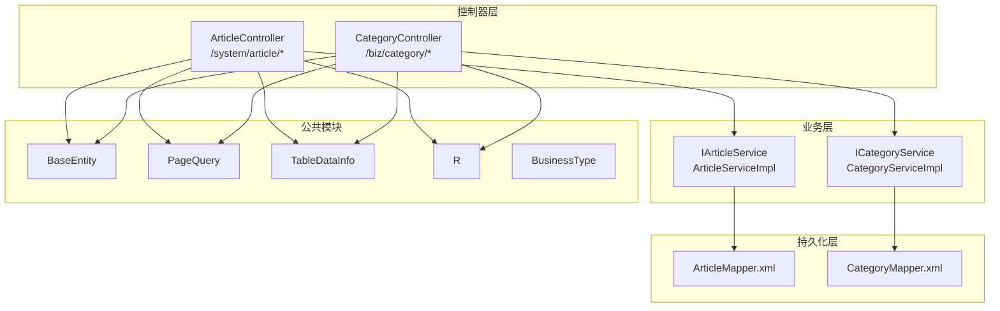
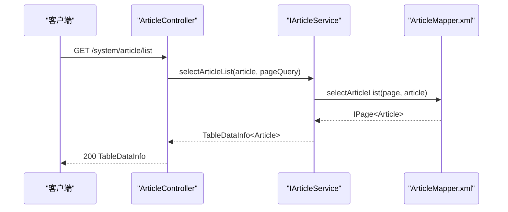
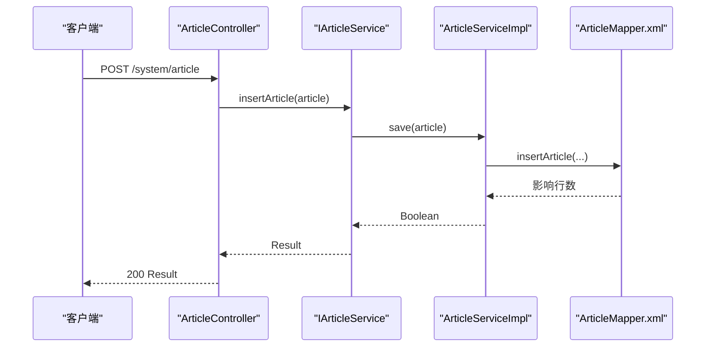
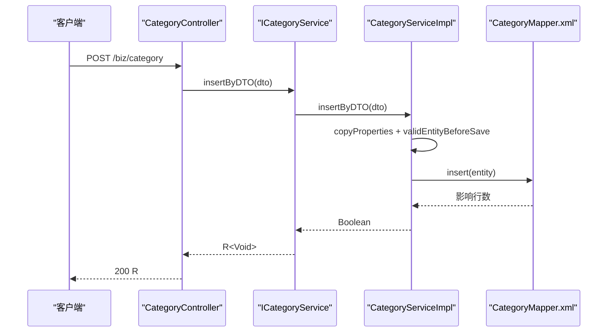
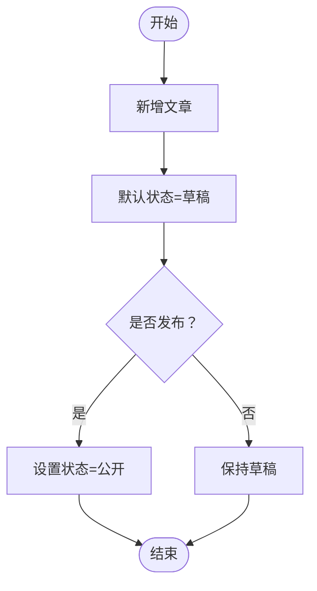
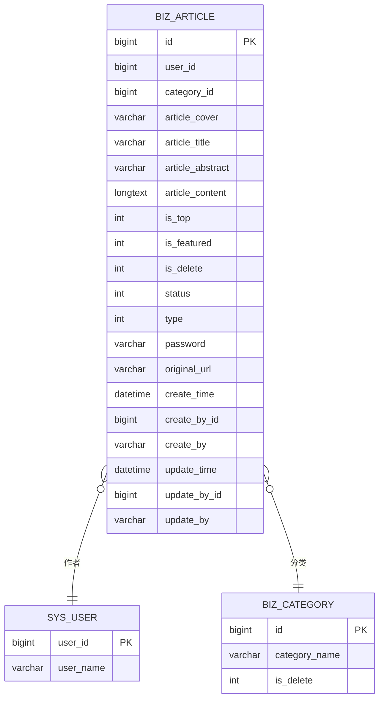
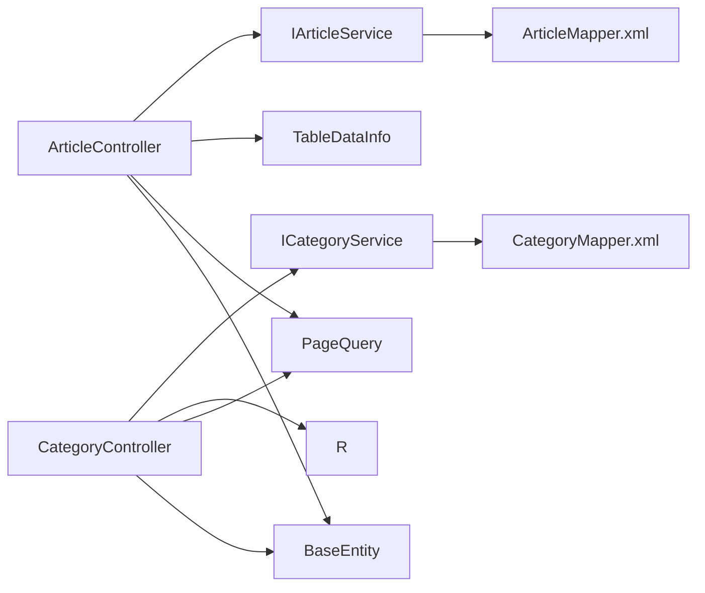

# 业务接口

<cite>
**本文引用的文件**
- [ArticleController.java](file://blog-admin/src/main/java/blog/web/controller/business/ArticleController.java)
- [CategoryController.java](file://blog-admin/src/main/java/blog/web/controller/business/CategoryController.java)
- [Article.java](file://blog-biz/src/main/java/blog/biz/domain/Article.java)
- [Category.java](file://blog-biz/src/main/java/blog/biz/domain/Category.java)
- [IArticleService.java](file://blog-biz/src/main/java/blog/biz/service/IArticleService.java)
- [ICategoryService.java](file://blog-biz/src/main/java/blog/biz/service/ICategoryService.java)
- [ArticleServiceImpl.java](file://blog-biz/src/main/java/blog/biz/service/impl/ArticleServiceImpl.java)
- [CategoryServiceImpl.java](file://blog-biz/src/main/java/blog/biz/service/impl/CategoryServiceImpl.java)
- [ArticleMapper.xml](file://blog-biz/src/main/resources/mapper/ArticleMapper.xml)
- [CategoryMapper.xml](file://blog-biz/src/main/resources/mapper/CategoryMapper.xml)
- [BaseEntity.java](file://blog-common/src/main/java/blog/common/base/entity/BaseEntity.java)
- [PageQuery.java](file://blog-common/src/main/java/blog/common/base/req/PageQuery.java)
- [TableDataInfo.java](file://blog-common/src/main/java/blog/common/base/resp/TableDataInfo.java)
- [R.java](file://blog-common/src/main/java/blog/common/base/resp/R.java)
- [BusinessType.java](file://blog-common/src/main/java/blog/common/enums/BusinessType.java)
- [CategoryDTO.java](file://blog-biz/src/main/java/blog/biz/domain/dto/CategoryDTO.java)
- [CategoryVO.java](file://blog-biz/src/main/java/blog/biz/domain/vo/CategoryVO.java)
</cite>

## 目录
1. [简介](#简介)
2. [项目结构](#项目结构)
3. [核心组件](#核心组件)
4. [架构总览](#架构总览)
5. [详细组件分析](#详细组件分析)
6. [依赖分析](#依赖分析)
7. [性能考虑](#性能考虑)
8. [故障排查指南](#故障排查指南)
9. [结论](#结论)
10. [附录](#附录)

## 简介
本文件面向Leejie博客系统的业务接口，聚焦“文章管理”与“文章分类管理”的完整API文档，覆盖以下主题：
- 文章管理接口：列表查询、详情查询、新增、修改、批量删除、导出
- 文章分类接口：列表查询、详情查询、新增、修改、批量删除、导出
- 文章状态管理：公开、私密、草稿的状态语义与转换边界
- 搜索与筛选：关键词、分类、状态、类型等多维筛选
- 数据模型：Article与Category实体字段、校验规则、默认值与扩展字段
- 分页查询：分页参数、排序、构建逻辑与性能建议
- 业务一致性：软删除、关联查询、权限控制与日志审计

## 项目结构
系统采用前后端分离与分层架构：
- 控制器层（Admin）：对外暴露REST API，负责鉴权、参数接收与响应封装
- 业务层（Biz）：封装领域服务，协调持久化与跨表逻辑
- 持久化层（Mapper/XML）：MyBatis映射SQL，完成CRUD与复杂查询
- 公共模块（Common）：基础实体、分页、响应体、常量与工具

图表来源
- [ArticleController.java:36-101](file://blog-admin/src/main/java/blog/web/controller/business/ArticleController.java#L36-L101)
- [CategoryController.java:34-106](file://blog-admin/src/main/java/blog/web/controller/business/CategoryController.java#L34-L106)
- [ArticleServiceImpl.java:22-94](file://blog-biz/src/main/java/blog/biz/service/impl/ArticleServiceImpl.java#L22-L94)
- [CategoryServiceImpl.java:36-132](file://blog-biz/src/main/java/blog/biz/service/impl/CategoryServiceImpl.java#L36-L132)
- [ArticleMapper.xml:5-293](file://blog-biz/src/main/resources/mapper/ArticleMapper.xml#L5-L293)
- [CategoryMapper.xml:5-18](file://blog-biz/src/main/resources/mapper/CategoryMapper.xml#L5-L18)
- [BaseEntity.java:22-84](file://blog-common/src/main/java/blog/common/base/entity/BaseEntity.java#L22-L84)
- [PageQuery.java:24-127](file://blog-common/src/main/java/blog/common/base/req/PageQuery.java#L24-L127)
- [TableDataInfo.java:14-97](file://blog-common/src/main/java/blog/common/base/resp/TableDataInfo.java#L14-L97)
- [R.java:12-106](file://blog-common/src/main/java/blog/common/base/resp/R.java#L12-L106)
- [BusinessType.java:8-58](file://blog-common/src/main/java/blog/common/enums/BusinessType.java#L8-L58)

章节来源
- [ArticleController.java:36-101](file://blog-admin/src/main/java/blog/web/controller/business/ArticleController.java#L36-L101)
- [CategoryController.java:34-106](file://blog-admin/src/main/java/blog/web/controller/business/CategoryController.java#L34-L106)

## 核心组件
- 文章控制器：提供文章列表、详情、新增、修改、删除、导出等接口
- 分类控制器：提供分类列表、详情、新增、修改、删除、导出等接口
- 业务服务：封装分页、校验、软删除、关联查询等业务逻辑
- 数据模型：Article与Category实体，继承统一的BaseEntity
- 响应封装：统一使用R<T>或TableDataInfo<T>返回结果

章节来源
- [ArticleController.java:36-101](file://blog-admin/src/main/java/blog/web/controller/business/ArticleController.java#L36-L101)
- [CategoryController.java:34-106](file://blog-admin/src/main/java/blog/web/controller/business/CategoryController.java#L34-L106)
- [Article.java:24-94](file://blog-biz/src/main/java/blog/biz/domain/Article.java#L24-L94)
- [Category.java:19-37](file://blog-biz/src/main/java/blog/biz/domain/Category.java#L19-L37)
- [R.java:12-106](file://blog-common/src/main/java/blog/common/base/resp/R.java#L12-L106)
- [TableDataInfo.java:14-97](file://blog-common/src/main/java/blog/common/base/resp/TableDataInfo.java#L14-L97)

## 架构总览
下图展示文章管理请求从控制器到业务层再到持久化的调用链路。

图表来源
- [ArticleController.java:46-49](file://blog-admin/src/main/java/blog/web/controller/business/ArticleController.java#L46-L49)
- [ArticleServiceImpl.java:44-47](file://blog-biz/src/main/java/blog/biz/service/impl/ArticleServiceImpl.java#L44-L47)
- [ArticleMapper.xml:55-124](file://blog-biz/src/main/resources/mapper/ArticleMapper.xml#L55-L124)

## 详细组件分析

### 文章管理接口
- 接口清单
  - GET /system/article/list：文章列表查询
  - GET /system/article/{id}：获取文章详情
  - POST /system/article：新增文章
  - PUT /system/article：修改文章
  - DELETE /system/article/{ids}：批量删除文章
  - POST /system/article/export：导出文章列表

- 参数与返回
  - 列表查询：支持按用户ID、分类ID、标题、摘要、内容、置顶、推荐、状态、类型、密码、原文链接等条件过滤；支持分页与排序
  - 新增/修改：自动填充作者ID、更新时间（修改时）
  - 批量删除：传入ids数组
  - 导出：基于查询结果导出Excel

- 关键流程
  - 列表查询：控制器接收Article与PageQuery，调用服务层构建分页与查询条件，返回TableDataInfo
  - 新增：设置当前登录用户ID后保存
  - 修改：设置更新时间后更新
  - 删除：直接调用Mapper执行批量删除

图表来源
- [ArticleController.java:77-80](file://blog-admin/src/main/java/blog/web/controller/business/ArticleController.java#L77-L80)
- [ArticleServiceImpl.java:56-59](file://blog-biz/src/main/java/blog/biz/service/impl/ArticleServiceImpl.java#L56-L59)
- [ArticleMapper.xml:131-227](file://blog-biz/src/main/resources/mapper/ArticleMapper.xml#L131-L227)

章节来源
- [ArticleController.java:46-100](file://blog-admin/src/main/java/blog/web/controller/business/ArticleController.java#L46-L100)
- [ArticleServiceImpl.java:32-93](file://blog-biz/src/main/java/blog/biz/service/impl/ArticleServiceImpl.java#L32-L93)
- [ArticleMapper.xml:55-293](file://blog-biz/src/main/resources/mapper/ArticleMapper.xml#L55-L293)
- [IArticleService.java:14-63](file://blog-biz/src/main/java/blog/biz/service/IArticleService.java#L14-L63)

### 文章分类接口
- 接口清单
  - GET /biz/category/list：分类列表查询
  - GET /biz/category/{id}：获取分类详情
  - POST /biz/category：新增分类
  - PUT /biz/category：修改分类
  - DELETE /biz/category/{ids}：批量删除分类
  - POST /biz/category/export：导出分类列表

- 参数与返回
  - 列表查询：支持按分类名模糊匹配；支持分页与排序
  - 新增/修改：使用CategoryDTO进行参数校验（分类名必填）
  - 批量删除：传入ids数组
  - 返回：统一使用R<Void>或TableDataInfo<CategoryVO>

- 关键流程
  - 列表查询：根据DTO构建LambdaQueryWrapper，分页查询VO列表
  - 新增/修改：DTO转实体，校验后保存
  - 删除：可选进行有效性校验后再删除

图表来源
- [CategoryController.java:79-81](file://blog-admin/src/main/java/blog/web/controller/business/CategoryController.java#L79-L81)
- [CategoryServiceImpl.java:92-96](file://blog-biz/src/main/java/blog/biz/service/impl/CategoryServiceImpl.java#L92-L96)
- [CategoryMapper.xml:5-18](file://blog-biz/src/main/resources/mapper/CategoryMapper.xml#L5-L18)

章节来源
- [CategoryController.java:42-105](file://blog-admin/src/main/java/blog/web/controller/business/CategoryController.java#L42-L105)
- [CategoryServiceImpl.java:58-131](file://blog-biz/src/main/java/blog/biz/service/impl/CategoryServiceImpl.java#L58-L131)
- [ICategoryService.java:19-70](file://blog-biz/src/main/java/blog/biz/service/ICategoryService.java#L19-L70)
- [CategoryDTO.java:17-28](file://blog-biz/src/main/java/blog/biz/domain/dto/CategoryDTO.java#L17-L28)
- [CategoryVO.java:13-41](file://blog-biz/src/main/java/blog/biz/domain/vo/CategoryVO.java#L13-L41)

### 文章状态管理
- 状态枚举与语义
  - 状态值：1公开、2私密、3草稿
- 转换边界
  - 新增默认草稿（由服务层设置作者ID，未显式设置状态时默认草稿）
  - 发布：通过修改接口将状态置为1公开
  - 私密：通过修改接口将状态置为2私密
  - 删除：采用软删除（isDelete=1），查询时自动过滤已删除记录

图表来源
- [Article.java:66-68](file://blog-biz/src/main/java/blog/biz/domain/Article.java#L66-L68)
- [ArticleServiceImpl.java:56-59](file://blog-biz/src/main/java/blog/biz/service/impl/ArticleServiceImpl.java#L56-L59)
- [ArticleMapper.xml:82-124](file://blog-biz/src/main/resources/mapper/ArticleMapper.xml#L82-L124)

章节来源
- [Article.java:66-68](file://blog-biz/src/main/java/blog/biz/domain/Article.java#L66-L68)
- [ArticleServiceImpl.java:56-59](file://blog-biz/src/main/java/blog/biz/service/impl/ArticleServiceImpl.java#L56-L59)
- [ArticleMapper.xml:82-124](file://blog-biz/src/main/resources/mapper/ArticleMapper.xml#L82-L124)

### 文章搜索与筛选
- 支持的筛选条件（来自ArticleMapper.xml）
  - 用户ID、分类ID、标题、摘要、内容、封面、置顶、推荐、状态、类型、访问密码、原文链接
- 查询策略
  - 使用动态WHERE子句，仅对非空字段生效
  - 查询时自动过滤软删除记录（is_delete=0）
- 关联查询
  - 左连接sys_user与biz_category，补充作者名与分类名
  - 分类查询时同样过滤已删除分类

章节来源
- [ArticleMapper.xml:82-124](file://blog-biz/src/main/resources/mapper/ArticleMapper.xml#L82-L124)
- [ArticleMapper.xml:77-81](file://blog-biz/src/main/resources/mapper/ArticleMapper.xml#L77-L81)

### 数据模型定义
- Article实体
  - 字段要点：作者ID、分类ID、封面、标题、摘要、内容、置顶、推荐、软删除、状态、类型、访问密码、原文链接、扩展字段（作者名、分类名）
  - 默认值：状态默认草稿；软删除默认未删除
  - 关系：与sys_user（作者）、biz_category（分类）关联
- Category实体
  - 字段要点：分类ID、分类名、软删除
  - 关系：被Article外键引用
- 继承基类
  - BaseEntity：统一的创建/更新字段与填充策略

图表来源
- [Article.java:24-94](file://blog-biz/src/main/java/blog/biz/domain/Article.java#L24-L94)
- [Category.java:19-37](file://blog-biz/src/main/java/blog/biz/domain/Category.java#L19-L37)
- [ArticleMapper.xml:6-29](file://blog-biz/src/main/resources/mapper/ArticleMapper.xml#L6-L29)
- [ArticleMapper.xml:77-81](file://blog-biz/src/main/resources/mapper/ArticleMapper.xml#L77-L81)

章节来源
- [Article.java:24-94](file://blog-biz/src/main/java/blog/biz/domain/Article.java#L24-L94)
- [Category.java:19-37](file://blog-biz/src/main/java/blog/biz/domain/Category.java#L19-L37)
- [BaseEntity.java:22-84](file://blog-common/src/main/java/blog/common/base/entity/BaseEntity.java#L22-L84)

### 分页查询实现细节与性能优化
- 分页参数
  - pageNum：当前页，默认1
  - pageSize：每页条数，默认查全部（Integer.MAX_VALUE）
  - orderByColumn、isAsc：排序字段与方向，支持多字段组合
- 构建逻辑
  - 将驼峰列名转换为下划线形式
  - 兼容ascending/descending别名
  - 校验排序参数合法性，非法时抛出异常
- 性能建议
  - 合理设置pageSize，避免一次性拉取过多数据
  - 对高频查询字段建立索引（如分类ID、状态、创建时间）
  - 使用覆盖索引减少回表
  - 控制排序字段数量，避免复合排序导致的性能下降

章节来源
- [PageQuery.java:24-127](file://blog-common/src/main/java/blog/common/base/req/PageQuery.java#L24-L127)
- [ArticleMapper.xml:55-124](file://blog-biz/src/main/resources/mapper/ArticleMapper.xml#L55-L124)

### 权限控制与审计
- 权限注解
  - @PreAuthorize配合权限字符串，分别控制列表、导出、查询、新增、编辑、删除
- 审计日志
  - @Log记录业务类型（新增、修改、删除、导出）

章节来源
- [ArticleController.java:45-100](file://blog-admin/src/main/java/blog/web/controller/business/ArticleController.java#L45-L100)
- [CategoryController.java:42-105](file://blog-admin/src/main/java/blog/web/controller/business/CategoryController.java#L42-L105)
- [BusinessType.java:8-58](file://blog-common/src/main/java/blog/common/enums/BusinessType.java#L8-L58)

## 依赖分析
- 控制器依赖业务服务接口，业务服务依赖Mapper XML
- ArticleMapper与CategoryMapper分别对应Article与Category的CRUD
- BaseEntity统一注入创建/更新字段，简化实体设计
- PageQuery提供分页与排序能力，TableDataInfo与R统一响应格式

图表来源
- [ArticleController.java:36-101](file://blog-admin/src/main/java/blog/web/controller/business/ArticleController.java#L36-L101)
- [CategoryController.java:34-106](file://blog-admin/src/main/java/blog/web/controller/business/CategoryController.java#L34-L106)
- [ArticleServiceImpl.java:22-94](file://blog-biz/src/main/java/blog/biz/service/impl/ArticleServiceImpl.java#L22-L94)
- [CategoryServiceImpl.java:36-132](file://blog-biz/src/main/java/blog/biz/service/impl/CategoryServiceImpl.java#L36-L132)
- [ArticleMapper.xml:5-293](file://blog-biz/src/main/resources/mapper/ArticleMapper.xml#L5-L293)
- [CategoryMapper.xml:5-18](file://blog-biz/src/main/resources/mapper/CategoryMapper.xml#L5-L18)
- [BaseEntity.java:22-84](file://blog-common/src/main/java/blog/common/base/entity/BaseEntity.java#L22-L84)
- [PageQuery.java:24-127](file://blog-common/src/main/java/blog/common/base/req/PageQuery.java#L24-L127)
- [TableDataInfo.java:14-97](file://blog-common/src/main/java/blog/common/base/resp/TableDataInfo.java#L14-L97)
- [R.java:12-106](file://blog-common/src/main/java/blog/common/base/resp/R.java#L12-L106)

## 性能考虑
- 分页与排序
  - 合理设置pageNum与pageSize，避免超大页码与超大页大小
  - 排序字段尽量命中索引，避免对无索引字段排序
- 查询过滤
  - 仅传递必要条件，避免全表扫描
  - 对高选择性字段优先过滤（如分类ID、状态）
- 关联查询
  - 左连接需确保关联字段有索引
  - 避免N+1查询，尽量在Mapper中一次性完成关联
- 缓存与异步
  - 对热点列表可引入缓存
  - 导出等耗时操作可异步执行

## 故障排查指南
- 常见错误与定位
  - 排序参数错误：检查isAsc与orderByColumn格式，确认字段存在且合法
  - 权限不足：核对权限字符串与用户角色授权
  - 参数校验失败：关注DTO校验注解（如分类名必填）
  - 导出异常：确认查询结果不为空，Excel工具可用
- 日志与审计
  - 通过@Log记录的业务类型与操作结果辅助定位问题
- 响应体解读
  - R<T>用于单对象操作（新增/修改/删除/详情）
  - TableDataInfo<T>用于列表分页查询

章节来源
- [PageQuery.java:85-115](file://blog-common/src/main/java/blog/common/base/req/PageQuery.java#L85-L115)
- [BusinessType.java:8-58](file://blog-common/src/main/java/blog/common/enums/BusinessType.java#L8-L58)
- [R.java:12-106](file://blog-common/src/main/java/blog/common/base/resp/R.java#L12-L106)
- [TableDataInfo.java:14-97](file://blog-common/src/main/java/blog/common/base/resp/TableDataInfo.java#L14-L97)

## 结论
本API体系以清晰的分层设计与统一的响应格式为基础，覆盖文章与分类的全生命周期管理，并通过软删除、统一基类与分页排序机制保障数据一致性与可维护性。建议在生产环境中结合索引策略与缓存方案进一步提升性能与用户体验。

## 附录

### API定义与参数说明

- 文章列表查询
  - 方法：GET
  - 路径：/system/article/list
  - 权限：system:article:list
  - 查询参数：Article实体字段（用户ID、分类ID、标题、摘要、内容、封面、置顶、推荐、状态、类型、访问密码、原文链接）+ PageQuery
  - 返回：TableDataInfo<Article>

- 文章详情查询
  - 方法：GET
  - 路径：/system/article/{id}
  - 权限：system:article:query
  - 返回：R<Article>

- 新增文章
  - 方法：POST
  - 路径：/system/article
  - 权限：system:article:add
  - 请求体：Article（状态默认草稿）
  - 返回：R<Boolean>

- 修改文章
  - 方法：PUT
  - 路径：/system/article
  - 权限：system:article:edit
  - 请求体：Article（状态=1公开/2私密/3草稿）
  - 返回：R<Boolean>

- 批量删除文章
  - 方法：DELETE
  - 路径：/system/article/{ids}
  - 权限：system:article:remove
  - 路径参数：ids（Long数组）
  - 返回：R<Boolean>

- 导出文章列表
  - 方法：POST
  - 路径：/system/article/export
  - 权限：system:article:export
  - 查询参数：Article实体字段
  - 返回：Excel文件

- 分类列表查询
  - 方法：GET
  - 路径：/biz/category/list
  - 权限：biz:category:list
  - 查询参数：CategoryDTO（分类名）+ PageQuery
  - 返回：TableDataInfo<CategoryVO>

- 分类详情查询
  - 方法：GET
  - 路径：/biz/category/{id}
  - 权限：biz:category:query
  - 路径参数：id（Long）
  - 返回：R<CategoryVO>

- 新增分类
  - 方法：POST
  - 路径：/biz/category
  - 权限：biz:category:add
  - 请求体：CategoryDTO（分类名必填）
  - 返回：R<Void>

- 修改分类
  - 方法：PUT
  - 路径：/biz/category
  - 权限：biz:category:edit
  - 请求体：CategoryDTO（分类名必填）
  - 返回：R<Void>

- 批量删除分类
  - 方法：DELETE
  - 路径：/biz/category/{ids}
  - 权限：biz:category:remove
  - 路径参数：ids（Long数组）
  - 返回：R<Void>

- 导出分类列表
  - 方法：POST
  - 路径：/biz/category/export
  - 权限：biz:category:export
  - 查询参数：CategoryDTO
  - 返回：Excel文件

章节来源
- [ArticleController.java:46-100](file://blog-admin/src/main/java/blog/web/controller/business/ArticleController.java#L46-L100)
- [CategoryController.java:42-105](file://blog-admin/src/main/java/blog/web/controller/business/CategoryController.java#L42-L105)
- [CategoryDTO.java:17-28](file://blog-biz/src/main/java/blog/biz/domain/dto/CategoryDTO.java#L17-L28)
- [CategoryVO.java:13-41](file://blog-biz/src/main/java/blog/biz/domain/vo/CategoryVO.java#L13-L41)