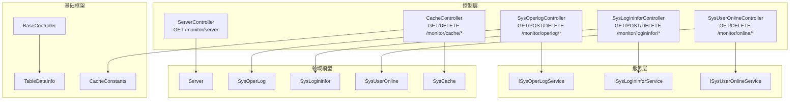
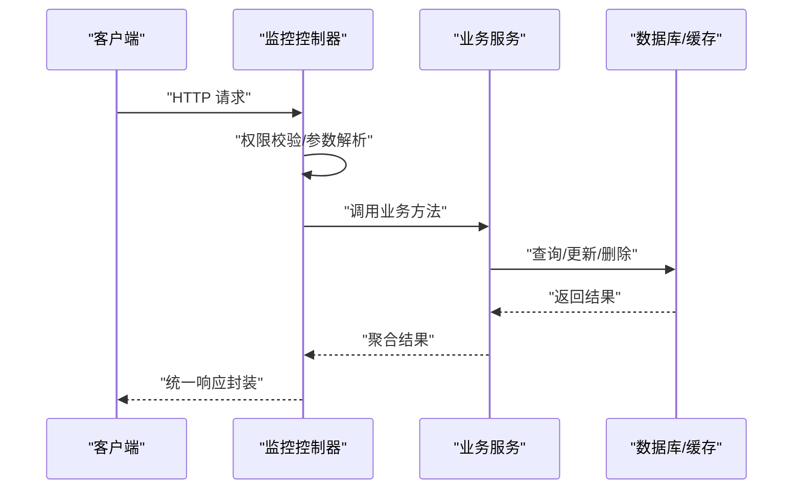
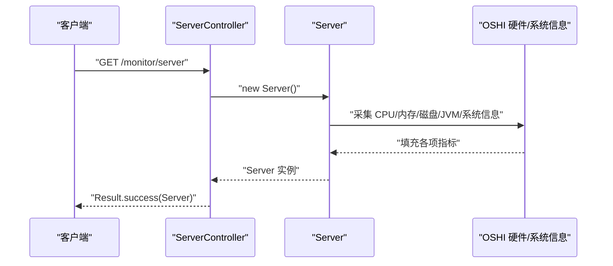
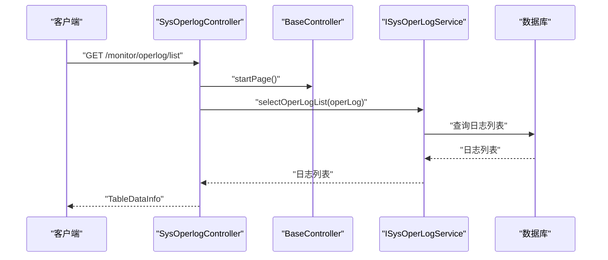
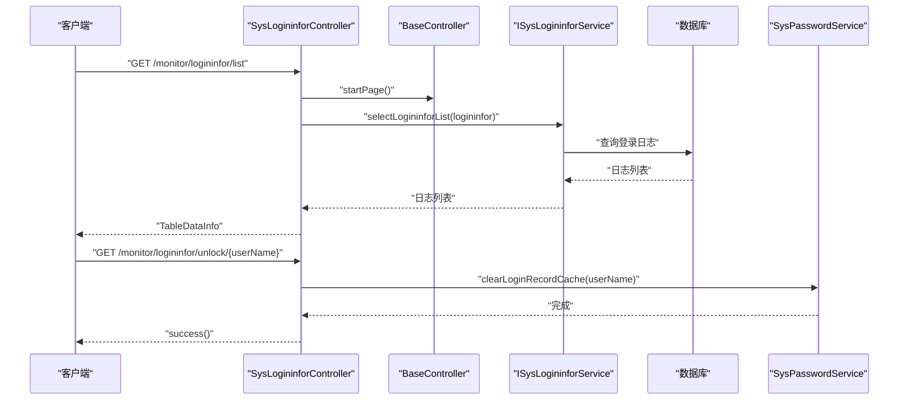
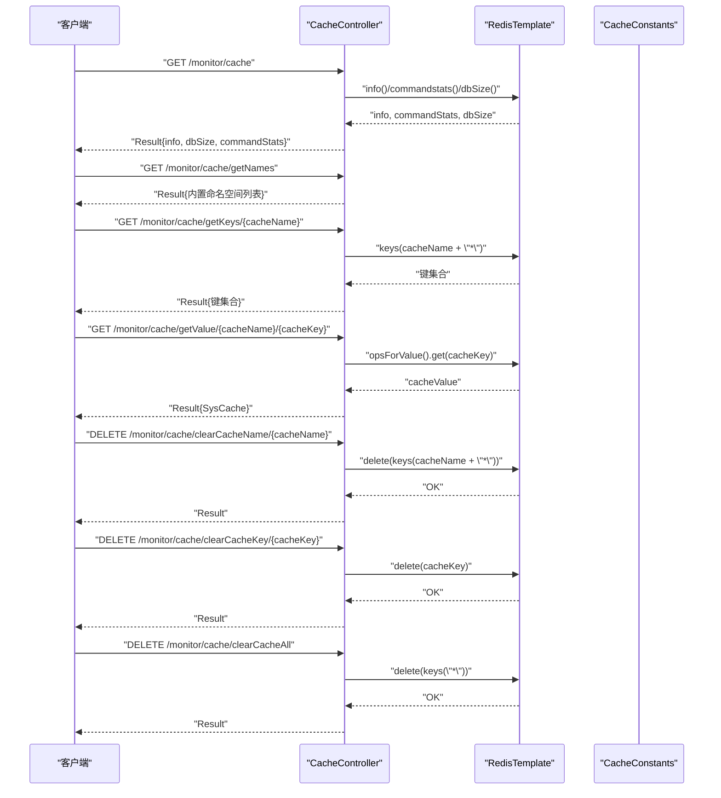
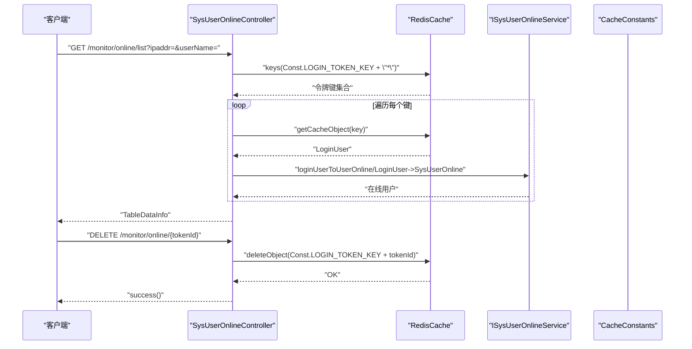
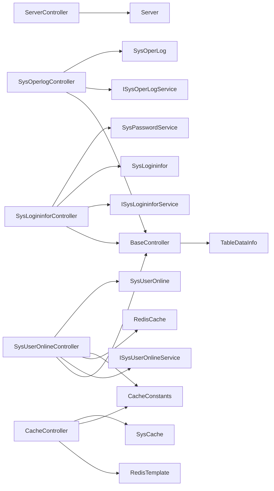

# 监控接口

<cite>
**本文引用的文件**
- [ServerController.java](file://blog-admin/src/main/java/blog/web/controller/monitor/ServerController.java)
- [SysOperlogController.java](file://blog-admin/src/main/java/blog/web/controller/monitor/SysOperlogController.java)
- [SysLogininforController.java](file://blog-admin/src/main/java/blog/web/controller/monitor/SysLogininforController.java)
- [CacheController.java](file://blog-admin/src/main/java/blog/web/controller/monitor/CacheController.java)
- [SysUserOnlineController.java](file://blog-admin/src/main/java/blog/web/controller/monitor/SysUserOnlineController.java)
- [Server.java](file://blog-framework/src/main/java/blog/framework/web/domain/Server.java)
- [SysOperLog.java](file://blog-system/src/main/java/blog/system/domain/SysOperLog.java)
- [SysLogininfor.java](file://blog-system/src/main/java/blog/system/domain/SysLogininfor.java)
- [SysUserOnline.java](file://blog-system/src/main/java/blog/system/domain/SysUserOnline.java)
- [SysCache.java](file://blog-system/src/main/java/blog/system/domain/SysCache.java)
- [ISysOperLogService.java](file://blog-system/src/main/java/blog/system/service/ISysOperLogService.java)
- [ISysLogininforService.java](file://blog-system/src/main/java/blog/system/service/ISysLogininforService.java)
- [ISysUserOnlineService.java](file://blog-system/src/main/java/blog/system/service/ISysUserOnlineService.java)
- [BaseController.java](file://blog-common/src/main/java/blog/common/base/controller/BaseController.java)
- [TableDataInfo.java](file://blog-common/src/main/java/blog/common/base/resp/TableDataInfo.java)
- [CacheConstants.java](file://blog-common/src/main/java/blog/common/constant/CacheConstants.java)
</cite>

## 目录
1. [简介](#简介)
2. [项目结构](#项目结构)
3. [核心组件](#核心组件)
4. [架构总览](#架构总览)
5. [详细组件分析](#详细组件分析)
6. [依赖分析](#依赖分析)
7. [性能考虑](#性能考虑)
8. [故障排查指南](#故障排查指南)
9. [结论](#结论)
10. [附录](#附录)

## 简介
本文件为 Leejie 博客系统的监控接口 API 文档，覆盖以下监控能力：
- 服务器监控：GET /monitor/server，用于获取系统 CPU、内存、磁盘、JVM 等硬件与运行时信息。
- 操作日志监控：GET /monitor/operlog/list，支持分页、筛选与导出；支持批量删除与清空。
- 登录日志监控：GET /monitor/logininfor/list，支持分页、筛选与导出；支持批量删除、清空与账户解锁。
- 缓存监控：GET /monitor/cache 及相关缓存查询与清理接口，用于查看 Redis 运行状态、命令统计、键名与值，并支持按命名空间清理。
- 在线用户监控：GET /monitor/online/list，支持按 IP 或用户名过滤；支持强制下线。
- 可视化与高级功能：当前仓库未提供专用“图表数据生成/趋势分析/告警阈值”接口，但可基于现有分页与筛选能力进行二次开发。

## 项目结构
监控相关代码主要分布在如下模块与包中：
- 控制器层：blog-admin 的 monitor 包，包含各监控接口控制器。
- 领域模型：blog-system 的 domain 包，包含操作日志、登录日志、在线用户、缓存信息等实体。
- 服务层：blog-system 的 service 包，定义日志与在线用户的服务接口。
- 基础框架：blog-common 的 base 与 constant 包，提供 BaseController、分页响应对象与缓存键常量。
- 服务器信息采集：blog-framework 的 Server 与子域对象，封装 CPU、内存、磁盘、JVM 等采集逻辑。

**图示来源**
- [ServerController.java:15-25](file://blog-admin/src/main/java/blog/web/controller/monitor/ServerController.java#L15-L25)
- [SysOperlogController.java:28-65](file://blog-admin/src/main/java/blog/web/controller/monitor/SysOperlogController.java#L28-L65)
- [SysLogininforController.java:29-77](file://blog-admin/src/main/java/blog/web/controller/monitor/SysLogininforController.java#L29-L77)
- [CacheController.java:31-116](file://blog-admin/src/main/java/blog/web/controller/monitor/CacheController.java#L31-L116)
- [SysUserOnlineController.java:32-73](file://blog-admin/src/main/java/blog/web/controller/monitor/SysUserOnlineController.java#L32-L73)
- [Server.java:31-221](file://blog-framework/src/main/java/blog/framework/web/domain/Server.java#L31-L221)
- [SysOperLog.java:19-134](file://blog-system/src/main/java/blog/system/domain/SysOperLog.java#L19-L134)
- [SysLogininfor.java:16-147](file://blog-system/src/main/java/blog/system/domain/SysLogininfor.java#L16-L147)
- [SysUserOnline.java:8-113](file://blog-system/src/main/java/blog/system/domain/SysUserOnline.java#L8-L113)
- [SysCache.java:10-78](file://blog-system/src/main/java/blog/system/domain/SysCache.java#L10-L78)
- [ISysOperLogService.java:13-49](file://blog-system/src/main/java/blog/system/service/ISysOperLogService.java#L13-L49)
- [ISysLogininforService.java:13-41](file://blog-system/src/main/java/blog/system/service/ISysLogininforService.java#L13-L41)
- [ISysUserOnlineService.java:11-47](file://blog-system/src/main/java/blog/system/service/ISysUserOnlineService.java#L11-L47)
- [BaseController.java:30-182](file://blog-common/src/main/java/blog/common/base/controller/BaseController.java#L30-L182)
- [TableDataInfo.java:14-98](file://blog-common/src/main/java/blog/common/base/resp/TableDataInfo.java#L14-L98)
- [CacheConstants.java:8-43](file://blog-common/src/main/java/blog/common/constant/CacheConstants.java#L8-L43)

**章节来源**
- [ServerController.java:15-25](file://blog-admin/src/main/java/blog/web/controller/monitor/ServerController.java#L15-L25)
- [SysOperlogController.java:28-65](file://blog-admin/src/main/java/blog/web/controller/monitor/SysOperlogController.java#L28-L65)
- [SysLogininforController.java:29-77](file://blog-admin/src/main/java/blog/web/controller/monitor/SysLogininforController.java#L29-L77)
- [CacheController.java:31-116](file://blog-admin/src/main/java/blog/web/controller/monitor/CacheController.java#L31-L116)
- [SysUserOnlineController.java:32-73](file://blog-admin/src/main/java/blog/web/controller/monitor/SysUserOnlineController.java#L32-L73)

## 核心组件
- 服务器监控接口：负责采集并返回 CPU、内存、磁盘、JVM、系统信息等。
- 操作日志接口：提供列表查询、导出、删除、清空等能力。
- 登录日志接口：提供列表查询、导出、删除、清空、账户解锁等能力。
- 缓存监控接口：提供 Redis 运行信息、命令统计、键名/值查询与清理能力。
- 在线用户接口：提供在线用户列表查询与强制下线能力。
- 响应与分页：统一由 BaseController 与 TableDataInfo 提供分页与响应封装。

**章节来源**
- [Server.java:31-221](file://blog-framework/src/main/java/blog/framework/web/domain/Server.java#L31-L221)
- [SysOperLog.java:19-134](file://blog-system/src/main/java/blog/system/domain/SysOperLog.java#L19-L134)
- [SysLogininfor.java:16-147](file://blog-system/src/main/java/blog/system/domain/SysLogininfor.java#L16-L147)
- [SysUserOnline.java:8-113](file://blog-system/src/main/java/blog/system/domain/SysUserOnline.java#L8-L113)
- [SysCache.java:10-78](file://blog-system/src/main/java/blog/system/domain/SysCache.java#L10-L78)
- [BaseController.java:30-182](file://blog-common/src/main/java/blog/common/base/controller/BaseController.java#L30-L182)
- [TableDataInfo.java:14-98](file://blog-common/src/main/java/blog/common/base/resp/TableDataInfo.java#L14-L98)

## 架构总览
监控接口采用标准的 MVC 架构：
- 控制器接收请求，执行权限校验与参数绑定。
- 服务层负责业务逻辑与数据访问。
- 领域模型承载数据结构。
- 基础框架提供分页、响应封装与缓存键常量。

**图示来源**
- [ServerController.java:18-24](file://blog-admin/src/main/java/blog/web/controller/monitor/ServerController.java#L18-L24)
- [SysOperlogController.java:34-40](file://blog-admin/src/main/java/blog/web/controller/monitor/SysOperlogController.java#L34-L40)
- [SysLogininforController.java:38-44](file://blog-admin/src/main/java/blog/web/controller/monitor/SysLogininforController.java#L38-L44)
- [CacheController.java:50-71](file://blog-admin/src/main/java/blog/web/controller/monitor/CacheController.java#L50-L71)
- [SysUserOnlineController.java:41-61](file://blog-admin/src/main/java/blog/web/controller/monitor/SysUserOnlineController.java#L41-L61)

## 详细组件分析

### 服务器监控接口
- 接口路径：GET /monitor/server
- 权限标识：monitor:server:list
- 功能描述：采集并返回服务器 CPU 使用率、内存占用、磁盘空间、JVM 内存与版本、系统信息等。
- 数据来源：Server 对象通过 OSHI 库采集硬件与系统信息，并在 copyTo 中完成 CPU、内存、系统、JVM、文件系统等字段填充。
- 返回结构：Result.success(Server)

**图示来源**
- [ServerController.java:18-24](file://blog-admin/src/main/java/blog/web/controller/monitor/ServerController.java#L18-L24)
- [Server.java:99-116](file://blog-framework/src/main/java/blog/framework/web/domain/Server.java#L99-L116)
- [Server.java:121-141](file://blog-framework/src/main/java/blog/framework/web/domain/Server.java#L121-L141)
- [Server.java:146-150](file://blog-framework/src/main/java/blog/framework/web/domain/Server.java#L146-L150)
- [Server.java:155-162](file://blog-framework/src/main/java/blog/framework/web/domain/Server.java#L155-L162)
- [Server.java:167-174](file://blog-framework/src/main/java/blog/framework/web/domain/Server.java#L167-L174)
- [Server.java:179-196](file://blog-framework/src/main/java/blog/framework/web/domain/Server.java#L179-L196)

**章节来源**
- [ServerController.java:18-24](file://blog-admin/src/main/java/blog/web/controller/monitor/ServerController.java#L18-L24)
- [Server.java:99-221](file://blog-framework/src/main/java/blog/framework/web/domain/Server.java#L99-L221)

### 操作日志接口
- 接口路径：GET /monitor/operlog/list
- 权限标识：monitor:operlog:list
- 功能描述：分页查询操作日志，支持按模块、业务类型、请求方法、状态、时间范围等条件筛选；支持导出、批量删除、清空。
- 请求参数：SysOperLog（实体字段映射到查询条件）
- 响应结构：TableDataInfo<List<SysOperLog>>
- 关键流程：BaseController.startPage() 分页；ISysOperLogService.selectOperLogList() 查询；getDataTable() 统一封装。

**图示来源**
- [SysOperlogController.java:34-40](file://blog-admin/src/main/java/blog/web/controller/monitor/SysOperlogController.java#L34-L40)
- [BaseController.java:50-83](file://blog-common/src/main/java/blog/common/base/controller/BaseController.java#L50-L83)
- [ISysOperLogService.java:27-27](file://blog-system/src/main/java/blog/system/service/ISysOperLogService.java#L27-L27)
- [SysOperLog.java:19-134](file://blog-system/src/main/java/blog/system/domain/SysOperLog.java#L19-L134)

**章节来源**
- [SysOperlogController.java:34-65](file://blog-admin/src/main/java/blog/web/controller/monitor/SysOperlogController.java#L34-L65)
- [BaseController.java:50-83](file://blog-common/src/main/java/blog/common/base/controller/BaseController.java#L50-L83)
- [ISysOperLogService.java:13-49](file://blog-system/src/main/java/blog/system/service/ISysOperLogService.java#L13-L49)
- [SysOperLog.java:19-134](file://blog-system/src/main/java/blog/system/domain/SysOperLog.java#L19-L134)

### 登录日志接口
- 接口路径：GET /monitor/logininfor/list
- 权限标识：monitor:logininfor:list
- 功能描述：分页查询登录日志，支持按用户账号、登录状态、IP 地址、时间范围等条件筛选；支持导出、批量删除、清空、账户解锁。
- 请求参数：SysLogininfor（实体字段映射到查询条件）
- 响应结构：TableDataInfo<List<SysLogininfor>>
- 关键流程：BaseController.startPage() 分页；ISysLogininforService.selectLogininforList() 查询；getDataTable() 统一封装；解锁接口通过 SysPasswordService.clearLoginRecordCache() 清理缓存。

**图示来源**
- [SysLogininforController.java:38-44](file://blog-admin/src/main/java/blog/web/controller/monitor/SysLogininforController.java#L38-L44)
- [SysLogininforController.java:70-76](file://blog-admin/src/main/java/blog/web/controller/monitor/SysLogininforController.java#L70-L76)
- [BaseController.java:50-83](file://blog-common/src/main/java/blog/common/base/controller/BaseController.java#L50-L83)
- [ISysLogininforService.java:27-27](file://blog-system/src/main/java/blog/system/service/ISysLogininforService.java#L27-L27)
- [SysLogininfor.java:16-147](file://blog-system/src/main/java/blog/system/domain/SysLogininfor.java#L16-L147)

**章节来源**
- [SysLogininforController.java:38-76](file://blog-admin/src/main/java/blog/web/controller/monitor/SysLogininforController.java#L38-L76)
- [ISysLogininforService.java:13-41](file://blog-system/src/main/java/blog/system/service/ISysLogininforService.java#L13-L41)
- [SysLogininfor.java:16-147](file://blog-system/src/main/java/blog/system/domain/SysLogininfor.java#L16-L147)

### 缓存监控接口
- 接口路径：GET /monitor/cache
- 权限标识：monitor:cache:list
- 功能描述：获取 Redis 运行信息（info）、数据库大小（dbSize）与命令统计（command stats），并转换为饼图数据格式。
- 其他接口：
  - GET /monitor/cache/getNames：返回内置缓存命名空间列表（如登录令牌、配置、字典、验证码等）。
  - GET /monitor/cache/getKeys/{cacheName}：根据命名空间通配符列出键名集合。
  - GET /monitor/cache/getValue/{cacheName}/{cacheKey}：获取指定键值。
  - DELETE /monitor/cache/clearCacheName/{cacheName}：按命名空间清理。
  - DELETE /monitor/cache/clearCacheKey/{cacheKey}：按键名清理。
  - DELETE /monitor/cache/clearCacheAll：清空所有缓存。
- 数据来源：RedisTemplate 执行原生命令，SysCache 封装缓存键值信息。

**图示来源**
- [CacheController.java:50-116](file://blog-admin/src/main/java/blog/web/controller/monitor/CacheController.java#L50-L116)
- [CacheConstants.java:8-43](file://blog-common/src/main/java/blog/common/constant/CacheConstants.java#L8-L43)
- [SysCache.java:10-78](file://blog-system/src/main/java/blog/system/domain/SysCache.java#L10-L78)

**章节来源**
- [CacheController.java:50-116](file://blog-admin/src/main/java/blog/web/controller/monitor/CacheController.java#L50-L116)
- [CacheConstants.java:8-43](file://blog-common/src/main/java/blog/common/constant/CacheConstants.java#L8-L43)
- [SysCache.java:10-78](file://blog-system/src/main/java/blog/system/domain/SysCache.java#L10-L78)

### 在线用户监控接口
- 接口路径：GET /monitor/online/list
- 权限标识：monitor:online:list
- 功能描述：从 Redis 中枚举登录令牌键，解析在线用户信息，支持按 IP 地址或用户名过滤；返回分页列表。
- 强退用户：DELETE /monitor/online/{tokenId}，通过删除对应令牌键实现强制下线。
- 数据来源：RedisCache 读取登录令牌键，ISysUserOnlineService 转换为在线用户对象。

**图示来源**
- [SysUserOnlineController.java:41-72](file://blog-admin/src/main/java/blog/web/controller/monitor/SysUserOnlineController.java#L41-L72)
- [CacheConstants.java:12-12](file://blog-common/src/main/java/blog/common/constant/CacheConstants.java#L12-L12)
- [ISysUserOnlineService.java:11-47](file://blog-system/src/main/java/blog/system/service/ISysUserOnlineService.java#L11-L47)
- [SysUserOnline.java:8-113](file://blog-system/src/main/java/blog/system/domain/SysUserOnline.java#L8-L113)

**章节来源**
- [SysUserOnlineController.java:41-72](file://blog-admin/src/main/java/blog/web/controller/monitor/SysUserOnlineController.java#L41-L72)
- [ISysUserOnlineService.java:11-47](file://blog-system/src/main/java/blog/system/service/ISysUserOnlineService.java#L11-L47)
- [SysUserOnline.java:8-113](file://blog-system/src/main/java/blog/system/domain/SysUserOnline.java#L8-L113)

### 可视化与高级功能
- 图表数据生成：当前仓库未提供专用接口。可基于 /monitor/operlog/list 与 /monitor/logininfor/list 的分页与筛选结果，结合前端图表库进行趋势分析与可视化。
- 趋势分析：建议在前端按时间字段（操作时间/登录时间）进行分组统计，再调用现有分页接口进行数据拉取。
- 告警阈值：当前仓库未提供专用接口。可在前端或独立告警服务中配置阈值，结合现有日志与缓存接口进行触发判断。

[本节为概念性说明，不直接分析具体文件，故不附“章节来源”]

## 依赖分析
- 控制器依赖：
  - ServerController 依赖 Server 模型。
  - SysOperlogController 依赖 BaseController、ISysOperLogService、SysOperLog。
  - SysLogininforController 依赖 BaseController、ISysLogininforService、SysLogininfor、SysPasswordService。
  - CacheController 依赖 RedisTemplate、CacheConstants、SysCache。
  - SysUserOnlineController 依赖 BaseController、ISysUserOnlineService、RedisCache、CacheConstants、SysUserOnline。
- 响应与分页：BaseController 提供 startPage、getDataTable；TableDataInfo 统一分页响应结构。
- 缓存键常量：CacheConstants 定义登录令牌、验证码、配置、字典、防重提交、限流、密码错误次数等键前缀。

**图示来源**
- [ServerController.java:18-24](file://blog-admin/src/main/java/blog/web/controller/monitor/ServerController.java#L18-L24)
- [SysOperlogController.java:31-32](file://blog-admin/src/main/java/blog/web/controller/monitor/SysOperlogController.java#L31-L32)
- [SysLogininforController.java:32-36](file://blog-admin/src/main/java/blog/web/controller/monitor/SysLogininforController.java#L32-L36)
- [CacheController.java:34-35](file://blog-admin/src/main/java/blog/web/controller/monitor/CacheController.java#L34-L35)
- [SysUserOnlineController.java:35-39](file://blog-admin/src/main/java/blog/web/controller/monitor/SysUserOnlineController.java#L35-L39)
- [BaseController.java:50-83](file://blog-common/src/main/java/blog/common/base/controller/BaseController.java#L50-L83)
- [TableDataInfo.java:14-98](file://blog-common/src/main/java/blog/common/base/resp/TableDataInfo.java#L14-L98)
- [CacheConstants.java:8-43](file://blog-common/src/main/java/blog/common/constant/CacheConstants.java#L8-L43)

**章节来源**
- [BaseController.java:50-83](file://blog-common/src/main/java/blog/common/base/controller/BaseController.java#L50-L83)
- [TableDataInfo.java:14-98](file://blog-common/src/main/java/blog/common/base/resp/TableDataInfo.java#L14-L98)
- [CacheConstants.java:8-43](file://blog-common/src/main/java/blog/common/constant/CacheConstants.java#L8-L43)

## 性能考虑
- 分页与排序：统一通过 BaseController.startPage() 与 TableSupport 构建分页与排序参数，避免一次性加载大量日志数据。
- Redis 查询：缓存查询使用 keys 通配与 opsForValue 读取，建议在高并发场景下控制通配范围与批量清理频率。
- 服务器信息采集：Server.copyTo() 中涉及硬件与系统信息采集，建议在定时任务中异步采集并缓存，避免频繁同步调用影响接口性能。
- 导出与清理：导出与清空操作可能产生较大数据量，建议在后台任务中执行并提供进度反馈。

[本节为通用指导，不直接分析具体文件，故不附“章节来源”]

## 故障排查指南
- 权限不足：各接口均使用 @PreAuthorize 校验权限，若返回权限不足，请确认用户角色是否具备相应权限标识。
- 分页异常：检查前端传参与后端分页参数绑定是否一致，确保 BaseController.startPage() 正常生效。
- Redis 连接问题：缓存接口依赖 RedisTemplate，若连接失败，请检查 Redis 服务状态与连接配置。
- 日志导出失败：导出使用 ExcelUtil，需确保实体字段映射正确且响应输出流可用。
- 在线用户为空：确认 Redis 中登录令牌键是否存在，以及 ISysUserOnlineService 是否能正确转换为在线用户对象。

**章节来源**
- [ServerController.java:18-18](file://blog-admin/src/main/java/blog/web/controller/monitor/ServerController.java#L18-L18)
- [SysOperlogController.java:34-34](file://blog-admin/src/main/java/blog/web/controller/monitor/SysOperlogController.java#L34-L34)
- [SysLogininforController.java:38-38](file://blog-admin/src/main/java/blog/web/controller/monitor/SysLogininforController.java#L38-L38)
- [CacheController.java:50-50](file://blog-admin/src/main/java/blog/web/controller/monitor/CacheController.java#L50-L50)
- [SysUserOnlineController.java:41-41](file://blog-admin/src/main/java/blog/web/controller/monitor/SysUserOnlineController.java#L41-L41)

## 结论
本监控接口体系覆盖了服务器、操作日志、登录日志、缓存与在线用户的全链路监控能力，配合统一的分页与响应封装，能够满足日常运维与安全审计需求。对于图表与告警等高级可视化功能，可在现有接口基础上扩展或引入独立的可视化与告警模块。

[本节为总结性内容，不直接分析具体文件，故不附“章节来源”]

## 附录
- 统一响应结构：TableDataInfo 提供 total、rows、code、msg 字段，便于前端统一处理。
- 缓存键常量：CacheConstants 定义常用缓存键前缀，便于缓存监控与清理。

**章节来源**
- [TableDataInfo.java:14-98](file://blog-common/src/main/java/blog/common/base/resp/TableDataInfo.java#L14-L98)
- [CacheConstants.java:8-43](file://blog-common/src/main/java/blog/common/constant/CacheConstants.java#L8-L43)