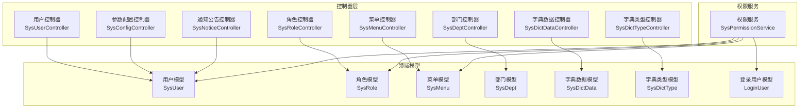
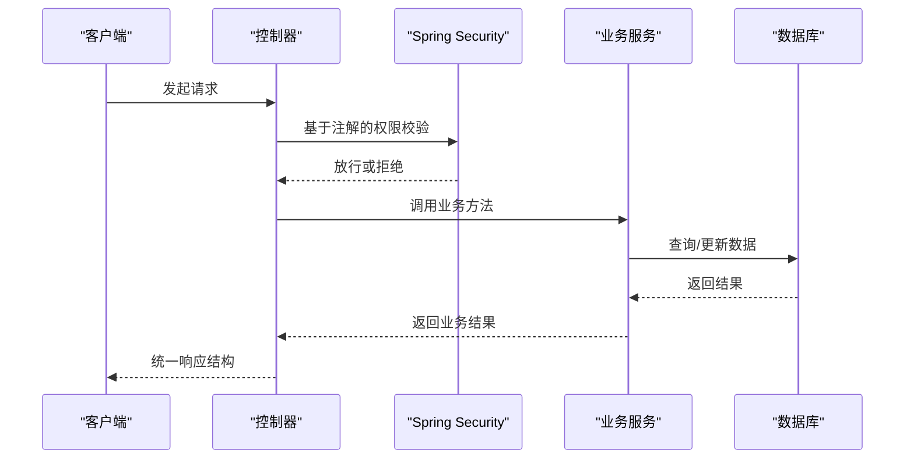
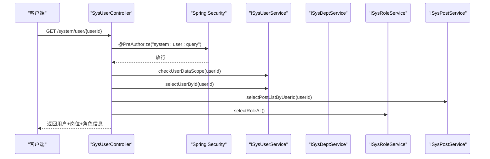
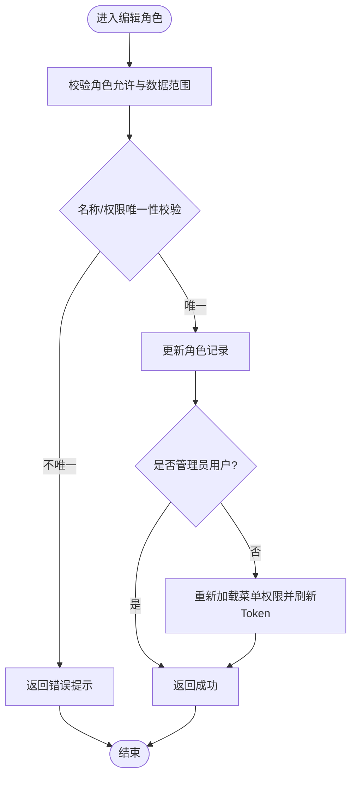
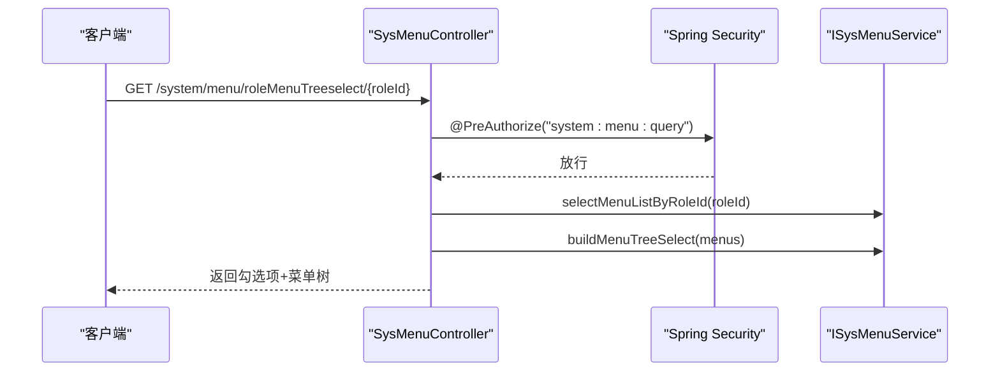
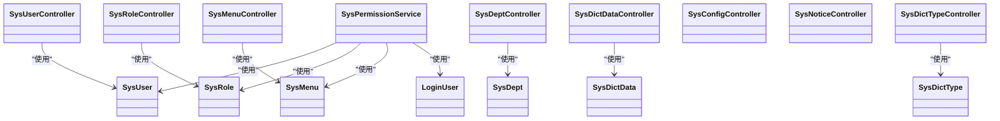

# 系统管理接口

<cite>
**本文引用的文件**
- [SysUserController.java](file://blog-admin/src/main/java/blog/web/controller/system/SysUserController.java)
- [SysRoleController.java](file://blog-admin/src/main/java/blog/web/controller/system/SysRoleController.java)
- [SysMenuController.java](file://blog-admin/src/main/java/blog/web/controller/system/SysMenuController.java)
- [SysDeptController.java](file://blog-admin/src/main/java/blog/web/controller/system/SysDeptController.java)
- [SysDictDataController.java](file://blog-admin/src/main/java/blog/web/controller/system/SysDictDataController.java)
- [SysDictTypeController.java](file://blog-admin/src/main/java/blog/web/controller/system/SysDictTypeController.java)
- [SysConfigController.java](file://blog-admin/src/main/java/blog/web/controller/system/SysConfigController.java)
- [SysNoticeController.java](file://blog-admin/src/main/java/blog/web/controller/system/SysNoticeController.java)
- [SysUser.java](file://blog-common/src/main/java/blog/common/core/domain/entity/SysUser.java)
- [SysRole.java](file://blog-common/src/main/java/blog/common/core/domain/entity/SysRole.java)
- [SysMenu.java](file://blog-common/src/main/java/blog/common/core/domain/entity/SysMenu.java)
- [SysDept.java](file://blog-common/src/main/java/blog/common/core/domain/entity/SysDept.java)
- [SysDictData.java](file://blog-common/src/main/java/blog/common/core/domain/entity/SysDictData.java)
- [SysDictType.java](file://blog-common/src/main/java/blog/common/core/domain/entity/SysDictType.java)
- [LoginUser.java](file://blog-common/src/main/java/blog/common/core/domain/model/LoginUser.java)
- [SysPermissionService.java](file://blog-framework/src/main/java/blog/framework/web/service/SysPermissionService.java)
</cite>

## 目录
1. [简介](#简介)
2. [项目结构](#项目结构)
3. [核心组件](#核心组件)
4. [架构总览](#架构总览)
5. [详细组件分析](#详细组件分析)
6. [依赖分析](#依赖分析)
7. [性能考虑](#性能考虑)
8. [故障排查指南](#故障排查指南)
9. [结论](#结论)
10. [附录](#附录)

## 简介
本文件为 Leejie 博客系统的“系统管理接口”提供完整、可操作的 API 文档，覆盖用户管理、角色管理、菜单权限、部门管理、字典数据、系统配置与通知公告等模块。文档同时阐述权限控制机制（基于注解的权限校验、动态权限加载、权限缓存策略），并给出关键流程图与时序图，帮助开发者与测试人员快速理解与集成。

## 项目结构
系统管理相关接口集中在 blog-admin 的 system 包控制器中，实体模型位于 blog-common 的 entity 与 model 包中，权限处理逻辑位于 blog-framework 的 service 包中。整体采用分层架构：Controller → Service → Mapper，配合 Spring Security 注解完成权限控制。

图表来源
- [SysUserController.java:42-233](file://blog-admin/src/main/java/blog/web/controller/system/SysUserController.java#L42-L233)
- [SysRoleController.java:40-240](file://blog-admin/src/main/java/blog/web/controller/system/SysRoleController.java#L40-L240)
- [SysMenuController.java:30-125](file://blog-admin/src/main/java/blog/web/controller/system/SysMenuController.java#L30-L125)
- [SysDeptController.java:31-119](file://blog-admin/src/main/java/blog/web/controller/system/SysDeptController.java#L31-L119)
- [SysDictDataController.java:34-114](file://blog-admin/src/main/java/blog/web/controller/system/SysDictDataController.java#L34-L114)
- [SysDictTypeController.java:31-122](file://blog-admin/src/main/java/blog/web/controller/system/SysDictTypeController.java#L31-L122)
- [SysConfigController.java:31-124](file://blog-admin/src/main/java/blog/web/controller/system/SysConfigController.java#L31-L124)
- [SysNoticeController.java:29-87](file://blog-admin/src/main/java/blog/web/controller/system/SysNoticeController.java#L29-L87)
- [SysUser.java:23-339](file://blog-common/src/main/java/blog/common/core/domain/entity/SysUser.java#L23-L339)
- [SysRole.java:20-240](file://blog-common/src/main/java/blog/common/core/domain/entity/SysRole.java#L20-L240)
- [SysMenu.java:19-277](file://blog-common/src/main/java/blog/common/core/domain/entity/SysMenu.java#L19-L277)
- [SysDept.java:21-95](file://blog-common/src/main/java/blog/common/core/domain/entity/SysDept.java#L21-L95)
- [SysDictData.java:19-93](file://blog-common/src/main/java/blog/common/core/domain/entity/SysDictData.java#L19-L93)
- [SysDictType.java:19-100](file://blog-common/src/main/java/blog/common/core/domain/entity/SysDictType.java#L19-L100)
- [LoginUser.java:16-235](file://blog-common/src/main/java/blog/common/core/domain/model/LoginUser.java#L16-L235)
- [SysPermissionService.java:22-76](file://blog-framework/src/main/java/blog/framework/web/service/SysPermissionService.java#L22-L76)

章节来源
- [SysUserController.java:42-233](file://blog-admin/src/main/java/blog/web/controller/system/SysUserController.java#L42-L233)
- [SysRoleController.java:40-240](file://blog-admin/src/main/java/blog/web/controller/system/SysRoleController.java#L40-L240)
- [SysMenuController.java:30-125](file://blog-admin/src/main/java/blog/web/controller/system/SysMenuController.java#L30-L125)
- [SysDeptController.java:31-119](file://blog-admin/src/main/java/blog/web/controller/system/SysDeptController.java#L31-L119)
- [SysDictDataController.java:34-114](file://blog-admin/src/main/java/blog/web/controller/system/SysDictDataController.java#L34-L114)
- [SysDictTypeController.java:31-122](file://blog-admin/src/main/java/blog/web/controller/system/SysDictTypeController.java#L31-L122)
- [SysConfigController.java:31-124](file://blog-admin/src/main/java/blog/web/controller/system/SysConfigController.java#L31-L124)
- [SysNoticeController.java:29-87](file://blog-admin/src/main/java/blog/web/controller/system/SysNoticeController.java#L29-L87)

## 核心组件
- 控制器层：提供 RESTful 接口，统一返回结构，结合 Spring Security 注解进行权限校验。
- 领域模型：用户、角色、菜单、部门、字典、登录用户等实体，承载业务数据与约束。
- 权限服务：负责角色权限与菜单权限的聚合计算，支持管理员全权与普通用户按角色/数据范围的权限组合。

章节来源
- [SysUserController.java:42-233](file://blog-admin/src/main/java/blog/web/controller/system/SysUserController.java#L42-L233)
- [SysRoleController.java:40-240](file://blog-admin/src/main/java/blog/web/controller/system/SysRoleController.java#L40-L240)
- [SysMenuController.java:30-125](file://blog-admin/src/main/java/blog/web/controller/system/SysMenuController.java#L30-L125)
- [SysDeptController.java:31-119](file://blog-admin/src/main/java/blog/web/controller/system/SysDeptController.java#L31-L119)
- [SysDictDataController.java:34-114](file://blog-admin/src/main/java/blog/web/controller/system/SysDictDataController.java#L34-L114)
- [SysDictTypeController.java:31-122](file://blog-admin/src/main/java/blog/web/controller/system/SysDictTypeController.java#L31-L122)
- [SysConfigController.java:31-124](file://blog-admin/src/main/java/blog/web/controller/system/SysConfigController.java#L31-L124)
- [SysNoticeController.java:29-87](file://blog-admin/src/main/java/blog/web/controller/system/SysNoticeController.java#L29-L87)
- [SysUser.java:23-339](file://blog-common/src/main/java/blog/common/core/domain/entity/SysUser.java#L23-L339)
- [SysRole.java:20-240](file://blog-common/src/main/java/blog/common/core/domain/entity/SysRole.java#L20-L240)
- [SysMenu.java:19-277](file://blog-common/src/main/java/blog/common/core/domain/entity/SysMenu.java#L19-L277)
- [SysDept.java:21-95](file://blog-common/src/main/java/blog/common/core/domain/entity/SysDept.java#L21-L95)
- [SysDictData.java:19-93](file://blog-common/src/main/java/blog/common/core/domain/entity/SysDictData.java#L19-L93)
- [SysDictType.java:19-100](file://blog-common/src/main/java/blog/common/core/domain/entity/SysDictType.java#L19-L100)
- [LoginUser.java:16-235](file://blog-common/src/main/java/blog/common/core/domain/model/LoginUser.java#L16-L235)
- [SysPermissionService.java:22-76](file://blog-framework/src/main/java/blog/framework/web/service/SysPermissionService.java#L22-L76)

## 架构总览
系统管理接口遵循“控制器-服务-持久层”的分层设计，权限通过 Spring Security 注解在控制器层面拦截，权限服务在运行时聚合角色与菜单权限，并在角色变更时刷新当前登录用户的权限缓存。

图表来源
- [SysUserController.java:60-133](file://blog-admin/src/main/java/blog/web/controller/system/SysUserController.java#L60-L133)
- [SysRoleController.java:88-129](file://blog-admin/src/main/java/blog/web/controller/system/SysRoleController.java#L88-L129)
- [SysPermissionService.java:36-74](file://blog-framework/src/main/java/blog/framework/web/service/SysPermissionService.java#L36-L74)

## 详细组件分析

### 用户管理接口
- 功能概览
  - 用户列表查询、导出、导入模板下载、批量导入
  - 用户详情查询（含岗位与角色集合）
  - 新增、修改、删除用户
  - 重置密码、状态变更
  - 用户授权角色、查看授权角色
  - 部门树选择（用于选择所属部门）

- 关键接口
  - GET /system/user/list：分页查询用户列表
  - POST /system/user/export：导出用户数据
  - POST /system/user/importData：导入用户数据
  - POST /system/user/importTemplate：下载导入模板
  - GET /system/user 或 GET /system/user/{userId}：获取用户详情与可选角色/岗位
  - POST /system/user：新增用户
  - PUT /system/user：修改用户
  - DELETE /system/user/{userIds}：删除用户
  - PUT /system/user/resetPwd：重置密码
  - PUT /system/user/changeStatus：修改状态
  - GET /system/user/authRole/{userId}：查看用户授权角色
  - PUT /system/user/authRole：授权角色
  - GET /system/user/deptTree：部门树选择

- 权限控制
  - 使用 @PreAuthorize 结合权限表达式，如 system:user:list、system:user:query、system:user:add、system:user:edit、system:user:remove、system:user:export、system:user:import、system:user:resetPwd 等。

- 数据模型
  - 用户实体包含账号、昵称、邮箱、手机、性别、头像、状态、部门、角色、岗位等字段。

- 错误处理与校验
  - 用户名/手机号/邮箱唯一性校验
  - 当前用户不可删除保护
  - 数据范围校验（部门/角色数据范围）

章节来源
- [SysUserController.java:57-233](file://blog-admin/src/main/java/blog/web/controller/system/SysUserController.java#L57-L233)
- [SysUser.java:23-339](file://blog-common/src/main/java/blog/common/core/domain/entity/SysUser.java#L23-L339)

#### 用户管理时序图

图表来源
- [SysUserController.java:94-112](file://blog-admin/src/main/java/blog/web/controller/system/SysUserController.java#L94-L112)

### 角色管理接口
- 功能概览
  - 角色列表查询、导出
  - 角色详情查询（含数据范围、菜单/部门勾选项）
  - 新增、修改、删除角色
  - 角色状态变更、数据权限配置
  - 已分配/未分配用户查询与批量授权/取消授权
  - 对应角色的部门树选择

- 关键接口
  - GET /system/role/list：分页查询角色列表
  - POST /system/role/export：导出角色数据
  - GET /system/role/{roleId}：获取角色详情
  - POST /system/role：新增角色
  - PUT /system/role：修改角色
  - PUT /system/role/dataScope：配置数据权限
  - PUT /system/role/changeStatus：修改状态
  - DELETE /system/role/{roleIds}：删除角色
  - GET /system/role/optionselect：获取角色选择框列表
  - GET /system/role/authUser/allocatedList：已分配用户列表
  - GET /system/role/authUser/unallocatedList：未分配用户列表
  - PUT /system/role/authUser/cancel：取消授权用户
  - PUT /system/role/authUser/cancelAll：批量取消授权用户
  - PUT /system/role/authUser/selectAll：批量授权用户
  - GET /system/role/deptTree/{roleId}：角色部门树

- 权限控制
  - 使用 @PreAuthorize，如 system:role:list、system:role:query、system:role:add、system:role:edit、system:role:remove、system:role:export 等。

- 动态权限刷新
  - 修改角色成功后，若非管理员用户，会重新加载其菜单权限并刷新 Token 中的登录用户信息。

章节来源
- [SysRoleController.java:58-240](file://blog-admin/src/main/java/blog/web/controller/system/SysRoleController.java#L58-L240)
- [SysRole.java:20-240](file://blog-common/src/main/java/blog/common/core/domain/entity/SysRole.java#L20-L240)

#### 角色管理流程图

图表来源
- [SysRoleController.java:105-129](file://blog-admin/src/main/java/blog/web/controller/system/SysRoleController.java#L105-L129)

### 菜单权限接口
- 功能概览
  - 菜单列表查询（按当前用户过滤）
  - 菜单详情查询
  - 菜单树选择（用于父级选择）
  - 角色菜单树选择（勾选已授权菜单）
  - 新增、修改、删除菜单
  - 菜单路由配置（path、component、query、routeName、isFrame、isCache、visible、status、perms、icon 等）

- 关键接口
  - GET /system/menu/list：获取菜单列表
  - GET /system/menu/{menuId}：获取菜单详情
  - GET /system/menu/treeselect：菜单树选择
  - GET /system/menu/roleMenuTreeselect/{roleId}：角色菜单树选择
  - POST /system/menu：新增菜单
  - PUT /system/menu：修改菜单
  - DELETE /system/menu/{menuId}：删除菜单

- 权限控制
  - 使用 @PreAuthorize，如 system:menu:list、system:menu:query、system:menu:add、system:menu:edit、system:menu:remove 等。

- 路由与权限标识
  - 菜单类型区分目录/菜单/按钮，权限字符串用于前端按钮级权限控制。

章节来源
- [SysMenuController.java:36-125](file://blog-admin/src/main/java/blog/web/controller/system/SysMenuController.java#L36-L125)
- [SysMenu.java:19-277](file://blog-common/src/main/java/blog/common/core/domain/entity/SysMenu.java#L19-L277)

#### 菜单管理时序图

图表来源
- [SysMenuController.java:67-74](file://blog-admin/src/main/java/blog/web/controller/system/SysMenuController.java#L67-L74)

### 部门管理接口
- 功能概览
  - 部门列表查询、排除节点查询
  - 部门详情查询（含数据范围校验）
  - 新增、修改、删除部门
  - 部门树结构维护（父子关系、停用规则）

- 关键接口
  - GET /system/dept/list：获取部门列表
  - GET /system/dept/list/exclude/{deptId}：排除自身及子孙节点
  - GET /system/dept/{deptId}：获取部门详情
  - POST /system/dept：新增部门
  - PUT /system/dept：修改部门
  - DELETE /system/dept/{deptId}：删除部门

- 权限控制
  - 使用 @PreAuthorize，如 system:dept:list、system:dept:query、system:dept:add、system:dept:edit、system:dept:remove 等。

- 数据范围与停用规则
  - 停用部门需确保无未停用子部门
  - 删除部门需确保无下级部门且无用户绑定

章节来源
- [SysDeptController.java:37-119](file://blog-admin/src/main/java/blog/web/controller/system/SysDeptController.java#L37-L119)
- [SysDept.java:21-95](file://blog-common/src/main/java/blog/common/core/domain/entity/SysDept.java#L21-L95)

### 字典数据与类型接口
- 字典类型接口
  - 列表查询、导出、详情、新增、修改、删除、刷新缓存、获取选择框列表
  - 关键接口：GET/POST/PUT/DELETE /system/dict/type 与 /system/dict/type/refreshCache、/system/dict/type/optionselect

- 字典数据接口
  - 列表查询、导出、详情、按类型查询、新增、修改、删除
  - 关键接口：GET/POST/PUT/DELETE /system/dict/data 与 /system/dict/data/type/{dictType}

- 权限控制
  - 使用 @PreAuthorize，如 system:dict:list、system:dict:query、system:dict:add、system:dict:edit、system:dict:export、system:dict:remove 等。

- 缓存策略
  - 刷新缓存接口用于清理与重建字典缓存，保证前端下拉框数据一致性。

章节来源
- [SysDictTypeController.java:37-122](file://blog-admin/src/main/java/blog/web/controller/system/SysDictTypeController.java#L37-L122)
- [SysDictDataController.java:43-114](file://blog-admin/src/main/java/blog/web/controller/system/SysDictDataController.java#L43-L114)
- [SysDictType.java:19-100](file://blog-common/src/main/java/blog/common/core/domain/entity/SysDictType.java#L19-L100)
- [SysDictData.java:19-93](file://blog-common/src/main/java/blog/common/core/domain/entity/SysDictData.java#L19-L93)

### 系统配置与通知公告接口
- 参数配置接口
  - 列表查询、导出、详情、按键名查询、新增、修改、删除、刷新缓存
  - 关键接口：GET/POST/PUT/DELETE /system/config 与 /system/config/configKey/{configKey}、/system/config/refreshCache

- 通知公告接口
  - 列表查询、详情、新增、修改、删除
  - 关键接口：GET/POST/PUT/DELETE /system/notice

- 权限控制
  - 使用 @PreAuthorize，如 system:config:list、system:config:query、system:config:add、system:config:edit、system:config:export、system:config:remove、system:notice:list、system:notice:query、system:notice:add、system:notice:edit、system:notice:remove 等。

章节来源
- [SysConfigController.java:37-124](file://blog-admin/src/main/java/blog/web/controller/system/SysConfigController.java#L37-L124)
- [SysNoticeController.java:35-87](file://blog-admin/src/main/java/blog/web/controller/system/SysNoticeController.java#L35-87)

## 依赖分析
- 控制器到服务层：各控制器通过 Autowired 注入对应服务接口，调用业务方法。
- 服务到模型：服务层依赖实体模型进行数据封装与校验。
- 权限服务：聚合角色与菜单权限，支持管理员全权与多角色权限合并。
- 登录用户模型：承载当前用户信息与权限集合，用于权限判断与缓存刷新。

图表来源
- [SysUserController.java:42-233](file://blog-admin/src/main/java/blog/web/controller/system/SysUserController.java#L42-L233)
- [SysRoleController.java:40-240](file://blog-admin/src/main/java/blog/web/controller/system/SysRoleController.java#L40-L240)
- [SysMenuController.java:30-125](file://blog-admin/src/main/java/blog/web/controller/system/SysMenuController.java#L30-L125)
- [SysDeptController.java:31-119](file://blog-admin/src/main/java/blog/web/controller/system/SysDeptController.java#L31-L119)
- [SysDictDataController.java:34-114](file://blog-admin/src/main/java/blog/web/controller/system/SysDictDataController.java#L34-L114)
- [SysDictTypeController.java:31-122](file://blog-admin/src/main/java/blog/web/controller/system/SysDictTypeController.java#L31-L122)
- [SysConfigController.java:31-124](file://blog-admin/src/main/java/blog/web/controller/system/SysConfigController.java#L31-L124)
- [SysNoticeController.java:29-87](file://blog-admin/src/main/java/blog/web/controller/system/SysNoticeController.java#L29-L87)
- [SysPermissionService.java:22-76](file://blog-framework/src/main/java/blog/framework/web/service/SysPermissionService.java#L22-L76)
- [LoginUser.java:16-235](file://blog-common/src/main/java/blog/common/core/domain/model/LoginUser.java#L16-L235)
- [SysUser.java:23-339](file://blog-common/src/main/java/blog/common/core/domain/entity/SysUser.java#L23-L339)
- [SysRole.java:20-240](file://blog-common/src/main/java/blog/common/core/domain/entity/SysRole.java#L20-L240)
- [SysMenu.java:19-277](file://blog-common/src/main/java/blog/common/core/domain/entity/SysMenu.java#L19-L277)
- [SysDept.java:21-95](file://blog-common/src/main/java/blog/common/core/domain/entity/SysDept.java#L21-L95)
- [SysDictData.java:19-93](file://blog-common/src/main/java/blog/common/core/domain/entity/SysDictData.java#L19-L93)
- [SysDictType.java:19-100](file://blog-common/src/main/java/blog/common/core/domain/entity/SysDictType.java#L19-L100)

## 性能考虑
- 分页查询：列表接口均使用分页工具，建议前端传入合理页码与大小，避免一次性加载过多数据。
- 导出/导入：ExcelUtil 批量处理，注意大文件的内存占用与超时控制。
- 权限聚合：菜单权限按角色聚合，建议在角色变更后及时刷新当前用户权限缓存，避免陈旧权限导致的多次回溯查询。
- 字典缓存：字典类型/数据变更后建议调用刷新缓存接口，减少重复查询。

## 故障排查指南
- 权限不足
  - 现象：接口返回 403
  - 排查：确认当前用户是否具备 system:* 对应权限；检查角色数据范围与部门范围
- 数据范围限制
  - 现象：无法查看/修改指定用户/角色/部门
  - 排查：确认用户数据范围与目标对象是否在同一范围内
- 唯一性冲突
  - 现象：新增/修改返回唯一性错误
  - 排查：用户名、手机号、邮箱、字典类型键名等唯一约束冲突
- 删除限制
  - 现象：删除部门/菜单失败
  - 排查：是否存在下级部门/菜单或已有用户/角色绑定
- 路由配置错误
  - 现象：菜单外链地址不合法
  - 排查：isFrame 为外链时，path 必须以 http(s) 开头

章节来源
- [SysUserController.java:120-133](file://blog-admin/src/main/java/blog/web/controller/system/SysUserController.java#L120-L133)
- [SysRoleController.java:105-129](file://blog-admin/src/main/java/blog/web/controller/system/SysRoleController.java#L105-L129)
- [SysMenuController.java:78-108](file://blog-admin/src/main/java/blog/web/controller/system/SysMenuController.java#L78-L108)
- [SysDeptController.java:71-100](file://blog-admin/src/main/java/blog/web/controller/system/SysDeptController.java#L71-L100)
- [SysDictTypeController.java:66-89](file://blog-admin/src/main/java/blog/web/controller/system/SysDictTypeController.java#L66-L89)

## 结论
本系统管理接口围绕用户、角色、菜单、部门、字典、配置与通知等模块构建了完善的 CRUD 与权限控制能力。通过注解驱动的权限校验、动态权限聚合与缓存刷新，保障了后台管理的安全与高效。建议在生产环境中结合分页、缓存与异步任务优化性能，并持续完善权限模型以适配复杂组织与业务场景。

## 附录
- 统一响应结构：控制器返回统一结构，包含状态码、消息与数据体，便于前端一致化处理。
- 前端对接要点：菜单路由配置（path、component、query、routeName、isFrame、isCache）、字典类型与数据联动、部门树选择、角色数据范围与部门树联动。