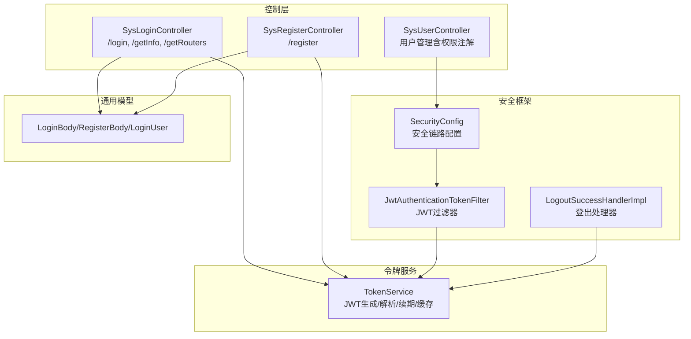
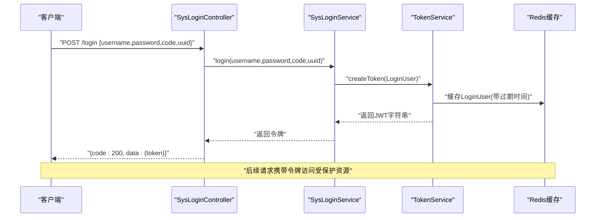
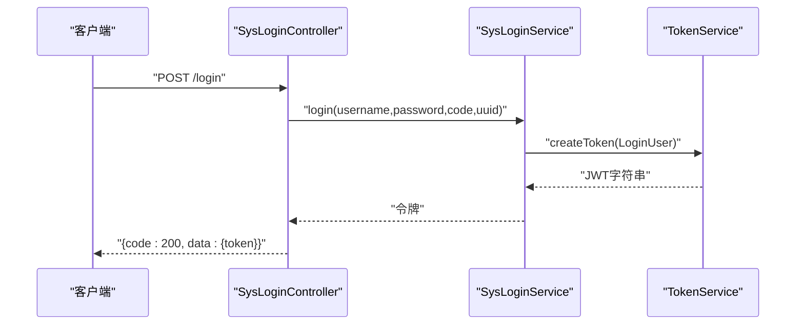
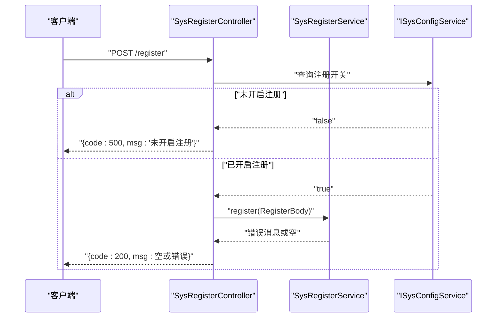
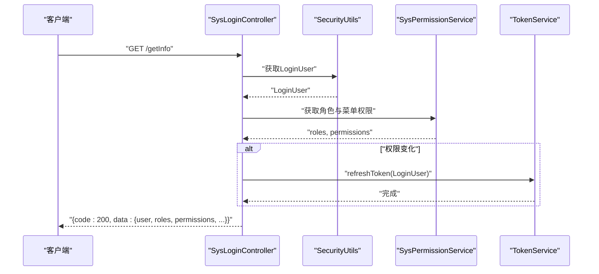
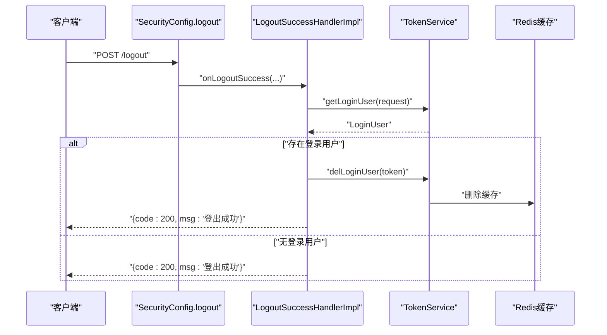
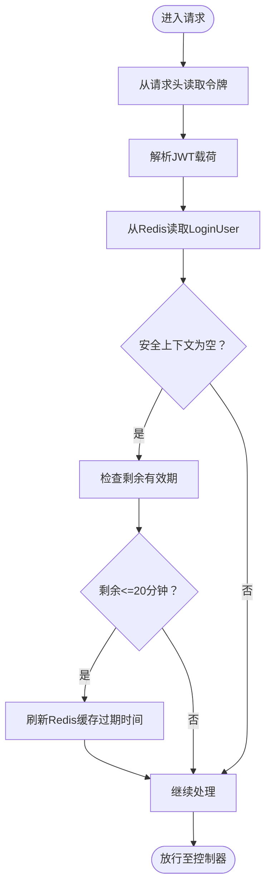
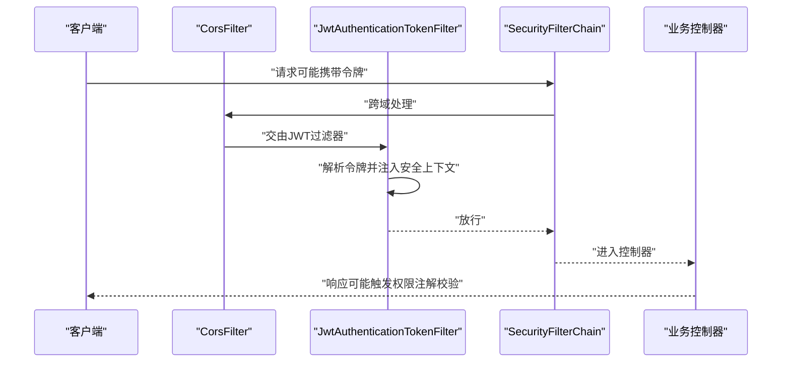
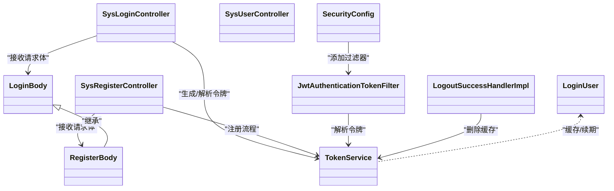

# 认证接口

<cite>
**本文引用的文件**
- [SysLoginController.java](file://blog-admin/src/main/java/blog/web/controller/system/SysLoginController.java)
- [SysRegisterController.java](file://blog-admin/src/main/java/blog/web/controller/system/SysRegisterController.java)
- [SysUserController.java](file://blog-admin/src/main/java/blog/web/controller/system/SysUserController.java)
- [TokenService.java](file://blog-framework/src/main/java/blog/framework/web/service/TokenService.java)
- [SecurityConfig.java](file://blog-framework/src/main/java/blog/framework/config/SecurityConfig.java)
- [JwtAuthenticationTokenFilter.java](file://blog-framework/src/main/java/blog/framework/security/filter/JwtAuthenticationTokenFilter.java)
- [LogoutSuccessHandlerImpl.java](file://blog-framework/src/main/java/blog/framework/security/handle/LogoutSuccessHandlerImpl.java)
- [LoginBody.java](file://blog-common/src/main/java/blog/common/core/domain/model/LoginBody.java)
- [RegisterBody.java](file://blog-common/src/main/java/blog/common/core/domain/model/RegisterBody.java)
- [LoginUser.java](file://blog-common/src/main/java/blog/common/core/domain/model/LoginUser.java)
</cite>

## 目录
1. [简介](#简介)
2. [项目结构](#项目结构)
3. [核心组件](#核心组件)
4. [架构总览](#架构总览)
5. [详细组件分析](#详细组件分析)
6. [依赖关系分析](#依赖关系分析)
7. [性能与安全特性](#性能与安全特性)
8. [故障排查指南](#故障排查指南)
9. [结论](#结论)
10. [附录：接口规范与示例](#附录接口规范与示例)

## 简介
本文件面向Leejie博客系统的认证接口，围绕以下目标展开：  
- 用户登录接口（POST /login）：用户名密码登录、验证码校验、返回JWT风格令牌及有效期说明  
- 用户注册接口（POST /register）：注册参数校验、注册开关控制与流程说明  
- 获取用户信息接口（GET /getInfo）：用户详情、角色与权限返回、密码状态提示  
- 注销登录接口（POST /logout）：安全退出、清理会话缓存与日志记录  
- JWT令牌机制：生成、解析、有效期与自动续期策略  
- 认证中间件与权限拦截：Spring Security链路、过滤器工作原理与权限注解  

## 项目结构
认证相关代码主要分布在如下模块与包：
- 控制层：blog-admin 的系统控制器，负责对外暴露 /login、/register、/getInfo、/logout 等端点  
- 安全配置：blog-framework 的 Spring Security 配置与过滤器链  
- 令牌服务：blog-framework 的 TokenService，封装JWT与Redis缓存逻辑  
- 通用模型：blog-common 的 LoginBody、RegisterBody、LoginUser 等数据模型  

图表来源
- [SysLoginController.java:56-90](file://blog-admin/src/main/java/blog/web/controller/system/SysLoginController.java#L56-L90)
- [SysRegisterController.java:27-34](file://blog-admin/src/main/java/blog/web/controller/system/SysRegisterController.java#L27-L34)
- [SecurityConfig.java:94-126](file://blog-framework/src/main/java/blog/framework/config/SecurityConfig.java#L94-L126)
- [JwtAuthenticationTokenFilter.java:38-49](file://blog-framework/src/main/java/blog/framework/security/filter/JwtAuthenticationTokenFilter.java#L38-L49)
- [TokenService.java:105-142](file://blog-framework/src/main/java/blog/framework/web/service/TokenService.java#L105-L142)
- [LoginBody.java:8-60](file://blog-common/src/main/java/blog/common/core/domain/model/LoginBody.java#L8-L60)
- [RegisterBody.java:8-10](file://blog-common/src/main/java/blog/common/core/domain/model/RegisterBody.java#L8-L10)
- [LoginUser.java:16-87](file://blog-common/src/main/java/blog/common/core/domain/model/LoginUser.java#L16-L87)

章节来源
- [SysLoginController.java:56-90](file://blog-admin/src/main/java/blog/web/controller/system/SysLoginController.java#L56-L90)
- [SysRegisterController.java:27-34](file://blog-admin/src/main/java/blog/web/controller/system/SysRegisterController.java#L27-L34)
- [SecurityConfig.java:94-126](file://blog-framework/src/main/java/blog/framework/config/SecurityConfig.java#L94-L126)

## 核心组件
- 登录控制器：负责接收用户名密码与验证码，调用登录服务生成令牌并返回  
- 注册控制器：受系统配置开关控制，调用注册服务完成注册流程  
- 令牌服务：封装JWT生成、解析、续期与Redis缓存；提供从请求头提取令牌、从令牌解析用户信息的能力  
- 安全配置：定义无状态会话、匿名放行URL、JWT过滤器链路与登出处理器  
- JWT过滤器：从请求头解析令牌，验证有效期并注入到安全上下文  
- 登出处理器：清理用户缓存并输出标准成功响应  
- 数据模型：LoginBody/RegisterBody/LoginUser，承载登录输入、注册输入与用户身份信息

章节来源
- [SysLoginController.java:56-90](file://blog-admin/src/main/java/blog/web/controller/system/SysLoginController.java#L56-L90)
- [SysRegisterController.java:27-34](file://blog-admin/src/main/java/blog/web/controller/system/SysRegisterController.java#L27-L34)
- [TokenService.java:105-142](file://blog-framework/src/main/java/blog/framework/web/service/TokenService.java#L105-L142)
- [SecurityConfig.java:94-126](file://blog-framework/src/main/java/blog/framework/config/SecurityConfig.java#L94-L126)
- [JwtAuthenticationTokenFilter.java:38-49](file://blog-framework/src/main/java/blog/framework/security/filter/JwtAuthenticationTokenFilter.java#L38-L49)
- [LogoutSuccessHandlerImpl.java:38-50](file://blog-framework/src/main/java/blog/framework/security/handle/LogoutSuccessHandlerImpl.java#L38-L50)
- [LoginBody.java:8-60](file://blog-common/src/main/java/blog/common/core/domain/model/LoginBody.java#L8-L60)
- [RegisterBody.java:8-10](file://blog-common/src/main/java/blog/common/core/domain/model/RegisterBody.java#L8-L10)
- [LoginUser.java:16-87](file://blog-common/src/main/java/blog/common/core/domain/model/LoginUser.java#L16-L87)

## 架构总览
系统采用“无状态+JWT”的认证模式：客户端登录成功后获得令牌，后续请求在请求头携带令牌，服务器通过过滤器解析并验证，将用户身份注入到安全上下文，用于权限判断。

图表来源
- [SysLoginController.java:56-64](file://blog-admin/src/main/java/blog/web/controller/system/SysLoginController.java#L56-L64)
- [TokenService.java:105-115](file://blog-framework/src/main/java/blog/framework/web/service/TokenService.java#L105-L115)
- [TokenService.java:136-142](file://blog-framework/src/main/java/blog/framework/web/service/TokenService.java#L136-L142)

## 详细组件分析

### 登录接口：POST /login
- 请求体：用户名、密码、验证码、唯一标识  
- 处理流程：调用登录服务完成凭证校验与业务登录，生成令牌并返回  
- 返回值：统一结果包装，包含令牌键值  
- 令牌格式：基于JWT的字符串，头部需按配置前缀处理（见“令牌头格式”）  
- 有效期：由令牌服务配置决定，默认单位分钟，到期前20分钟内自动续期

图表来源
- [SysLoginController.java:56-64](file://blog-admin/src/main/java/blog/web/controller/system/SysLoginController.java#L56-L64)
- [TokenService.java:105-115](file://blog-framework/src/main/java/blog/framework/web/service/TokenService.java#L105-L115)

章节来源
- [SysLoginController.java:56-64](file://blog-admin/src/main/java/blog/web/controller/system/SysLoginController.java#L56-L64)
- [LoginBody.java:8-60](file://blog-common/src/main/java/blog/common/core/domain/model/LoginBody.java#L8-L60)
- [TokenService.java:44-47](file://blog-framework/src/main/java/blog/framework/web/service/TokenService.java#L44-L47)

### 注册接口：POST /register
- 请求体：继承登录体的字段，用于注册场景  
- 开关控制：受系统配置项控制是否开放注册  
- 处理流程：若未开启则返回错误；否则调用注册服务执行注册并返回结果  
- 返回值：空消息表示成功，否则返回具体错误信息

图表来源
- [SysRegisterController.java:27-34](file://blog-admin/src/main/java/blog/web/controller/system/SysRegisterController.java#L27-L34)

章节来源
- [SysRegisterController.java:27-34](file://blog-admin/src/main/java/blog/web/controller/system/SysRegisterController.java#L27-L34)
- [RegisterBody.java:8-10](file://blog-common/src/main/java/blog/common/core/domain/model/RegisterBody.java#L8-L10)

### 获取用户信息：GET /getInfo
- 功能：返回当前登录用户的基本信息、角色集合、权限集合、初始密码修改提示与密码过期状态  
- 权限：需要已登录身份  
- 续期：若权限集合发生变化，将刷新令牌缓存以同步最新权限

图表来源
- [SysLoginController.java:71-90](file://blog-admin/src/main/java/blog/web/controller/system/SysLoginController.java#L71-L90)
- [TokenService.java:136-142](file://blog-framework/src/main/java/blog/framework/web/service/TokenService.java#L136-L142)

章节来源
- [SysLoginController.java:71-90](file://blog-admin/src/main/java/blog/web/controller/system/SysLoginController.java#L71-L90)

### 注销登录：POST /logout
- 功能：安全退出，删除Redis中的用户缓存，并记录登出日志  
- 返回：标准成功响应

图表来源
- [SecurityConfig.java:119-121](file://blog-framework/src/main/java/blog/framework/config/SecurityConfig.java#L119-L121)
- [LogoutSuccessHandlerImpl.java:38-50](file://blog-framework/src/main/java/blog/framework/security/handle/LogoutSuccessHandlerImpl.java#L38-L50)
- [TokenService.java:92-97](file://blog-framework/src/main/java/blog/framework/web/service/TokenService.java#L92-L97)

章节来源
- [SecurityConfig.java:119-121](file://blog-framework/src/main/java/blog/framework/config/SecurityConfig.java#L119-L121)
- [LogoutSuccessHandlerImpl.java:38-50](file://blog-framework/src/main/java/blog/framework/security/handle/LogoutSuccessHandlerImpl.java#L38-L50)
- [TokenService.java:92-97](file://blog-framework/src/main/java/blog/framework/web/service/TokenService.java#L92-L97)

### JWT令牌生成、验证与续期
- 生成：为每个登录用户生成唯一令牌标识，写入JWT载荷并签名，同时将LoginUser写入Redis，设置过期时间  
- 验证：从请求头解析令牌，校验签名，从Redis读取用户信息，注入到安全上下文  
- 续期：当距离过期时间不足20分钟时，自动刷新Redis中的用户缓存过期时间  
- 令牌头格式：请求头键名来自配置，令牌值需去除前缀后再解析（如“Bearer ”）

图表来源
- [JwtAuthenticationTokenFilter.java:38-49](file://blog-framework/src/main/java/blog/framework/security/filter/JwtAuthenticationTokenFilter.java#L38-L49)
- [TokenService.java:62-78](file://blog-framework/src/main/java/blog/framework/web/service/TokenService.java#L62-L78)
- [TokenService.java:123-129](file://blog-framework/src/main/java/blog/framework/web/service/TokenService.java#L123-L129)
- [TokenService.java:136-142](file://blog-framework/src/main/java/blog/framework/web/service/TokenService.java#L136-L142)

章节来源
- [TokenService.java:36-47](file://blog-framework/src/main/java/blog/framework/web/service/TokenService.java#L36-L47)
- [TokenService.java:105-115](file://blog-framework/src/main/java/blog/framework/web/service/TokenService.java#L105-L115)
- [TokenService.java:164-182](file://blog-framework/src/main/java/blog/framework/web/service/TokenService.java#L164-L182)
- [TokenService.java:201-207](file://blog-framework/src/main/java/blog/framework/web/service/TokenService.java#L201-L207)

### 认证中间件与权限拦截机制
- 无状态会话：禁用Session，使用JWT  
- 匿名放行：登录、注册、验证码、静态资源等URL匿名访问  
- 过滤器链：CORS过滤器 → JWT过滤器 → 登录表单过滤器 → 其他过滤器  
- 方法级权限：结合注解（如HasPermi）对控制器方法进行细粒度权限控制  
- 登出处理：统一登出处理器，清理缓存并返回标准响应

图表来源
- [SecurityConfig.java:94-126](file://blog-framework/src/main/java/blog/framework/config/SecurityConfig.java#L94-L126)
- [JwtAuthenticationTokenFilter.java:38-49](file://blog-framework/src/main/java/blog/framework/security/filter/JwtAuthenticationTokenFilter.java#L38-L49)

章节来源
- [SecurityConfig.java:94-126](file://blog-framework/src/main/java/blog/framework/config/SecurityConfig.java#L94-L126)
- [SysUserController.java:97-112](file://blog-admin/src/main/java/blog/web/controller/system/SysUserController.java#L97-L112)

## 依赖关系分析
- 控制器依赖服务与工具：登录控制器依赖登录服务与令牌服务；注册控制器依赖注册服务与配置服务  
- 安全配置依赖过滤器与处理器：配置JWT过滤器与登出处理器，定义匿名放行URL  
- 令牌服务依赖Redis：存储LoginUser并设置过期时间；依赖JWT库生成与解析令牌  
- 数据模型：LoginBody/RegisterBody/LoginUser作为跨层传输载体

图表来源
- [SysLoginController.java:56-90](file://blog-admin/src/main/java/blog/web/controller/system/SysLoginController.java#L56-L90)
- [SysRegisterController.java:27-34](file://blog-admin/src/main/java/blog/web/controller/system/SysRegisterController.java#L27-L34)
- [TokenService.java:105-142](file://blog-framework/src/main/java/blog/framework/web/service/TokenService.java#L105-L142)
- [SecurityConfig.java:94-126](file://blog-framework/src/main/java/blog/framework/config/SecurityConfig.java#L94-L126)
- [JwtAuthenticationTokenFilter.java:27-49](file://blog-framework/src/main/java/blog/framework/security/filter/JwtAuthenticationTokenFilter.java#L27-L49)
- [LogoutSuccessHandlerImpl.java:28-50](file://blog-framework/src/main/java/blog/framework/security/handle/LogoutSuccessHandlerImpl.java#L28-L50)
- [LoginBody.java:8-60](file://blog-common/src/main/java/blog/common/core/domain/model/LoginBody.java#L8-L60)
- [RegisterBody.java:8-10](file://blog-common/src/main/java/blog/common/core/domain/model/RegisterBody.java#L8-L10)
- [LoginUser.java:16-87](file://blog-common/src/main/java/blog/common/core/domain/model/LoginUser.java#L16-L87)

章节来源
- [SysLoginController.java:56-90](file://blog-admin/src/main/java/blog/web/controller/system/SysLoginController.java#L56-L90)
- [SysRegisterController.java:27-34](file://blog-admin/src/main/java/blog/web/controller/system/SysRegisterController.java#L27-L34)
- [TokenService.java:105-142](file://blog-framework/src/main/java/blog/framework/web/service/TokenService.java#L105-L142)
- [SecurityConfig.java:94-126](file://blog-framework/src/main/java/blog/framework/config/SecurityConfig.java#L94-L126)

## 性能与安全特性
- 无状态设计：基于JWT与Redis缓存，避免服务端会话存储开销  
- 自动续期：临近过期自动刷新缓存，降低频繁重新登录带来的体验问题  
- 低耦合：控制器仅负责编排，登录/注册/令牌逻辑下沉到服务层与工具类  
- 安全性：BCrypt密码加密、禁用CSRF、无状态会话、严格权限注解  
- 可扩展：支持通过配置调整令牌头、密钥与过期时间

[本节为通用指导，无需列出章节来源]

## 故障排查指南
- 登录失败
  - 检查用户名/密码/验证码是否正确  
  - 确认验证码与uuid是否匹配  
  - 查看登录服务返回的错误信息  
- 令牌无效
  - 确认请求头是否包含令牌且格式正确（去除前缀）  
  - 核对令牌密钥与签名算法配置  
  - 检查Redis中是否存在对应用户缓存  
- 权限不足
  - 检查用户角色与权限集合是否正确  
  - 若权限变更，请确认已刷新令牌  
- 注销未生效
  - 确认登出处理器是否被调用  
  - 检查Redis中用户缓存是否被删除  

章节来源
- [JwtAuthenticationTokenFilter.java:38-49](file://blog-framework/src/main/java/blog/framework/security/filter/JwtAuthenticationTokenFilter.java#L38-L49)
- [TokenService.java:62-78](file://blog-framework/src/main/java/blog/framework/web/service/TokenService.java#L62-L78)
- [TokenService.java:136-142](file://blog-framework/src/main/java/blog/framework/web/service/TokenService.java#L136-L142)
- [LogoutSuccessHandlerImpl.java:38-50](file://blog-framework/src/main/java/blog/framework/security/handle/LogoutSuccessHandlerImpl.java#L38-L50)

## 结论
该认证体系以JWT为核心，结合Spring Security无状态过滤链与Redis缓存，实现了登录、注册、信息获取、注销与权限拦截的完整闭环。通过配置化管理令牌头、密钥与过期时间，系统具备良好的可维护性与安全性。

[本节为总结性内容，无需列出章节来源]

## 附录：接口规范与示例

### 接口一览
- POST /login
  - 请求体：用户名、密码、验证码、唯一标识  
  - 成功响应：包含令牌键值  
  - 错误响应：凭证错误、验证码错误等  
- POST /register
  - 请求体：用户名、密码、验证码、唯一标识  
  - 成功响应：空消息  
  - 错误响应：未开启注册、参数校验失败等  
- GET /getInfo
  - 成功响应：用户信息、角色集合、权限集合、密码状态提示  
- POST /logout
  - 成功响应：标准成功消息  

章节来源
- [SysLoginController.java:56-90](file://blog-admin/src/main/java/blog/web/controller/system/SysLoginController.java#L56-L90)
- [SysRegisterController.java:27-34](file://blog-admin/src/main/java/blog/web/controller/system/SysRegisterController.java#L27-L34)
- [SysUserController.java:97-112](file://blog-admin/src/main/java/blog/web/controller/system/SysUserController.java#L97-L112)
- [SecurityConfig.java:119-121](file://blog-framework/src/main/java/blog/framework/config/SecurityConfig.java#L119-L121)

### 令牌头格式与有效期
- 令牌头键名：来自配置项  
- 令牌值：建议在请求头中携带，例如“键名: Bearer 令牌字符串”  
- 有效期：由配置项控制，默认单位为分钟  
- 自动续期：距离过期时间不足20分钟时自动刷新缓存  

章节来源
- [TokenService.java:36-47](file://blog-framework/src/main/java/blog/framework/web/service/TokenService.java#L36-L47)
- [TokenService.java:123-129](file://blog-framework/src/main/java/blog/framework/web/service/TokenService.java#L123-L129)
- [TokenService.java:136-142](file://blog-framework/src/main/java/blog/framework/web/service/TokenService.java#L136-L142)
- [TokenService.java:201-207](file://blog-framework/src/main/java/blog/framework/web/service/TokenService.java#L201-L207)

### 数据模型说明
- 登录体（LoginBody）
  - 字段：用户名、密码、验证码、唯一标识  
- 注册体（RegisterBody）
  - 继承自登录体  
- 登录用户（LoginUser）
  - 字段：用户ID、部门ID、令牌、登录时间、过期时间、登录IP、登录地点、浏览器、操作系统、权限列表、用户信息等  

章节来源
- [LoginBody.java:8-60](file://blog-common/src/main/java/blog/common/core/domain/model/LoginBody.java#L8-L60)
- [RegisterBody.java:8-10](file://blog-common/src/main/java/blog/common/core/domain/model/RegisterBody.java#L8-L10)
- [LoginUser.java:16-87](file://blog-common/src/main/java/blog/common/core/domain/model/LoginUser.java#L16-L87)