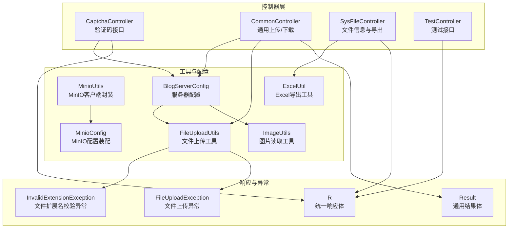
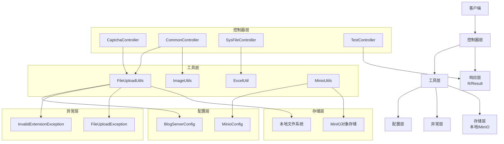
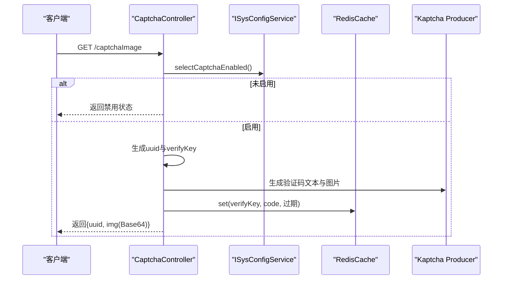
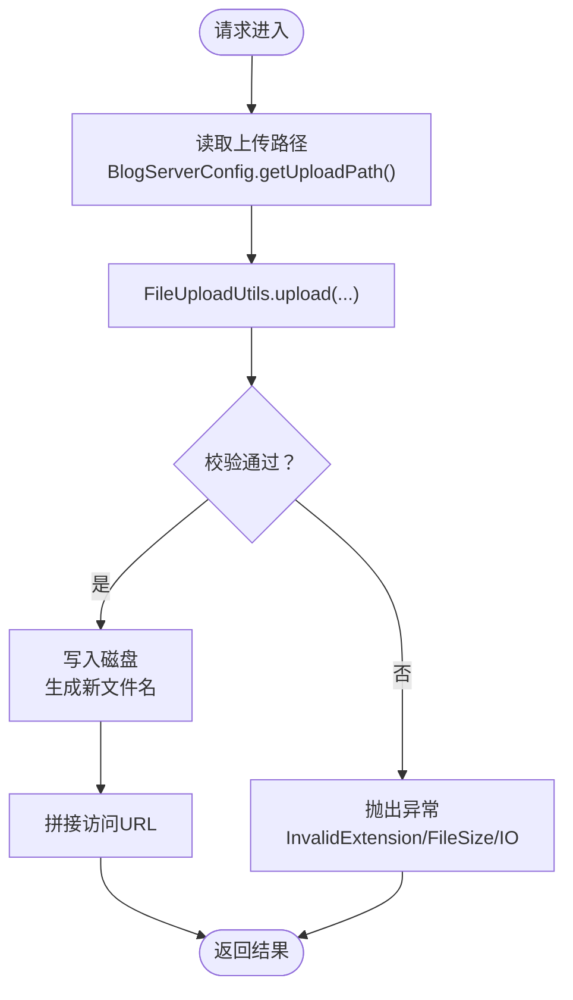
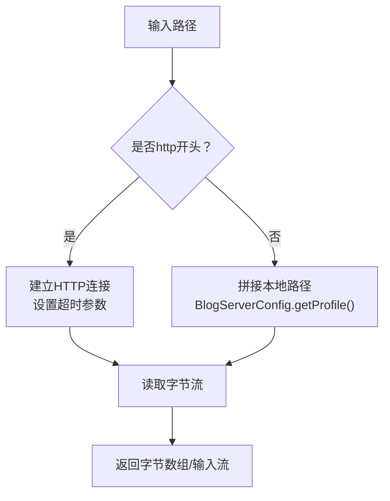
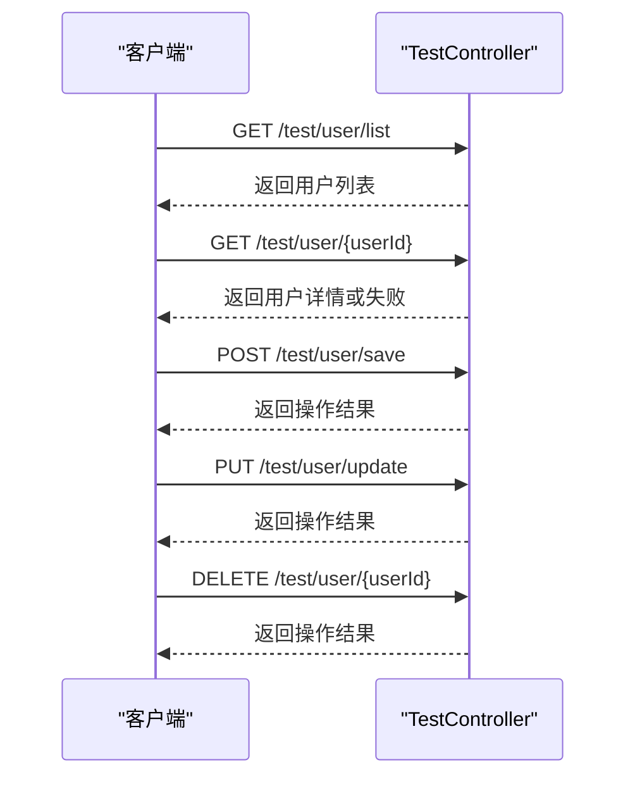
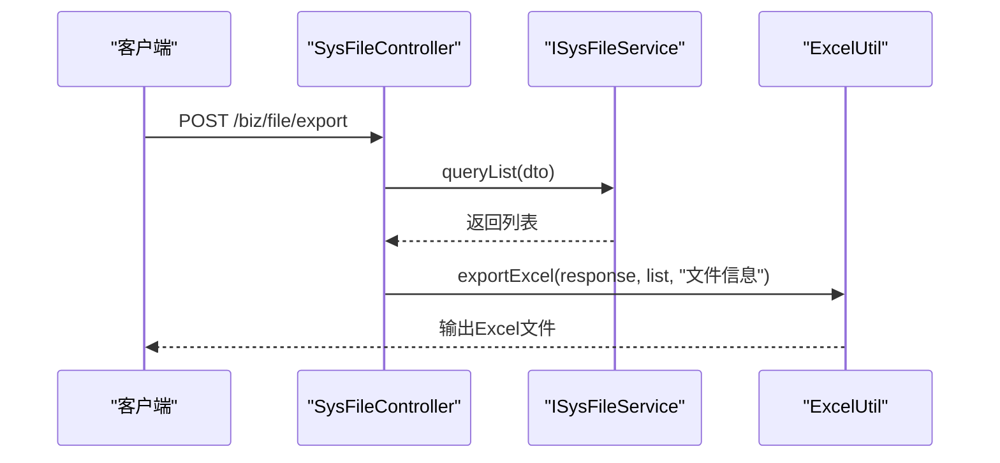
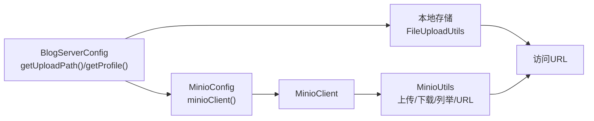
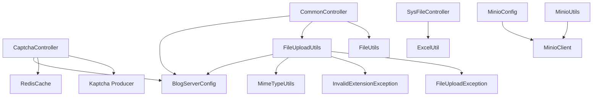

# 通用接口

<cite>
**本文引用的文件**
- [CaptchaController.java](file://blog-admin/src/main/java/blog/web/controller/common/CaptchaController.java)
- [CommonController.java](file://blog-admin/src/main/java/blog/web/controller/common/CommonController.java)
- [SysFileController.java](file://blog-admin/src/main/java/blog/web/controller/common/SysFileController.java)
- [TestController.java](file://blog-admin/src/main/java/blog/web/controller/tool/TestController.java)
- [ExcelUtil.java](file://blog-common/src/main/java/blog/common/utils/poi/ExcelUtil.java)
- [FileUploadUtils.java](file://blog-common/src/main/java/blog/common/utils/file/FileUploadUtils.java)
- [ImageUtils.java](file://blog-common/src/main/java/blog/common/utils/file/ImageUtils.java)
- [MinioUtils.java](file://blog-common/src/main/java/blog/common/utils/minio/MinioUtils.java)
- [MinioConfig.java](file://blog-common/src/main/java/blog/common/config/minio/MinioConfig.java)
- [BlogServerConfig.java](file://blog-common/src/main/java/blog/common/config/BlogServerConfig.java)
- [R.java](file://blog-common/src/main/java/blog/common/base/resp/R.java)
- [Result.java](file://blog-common/src/main/java/blog/common/base/resp/Result.java)
- [InvalidExtensionException.java](file://blog-common/src/main/java/blog/common/exception/file/InvalidExtensionException.java)
- [FileUploadException.java](file://blog-common/src/main/java/blog/common/exception/file/FileUploadException.java)
</cite>

## 目录
1. [简介](#简介)
2. [项目结构](#项目结构)
3. [核心组件](#核心组件)
4. [架构总览](#架构总览)
5. [详细组件分析](#详细组件分析)
6. [依赖分析](#依赖分析)
7. [性能考虑](#性能考虑)
8. [故障排查指南](#故障排查指南)
9. [结论](#结论)
10. [附录](#附录)

## 简介
本文件面向Leejie博客系统的“通用接口”，聚焦以下能力：
- 验证码接口：图形验证码生成、验证逻辑与缓存机制
- 文件上传接口：单/多文件上传、类型与大小限制、存储策略
- 图片处理接口：图片读取与基础处理能力
- 测试接口：系统健康检查与调试接口
- 数据导出接口：Excel导出与CSV下载（基于POI）
- 文件存储流程：本地存储与MinIO对象存储的切换机制
- 错误处理与异常捕获：统一响应与异常规范

## 项目结构
通用接口主要分布在如下模块与包中：
- 控制器层：common与tool包下的控制器
- 工具与配置：文件上传、图片处理、MinIO、服务器配置
- 响应与异常：统一响应体与异常体系

图表来源
- [CaptchaController.java:1-87](file://blog-admin/src/main/java/blog/web/controller/common/CaptchaController.java#L1-L87)
- [CommonController.java:1-142](file://blog-admin/src/main/java/blog/web/controller/common/CommonController.java#L1-L142)
- [SysFileController.java:1-123](file://blog-admin/src/main/java/blog/web/controller/common/SysFileController.java#L1-L123)
- [TestController.java:1-152](file://blog-admin/src/main/java/blog/web/controller/tool/TestController.java#L1-L152)
- [FileUploadUtils.java:1-225](file://blog-common/src/main/java/blog/common/utils/file/FileUploadUtils.java#L1-L225)
- [ImageUtils.java:1-80](file://blog-common/src/main/java/blog/common/utils/file/ImageUtils.java#L1-L80)
- [MinioUtils.java:1-325](file://blog-common/src/main/java/blog/common/utils/minio/MinioUtils.java#L1-L325)
- [MinioConfig.java:1-34](file://blog-common/src/main/java/blog/common/config/minio/MinioConfig.java#L1-L34)
- [BlogServerConfig.java:1-120](file://blog-common/src/main/java/blog/common/config/BlogServerConfig.java#L1-L120)
- [ExcelUtil.java:1-800](file://blog-common/src/main/java/blog/common/utils/poi/ExcelUtil.java#L1-L800)
- [R.java:1-107](file://blog-common/src/main/java/blog/common/base/resp/R.java#L1-L107)
- [Result.java:1-205](file://blog-common/src/main/java/blog/common/base/resp/Result.java#L1-L205)
- [InvalidExtensionException.java:1-68](file://blog-common/src/main/java/blog/common/exception/file/InvalidExtensionException.java#L1-L68)
- [FileUploadException.java:1-53](file://blog-common/src/main/java/blog/common/exception/file/FileUploadException.java#L1-L53)

章节来源
- [CaptchaController.java:1-87](file://blog-admin/src/main/java/blog/web/controller/common/CaptchaController.java#L1-L87)
- [CommonController.java:1-142](file://blog-admin/src/main/java/blog/web/controller/common/CommonController.java#L1-L142)
- [SysFileController.java:1-123](file://blog-admin/src/main/java/blog/web/controller/common/SysFileController.java#L1-L123)
- [TestController.java:1-152](file://blog-admin/src/main/java/blog/web/controller/tool/TestController.java#L1-L152)
- [FileUploadUtils.java:1-225](file://blog-common/src/main/java/blog/common/utils/file/FileUploadUtils.java#L1-L225)
- [ImageUtils.java:1-80](file://blog-common/src/main/java/blog/common/utils/file/ImageUtils.java#L1-L80)
- [MinioUtils.java:1-325](file://blog-common/src/main/java/blog/common/utils/minio/MinioUtils.java#L1-L325)
- [MinioConfig.java:1-34](file://blog-common/src/main/java/blog/common/config/minio/MinioConfig.java#L1-L34)
- [BlogServerConfig.java:1-120](file://blog-common/src/main/java/blog/common/config/BlogServerConfig.java#L1-L120)
- [ExcelUtil.java:1-800](file://blog-common/src/main/java/blog/common/utils/poi/ExcelUtil.java#L1-L800)
- [R.java:1-107](file://blog-common/src/main/java/blog/common/base/resp/R.java#L1-L107)
- [Result.java:1-205](file://blog-common/src/main/java/blog/common/base/resp/Result.java#L1-L205)
- [InvalidExtensionException.java:1-68](file://blog-common/src/main/java/blog/common/exception/file/InvalidExtensionException.java#L1-L68)
- [FileUploadException.java:1-53](file://blog-common/src/main/java/blog/common/exception/file/FileUploadException.java#L1-L53)

## 核心组件
- 验证码接口：生成图形验证码，支持数学与字符两种模式，写入Redis并返回Base64图片与uuid
- 通用上传接口：单/多文件上传，路径由配置决定，返回访问URL与文件名
- 文件导出接口：基于ExcelUtil导出Excel，支持列表导出
- 图片处理接口：提供图片读取与本地/网络路径解析
- 测试接口：提供用户信息的CRUD示例接口
- 文件存储：本地存储与MinIO对象存储的配置与切换

章节来源
- [CaptchaController.java:45-85](file://blog-admin/src/main/java/blog/web/controller/common/CaptchaController.java#L45-L85)
- [CommonController.java:67-116](file://blog-admin/src/main/java/blog/web/controller/common/CommonController.java#L67-L116)
- [SysFileController.java:57-62](file://blog-admin/src/main/java/blog/web/controller/common/SysFileController.java#L57-L62)
- [ExcelUtil.java:483-501](file://blog-common/src/main/java/blog/common/utils/poi/ExcelUtil.java#L483-L501)
- [ImageUtils.java:25-78](file://blog-common/src/main/java/blog/common/utils/file/ImageUtils.java#L25-L78)
- [TestController.java:39-92](file://blog-admin/src/main/java/blog/web/controller/tool/TestController.java#L39-L92)
- [MinioConfig.java:17-31](file://blog-common/src/main/java/blog/common/config/minio/MinioConfig.java#L17-L31)

## 架构总览
通用接口围绕“控制器—工具—配置—异常”四层展开，统一使用R/Result作为响应体，异常通过工具类抛出并在上层捕获。

图表来源
- [CaptchaController.java:1-87](file://blog-admin/src/main/java/blog/web/controller/common/CaptchaController.java#L1-L87)
- [CommonController.java:1-142](file://blog-admin/src/main/java/blog/web/controller/common/CommonController.java#L1-L142)
- [SysFileController.java:1-123](file://blog-admin/src/main/java/blog/web/controller/common/SysFileController.java#L1-L123)
- [TestController.java:1-152](file://blog-admin/src/main/java/blog/web/controller/tool/TestController.java#L1-L152)
- [FileUploadUtils.java:1-225](file://blog-common/src/main/java/blog/common/utils/file/FileUploadUtils.java#L1-L225)
- [ImageUtils.java:1-80](file://blog-common/src/main/java/blog/common/utils/file/ImageUtils.java#L1-L80)
- [ExcelUtil.java:1-800](file://blog-common/src/main/java/blog/common/utils/poi/ExcelUtil.java#L1-L800)
- [MinioUtils.java:1-325](file://blog-common/src/main/java/blog/common/utils/minio/MinioUtils.java#L1-L325)
- [MinioConfig.java:1-34](file://blog-common/src/main/java/blog/common/config/minio/MinioConfig.java#L1-L34)
- [BlogServerConfig.java:1-120](file://blog-common/src/main/java/blog/common/config/BlogServerConfig.java#L1-L120)
- [InvalidExtensionException.java:1-68](file://blog-common/src/main/java/blog/common/exception/file/InvalidExtensionException.java#L1-L68)
- [FileUploadException.java:1-53](file://blog-common/src/main/java/blog/common/exception/file/FileUploadException.java#L1-L53)

## 详细组件分析

### 验证码接口：GET /captchaImage
- 功能概述
  - 依据配置决定是否启用验证码
  - 支持数学与字符两种验证码类型
  - 生成图片并以Base64返回，同时将正确答案写入Redis并设置过期
  - 返回uuid以便前端提交时携带进行校验
- 关键流程
  - 读取配置判断是否启用
  - 生成uuid与验证码key
  - 根据类型生成验证码字符串与图片
  - 写入Redis并设置过期时间
  - 将图片转为Base64并随uuid一并返回
- 异常与边界
  - 未启用验证码时直接返回空结果
  - 图片写入异常时返回错误

图表来源
- [CaptchaController.java:45-85](file://blog-admin/src/main/java/blog/web/controller/common/CaptchaController.java#L45-L85)

章节来源
- [CaptchaController.java:45-85](file://blog-admin/src/main/java/blog/web/controller/common/CaptchaController.java#L45-L85)

### 文件上传接口：POST /common/upload 与 /common/uploads
- 接口说明
  - 单文件上传：/common/upload
  - 多文件上传：/common/uploads
- 上传策略
  - 基于BlogServerConfig确定上传根目录
  - 使用FileUploadUtils执行校验与落盘
  - 返回访问URL、原始文件名、新文件名等
- 校验规则
  - 默认最大大小、文件名长度限制
  - 默认允许扩展名白名单
  - 不同场景可传入自定义扩展名数组
- 错误处理
  - 文件大小超限、扩展名不合法、IO异常均被转换为统一错误响应

图表来源
- [CommonController.java:67-116](file://blog-admin/src/main/java/blog/web/controller/common/CommonController.java#L67-L116)
- [FileUploadUtils.java:92-126](file://blog-common/src/main/java/blog/common/utils/file/FileUploadUtils.java#L92-L126)

章节来源
- [CommonController.java:67-116](file://blog-admin/src/main/java/blog/web/controller/common/CommonController.java#L67-L116)
- [FileUploadUtils.java:27-35](file://blog-common/src/main/java/blog/common/utils/file/FileUploadUtils.java#L27-L35)
- [FileUploadUtils.java:92-126](file://blog-common/src/main/java/blog/common/utils/file/FileUploadUtils.java#L92-L126)
- [InvalidExtensionException.java:17-34](file://blog-common/src/main/java/blog/common/exception/file/InvalidExtensionException.java#L17-L34)

### 图片处理接口：图片读取与本地/网络路径解析
- 能力说明
  - 提供图片读取为字节数组或输入流的方法
  - 支持本地路径与网络URL两种来源
  - 自动识别资源前缀并定位真实路径
- 使用场景
  - 通用图片读取、缩略图生成前置步骤
  - 与MinIO结合实现图片直链访问

图表来源
- [ImageUtils.java:54-78](file://blog-common/src/main/java/blog/common/utils/file/ImageUtils.java#L54-L78)

章节来源
- [ImageUtils.java:25-78](file://blog-common/src/main/java/blog/common/utils/file/ImageUtils.java#L25-L78)

### 测试接口：GET /test/user/list 与相关CRUD
- 能力说明
  - 提供用户列表查询、详情获取、新增、修改、删除
  - 基于内存Map模拟数据，便于调试与演示
- 适用场景
  - 快速验证前端交互
  - 接口联调与压测

图表来源
- [TestController.java:39-92](file://blog-admin/src/main/java/blog/web/controller/tool/TestController.java#L39-L92)

章节来源
- [TestController.java:1-152](file://blog-admin/src/main/java/blog/web/controller/tool/TestController.java#L1-L152)

### 数据导出接口：Excel导出
- 能力说明
  - 基于ExcelUtil导出Excel，支持HttpServletResponse输出
  - 支持标题、样式、统计行、子列表合并等高级特性
- 使用方式
  - 控制器中构造数据列表，调用exportExcel(response, list, sheetName, title)

图表来源
- [SysFileController.java:57-62](file://blog-admin/src/main/java/blog/web/controller/common/SysFileController.java#L57-L62)
- [ExcelUtil.java:483-501](file://blog-common/src/main/java/blog/common/utils/poi/ExcelUtil.java#L483-L501)

章节来源
- [SysFileController.java:57-62](file://blog-admin/src/main/java/blog/web/controller/common/SysFileController.java#L57-L62)
- [ExcelUtil.java:483-501](file://blog-common/src/main/java/blog/common/utils/poi/ExcelUtil.java#L483-L501)

### 文件存储流程：本地存储与MinIO切换
- 本地存储
  - 通过BlogServerConfig.getProfile()确定根目录
  - FileUploadUtils按日期目录与UUID命名生成文件路径
  - 返回资源前缀+相对路径的访问URL
- MinIO对象存储
  - 通过MinioConfig装配MinioClient并验证连接
  - MinioUtils封装上传、下载、删除、列举、URL生成等操作
  - 支持桶存在性检查、自动创建、临时URL签名
- 切换机制
  - 通过配置项控制存储后端（例如在业务层注入不同实现或通过配置选择）
  - 本仓库未提供“运行时动态切换”的代码实现，建议在业务层抽象统一接口并按配置注入具体实现

图表来源
- [BlogServerConfig.java:98-118](file://blog-common/src/main/java/blog/common/config/BlogServerConfig.java#L98-L118)
- [FileUploadUtils.java:131-157](file://blog-common/src/main/java/blog/common/utils/file/FileUploadUtils.java#L131-L157)
- [MinioConfig.java:17-31](file://blog-common/src/main/java/blog/common/config/minio/MinioConfig.java#L17-L31)
- [MinioUtils.java:85-111](file://blog-common/src/main/java/blog/common/utils/minio/MinioUtils.java#L85-L111)

章节来源
- [BlogServerConfig.java:98-118](file://blog-common/src/main/java/blog/common/config/BlogServerConfig.java#L98-L118)
- [FileUploadUtils.java:131-157](file://blog-common/src/main/java/blog/common/utils/file/FileUploadUtils.java#L131-L157)
- [MinioConfig.java:17-31](file://blog-common/src/main/java/blog/common/config/minio/MinioConfig.java#L17-L31)
- [MinioUtils.java:85-111](file://blog-common/src/main/java/blog/common/utils/minio/MinioUtils.java#L85-L111)

## 依赖分析
- 控制器依赖
  - CaptchaController依赖配置读取、Redis缓存与Kaptcha生成器
  - CommonController依赖服务器配置、文件上传工具与文件工具
  - SysFileController依赖Excel工具与业务服务
  - TestController为纯内存数据，依赖R响应体
- 工具与异常
  - FileUploadUtils依赖BlogServerConfig、MIME类型与异常类
  - ExcelUtil依赖Apache POI与注解反射工具
  - MinioUtils依赖MinioClient与配置
- 响应与异常
  - R/Result提供统一响应结构，异常类提供标准化错误信息

图表来源
- [CaptchaController.java:1-87](file://blog-admin/src/main/java/blog/web/controller/common/CaptchaController.java#L1-L87)
- [CommonController.java:1-142](file://blog-admin/src/main/java/blog/web/controller/common/CommonController.java#L1-L142)
- [SysFileController.java:1-123](file://blog-admin/src/main/java/blog/web/controller/common/SysFileController.java#L1-L123)
- [FileUploadUtils.java:1-225](file://blog-common/src/main/java/blog/common/utils/file/FileUploadUtils.java#L1-L225)
- [ExcelUtil.java:1-800](file://blog-common/src/main/java/blog/common/utils/poi/ExcelUtil.java#L1-L800)
- [MinioConfig.java:1-34](file://blog-common/src/main/java/blog/common/config/minio/MinioConfig.java#L1-L34)
- [MinioUtils.java:1-325](file://blog-common/src/main/java/blog/common/utils/minio/MinioUtils.java#L1-L325)

章节来源
- [CaptchaController.java:1-87](file://blog-admin/src/main/java/blog/web/controller/common/CaptchaController.java#L1-L87)
- [CommonController.java:1-142](file://blog-admin/src/main/java/blog/web/controller/common/CommonController.java#L1-L142)
- [SysFileController.java:1-123](file://blog-admin/src/main/java/blog/web/controller/common/SysFileController.java#L1-L123)
- [FileUploadUtils.java:1-225](file://blog-common/src/main/java/blog/common/utils/file/FileUploadUtils.java#L1-L225)
- [ExcelUtil.java:1-800](file://blog-common/src/main/java/blog/common/utils/poi/ExcelUtil.java#L1-L800)
- [MinioConfig.java:1-34](file://blog-common/src/main/java/blog/common/config/minio/MinioConfig.java#L1-L34)
- [MinioUtils.java:1-325](file://blog-common/src/main/java/blog/common/utils/minio/MinioUtils.java#L1-L325)

## 性能考虑
- 验证码
  - 图片生成与Redis写入均为轻量操作，注意验证码过期时间设置
- 文件上传
  - 采用MultipartFile.transferTo写入磁盘，避免内存溢出
  - 建议在网关或Nginx层限制上传大小与并发
- 图片处理
  - ImageUtils读取为字节流，建议在业务层做缓存与CDN加速
- Excel导出
  - 大数据量建议分Sheet分页导出，避免内存峰值过高
- MinIO
  - 使用预签名URL减少后端压力，合理设置过期时间

## 故障排查指南
- 验证码
  - 若未启用验证码，接口会直接返回禁用状态
  - Redis写入失败会导致无法校验，需检查Redis连接与权限
- 文件上传
  - 扩展名不合法：检查允许的扩展名数组与文件实际后缀
  - 文件过大：确认DEFAULT_MAX_SIZE与前端限制一致
  - IO异常：检查磁盘空间与目录权限
- Excel导出
  - 导出异常：查看日志并确认数据模型与注解配置
- MinIO
  - 连接失败：检查endpoint、accessKey、secretKey与桶权限
  - 预签名URL无效：确认过期时间与签名算法

章节来源
- [CaptchaController.java:48-52](file://blog-admin/src/main/java/blog/web/controller/common/CaptchaController.java#L48-L52)
- [InvalidExtensionException.java:17-34](file://blog-common/src/main/java/blog/common/exception/file/InvalidExtensionException.java#L17-L34)
- [FileUploadUtils.java:167-193](file://blog-common/src/main/java/blog/common/utils/file/FileUploadUtils.java#L167-L193)
- [MinioConfig.java:23-29](file://blog-common/src/main/java/blog/common/config/minio/MinioConfig.java#L23-L29)

## 结论
本通用接口覆盖了验证码、文件上传、图片处理、测试与数据导出等常见能力，并通过统一的响应体与异常体系保障稳定性。文件存储支持本地与MinIO双栈，便于按需切换。建议在生产环境配合网关限流、CDN加速与监控告警，进一步提升可用性与性能。

## 附录
- 统一响应体
  - R<T>：泛型响应，适用于业务接口
  - Result：通用结果体，适用于通用接口
- 常见错误码
  - 成功/失败/警告由HttpStatus统一定义，响应体中体现

章节来源
- [R.java:18-73](file://blog-common/src/main/java/blog/common/base/resp/R.java#L18-L73)
- [Result.java:69-101](file://blog-common/src/main/java/blog/common/base/resp/Result.java#L69-L101)