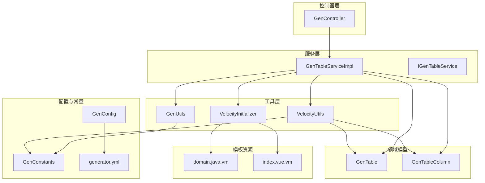
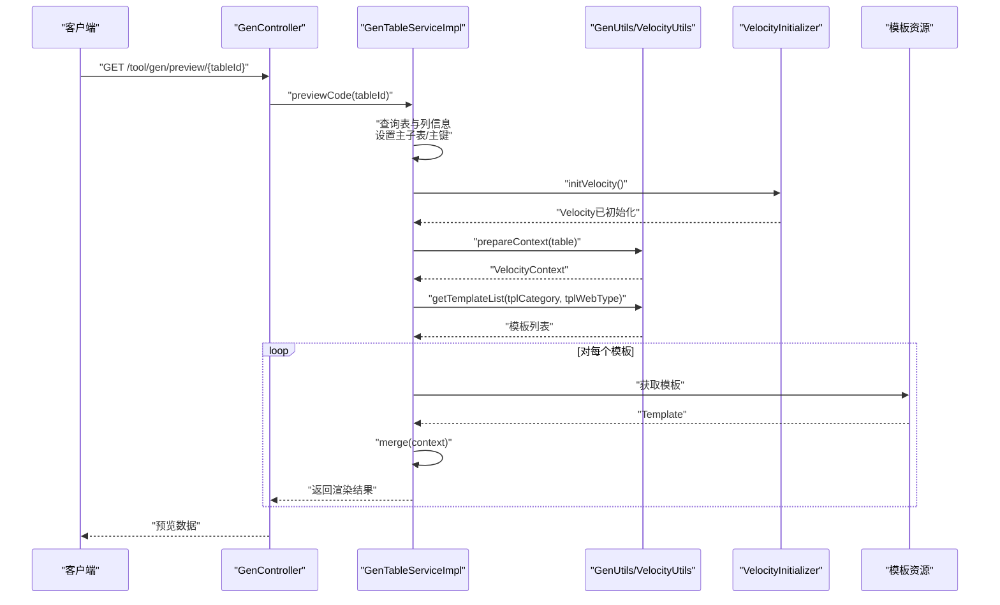
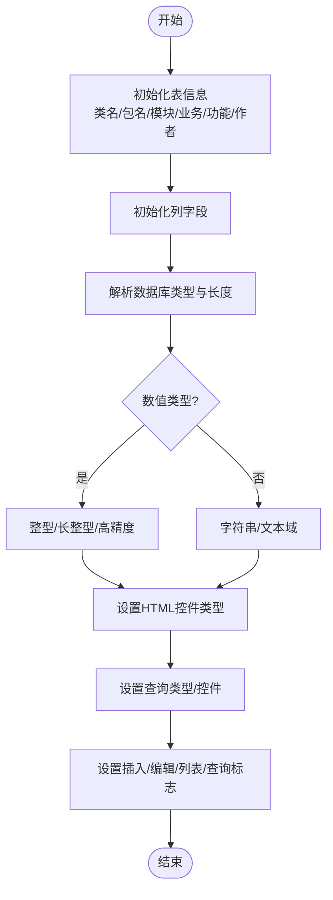
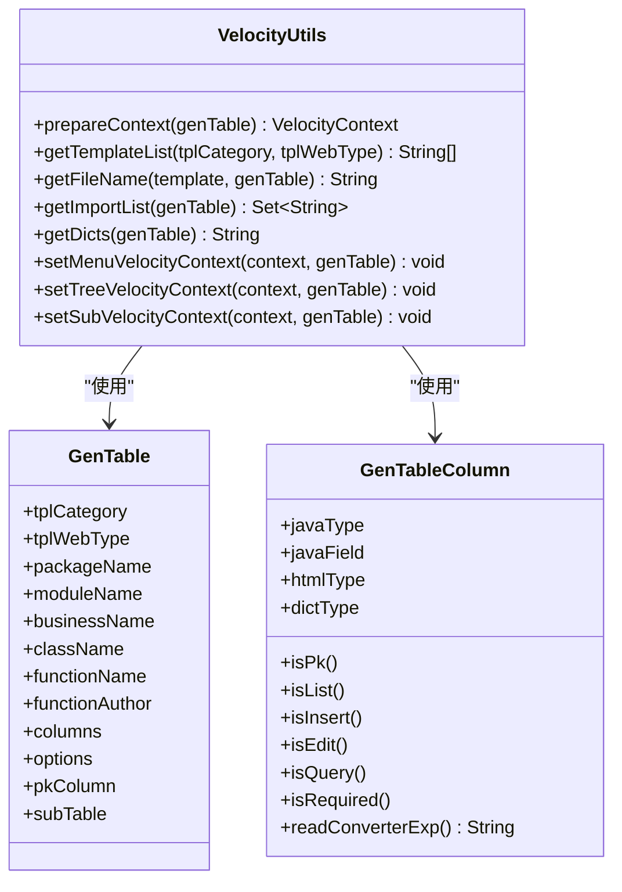
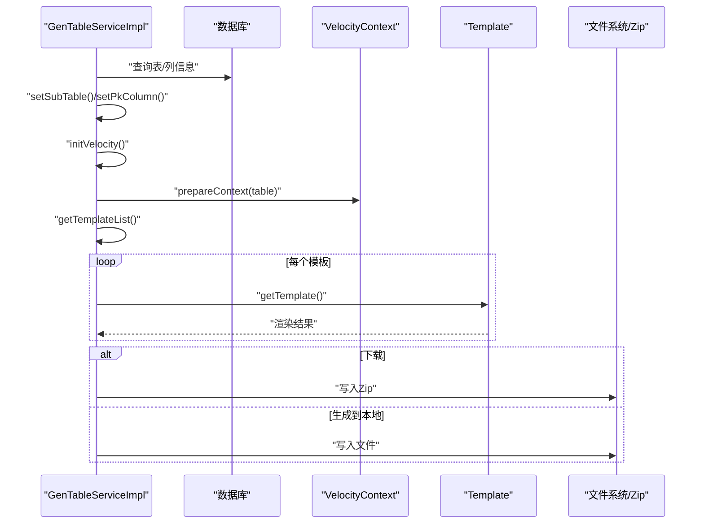
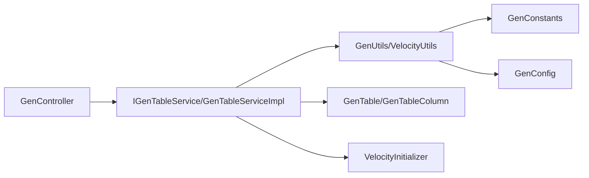

# 代码生成核心实现

<cite>
**本文档引用的文件**
- [GenUtils.java](file://blog-generator/src/main/java/blog/generator/util/GenUtils.java)
- [VelocityUtils.java](file://blog-generator/src/main/java/blog/generator/util/VelocityUtils.java)
- [VelocityInitializer.java](file://blog-generator/src/main/java/blog/generator/util/VelocityInitializer.java)
- [GenTable.java](file://blog-generator/src/main/java/blog/generator/domain/GenTable.java)
- [GenTableColumn.java](file://blog-generator/src/main/java/blog/generator/domain/GenTableColumn.java)
- [GenConfig.java](file://blog-generator/src/main/java/blog/generator/config/GenConfig.java)
- [GenConstants.java](file://blog-common/src/main/java/blog/common/constant/GenConstants.java)
- [generator.yml](file://blog-generator/src/main/resources/generator.yml)
- [domain.java.vm](file://blog-generator/src/main/resources/vm/java/domain.java.vm)
- [index.vue.vm](file://blog-generator/src/main/resources/vm/vue/index.vue.vm)
- [GenController.java](file://blog-generator/src/main/java/blog/generator/controller/GenController.java)
- [GenTableServiceImpl.java](file://blog-generator/src/main/java/blog/generator/service/GenTableServiceImpl.java)
- [IGenTableService.java](file://blog-generator/src/main/java/blog/generator/service/IGenTableService.java)
</cite>

## 目录
1. [简介](#简介)
2. [项目结构](#项目结构)
3. [核心组件](#核心组件)
4. [架构总览](#架构总览)
5. [详细组件分析](#详细组件分析)
6. [依赖关系分析](#依赖关系分析)
7. [性能考虑](#性能考虑)
8. [故障排除指南](#故障排除指南)
9. [结论](#结论)
10. [附录](#附录)

## 简介
本文件面向代码生成核心实现，系统性梳理 GenUtils 工具类的数据库表结构解析与 Java 类型映射、Velocity 模板引擎初始化与上下文构建、VelocityUtils 的模板渲染与文件生成策略，并给出从数据库表读取到最终代码输出的完整流程。同时，解释模板变量处理机制（占位符替换、条件判断、循环遍历）以及命名转换、注释生成、导入语句处理等关键技术点。

## 项目结构
代码生成模块位于 blog-generator 中，采用按职责分层组织：控制器层负责接口编排，服务层负责业务流程与模板渲染，工具层封装通用算法，领域模型承载元数据，配置与常量提供生成规则。

图表来源
- [GenController.java:1-241](file://blog-generator/src/main/java/blog/generator/controller/GenController.java#L1-L241)
- [GenTableServiceImpl.java:1-470](file://blog-generator/src/main/java/blog/generator/service/GenTableServiceImpl.java#L1-L470)
- [GenUtils.java:1-223](file://blog-generator/src/main/java/blog/generator/util/GenUtils.java#L1-L223)
- [VelocityUtils.java:1-364](file://blog-generator/src/main/java/blog/generator/util/VelocityUtils.java#L1-L364)
- [VelocityInitializer.java:1-31](file://blog-generator/src/main/java/blog/generator/util/VelocityInitializer.java#L1-L31)
- [GenTable.java:1-177](file://blog-generator/src/main/java/blog/generator/domain/GenTable.java#L1-L177)
- [GenTableColumn.java:1-348](file://blog-generator/src/main/java/blog/generator/domain/GenTableColumn.java#L1-L348)
- [GenConfig.java:1-87](file://blog-generator/src/main/java/blog/generator/config/GenConfig.java#L1-L87)
- [GenConstants.java:1-187](file://blog-common/src/main/java/blog/common/constant/GenConstants.java#L1-L187)
- [generator.yml:1-12](file://blog-generator/src/main/resources/generator.yml#L1-L12)
- [domain.java.vm:1-57](file://blog-generator/src/main/resources/vm/java/domain.java.vm#L1-L57)
- [index.vue.vm:1-603](file://blog-generator/src/main/resources/vm/vue/index.vue.vm#L1-L603)

章节来源
- [GenController.java:1-241](file://blog-generator/src/main/java/blog/generator/controller/GenController.java#L1-L241)
- [GenTableServiceImpl.java:1-470](file://blog-generator/src/main/java/blog/generator/service/GenTableServiceImpl.java#L1-L470)

## 核心组件
- GenUtils：负责表与列的初始化与类型映射，包括表名转类名、业务名提取、列类型推断、HTML 控件类型与查询方式设定等。
- VelocityUtils：负责 Velocity 上下文构建、模板列表选择、文件名生成、导入包与字典组计算、树形/子表上下文注入等。
- VelocityInitializer：负责 Velocity 引擎初始化，设置模板加载器与字符集。
- GenTable/GenTableColumn：承载业务表与列元数据，提供布尔判定与辅助方法。
- GenConfig/GenConstants：提供生成配置与通用常量（模板类别、HTML 类型、数据库类型族、查询方式等）。
- 模板资源：Java/JS/Vue/XML 等模板，配合 Velocity 语法完成渲染。

章节来源
- [GenUtils.java:17-223](file://blog-generator/src/main/java/blog/generator/util/GenUtils.java#L17-L223)
- [VelocityUtils.java:22-364](file://blog-generator/src/main/java/blog/generator/util/VelocityUtils.java#L22-L364)
- [VelocityInitializer.java:13-31](file://blog-generator/src/main/java/blog/generator/util/VelocityInitializer.java#L13-L31)
- [GenTable.java:20-177](file://blog-generator/src/main/java/blog/generator/domain/GenTable.java#L20-L177)
- [GenTableColumn.java:12-348](file://blog-generator/src/main/java/blog/generator/domain/GenTableColumn.java#L12-L348)
- [GenConfig.java:13-87](file://blog-generator/src/main/java/blog/generator/config/GenConfig.java#L13-L87)
- [GenConstants.java:8-187](file://blog-common/src/main/java/blog/common/constant/GenConstants.java#L8-L187)

## 架构总览
代码生成从控制器入口接收请求，调用服务层完成数据库表读取、元数据装配、Velocity 初始化与上下文准备，随后根据模板类别选择模板列表进行渲染，最后输出到内存 Zip 或写入本地文件。

图表来源
- [GenController.java:174-179](file://blog-generator/src/main/java/blog/generator/controller/GenController.java#L174-L179)
- [GenTableServiceImpl.java:193-216](file://blog-generator/src/main/java/blog/generator/service/GenTableServiceImpl.java#L193-L216)
- [VelocityInitializer.java:17-29](file://blog-generator/src/main/java/blog/generator/util/VelocityInitializer.java#L17-L29)
- [VelocityUtils.java:43-77](file://blog-generator/src/main/java/blog/generator/util/VelocityUtils.java#L43-L77)

## 详细组件分析

### GenUtils：数据库表结构解析与类型映射
- 表初始化
  - 类名转换：支持自动去除表前缀与驼峰化，结合配置决定是否移除前缀。
  - 业务名提取：基于下划线分割取末段作为业务名。
  - 功能名清理：正则剔除特定关键字。
- 列初始化
  - 数据库类型解析：截取括号前部分作为基础类型，长度解析用于 textarea 判定。
  - Java 类型映射：字符串/文本域、时间类型、数值类型（整型/长整型/高精度）。
  - HTML 控件类型：根据列名后缀自动匹配输入框、单选框、下拉框、图片/文件上传、富文本等。
  - 查询方式：name/status/type/sex 等常见字段自动设置查询类型与控件。
  - 字段属性：插入/编辑/列表/查询等标记，结合常量族控制生成行为。

图表来源
- [GenUtils.java:21-113](file://blog-generator/src/main/java/blog/generator/util/GenUtils.java#L21-L113)
- [GenConstants.java:50-186](file://blog-common/src/main/java/blog/common/constant/GenConstants.java#L50-L186)

章节来源
- [GenUtils.java:17-223](file://blog-generator/src/main/java/blog/generator/util/GenUtils.java#L17-L223)
- [GenConstants.java:8-187](file://blog-common/src/main/java/blog/common/constant/GenConstants.java#L8-L187)

### VelocityInitializer：Velocity 引擎初始化
- 使用 ClasspathResourceLoader 加载模板。
- 设置输入编码为 UTF-8。
- 初始化 Velocity 引擎，确保后续模板读取与渲染可用。

章节来源
- [VelocityInitializer.java:13-31](file://blog-generator/src/main/java/blog/generator/util/VelocityInitializer.java#L13-L31)

### VelocityUtils：模板上下文与渲染
- 上下文构建
  - 基础变量：模板类别、表名、功能名、类名、模块/业务名、包路径、作者、时间、主键列、导入列表、权限前缀、列集合、字典组、菜单/树/子表上下文。
- 模板选择
  - 根据模板类别与前端类型选择 Java/Vue/JS/XML 等模板清单。
- 文件名生成
  - 基于包路径、模块、类名与业务名生成目标文件路径。
- 导入包与字典组
  - 根据列 Java 类型与 HTML 类型动态生成导入包列表与字典组字符串。
- 菜单/树/子表上下文
  - 解析 options JSON，注入父菜单 ID、树编码/父编码/名称、展开列等。

图表来源
- [VelocityUtils.java:43-362](file://blog-generator/src/main/java/blog/generator/util/VelocityUtils.java#L43-L362)
- [GenTable.java:20-177](file://blog-generator/src/main/java/blog/generator/domain/GenTable.java#L20-L177)
- [GenTableColumn.java:12-348](file://blog-generator/src/main/java/blog/generator/domain/GenTableColumn.java#L12-L348)

章节来源
- [VelocityUtils.java:22-364](file://blog-generator/src/main/java/blog/generator/util/VelocityUtils.java#L22-L364)

### 代码生成完整流程
- 预览流程
  - 查询表与列 → 设置主子表/主键 → 初始化 Velocity → 构建上下文 → 选择模板 → 渲染为字符串 → 返回预览。
- 下载/生成流程
  - 查询表与列 → 设置主子表/主键 → 初始化 Velocity → 构建上下文 → 选择模板 → 渲染为字符串 → 写入 Zip 或本地文件。

图表来源
- [GenTableServiceImpl.java:193-267](file://blog-generator/src/main/java/blog/generator/service/GenTableServiceImpl.java#L193-L267)
- [VelocityUtils.java:129-154](file://blog-generator/src/main/java/blog/generator/util/VelocityUtils.java#L129-L154)

章节来源
- [GenTableServiceImpl.java:193-366](file://blog-generator/src/main/java/blog/generator/service/GenTableServiceImpl.java#L193-L366)

### 模板变量处理机制
- 占位符替换：通过 VelocityContext 注入变量，模板中以 $var 形式引用。
- 条件判断：如 $column.query、$column.list、$column.pk、$column.htmlType 等布尔表达式控制渲染分支。
- 循环遍历：如 $columns、$subTable.columns 等集合的 foreach 遍历。
- 字典与权限：$dicts、$permissionPrefix、$parentMenuId 等上下文变量驱动前端字典与权限按钮。
- 树形/子表：树节点字段、展开列、子表字段集合等上下文变量驱动复杂页面结构。

章节来源
- [index.vue.vm:1-603](file://blog-generator/src/main/resources/vm/vue/index.vue.vm#L1-L603)
- [domain.java.vm:1-57](file://blog-generator/src/main/resources/vm/java/domain.java.vm#L1-L57)
- [VelocityUtils.java:43-120](file://blog-generator/src/main/java/blog/generator/util/VelocityUtils.java#L43-L120)

### 核心算法实现要点
- 命名转换
  - 表名转类名：支持自动去除表前缀与驼峰化。
  - 业务名提取：基于下划线分割取末段。
- 注释生成
  - 列注释解析：提取中文注释与键值对，用于前端展示与字典转换。
- 导入语句处理
  - 根据列 Java 类型动态添加 java.util.Date、BigDecimal、Jackson 注解等导入。
- 模板语法支持
  - 条件分支：#if/#elseif/#else/#end
  - 循环：#foreach
  - 变量赋值：#set
  - 字符串格式化：#format

章节来源
- [GenUtils.java:156-192](file://blog-generator/src/main/java/blog/generator/util/GenUtils.java#L156-L192)
- [GenTableColumn.java:331-346](file://blog-generator/src/main/java/blog/generator/domain/GenTableColumn.java#L331-L346)
- [VelocityUtils.java:226-242](file://blog-generator/src/main/java/blog/generator/util/VelocityUtils.java#L226-L242)

## 依赖关系分析
- 服务层依赖工具层与配置常量，向上提供控制器访问。
- 工具层依赖常量与配置，向下读取模板资源。
- 控制器依赖服务层接口，暴露 REST API。
- 领域模型承载元数据，贯穿初始化与上下文构建。

图表来源
- [GenController.java:1-241](file://blog-generator/src/main/java/blog/generator/controller/GenController.java#L1-L241)
- [IGenTableService.java:1-131](file://blog-generator/src/main/java/blog/generator/service/IGenTableService.java#L1-L131)
- [GenTableServiceImpl.java:1-470](file://blog-generator/src/main/java/blog/generator/service/GenTableServiceImpl.java#L1-L470)
- [GenUtils.java:1-223](file://blog-generator/src/main/java/blog/generator/util/GenUtils.java#L1-L223)
- [VelocityUtils.java:1-364](file://blog-generator/src/main/java/blog/generator/util/VelocityUtils.java#L1-L364)
- [GenConfig.java:1-87](file://blog-generator/src/main/java/blog/generator/config/GenConfig.java#L1-L87)
- [GenConstants.java:1-187](file://blog-common/src/main/java/blog/common/constant/GenConstants.java#L1-L187)
- [GenTable.java:1-177](file://blog-generator/src/main/java/blog/generator/domain/GenTable.java#L1-L177)
- [GenTableColumn.java:1-348](file://blog-generator/src/main/java/blog/generator/domain/GenTableColumn.java#L1-L348)

章节来源
- [IGenTableService.java:1-131](file://blog-generator/src/main/java/blog/generator/service/IGenTableService.java#L1-L131)
- [GenTableServiceImpl.java:1-470](file://blog-generator/src/main/java/blog/generator/service/GenTableServiceImpl.java#L1-L470)

## 性能考虑
- 模板渲染：批量模板渲染建议复用 VelocityContext，避免重复构建。
- 文件写入：Zip 输出与本地写入应使用流式处理，减少内存占用。
- 数据库访问：导入/同步时尽量批处理列插入与更新，降低往返次数。
- 模板数量：按需选择模板类别，避免不必要的模板渲染。

## 故障排除指南
- 模板加载失败
  - 检查 Velocity 初始化是否执行，确认 resource.loader.file.class 与字符集设置。
- 渲染异常
  - 核对上下文变量是否完整，特别是树/子表/菜单相关字段。
- 文件生成失败
  - 确认生成路径与覆盖策略，检查允许覆盖开关与目标目录权限。
- 同步不一致
  - 检查列的必填/显示类型/查询方式是否被保留，避免误覆盖。

章节来源
- [VelocityInitializer.java:17-29](file://blog-generator/src/main/java/blog/generator/util/VelocityInitializer.java#L17-L29)
- [GenTableServiceImpl.java:262-266](file://blog-generator/src/main/java/blog/generator/service/GenTableServiceImpl.java#L262-L266)
- [GenConfig.java:78-85](file://blog-generator/src/main/java/blog/generator/config/GenConfig.java#L78-L85)

## 结论
该代码生成体系以工具层为核心，围绕 GenUtils 的表/列解析与 VelocityUtils 的上下文构建，形成从数据库元数据到多端代码的自动化流水线。通过配置与常量统一管理生成规则，模板语法灵活支撑复杂页面与实体结构，具备良好的扩展性与可维护性。

## 附录
- 配置项说明
  - author：作者名
  - packageName：生成包路径
  - autoRemovePre：是否自动去除表前缀
  - tablePrefix：表前缀列表（逗号分隔）
  - allowOverwrite：是否允许覆盖本地文件

章节来源
- [generator.yml:1-12](file://blog-generator/src/main/resources/generator.yml#L1-L12)
- [GenConfig.java:16-87](file://blog-generator/src/main/java/blog/generator/config/GenConfig.java#L16-L87)