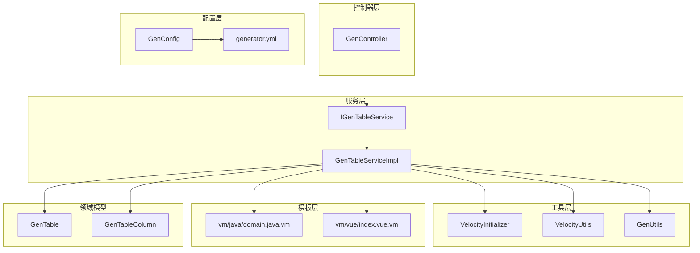
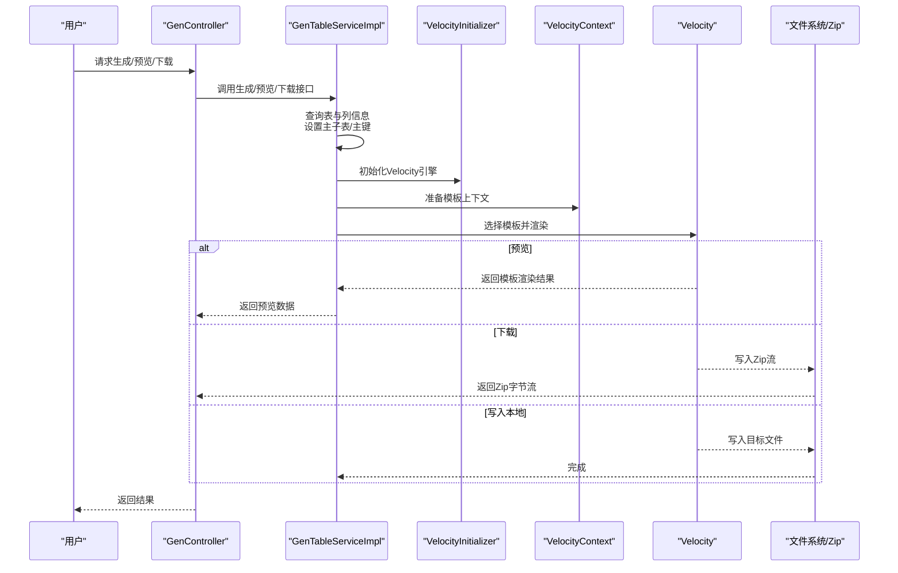
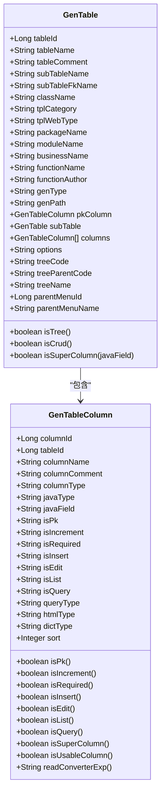
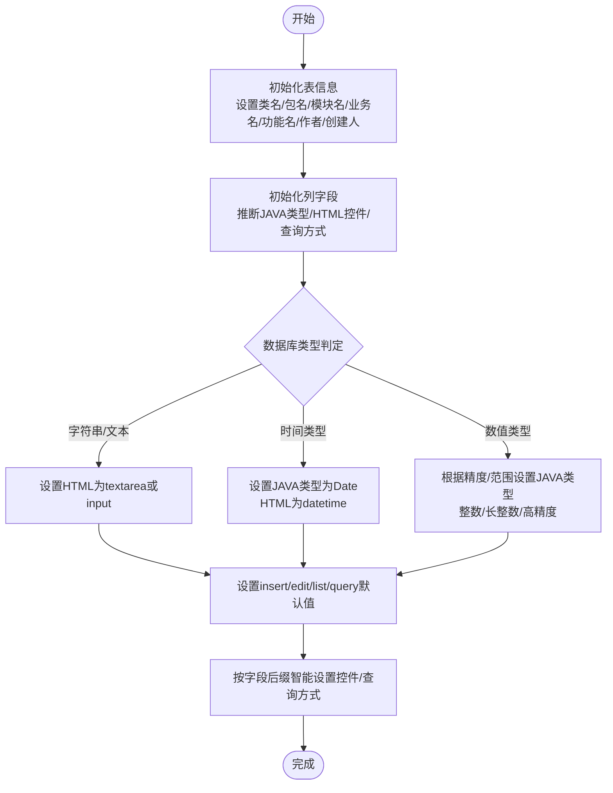
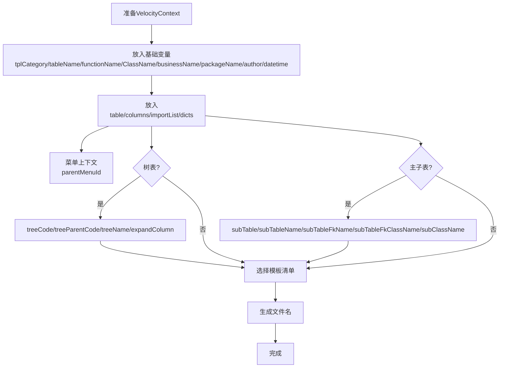
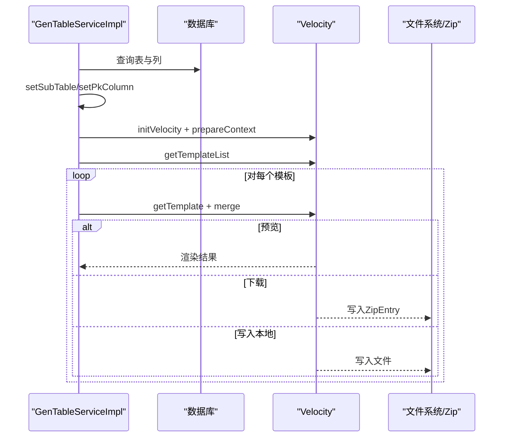
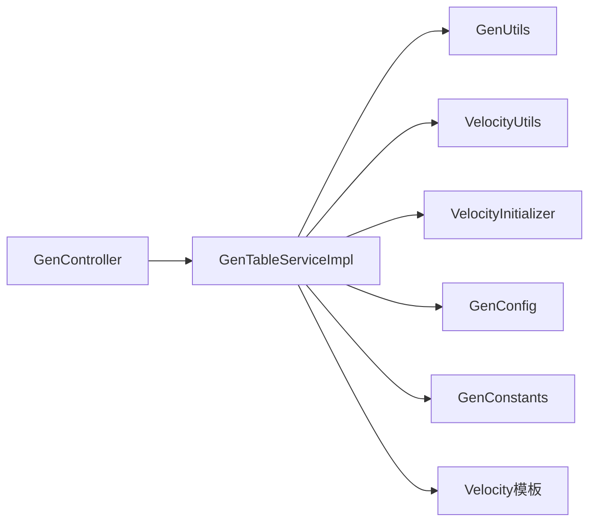

# 代码生成系统

<cite>
**本文引用的文件**
- [GenTable.java](file://blog-generator/src/main/java/blog/generator/domain/GenTable.java)
- [GenTableColumn.java](file://blog-generator/src/main/java/blog/generator/domain/GenTableColumn.java)
- [GenUtils.java](file://blog-generator/src/main/java/blog/generator/util/GenUtils.java)
- [VelocityUtils.java](file://blog-generator/src/main/java/blog/generator/util/VelocityUtils.java)
- [VelocityInitializer.java](file://blog-generator/src/main/java/blog/generator/util/VelocityInitializer.java)
- [GenConfig.java](file://blog-generator/src/main/java/blog/generator/config/GenConfig.java)
- [generator.yml](file://blog-generator/src/main/resources/generator.yml)
- [GenConstants.java](file://blog-common/src/main/java/blog/common/constant/GenConstants.java)
- [GenController.java](file://blog-generator/src/main/java/blog/generator/controller/GenController.java)
- [IGenTableService.java](file://blog-generator/src/main/java/blog/generator/service/IGenTableService.java)
- [GenTableServiceImpl.java](file://blog-generator/src/main/java/blog/generator/service/GenTableServiceImpl.java)
- [domain.java.vm](file://blog-generator/src/main/resources/vm/java/domain.java.vm)
- [index.vue.vm](file://blog-generator/src/main/resources/vm/vue/index.vue.vm)
</cite>

## 目录
1. [简介](#简介)
2. [项目结构](#项目结构)
3. [核心组件](#核心组件)
4. [架构总览](#架构总览)
5. [详细组件分析](#详细组件分析)
6. [依赖关系分析](#依赖关系分析)
7. [性能与可扩展性](#性能与可扩展性)
8. [故障排查指南](#故障排查指南)
9. [结论](#结论)
10. [附录：使用与扩展指南](#附录使用与扩展指南)

## 简介
本系统基于 Velocity 模板引擎与 Java 代码生成器，提供从数据库表到前后端代码的自动化生成能力。支持多种模板类别（单表 CRUD、树表、主子表）、前端框架（Element-UI 与 Element Plus）、以及灵活的生成策略（下载打包或直接写入本地路径）。通过统一的配置中心与常量定义，确保生成规则的一致性与可维护性。

## 项目结构
代码生成模块位于 blog-generator，核心由以下层次组成：
- 控制器层：对外提供 REST 接口，负责接收请求、调用服务层并返回结果
- 服务层：封装生成、预览、下载、同步等核心流程
- 工具层：负责 Velocity 初始化、上下文准备、模板选择与文件命名
- 配置层：集中管理生成参数（作者、包名、表前缀、覆盖策略等）
- 模板层：Velocity 模板资源，覆盖 Java、Vue、JS、XML、SQL 等
- 持久层：对 GenTable 与 GenTableColumn 的数据库访问

图表来源
- [GenController.java:45-241](file://blog-generator/src/main/java/blog/generator/controller/GenController.java#L45-L241)
- [IGenTableService.java:13-131](file://blog-generator/src/main/java/blog/generator/service/IGenTableService.java#L13-L131)
- [GenTableServiceImpl.java:47-470](file://blog-generator/src/main/java/blog/generator/service/GenTableServiceImpl.java#L47-L470)
- [VelocityInitializer.java:13-31](file://blog-generator/src/main/java/blog/generator/util/VelocityInitializer.java#L13-L31)
- [VelocityUtils.java:22-364](file://blog-generator/src/main/java/blog/generator/util/VelocityUtils.java#L22-L364)
- [GenUtils.java:17-223](file://blog-generator/src/main/java/blog/generator/util/GenUtils.java#L17-L223)
- [GenConfig.java:13-87](file://blog-generator/src/main/java/blog/generator/config/GenConfig.java#L13-L87)
- [generator.yml:1-12](file://blog-generator/src/main/resources/generator.yml#L1-L12)
- [GenTable.java:20-177](file://blog-generator/src/main/java/blog/generator/domain/GenTable.java#L20-L177)
- [GenTableColumn.java:12-348](file://blog-generator/src/main/java/blog/generator/domain/GenTableColumn.java#L12-L348)
- [domain.java.vm:1-57](file://blog-generator/src/main/resources/vm/java/domain.java.vm#L1-L57)
- [index.vue.vm:1-603](file://blog-generator/src/main/resources/vm/vue/index.vue.vm#L1-L603)

章节来源
- [GenController.java:45-241](file://blog-generator/src/main/java/blog/generator/controller/GenController.java#L45-L241)
- [GenTableServiceImpl.java:47-470](file://blog-generator/src/main/java/blog/generator/service/GenTableServiceImpl.java#L47-L470)

## 核心组件
- GenTable：业务表元数据，包含模板类别、前端类型、包名、模块名、业务名、功能名、作者、生成方式与路径、主键列、子表、列集合、树字段与上级菜单等
- GenTableColumn：表字段元数据，包含列名、注释、类型、JAVA 类型与字段、是否主键/自增/必填、增删改查显示控制、查询方式、HTML 控件类型、字典类型、排序等
- GenUtils：初始化表与列信息，自动推断 JAVA 类型、HTML 控件、查询方式、模块与业务名、类名等
- VelocityUtils：构建 VelocityContext、选择模板、生成文件名、导入包、字典组、权限前缀、树表参数、主子表上下文
- VelocityInitializer：初始化 Velocity 引擎，加载模板资源
- GenConfig：读取 generator.yml 中的生成配置（作者、包名、自动去前缀、表前缀、覆盖策略）
- GenConstants：生成常量定义（模板类别、树字段、HTML 控件、JAVA 类型、查询方式、白名单等）

章节来源
- [GenTable.java:20-177](file://blog-generator/src/main/java/blog/generator/domain/GenTable.java#L20-L177)
- [GenTableColumn.java:12-348](file://blog-generator/src/main/java/blog/generator/domain/GenTableColumn.java#L12-L348)
- [GenUtils.java:17-223](file://blog-generator/src/main/java/blog/generator/util/GenUtils.java#L17-L223)
- [VelocityUtils.java:22-364](file://blog-generator/src/main/java/blog/generator/util/VelocityUtils.java#L22-L364)
- [VelocityInitializer.java:13-31](file://blog-generator/src/main/java/blog/generator/util/VelocityInitializer.java#L13-L31)
- [GenConfig.java:13-87](file://blog-generator/src/main/java/blog/generator/config/GenConfig.java#L13-L87)
- [GenConstants.java:8-187](file://blog-common/src/main/java/blog/common/constant/GenConstants.java#L8-L187)

## 架构总览
整体流程：控制器接收请求 → 服务层加载表与列信息 → 初始化上下文 → 选择模板 → Velocity 渲染 → 输出（预览/下载/写入本地）

图表来源
- [GenController.java:170-241](file://blog-generator/src/main/java/blog/generator/controller/GenController.java#L170-L241)
- [GenTableServiceImpl.java:193-366](file://blog-generator/src/main/java/blog/generator/service/GenTableServiceImpl.java#L193-L366)
- [VelocityInitializer.java:17-29](file://blog-generator/src/main/java/blog/generator/util/VelocityInitializer.java#L17-L29)
- [VelocityUtils.java:43-77](file://blog-generator/src/main/java/blog/generator/util/VelocityUtils.java#L43-L77)

## 详细组件分析

### 数据模型：GenTable 与 GenTableColumn
- GenTable：承载表级配置与行为开关，如模板类别（crud/tree/sub）、前端类型（element-ui/element-plus）、包名、模块名、业务名、功能名、作者、生成方式（zip/自定义路径）、生成路径、主键列、子表、列集合、树字段（treeCode/treeParentCode/treeName）、上级菜单（parentMenuId/name）
- GenTableColumn：承载列级配置，如列名/注释/类型、JAVA 类型与字段、是否主键/自增/必填、增删改查显示控制（insert/edit/list/query）、查询方式（LIKE/EQ 等）、HTML 控件类型（input/select/radio/checkbox/datetime/imageUpload/fileUpload/editor/textArea 等）、字典类型、排序；并提供 isSuperColumn/isUsableColumn/readConverterExp 等辅助判断与转换

图表来源
- [GenTable.java:20-177](file://blog-generator/src/main/java/blog/generator/domain/GenTable.java#L20-L177)
- [GenTableColumn.java:12-348](file://blog-generator/src/main/java/blog/generator/domain/GenTableColumn.java#L12-L348)

章节来源
- [GenTable.java:20-177](file://blog-generator/src/main/java/blog/generator/domain/GenTable.java#L20-L177)
- [GenTableColumn.java:12-348](file://blog-generator/src/main/java/blog/generator/domain/GenTableColumn.java#L12-L348)

### 生成规则与工具：GenUtils
- 表初始化：设置类名（去前缀/驼峰）、包名、模块名、业务名、功能名、作者、创建人等
- 列初始化：根据数据库类型推断 JAVA 类型（字符串/文本域/日期/整数/长整数/高精度）、HTML 控件类型（输入框/文本域/日期/上传/富文本/下拉/单选/多选）、查询方式（LIKE/EQ）、默认 insert/edit/list/query 开关、特殊字段（name/status/type/sex/image/file/content）的智能识别
- 名称转换：模块名提取、业务名提取、表名转类名（支持自动去前缀与自定义前缀列表）

图表来源
- [GenUtils.java:17-223](file://blog-generator/src/main/java/blog/generator/util/GenUtils.java#L17-L223)
- [GenConstants.java:50-186](file://blog-common/src/main/java/blog/common/constant/GenConstants.java#L50-L186)

章节来源
- [GenUtils.java:17-223](file://blog-generator/src/main/java/blog/generator/util/GenUtils.java#L17-L223)
- [GenConstants.java:50-186](file://blog-common/src/main/java/blog/common/constant/GenConstants.java#L50-L186)

### Velocity 模板引擎与上下文：VelocityUtils
- 上下文准备：设置模板类别、表名、功能名、类名大小写、包名、作者、时间、主键列、导入包、权限前缀、列集合、字典组、菜单/树/主子表上下文
- 模板选择：根据模板类别与前端类型选择模板清单（Java、XML、SQL、JS、Vue）
- 文件命名：根据模板与表信息生成目标文件路径（Java、MyBatis XML、Vue、JS）
- 导入包与字典：根据列类型与 HTML 控件动态生成 import 列表与字典组
- 树表与主子表：解析 options，注入树编码/父编码/名称、展开列、主子表类名与外键类名等

图表来源
- [VelocityUtils.java:43-364](file://blog-generator/src/main/java/blog/generator/util/VelocityUtils.java#L43-L364)

章节来源
- [VelocityUtils.java:22-364](file://blog-generator/src/main/java/blog/generator/util/VelocityUtils.java#L22-L364)

### 生成器工具类：GenTableServiceImpl
- 预览：查询表与列 → 设置主子表/主键 → 初始化 Velocity → 渲染模板 → 返回模板渲染结果映射
- 下载：批量渲染模板 → 写入 Zip → 返回字节数组
- 写入本地：批量渲染模板 → 过滤非前端模板 → 写入目标文件（支持自定义路径）
- 同步数据库：对比数据库列与现有列，保留必要的配置（必填/显示类型/字典类型/查询方式），更新或删除列
- 参数校验：树表需校验树编码/父编码/名称；主子表需校验子表名与外键名

图表来源
- [GenTableServiceImpl.java:193-366](file://blog-generator/src/main/java/blog/generator/service/GenTableServiceImpl.java#L193-L366)

章节来源
- [GenTableServiceImpl.java:47-470](file://blog-generator/src/main/java/blog/generator/service/GenTableServiceImpl.java#L47-L470)

### 配置选项与参数
- 配置来源：generator.yml 中的 gen.* 配置项
- 关键参数：
  - author：作者
  - packageName：生成包路径（默认 biz）
  - autoRemovePre：是否自动去除表前缀
  - tablePrefix：表前缀列表（逗号分隔）
  - allowOverwrite：是否允许覆盖写入本地（自定义路径）
- 生成参数：通过 GenTable.options 以 JSON 形式存储，如树表的 treeCode/treeParentCode/treeName、菜单 parentMenuId/parentMenuName 等

章节来源
- [generator.yml:1-12](file://blog-generator/src/main/resources/generator.yml#L1-L12)
- [GenConfig.java:13-87](file://blog-generator/src/main/java/blog/generator/config/GenConfig.java#L13-L87)
- [GenTable.java:125-152](file://blog-generator/src/main/java/blog/generator/domain/GenTable.java#L125-L152)

### 模板使用与编写要点
- Java 模板（示例：domain.java.vm）：使用 Velocity 语法进行变量替换、循环与条件判断，动态生成注解、字段、导入包与实体继承关系
- Vue 模板（示例：index.vue.vm）：根据列的 HTML 控件类型与字典类型生成表单控件、列表展示、校验规则、分页与 API 调用

章节来源
- [domain.java.vm:1-57](file://blog-generator/src/main/resources/vm/java/domain.java.vm#L1-L57)
- [index.vue.vm:1-603](file://blog-generator/src/main/resources/vm/vue/index.vue.vm#L1-L603)

## 依赖关系分析
- 控制器依赖服务接口，服务实现依赖工具类与 Velocity 引擎
- 服务实现依赖 Mapper 访问数据库，依赖 GenUtils/VelocityUtils/VelocityInitializer 完成生成流程
- 配置通过 GenConfig 注入，常量通过 GenConstants 统一管理
- 模板资源通过 Velocity 资源加载器从 classpath 读取

图表来源
- [GenController.java:45-241](file://blog-generator/src/main/java/blog/generator/controller/GenController.java#L45-L241)
- [GenTableServiceImpl.java:47-470](file://blog-generator/src/main/java/blog/generator/service/GenTableServiceImpl.java#L47-L470)
- [GenUtils.java:17-223](file://blog-generator/src/main/java/blog/generator/util/GenUtils.java#L17-L223)
- [VelocityUtils.java:22-364](file://blog-generator/src/main/java/blog/generator/util/VelocityUtils.java#L22-L364)
- [VelocityInitializer.java:13-31](file://blog-generator/src/main/java/blog/generator/util/VelocityInitializer.java#L13-L31)
- [GenConfig.java:13-87](file://blog-generator/src/main/java/blog/generator/config/GenConfig.java#L13-L87)
- [GenConstants.java:8-187](file://blog-common/src/main/java/blog/common/constant/GenConstants.java#L8-L187)

章节来源
- [GenController.java:45-241](file://blog-generator/src/main/java/blog/generator/controller/GenController.java#L45-L241)
- [GenTableServiceImpl.java:47-470](file://blog-generator/src/main/java/blog/generator/service/GenTableServiceImpl.java#L47-L470)

## 性能与可扩展性
- 性能特性
  - 模板渲染采用一次性初始化 Velocity 引擎，减少重复初始化开销
  - 批量生成时优先写入 Zip 流，降低磁盘 IO 并提升网络传输效率
  - 列初始化采用常量数组与快速判定，避免复杂正则匹配
- 可扩展性
  - 新增模板：在 vm 目录下新增 .vm 文件，并在 VelocityUtils.getTemplateList 中注册
  - 新增生成规则：在 GenUtils 中扩展列初始化逻辑（类型映射/控件/查询方式）
  - 新增配置：在 generator.yml 与 GenConfig 中新增配置项，通过 GenTable.options 扩展树表/主子表参数

[本节为通用建议，无需特定文件分析]

## 故障排查指南
- 生成失败（渲染模板）：检查模板语法、上下文变量是否存在；查看日志定位具体表名
- 无法覆盖本地文件：确认 generator.yml 中 allowOverwrite=true；否则仅支持下载打包
- 树表/主子表参数缺失：校验 GenTable.options 是否包含必需字段（树表：treeCode/treeParentCode/treeName；主子表：subTableName/subTableFkName）
- 同步数据库后字段丢失：确认保留策略（必填/显示类型/字典类型/查询方式）是否正确迁移

章节来源
- [GenTableServiceImpl.java:262-266](file://blog-generator/src/main/java/blog/generator/service/GenTableServiceImpl.java#L262-L266)
- [GenTableServiceImpl.java:374-392](file://blog-generator/src/main/java/blog/generator/service/GenTableServiceImpl.java#L374-L392)
- [GenTableServiceImpl.java:286-314](file://blog-generator/src/main/java/blog/generator/service/GenTableServiceImpl.java#L286-L314)

## 结论
该代码生成系统通过清晰的分层设计与 Velocity 模板引擎，实现了从数据库表到前后端代码的自动化生成。借助统一的配置与常量体系，保证了生成规则的一致性与可维护性。通过服务层的预览、下载与本地写入能力，满足不同场景需求；通过同步机制与参数校验，保障生成结果的准确性与完整性。

[本节为总结，无需特定文件分析]

## 附录：使用与扩展指南

### 使用指南
- 预览代码：调用预览接口，查看渲染结果，便于快速审阅
- 下载代码：批量选择表，下载 Zip 包，便于集成到项目
- 生成到本地：开启允许覆盖后，直接生成到自定义路径
- 同步数据库：当表结构变更时，同步生成配置，保留必要字段属性

章节来源
- [GenController.java:170-241](file://blog-generator/src/main/java/blog/generator/controller/GenController.java#L170-L241)
- [GenTableServiceImpl.java:224-331](file://blog-generator/src/main/java/blog/generator/service/GenTableServiceImpl.java#L224-L331)

### 扩展开发
- 新增模板：在 vm 目录新增 .vm 文件，并在 VelocityUtils.getTemplateList 中注册
- 新增生成规则：在 GenUtils 中扩展列初始化逻辑（类型映射/控件/查询方式）
- 新增配置：在 generator.yml 与 GenConfig 中新增配置项，结合 GenTable.options 扩展树表/主子表参数
- 自定义路径：通过 GenTable.genPath 指定生成路径，支持相对路径与绝对路径

章节来源
- [VelocityUtils.java:129-154](file://blog-generator/src/main/java/blog/generator/util/VelocityUtils.java#L129-L154)
- [GenUtils.java:156-182](file://blog-generator/src/main/java/blog/generator/util/GenUtils.java#L156-L182)
- [GenConfig.java:13-87](file://blog-generator/src/main/java/blog/generator/config/GenConfig.java#L13-L87)
- [GenTable.java:103-106](file://blog-generator/src/main/java/blog/generator/domain/GenTable.java#L103-L106)