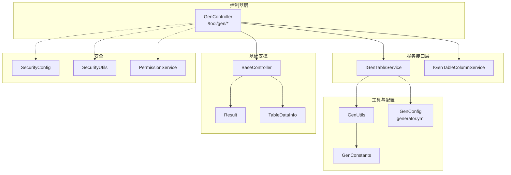
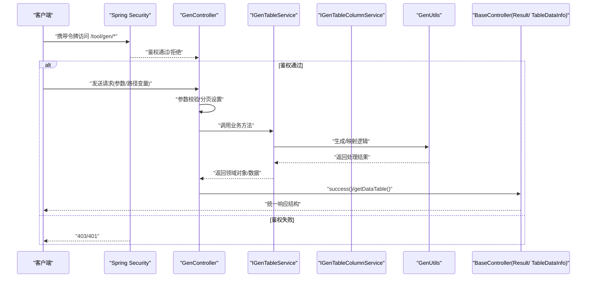
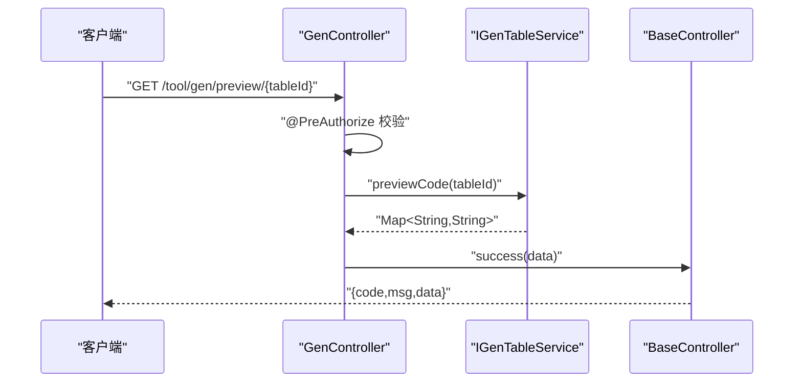
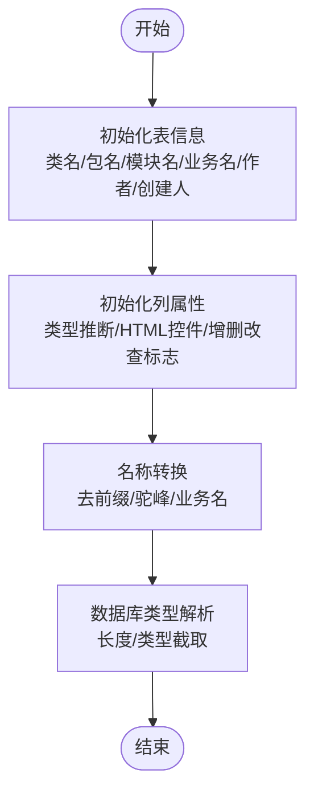
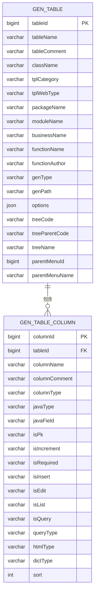
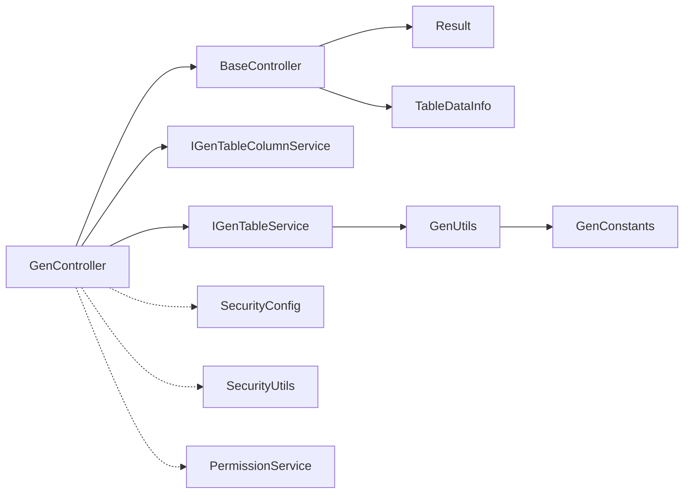

# 控制器接口

<cite>
**本文引用的文件**
- [GenController.java](file://blog-generator/src/main/java/blog/generator/controller/GenController.java)
- [IGenTableService.java](file://blog-generator/src/main/java/blog/generator/service/IGenTableService.java)
- [IGenTableColumnService.java](file://blog-generator/src/main/java/blog/generator/service/IGenTableColumnService.java)
- [GenUtils.java](file://blog-generator/src/main/java/blog/generator/util/GenUtils.java)
- [BaseController.java](file://blog-common/src/main/java/blog/common/base/controller/BaseController.java)
- [Result.java](file://blog-common/src/main/java/blog/common/base/resp/Result.java)
- [TableDataInfo.java](file://blog-common/src/main/java/blog/common/base/resp/TableDataInfo.java)
- [GenTable.java](file://blog-generator/src/main/java/blog/generator/domain/GenTable.java)
- [GenTableColumn.java](file://blog-generator/src/main/java/blog/generator/domain/GenTableColumn.java)
- [GenConstants.java](file://blog-common/src/main/java/blog/common/constant/GenConstants.java)
- [GenConfig.java](file://blog-generator/src/main/java/blog/generator/config/GenConfig.java)
- [generator.yml](file://blog-generator/src/main/resources/generator.yml)
- [SecurityConfig.java](file://blog-framework/src/main/java/blog/framework/config/SecurityConfig.java)
- [SecurityUtils.java](file://blog-common/src/main/java/blog/common/utils/SecurityUtils.java)
- [PermissionService.java](file://blog-framework/src/main/java/blog/framework/web/service/PermissionService.java)
</cite>

## 目录
1. [简介](#简介)
2. [项目结构](#项目结构)
3. [核心组件](#核心组件)
4. [架构总览](#架构总览)
5. [详细组件分析](#详细组件分析)
6. [依赖关系分析](#依赖关系分析)
7. [性能考量](#性能考量)
8. [故障排查指南](#故障排查指南)
9. [结论](#结论)
10. [附录](#附录)

## 简介
本文件面向“代码生成控制器接口”的技术文档，围绕 GenController 的设计与实现进行系统化说明。重点涵盖：
- RESTful 接口设计与路由约定
- 请求参数处理与响应数据封装
- 安全控制机制（权限验证、参数校验、异常处理）
- 返回数据格式与错误码规范
- 调用流程（参数接收、业务处理、结果返回、日志记录）
- 最佳实践（参数传递、错误处理、性能优化、调试技巧）

## 项目结构
GenController 所在模块为 blog-generator，控制器位于 controller 层，依赖 service 层接口与工具类，统一通过 BaseController 提供分页与响应封装能力；返回结构由 Result 与 TableDataInfo 统一管理；权限控制由 Spring Security 与方法级注解共同保障。



图表来源
- [GenController.java:47-241](file://blog-generator/src/main/java/blog/generator/controller/GenController.java#L47-L241)
- [IGenTableService.java:13-131](file://blog-generator/src/main/java/blog/generator/service/IGenTableService.java#L13-L131)
- [IGenTableColumnService.java:12-45](file://blog-generator/src/main/java/blog/generator/service/IGenTableColumnService.java#L12-L45)
- [GenUtils.java:17-223](file://blog-generator/src/main/java/blog/generator/util/GenUtils.java#L17-L223)
- [GenConfig.java:16-87](file://blog-generator/src/main/java/blog/generator/config/GenConfig.java#L16-L87)
- [BaseController.java:30-182](file://blog-common/src/main/java/blog/common/base/controller/BaseController.java#L30-L182)
- [Result.java:14-205](file://blog-common/src/main/java/blog/common/base/resp/Result.java#L14-L205)
- [TableDataInfo.java:14-98](file://blog-common/src/main/java/blog/common/base/resp/TableDataInfo.java#L14-L98)
- [SecurityConfig.java:31-137](file://blog-framework/src/main/java/blog/framework/config/SecurityConfig.java#L31-L137)

章节来源
- [GenController.java:47-241](file://blog-generator/src/main/java/blog/generator/controller/GenController.java#L47-L241)
- [BaseController.java:30-182](file://blog-common/src/main/java/blog/common/base/controller/BaseController.java#L30-L182)
- [Result.java:14-205](file://blog-common/src/main/java/blog/common/base/resp/Result.java#L14-L205)
- [TableDataInfo.java:14-98](file://blog-common/src/main/java/blog/common/base/resp/TableDataInfo.java#L14-L98)

## 核心组件
- GenController：REST 控制器，统一暴露 /tool/gen 前缀下的代码生成相关接口，负责参数接收、权限校验、调用服务层并封装响应。
- IGenTableService / IGenTableColumnService：服务接口，定义代码生成、表/列信息查询、导入、同步、预览、下载与生成等能力。
- GenUtils：代码生成工具类，负责表/列初始化、命名转换、HTML/Java 类型映射、默认字段策略等。
- GenConfig + generator.yml：生成配置项（作者、包名、是否自动去前缀、表前缀、是否允许覆盖本地文件）。
- BaseController + Result + TableDataInfo：统一响应结构与分页封装，简化控制器返回逻辑。
- 安全组件：SecurityConfig（方法级权限开关）、SecurityUtils（权限判断工具）、PermissionService（权限服务）。

章节来源
- [GenController.java:47-241](file://blog-generator/src/main/java/blog/generator/controller/GenController.java#L47-L241)
- [IGenTableService.java:13-131](file://blog-generator/src/main/java/blog/generator/service/IGenTableService.java#L13-L131)
- [IGenTableColumnService.java:12-45](file://blog-generator/src/main/java/blog/generator/service/IGenTableColumnService.java#L12-L45)
- [GenUtils.java:17-223](file://blog-generator/src/main/java/blog/generator/util/GenUtils.java#L17-L223)
- [GenConfig.java:16-87](file://blog-generator/src/main/java/blog/generator/config/GenConfig.java#L16-L87)
- [generator.yml:1-12](file://blog-generator/src/main/resources/generator.yml#L1-L12)
- [BaseController.java:30-182](file://blog-common/src/main/java/blog/common/base/controller/BaseController.java#L30-L182)
- [Result.java:14-205](file://blog-common/src/main/java/blog/common/base/resp/Result.java#L14-L205)
- [TableDataInfo.java:14-98](file://blog-common/src/main/java/blog/common/base/resp/TableDataInfo.java#L14-L98)
- [SecurityConfig.java:31-137](file://blog-framework/src/main/java/blog/framework/config/SecurityConfig.java#L31-L137)
- [SecurityUtils.java:124-158](file://blog-common/src/main/java/blog/common/utils/SecurityUtils.java#L124-L158)
- [PermissionService.java:41-81](file://blog-framework/src/main/java/blog/framework/web/service/PermissionService.java#L41-L81)

## 架构总览
GenController 作为入口，串联权限校验、参数解析、服务调用与响应封装，形成清晰的职责边界与调用链路。



图表来源
- [GenController.java:57-241](file://blog-generator/src/main/java/blog/generator/controller/GenController.java#L57-L241)
- [IGenTableService.java:13-131](file://blog-generator/src/main/java/blog/generator/service/IGenTableService.java#L13-L131)
- [IGenTableColumnService.java:12-45](file://blog-generator/src/main/java/blog/generator/service/IGenTableColumnService.java#L12-L45)
- [GenUtils.java:17-223](file://blog-generator/src/main/java/blog/generator/util/GenUtils.java#L17-L223)
- [BaseController.java:75-182](file://blog-common/src/main/java/blog/common/base/controller/BaseController.java#L75-L182)

## 详细组件分析

### GenController 接口清单与用途
- 列表查询
  - GET /tool/gen/list
  - 功能：分页查询已导入的代码生成业务表
  - 权限：tool:gen:list
  - 参数：GenTable（分页/查询条件由 BaseController.startPage() 与 TableSupport 组合生效）
  - 返回：TableDataInfo（总条数+列表）
- 数据库表列表
  - GET /tool/gen/db/list
  - 功能：分页查询数据库中可用的表
  - 权限：tool:gen:list
  - 返回：TableDataInfo
- 表详情获取
  - GET /tool/gen/{tableId}
  - 功能：获取指定表的元信息、字段列表与全部表列表
  - 权限：tool:gen:query
  - 返回：Result（data=info, rows, tables）
- 字段列表
  - GET /tool/gen/column/{tableId}
  - 功能：按表查询字段列表
  - 权限：tool:gen:list
  - 返回：TableDataInfo
- 导入表结构（保存）
  - POST /tool/gen/importTable
  - 功能：批量导入数据库表为代码生成配置
  - 权限：tool:gen:import
  - 参数：tables（逗号分隔的表名字符串）
  - 返回：Result
- 创建表结构（保存）
  - POST /tool/gen/createTable
  - 功能：解析并执行建表语句，导入为代码生成配置
  - 权限：角色 admin
  - 参数：sql（多条 MySQL 语句）
  - 返回：Result
- 修改保存
  - PUT /tool/gen
  - 功能：修改代码生成配置（含参数校验）
  - 权限：tool:gen:edit
  - 参数：GenTable（JSON）
  - 返回：Result
- 删除
  - DELETE /tool/gen/{tableIds}
  - 功能：批量删除代码生成配置
  - 权限：tool:gen:remove
  - 返回：Result
- 预览代码
  - GET /tool/gen/preview/{tableId}
  - 功能：预览生成后的文件内容（键为文件名，值为内容）
  - 权限：tool:gen:preview
  - 返回：Result（data=Map<String,String>）
- 生成代码（下载）
  - GET /tool/gen/download/{tableName}
  - 功能：打包下载生成的代码（blog.zip）
  - 权限：tool:gen:code
  - 返回：二进制流（zip）
- 生成代码（自定义路径）
  - GET /tool/gen/genCode/{tableName}
  - 功能：直接生成到本地自定义路径（受 allowOverwrite 限制）
  - 权限：tool:gen:code
  - 返回：Result
- 同步数据库
  - GET /tool/gen/synchDb/{tableName}
  - 功能：同步数据库与代码生成配置
  - 权限：tool:gen:edit
  - 返回：Result
- 批量生成代码（下载）
  - GET /tool/gen/batchGenCode?tables=a,b,c
  - 功能：批量打包下载
  - 权限：tool:gen:code
  - 返回：二进制流（zip）

章节来源
- [GenController.java:57-241](file://blog-generator/src/main/java/blog/generator/controller/GenController.java#L57-L241)

### 请求参数处理与校验
- 路径变量：如 {tableId}、{tableIds}、{tableName}，通过 @PathVariable 接收
- 查询参数：如 tables、page、limit、orderBy 等，结合 BaseController.startPage() 与 TableSupport 实现分页与排序
- JSON 请求体：如修改保存接口，使用 @RequestBody 接收 GenTable，并配合 @Validated 进行 JSR-303 校验
- 参数过滤：导入/创建接口对输入进行安全过滤（例如 SQL 关键词过滤与解析）

章节来源
- [GenController.java:57-241](file://blog-generator/src/main/java/blog/generator/controller/GenController.java#L57-L241)
- [BaseController.java:50-70](file://blog-common/src/main/java/blog/common/base/controller/BaseController.java#L50-L70)
- [GenTable.java:33-96](file://blog-generator/src/main/java/blog/generator/domain/GenTable.java#L33-L96)

### 响应数据封装与格式规范
- 统一响应结构：Result
  - 字段：code、msg、data
  - 成功/失败/警告工厂方法，便于链式调用
- 分页响应结构：TableDataInfo
  - 字段：code、msg、total、rows
  - 适用于列表/分页场景
- 控制器返回策略：
  - 列表/分页：getDataTable(list)
  - 成功：success()/success(data)/toAjax(...)
  - 失败：error()/warn()

章节来源
- [Result.java:14-205](file://blog-common/src/main/java/blog/common/base/resp/Result.java#L14-L205)
- [TableDataInfo.java:14-98](file://blog-common/src/main/java/blog/common/base/resp/TableDataInfo.java#L14-L98)
- [BaseController.java:75-145](file://blog-common/src/main/java/blog/common/base/controller/BaseController.java#L75-L145)

### 安全控制机制
- 方法级权限注解
  - @PreAuthorize("@ss.hasPermi('tool:gen:*')")：基于权限字符串校验
  - @PreAuthorize("@ss.hasRole('admin')")：基于角色校验
- 权限判断工具
  - SecurityUtils.hasPermi/hasRole：内部委托 PermissionService 完成权限匹配
- 安全配置
  - SecurityConfig 开启方法级安全（prePostEnabled=true），并配置 CORS、JWT 过滤器链
- 参数安全
  - createTable 接口对 SQL 进行关键字过滤与解析，防止危险操作
  - genCode 接口受 allowOverwrite 配置限制，避免覆盖本地文件

章节来源
- [GenController.java:57-241](file://blog-generator/src/main/java/blog/generator/controller/GenController.java#L57-L241)
- [SecurityConfig.java:31-137](file://blog-framework/src/main/java/blog/framework/config/SecurityConfig.java#L31-L137)
- [SecurityUtils.java:124-158](file://blog-common/src/main/java/blog/common/utils/SecurityUtils.java#L124-L158)
- [PermissionService.java:41-81](file://blog-framework/src/main/java/blog/framework/web/service/PermissionService.java#L41-L81)
- [GenConfig.java:78-85](file://blog-generator/src/main/java/blog/generator/config/GenConfig.java#L78-L85)

### 调用流程与处理链路
以“预览代码”为例：



图表来源
- [GenController.java:174-179](file://blog-generator/src/main/java/blog/generator/controller/GenController.java#L174-L179)
- [IGenTableService.java:91-91](file://blog-generator/src/main/java/blog/generator/service/IGenTableService.java#L91-L91)
- [BaseController.java:109-111](file://blog-common/src/main/java/blog/common/base/controller/BaseController.java#L109-L111)

以“批量生成代码（下载）”为例：

```mermaid
sequenceDiagram
participant C as "客户端"
participant G as "GenController"
participant S as "IGenTableService"
participant W as "响应输出"
C->>G : "GET /tool/gen/batchGenCode?tables=a,b,c"
G->>G : "@PreAuthorize 校验"
G->>S : "downloadCode(tableNames)"
S-->>G : "byte[]"
G->>W : "genCode(response, data)"
W-->>C : "Content-Disposition : attachment; filename=blog.zip"
```

图表来源
- [GenController.java:222-240](file://blog-generator/src/main/java/blog/generator/controller/GenController.java#L222-L240)
- [IGenTableService.java:122-122](file://blog-generator/src/main/java/blog/generator/service/IGenTableService.java#L122-L122)

### 复杂逻辑组件：代码生成工具与映射
GenUtils 负责：
- 表信息初始化（类名、包名、模块名、业务名、作者、创建人等）
- 列属性初始化（Java 类型推断、HTML 控件类型、是否插入/编辑/列表/查询、查询方式等）
- 名称转换（自动去前缀、驼峰转换、业务名提取）
- 数据库类型解析与字段长度提取



图表来源
- [GenUtils.java:21-223](file://blog-generator/src/main/java/blog/generator/util/GenUtils.java#L21-L223)
- [GenConstants.java:8-187](file://blog-common/src/main/java/blog/common/constant/GenConstants.java#L8-L187)

章节来源
- [GenUtils.java:17-223](file://blog-generator/src/main/java/blog/generator/util/GenUtils.java#L17-L223)
- [GenConstants.java:8-187](file://blog-common/src/main/java/blog/common/constant/GenConstants.java#L8-L187)

### 数据模型与关系


图表来源
- [GenTable.java:23-177](file://blog-generator/src/main/java/blog/generator/domain/GenTable.java#L23-L177)
- [GenTableColumn.java:12-348](file://blog-generator/src/main/java/blog/generator/domain/GenTableColumn.java#L12-L348)

章节来源
- [GenTable.java:23-177](file://blog-generator/src/main/java/blog/generator/domain/GenTable.java#L23-L177)
- [GenTableColumn.java:12-348](file://blog-generator/src/main/java/blog/generator/domain/GenTableColumn.java#L12-L348)

## 依赖关系分析
- 控制器依赖服务接口与工具类，不直接依赖持久层
- BaseController 提供统一分页与响应封装，降低重复代码
- Result/ TableDataInfo 作为跨模块通用响应载体
- 安全配置启用方法级权限，控制器通过注解声明权限



图表来源
- [GenController.java:47-241](file://blog-generator/src/main/java/blog/generator/controller/GenController.java#L47-L241)
- [BaseController.java:30-182](file://blog-common/src/main/java/blog/common/base/controller/BaseController.java#L30-L182)
- [Result.java:14-205](file://blog-common/src/main/java/blog/common/base/resp/Result.java#L14-L205)
- [TableDataInfo.java:14-98](file://blog-common/src/main/java/blog/common/base/resp/TableDataInfo.java#L14-L98)
- [IGenTableService.java:13-131](file://blog-generator/src/main/java/blog/generator/service/IGenTableService.java#L13-L131)
- [IGenTableColumnService.java:12-45](file://blog-generator/src/main/java/blog/generator/service/IGenTableColumnService.java#L12-L45)
- [GenUtils.java:17-223](file://blog-generator/src/main/java/blog/generator/util/GenUtils.java#L17-L223)
- [GenConstants.java:8-187](file://blog-common/src/main/java/blog/common/constant/GenConstants.java#L8-L187)
- [SecurityConfig.java:31-137](file://blog-framework/src/main/java/blog/framework/config/SecurityConfig.java#L31-L137)
- [SecurityUtils.java:124-158](file://blog-common/src/main/java/blog/common/utils/SecurityUtils.java#L124-L158)
- [PermissionService.java:41-81](file://blog-framework/src/main/java/blog/framework/web/service/PermissionService.java#L41-L81)

## 性能考量
- 分页与排序
  - 使用 BaseController.startPage() 与 TableSupport，避免一次性加载全量数据
  - 对 orderBy 进行 SQL 注入防护（escapeOrderBySql）
- 批量操作
  - 批量生成/下载接口通过数组参数减少多次往返
- I/O 优化
  - 下载接口直接输出字节流，避免中间对象拷贝
- 生成策略
  - 通过 allowOverwrite 配置控制本地覆盖行为，避免频繁磁盘写入

章节来源
- [BaseController.java:50-70](file://blog-common/src/main/java/blog/common/base/controller/BaseController.java#L50-L70)
- [BaseController.java:57-63](file://blog-common/src/main/java/blog/common/base/controller/BaseController.java#L57-L63)
- [GenController.java:222-240](file://blog-generator/src/main/java/blog/generator/controller/GenController.java#L222-L240)
- [GenConfig.java:78-85](file://blog-generator/src/main/java/blog/generator/config/GenConfig.java#L78-L85)

## 故障排查指南
- 权限不足
  - 现象：返回 403/401
  - 排查：确认用户权限字符串或角色是否包含 tool:gen:* 或 admin
  - 参考：SecurityConfig 方法级安全、SecurityUtils.hasPermi/hasRole、PermissionService.hasAnyPermi
- 参数校验失败
  - 现象：返回 400 或业务校验错误
  - 排查：检查 GenTable/GenTableColumn 的非空与格式约束
  - 参考：@NotBlank、@Validated、validateEdit
- SQL 安全拦截
  - 现象：创建表异常
  - 排查：确认 SQL 关键词过滤与解析是否正确
  - 参考：createTable 中 SqlUtil.filterKeyword 与 SQL 解析
- 生成覆盖限制
  - 现象：genCode 返回错误提示
  - 排查：allowOverwrite 配置是否开启
  - 参考：GenConfig.isAllowOverwrite 与接口判断

章节来源
- [SecurityConfig.java:31-137](file://blog-framework/src/main/java/blog/framework/config/SecurityConfig.java#L31-L137)
- [SecurityUtils.java:124-158](file://blog-common/src/main/java/blog/common/utils/SecurityUtils.java#L124-L158)
- [PermissionService.java:41-81](file://blog-framework/src/main/java/blog/framework/web/service/PermissionService.java#L41-L81)
- [GenTable.java:33-96](file://blog-generator/src/main/java/blog/generator/domain/GenTable.java#L33-L96)
- [GenController.java:126-145](file://blog-generator/src/main/java/blog/generator/controller/GenController.java#L126-L145)
- [GenConfig.java:78-85](file://blog-generator/src/main/java/blog/generator/config/GenConfig.java#L78-L85)

## 结论
GenController 通过清晰的 REST 设计、严格的权限控制与统一的响应封装，提供了从“表选择、配置维护、预览、生成到下载”的完整代码生成闭环。结合 GenUtils 的智能映射与 GenConfig 的灵活配置，既保证了易用性也兼顾了安全性与可扩展性。

## 附录

### 接口一览与最佳实践要点
- 列表/分页
  - 使用 /tool/gen/list 与 /tool/gen/db/list，配合分页参数
  - 最佳实践：前端传入 page/limit/orderBy，后端自动注入并防护
- 导入/创建
  - 使用 /tool/gen/importTable 与 /tool/gen/createTable
  - 最佳实践：批量导入 tables 以逗号分隔；创建表时确保 SQL 合法且无危险关键词
- 修改/删除
  - 使用 PUT /tool/gen 与 DELETE /tool/gen/{tableIds}
  - 最佳实践：先预览再修改，批量删除前二次确认
- 预览/生成
  - 使用 /tool/gen/preview/{tableId} 与 /tool/gen/genCode/{tableName}
  - 最佳实践：预览通过后生成；自定义路径生成需开启 allowOverwrite
- 下载/批量
  - 使用 /tool/gen/download/{tableName} 与 /tool/gen/batchGenCode
  - 最佳实践：批量下载 tables 以逗号分隔；注意浏览器兼容性与 Content-Disposition

章节来源
- [GenController.java:57-241](file://blog-generator/src/main/java/blog/generator/controller/GenController.java#L57-L241)
- [BaseController.java:50-70](file://blog-common/src/main/java/blog/common/base/controller/BaseController.java#L50-L70)
- [GenConfig.java:78-85](file://blog-generator/src/main/java/blog/generator/config/GenConfig.java#L78-L85)
- [generator.yml:1-12](file://blog-generator/src/main/resources/generator.yml#L1-L12)