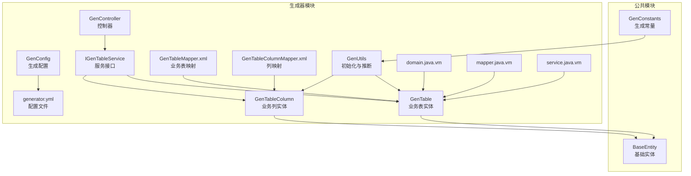
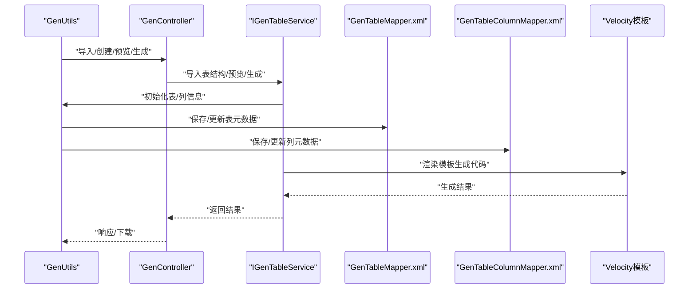
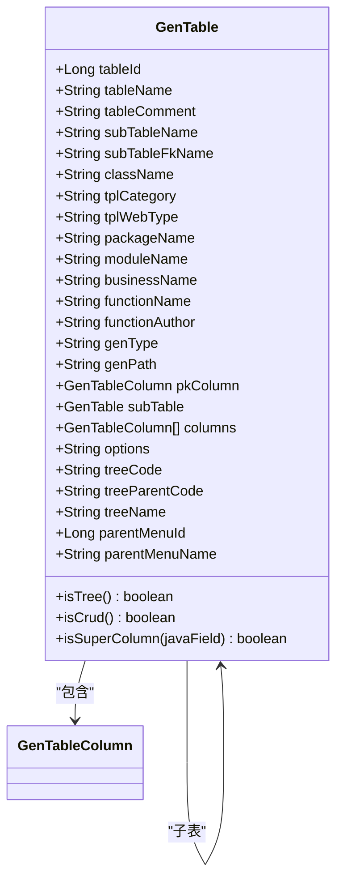
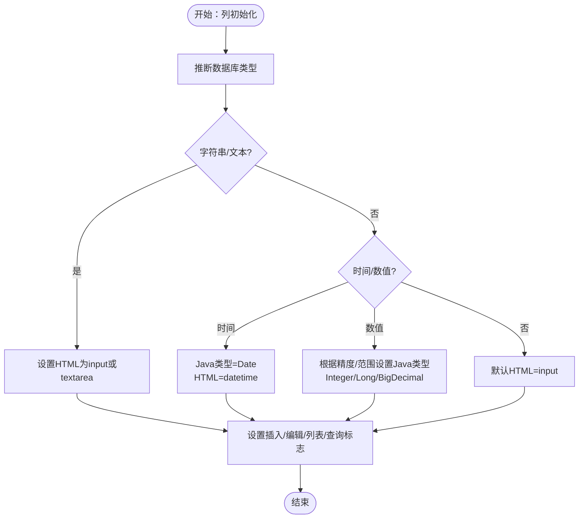
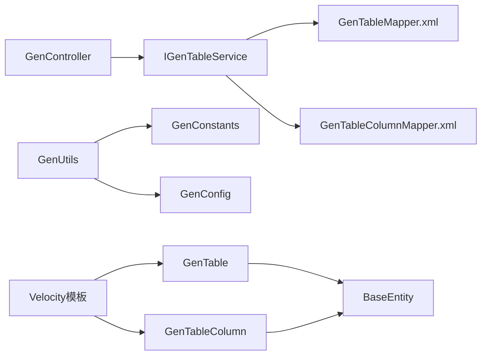

# 数据模型设计

<cite>
**本文引用的文件**
- [GenTable.java](file://blog-generator/src/main/java/blog/generator/domain/GenTable.java)
- [GenTableColumn.java](file://blog-generator/src/main/java/blog/generator/domain/GenTableColumn.java)
- [GenConfig.java](file://blog-generator/src/main/java/blog/generator/config/GenConfig.java)
- [generator.yml](file://blog-generator/src/main/resources/generator.yml)
- [GenConstants.java](file://blog-common/src/main/java/blog/common/constant/GenConstants.java)
- [GenUtils.java](file://blog-generator/src/main/java/blog/generator/util/GenUtils.java)
- [BaseEntity.java](file://blog-common/src/main/java/blog/common/base/entity/BaseEntity.java)
- [IGenTableService.java](file://blog-generator/src/main/java/blog/generator/service/IGenTableService.java)
- [GenController.java](file://blog-generator/src/main/java/blog/generator/controller/GenController.java)
- [GenTableMapper.xml](file://blog-generator/src/main/resources/mapper/generator/GenTableMapper.xml)
- [GenTableColumnMapper.xml](file://blog-generator/src/main/resources/mapper/generator/GenTableColumnMapper.xml)
- [domain.java.vm](file://blog-generator/src/main/resources/vm/java/domain.java.vm)
- [mapper.java.vm](file://blog-generator/src/main/resources/vm/java/mapper.java.vm)
- [service.java.vm](file://blog-generator/src/main/resources/vm/java/service.java.vm)
</cite>

## 目录
1. [引言](#引言)
2. [项目结构](#项目结构)
3. [核心组件](#核心组件)
4. [架构总览](#架构总览)
5. [详细组件分析](#详细组件分析)
6. [依赖分析](#依赖分析)
7. [性能考虑](#性能考虑)
8. [故障排查指南](#故障排查指南)
9. [结论](#结论)
10. [附录](#附录)

## 引言
本文面向“代码生成数据模型设计”，围绕 GenTable 与 GenTableColumn 的实体设计、表元数据管理、模板类型配置、生成选项设置、实体间关系、生成配置组织、数据验证规则以及扩展方法进行系统化技术说明。目标读者既包括需要快速上手的开发者，也包括希望深入理解实现细节的架构师。

## 项目结构
本项目采用多模块结构，代码生成相关的核心位于 blog-generator 模块；公共常量与基础实体位于 blog-common 模块；业务模块位于 blog-biz 等。与数据模型设计直接相关的文件主要集中在：
- 生成实体：GenTable、GenTableColumn
- 配置与常量：GenConfig、generator.yml、GenConstants
- 工具与初始化：GenUtils
- 控制器与服务：GenController、IGenTableService
- MyBatis 映射：GenTableMapper.xml、GenTableColumnMapper.xml
- Velocity 模板：domain.java.vm、mapper.java.vm、service.java.vm

图表来源
- [GenTable.java:15-177](file://blog-generator/src/main/java/blog/generator/domain/GenTable.java#L15-L177)
- [GenTableColumn.java:7-348](file://blog-generator/src/main/java/blog/generator/domain/GenTableColumn.java#L7-L348)
- [GenConfig.java:13-87](file://blog-generator/src/main/java/blog/generator/config/GenConfig.java#L13-L87)
- [generator.yml:1-12](file://blog-generator/src/main/resources/generator.yml#L1-L12)
- [GenUtils.java:17-223](file://blog-generator/src/main/java/blog/generator/util/GenUtils.java#L17-L223)
- [BaseEntity.java:21-85](file://blog-common/src/main/java/blog/common/base/entity/BaseEntity.java#L21-L85)
- [GenConstants.java:8-187](file://blog-common/src/main/java/blog/common/constant/GenConstants.java#L8-L187)
- [GenTableMapper.xml:57-188](file://blog-generator/src/main/resources/mapper/generator/GenTableMapper.xml#L57-L188)
- [GenTableColumnMapper.xml:39-58](file://blog-generator/src/main/resources/mapper/generator/GenTableColumnMapper.xml#L39-L58)
- [GenController.java:45-241](file://blog-generator/src/main/java/blog/generator/controller/GenController.java#L45-L241)
- [IGenTableService.java:13-131](file://blog-generator/src/main/java/blog/generator/service/IGenTableService.java#L13-L131)
- [domain.java.vm:1-57](file://blog-generator/src/main/resources/vm/java/domain.java.vm#L1-L57)
- [mapper.java.vm:1-16](file://blog-generator/src/main/resources/vm/java/mapper.java.vm#L1-L16)
- [service.java.vm:1-74](file://blog-generator/src/main/resources/vm/java/service.java.vm#L1-L74)

章节来源
- [GenTable.java:15-177](file://blog-generator/src/main/java/blog/generator/domain/GenTable.java#L15-L177)
- [GenTableColumn.java:7-348](file://blog-generator/src/main/java/blog/generator/domain/GenTableColumn.java#L7-L348)
- [GenConfig.java:13-87](file://blog-generator/src/main/java/blog/generator/config/GenConfig.java#L13-L87)
- [generator.yml:1-12](file://blog-generator/src/main/resources/generator.yml#L1-L12)
- [GenUtils.java:17-223](file://blog-generator/src/main/java/blog/generator/util/GenUtils.java#L17-L223)
- [BaseEntity.java:21-85](file://blog-common/src/main/java/blog/common/base/entity/BaseEntity.java#L21-L85)
- [GenConstants.java:8-187](file://blog-common/src/main/java/blog/common/constant/GenConstants.java#L8-L187)
- [GenTableMapper.xml:57-188](file://blog-generator/src/main/resources/mapper/generator/GenTableMapper.xml#L57-L188)
- [GenTableColumnMapper.xml:39-58](file://blog-generator/src/main/resources/mapper/generator/GenTableColumnMapper.xml#L39-L58)
- [GenController.java:45-241](file://blog-generator/src/main/java/blog/generator/controller/GenController.java#L45-L241)
- [IGenTableService.java:13-131](file://blog-generator/src/main/java/blog/generator/service/IGenTableService.java#L13-L131)
- [domain.java.vm:1-57](file://blog-generator/src/main/resources/vm/java/domain.java.vm#L1-L57)
- [mapper.java.vm:1-16](file://blog-generator/src/main/resources/vm/java/mapper.java.vm#L1-L16)
- [service.java.vm:1-74](file://blog-generator/src/main/resources/vm/java/service.java.vm#L1-L74)

## 核心组件
- GenTable：业务表实体，承载表元数据、模板类型、生成选项、树表/主子表配置、主键列与子表等。
- GenTableColumn：业务列实体，承载字段信息、数据类型、约束与注释配置、前端展示与查询策略等。
- GenConfig：生成配置读取器，从 generator.yml 中加载作者、包名、表前缀、覆盖策略等。
- GenConstants：生成常量，定义模板类型、HTML类型、查询类型、数据库类型分组、基类字段等。
- GenUtils：初始化与推断工具，负责表名转类名、模块名/业务名提取、列类型推断、默认字段策略等。
- BaseEntity：所有实体的基类，统一注入创建/更新信息与参数容器。

章节来源
- [GenTable.java:15-177](file://blog-generator/src/main/java/blog/generator/domain/GenTable.java#L15-L177)
- [GenTableColumn.java:7-348](file://blog-generator/src/main/java/blog/generator/domain/GenTableColumn.java#L7-L348)
- [GenConfig.java:13-87](file://blog-generator/src/main/java/blog/generator/config/GenConfig.java#L13-L87)
- [GenConstants.java:8-187](file://blog-common/src/main/java/blog/common/constant/GenConstants.java#L8-L187)
- [GenUtils.java:17-223](file://blog-generator/src/main/java/blog/generator/util/GenUtils.java#L17-L223)
- [BaseEntity.java:21-85](file://blog-common/src/main/java/blog/common/base/entity/BaseEntity.java#L21-L85)

## 架构总览
代码生成流程以控制器 GenController 为入口，调用 IGenTableService 完成业务逻辑；服务层通过 GenUtils 对 GenTable/GenTableColumn 进行初始化与推断；MyBatis Mapper 负责持久化；Velocity 模板根据实体生成 Java 代码。

图表来源
- [GenController.java:45-241](file://blog-generator/src/main/java/blog/generator/controller/GenController.java#L45-L241)
- [IGenTableService.java:13-131](file://blog-generator/src/main/java/blog/generator/service/IGenTableService.java#L13-L131)
- [GenTableMapper.xml:57-188](file://blog-generator/src/main/resources/mapper/generator/GenTableMapper.xml#L57-L188)
- [GenTableColumnMapper.xml:39-58](file://blog-generator/src/main/resources/mapper/generator/GenTableColumnMapper.xml#L39-L58)
- [GenUtils.java:17-223](file://blog-generator/src/main/java/blog/generator/util/GenUtils.java#L17-L223)

## 详细组件分析

### GenTable 设计理念与属性说明
- 表元数据管理
  - 表名、表注释、类名、模板类别、前端类型、作者、生成方式与路径等。
  - 通过注解与校验确保关键字段非空。
- 模板类型配置
  - 支持 crud（单表）、tree（树表）、sub（主子表）三种模板类型，由常量统一管理。
- 生成选项设置
  - 包名、模块名、业务名、功能名、作者、生成方式（zip/自定义路径）、生成路径等。
  - 通过 GenUtils.initTable 自动填充默认值。
- 关系设计
  - 主键列 pkColumn：标识主键字段。
  - 子表 subTable：当 tplCategory 为 sub 时，记录子表的表名与外键名。
  - 树表字段：treeCode、treeParentCode、treeName。
  - 上级菜单字段：parentMenuId、parentMenuName。
- 辅助判断
  - isTree/isCrud/isSuperColumn 等静态/实例方法用于模板选择与基类字段识别。

图表来源
- [GenTable.java:15-177](file://blog-generator/src/main/java/blog/generator/domain/GenTable.java#L15-L177)
- [GenTableColumn.java:7-348](file://blog-generator/src/main/java/blog/generator/domain/GenTableColumn.java#L7-L348)

章节来源
- [GenTable.java:15-177](file://blog-generator/src/main/java/blog/generator/domain/GenTable.java#L15-L177)
- [GenConstants.java:8-187](file://blog-common/src/main/java/blog/common/constant/GenConstants.java#L8-L187)
- [GenUtils.java:17-30](file://blog-generator/src/main/java/blog/generator/util/GenUtils.java#L17-L30)

### GenTableColumn 字段模型设计
- 字段信息
  - 列名、列注释、列类型、Java 类型、Java 字段名。
- 数据类型与默认策略
  - 通过 GenUtils.initColumnField 基于数据库列类型推断 Java 类型与 HTML 类型。
  - 字符串/文本：输入框或文本域；时间：Date + datetime；数值：Integer/Long/BigDecimal。
- 约束与注释
  - 主键标记、自增标记、必填标记、插入/编辑/列表/查询标记。
  - 查询方式（EQ/LIKE/BETWEEN 等）与 HTML 控件类型（input/select/radio/checkbox/datetime/imageUpload/fileUpload/editor）。
  - 字典类型支持。
- 可用性与基类字段
  - isSuperColumn 与 isUsableColumn 用于控制是否生成基类字段，避免重复生成。
- 注释转换
  - readConverterExp 解析注释中的键值对，便于前端字典渲染。

图表来源
- [GenUtils.java:35-113](file://blog-generator/src/main/java/blog/generator/util/GenUtils.java#L35-L113)
- [GenTableColumn.java:7-348](file://blog-generator/src/main/java/blog/generator/domain/GenTableColumn.java#L7-L348)

章节来源
- [GenTableColumn.java:7-348](file://blog-generator/src/main/java/blog/generator/domain/GenTableColumn.java#L7-L348)
- [GenUtils.java:35-113](file://blog-generator/src/main/java/blog/generator/util/GenUtils.java#L35-L113)

### 实体关系设计
- 主表与子表关联
  - 当 tplCategory 为 sub 时，GenTable 记录 subTableName 与 subTableFkName，形成主子表关系。
- 主键字段识别
  - GenTableColumn.isPk 与 GenUtils.initColumnField 中基于 PRI 标识识别主键。
- 外键关系处理
  - GenTable.subTableFkName 指向子表外键字段名；GenUtils.setPkColumn 在服务层设置主键列。
- 树表关系
  - GenTable 提供 treeCode、treeParentCode、treeName 字段，结合 GenConstants 常量进行校验与模板渲染。

章节来源
- [GenTable.java:43-50](file://blog-generator/src/main/java/blog/generator/domain/GenTable.java#L43-L50)
- [GenTableColumn.java:52-59](file://blog-generator/src/main/java/blog/generator/domain/GenTableColumn.java#L52-L59)
- [GenTableMapper.xml:178-188](file://blog-generator/src/main/resources/mapper/generator/GenTableMapper.xml#L178-L188)
- [GenTableColumnMapper.xml:42-46](file://blog-generator/src/main/resources/mapper/generator/GenTableColumnMapper.xml#L42-L46)

### 生成配置的数据结构
- 配置项组织
  - 作者、默认包名、自动去除表前缀、表前缀、是否允许覆盖本地文件。
  - 通过 @ConfigurationProperties(prefix = "gen") 与 @PropertySource 读取 generator.yml。
- 默认值与推断
  - GenUtils.initTable 将 packageName、moduleName、businessName、functionName、functionAuthor 等填充到 GenTable。
  - convertClassName 结合 autoRemovePre 与 tablePrefix 去除前缀并转驼峰。
- 模块与业务命名
  - getModuleName 从包名提取模块名；getBusinessName 从表名提取业务名。

章节来源
- [GenConfig.java:13-87](file://blog-generator/src/main/java/blog/generator/config/GenConfig.java#L13-L87)
- [generator.yml:1-12](file://blog-generator/src/main/resources/generator.yml#L1-L12)
- [GenUtils.java:21-30](file://blog-generator/src/main/java/blog/generator/util/GenUtils.java#L21-L30)
- [GenUtils.java:132-148](file://blog-generator/src/main/java/blog/generator/util/GenUtils.java#L132-L148)
- [GenUtils.java:156-164](file://blog-generator/src/main/java/blog/generator/util/GenUtils.java#L156-L164)

### 数据验证规则设计
- 必填字段校验
  - GenTable 对表名、表注释、实体类名、包名、模块名、业务名、功能名、作者等使用 @NotBlank 校验。
- 业务规则检查
  - IGenTableService.validateEdit 在树表模式下校验 treeCode/treeParentCode/treeName；在主子表模式下校验子表名与外键名。
- 列字段校验
  - GenTableColumn.java 对 javaField 使用 @NotBlank 校验。

章节来源
- [GenTable.java:30-96](file://blog-generator/src/main/java/blog/generator/domain/GenTable.java#L30-L96)
- [GenTableColumn.java:46-49](file://blog-generator/src/main/java/blog/generator/domain/GenTableColumn.java#L46-L49)
- [GenTableServiceImpl.java:374-392](file://blog-generator/src/main/java/blog/generator/service/GenTableServiceImpl.java#L374-L392)

### 扩展方法与定制指南
- 新增配置项
  - 在 generator.yml 中添加新键值，在 GenConfig 中声明对应字段，并在 GenUtils 或服务层使用。
- 自定义字段
  - 在 GenTableColumn 中可扩展布尔标志位（如 isExport、isImport 等），并在模板中渲染。
- 业务规则定制
  - 在 GenUtils.initColumnField 中增加列类型/字段名规则，或在 GenTableServiceImpl.validateEdit 中扩展校验逻辑。
- 模板定制
  - 在 vm/java 下新增模板文件，或修改现有模板（domain.java.vm、mapper.java.vm、service.java.vm）以适配新需求。

章节来源
- [generator.yml:1-12](file://blog-generator/src/main/resources/generator.yml#L1-L12)
- [GenConfig.java:13-87](file://blog-generator/src/main/java/blog/generator/config/GenConfig.java#L13-L87)
- [GenTableColumn.java:7-348](file://blog-generator/src/main/java/blog/generator/domain/GenTableColumn.java#L7-L348)
- [domain.java.vm:1-57](file://blog-generator/src/main/resources/vm/java/domain.java.vm#L1-L57)
- [mapper.java.vm:1-16](file://blog-generator/src/main/resources/vm/java/mapper.java.vm#L1-L16)
- [service.java.vm:1-74](file://blog-generator/src/main/resources/vm/java/service.java.vm#L1-L74)

## 依赖分析
- 组件耦合
  - GenTable/GenTableColumn 继承 BaseEntity，统一注入创建/更新信息。
  - GenUtils 依赖 GenConstants 与 GenConfig，贯穿初始化与推断。
  - 控制器 GenController 依赖 IGenTableService，服务层依赖 MyBatis Mapper。
- 外部依赖
  - MyBatis Plus 注解（@TableName、@TableId、@TableField）用于 ORM 映射。
  - Velocity 模板引擎用于代码生成。
- 潜在循环依赖
  - 未发现直接循环依赖；各层职责清晰。

图表来源
- [GenTable.java:15-177](file://blog-generator/src/main/java/blog/generator/domain/GenTable.java#L15-L177)
- [GenTableColumn.java:7-348](file://blog-generator/src/main/java/blog/generator/domain/GenTableColumn.java#L7-L348)
- [BaseEntity.java:21-85](file://blog-common/src/main/java/blog/common/base/entity/BaseEntity.java#L21-L85)
- [GenUtils.java:17-223](file://blog-generator/src/main/java/blog/generator/util/GenUtils.java#L17-L223)
- [GenConstants.java:8-187](file://blog-common/src/main/java/blog/common/constant/GenConstants.java#L8-L187)
- [GenConfig.java:13-87](file://blog-generator/src/main/java/blog/generator/config/GenConfig.java#L13-L87)
- [GenController.java:45-241](file://blog-generator/src/main/java/blog/generator/controller/GenController.java#L45-L241)
- [IGenTableService.java:13-131](file://blog-generator/src/main/java/blog/generator/service/IGenTableService.java#L13-L131)
- [GenTableMapper.xml:57-188](file://blog-generator/src/main/resources/mapper/generator/GenTableMapper.xml#L57-L188)
- [GenTableColumnMapper.xml:39-58](file://blog-generator/src/main/resources/mapper/generator/GenTableColumnMapper.xml#L39-L58)

章节来源
- [GenTable.java:15-177](file://blog-generator/src/main/java/blog/generator/domain/GenTable.java#L15-L177)
- [GenTableColumn.java:7-348](file://blog-generator/src/main/java/blog/generator/domain/GenTableColumn.java#L7-L348)
- [GenUtils.java:17-223](file://blog-generator/src/main/java/blog/generator/util/GenUtils.java#L17-L223)
- [GenController.java:45-241](file://blog-generator/src/main/java/blog/generator/controller/GenController.java#L45-L241)
- [IGenTableService.java:13-131](file://blog-generator/src/main/java/blog/generator/service/IGenTableService.java#L13-L131)

## 性能考虑
- 初始化与推断
  - GenUtils.initTable/initColumnField 仅在导入/创建时执行，避免运行期开销。
- 查询与分页
  - 控制器使用分页工具，服务层对列表查询进行分页封装。
- 模板渲染
  - Velocity 模板一次性渲染，建议在内存中缓存模板内容以减少 IO。
- 数据库访问
  - MyBatis Mapper 使用合理索引字段（如 table_name、create_time）进行查询。

## 故障排查指南
- 常见问题
  - 树表配置缺失：validateEdit 抛出树编码/父编码/名称字段为空异常。
  - 主子表配置缺失：校验子表名与外键名为空。
  - 列字段为空：javaField 为空导致模板渲染失败。
- 排查步骤
  - 检查 GenTable/GenTableColumn 的必填字段是否正确填写。
  - 核对 generator.yml 的配置项是否生效。
  - 查看 GenController 的权限注解与日志输出。
- 相关定位
  - 校验逻辑：IGenTableService.validateEdit
  - 配置读取：GenConfig
  - 控制器权限：GenController

章节来源
- [GenTableServiceImpl.java:374-392](file://blog-generator/src/main/java/blog/generator/service/GenTableServiceImpl.java#L374-L392)
- [GenConfig.java:13-87](file://blog-generator/src/main/java/blog/generator/config/GenConfig.java#L13-L87)
- [GenController.java:45-241](file://blog-generator/src/main/java/blog/generator/controller/GenController.java#L45-L241)

## 结论
本数据模型以 GenTable/GenTableColumn 为核心，结合 GenConfig、GenConstants、GenUtils 构建了完整的代码生成数据模型。其设计强调：
- 清晰的表/列元数据管理与模板类型配置
- 基于数据库类型的智能推断与默认策略
- 严格的校验与可扩展的定制能力
- 与 Velocity 模板的无缝集成
在实际使用中，建议遵循配置优先、校验先行、模板可控的原则，确保生成代码的一致性与可维护性。

## 附录
- 生成模板参考
  - 实体模板：domain.java.vm
  - Mapper 接口模板：mapper.java.vm
  - Service 接口模板：service.java.vm

章节来源
- [domain.java.vm:1-57](file://blog-generator/src/main/resources/vm/java/domain.java.vm#L1-L57)
- [mapper.java.vm:1-16](file://blog-generator/src/main/resources/vm/java/mapper.java.vm#L1-L16)
- [service.java.vm:1-74](file://blog-generator/src/main/resources/vm/java/service.java.vm#L1-L74)