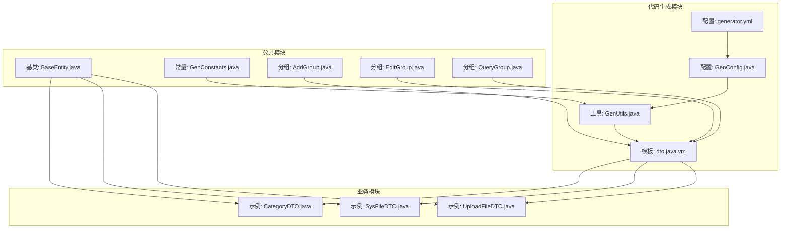
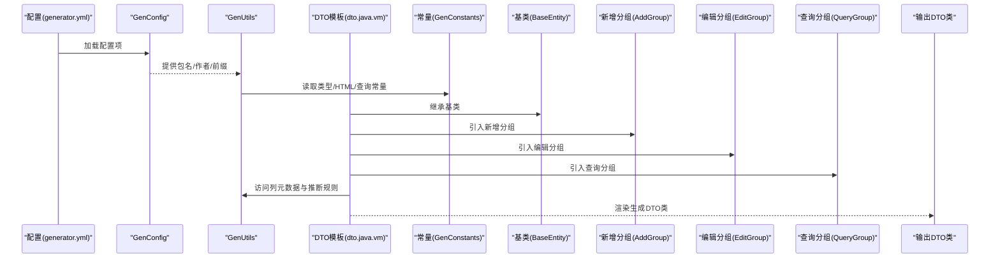
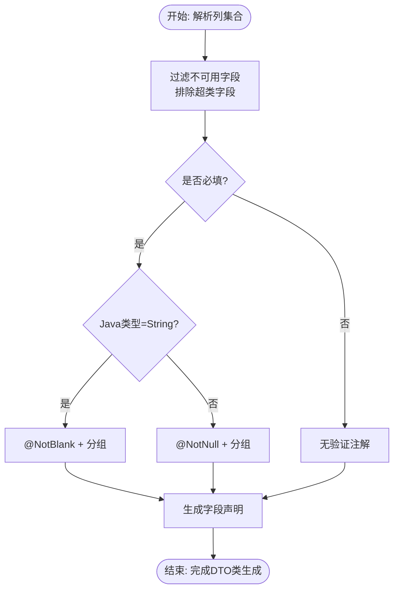
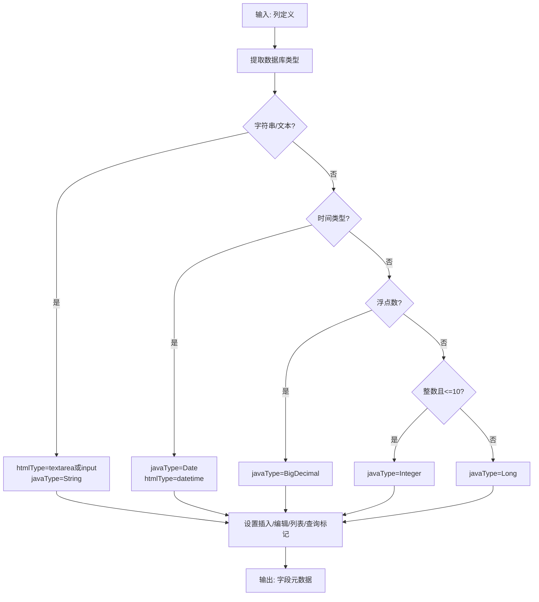
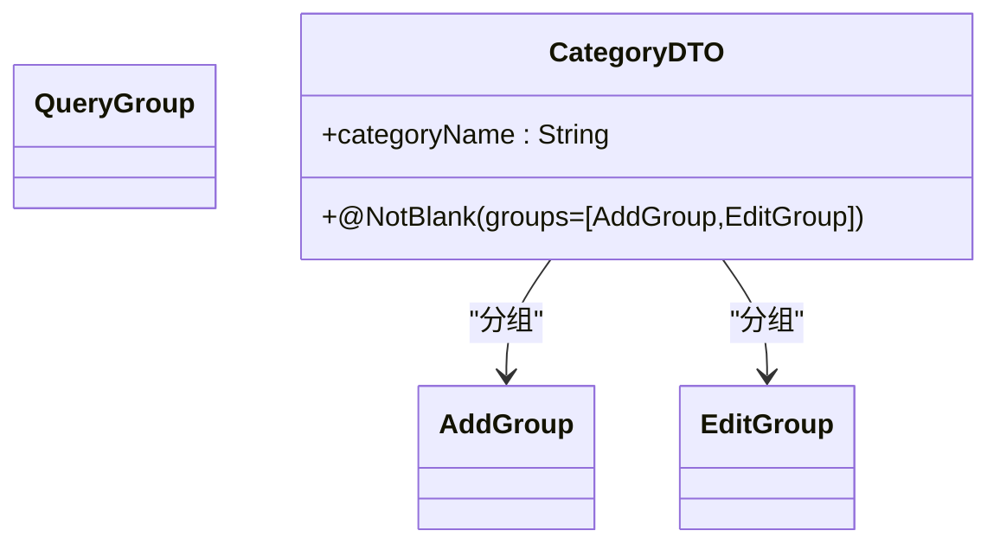
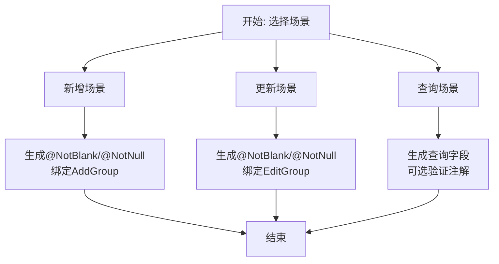
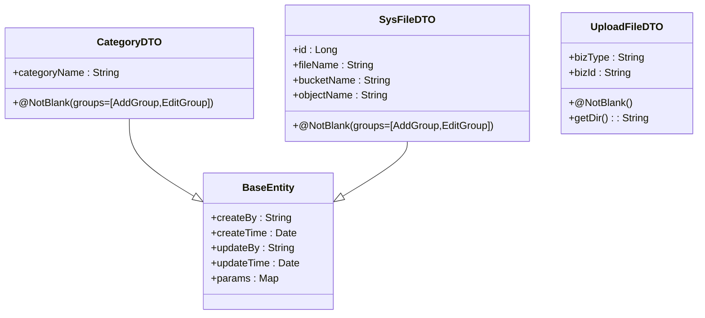
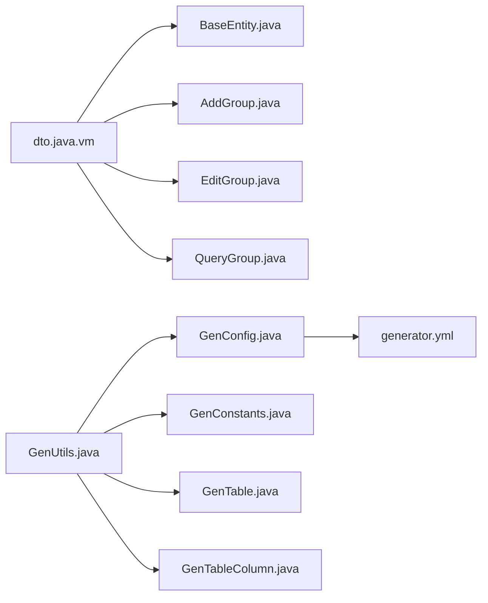

# DTO模板

<cite>
**本文引用的文件**
- [dto.java.vm](file://blog-generator/src/main/resources/vm/java/dto.java.vm)
- [GenUtils.java](file://blog-generator/src/main/java/blog/generator/util/GenUtils.java)
- [GenTable.java](file://blog-generator/src/main/java/blog/generator/domain/GenTable.java)
- [GenTableColumn.java](file://blog-generator/src/main/java/blog/generator/domain/GenTableColumn.java)
- [GenConstants.java](file://blog-common/src/main/java/blog/common/constant/GenConstants.java)
- [GenConfig.java](file://blog-generator/src/main/java/blog/generator/config/GenConfig.java)
- [generator.yml](file://blog-generator/src/main/resources/generator.yml)
- [BaseEntity.java](file://blog-common/src/main/java/blog/common/base/entity/BaseEntity.java)
- [AddGroup.java](file://blog-common/src/main/java/blog/common/validate/AddGroup.java)
- [EditGroup.java](file://blog-common/src/main/java/blog/common/validate/EditGroup.java)
- [QueryGroup.java](file://blog-common/src/main/java/blog/common/validate/QueryGroup.java)
- [CategoryDTO.java](file://blog-biz/src/main/java/blog/biz/domain/dto/CategoryDTO.java)
- [SysFileDTO.java](file://blog-biz/src/main/java/blog/biz/domain/dto/SysFileDTO.java)
- [UploadFileDTO.java](file://blog-biz/src/main/java/blog/biz/domain/dto/UploadFileDTO.java)
</cite>

## 目录
1. [简介](#简介)
2. [项目结构](#项目结构)
3. [核心组件](#核心组件)
4. [架构总览](#架构总览)
5. [详细组件分析](#详细组件分析)
6. [依赖关系分析](#依赖关系分析)
7. [性能考虑](#性能考虑)
8. [故障排查指南](#故障排查指南)
9. [结论](#结论)
10. [附录](#附录)

## 简介
本文围绕DTO模板(dto.java.vm)系统性阐述数据传输对象的自动生成规则与最佳实践，涵盖以下要点：
- 设计原则：职责清晰、与实体分离、面向接口编程、可序列化与可校验
- 与实体类的关系：DTO仅承载传输与校验，不参与持久化逻辑；实体负责持久化与领域模型
- 字段映射规则：数据库字段到Java属性的命名转换、字段类型自动推断
- 验证注解：基于@NotNull、@NotBlank等的自动生成机制及分组验证支持
- 场景化差异：新增DTO、更新DTO、查询DTO的差异化设计
- 实战示例：展示从表结构到完整DTO生成的全流程，包括字段注释、验证规则、序列化处理

## 项目结构
本项目采用多模块分层架构，DTO模板位于代码生成模块中，通过Velocity模板引擎渲染生成目标DTO类。关键位置如下：
- 代码生成模板：blog-generator/src/main/resources/vm/java/dto.java.vm
- 生成工具与常量：blog-generator/util/GenUtils.java、blog-common/constant/GenConstants.java
- 配置中心：blog-generator/config/GenConfig.java、blog-generator/resources/generator.yml
- 基类与校验分组：blog-common/base/entity/BaseEntity.java、blog-common/validate/*.java
- 示例DTO：blog-biz/domain/dto/*.java

**图表来源**
- [dto.java.vm:1-49](file://blog-generator/src/main/resources/vm/java/dto.java.vm#L1-L49)
- [GenUtils.java:1-223](file://blog-generator/src/main/java/blog/generator/util/GenUtils.java#L1-L223)
- [GenConfig.java:1-87](file://blog-generator/src/main/java/blog/generator/config/GenConfig.java#L1-L87)
- [generator.yml:1-12](file://blog-generator/src/main/resources/generator.yml#L1-L12)
- [BaseEntity.java:1-85](file://blog-common/src/main/java/blog/common/base/entity/BaseEntity.java#L1-L85)
- [GenConstants.java:1-187](file://blog-common/src/main/java/blog/common/constant/GenConstants.java#L1-L187)
- [AddGroup.java:1-10](file://blog-common/src/main/java/blog/common/validate/AddGroup.java#L1-L10)
- [EditGroup.java:1-10](file://blog-common/src/main/java/blog/common/validate/EditGroup.java#L1-L10)
- [QueryGroup.java:1-10](file://blog-common/src/main/java/blog/common/validate/QueryGroup.java#L1-L10)
- [CategoryDTO.java:1-29](file://blog-biz/src/main/java/blog/biz/domain/dto/CategoryDTO.java#L1-L29)
- [SysFileDTO.java:1-83](file://blog-biz/src/main/java/blog/biz/domain/dto/SysFileDTO.java#L1-L83)
- [UploadFileDTO.java:1-36](file://blog-biz/src/main/java/blog/biz/domain/dto/UploadFileDTO.java#L1-L36)

**章节来源**
- [dto.java.vm:1-49](file://blog-generator/src/main/resources/vm/java/dto.java.vm#L1-L49)
- [GenUtils.java:1-223](file://blog-generator/src/main/java/blog/generator/util/GenUtils.java#L1-L223)
- [GenConfig.java:1-87](file://blog-generator/src/main/java/blog/generator/config/GenConfig.java#L1-L87)
- [generator.yml:1-12](file://blog-generator/src/main/resources/generator.yml#L1-L12)
- [BaseEntity.java:1-85](file://blog-common/src/main/java/blog/common/base/entity/BaseEntity.java#L1-L85)
- [GenConstants.java:1-187](file://blog-common/src/main/java/blog/common/constant/GenConstants.java#L1-L187)
- [AddGroup.java:1-10](file://blog-common/src/main/java/blog/common/validate/AddGroup.java#L1-L10)
- [EditGroup.java:1-10](file://blog-common/src/main/java/blog/common/validate/EditGroup.java#L1-L10)
- [QueryGroup.java:1-10](file://blog-common/src/main/java/blog/common/validate/QueryGroup.java#L1-L10)
- [CategoryDTO.java:1-29](file://blog-biz/src/main/java/blog/biz/domain/dto/CategoryDTO.java#L1-L29)
- [SysFileDTO.java:1-83](file://blog-biz/src/main/java/blog/biz/domain/dto/SysFileDTO.java#L1-L83)
- [UploadFileDTO.java:1-36](file://blog-biz/src/main/java/blog/biz/domain/dto/UploadFileDTO.java#L1-L36)

## 核心组件
- DTO模板(dto.java.vm)：定义DTO类的骨架、注释、验证注解与继承关系，通过Velocity变量驱动生成
- 生成工具(GenUtils)：负责表与列的初始化、Java类型推断、HTML类型映射、字段可用性判断
- 配置(GenConfig + generator.yml)：控制作者、包名、表前缀、是否允许覆盖等生成行为
- 常量(GenConstants)：统一管理数据库类型、HTML类型、查询类型、默认Java类型等
- 基类(BaseEntity)：提供创建/更新信息、参数容器、JSON序列化控制等通用能力
- 校验分组(AddGroup/EditGroup/QueryGroup)：按场景启用不同的验证规则集

**章节来源**
- [dto.java.vm:1-49](file://blog-generator/src/main/resources/vm/java/dto.java.vm#L1-L49)
- [GenUtils.java:35-113](file://blog-generator/src/main/java/blog/generator/util/GenUtils.java#L35-L113)
- [GenConfig.java:1-87](file://blog-generator/src/main/java/blog/generator/config/GenConfig.java#L1-L87)
- [generator.yml:1-12](file://blog-generator/src/main/resources/generator.yml#L1-L12)
- [GenConstants.java:1-187](file://blog-common/src/main/java/blog/common/constant/GenConstants.java#L1-L187)
- [BaseEntity.java:1-85](file://blog-common/src/main/java/blog/common/base/entity/BaseEntity.java#L1-L85)
- [AddGroup.java:1-10](file://blog-common/src/main/java/blog/common/validate/AddGroup.java#L1-L10)
- [EditGroup.java:1-10](file://blog-common/src/main/java/blog/common/validate/EditGroup.java#L1-L10)
- [QueryGroup.java:1-10](file://blog-common/src/main/java/blog/common/validate/QueryGroup.java#L1-L10)

## 架构总览
DTO模板的生成流程由“配置 → 模板 → 工具 → 常量 → 基类/分组 → 输出类”构成，形成闭环的自动化代码生成体系。

**图表来源**
- [generator.yml:1-12](file://blog-generator/src/main/resources/generator.yml#L1-L12)
- [GenConfig.java:1-87](file://blog-generator/src/main/java/blog/generator/config/GenConfig.java#L1-L87)
- [GenUtils.java:1-223](file://blog-generator/src/main/java/blog/generator/util/GenUtils.java#L1-L223)
- [GenConstants.java:1-187](file://blog-common/src/main/java/blog/common/constant/GenConstants.java#L1-L187)
- [BaseEntity.java:1-85](file://blog-common/src/main/java/blog/common/base/entity/BaseEntity.java#L1-L85)
- [AddGroup.java:1-10](file://blog-common/src/main/java/blog/common/validate/AddGroup.java#L1-L10)
- [EditGroup.java:1-10](file://blog-common/src/main/java/blog/common/validate/EditGroup.java#L1-L10)
- [QueryGroup.java:1-10](file://blog-common/src/main/java/blog/common/validate/QueryGroup.java#L1-L10)
- [dto.java.vm:1-49](file://blog-generator/src/main/resources/vm/java/dto.java.vm#L1-L49)

## 详细组件分析

### DTO模板与生成规则
- 包与导入：模板固定生成包路径与必要的导入，包括基类、校验分组、lombok注解等
- 继承关系：所有DTO均继承BaseEntity，以复用创建/更新信息与序列化控制
- 注释与作者：根据表注释与生成时间动态填充
- 字段过滤：排除超类字段与非可用字段，仅保留insert/edit/query或列表/查询所需的字段
- 验证注解：根据字段是否必填自动选择@NotBlank/@NotNull，并绑定对应分组
- 字段类型：由生成工具推断Java类型，模板直接使用

**图表来源**
- [dto.java.vm:24-46](file://blog-generator/src/main/resources/vm/java/dto.java.vm#L24-L46)
- [GenTableColumn.java:310-329](file://blog-generator/src/main/java/blog/generator/domain/GenTableColumn.java#L310-L329)
- [GenUtils.java:35-113](file://blog-generator/src/main/java/blog/generator/util/GenUtils.java#L35-L113)

**章节来源**
- [dto.java.vm:1-49](file://blog-generator/src/main/resources/vm/java/dto.java.vm#L1-L49)
- [GenTableColumn.java:310-329](file://blog-generator/src/main/java/blog/generator/domain/GenTableColumn.java#L310-L329)

### 字段映射与类型推断
- 命名转换：列名转驼峰作为Java字段名
- 类型推断：
  - 字符串/文本：默认String；文本域长度阈值触发textarea
  - 时间：统一映射为Date
  - 数字：根据精度与范围推断为Integer/Long/BigDecimal
- 可视化HTML类型：依据列名后缀自动映射为输入框、单选框、下拉框、富文本等
- 字段可用性：排除超类字段与特定白名单字段，确保DTO简洁

**图表来源**
- [GenUtils.java:46-70](file://blog-generator/src/main/java/blog/generator/util/GenUtils.java#L46-L70)
- [GenConstants.java:50-68](file://blog-common/src/main/java/blog/common/constant/GenConstants.java#L50-L68)
- [GenTableColumn.java:310-329](file://blog-generator/src/main/java/blog/generator/domain/GenTableColumn.java#L310-L329)

**章节来源**
- [GenUtils.java:35-113](file://blog-generator/src/main/java/blog/generator/util/GenUtils.java#L35-L113)
- [GenConstants.java:144-170](file://blog-common/src/main/java/blog/common/constant/GenConstants.java#L144-L170)
- [GenTableColumn.java:310-329](file://blog-generator/src/main/java/blog/generator/domain/GenTableColumn.java#L310-L329)

### 验证注解与分组验证
- 自动生成策略：
  - 必填字段：String类型使用@NotBlank，其他类型使用@NotNull
  - 分组绑定：insert/edit/query分别绑定AddGroup/EditGroup/QueryGroup
  - 多场景组合：同时支持insert与edit时，绑定两个分组
- 分组接口：AddGroup/EditGroup/QueryGroup为空接口，用于分组校验
- 模板集成：模板通过Velocity变量动态拼接分组列表

**图表来源**
- [AddGroup.java:1-10](file://blog-common/src/main/java/blog/common/validate/AddGroup.java#L1-L10)
- [EditGroup.java:1-10](file://blog-common/src/main/java/blog/common/validate/EditGroup.java#L1-L10)
- [QueryGroup.java:1-10](file://blog-common/src/main/java/blog/common/validate/QueryGroup.java#L1-L10)
- [CategoryDTO.java:24-25](file://blog-biz/src/main/java/blog/biz/domain/dto/CategoryDTO.java#L24-L25)

**章节来源**
- [dto.java.vm:29-42](file://blog-generator/src/main/resources/vm/java/dto.java.vm#L29-L42)
- [AddGroup.java:1-10](file://blog-common/src/main/java/blog/common/validate/AddGroup.java#L1-L10)
- [EditGroup.java:1-10](file://blog-common/src/main/java/blog/common/validate/EditGroup.java#L1-L10)
- [QueryGroup.java:1-10](file://blog-common/src/main/java/blog/common/validate/QueryGroup.java#L1-L10)
- [CategoryDTO.java:24-25](file://blog-biz/src/main/java/blog/biz/domain/dto/CategoryDTO.java#L24-L25)

### 场景化差异：新增DTO、更新DTO、查询DTO
- 新增DTO：insert=true时添加@NotBlank/@NotNull，绑定AddGroup
- 更新DTO：edit=true时添加@NotBlank/@NotNull，绑定EditGroup
- 查询DTO：isQuery=true时生成查询参数对象，通常不带业务验证注解，但可按需扩展
- 模板适配：模板通过insert/edit/query布尔位决定注解与分组生成

**图表来源**
- [dto.java.vm:29-42](file://blog-generator/src/main/resources/vm/java/dto.java.vm#L29-L42)
- [GenTableColumn.java:214-244](file://blog-generator/src/main/java/blog/generator/domain/GenTableColumn.java#L214-L244)

**章节来源**
- [dto.java.vm:29-42](file://blog-generator/src/main/resources/vm/java/dto.java.vm#L29-L42)
- [GenTableColumn.java:214-244](file://blog-generator/src/main/java/blog/generator/domain/GenTableColumn.java#L214-L244)

### 实战示例：从表结构到DTO生成
- 示例1：CategoryDTO
  - 字段：categoryName（必填）
  - 验证：@NotBlank，分组为AddGroup与EditGroup
  - 继承：BaseEntity
- 示例2：SysFileDTO
  - 字段：id、fileName、fileSuffix、contentType、fileSize、bucketName、objectName、fileUrl、bizType、bizId、isPublic
  - 验证：部分字段@NotBlank，绑定AddGroup与EditGroup
  - 继承：BaseEntity
- 示例3：UploadFileDTO
  - 字段：bizType、bizId（必填）
  - 验证：@NotBlank，无分组（纯传输对象）
  - 特性：lombok构造器与Serializable

**图表来源**
- [BaseEntity.java:1-85](file://blog-common/src/main/java/blog/common/base/entity/BaseEntity.java#L1-L85)
- [CategoryDTO.java:1-29](file://blog-biz/src/main/java/blog/biz/domain/dto/CategoryDTO.java#L1-L29)
- [SysFileDTO.java:1-83](file://blog-biz/src/main/java/blog/biz/domain/dto/SysFileDTO.java#L1-L83)
- [UploadFileDTO.java:1-36](file://blog-biz/src/main/java/blog/biz/domain/dto/UploadFileDTO.java#L1-L36)

**章节来源**
- [CategoryDTO.java:1-29](file://blog-biz/src/main/java/blog/biz/domain/dto/CategoryDTO.java#L1-L29)
- [SysFileDTO.java:1-83](file://blog-biz/src/main/java/blog/biz/domain/dto/SysFileDTO.java#L1-L83)
- [UploadFileDTO.java:1-36](file://blog-biz/src/main/java/blog/biz/domain/dto/UploadFileDTO.java#L1-L36)

## 依赖关系分析
- 模板依赖：dto.java.vm依赖BaseEntity、AddGroup/EditGroup/QueryGroup、Lombok、Jakarta Validation
- 工具依赖：GenUtils依赖GenConstants、GenConfig、StringUtils、GenTable/GenTableColumn
- 配置依赖：GenConfig读取generator.yml，影响包名、作者、表前缀等
- 常量依赖：GenConstants统一数据库类型、HTML类型、查询类型、默认Java类型

**图表来源**
- [dto.java.vm:1-12](file://blog-generator/src/main/resources/vm/java/dto.java.vm#L1-L12)
- [GenUtils.java:1-223](file://blog-generator/src/main/java/blog/generator/util/GenUtils.java#L1-L223)
- [GenConfig.java:1-87](file://blog-generator/src/main/java/blog/generator/config/GenConfig.java#L1-L87)
- [generator.yml:1-12](file://blog-generator/src/main/resources/generator.yml#L1-L12)
- [GenConstants.java:1-187](file://blog-common/src/main/java/blog/common/constant/GenConstants.java#L1-L187)
- [GenTable.java:1-177](file://blog-generator/src/main/java/blog/generator/domain/GenTable.java#L1-L177)
- [GenTableColumn.java:1-348](file://blog-generator/src/main/java/blog/generator/domain/GenTableColumn.java#L1-L348)
- [BaseEntity.java:1-85](file://blog-common/src/main/java/blog/common/base/entity/BaseEntity.java#L1-L85)
- [AddGroup.java:1-10](file://blog-common/src/main/java/blog/common/validate/AddGroup.java#L1-L10)
- [EditGroup.java:1-10](file://blog-common/src/main/java/blog/common/validate/EditGroup.java#L1-L10)
- [QueryGroup.java:1-10](file://blog-common/src/main/java/blog/common/validate/QueryGroup.java#L1-L10)

**章节来源**
- [dto.java.vm:1-12](file://blog-generator/src/main/resources/vm/java/dto.java.vm#L1-L12)
- [GenUtils.java:1-223](file://blog-generator/src/main/java/blog/generator/util/GenUtils.java#L1-L223)
- [GenConfig.java:1-87](file://blog-generator/src/main/java/blog/generator/config/GenConfig.java#L1-L87)
- [generator.yml:1-12](file://blog-generator/src/main/resources/generator.yml#L1-L12)
- [GenConstants.java:1-187](file://blog-common/src/main/java/blog/common/constant/GenConstants.java#L1-L187)
- [GenTable.java:1-177](file://blog-generator/src/main/java/blog/generator/domain/GenTable.java#L1-L177)
- [GenTableColumn.java:1-348](file://blog-generator/src/main/java/blog/generator/domain/GenTableColumn.java#L1-L348)
- [BaseEntity.java:1-85](file://blog-common/src/main/java/blog/common/base/entity/BaseEntity.java#L1-L85)
- [AddGroup.java:1-10](file://blog-common/src/main/java/blog/common/validate/AddGroup.java#L1-L10)
- [EditGroup.java:1-10](file://blog-common/src/main/java/blog/common/validate/EditGroup.java#L1-L10)
- [QueryGroup.java:1-10](file://blog-common/src/main/java/blog/common/validate/QueryGroup.java#L1-L10)

## 性能考虑
- 模板渲染：尽量减少模板中的条件分支数量，优先在工具层完成预处理
- 类型推断：在GenUtils中一次性完成类型与HTML类型映射，避免重复计算
- 字段过滤：利用isSuperColumn与白名单机制提前剔除冗余字段，降低DTO体积
- 序列化：BaseEntity已内置JSON序列化控制，避免在DTO中重复定义

## 故障排查指南
- 字段缺失或过多
  - 检查GenTableColumn的insert/edit/list/query标记是否正确
  - 确认isSuperColumn与白名单逻辑是否符合预期
- 类型推断错误
  - 核对数据库类型与GenConstants中的COLUMNTYPE_*匹配
  - 检查精度与范围参数是否正确传递给推断逻辑
- 验证注解未生效
  - 确认required标记与javaType是否正确
  - 检查分组接口是否引入且分组列表拼接正确
- 包名/作者/前缀问题
  - 检查generator.yml与GenConfig的配置项是否一致
  - 确认autoRemovePre与tablePrefix是否按预期工作

**章节来源**
- [GenTableColumn.java:310-329](file://blog-generator/src/main/java/blog/generator/domain/GenTableColumn.java#L310-L329)
- [GenConstants.java:50-68](file://blog-common/src/main/java/blog/common/constant/GenConstants.java#L50-L68)
- [GenUtils.java:35-113](file://blog-generator/src/main/java/blog/generator/util/GenUtils.java#L35-L113)
- [generator.yml:1-12](file://blog-generator/src/main/resources/generator.yml#L1-L12)
- [GenConfig.java:1-87](file://blog-generator/src/main/java/blog/generator/config/GenConfig.java#L1-L87)

## 结论
DTO模板通过“配置+模板+工具+常量+基类+分组”的协同，实现了从数据库表到高质量DTO类的自动化生成。其核心优势在于：
- 明确的职责边界：DTO专注传输与校验，实体专注持久化与领域
- 可扩展的验证体系：基于分组的灵活校验策略
- 高效的类型与字段推断：减少手写成本与出错概率
- 场景化的差异化设计：新增/更新/查询三类DTO各司其职

## 附录
- 生成配置参考
  - 作者：配置于generator.yml的author字段
  - 包名：配置于generator.yml的packageName字段
  - 表前缀：配置于generator.yml的tablePrefix字段
  - 自动去前缀：配置于generator.yml的autoRemovePre字段
- 常用分组
  - AddGroup：新增场景
  - EditGroup：更新场景
  - QueryGroup：查询场景

**章节来源**
- [generator.yml:1-12](file://blog-generator/src/main/resources/generator.yml#L1-L12)
- [GenConfig.java:1-87](file://blog-generator/src/main/java/blog/generator/config/GenConfig.java#L1-L87)
- [AddGroup.java:1-10](file://blog-common/src/main/java/blog/common/validate/AddGroup.java#L1-L10)
- [EditGroup.java:1-10](file://blog-common/src/main/java/blog/common/validate/EditGroup.java#L1-L10)
- [QueryGroup.java:1-10](file://blog-common/src/main/java/blog/common/validate/QueryGroup.java#L1-L10)