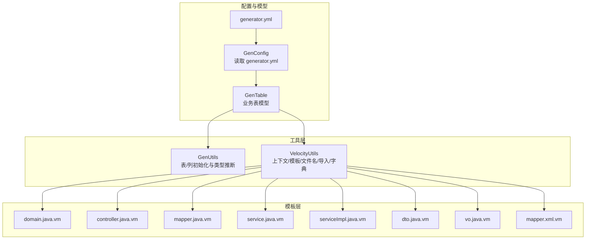
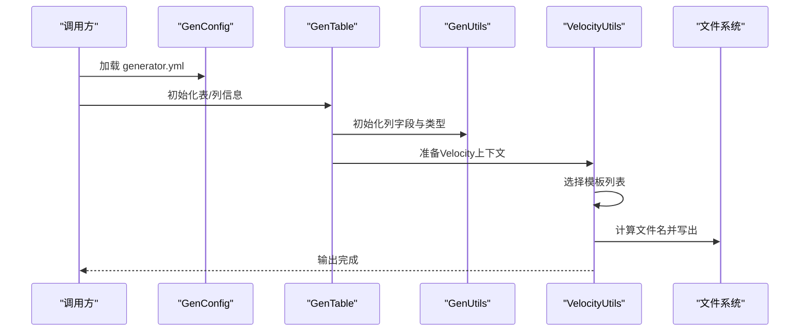
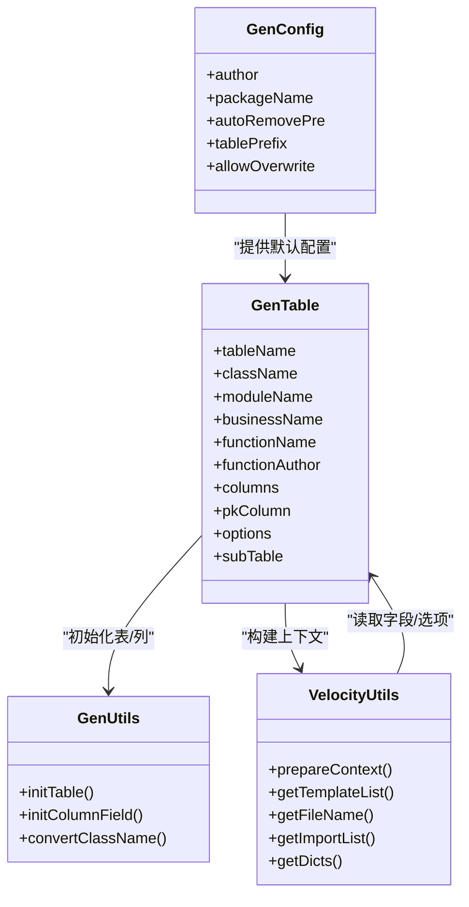

# Java代码模板

<cite>
**本文引用的文件**
- [generator.yml](file://blog-generator/src/main/resources/generator.yml)
- [GenConfig.java](file://blog-generator/src/main/java/blog/generator/config/GenConfig.java)
- [GenUtils.java](file://blog-generator/src/main/java/blog/generator/util/GenUtils.java)
- [VelocityUtils.java](file://blog-generator/src/main/java/blog/generator/util/VelocityUtils.java)
- [GenTable.java](file://blog-generator/src/main/java/blog/generator/domain/GenTable.java)
- [domain.java.vm](file://blog-generator/src/main/resources/vm/java/domain.java.vm)
- [controller.java.vm](file://blog-generator/src/main/resources/vm/java/controller.java.vm)
- [mapper.java.vm](file://blog-generator/src/main/resources/vm/java/mapper.java.vm)
- [service.java.vm](file://blog-generator/src/main/resources/vm/java/service.java.vm)
- [serviceImpl.java.vm](file://blog-generator/src/main/resources/vm/java/serviceImpl.java.vm)
- [dto.java.vm](file://blog-generator/src/main/resources/vm/java/dto.java.vm)
- [vo.java.vm](file://blog-generator/src/main/resources/vm/java/vo.java.vm)
- [mapper.xml.vm](file://blog-generator/src/main/resources/vm/xml/mapper.xml.vm)
</cite>

## 目录
1. [简介](#简介)
2. [项目结构](#项目结构)
3. [核心组件](#核心组件)
4. [架构总览](#架构总览)
5. [详细组件分析](#详细组件分析)
6. [依赖关系分析](#依赖关系分析)
7. [性能与可维护性](#性能与可维护性)
8. [故障排查指南](#故障排查指南)
9. [结论](#结论)
10. [附录：模板变量与生成规则速查](#附录模板变量与生成规则速查)

## 简介
本技术文档面向“Java代码模板系统”，系统基于Velocity模板引擎与MyBatis-Plus生态，围绕表结构自动生成领域模型、控制层、服务层、Mapper接口与XML、DTO/VO以及前端Vue页面与后端API脚手架。文档重点涵盖：
- 各模板用途与生成规则（实体类、控制器、Mapper接口、Service接口、Service实现、DTO、VO、Mapper XML）
- 模板变量定义与数据绑定（如表名、类名、字段信息、包路径等）
- 渲染流程（上下文构建、变量替换、文件命名与输出）
- 定制与扩展方法（自定义变量、生成规则、特殊处理逻辑）
- 实际生成示例与配置说明

## 项目结构
代码生成模块位于 blog-generator，核心由以下部分组成：
- 配置层：读取 generator.yml 并注入到 GenConfig
- 数据建模：GenTable 及 GenTableColumn 描述业务表与列元信息
- 工具层：GenUtils 负责表/列初始化与类型推断；VelocityUtils 负责模板上下文准备、模板选择、文件名计算、导入与字典等辅助
- 模板层：vm/java、vm/xml、vm/vue、vm/js 下的各类模板

图表来源
- [GenConfig.java:1-87](file://blog-generator/src/main/java/blog/generator/config/GenConfig.java#L1-L87)
- [generator.yml:1-12](file://blog-generator/src/main/resources/generator.yml#L1-L12)
- [GenTable.java:1-177](file://blog-generator/src/main/java/blog/generator/domain/GenTable.java#L1-L177)
- [GenUtils.java:1-223](file://blog-generator/src/main/java/blog/generator/util/GenUtils.java#L1-L223)
- [VelocityUtils.java:1-364](file://blog-generator/src/main/java/blog/generator/util/VelocityUtils.java#L1-L364)

章节来源
- [generator.yml:1-12](file://blog-generator/src/main/resources/generator.yml#L1-L12)
- [GenConfig.java:1-87](file://blog-generator/src/main/java/blog/generator/config/GenConfig.java#L1-L87)
- [GenTable.java:1-177](file://blog-generator/src/main/java/blog/generator/domain/GenTable.java#L1-L177)
- [GenUtils.java:1-223](file://blog-generator/src/main/java/blog/generator/util/GenUtils.java#L1-L223)
- [VelocityUtils.java:1-364](file://blog-generator/src/main/java/blog/generator/util/VelocityUtils.java#L1-L364)

## 核心组件
- 配置中心 GenConfig：从 generator.yml 读取作者、包路径、自动去前缀开关、表前缀、是否允许覆盖等全局配置，并以静态字段暴露给其他组件。
- 表模型 GenTable：封装表元信息、模板类别、模块名、业务名、功能名、作者、列集合、子表、树形/父子表等选项。
- 生成工具 GenUtils：负责表名转类名、模块名/业务名提取、列字段初始化（Java类型、HTML控件、查询类型、必填标记等）。
- 模板工具 VelocityUtils：构建Velocity上下文、选择模板、计算文件输出路径、生成导入列表、字典组、权限前缀、树/子表上下文等。

章节来源
- [GenConfig.java:1-87](file://blog-generator/src/main/java/blog/generator/config/GenConfig.java#L1-L87)
- [GenTable.java:1-177](file://blog-generator/src/main/java/blog/generator/domain/GenTable.java#L1-L177)
- [GenUtils.java:1-223](file://blog-generator/src/main/java/blog/generator/util/GenUtils.java#L1-L223)
- [VelocityUtils.java:1-364](file://blog-generator/src/main/java/blog/generator/util/VelocityUtils.java#L1-L364)

## 架构总览
模板渲染的总体流程如下：
- 读取 generator.yml -> 注入 GenConfig
- 初始化 GenTable（表名、类名、模块/业务名、功能名、作者、列信息）
- GenUtils 对表/列进行初始化与类型推断
- VelocityUtils 构建 VelocityContext（包含模板类别、表/列信息、导入、字典、权限前缀、树/子表上下文等）
- 选择模板列表（根据模板类别选择Java/JS/XML/Vue模板）
- 计算每个模板的输出文件名（按约定路径与命名规则）
- 渲染模板并写出文件

图表来源
- [GenConfig.java:1-87](file://blog-generator/src/main/java/blog/generator/config/GenConfig.java#L1-L87)
- [GenUtils.java:1-223](file://blog-generator/src/main/java/blog/generator/util/GenUtils.java#L1-L223)
- [VelocityUtils.java:129-207](file://blog-generator/src/main/java/blog/generator/util/VelocityUtils.java#L129-L207)

章节来源
- [GenConfig.java:1-87](file://blog-generator/src/main/java/blog/generator/config/GenConfig.java#L1-L87)
- [GenUtils.java:1-223](file://blog-generator/src/main/java/blog/generator/util/GenUtils.java#L1-L223)
- [VelocityUtils.java:129-207](file://blog-generator/src/main/java/blog/generator/util/VelocityUtils.java#L129-L207)

## 详细组件分析

### 实体类模板 domain.java.vm
- 用途：生成领域实体类，继承基础实体基类，标注MyBatis-Plus注解，包含主键、逻辑删除、乐观锁版本等特性识别。
- 关键变量
  - 表级别：tableName、className、ClassName、columns、pkColumn、importList、table、dicts
  - 特殊处理：根据是否存在 tenantId 动态选择基类；根据列字段识别逻辑删除与乐观锁；主键字段映射
- 生成规则
  - 包路径：${packageName}.domain
  - 注解：@TableName、@TableId、@TableLogic、@Version
  - 字段：遍历 columns，排除超类字段，按列类型映射Java类型
- 示例参考
  - [domain.java.vm:1-57](file://blog-generator/src/main/resources/vm/java/domain.java.vm#L1-L57)

章节来源
- [domain.java.vm:1-57](file://blog-generator/src/main/resources/vm/java/domain.java.vm#L1-L57)

### 控制器模板 controller.java.vm
- 用途：生成REST控制器，包含列表查询、导出、详情、新增、修改、删除等标准接口。
- 关键变量
  - 权限前缀：permissionPrefix
  - 请求路径：moduleName/businessName
  - 参数与返回：根据表类别（CRUD/树/子表）决定参数与返回类型
- 生成规则
  - 包路径：${packageName}.controller
  - 注解：@RestController、@RequestMapping、@PreAuthorize、@Log、@RepeatSubmit
  - 方法：根据模板类别动态生成不同签名与实现
- 示例参考
  - [controller.java.vm:1-115](file://blog-generator/src/main/resources/vm/java/controller.java.vm#L1-L115)

章节来源
- [controller.java.vm:1-115](file://blog-generator/src/main/resources/vm/java/controller.java.vm#L1-L115)

### Mapper接口模板 mapper.java.vm
- 用途：生成Mapper接口，继承通用Mapper基类，用于扩展SQL或复用通用能力。
- 关键变量
  - 泛型：实体类与VO类
- 生成规则
  - 包路径：${packageName}.mapper
  - 接口：继承BaseMapperPlus<实体, VO>
- 示例参考
  - [mapper.java.vm:1-16](file://blog-generator/src/main/resources/vm/java/mapper.java.vm#L1-L16)

章节来源
- [mapper.java.vm:1-16](file://blog-generator/src/main/resources/vm/java/mapper.java.vm#L1-L16)

### Service接口模板 service.java.vm
- 用途：生成Service接口，定义查询、分页、列表、新增、修改、删除等规范方法。
- 关键变量
  - 返回类型：VO、DTO、分页结果等
  - 主键参数：基于主键列类型与字段名
- 生成规则
  - 包路径：${packageName}.service
  - 接口：继承BaseService<实体>，声明标准方法签名
- 示例参考
  - [service.java.vm:1-74](file://blog-generator/src/main/resources/vm/java/service.java.vm#L1-L74)

章节来源
- [service.java.vm:1-74](file://blog-generator/src/main/resources/vm/java/service.java.vm#L1-L74)

### Service实现模板 serviceImpl.java.vm
- 用途：生成Service实现类，封装查询包装器构建、DTO与实体转换、校验与批量删除等逻辑。
- 关键变量
  - 查询包装器：LambdaQueryWrapper
  - DTO/VO：BeanUtil拷贝、分页构建
- 生成规则
  - 包路径：${packageName}.service.impl
  - 方法：实现接口方法，构建查询条件、分页、排序、校验钩子
- 示例参考
  - [serviceImpl.java.vm:1-164](file://blog-generator/src/main/resources/vm/java/serviceImpl.java.vm#L1-L164)

章节来源
- [serviceImpl.java.vm:1-164](file://blog-generator/src/main/resources/vm/java/serviceImpl.java.vm#L1-L164)

### DTO模板 dto.java.vm
- 用途：生成业务DTO，承载校验组与字段映射，支持新增/编辑分组。
- 关键变量
  - 校验注解：基于列的insert/edit/required属性
  - 字段：仅包含参与插入/编辑/查询的非超类字段
- 生成规则
  - 包路径：${packageName}.domain.bo
  - 注解：@NotBlank/@NotNull，按String与非String区分
- 示例参考
  - [dto.java.vm:1-49](file://blog-generator/src/main/resources/vm/java/dto.java.vm#L1-L49)

章节来源
- [dto.java.vm:1-49](file://blog-generator/src/main/resources/vm/java/dto.java.vm#L1-L49)

### VO模板 vo.java.vm
- 用途：生成视图对象，支持导出注解与字典翻译。
- 关键变量
  - 导出注解：ExcelProperty/Excel
  - 字典：dictType与括号注释解析
  - 图片上传：额外URL字段
- 生成规则
  - 包路径：${packageName}.domain.vo
  - 注解：根据列的htmlType与dictType生成对应导出注解
- 示例参考
  - [vo.java.vm:1-63](file://blog-generator/src/main/resources/vm/java/vo.java.vm#L1-L63)

章节来源
- [vo.java.vm:1-63](file://blog-generator/src/main/resources/vm/java/vo.java.vm#L1-L63)

### Mapper XML模板 mapper.xml.vm
- 用途：生成MyBatis映射文件，包含基础resultMap与子表嵌套结果集（如存在）。
- 关键变量
  - 命名空间：${packageName}.mapper.${ClassName}Mapper
  - 结果映射：遍历columns生成result节点
  - 子表：当存在子表时生成嵌套集合映射
- 生成规则
  - 文件路径：resources/mapper/${moduleName}/${ClassName}Mapper.xml
- 示例参考
  - [mapper.xml.vm:1-25](file://blog-generator/src/main/resources/vm/xml/mapper.xml.vm#L1-L25)

章节来源
- [mapper.xml.vm:1-25](file://blog-generator/src/main/resources/vm/xml/mapper.xml.vm#L1-L25)

## 依赖关系分析
- 配置依赖：GenConfig 依赖 generator.yml；VelocityUtils 依赖 GenConfig 的包路径、前缀等配置
- 模型依赖：GenTable 作为上下文根对象，包含 columns、pkColumn、options、subTable 等
- 工具依赖：GenUtils 提供表/列初始化；VelocityUtils 提供上下文构建与文件名计算
- 模板依赖：各模板通过 Velocity 变量访问上下文，遵循统一命名约定

图表来源
- [GenConfig.java:1-87](file://blog-generator/src/main/java/blog/generator/config/GenConfig.java#L1-L87)
- [GenTable.java:1-177](file://blog-generator/src/main/java/blog/generator/domain/GenTable.java#L1-L177)
- [GenUtils.java:1-223](file://blog-generator/src/main/java/blog/generator/util/GenUtils.java#L1-L223)
- [VelocityUtils.java:43-154](file://blog-generator/src/main/java/blog/generator/util/VelocityUtils.java#L43-L154)

章节来源
- [GenConfig.java:1-87](file://blog-generator/src/main/java/blog/generator/config/GenConfig.java#L1-L87)
- [GenTable.java:1-177](file://blog-generator/src/main/java/blog/generator/domain/GenTable.java#L1-L177)
- [GenUtils.java:1-223](file://blog-generator/src/main/java/blog/generator/util/GenUtils.java#L1-L223)
- [VelocityUtils.java:43-154](file://blog-generator/src/main/java/blog/generator/util/VelocityUtils.java#L43-L154)

## 性能与可维护性
- 模板渲染性能
  - 模板数量固定且体积较小，渲染开销主要来自上下文构建与IO写出，整体开销可控
  - 可通过缓存导入列表与字典组减少重复计算
- 可维护性
  - 采用统一的变量命名与文件命名约定，便于扩展新模板
  - 通过配置项控制包路径、前缀、覆盖策略，降低手工调整成本
- 建议
  - 在VelocityUtils中增加模板缓存与错误日志
  - 将常用常量抽取至常量类，避免硬编码

[本节为通用建议，无需特定文件引用]

## 故障排查指南
- 生成失败或文件未输出
  - 检查模板选择逻辑与文件名计算是否正确
  - 参考：[VelocityUtils.java:129-207](file://blog-generator/src/main/java/blog/generator/util/VelocityUtils.java#L129-L207)
- 变量未生效或类型不匹配
  - 检查上下文构建与列初始化逻辑
  - 参考：[VelocityUtils.java:43-77](file://blog-generator/src/main/java/blog/generator/util/VelocityUtils.java#L43-L77)、[GenUtils.java:35-113](file://blog-generator/src/main/java/blog/generator/util/GenUtils.java#L35-L113)
- 导入包缺失或字典未生效
  - 检查导入列表与字典组生成逻辑
  - 参考：[VelocityUtils.java:226-275](file://blog-generator/src/main/java/blog/generator/util/VelocityUtils.java#L226-L275)
- 配置未加载
  - 检查 generator.yml 路径与字段名是否一致
  - 参考：[generator.yml:1-12](file://blog-generator/src/main/resources/generator.yml#L1-L12)、[GenConfig.java:14-15](file://blog-generator/src/main/java/blog/generator/config/GenConfig.java#L14-L15)

章节来源
- [VelocityUtils.java:43-207](file://blog-generator/src/main/java/blog/generator/util/VelocityUtils.java#L43-L207)
- [GenUtils.java:35-113](file://blog-generator/src/main/java/blog/generator/util/GenUtils.java#L35-L113)
- [generator.yml:1-12](file://blog-generator/src/main/resources/generator.yml#L1-L12)
- [GenConfig.java:14-15](file://blog-generator/src/main/java/blog/generator/config/GenConfig.java#L14-L15)

## 结论
该代码模板系统通过清晰的配置、模型与工具层，实现了对多模板的统一渲染与输出。其变量体系与命名约定保证了生成代码的一致性与可维护性。通过合理扩展模板与上下文，可快速适配新的业务场景与生成需求。

[本节为总结，无需特定文件引用]

## 附录：模板变量与生成规则速查

- 基础变量
  - 表名：tableName
  - 类名：className（驼峰）、ClassName（首字母大写）
  - 模块/业务/功能：moduleName、businessName、BusinessName、functionName
  - 作者/时间：author、datetime
  - 包路径：packageName、basePackage
  - 权限前缀：permissionPrefix
- 列信息
  - 列集合：columns（每列含：columnName、javaField、javaType、columnComment、queryType、isPk、insert、edit、list、query、required、dictType、htmlType等）
  - 主键列：pkColumn（含javaField、javaType）
- 上下文扩展
  - 导入列表：importList（按列类型动态加入java.util.Date、BigDecimal、Jackson注解等）
  - 字典组：dicts（按列的dictType与HTML类型聚合）
  - 树形/子表：treeCode、treeParentCode、treeName、expandColumn、subTable、subTableFkName、subClassName、subclassName、subImportList
- 模板选择与输出
  - 模板列表：根据模板类别（crud/tree/sub）选择Java/JS/XML/Vue模板
  - 文件名：按约定计算输出路径与文件名（Java类、Mapper XML、Vue页面、API JS）

章节来源
- [VelocityUtils.java:43-154](file://blog-generator/src/main/java/blog/generator/util/VelocityUtils.java#L43-L154)
- [GenUtils.java:156-182](file://blog-generator/src/main/java/blog/generator/util/GenUtils.java#L156-L182)
- [GenTable.java:154-177](file://blog-generator/src/main/java/blog/generator/domain/GenTable.java#L154-L177)