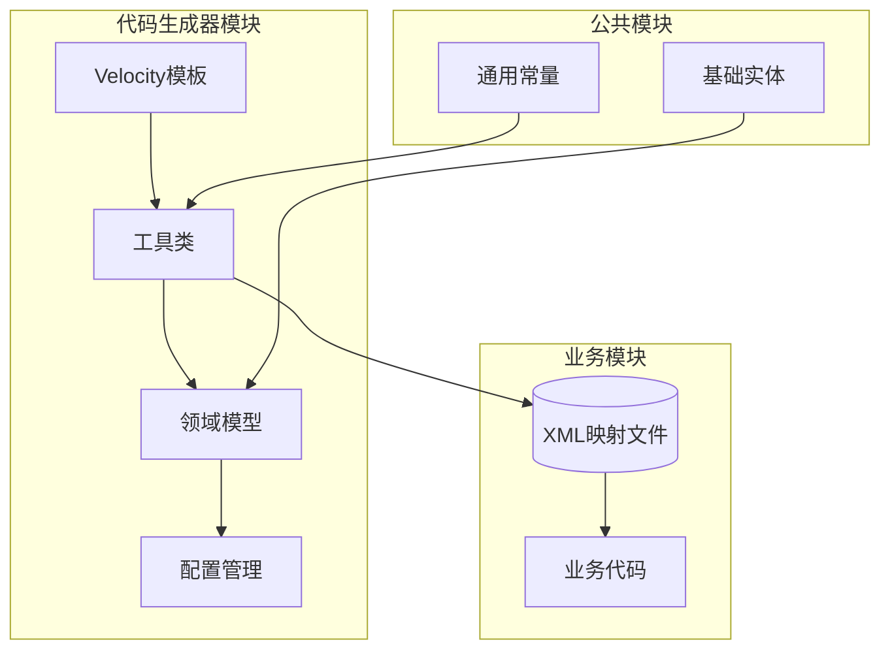
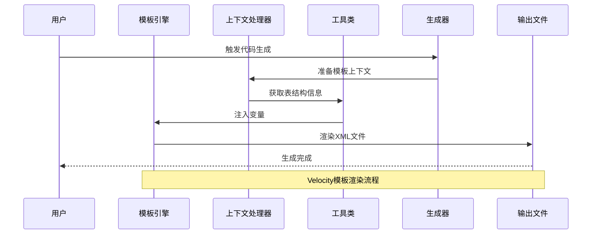
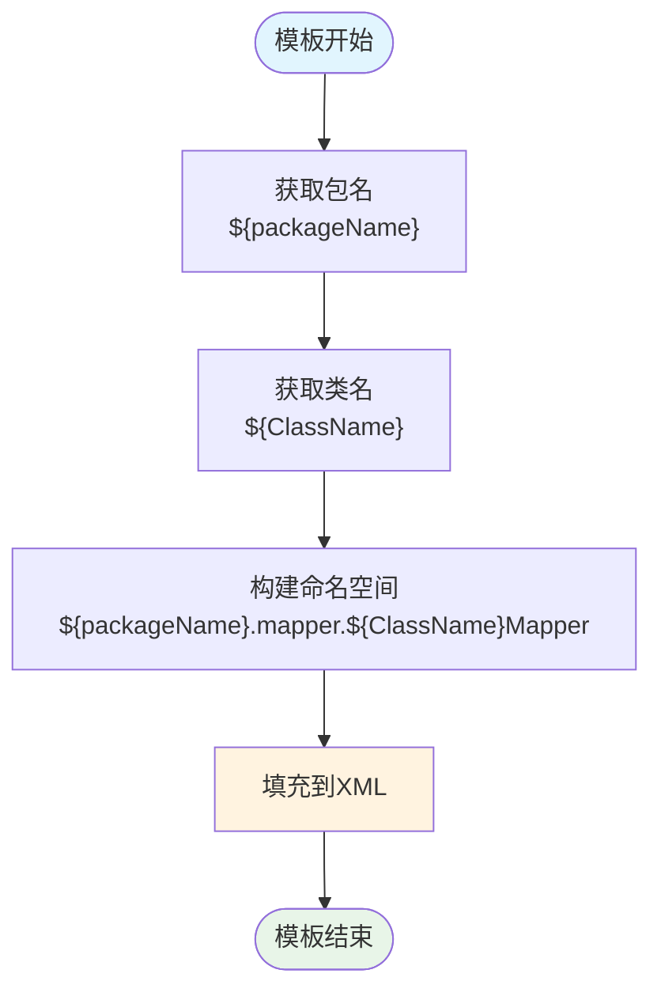
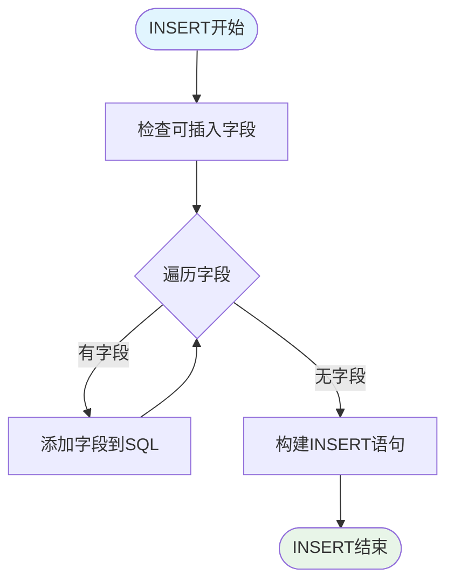
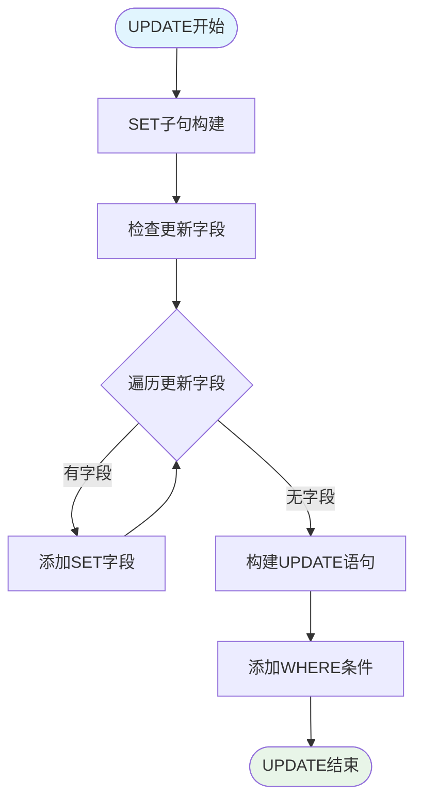
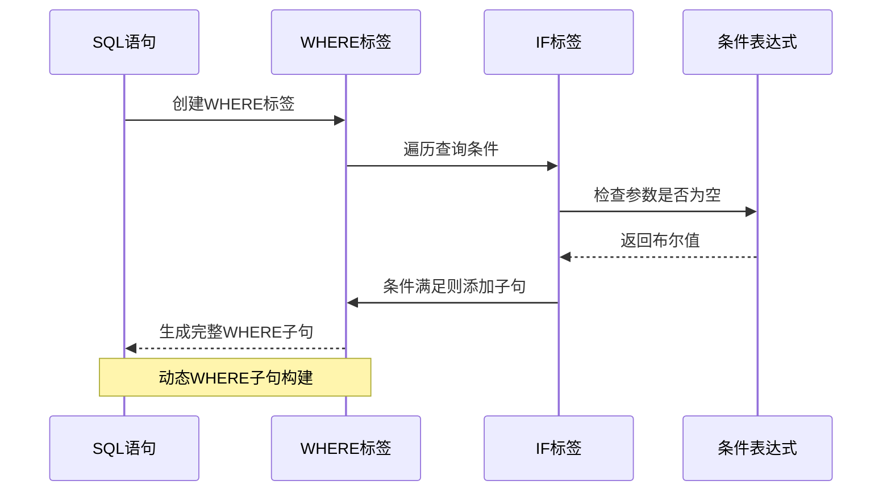
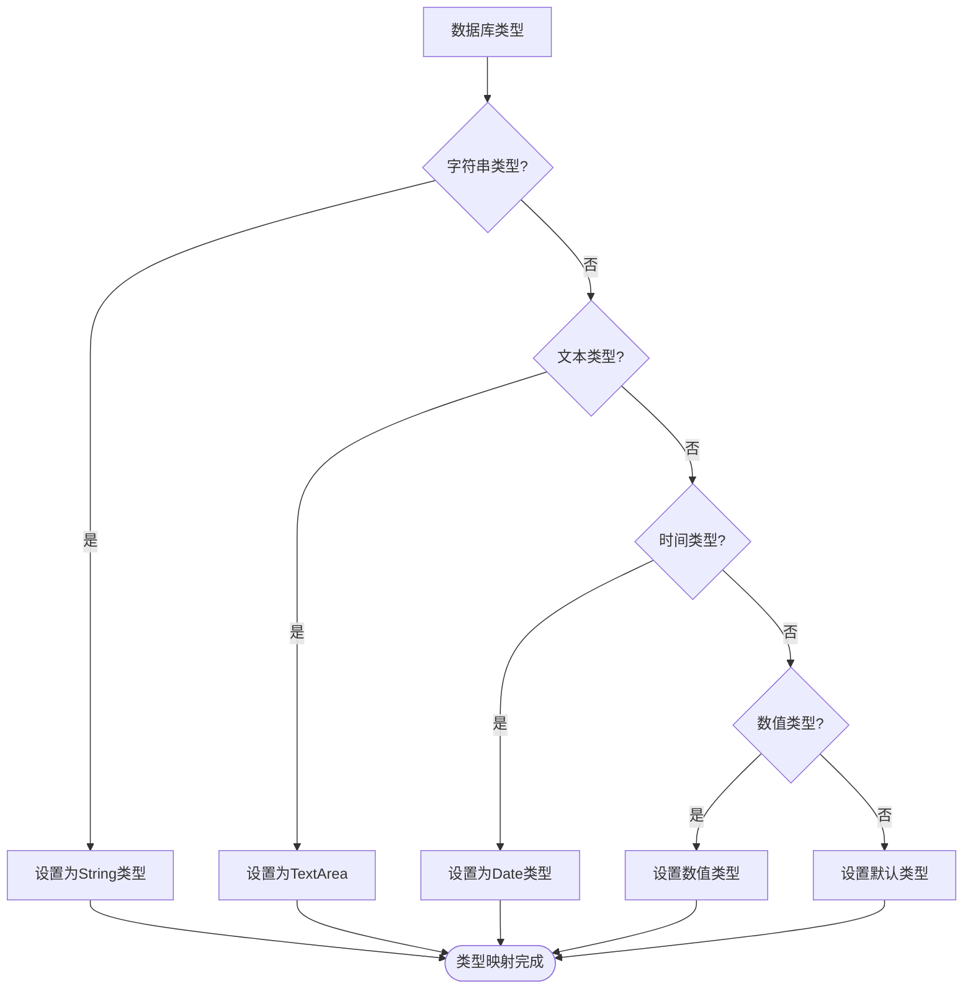
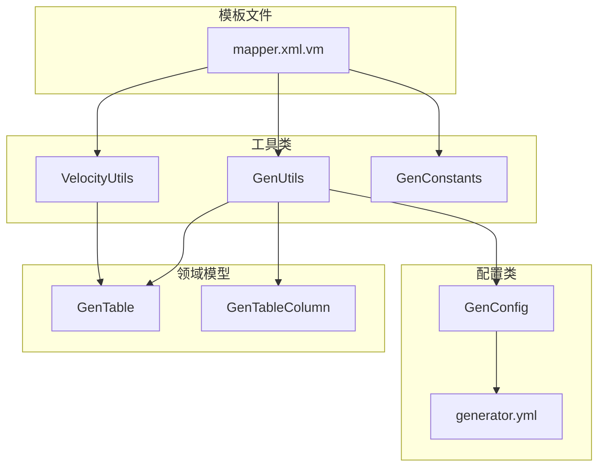
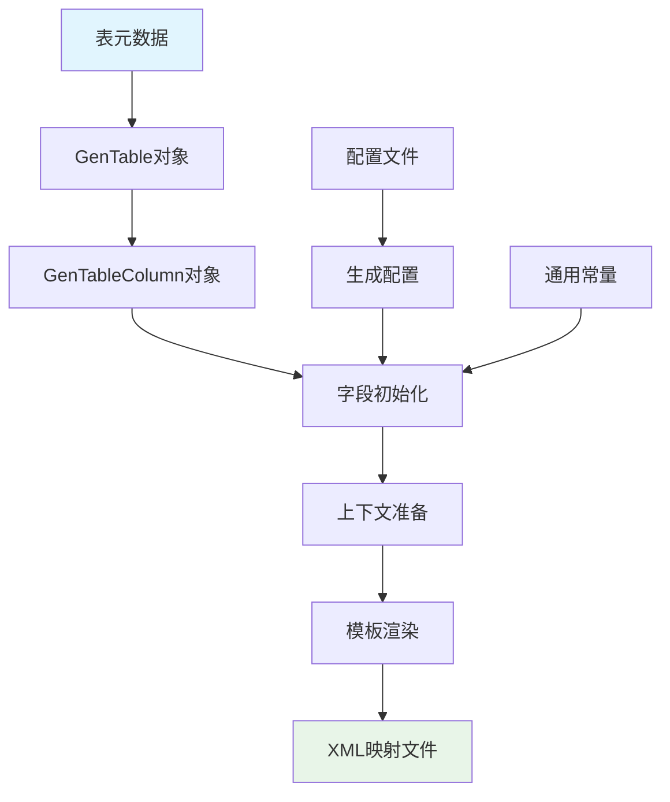

# Mapper XML模板

<cite>
**本文档引用的文件**
- [mapper.xml.vm](file://blog-generator/src/main/resources/vm/xml/mapper.xml.vm)
- [GenUtils.java](file://blog-generator/src/main/java/blog/generator/util/GenUtils.java)
- [VelocityUtils.java](file://blog-generator/src/main/java/blog/generator/util/VelocityUtils.java)
- [GenTable.java](file://blog-generator/src/main/java/blog/generator/domain/GenTable.java)
- [GenTableColumn.java](file://blog-generator/src/main/java/blog/generator/domain/GenTableColumn.java)
- [GenConfig.java](file://blog-generator/src/main/java/blog/generator/config/GenConfig.java)
- [generator.yml](file://blog-generator/src/main/resources/generator.yml)
- [GenConstants.java](file://blog-common/src/main/java/blog/common/constant/GenConstants.java)
- [ArticleMapper.xml](file://blog-biz/src/main/resources/mapper/ArticleMapper.xml)
- [GenTableMapper.xml](file://blog-generator/src/main/resources/mapper/generator/GenTableMapper.xml)
- [GenTableColumnMapper.xml](file://blog-generator/src/main/resources/mapper/generator/GenTableColumnMapper.xml)
</cite>

## 目录
1. [简介](#简介)
2. [项目结构](#项目结构)
3. [核心组件](#核心组件)
4. [架构概览](#架构概览)
5. [详细组件分析](#详细组件分析)
6. [依赖关系分析](#依赖关系分析)
7. [性能考虑](#性能考虑)
8. [故障排除指南](#故障排除指南)
9. [结论](#结论)
10. [附录](#附录)

## 简介

本文档详细说明了基于Velocity模板引擎的MyBatis XML映射文件自动生成系统。该系统通过模板化的方式，为每个数据库表自动生成符合MyBatis规范的XML映射文件，包括namespace自动填充、resultMap标准化定义、CRUD语句模板化生成、条件查询动态拼接、分页查询支持等完整功能。

该系统采用代码生成器模式，通过配置驱动的方式，将数据库表结构转换为标准的MyBatis映射文件，大大提高了开发效率并确保了代码的一致性和规范性。

## 项目结构

项目采用多模块架构，其中代码生成器模块负责生成各种类型的文件，包括MyBatis XML映射文件。



**图表来源**
- [mapper.xml.vm:1-25](file://blog-generator/src/main/resources/vm/xml/mapper.xml.vm#L1-L25)
- [GenUtils.java:1-223](file://blog-generator/src/main/java/blog/generator/util/GenUtils.java#L1-L223)
- [VelocityUtils.java:1-364](file://blog-generator/src/main/java/blog/generator/util/VelocityUtils.java#L1-L364)

**章节来源**
- [mapper.xml.vm:1-25](file://blog-generator/src/main/resources/vm/xml/mapper.xml.vm#L1-L25)
- [GenUtils.java:1-223](file://blog-generator/src/main/java/blog/generator/util/GenUtils.java#L1-L223)
- [VelocityUtils.java:1-364](file://blog-generator/src/main/java/blog/generator/util/VelocityUtils.java#L1-L364)

## 核心组件

### Velocity模板引擎
系统使用Apache Velocity作为模板引擎，通过`.vm`文件定义XML映射文件的生成规则。模板引擎提供了强大的变量替换、循环遍历、条件判断等功能。

### 代码生成工具类
`GenUtils`类负责表结构的初始化和字段属性的设置，包括类名转换、包名解析、业务名提取等核心逻辑。

### 模板上下文处理器
`VelocityUtils`类负责准备模板渲染所需的上下文环境，包括变量注入、文件路径生成、导入包处理等。

### 领域模型
`GenTable`和`GenTableColumn`类定义了代码生成的核心数据结构，承载着数据库表和列的元数据信息。

**章节来源**
- [GenUtils.java:17-113](file://blog-generator/src/main/java/blog/generator/util/GenUtils.java#L17-L113)
- [VelocityUtils.java:43-77](file://blog-generator/src/main/java/blog/generator/util/VelocityUtils.java#L43-L77)
- [GenTable.java:20-177](file://blog-generator/src/main/java/blog/generator/domain/GenTable.java#L20-L177)
- [GenTableColumn.java:12-348](file://blog-generator/src/main/java/blog/generator/domain/GenTableColumn.java#L12-L348)

## 架构概览

系统采用分层架构设计，从上到下分别为：模板层、处理层、数据层。



**图表来源**
- [VelocityUtils.java:43-77](file://blog-generator/src/main/java/blog/generator/util/VelocityUtils.java#L43-L77)
- [GenUtils.java:21-30](file://blog-generator/src/main/java/blog/generator/util/GenUtils.java#L21-L30)

## 详细组件分析

### Mapper XML模板核心结构

#### Namespace自动填充机制
模板通过`${packageName}.mapper.${ClassName}Mapper`的格式自动填充命名空间，确保与Java接口完全匹配。



**图表来源**
- [mapper.xml.vm:5-5](file://blog-generator/src/main/resources/vm/xml/mapper.xml.vm#L5-L5)

#### resultMap标准化定义
模板为每个实体类生成标准化的resultMap，包含完整的字段映射定义。

```mermaid
classDiagram
class ResultMap {
+type : "${ClassName}"
+id : "${ClassName}Result"
+result[] : 字段映射
}
class ColumnMapping {
+property : "${column.javaField}"
+column : "${column.columnName}"
}
class SubResultMap {
+type : "${ClassName}"
+id : "${ClassName}${subClassName}Result"
+extends : "${ClassName}Result"
+collection : 子表映射
}
ResultMap --> ColumnMapping : "包含"
SubResultMap --> ResultMap : "继承"
SubResultMap --> ColumnMapping : "包含"
```

**图表来源**
- [mapper.xml.vm:7-11](file://blog-generator/src/main/resources/vm/xml/mapper.xml.vm#L7-L11)
- [mapper.xml.vm:14-16](file://blog-generator/src/main/resources/vm/xml/mapper.xml.vm#L14-L16)

**章节来源**
- [mapper.xml.vm:5-23](file://blog-generator/src/main/resources/vm/xml/mapper.xml.vm#L5-L23)

### CRUD语句自动生成机制

#### INSERT语句模板
系统根据列的插入属性自动生成INSERT语句，支持条件插入和动态字段选择。



**图表来源**
- [ArticleMapper.xml:131-131](file://blog-biz/src/main/resources/mapper/ArticleMapper.xml#L131-L131)
- [ArticleMapper.xml:133-139](file://blog-biz/src/main/resources/mapper/ArticleMapper.xml#L133-L139)

#### UPDATE语句模板
UPDATE语句采用SET子句的动态构建方式，只更新非空字段。



**图表来源**
- [ArticleMapper.xml:229-229](file://blog-biz/src/main/resources/mapper/ArticleMapper.xml#L229-L229)
- [ArticleMapper.xml:231-237](file://blog-biz/src/main/resources/mapper/ArticleMapper.xml#L231-L237)

#### DELETE语句模板
支持单个删除和批量删除两种模式。

**章节来源**
- [ArticleMapper.xml:281-292](file://blog-biz/src/main/resources/mapper/ArticleMapper.xml#L281-L292)

### 条件查询动态拼接规则

#### WHERE子句自动构建
系统通过`<where>`标签自动构建WHERE子句，避免多余的AND/OR关键字。



**图表来源**
- [ArticleMapper.xml:82-82](file://blog-biz/src/main/resources/mapper/ArticleMapper.xml#L82-L82)
- [ArticleMapper.xml:84-123](file://blog-biz/src/main/resources/mapper/ArticleMapper.xml#L84-L123)

#### IF标签智能使用
系统根据字段的查询属性和数据类型智能使用IF标签，确保SQL的安全性和有效性。

**章节来源**
- [ArticleMapper.xml:84-123](file://blog-biz/src/main/resources/mapper/ArticleMapper.xml#L84-L123)

### 分页查询SQL生成

#### LIMIT子句支持
系统支持标准的LIMIT子句，配合分页参数实现数据分页。

#### 排序条件处理
通过`ORDER BY`子句支持多种排序方式，包括单字段和多字段排序。

#### 查询总数支持
系统提供查询总数的功能，用于前端分页组件的总记录数显示。

**章节来源**
- [ArticleMapper.xml:55-124](file://blog-biz/src/main/resources/mapper/ArticleMapper.xml#L55-L124)

### 配置驱动的生成规则

#### 数据库类型映射
系统根据数据库列类型自动映射到Java类型，包括字符串、数值、日期等类型。



**图表来源**
- [GenUtils.java:46-70](file://blog-generator/src/main/java/blog/generator/util/GenUtils.java#L46-L70)

#### HTML控件类型设置
根据字段特征自动设置对应的HTML控件类型，如输入框、下拉框、日期控件等。

**章节来源**
- [GenUtils.java:88-112](file://blog-generator/src/main/java/blog/generator/util/GenUtils.java#L88-L112)

## 依赖关系分析

### 模板依赖关系



**图表来源**
- [mapper.xml.vm:1-25](file://blog-generator/src/main/resources/vm/xml/mapper.xml.vm#L1-L25)
- [GenUtils.java:1-223](file://blog-generator/src/main/java/blog/generator/util/GenUtils.java#L1-L223)
- [VelocityUtils.java:1-364](file://blog-generator/src/main/java/blog/generator/util/VelocityUtils.java#L1-L364)
- [GenConfig.java:1-87](file://blog-generator/src/main/java/blog/generator/config/GenConfig.java#L1-L87)

### 代码生成流程



**图表来源**
- [GenTable.java:20-177](file://blog-generator/src/main/java/blog/generator/domain/GenTable.java#L20-L177)
- [GenTableColumn.java:12-348](file://blog-generator/src/main/java/blog/generator/domain/GenTableColumn.java#L12-L348)
- [GenUtils.java:21-30](file://blog-generator/src/main/java/blog/generator/util/GenUtils.java#L21-L30)

**章节来源**
- [GenTable.java:20-177](file://blog-generator/src/main/java/blog/generator/domain/GenTable.java#L20-L177)
- [GenTableColumn.java:12-348](file://blog-generator/src/main/java/blog/generator/domain/GenTableColumn.java#L12-L348)
- [GenUtils.java:21-113](file://blog-generator/src/main/java/blog/generator/util/GenUtils.java#L21-L113)

## 性能考虑

### SQL优化策略
1. **字段选择优化**：只选择必要的字段，避免使用SELECT *
2. **索引利用**：在WHERE子句中优先使用索引字段
3. **条件过滤**：合理使用IF标签减少不必要的条件判断
4. **批量操作**：支持批量插入和批量删除提高效率

### 缓存策略
1. **结果缓存**：对于频繁查询的结果可以考虑缓存
2. **查询缓存**：使用MyBatis二级缓存机制
3. **参数缓存**：对于重复使用的参数进行缓存

### 数据库连接优化
1. **连接池配置**：合理配置数据库连接池大小
2. **事务管理**：使用合适的事务隔离级别
3. **超时设置**：设置合理的SQL执行超时时间

## 故障排除指南

### 常见问题及解决方案

#### 命名空间不匹配
**问题**：生成的XML命名空间与Java接口不一致
**解决方案**：检查包名配置和类名转换规则

#### 字段映射错误
**问题**：resultMap中的字段映射不正确
**解决方案**：验证数据库列名和Java字段名的对应关系

#### SQL语法错误
**问题**：生成的SQL语句存在语法错误
**解决方案**：检查IF标签的条件表达式和字段类型

#### 性能问题
**问题**：查询性能不佳
**解决方案**：分析执行计划，添加适当的索引

**章节来源**
- [GenUtils.java:156-164](file://blog-generator/src/main/java/blog/generator/util/GenUtils.java#L156-L164)
- [VelocityUtils.java:159-207](file://blog-generator/src/main/java/blog/generator/util/VelocityUtils.java#L159-L207)

## 结论

该Mapper XML模板系统通过Velocity模板引擎实现了MyBatis XML映射文件的自动化生成，具有以下优势：

1. **标准化输出**：确保所有生成的XML文件遵循统一的规范和格式
2. **智能化生成**：根据数据库结构自动推断Java类型和HTML控件类型
3. **灵活配置**：支持多种生成配置，适应不同的业务需求
4. **高性能**：生成的SQL经过优化，支持索引利用和批量操作

该系统大大提高了开发效率，减少了手工编写XML映射文件的工作量，同时确保了代码质量和一致性。

## 附录

### 配置参数说明

| 参数名 | 类型 | 默认值 | 描述 |
|--------|------|--------|------|
| author | String | leejie | 代码生成作者 |
| packageName | String | blog.biz | 生成包路径 |
| autoRemovePre | Boolean | true | 是否自动去除表前缀 |
| tablePrefix | String | biz_ | 表前缀定义 |
| allowOverwrite | Boolean | true | 是否允许覆盖现有文件 |

### 支持的数据库类型

| 类型类别 | 支持的类型 |
|----------|------------|
| 字符串类型 | char, varchar, nvarchar, varchar2 |
| 文本类型 | tinytext, text, mediumtext, longtext |
| 时间类型 | datetime, time, date, timestamp |
| 数值类型 | tinyint, smallint, mediumint, int, number, integer, bit, bigint, float, double, decimal |