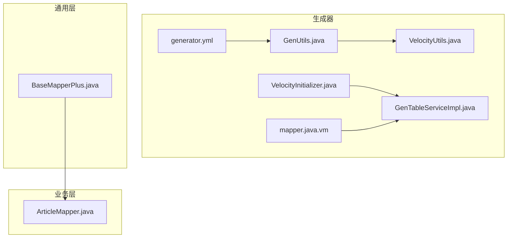
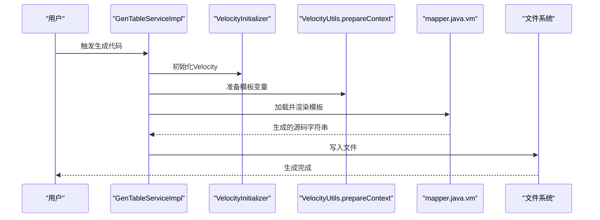
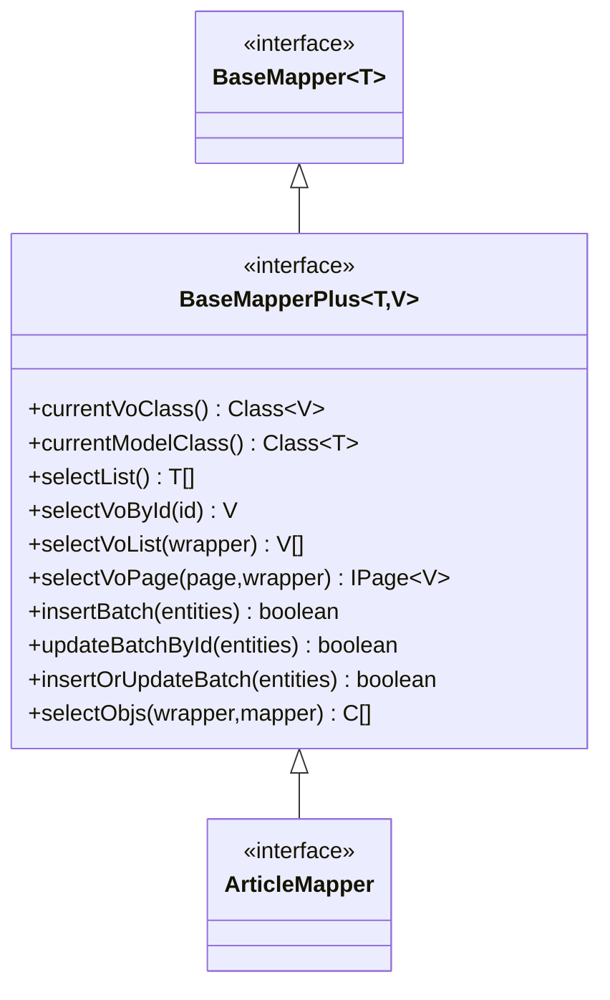
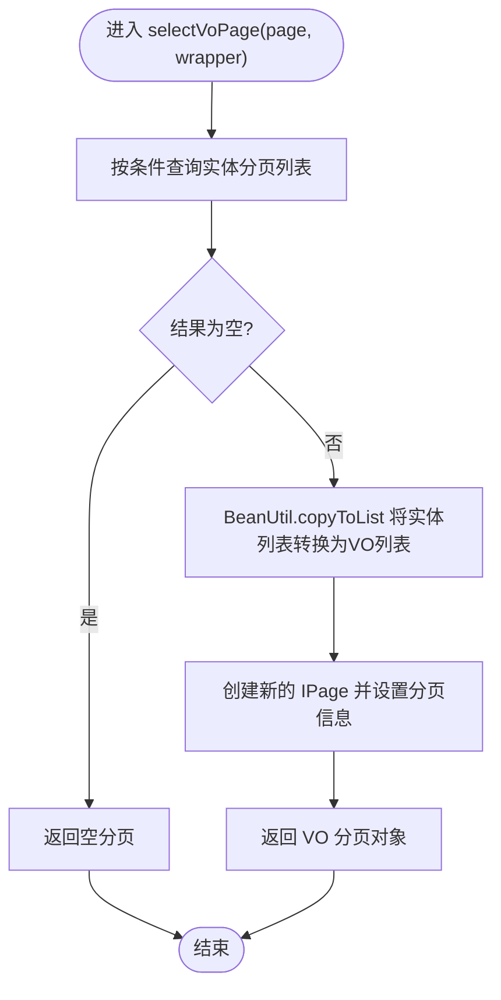
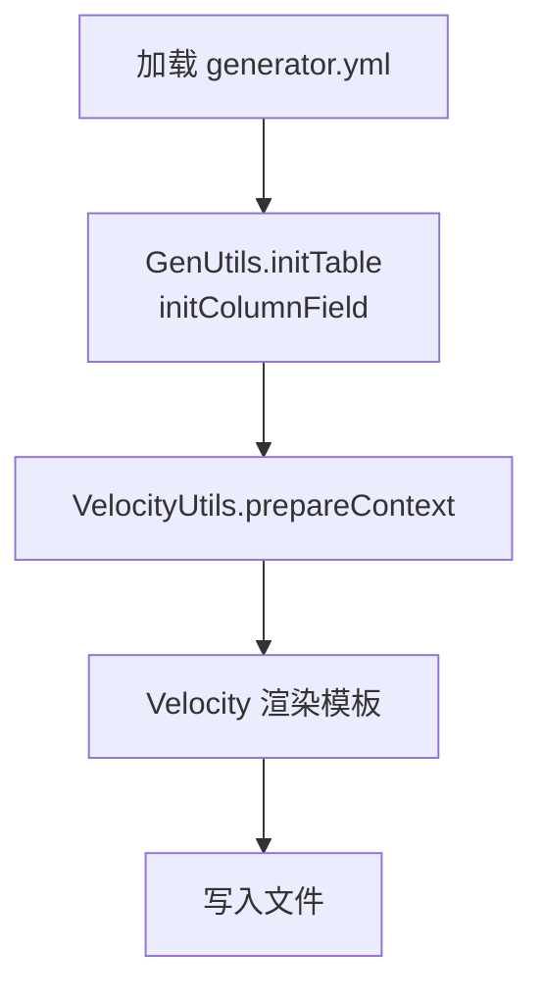
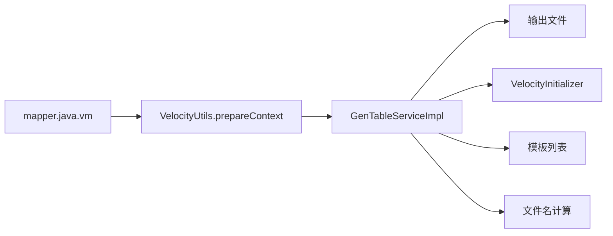

# Mapper接口模板

<cite>
**本文引用的文件**
- [mapper.java.vm](file://blog-generator/src/main/resources/vm/java/mapper.java.vm)
- [BaseMapperPlus.java](file://blog-common/src/main/java/blog/common/base/mapper/BaseMapperPlus.java)
- [generator.yml](file://blog-generator/src/main/resources/generator.yml)
- [GenUtils.java](file://blog-generator/src/main/java/blog/generator/util/GenUtils.java)
- [VelocityUtils.java](file://blog-generator/src/main/java/blog/generator/util/VelocityUtils.java)
- [VelocityInitializer.java](file://blog-generator/src/main/java/blog/generator/util/VelocityInitializer.java)
- [GenTableServiceImpl.java](file://blog-generator/src/main/java/blog/generator/service/GenTableServiceImpl.java)
- [ArticleMapper.java](file://blog-biz/src/main/java/blog/biz/mapper/ArticleMapper.java)
</cite>

## 目录
1. [简介](#简介)
2. [项目结构](#项目结构)
3. [核心组件](#核心组件)
4. [架构总览](#架构总览)
5. [详细组件分析](#详细组件分析)
6. [依赖分析](#依赖分析)
7. [性能考虑](#性能考虑)
8. [故障排除指南](#故障排除指南)
9. [结论](#结论)
10. [附录](#附录)

## 简介
本文件围绕 MyBatis-Plus Mapper 接口模板进行深入技术文档化，重点解释以下内容：
- 模板如何自动生成 Mapper 接口，包括包名、类名、作者、日期等占位符的填充；
- 泛型参数 BaseMapperPlus<Entity, VO> 的自动填充与继承关系处理；
- BaseMapperPlus 接口的扩展能力：分页查询、条件构造器、批量操作等高级特性；
- Mapper 接口中常用方法的签名生成规则（如 insert、updateById、deleteById、selectPage 等）；
- 通过模板生成完整数据访问层接口的实践示例，涵盖方法注释、异常处理、事务管理等企业级特性。

## 项目结构
与 Mapper 接口模板直接相关的核心文件分布如下：
- 生成器模板：vm/java/mapper.java.vm
- 通用 Mapper 扩展：blog-common/base/mapper/BaseMapperPlus.java
- 生成器配置：generator.yml
- 生成器工具链：GenUtils.java、VelocityUtils.java、VelocityInitializer.java
- 生成流程入口：GenTableServiceImpl.java
- 示例 Mapper：blog-biz/mapper/ArticleMapper.java

**图表来源**
- [mapper.java.vm:1-16](file://blog-generator/src/main/resources/vm/java/mapper.java.vm#L1-L16)
- [BaseMapperPlus.java:1-335](file://blog-common/src/main/java/blog/common/base/mapper/BaseMapperPlus.java#L1-L335)
- [generator.yml:1-12](file://blog-generator/src/main/resources/generator.yml#L1-L12)
- [GenUtils.java:1-223](file://blog-generator/src/main/java/blog/generator/util/GenUtils.java#L1-L223)
- [VelocityUtils.java:1-364](file://blog-generator/src/main/java/blog/generator/util/VelocityUtils.java#L1-L364)
- [VelocityInitializer.java:1-31](file://blog-generator/src/main/java/blog/generator/util/VelocityInitializer.java#L1-L31)
- [GenTableServiceImpl.java:208-374](file://blog-generator/src/main/java/blog/generator/service/GenTableServiceImpl.java#L208-L374)
- [ArticleMapper.java:1-66](file://blog-biz/src/main/java/blog/biz/mapper/ArticleMapper.java#L1-L66)

**章节来源**
- [mapper.java.vm:1-16](file://blog-generator/src/main/resources/vm/java/mapper.java.vm#L1-L16)
- [BaseMapperPlus.java:1-335](file://blog-common/src/main/java/blog/common/base/mapper/BaseMapperPlus.java#L1-L335)
- [generator.yml:1-12](file://blog-generator/src/main/resources/generator.yml#L1-L12)
- [GenUtils.java:17-223](file://blog-generator/src/main/java/blog/generator/util/GenUtils.java#L17-L223)
- [VelocityUtils.java:43-77](file://blog-generator/src/main/java/blog/generator/util/VelocityUtils.java#L43-L77)
- [VelocityInitializer.java:17-29](file://blog-generator/src/main/java/blog/generator/util/VelocityInitializer.java#L17-L29)
- [GenTableServiceImpl.java:239-366](file://blog-generator/src/main/java/blog/generator/service/GenTableServiceImpl.java#L239-L366)
- [ArticleMapper.java:1-66](file://blog-biz/src/main/java/blog/biz/mapper/ArticleMapper.java#L1-L66)

## 核心组件
- 模板文件 mapper.java.vm：定义了 Mapper 接口的骨架，包含包名、类名、作者、日期等占位符，以及对 BaseMapperPlus 的继承关系。
- BaseMapperPlus 接口：在 MyBatis-Plus 的 BaseMapper 基础上扩展了大量实用方法，包括：
  - 泛型解析：currentVoClass()/currentModelClass() 通过反射解析泛型类型；
  - 条件查询：selectList()、selectOne()、selectMap() 等；
  - VO 转换：selectVoById()/selectVoList()/selectVoPage() 等，支持将实体转换为 VO；
  - 分页查询：selectVoPage() 支持 IPage<V> 返回值；
  - 批量操作：insertBatch()/updateBatchById()/insertOrUpdateBatch() 及其带批次大小的重载；
  - 对象映射：selectObjs() 支持 Function 映射。
- 生成器配置 generator.yml：定义作者、包名、表前缀、是否允许覆盖等全局参数。
- 生成器工具链：
  - GenUtils：负责表名转类名、模块名、业务名、字段类型推断等；
  - VelocityUtils：准备 VelocityContext、选择模板、计算输出文件名；
  - VelocityInitializer：初始化 Velocity 引擎；
  - GenTableServiceImpl：协调生成流程，渲染模板并输出文件。

**章节来源**
- [mapper.java.vm:1-16](file://blog-generator/src/main/resources/vm/java/mapper.java.vm#L1-L16)
- [BaseMapperPlus.java:32-335](file://blog-common/src/main/java/blog/common/base/mapper/BaseMapperPlus.java#L32-L335)
- [generator.yml:3-12](file://blog-generator/src/main/resources/generator.yml#L3-L12)
- [GenUtils.java:21-164](file://blog-generator/src/main/java/blog/generator/util/GenUtils.java#L21-L164)
- [VelocityUtils.java:43-77](file://blog-generator/src/main/java/blog/generator/util/VelocityUtils.java#L43-L77)
- [VelocityInitializer.java:17-29](file://blog-generator/src/main/java/blog/generator/util/VelocityInitializer.java#L17-L29)
- [GenTableServiceImpl.java:239-366](file://blog-generator/src/main/java/blog/generator/service/GenTableServiceImpl.java#L239-L366)

## 架构总览
下面以序列图展示从配置到生成 Mapper 接口的完整流程：

**图表来源**
- [GenTableServiceImpl.java:239-366](file://blog-generator/src/main/java/blog/generator/service/GenTableServiceImpl.java#L239-L366)
- [VelocityInitializer.java:17-29](file://blog-generator/src/main/java/blog/generator/util/VelocityInitializer.java#L17-L29)
- [VelocityUtils.java:43-77](file://blog-generator/src/main/java/blog/generator/util/VelocityUtils.java#L43-L77)
- [mapper.java.vm:1-16](file://blog-generator/src/main/resources/vm/java/mapper.java.vm#L1-L16)

## 详细组件分析

### 模板文件 mapper.java.vm
- 占位符与自动填充
  - 包名、类名、作者、日期等由 Velocity 上下文注入；
  - 类名 ClassName 与业务名 businessName 由 GenUtils 转换；
  - 导入语句自动包含实体类与 BaseMapperPlus。
- 继承关系
  - Mapper 接口直接继承 BaseMapperPlus<Entity, VO>，从而获得全部扩展能力；
  - 若业务需要仅使用 MyBatis-Plus 原生能力，可改为继承 BaseMapper<Entity>。

**图表来源**
- [mapper.java.vm:13](file://blog-generator/src/main/resources/vm/java/mapper.java.vm#L13)
- [BaseMapperPlus.java:32-335](file://blog-common/src/main/java/blog/common/base/mapper/BaseMapperPlus.java#L32-L335)

**章节来源**
- [mapper.java.vm:1-16](file://blog-generator/src/main/resources/vm/java/mapper.java.vm#L1-L16)
- [BaseMapperPlus.java:32-335](file://blog-common/src/main/java/blog/common/base/mapper/BaseMapperPlus.java#L32-L335)

### BaseMapperPlus 接口扩展能力
- 泛型解析
  - currentVoClass()/currentModelClass() 通过反射解析当前实现类的泛型参数，确保 VO 转换与分页返回类型正确。
- 条件查询
  - 提供 selectList()/selectOne()/selectMap()/selectObjs() 等便捷方法，减少样板代码。
- VO 转换
  - selectVoById()/selectVoList()/selectVoPage() 将实体对象转换为 VO，支持自定义 VO 类型与抛异常控制。
- 分页查询
  - selectVoPage() 返回 IPage<V>，内部将实体分页结果转换为 VO 分页结果，保持分页信息一致。
- 批量操作
  - insertBatch()/updateBatchById()/insertOrUpdateBatch() 及其带批次大小的重载，提升大批量数据处理效率。

**图表来源**
- [BaseMapperPlus.java:296-320](file://blog-common/src/main/java/blog/common/base/mapper/BaseMapperPlus.java#L296-L320)

**章节来源**
- [BaseMapperPlus.java:32-335](file://blog-common/src/main/java/blog/common/base/mapper/BaseMapperPlus.java#L32-L335)

### 生成器配置与上下文
- 配置项
  - author：作者名
  - packageName：默认生成包路径
  - autoRemovePre：是否自动去除表前缀
  - tablePrefix：表前缀列表（多个用逗号分隔）
  - allowOverwrite：是否允许覆盖本地文件
- 上下文变量
  - ClassName、className、businessName、moduleName、packageName、author、datetime、importList、columns、table 等，均由 VelocityUtils.prepareContext 注入。

**图表来源**
- [generator.yml:3-12](file://blog-generator/src/main/resources/generator.yml#L3-L12)
- [GenUtils.java:21-113](file://blog-generator/src/main/java/blog/generator/util/GenUtils.java#L21-L113)
- [VelocityUtils.java:43-77](file://blog-generator/src/main/java/blog/generator/util/VelocityUtils.java#L43-L77)

**章节来源**
- [generator.yml:1-12](file://blog-generator/src/main/resources/generator.yml#L1-L12)
- [GenUtils.java:21-113](file://blog-generator/src/main/java/blog/generator/util/GenUtils.java#L21-L113)
- [VelocityUtils.java:43-77](file://blog-generator/src/main/java/blog/generator/util/VelocityUtils.java#L43-L77)

### 方法签名生成规则与企业级特性
- 常用方法签名规则
  - insert：接收实体对象，返回受影响行数（int）；可结合异常处理与事务管理；
  - updateById：接收实体对象，返回受影响行数（int）；建议配合乐观锁或版本号字段；
  - deleteById：接收主键，返回受影响行数（int）；支持批量删除（传入数组）；
  - selectPage：接收 IPage<T> 与 Wrapper，返回 IPage<T>；可扩展为 selectVoPage 返回 VO 分页。
- 企业级特性建议
  - 方法注释：使用标准 JavaDoc，描述参数、返回值与异常场景；
  - 异常处理：在 Service 层捕获并统一转换为业务异常；
  - 事务管理：使用 @Transactional 标注复杂业务的事务边界；
  - 日志记录：记录关键操作与异常堆栈，便于审计与排障。

**章节来源**
- [ArticleMapper.java:18-65](file://blog-biz/src/main/java/blog/biz/mapper/ArticleMapper.java#L18-L65)

## 依赖分析
- 模板到接口的依赖
  - mapper.java.vm 依赖 Velocity 上下文变量（ClassName、packageName、importList 等）；
  - 生成的 Mapper 接口依赖 BaseMapperPlus，后者依赖 MyBatis-Plus 的 BaseMapper、IPage、Wrapper 等。
- 生成器内部依赖
  - GenTableServiceImpl 依赖 VelocityInitializer、VelocityUtils、模板列表与文件名计算逻辑；
  - VelocityUtils 依赖 GenTable 与 GenTableColumn，负责上下文准备与文件命名。

**图表来源**
- [VelocityUtils.java:129-154](file://blog-generator/src/main/java/blog/generator/util/VelocityUtils.java#L129-L154)
- [VelocityUtils.java:159-207](file://blog-generator/src/main/java/blog/generator/util/VelocityUtils.java#L159-L207)
- [GenTableServiceImpl.java:239-366](file://blog-generator/src/main/java/blog/generator/service/GenTableServiceImpl.java#L239-L366)

**章节来源**
- [VelocityUtils.java:129-154](file://blog-generator/src/main/java/blog/generator/util/VelocityUtils.java#L129-L154)
- [VelocityUtils.java:159-207](file://blog-generator/src/main/java/blog/generator/util/VelocityUtils.java#L159-L207)
- [GenTableServiceImpl.java:239-366](file://blog-generator/src/main/java/blog/generator/service/GenTableServiceImpl.java#L239-L366)

## 性能考虑
- 批量操作
  - BaseMapperPlus 提供 insertBatch()/updateBatchById()/insertOrUpdateBatch() 及其带批次大小的重载，建议在大批量数据写入时使用，以减少网络往返与 SQL 解析开销。
- 分页查询
  - selectVoPage() 在内存中进行实体到 VO 的转换，建议合理设置分页大小与排序字段，避免超大分页导致内存压力。
- 条件查询
  - 使用 QueryWrapper/Wrappers 进行条件拼装，尽量命中索引，避免全表扫描。

[本节为通用指导，不涉及具体文件分析]

## 故障排除指南
- 模板未生效
  - 检查 Velocity 初始化是否成功（VelocityInitializer.initVelocity）；
  - 确认模板路径与模板列表（VelocityUtils.getTemplateList）正确。
- 生成文件名错误
  - 检查 VelocityUtils.getFileName 中的模板匹配逻辑与包路径配置；
  - 确认项目路径常量 PROJECT_PATH 与 MYBATIS_PATH 与实际工程结构一致。
- 泛型类型缺失或错误
  - 确保生成的 Mapper 接口继承 BaseMapperPlus<Entity, VO>，且 Entity/VO 类型正确；
  - 如需自定义 VO，确保 VO 类存在且与泛型参数一致。
- 生成覆盖策略
  - generator.yml 中 allowOverwrite 控制是否允许覆盖本地文件，谨慎开启。

**章节来源**
- [VelocityInitializer.java:17-29](file://blog-generator/src/main/java/blog/generator/util/VelocityInitializer.java#L17-L29)
- [VelocityUtils.java:129-154](file://blog-generator/src/main/java/blog/generator/util/VelocityUtils.java#L129-L154)
- [VelocityUtils.java:159-207](file://blog-generator/src/main/java/blog/generator/util/VelocityUtils.java#L159-L207)
- [generator.yml:11-12](file://blog-generator/src/main/resources/generator.yml#L11-L12)

## 结论
通过模板与生成器工具链，Mapper 接口能够自动继承 BaseMapperPlus 的丰富能力，显著降低重复代码并提升开发效率。结合合理的分页、批量与 VO 转换机制，可在保证性能的同时满足企业级需求。建议在生成的基础上进一步完善注释、异常与事务管理，形成标准化的数据访问层实现。

[本节为总结性内容，不涉及具体文件分析]

## 附录
- 实际生成示例参考：blog-biz/mapper/ArticleMapper.java，展示了传统 MyBatis-Plus Mapper 的手写实现风格，可作为对比与迁移参考。

**章节来源**
- [ArticleMapper.java:1-66](file://blog-biz/src/main/java/blog/biz/mapper/ArticleMapper.java#L1-L66)