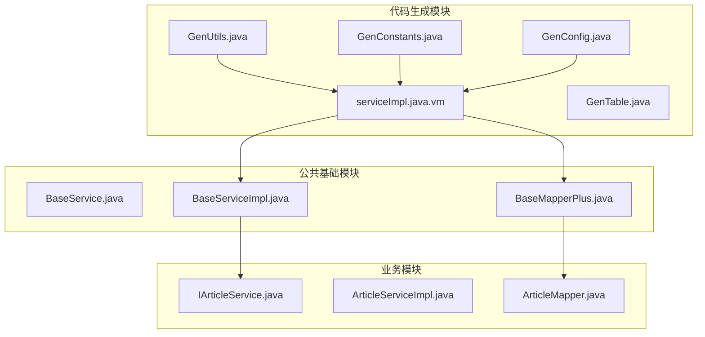
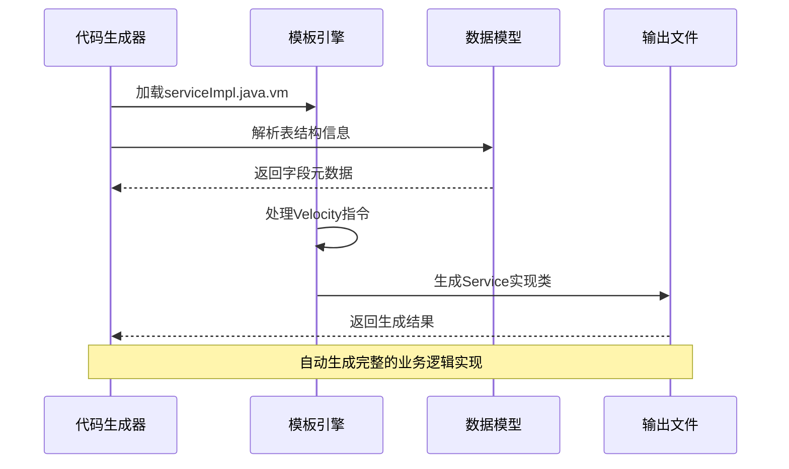
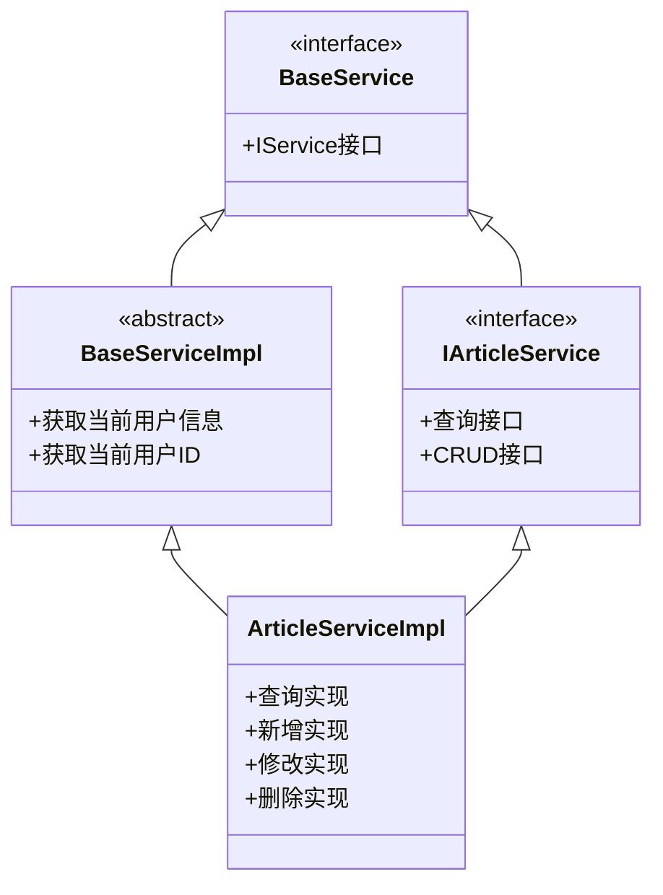
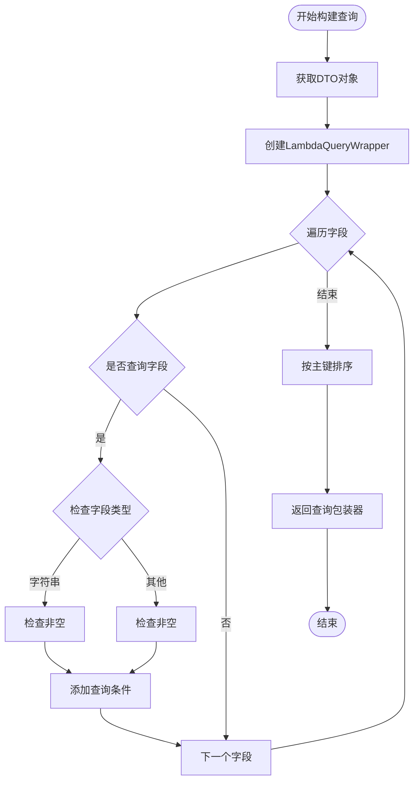
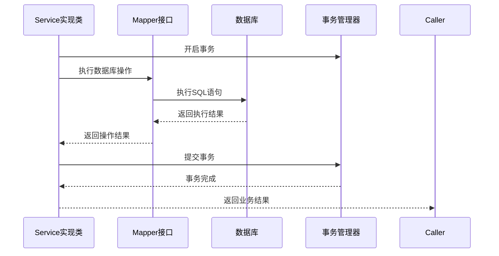
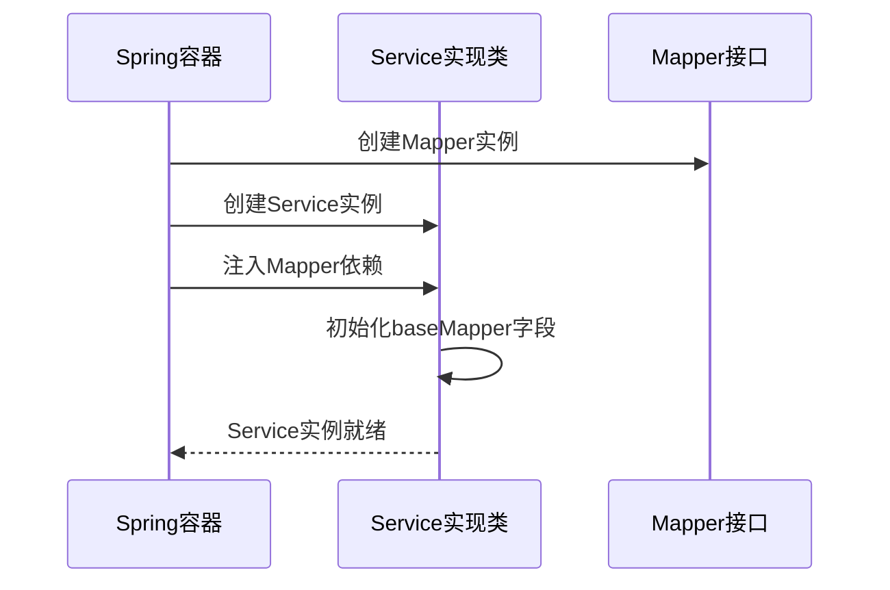
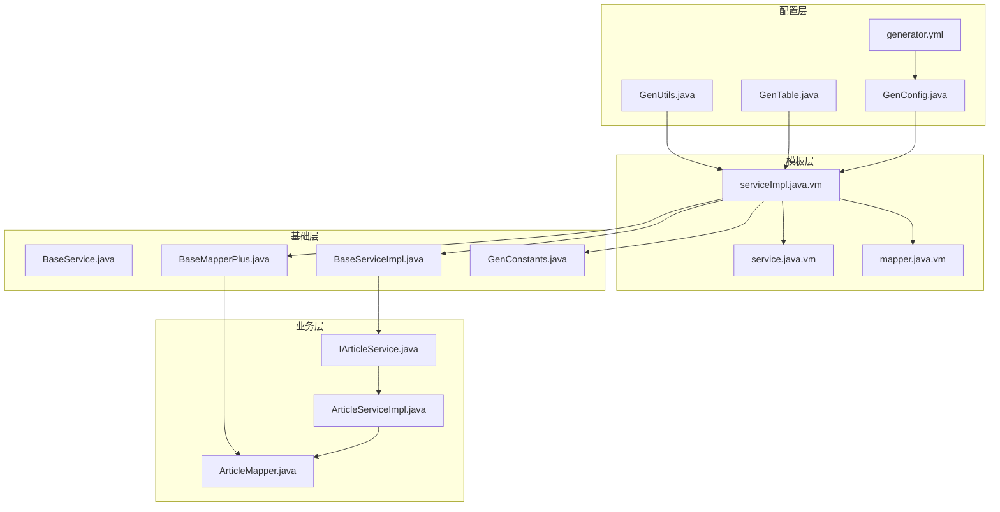
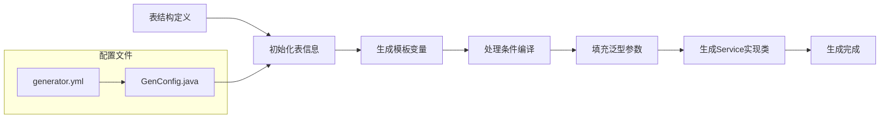

# Service实现模板

<cite>
**本文档引用的文件**
- [serviceImpl.java.vm](file://blog-generator/src/main/resources/vm/java/serviceImpl.java.vm)
- [BaseServiceImpl.java](file://blog-common/src/main/java/blog/common/base/service/impl/BaseServiceImpl.java)
- [BaseService.java](file://blog-common/src/main/java/blog/common/base/service/BaseService.java)
- [BaseMapperPlus.java](file://blog-common/src/main/java/blog/common/base/mapper/BaseMapperPlus.java)
- [GenUtils.java](file://blog-generator/src/main/java/blog/generator/util/GenUtils.java)
- [GenTable.java](file://blog-generator/src/main/java/blog/generator/domain/GenTable.java)
- [GenConstants.java](file://blog-common/src/main/java/blog/common/constant/GenConstants.java)
- [GenConfig.java](file://blog-generator/src/main/java/blog/generator/config/GenConfig.java)
- [generator.yml](file://blog-generator/src/main/resources/generator.yml)
- [service.java.vm](file://blog-generator/src/main/resources/vm/java/service.java.vm)
- [mapper.java.vm](file://blog-generator/src/main/resources/vm/java/mapper.java.vm)
- [IArticleService.java](file://blog-biz/src/main/java/blog/biz/service/IArticleService.java)
- [ArticleServiceImpl.java](file://blog-biz/src/main/java/blog/biz/service/impl/ArticleServiceImpl.java)
- [ArticleMapper.java](file://blog-biz/src/main/java/blog/biz/mapper/ArticleMapper.java)
</cite>

## 目录
1. [简介](#简介)
2. [项目结构](#项目结构)
3. [核心组件](#核心组件)
4. [架构概览](#架构概览)
5. [详细组件分析](#详细组件分析)
6. [依赖分析](#依赖分析)
7. [性能考虑](#性能考虑)
8. [故障排除指南](#故障排除指南)
9. [结论](#结论)
10. [附录](#附录)

## 简介

Service实现模板是RuoYi-Vue项目中用于自动生成业务服务层代码的核心模板之一。该模板基于Apache Velocity模板引擎，通过预定义的变量和宏指令，自动生成符合项目规范的Service实现类。

本文档深入解析了Service实现模板的自动生成机制，包括BaseServiceImpl抽象类的继承、泛型参数的自动填充、业务逻辑的具体实现规则、事务管理的自动配置以及异常处理的统一机制。同时详细阐述了Service实现类中的方法重写规则，包括CRUD操作的具体实现，以及复杂业务逻辑的封装方式。

## 项目结构

项目采用多模块架构设计，Service实现模板位于代码生成模块中，通过Velocity模板引擎实现代码的自动化生成。



**图表来源**
- [serviceImpl.java.vm:1-164](file://blog-generator/src/main/resources/vm/java/serviceImpl.java.vm#L1-L164)
- [BaseServiceImpl.java:1-28](file://blog-common/src/main/java/blog/common/base/service/impl/BaseServiceImpl.java#L1-L28)
- [GenUtils.java:1-223](file://blog-generator/src/main/java/blog/generator/util/GenUtils.java#L1-L223)

**章节来源**
- [serviceImpl.java.vm:1-164](file://blog-generator/src/main/resources/vm/java/serviceImpl.java.vm#L1-L164)
- [GenConfig.java:1-87](file://blog-generator/src/main/java/blog/generator/config/GenConfig.java#L1-L87)
- [generator.yml:1-12](file://blog-generator/src/main/resources/generator.yml#L1-L12)

## 核心组件

### Service实现模板核心要素

Service实现模板通过Velocity模板语法实现了高度自动化的代码生成：

#### 1. 模板变量系统
模板使用丰富的预定义变量来驱动代码生成：
- `${packageName}`：包名
- `${ClassName}`：类名
- `${functionName}`：功能名称
- `${author}`：作者信息
- `${datetime}`：生成时间
- `${pkColumn}`：主键列信息

#### 2. 条件编译机制
模板支持基于表配置的条件编译：
- `#if($table.crud)`：控制CRUD功能的生成
- `#if($column.query)`：控制查询字段的生成
- `#if($column.isPk)`：控制主键字段的排序

#### 3. 泛型参数自动填充
模板通过泛型参数确保类型安全：
- `BaseServiceImpl<${ClassName}Mapper, ${ClassName}>`
- `TableDataInfo<${ClassName}VO>`
- `Collection<${pkColumn.javaType}>`

**章节来源**
- [serviceImpl.java.vm:1-35](file://blog-generator/src/main/resources/vm/java/serviceImpl.java.vm#L1-L35)
- [serviceImpl.java.vm:6-10](file://blog-generator/src/main/resources/vm/java/serviceImpl.java.vm#L6-L10)
- [serviceImpl.java.vm:133-162](file://blog-generator/src/main/resources/vm/java/serviceImpl.java.vm#L133-L162)

## 架构概览

Service实现模板的生成架构体现了分层设计和模板化开发的理念。



**图表来源**
- [GenUtils.java:21-30](file://blog-generator/src/main/java/blog/generator/util/GenUtils.java#L21-L30)
- [GenTable.java:154-177](file://blog-generator/src/main/java/blog/generator/domain/GenTable.java#L154-L177)
- [serviceImpl.java.vm:1-164](file://blog-generator/src/main/resources/vm/java/serviceImpl.java.vm#L1-L164)

### 模板继承体系

Service实现模板构建在完善的继承体系之上：



**图表来源**
- [BaseService.java:1-7](file://blog-common/src/main/java/blog/common/base/service/BaseService.java#L1-L7)
- [BaseServiceImpl.java:9-27](file://blog-common/src/main/java/blog/common/base/service/impl/BaseServiceImpl.java#L9-L27)
- [IArticleService.java:14-63](file://blog-biz/src/main/java/blog/biz/service/IArticleService.java#L14-L63)

**章节来源**
- [BaseServiceImpl.java:1-28](file://blog-common/src/main/java/blog/common/base/service/impl/BaseServiceImpl.java#L1-L28)
- [BaseService.java:1-7](file://blog-common/src/main/java/blog/common/base/service/BaseService.java#L1-L7)

## 详细组件分析

### 1. Service实现类生成机制

#### 1.1 继承关系建立
Service实现类通过继承BaseServiceImpl抽象类获得基础功能：

```mermaid
classDiagram
class BaseServiceImpl~M,T~ {
+getCurrUser() SysUser
+getCurrUserId() Long
}
class ${ClassName}ServiceImpl {
-baseMapper ${ClassName}Mapper
+queryById(${pkColumn.javaType}) ${ClassName}VO
+insertByDTO(${ClassName}DTO) Boolean
+updateByDTO(${ClassName}DTO) Boolean
+deleteWithValidByIds(Collection, Boolean) Boolean
-buildQueryWrapper(${ClassName}DTO) LambdaQueryWrapper
}
BaseServiceImpl <|-- ${ClassName}ServiceImpl
```

**图表来源**
- [serviceImpl.java.vm:35-35](file://blog-generator/src/main/resources/vm/java/serviceImpl.java.vm#L35-L35)
- [BaseServiceImpl.java:9-27](file://blog-common/src/main/java/blog/common/base/service/impl/BaseServiceImpl.java#L9-L27)

#### 1.2 泛型参数自动填充
模板通过泛型参数确保类型安全性和代码复用性：

| 泛型参数 | 作用 | 示例 |
|---------|------|------|
| `M extends BaseMapper<T>` | Mapper泛型 | `ArticleMapper extends BaseMapper<Article>` |
| `T` | 实体类泛型 | `Article`实体类 |
| `V` | VO类泛型 | `ArticleVO`视图对象 |

#### 1.3 CRUD操作实现规则

##### 1.3.1 查询操作
- `queryById()`：通过主键查询单个实体
- `queryPageList()`：分页查询列表数据
- `queryList()`：条件查询列表数据

##### 1.3.2 新增操作
- `insertByDTO()`：通过DTO对象新增实体
- 自动数据验证：`validEntityBeforeSave()`
- 主键回写：自动设置新增实体的主键值

##### 1.3.3 修改操作
- `updateByDTO()`：通过DTO对象修改实体
- 数据验证：修改前的数据验证

##### 1.3.4 删除操作
- `deleteWithValidByIds()`：批量删除并可选择性验证

**章节来源**
- [serviceImpl.java.vm:45-130](file://blog-generator/src/main/resources/vm/java/serviceImpl.java.vm#L45-L130)
- [serviceImpl.java.vm:113-115](file://blog-generator/src/main/resources/vm/java/serviceImpl.java.vm#L113-L115)

### 2. Mapper层集成机制

#### 2.1 Mapper接口继承
Service实现类通过继承BaseMapperPlus接口获得增强的查询能力：

```mermaid
classDiagram
class BaseMapperPlus~T,V~ {
+selectVoById()
+selectVoList()
+selectVoPage()
+selectVoOne()
}
class ${ClassName}Mapper {
<<interface>>
+selectVoById()
+selectVoList()
+selectVoPage()
}
BaseMapperPlus <|.. ${ClassName}Mapper
```

**图表来源**
- [BaseMapperPlus.java:132-150](file://blog-common/src/main/java/blog/common/base/mapper/BaseMapperPlus.java#L132-L150)
- [mapper.java.vm:13-13](file://blog-generator/src/main/resources/vm/java/mapper.java.vm#L13-L13)

#### 2.2 查询包装器构建
模板提供了灵活的查询条件构建机制：



**图表来源**
- [serviceImpl.java.vm:133-162](file://blog-generator/src/main/resources/vm/java/serviceImpl.java.vm#L133-L162)

**章节来源**
- [BaseMapperPlus.java:1-81](file://blog-common/src/main/java/blog/common/base/mapper/BaseMapperPlus.java#L1-L81)
- [serviceImpl.java.vm:133-162](file://blog-generator/src/main/resources/vm/java/serviceImpl.java.vm#L133-L162)

### 3. 事务管理配置

#### 3.1 自动事务管理
Service实现类继承自MyBatis-Plus的ServiceImpl，天然具备事务管理能力：



**图表来源**
- [BaseServiceImpl.java:9-9](file://blog-common/src/main/java/blog/common/base/service/impl/BaseServiceImpl.java#L9-L9)

#### 3.2 异常处理机制
模板提供了统一的异常处理框架：

| 异常类型 | 处理策略 | 应用场景 |
|---------|----------|----------|
| 数据验证异常 | 参数校验失败 | 新增/修改前的数据验证 |
| 业务逻辑异常 | 业务规则检查 | 业务状态验证 |
| 数据库异常 | 回滚事务 | 数据库操作失败 |
| 系统异常 | 记录日志并回滚 | 系统级错误 |

**章节来源**
- [serviceImpl.java.vm:113-115](file://blog-generator/src/main/resources/vm/java/serviceImpl.java.vm#L113-L115)

### 4. Spring容器集成

#### 4.1 注解自动添加
模板自动生成Spring框架所需的注解：

```mermaid
classDiagram
class ${ClassName}ServiceImpl {
@Slf4j
@RequiredArgsConstructor
@Service
-baseMapper ${ClassName}Mapper
}
class Lombok注解 {
@Slf4j : 日志记录
@RequiredArgsConstructor : 构造函数注入
}
class Spring注解 {
@Service : 服务组件
@Autowired : 依赖注入
}
Lombok注解 <.. ${ClassName}ServiceImpl
Spring注解 <.. ${ClassName}ServiceImpl
```

**图表来源**
- [serviceImpl.java.vm:32-35](file://blog-generator/src/main/resources/vm/java/serviceImpl.java.vm#L32-L35)

#### 4.2 依赖注入配置
Service实现类通过构造函数注入Mapper依赖：



**图表来源**
- [serviceImpl.java.vm:37-37](file://blog-generator/src/main/resources/vm/java/serviceImpl.java.vm#L37-L37)

**章节来源**
- [serviceImpl.java.vm:32-38](file://blog-generator/src/main/resources/vm/java/serviceImpl.java.vm#L32-L38)

## 依赖分析

### 依赖关系图



**图表来源**
- [serviceImpl.java.vm:1-25](file://blog-generator/src/main/resources/vm/java/serviceImpl.java.vm#L1-L25)
- [GenUtils.java:1-223](file://blog-generator/src/main/java/blog/generator/util/GenUtils.java#L1-L223)
- [GenTable.java:1-177](file://blog-generator/src/main/java/blog/generator/domain/GenTable.java#L1-L177)

### 关键依赖关系

| 依赖类型 | 依赖方 | 被依赖方 | 作用 |
|---------|--------|----------|------|
| 继承关系 | ${ClassName}ServiceImpl | BaseServiceImpl | 提供基础业务功能 |
| 接口实现 | ${ClassName}ServiceImpl | I${ClassName}Service | 定义业务接口规范 |
| 泛型约束 | BaseMapperPlus | BaseMapper | 扩展查询能力 |
| 配置依赖 | GenUtils | GenConfig | 代码生成配置 |
| 常量依赖 | 模板 | GenConstants | 生成规则常量 |

**章节来源**
- [serviceImpl.java.vm:3-20](file://blog-generator/src/main/resources/vm/java/serviceImpl.java.vm#L3-L20)
- [GenUtils.java:17-30](file://blog-generator/src/main/java/blog/generator/util/GenUtils.java#L17-L30)

## 性能考虑

### 1. 查询优化策略

#### 1.1 条件查询优化
模板生成的查询包装器支持多种查询条件：
- 精确匹配：`EQ` - 适用于主键和精确匹配场景
- 模糊查询：`LIKE` - 适用于文本内容搜索
- 范围查询：`BETWEEN` - 适用于日期和数值范围

#### 1.2 分页查询优化
- 使用MyBatis-Plus分页插件
- 支持大数据量场景的高效分页
- 自动处理分页参数和结果集

### 2. 缓存策略
- VO对象缓存：通过BeanUtil进行对象转换
- 查询结果缓存：结合业务场景合理使用缓存
- 避免N+1查询问题

### 3. 并发处理
- 事务隔离级别：默认使用数据库默认隔离级别
- 并发冲突处理：通过乐观锁或悲观锁解决
- 批量操作优化：使用批量插入和更新

## 故障排除指南

### 1. 常见问题及解决方案

#### 1.1 代码生成失败
**问题症状**：模板无法正确生成Service实现类
**可能原因**：
- 表结构信息缺失
- 模板变量未正确解析
- 包路径配置错误

**解决方案**：
1. 检查GenTable配置是否正确
2. 验证模板变量的可用性
3. 确认包路径配置

#### 1.2 编译错误
**问题症状**：生成的代码编译失败
**可能原因**：
- 泛型参数不匹配
- 缺少必要的导入语句
- 方法签名不一致

**解决方案**：
1. 检查泛型参数的正确性
2. 验证所有必需的导入语句
3. 确保方法签名与接口定义一致

#### 1.3 运行时异常
**问题症状**：应用启动或运行时报错
**可能原因**：
- 依赖注入失败
- 事务配置错误
- 数据库连接问题

**解决方案**：
1. 检查Spring容器中的Bean注册
2. 验证事务管理器配置
3. 确认数据库连接参数

### 2. 调试技巧

#### 2.1 模板调试
- 启用Velocity模板调试模式
- 检查模板变量的值
- 验证条件编译逻辑

#### 2.2 代码生成调试
- 查看生成的中间文件
- 检查代码格式化结果
- 验证生成逻辑的正确性

**章节来源**
- [GenUtils.java:17-30](file://blog-generator/src/main/java/blog/generator/util/GenUtils.java#L17-L30)
- [serviceImpl.java.vm:1-25](file://blog-generator/src/main/resources/vm/java/serviceImpl.java.vm#L1-L25)

## 结论

Service实现模板通过高度自动化的代码生成机制，为RuoYi-Vue项目提供了标准化的业务服务层实现方案。该模板不仅简化了重复性的代码编写工作，更重要的是确保了代码的一致性和质量。

### 主要优势

1. **标准化输出**：统一的代码风格和架构模式
2. **类型安全**：通过泛型参数确保编译时类型检查
3. **可扩展性**：基于接口的设计便于功能扩展
4. **维护友好**：清晰的职责分离便于代码维护
5. **性能优化**：内置的查询优化和分页支持

### 最佳实践建议

1. **定制化开发**：根据具体业务需求调整模板参数
2. **单元测试**：为生成的Service实现类编写充分的测试用例
3. **监控告警**：集成日志监控和异常告警机制
4. **版本管理**：建立代码生成的版本控制和回滚机制
5. **文档维护**：保持模板文档与实际实现的同步更新

通过合理利用Service实现模板，开发团队可以显著提高开发效率，减少代码错误，确保项目的长期可维护性。

## 附录

### A. 模板变量参考表

| 变量名 | 类型 | 说明 | 示例值 |
|-------|------|------|--------|
| `${packageName}` | String | 包名 | `blog.biz` |
| `${ClassName}` | String | 类名 | `Article` |
| `${functionName}` | String | 功能名称 | `文章` |
| `${author}` | String | 作者信息 | `leejie` |
| `${datetime}` | String | 生成时间 | `2025-11-07` |
| `${pkColumn}` | Column | 主键列信息 | `id(Long)` |
| `${table.crud}` | Boolean | 是否启用CRUD | `true/false` |

### B. 生成流程示例



**图表来源**
- [GenUtils.java:21-30](file://blog-generator/src/main/java/blog/generator/util/GenUtils.java#L21-L30)
- [generator.yml:1-12](file://blog-generator/src/main/resources/generator.yml#L1-L12)