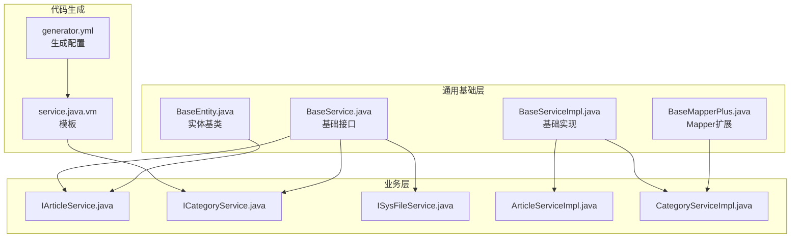
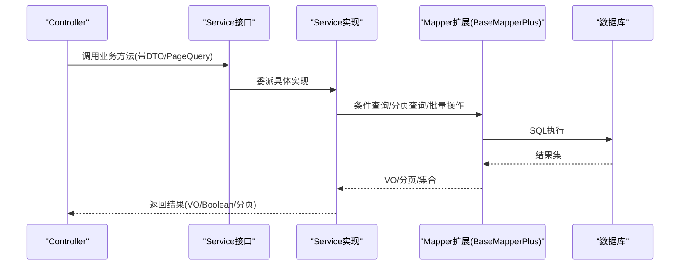
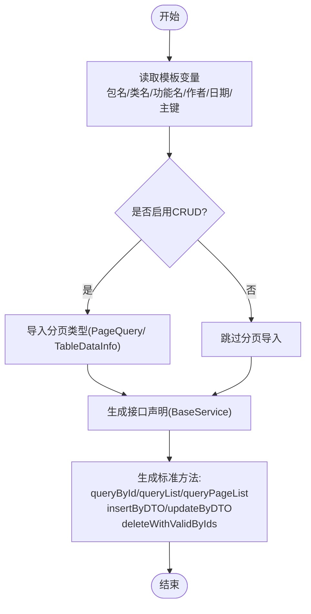
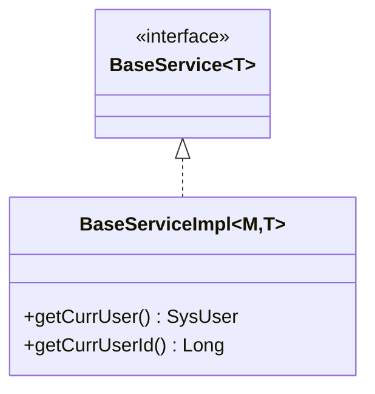
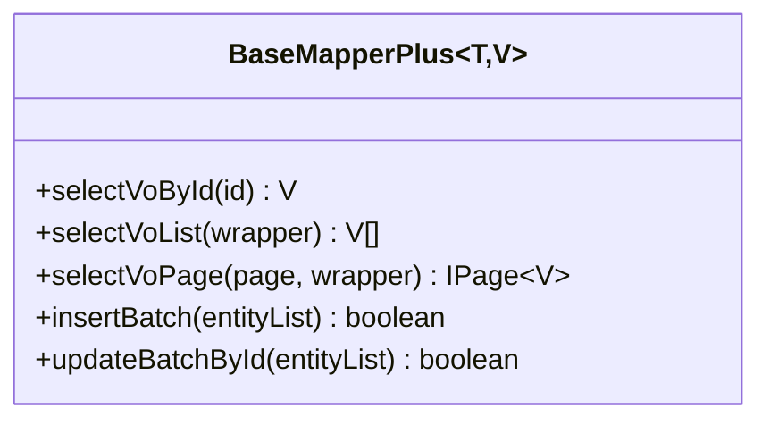
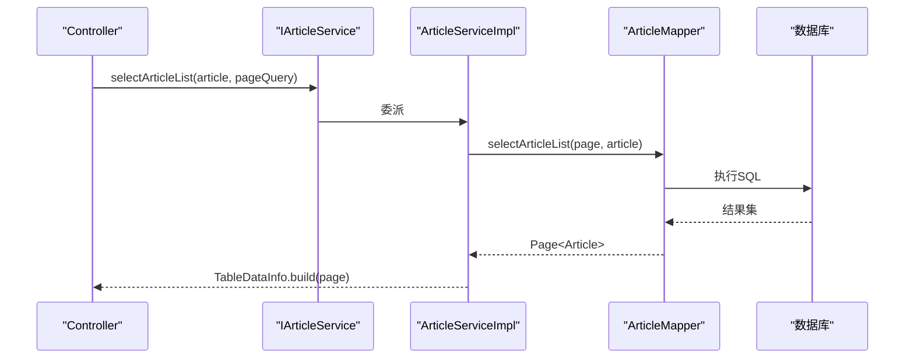
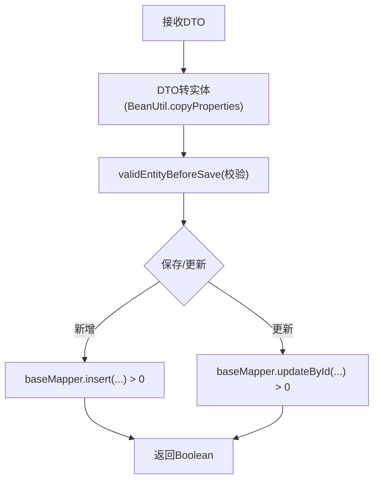
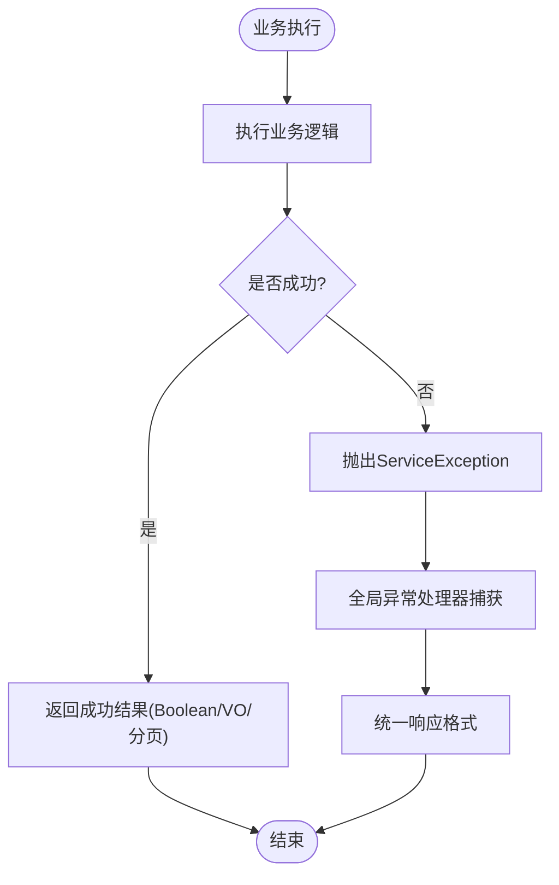
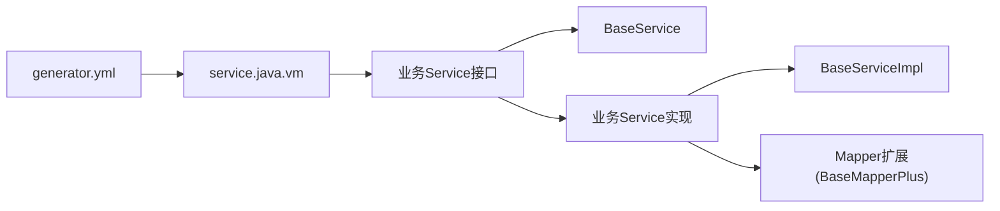

# Service接口模板

<cite>
**本文引用的文件**
- [service.java.vm](file://blog-generator/src/main/resources/vm/java/service.java.vm)
- [BaseService.java](file://blog-common/src/main/java/blog/common/base/service/BaseService.java)
- [BaseServiceImpl.java](file://blog-common/src/main/java/blog/common/base/service/impl/BaseServiceImpl.java)
- [BaseMapperPlus.java](file://blog-common/src/main/java/blog/common/base/mapper/BaseMapperPlus.java)
- [IArticleService.java](file://blog-biz/src/main/java/blog/biz/service/IArticleService.java)
- [ICategoryService.java](file://blog-biz/src/main/java/blog/biz/service/ICategoryService.java)
- [ISysFileService.java](file://blog-biz/src/main/java/blog/biz/service/ISysFileService.java)
- [ArticleServiceImpl.java](file://blog-biz/src/main/java/blog/biz/service/impl/ArticleServiceImpl.java)
- [CategoryServiceImpl.java](file://blog-biz/src/main/java/blog/biz/service/impl/CategoryServiceImpl.java)
- [GenUtils.java](file://blog-generator/src/main/java/blog/generator/util/GenUtils.java)
- [generator.yml](file://blog-generator/src/main/resources/generator.yml)
- [ServiceException.java](file://blog-common/src/main/java/blog/common/exception/ServiceException.java)
- [BaseEntity.java](file://blog-common/src/main/java/blog/common/base/entity/BaseEntity.java)
- [BeanValidators.java](file://blog-common/src/main/java/blog/common/utils/bean/BeanValidators.java)
</cite>

## 目录
1. [简介](#简介)
2. [项目结构](#项目结构)
3. [核心组件](#核心组件)
4. [架构总览](#架构总览)
5. [详细组件分析](#详细组件分析)
6. [依赖分析](#依赖分析)
7. [性能考虑](#性能考虑)
8. [故障排查指南](#故障排查指南)
9. [结论](#结论)
10. [附录](#附录)

## 简介
本文件围绕Service接口模板（service.java.vm）提供系统化技术文档，重点说明：
- Service接口的自动生成规则与模板变量映射
- 业务逻辑接口的标准化定义与BaseService继承关系
- 方法签名设计原则：CRUD、分页查询、条件查询、批量删除等
- 异常处理机制：业务异常与数据异常的抛出规则
- Service与Mapper层协作关系及事务声明方式
- 生成示例：如何基于模板自动生成符合企业开发规范的Service接口与实现

## 项目结构
Service接口模板位于代码生成子模块中，结合通用基础层与业务层接口/实现，形成“模板驱动 + 基础能力 + 业务实现”的完整链路。

图示来源
- [service.java.vm:1-74](file://blog-generator/src/main/resources/vm/java/service.java.vm#L1-L74)
- [generator.yml:1-12](file://blog-generator/src/main/resources/generator.yml#L1-L12)
- [BaseService.java:1-7](file://blog-common/src/main/java/blog/common/base/service/BaseService.java#L1-L7)
- [BaseServiceImpl.java:1-28](file://blog-common/src/main/java/blog/common/base/service/impl/BaseServiceImpl.java#L1-L28)
- [BaseMapperPlus.java:1-335](file://blog-common/src/main/java/blog/common/base/mapper/BaseMapperPlus.java#L1-L335)
- [IArticleService.java:1-64](file://blog-biz/src/main/java/blog/biz/service/IArticleService.java#L1-L64)
- [ICategoryService.java:1-71](file://blog-biz/src/main/java/blog/biz/service/ICategoryService.java#L1-L71)
- [ISysFileService.java:1-75](file://blog-biz/src/main/java/blog/biz/service/ISysFileService.java#L1-L75)
- [ArticleServiceImpl.java:1-95](file://blog-biz/src/main/java/blog/biz/service/impl/ArticleServiceImpl.java#L1-L95)
- [CategoryServiceImpl.java:1-133](file://blog-biz/src/main/java/blog/biz/service/impl/CategoryServiceImpl.java#L1-L133)

章节来源
- [service.java.vm:1-74](file://blog-generator/src/main/resources/vm/java/service.java.vm#L1-L74)
- [generator.yml:1-12](file://blog-generator/src/main/resources/generator.yml#L1-L12)

## 核心组件
- 模板引擎与变量映射
  - 模板文件通过Velocity变量完成包名、类名、功能名、作者、日期、主键列等动态注入，确保生成的接口与业务表强关联。
  - 生成配置（generator.yml）控制作者、包名、自动去前缀策略、表前缀等全局参数。
- 基础Service接口与实现
  - BaseService作为IService的轻量封装，统一对外暴露MyBatis-Plus扩展能力。
  - BaseServiceImpl在通用实现中提供当前登录用户与用户ID的便捷访问，便于业务侧在Service层直接使用。
- Mapper扩展
  - BaseMapperPlus提供VO分页、列表、单条查询与批量操作等增强方法，支撑Service层以VO形式返回，降低Controller层负担。
- 业务Service接口与实现
  - 业务接口遵循统一命名规范；实现类继承通用BaseServiceImpl，复用基础能力并按需扩展。
  - 通过Mapper扩展方法实现分页、条件查询、批量删除等能力。

章节来源
- [BaseService.java:1-7](file://blog-common/src/main/java/blog/common/base/service/BaseService.java#L1-L7)
- [BaseServiceImpl.java:1-28](file://blog-common/src/main/java/blog/common/base/service/impl/BaseServiceImpl.java#L1-L28)
- [BaseMapperPlus.java:1-335](file://blog-common/src/main/java/blog/common/base/mapper/BaseMapperPlus.java#L1-L335)
- [GenUtils.java:1-223](file://blog-generator/src/main/java/blog/generator/util/GenUtils.java#L1-L223)

## 架构总览
Service层在整体分层架构中的职责与交互如下：

图示来源
- [IArticleService.java:14-64](file://blog-biz/src/main/java/blog/biz/service/IArticleService.java#L14-L64)
- [ICategoryService.java:19-71](file://blog-biz/src/main/java/blog/biz/service/ICategoryService.java#L19-L71)
- [ISysFileService.java:21-75](file://blog-biz/src/main/java/blog/biz/service/ISysFileService.java#L21-L75)
- [ArticleServiceImpl.java:22-95](file://blog-biz/src/main/java/blog/biz/service/impl/ArticleServiceImpl.java#L22-L95)
- [CategoryServiceImpl.java:36-133](file://blog-biz/src/main/java/blog/biz/service/impl/CategoryServiceImpl.java#L36-L133)
- [BaseMapperPlus.java:290-335](file://blog-common/src/main/java/blog/common/base/mapper/BaseMapperPlus.java#L290-L335)

## 详细组件分析

### Service接口模板（service.java.vm）
- 自动生成规则
  - 包名、类名、功能名、作者、日期由模板变量注入，类名前缀统一为I，后缀为Service，继承BaseService<T>。
  - 若表具备CRUD能力（由模板变量控制），则引入分页查询所需类型（PageQuery、TableDataInfo）。
  - 主键字段类型与名称来自模板上下文，保证查询主键的方法签名与实体一致。
- 方法签名设计原则
  - 查询：queryById(pk)，返回VO；queryList(DTO)返回列表；queryPageList(DTO, PageQuery)返回分页列表。
  - 新增/修改：insertByDTO(DTO)、updateByDTO(DTO)，返回Boolean表示是否成功。
  - 批量删除：deleteWithValidByIds(Collection<pk>, Boolean)支持可选有效性校验。
- 注释与参数约定
  - 方法注释包含功能描述、参数说明与返回值说明，保持一致性。
  - 参数命名采用DTO风格，便于前后端契约清晰。

图示来源
- [service.java.vm:1-74](file://blog-generator/src/main/resources/vm/java/service.java.vm#L1-L74)

章节来源
- [service.java.vm:1-74](file://blog-generator/src/main/resources/vm/java/service.java.vm#L1-L74)

### BaseService与BaseServiceImpl
- BaseService
  - 作为IService的轻量包装，统一对外能力，便于后续扩展。
- BaseServiceImpl
  - 在通用实现中提供当前登录用户与用户ID的便捷访问，减少重复代码。
  - 可直接复用MyBatis-Plus提供的save、update等能力，简化业务实现。

图示来源
- [BaseService.java:5-6](file://blog-common/src/main/java/blog/common/base/service/BaseService.java#L5-L6)
- [BaseServiceImpl.java:9-27](file://blog-common/src/main/java/blog/common/base/service/impl/BaseServiceImpl.java#L9-L27)

章节来源
- [BaseService.java:1-7](file://blog-common/src/main/java/blog/common/base/service/BaseService.java#L1-L7)
- [BaseServiceImpl.java:1-28](file://blog-common/src/main/java/blog/common/base/service/impl/BaseServiceImpl.java#L1-L28)

### Mapper扩展（BaseMapperPlus）
- 提供VO分页、列表、单条查询与批量操作等增强方法，支撑Service层以VO形式返回，提升接口表现力。
- 支持泛型推断，自动识别实体与VO类型，减少样板代码。

图示来源
- [BaseMapperPlus.java:32-335](file://blog-common/src/main/java/blog/common/base/mapper/BaseMapperPlus.java#L32-L335)

章节来源
- [BaseMapperPlus.java:1-335](file://blog-common/src/main/java/blog/common/base/mapper/BaseMapperPlus.java#L1-L335)

### 业务Service接口与实现示例

#### 示例一：文章（IArticleService）
- 接口方法
  - 查询：selectArticleById(Long)
  - 列表：selectArticleList(Article, PageQuery) -> TableDataInfo<Article>
  - 新增/修改：insertArticle(Article) -> Boolean；updateArticle(Article) -> int
  - 删除：deleteArticleByIds(Long[])、deleteArticleById(Long)
- 实现要点
  - 继承BaseServiceImpl，使用ArticleMapper执行SQL。
  - 新增时设置当前用户ID；修改时设置更新时间。
  - 分页通过Page构建并交由Mapper执行，最终封装为TableDataInfo。

图示来源
- [IArticleService.java:14-64](file://blog-biz/src/main/java/blog/biz/service/IArticleService.java#L14-L64)
- [ArticleServiceImpl.java:44-47](file://blog-biz/src/main/java/blog/biz/service/impl/ArticleServiceImpl.java#L44-L47)

章节来源
- [IArticleService.java:1-64](file://blog-biz/src/main/java/blog/biz/service/IArticleService.java#L1-L64)
- [ArticleServiceImpl.java:1-95](file://blog-biz/src/main/java/blog/biz/service/impl/ArticleServiceImpl.java#L1-L95)

#### 示例二：分类（ICategoryService）
- 接口方法
  - 查询：queryById(Long) -> CategoryVO
  - 列表/分页：queryList(CategoryDTO) -> List<CategoryVO>；queryPageList(CategoryDTO, PageQuery) -> TableDataInfo<CategoryVO>
  - 新增/修改：insertByDTO(CategoryDTO)、updateByDTO(CategoryDTO) -> Boolean
  - 批量删除：deleteWithValidByIds(Collection<Long>, Boolean) -> Boolean
- 实现要点
  - 使用LambdaQueryWrapper构建条件，支持模糊匹配等。
  - 通过BeanUtil复制DTO到实体，调用Mapper执行保存/更新。
  - 分页查询通过selectVoPage返回VO分页。

图示来源
- [ICategoryService.java:19-71](file://blog-biz/src/main/java/blog/biz/service/ICategoryService.java#L19-L71)
- [CategoryServiceImpl.java:92-109](file://blog-biz/src/main/java/blog/biz/service/impl/CategoryServiceImpl.java#L92-L109)

章节来源
- [ICategoryService.java:1-71](file://blog-biz/src/main/java/blog/biz/service/ICategoryService.java#L1-L71)
- [CategoryServiceImpl.java:1-133](file://blog-biz/src/main/java/blog/biz/service/impl/CategoryServiceImpl.java#L1-L133)

#### 示例三：文件（ISysFileService）
- 接口方法
  - 基础CRUD与分类类似，新增uploadFile(MultipartFile, UploadFileDTO) -> SysFileVO，支持文件上传场景。
- 实现要点
  - 与分类类似，使用DTO/VO分离，分页与条件查询通过Mapper扩展实现。

章节来源
- [ISysFileService.java:1-75](file://blog-biz/src/main/java/blog/biz/service/ISysFileService.java#L1-L75)

### 异常处理机制
- 业务异常（ServiceException）
  - 用于表达业务层面的错误，包含消息与可选错误码，便于前端统一处理。
- 全局异常（GlobalException）
  - 用于框架级异常捕获与统一响应。
- 参数校验异常（ConstraintViolationException）
  - 通过BeanValidators对DTO进行校验，未通过时抛出参数校验异常，由全局异常处理器拦截。

图示来源
- [ServiceException.java:8-65](file://blog-common/src/main/java/blog/common/exception/ServiceException.java#L8-L65)
- [BeanValidators.java:15-22](file://blog-common/src/main/java/blog/common/utils/bean/BeanValidators.java#L15-L22)

章节来源
- [ServiceException.java:1-65](file://blog-common/src/main/java/blog/common/exception/ServiceException.java#L1-L65)
- [BeanValidators.java:1-22](file://blog-common/src/main/java/blog/common/utils/bean/BeanValidators.java#L1-L22)

### 事务管理声明方式
- 当前实现未显式使用@Transactional注解，事务管理通常由Spring容器在Service层自动传播。
- 若业务涉及多表写入或强一致性需求，建议在Service方法上添加@Transactional，确保原子性。
- 生成模板未内置事务注解，可在生成后手动补充或扩展模板以支持事务声明。

章节来源
- [ArticleServiceImpl.java:22-95](file://blog-biz/src/main/java/blog/biz/service/impl/ArticleServiceImpl.java#L22-L95)
- [CategoryServiceImpl.java:36-133](file://blog-biz/src/main/java/blog/biz/service/impl/CategoryServiceImpl.java#L36-L133)

## 依赖分析
- 模板到接口/实现的依赖
  - service.java.vm依赖生成配置与表元数据，生成业务Service接口与实现。
- 接口到基础层的依赖
  - 业务Service接口统一继承BaseService<T>，实现类继承BaseServiceImpl<M, T>。
- Mapper扩展依赖
  - 业务实现通过Mapper扩展方法（如selectVoPage）返回VO分页，减少重复封装。
- 配置依赖
  - generator.yml提供作者、包名、表前缀等全局配置，影响类名与包名生成。

图示来源
- [generator.yml:1-12](file://blog-generator/src/main/resources/generator.yml#L1-L12)
- [service.java.vm:1-74](file://blog-generator/src/main/resources/vm/java/service.java.vm#L1-L74)
- [BaseService.java:5-6](file://blog-common/src/main/java/blog/common/base/service/BaseService.java#L5-L6)
- [BaseServiceImpl.java:9-27](file://blog-common/src/main/java/blog/common/base/service/impl/BaseServiceImpl.java#L9-L27)
- [BaseMapperPlus.java:32-335](file://blog-common/src/main/java/blog/common/base/mapper/BaseMapperPlus.java#L32-L335)

章节来源
- [GenUtils.java:1-223](file://blog-generator/src/main/java/blog/generator/util/GenUtils.java#L1-L223)

## 性能考虑
- 分页查询
  - 使用PageQuery构建分页参数，Mapper扩展提供selectVoPage，避免一次性加载全量数据。
- 批量操作
  - BaseMapperPlus提供批量插入/更新能力，减少网络往返与循环开销。
- DTO/VO分离
  - 通过Mapper扩展将实体转换为VO，避免在接口层暴露持久化细节，降低序列化成本。
- 参数校验前置
  - 在Service层或Controller层使用BeanValidators进行参数校验，尽早失败，减少无效调用。

章节来源
- [BaseMapperPlus.java:69-124](file://blog-common/src/main/java/blog/common/base/mapper/BaseMapperPlus.java#L69-L124)
- [CategoryServiceImpl.java:77-83](file://blog-biz/src/main/java/blog/biz/service/impl/CategoryServiceImpl.java#L77-L83)
- [BeanValidators.java:15-22](file://blog-common/src/main/java/blog/common/utils/bean/BeanValidators.java#L15-L22)

## 故障排查指南
- 生成类名/包名不正确
  - 检查generator.yml中的author、packageName、tablePrefix与autoRemovePre配置。
  - 确认表名与业务名转换规则是否符合预期。
- 分页查询结果为空
  - 确认PageQuery构建是否正确，Mapper扩展方法是否传入正确的分页参数。
- DTO校验失败
  - 检查DTO字段注解与校验分组，确保BeanValidators在调用前执行。
- 业务异常未被捕获
  - 确认Service层抛出的是ServiceException，且全局异常处理器已注册。

章节来源
- [generator.yml:1-12](file://blog-generator/src/main/resources/generator.yml#L1-L12)
- [GenUtils.java:144-148](file://blog-generator/src/main/java/blog/generator/util/GenUtils.java#L144-L148)
- [CategoryServiceImpl.java:114-116](file://blog-biz/src/main/java/blog/biz/service/impl/CategoryServiceImpl.java#L114-L116)
- [ServiceException.java:8-65](file://blog-common/src/main/java/blog/common/exception/ServiceException.java#L8-L65)

## 结论
Service接口模板通过Velocity变量与生成配置，实现了面向业务表的标准化接口生成。结合BaseService/BaseServiceImpl与Mapper扩展，Service层在保持简洁的同时具备强大的CRUD、分页与批量操作能力。配合参数校验与业务异常处理，能够满足企业级开发对一致性、可维护性与可扩展性的要求。建议在需要强一致性的场景中补充事务声明，并持续完善模板以适配更多业务场景。

## 附录
- 生成配置参考
  - 作者、包名、表前缀、自动去前缀、是否允许覆盖等。
- 实体基类
  - BaseEntity提供统一的创建/更新字段与参数容器，便于审计与扩展。

章节来源
- [generator.yml:1-12](file://blog-generator/src/main/resources/generator.yml#L1-L12)
- [BaseEntity.java:1-85](file://blog-common/src/main/java/blog/common/base/entity/BaseEntity.java#L1-L85)