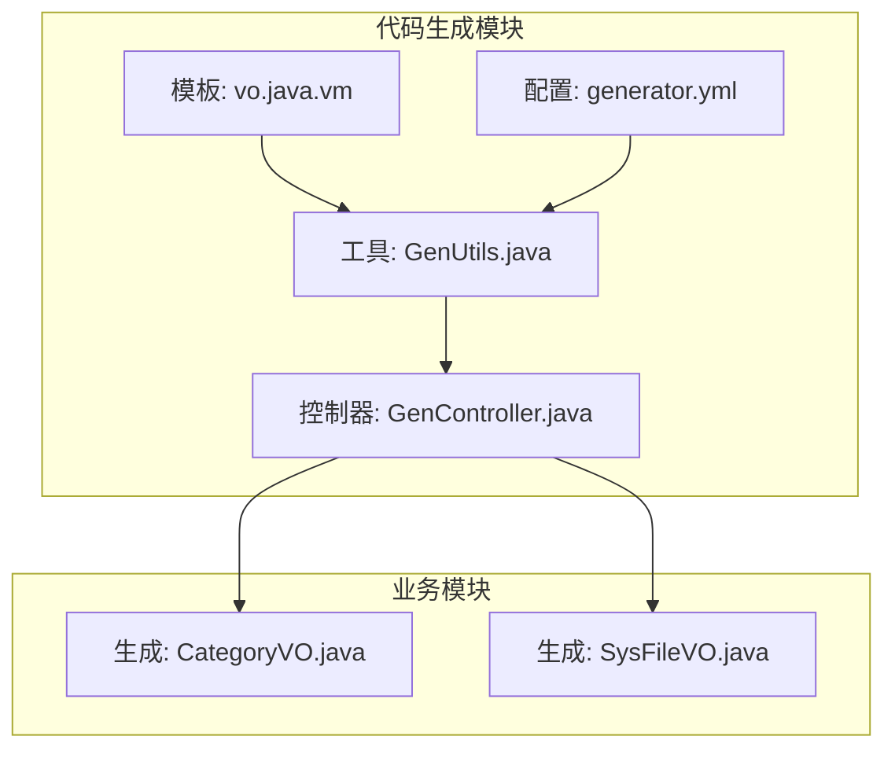
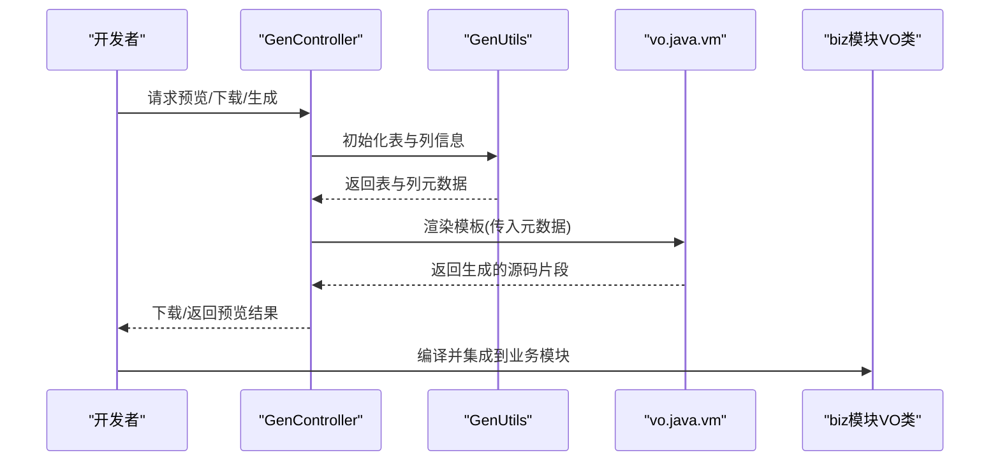
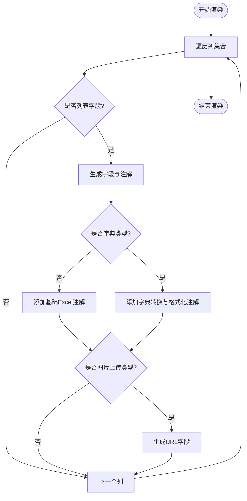
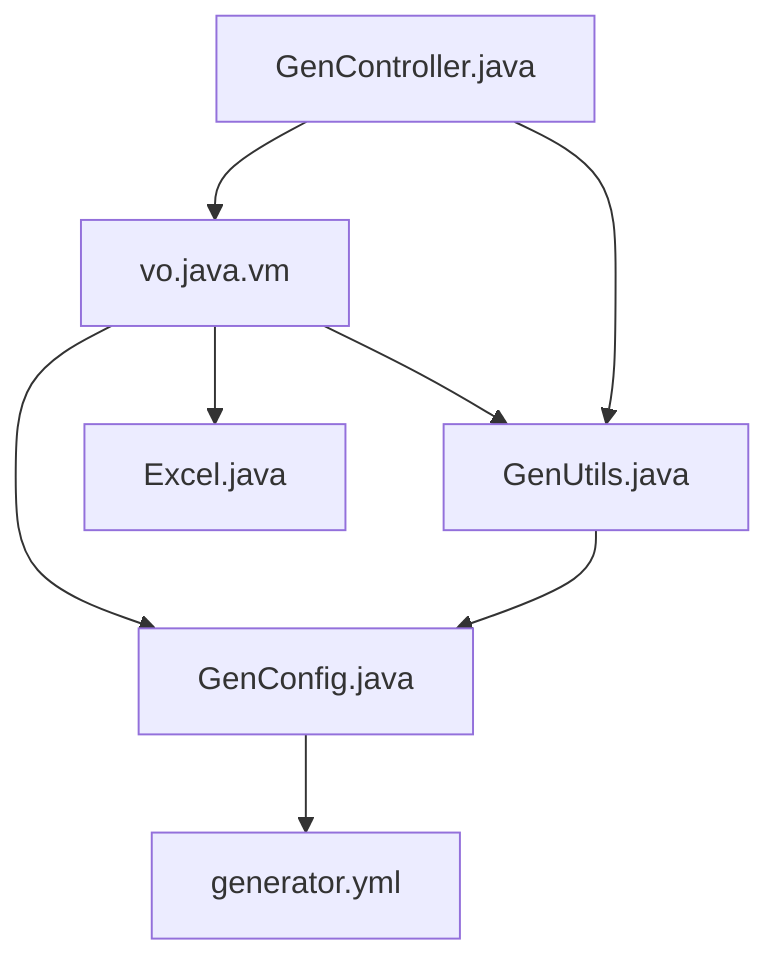

# VO模板

<cite>
**本文引用的文件**
- [vo.java.vm](file://blog-generator/src/main/resources/vm/java/vo.java.vm)
- [CategoryVO.java](file://blog-biz/src/main/java/blog/biz/domain/vo/CategoryVO.java)
- [SysFileVO.java](file://blog-biz/src/main/java/blog/biz/domain/vo/SysFileVO.java)
- [GenUtils.java](file://blog-generator/src/main/java/blog/generator/util/GenUtils.java)
- [GenController.java](file://blog-generator/src/main/java/blog/generator/controller/GenController.java)
- [GenConfig.java](file://blog-generator/src/main/java/blog/generator/config/GenConfig.java)
- [GenConstants.java](file://blog-common/src/main/java/blog/common/constant/GenConstants.java)
- [generator.yml](file://blog-generator/src/main/resources/generator.yml)
- [Excel.java](file://blog-common/src/main/java/blog/common/annotation/Excel.java)
</cite>

## 目录
1. [引言](#引言)
2. [项目结构](#项目结构)
3. [核心组件](#核心组件)
4. [架构总览](#架构总览)
5. [详细组件分析](#详细组件分析)
6. [依赖分析](#依赖分析)
7. [性能考虑](#性能考虑)
8. [故障排查指南](#故障排查指南)
9. [结论](#结论)
10. [附录](#附录)

## 引言
本文件围绕VO模板（vo.java.vm）展开，系统性阐述视图对象（VO）的自动生成机制与设计理念，明确其在前后端分离架构中的职责边界，对比VO与DTO的差异及适用场景，并详解字段组合规则、计算字段生成策略、以及与Excel导出注解的协同工作方式。通过实际生成示例，帮助读者理解如何基于模板自动生成满足前端渲染与导出需求的视图对象。

## 项目结构
本项目采用多模块结构，其中VO模板位于代码生成模块中，最终生成的VO类位于业务模块。关键位置如下：
- 代码生成模板：blog-generator/src/main/resources/vm/java/vo.java.vm
- 生成的VO示例：blog-biz/src/main/java/blog/biz/domain/vo/*.java
- 代码生成工具与配置：blog-generator/* 与 generator.yml
- 通用注解（Excel导出）：blog-common/src/main/java/blog/common/annotation/Excel.java

图表来源
- [vo.java.vm:1-63](file://blog-generator/src/main/resources/vm/java/vo.java.vm#L1-L63)
- [GenUtils.java:1-223](file://blog-generator/src/main/java/blog/generator/util/GenUtils.java#L1-L223)
- [GenController.java:1-242](file://blog-generator/src/main/java/blog/generator/controller/GenController.java#L1-L242)
- [generator.yml:1-12](file://blog-generator/src/main/resources/generator.yml#L1-L12)
- [CategoryVO.java:1-42](file://blog-biz/src/main/java/blog/biz/domain/vo/CategoryVO.java#L1-L42)
- [SysFileVO.java:1-114](file://blog-biz/src/main/java/blog/biz/domain/vo/SysFileVO.java#L1-L114)

章节来源
- [vo.java.vm:1-63](file://blog-generator/src/main/resources/vm/java/vo.java.vm#L1-L63)
- [GenController.java:176-205](file://blog-generator/src/main/java/blog/generator/controller/GenController.java#L176-L205)
- [generator.yml:1-12](file://blog-generator/src/main/resources/generator.yml#L1-L12)

## 核心组件
- VO模板引擎：基于Velocity模板引擎，通过占位符注入表元数据、注释、HTML类型、字典类型等信息，生成VO类。
- 代码生成工具：负责表与列的初始化、命名转换、HTML类型推断、字段权限标记等。
- 生成配置：集中管理作者、包名、表前缀、是否允许覆盖等全局参数。
- 生成控制器：提供预览、下载、批量生成、同步数据库等接口。
- 通用注解：Excel注解用于导出时的字段标注、字典转换、格式化等。

章节来源
- [vo.java.vm:17-62](file://blog-generator/src/main/resources/vm/java/vo.java.vm#L17-L62)
- [GenUtils.java:35-113](file://blog-generator/src/main/java/blog/generator/util/GenUtils.java#L35-L113)
- [GenConfig.java:16-86](file://blog-generator/src/main/java/blog/generator/config/GenConfig.java#L16-L86)
- [GenController.java:176-205](file://blog-generator/src/main/java/blog/generator/controller/GenController.java#L176-L205)
- [Excel.java:20-191](file://blog-common/src/main/java/blog/common/annotation/Excel.java#L20-L191)

## 架构总览
VO模板生成的整体流程如下：
- 读取数据库表结构与注释，结合配置进行命名与类型推断。
- 使用模板渲染生成VO类源码，注入字段注解（含Excel导出、字典转换、时间格式化等）。
- 通过生成接口下载或直接写入本地，形成可编译的VO类。

图表来源
- [GenController.java:176-205](file://blog-generator/src/main/java/blog/generator/controller/GenController.java#L176-L205)
- [GenUtils.java:21-113](file://blog-generator/src/main/java/blog/generator/util/GenUtils.java#L21-L113)
- [vo.java.vm:30-62](file://blog-generator/src/main/resources/vm/java/vo.java.vm#L30-L62)

## 详细组件分析

### VO模板设计与字段生成规则
- 包与导入：模板固定生成VO包路径与常用导入，同时引入当前实体类与Excel注解支持。
- 字段循环：遍历列集合，按列的列表可见性生成字段与注解。
- 字段注解策略：
  - 字典类型：当存在字典类型或括号表达式时，使用字典转换注解与格式化注解。
  - 图片上传：针对特定HTML类型，额外生成URL字段，便于前端直接渲染。
  - 其他字段：使用基础Excel注解，保留注释与字段类型。
- 字段命名：基于列名转换为驼峰命名，确保Java字段规范。

图表来源
- [vo.java.vm:30-62](file://blog-generator/src/main/resources/vm/java/vo.java.vm#L30-L62)

章节来源
- [vo.java.vm:1-63](file://blog-generator/src/main/resources/vm/java/vo.java.vm#L1-L63)

### 字段组合规则与复合数据结构
- 来源与合并：模板通过列集合驱动字段生成，体现“多实体关联数据合并”的能力。例如SysFileVO中包含文件名、后缀、类型、大小、桶名、对象名、访问URL、业务类型与ID等字段，构成前端展示所需的复合数据结构。
- 列表可见性：仅对列表字段生成注解，避免冗余字段进入视图层。
- 字段类型与格式：根据数据库类型推断Java类型与HTML控件类型，保证前后端一致的交互体验。

章节来源
- [SysFileVO.java:33-111](file://blog-biz/src/main/java/blog/biz/domain/vo/SysFileVO.java#L33-L111)
- [GenUtils.java:46-113](file://blog-generator/src/main/java/blog/generator/util/GenUtils.java#L46-L113)

### 计算字段生成与格式化处理
- 派生属性：图片上传类型的字段会自动生成URL派生字段，便于前端直接渲染图片链接。
- 格式化字段：通过Excel注解的字典类型与表达式，实现状态、性别等枚举值的标签化展示。
- 时间格式化：在VO中使用JSON序列化注解统一时间格式，确保前端解析一致性。

章节来源
- [vo.java.vm:52-58](file://blog-generator/src/main/resources/vm/java/vo.java.vm#L52-L58)
- [Excel.java:20-191](file://blog-common/src/main/java/blog/common/annotation/Excel.java#L20-L191)
- [CategoryVO.java:37-39](file://blog-biz/src/main/java/blog/biz/domain/vo/CategoryVO.java#L37-L39)

### VO与DTO的区别及应用场景
- VO（视图对象）：面向前端展示，强调字段组合、格式化与派生属性，便于直接渲染。适合API响应封装与导出。
- DTO（数据传输对象）：面向服务间通信，强调数据聚合与传输效率，通常不包含前端渲染所需的复杂格式化逻辑。
- 应用场景：VO用于对外输出与导出；DTO用于内部服务调用与持久化映射。

（本节为概念性说明，不直接分析具体文件）

### 前后端分离中的作用
- API响应封装：VO作为API响应体，承载前端渲染所需的所有字段与格式化结果。
- 导出能力：结合Excel注解，VO可直接参与导出，实现“所见即所得”的导出效果。
- 数据一致性：通过统一的注解与格式化策略，减少前后端对数据格式的分歧。

（本节为概念性说明，不直接分析具体文件）

### 实际生成示例（以Category与SysFile为例）
- CategoryVO：包含分类ID、名称、创建人、创建时间等字段，注解用于导出与时间格式化。
- SysFileVO：包含文件原始名、后缀、类型、大小、桶名、对象名、访问URL、业务类型与ID、公开与删除状态、创建人与时间等字段，形成完整的文件信息视图。

章节来源
- [CategoryVO.java:13-41](file://blog-biz/src/main/java/blog/biz/domain/vo/CategoryVO.java#L13-L41)
- [SysFileVO.java:28-113](file://blog-biz/src/main/java/blog/biz/domain/vo/SysFileVO.java#L28-L113)

## 依赖分析
- 模板依赖：vo.java.vm依赖Velocity上下文变量（如导入列表、类名、列集合、作者、时间等）。
- 工具链依赖：GenUtils负责表与列的初始化、命名转换、HTML类型推断与权限标记。
- 配置依赖：generator.yml提供作者、包名、表前缀、覆盖策略等全局参数。
- 注解依赖：Excel注解贯穿字段注解生成与导出处理。

图表来源
- [vo.java.vm:3-9](file://blog-generator/src/main/resources/vm/java/vo.java.vm#L3-L9)
- [GenConfig.java:16-86](file://blog-generator/src/main/java/blog/generator/config/GenConfig.java#L16-L86)
- [GenUtils.java:17-30](file://blog-generator/src/main/java/blog/generator/util/GenUtils.java#L17-L30)
- [Excel.java:20-191](file://blog-common/src/main/java/blog/common/annotation/Excel.java#L20-L191)
- [generator.yml:1-12](file://blog-generator/src/main/resources/generator.yml#L1-L12)
- [GenController.java:176-205](file://blog-generator/src/main/java/blog/generator/controller/GenController.java#L176-L205)

章节来源
- [GenConstants.java:1-187](file://blog-common/src/main/java/blog/common/constant/GenConstants.java#L1-L187)

## 性能考虑
- 模板渲染：列数量较多时，建议控制列表字段数量，减少不必要的注解生成。
- 导出性能：字典转换与图片处理可能带来额外开销，建议在导出场景中启用必要的缓存与批处理策略。
- 序列化：统一的时间格式化与长整型序列化有助于减少前端解析成本。

（本节为一般性指导，不直接分析具体文件）

## 故障排查指南
- 生成失败：检查生成配置（作者、包名、表前缀、覆盖策略）与数据库表结构是否匹配。
- 字段缺失：确认列的列表可见性标记与HTML类型推断是否正确。
- 导出异常：核对Excel注解的字典类型与表达式是否与字典表一致。
- 接口权限：确保生成接口具备相应权限，避免因鉴权导致无法预览或下载。

章节来源
- [GenController.java:58-80](file://blog-generator/src/main/java/blog/generator/controller/GenController.java#L58-L80)
- [GenController.java:176-205](file://blog-generator/src/main/java/blog/generator/controller/GenController.java#L176-L205)
- [generator.yml:1-12](file://blog-generator/src/main/resources/generator.yml#L1-L12)

## 结论
VO模板通过标准化的字段生成规则与注解策略，实现了面向前端展示的视图对象自动生成。结合字典转换、时间格式化与图片URL派生等机制，有效支撑了API响应封装与导出场景。配合代码生成工具与配置，可快速产出高质量、可维护的VO类，降低前后端协作成本。

## 附录
- 生成入口：通过生成控制器提供的预览、下载、批量生成等接口完成代码生成。
- 模板扩展：可在模板中增加更多注解与字段生成逻辑，以适配更复杂的展示需求。

章节来源
- [GenController.java:176-205](file://blog-generator/src/main/java/blog/generator/controller/GenController.java#L176-L205)
- [vo.java.vm:17-62](file://blog-generator/src/main/resources/vm/java/vo.java.vm#L17-L62)