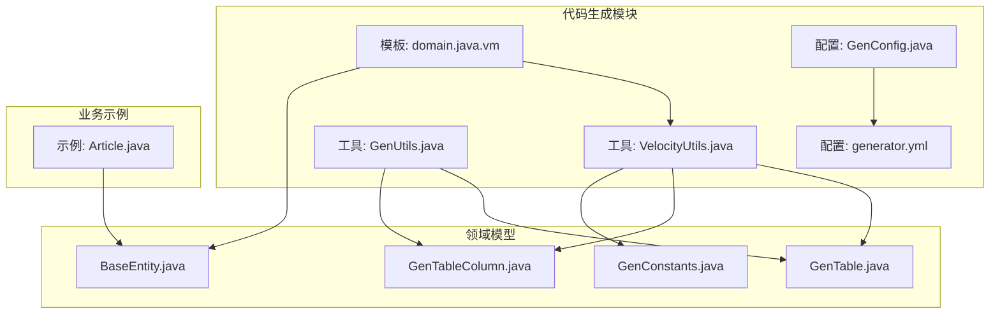
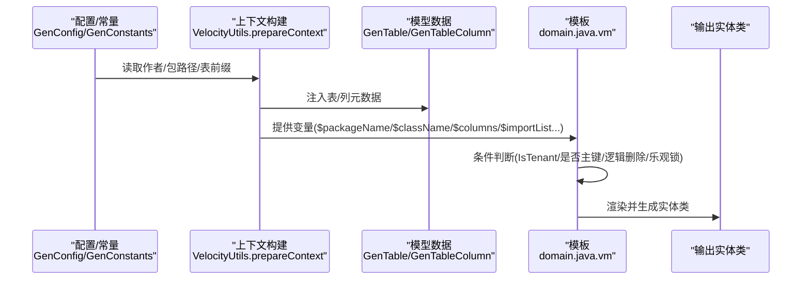
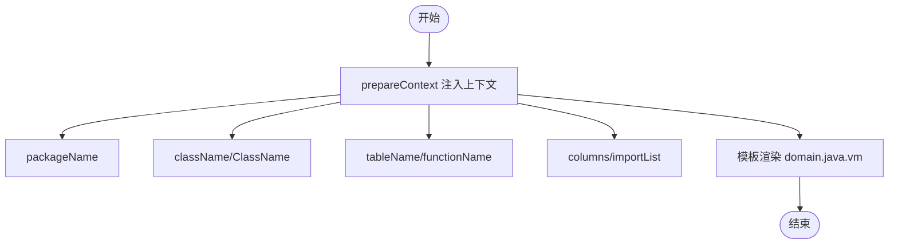
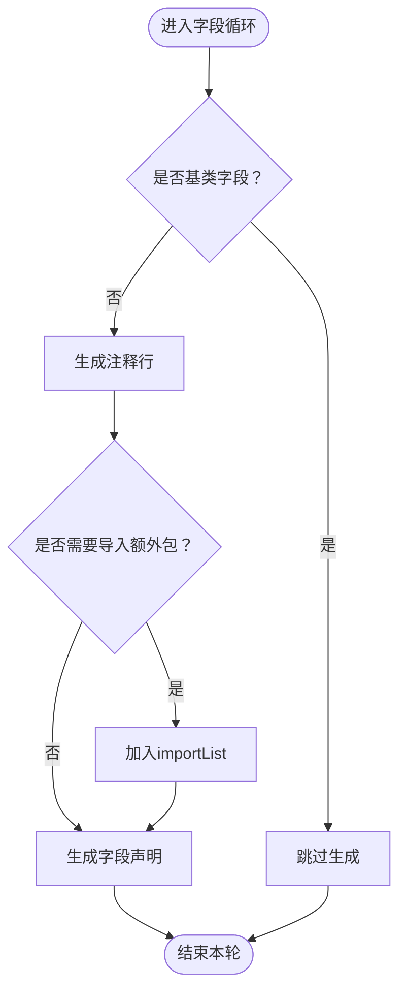
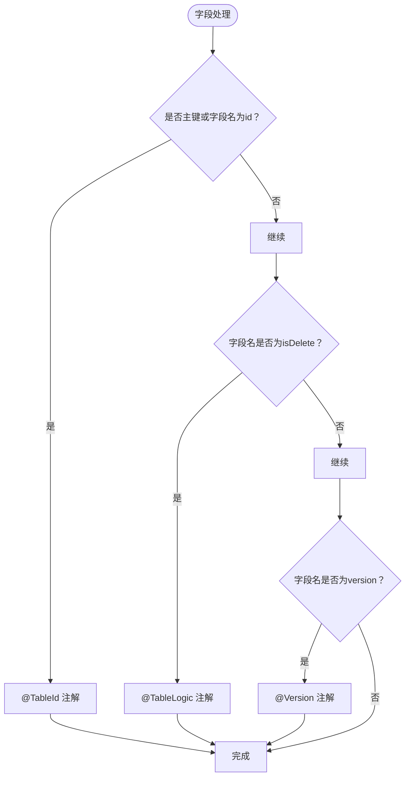
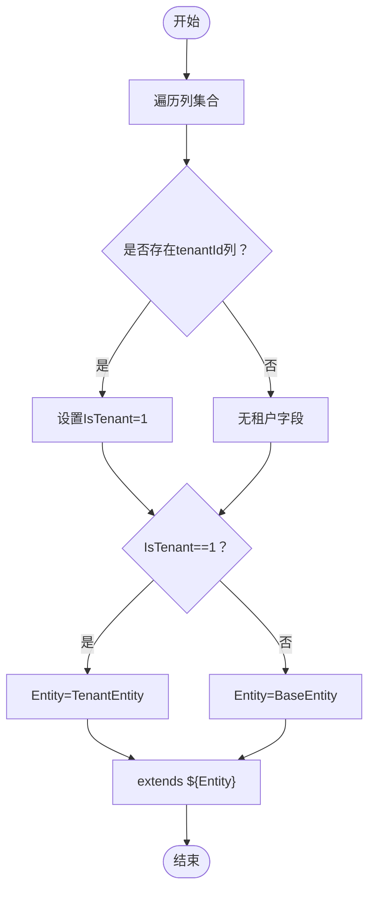
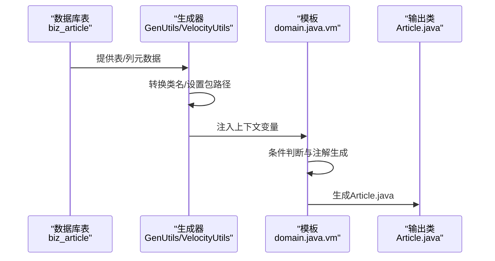
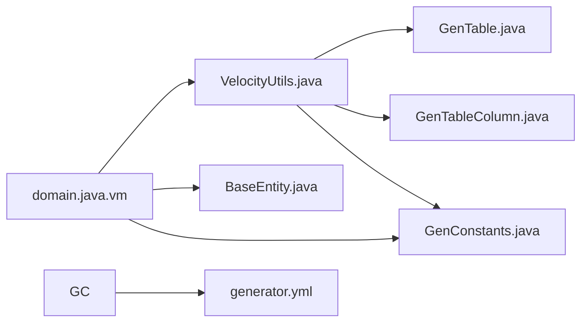

# 实体类模板

<cite>
**本文引用的文件**
- [domain.java.vm](file://blog-generator/src/main/resources/vm/java/domain.java.vm)
- [VelocityUtils.java](file://blog-generator/src/main/java/blog/generator/util/VelocityUtils.java)
- [GenUtils.java](file://blog-generator/src/main/java/blog/generator/util/GenUtils.java)
- [GenTable.java](file://blog-generator/src/main/java/blog/generator/domain/GenTable.java)
- [GenTableColumn.java](file://blog-generator/src/main/java/blog/generator/domain/GenTableColumn.java)
- [BaseEntity.java](file://blog-common/src/main/java/blog/common/base/entity/BaseEntity.java)
- [GenConstants.java](file://blog-common/src/main/java/blog/common/constant/GenConstants.java)
- [GenConfig.java](file://blog-generator/src/main/java/blog/generator/config/GenConfig.java)
- [generator.yml](file://blog-generator/src/main/resources/generator.yml)
- [Article.java](file://blog-biz/src/main/java/blog/biz/domain/Article.java)
</cite>

## 目录
1. [简介](#简介)
2. [项目结构](#项目结构)
3. [核心组件](#核心组件)
4. [架构总览](#架构总览)
5. [详细组件分析](#详细组件分析)
6. [依赖关系分析](#依赖关系分析)
7. [性能考量](#性能考量)
8. [故障排查指南](#故障排查指南)
9. [结论](#结论)
10. [附录](#附录)

## 简介
本文件围绕实体类模板(domain.java.vm)进行深入技术解析，涵盖以下主题：
- 模板生成机制与MyBatis-Plus注解的自动添加策略（@TableName、@TableId、@TableLogic、@Version等）
- 字段映射规则与注释生成
- 租户ID与逻辑删除字段的特殊处理逻辑
- 模板关键变量的使用方法（$packageName、$className、$tableName、$columns、$importList等）
- 继承BaseEntity或TenantEntity的选择逻辑及动态继承实现
- 从数据库表到Java实体类的完整生成示例流程

## 项目结构
实体类模板位于代码生成模块中，结合Velocity上下文变量与通用常量、工具类共同完成实体类的自动化生成。

**图表来源**
- [domain.java.vm:1-56](file://blog-generator/src/main/resources/vm/java/domain.java.vm#L1-L56)
- [VelocityUtils.java:43-77](file://blog-generator/src/main/java/blog/generator/util/VelocityUtils.java#L43-L77)
- [GenUtils.java:21-30](file://blog-generator/src/main/java/blog/generator/util/GenUtils.java#L21-L30)
- [GenTable.java:20-23](file://blog-generator/src/main/java/blog/generator/domain/GenTable.java#L20-L23)
- [GenTableColumn.java:12-13](file://blog-generator/src/main/java/blog/generator/domain/GenTableColumn.java#L12-L13)
- [BaseEntity.java:21-22](file://blog-common/src/main/java/blog/common/base/entity/BaseEntity.java#L21-L22)
- [GenConstants.java:8-186](file://blog-common/src/main/java/blog/common/constant/GenConstants.java#L8-L186)
- [GenConfig.java:13-86](file://blog-generator/src/main/java/blog/generator/config/GenConfig.java#L13-L86)
- [generator.yml:1-12](file://blog-generator/src/main/resources/generator.yml#L1-L12)
- [Article.java:1-95](file://blog-biz/src/main/java/blog/biz/domain/Article.java#L1-L95)

**章节来源**
- [domain.java.vm:1-56](file://blog-generator/src/main/resources/vm/java/domain.java.vm#L1-L56)
- [VelocityUtils.java:43-77](file://blog-generator/src/main/java/blog/generator/util/VelocityUtils.java#L43-L77)
- [GenUtils.java:21-30](file://blog-generator/src/main/java/blog/generator/util/GenUtils.java#L21-L30)
- [GenTable.java:20-23](file://blog-generator/src/main/java/blog/generator/domain/GenTable.java#L20-L23)
- [GenTableColumn.java:12-13](file://blog-generator/src/main/java/blog/generator/domain/GenTableColumn.java#L12-L13)
- [BaseEntity.java:21-22](file://blog-common/src/main/java/blog/common/base/entity/BaseEntity.java#L21-L22)
- [GenConstants.java:8-186](file://blog-common/src/main/java/blog/common/constant/GenConstants.java#L8-L186)
- [GenConfig.java:13-86](file://blog-generator/src/main/java/blog/generator/config/GenConfig.java#L13-L86)
- [generator.yml:1-12](file://blog-generator/src/main/resources/generator.yml#L1-L12)
- [Article.java:1-95](file://blog-biz/src/main/java/blog/biz/domain/Article.java#L1-L95)

## 核心组件
- 模板引擎与上下文构建：VelocityUtils.prepareContext负责将GenTable、GenTableColumn等数据注入到Velocity上下文中，并设置模板变量（如$packageName、$className、$tableName、$columns、$importList等）。
- 业务表与列模型：GenTable与GenTableColumn承载数据库表与列元数据，提供字段类型、注释、是否主键、是否查询等属性。
- 基类与常量：BaseEntity提供统一的审计字段；GenConstants定义模板类别、HTML控件类型、Java类型映射、查询方式等常量。
- 配置与生成入口：GenConfig与generator.yml提供作者、包路径、表前缀等生成配置；GenUtils负责表名转类名、列属性初始化等。

**章节来源**
- [VelocityUtils.java:43-77](file://blog-generator/src/main/java/blog/generator/util/VelocityUtils.java#L43-L77)
- [GenTable.java:20-23](file://blog-generator/src/main/java/blog/generator/domain/GenTable.java#L20-L23)
- [GenTableColumn.java:12-13](file://blog-generator/src/main/java/blog/generator/domain/GenTableColumn.java#L12-L13)
- [BaseEntity.java:21-22](file://blog-common/src/main/java/blog/common/base/entity/BaseEntity.java#L21-L22)
- [GenConstants.java:8-186](file://blog-common/src/main/java/blog/common/constant/GenConstants.java#L8-L186)
- [GenConfig.java:13-86](file://blog-generator/src/main/java/blog/generator/config/GenConfig.java#L13-L86)
- [generator.yml:1-12](file://blog-generator/src/main/resources/generator.yml#L1-L12)
- [GenUtils.java:21-30](file://blog-generator/src/main/java/blog/generator/util/GenUtils.java#L21-L30)

## 架构总览
实体类模板的生成流程由“配置与上下文准备”“模板渲染”“注解与字段映射”“继承选择”四个阶段构成。

**图表来源**
- [GenConfig.java:13-86](file://blog-generator/src/main/java/blog/generator/config/GenConfig.java#L13-L86)
- [generator.yml:1-12](file://blog-generator/src/main/resources/generator.yml#L1-L12)
- [VelocityUtils.java:43-77](file://blog-generator/src/main/java/blog/generator/util/VelocityUtils.java#L43-L77)
- [GenTable.java:20-23](file://blog-generator/src/main/java/blog/generator/domain/GenTable.java#L20-L23)
- [GenTableColumn.java:12-13](file://blog-generator/src/main/java/blog/generator/domain/GenTableColumn.java#L12-L13)
- [domain.java.vm:1-56](file://blog-generator/src/main/resources/vm/java/domain.java.vm#L1-L56)

## 详细组件分析

### 模板变量与上下文注入
- 变量来源：VelocityUtils.prepareContext将GenTable的关键字段注入到Velocity上下文，包括表名、类名、模块名、业务名、包名、作者、生成时间、列集合、导入包列表、权限前缀等。
- 变量使用：模板通过${...}语法直接引用这些变量，如${packageName}、${className}、${ClassName}、${tableName}、${columns}、${importList}等。

**图表来源**
- [VelocityUtils.java:43-77](file://blog-generator/src/main/java/blog/generator/util/VelocityUtils.java#L43-L77)
- [domain.java.vm:1-16](file://blog-generator/src/main/resources/vm/java/domain.java.vm#L1-L16)

**章节来源**
- [VelocityUtils.java:43-77](file://blog-generator/src/main/java/blog/generator/util/VelocityUtils.java#L43-L77)
- [domain.java.vm:1-16](file://blog-generator/src/main/resources/vm/java/domain.java.vm#L1-L16)

### 字段映射与注释生成
- 字段遍历：模板对$columns进行迭代，跳过基类字段（通过$table.isSuperColumn判断）。
- 注释生成：每个字段上方生成注释行，内容来自列注释（$column.columnComment）。
- 类型与导入：根据列Java类型动态导入所需包（如Date、BigDecimal、JsonFormat等），由VelocityUtils.getImportList决定。

**图表来源**
- [domain.java.vm:34-54](file://blog-generator/src/main/resources/vm/java/domain.java.vm#L34-L54)
- [VelocityUtils.java:226-242](file://blog-generator/src/main/java/blog/generator/util/VelocityUtils.java#L226-L242)
- [GenTableColumn.java:310-329](file://blog-generator/src/main/java/blog/generator/domain/GenTableColumn.java#L310-L329)

**章节来源**
- [domain.java.vm:34-54](file://blog-generator/src/main/resources/vm/java/domain.java.vm#L34-L54)
- [VelocityUtils.java:226-242](file://blog-generator/src/main/java/blog/generator/util/VelocityUtils.java#L226-L242)
- [GenTableColumn.java:310-329](file://blog-generator/src/main/java/blog/generator/domain/GenTableColumn.java#L310-L329)

### MyBatis-Plus注解自动添加
- 表名映射：@TableName绑定数据库表名。
- 主键识别：当列是主键或字段名为id时，添加@TableId注解。
- 逻辑删除：当字段名为isDelete时，添加@TableLogic注解。
- 乐观锁版本：当字段名为version时，添加@Version注解。

**图表来源**
- [domain.java.vm:39-50](file://blog-generator/src/main/resources/vm/java/domain.java.vm#L39-L50)

**章节来源**
- [domain.java.vm:39-50](file://blog-generator/src/main/resources/vm/java/domain.java.vm#L39-L50)

### 继承选择逻辑与动态继承
- 租户字段检测：遍历列集合，若存在javaField为tenantId，则设置IsTenant标志。
- 动态继承：根据IsTenant的值，选择继承TenantEntity或BaseEntity；最终通过${Entity}变量在模板中动态扩展类声明。

**图表来源**
- [domain.java.vm:3-7](file://blog-generator/src/main/resources/vm/java/domain.java.vm#L3-L7)
- [domain.java.vm:24-28](file://blog-generator/src/main/resources/vm/java/domain.java.vm#L24-L28)
- [domain.java.vm](file://blog-generator/src/main/resources/vm/java/domain.java.vm#L32)

**章节来源**
- [domain.java.vm:3-7](file://blog-generator/src/main/resources/vm/java/domain.java.vm#L3-L7)
- [domain.java.vm:24-28](file://blog-generator/src/main/resources/vm/java/domain.java.vm#L24-L28)
- [domain.java.vm](file://blog-generator/src/main/resources/vm/java/domain.java.vm#L32)

### 关键变量详解
- $packageName：包名，来源于GenTable.packageName。
- $className/$ClassName：小写与首字母大写的类名，来源于GenTable.className。
- $tableName：数据库表名，来源于GenTable.tableName。
- $columns：列集合，来源于GenTable.columns。
- $importList：根据列类型动态生成的导入包列表，来源于VelocityUtils.getImportList。
- $functionName/$author/$datetime：功能名称、作者、生成时间，来源于上下文注入。

**章节来源**
- [VelocityUtils.java:43-77](file://blog-generator/src/main/java/blog/generator/util/VelocityUtils.java#L43-L77)
- [domain.java.vm:1-16](file://blog-generator/src/main/resources/vm/java/domain.java.vm#L1-L16)

### 生成示例：从数据库表到Java实体类
以biz_article表为例，展示完整转换过程：
- 表名与类名：表名biz_article经GenUtils.convertClassName后得到类名Article。
- 包路径与模块：根据generator.yml配置生成包路径为blog.biz。
- 字段映射：各列按规则生成字段与注释；主键id生成@TableId；逻辑删除字段isDelete生成@TableLogic；版本字段version生成@Version。
- 继承选择：若存在tenantId列则继承TenantEntity，否则继承BaseEntity。
- 输出实体类：最终生成Article.java，位于blog.biz.domain包下。

**图表来源**
- [GenUtils.java:21-30](file://blog-generator/src/main/java/blog/generator/util/GenUtils.java#L21-L30)
- [VelocityUtils.java:43-77](file://blog-generator/src/main/java/blog/generator/util/VelocityUtils.java#L43-L77)
- [domain.java.vm:1-56](file://blog-generator/src/main/resources/vm/java/domain.java.vm#L1-L56)
- [Article.java:1-95](file://blog-biz/src/main/java/blog/biz/domain/Article.java#L1-L95)

**章节来源**
- [GenUtils.java:21-30](file://blog-generator/src/main/java/blog/generator/util/GenUtils.java#L21-L30)
- [VelocityUtils.java:43-77](file://blog-generator/src/main/java/blog/generator/util/VelocityUtils.java#L43-L77)
- [domain.java.vm:1-56](file://blog-generator/src/main/resources/vm/java/domain.java.vm#L1-L56)
- [Article.java:1-95](file://blog-biz/src/main/java/blog/biz/domain/Article.java#L1-L95)

## 依赖关系分析
- 模板依赖上下文：domain.java.vm依赖VelocityUtils提供的上下文变量。
- 上下文依赖模型：VelocityUtils依赖GenTable与GenTableColumn的数据。
- 注解与基类：模板通过MyBatis-Plus注解与BaseEntity/TenantEntity建立ORM映射与审计能力。
- 常量与配置：GenConstants提供类型与模板类别常量；GenConfig/generator.yml提供生成配置。

**图表来源**
- [domain.java.vm:1-56](file://blog-generator/src/main/resources/vm/java/domain.java.vm#L1-L56)
- [VelocityUtils.java:43-77](file://blog-generator/src/main/java/blog/generator/util/VelocityUtils.java#L43-L77)
- [GenTable.java:20-23](file://blog-generator/src/main/java/blog/generator/domain/GenTable.java#L20-L23)
- [GenTableColumn.java:12-13](file://blog-generator/src/main/java/blog/generator/domain/GenTableColumn.java#L12-L13)
- [BaseEntity.java:21-22](file://blog-common/src/main/java/blog/common/base/entity/BaseEntity.java#L21-L22)
- [GenConstants.java:8-186](file://blog-common/src/main/java/blog/common/constant/GenConstants.java#L8-L186)
- [GenConfig.java:13-86](file://blog-generator/src/main/java/blog/generator/config/GenConfig.java#L13-L86)
- [generator.yml:1-12](file://blog-generator/src/main/resources/generator.yml#L1-L12)

**章节来源**
- [domain.java.vm:1-56](file://blog-generator/src/main/resources/vm/java/domain.java.vm#L1-L56)
- [VelocityUtils.java:43-77](file://blog-generator/src/main/java/blog/generator/util/VelocityUtils.java#L43-L77)
- [GenTable.java:20-23](file://blog-generator/src/main/java/blog/generator/domain/GenTable.java#L20-L23)
- [GenTableColumn.java:12-13](file://blog-generator/src/main/java/blog/generator/domain/GenTableColumn.java#L12-L13)
- [BaseEntity.java:21-22](file://blog-common/src/main/java/blog/common/base/entity/BaseEntity.java#L21-L22)
- [GenConstants.java:8-186](file://blog-common/src/main/java/blog/common/constant/GenConstants.java#L8-L186)
- [GenConfig.java:13-86](file://blog-generator/src/main/java/blog/generator/config/GenConfig.java#L13-L86)
- [generator.yml:1-12](file://blog-generator/src/main/resources/generator.yml#L1-L12)

## 性能考量
- 模板渲染复杂度：O(N)（N为列数），主要消耗在字段循环与条件判断。
- 导入包生成：按列类型判断，避免冗余导入，提升编译效率。
- 常量与配置缓存：GenConstants与GenConfig在应用启动时加载，减少运行期开销。
- 建议：对于超大表，可考虑分批生成或延迟渲染非必要注解。

## 故障排查指南
- 未生成租户实体：确认列集合中是否存在tenantId字段；检查IsTenant标志是否正确设置。
- 逻辑删除未生效：确认字段名为isDelete且未被标记为基类字段；检查模板条件分支。
- 主键识别异常：确认列的isPk标记或字段名为id；检查模板主键判断逻辑。
- 注解缺失：核对列Java类型与导入包生成逻辑；确保getImportList返回正确的导入集合。
- 包路径错误：检查generator.yml中的packageName与GenConfig配置是否一致。

**章节来源**
- [domain.java.vm:3-7](file://blog-generator/src/main/resources/vm/java/domain.java.vm#L3-L7)
- [domain.java.vm:39-50](file://blog-generator/src/main/resources/vm/java/domain.java.vm#L39-L50)
- [VelocityUtils.java:226-242](file://blog-generator/src/main/java/blog/generator/util/VelocityUtils.java#L226-L242)
- [generator.yml:1-12](file://blog-generator/src/main/resources/generator.yml#L1-L12)

## 结论
实体类模板通过Velocity上下文与模型数据的紧密协作，实现了对MyBatis-Plus注解的自动化标注、字段注释生成、租户字段与逻辑删除的特殊处理，以及基于条件的动态继承选择。配合GenUtils与GenConfig的表名转换与配置管理，能够稳定地将数据库表转换为高质量的Java实体类，满足常见业务场景下的快速开发需求。

## 附录
- 示例实体类：参考biz_article对应的Article.java，了解注解与字段的实际生成效果。
- 配置参考：generator.yml与GenConfig中的作者、包路径、表前缀等配置项。

**章节来源**
- [Article.java:1-95](file://blog-biz/src/main/java/blog/biz/domain/Article.java#L1-L95)
- [generator.yml:1-12](file://blog-generator/src/main/resources/generator.yml#L1-L12)
- [GenConfig.java:13-86](file://blog-generator/src/main/java/blog/generator/config/GenConfig.java#L13-L86)