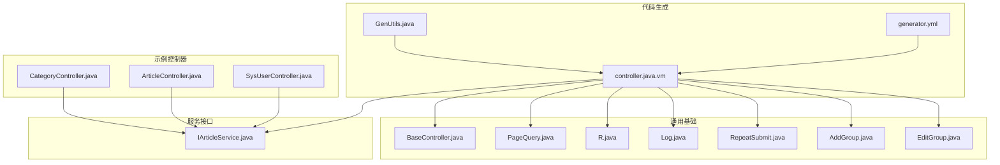
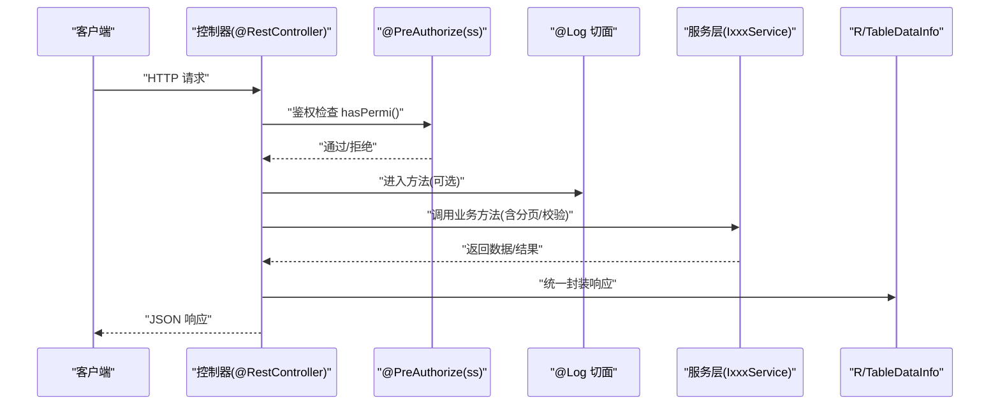
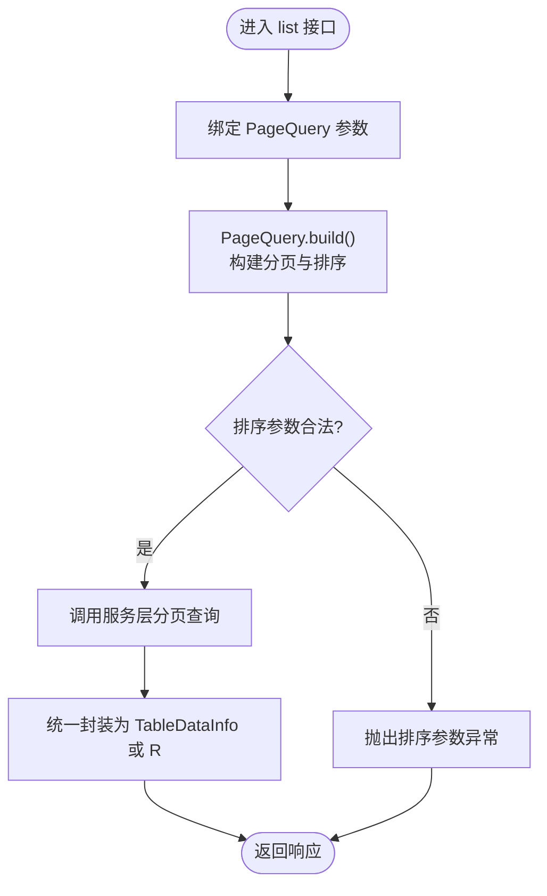

# 控制器模板

<cite>
**本文引用的文件**
- [controller.java.vm](file://blog-generator/src/main/resources/vm/java/controller.java.vm)
- [BaseController.java](file://blog-common/src/main/java/blog/common/base/controller/BaseController.java)
- [R.java](file://blog-common/src/main/java/blog/common/base/resp/R.java)
- [PageQuery.java](file://blog-common/src/main/java/blog/common/base/req/PageQuery.java)
- [Log.java](file://blog-common/src/main/java/blog/common/annotation/Log.java)
- [RepeatSubmit.java](file://blog-common/src/main/java/blog/common/annotation/RepeatSubmit.java)
- [AddGroup.java](file://blog-common/src/main/java/blog/common/validate/AddGroup.java)
- [EditGroup.java](file://blog-common/src/main/java/blog/common/validate/EditGroup.java)
- [SysUserController.java](file://blog-admin/src/main/java/blog/web/controller/system/SysUserController.java)
- [ArticleController.java](file://blog-admin/src/main/java/blog/web/controller/business/ArticleController.java)
- [CategoryController.java](file://blog-admin/src/main/java/blog/web/controller/business/CategoryController.java)
- [IArticleService.java](file://blog-biz/src/main/java/blog/biz/service/IArticleService.java)
- [generator.yml](file://blog-generator/src/main/resources/generator.yml)
- [GenUtils.java](file://blog-generator/src/main/java/blog/generator/util/GenUtils.java)
</cite>

## 目录
1. [简介](#简介)
2. [项目结构](#项目结构)
3. [核心组件](#核心组件)
4. [架构总览](#架构总览)
5. [详细组件分析](#详细组件分析)
6. [依赖关系分析](#依赖关系分析)
7. [性能考量](#性能考量)
8. [故障排查指南](#故障排查指南)
9. [结论](#结论)
10. [附录](#附录)

## 简介
本文件围绕控制器模板（controller.java.vm）进行系统化技术文档编制，重点说明：
- RESTful 控制器的生成规则：标准 CRUD 映射（@GetMapping、@PostMapping、@PutMapping、@DeleteMapping）与参数绑定（@PathVariable、@RequestBody）的自动生成。
- 权限注解（@PreAuthorize）与日志注解（@Log）的自动生成机制及其生效方式。
- 分页查询参数（pageNum、pageSize）的处理流程与 PageQuery 的构建。
- 返回值统一包装（R 响应对象）的实现与使用。
- 从表结构自动生成完整控制器类的实践示例，涵盖请求映射、参数校验、异常处理等 Web 层实现。

## 项目结构
控制器模板位于代码生成模块中，通过 Velocity 模板引擎渲染生成目标控制器类。模板与基础类、注解、分页与响应模型共同构成完整的 Web 层骨架。



图表来源
- [controller.java.vm:1-115](file://blog-generator/src/main/resources/vm/java/controller.java.vm#L1-L115)
- [BaseController.java:1-182](file://blog-common/src/main/java/blog/common/base/controller/BaseController.java#L1-L182)
- [PageQuery.java:1-128](file://blog-common/src/main/java/blog/common/base/req/PageQuery.java#L1-L128)
- [R.java:1-107](file://blog-common/src/main/java/blog/common/base/resp/R.java#L1-L107)
- [Log.java:1-51](file://blog-common/src/main/java/blog/common/annotation/Log.java#L1-L51)
- [RepeatSubmit.java:1-30](file://blog-common/src/main/java/blog/common/annotation/RepeatSubmit.java#L1-L30)
- [AddGroup.java:1-10](file://blog-common/src/main/java/blog/common/validate/AddGroup.java#L1-L10)
- [EditGroup.java:1-10](file://blog-common/src/main/java/blog/common/validate/EditGroup.java#L1-L10)
- [SysUserController.java:1-233](file://blog-admin/src/main/java/blog/web/controller/system/SysUserController.java#L1-L233)
- [ArticleController.java:1-102](file://blog-admin/src/main/java/blog/web/controller/business/ArticleController.java#L1-L102)
- [CategoryController.java:1-107](file://blog-admin/src/main/java/blog/web/controller/business/CategoryController.java#L1-L107)
- [IArticleService.java:1-64](file://blog-biz/src/main/java/blog/biz/service/IArticleService.java#L1-L64)
- [generator.yml:1-12](file://blog-generator/src/main/resources/generator.yml#L1-L12)
- [GenUtils.java:1-223](file://blog-generator/src/main/java/blog/generator/util/GenUtils.java#L1-L223)

章节来源
- [controller.java.vm:1-115](file://blog-generator/src/main/resources/vm/java/controller.java.vm#L1-L115)
- [generator.yml:1-12](file://blog-generator/src/main/resources/generator.yml#L1-L12)
- [GenUtils.java:1-223](file://blog-generator/src/main/java/blog/generator/util/GenUtils.java#L1-L223)

## 核心组件
- 控制器模板（controller.java.vm）：定义 RESTful 映射、权限与日志注解、参数校验组、分页参数、导出与重复提交注解、返回值包装等骨架。
- 基础控制器（BaseController）：提供分页初始化、排序注入、线程变量清理、统一结果封装等通用能力。
- 分页查询（PageQuery）：封装 pageNum/pageSize/orderByColumn/isAsc，并构建 MyBatis-Plus 分页对象与排序项。
- 响应包装（R）：统一响应结构（code/msg/data），提供成功/失败便捷方法。
- 注解体系：
  - @Log：记录操作日志，支持模块、业务类型、请求/响应参数保存策略。
  - @RepeatSubmit：防重复提交，支持间隔时间与提示语。
  - 参数校验组：AddGroup、EditGroup，配合 @Validated 实现分组校验。
- 示例控制器：SysUserController、ArticleController、CategoryController 展示了模板生成后的实际形态与差异分支（如 tree/crud）。

章节来源
- [controller.java.vm:1-115](file://blog-generator/src/main/resources/vm/java/controller.java.vm#L1-L115)
- [BaseController.java:1-182](file://blog-common/src/main/java/blog/common/base/controller/BaseController.java#L1-L182)
- [PageQuery.java:1-128](file://blog-common/src/main/java/blog/common/base/req/PageQuery.java#L1-L128)
- [R.java:1-107](file://blog-common/src/main/java/blog/common/base/resp/R.java#L1-L107)
- [Log.java:1-51](file://blog-common/src/main/java/blog/common/annotation/Log.java#L1-L51)
- [RepeatSubmit.java:1-30](file://blog-common/src/main/java/blog/common/annotation/RepeatSubmit.java#L1-L30)
- [AddGroup.java:1-10](file://blog-common/src/main/java/blog/common/validate/AddGroup.java#L1-L10)
- [EditGroup.java:1-10](file://blog-common/src/main/java/blog/common/validate/EditGroup.java#L1-L10)

## 架构总览
控制器模板通过 Velocity 渲染，结合基础类与注解，形成统一的 Web 层规范。权限控制由 @PreAuthorize 委托给 ss Bean 的 hasPermi 方法；日志由 @Log 注解驱动切面记录；分页由 PageQuery 构建并传入服务层；返回值统一包装为 R 或 TableDataInfo。



图表来源
- [controller.java.vm:43-113](file://blog-generator/src/main/resources/vm/java/controller.java.vm#L43-L113)
- [Log.java:1-51](file://blog-common/src/main/java/blog/common/annotation/Log.java#L1-L51)
- [R.java:1-107](file://blog-common/src/main/java/blog/common/base/resp/R.java#L1-L107)

## 详细组件分析

### 控制器模板生成规则
- 请求映射与 CRUD：
  - GET /list：查询列表（crud 模式返回 TableDataInfo，tree 模式返回 R<List>）。
  - GET /{id}：按主键获取详情，使用 @PathVariable 绑定主键，@NotNull 校验。
  - POST：新增，@RequestBody 接收 DTO，@Validated(AddGroup) 校验。
  - PUT：修改，@RequestBody 接收 DTO，@Validated(EditGroup) 校验。
  - DELETE /{ids}：批量删除，@PathVariable 绑定主键数组，@NotEmpty 校验。
- 权限注解：每个端点均标注 @PreAuthorize，委托至 ss Bean 的 hasPermi 方法进行权限判断。
- 日志注解：新增/修改/删除/导出等关键操作标注 @Log，记录模块与业务类型。
- 重复提交：新增/修改标注 @RepeatSubmit，避免表单重复提交。
- 分页参数：list 接口接收 PageQuery，内部由服务层构建分页对象。
- 返回值包装：tree 模式直接返回 R<List>，crud 模式返回 TableDataInfo；模板中也展示了 R<T> 的使用。

章节来源
- [controller.java.vm:43-113](file://blog-generator/src/main/resources/vm/java/controller.java.vm#L43-L113)

### 参数绑定与校验
- 路径参数：@PathVariable 绑定主键，模板对主键类型与数组形式做了适配。
- 请求体：@RequestBody 绑定 DTO，结合 AddGroup/EditGroup 进行分组校验。
- 分页参数：PageQuery 提供 pageNum/pageSize/orderByColumn/isAsc，默认值与非法值处理。
- 校验注解：@NotNull/@NotEmpty 等用于必填性约束。

章节来源
- [controller.java.vm:75-113](file://blog-generator/src/main/resources/vm/java/controller.java.vm#L75-L113)
- [PageQuery.java:24-127](file://blog-common/src/main/java/blog/common/base/req/PageQuery.java#L24-L127)
- [AddGroup.java:1-10](file://blog-common/src/main/java/blog/common/validate/AddGroup.java#L1-L10)
- [EditGroup.java:1-10](file://blog-common/src/main/java/blog/common/validate/EditGroup.java#L1-L10)

### 权限注解与生效机制
- @PreAuthorize 使用 spEL 表达式，模板中统一使用 @ss.hasPermi(...)。
- 权限实现由 ss Bean 提供，核心方法 hasPermi 会从当前登录用户权限集合中匹配权限字符串。
- 模板中权限前缀由变量 ${permissionPrefix} 生成，确保与业务模块一致。

章节来源
- [controller.java.vm:43-113](file://blog-generator/src/main/resources/vm/java/controller.java.vm#L43-L113)
- [SysUserController.java:60-168](file://blog-admin/src/main/java/blog/web/controller/system/SysUserController.java#L60-L168)

### 日志注解与切面
- @Log 注解支持模块标题、业务类型、请求/响应参数保存策略等。
- 切面处理由框架层面完成（模板未直接体现），典型流程为：方法执行前后收集参数与结果，写入日志表或审计系统。

章节来源
- [controller.java.vm:60-109](file://blog-generator/src/main/resources/vm/java/controller.java.vm#L60-L109)
- [Log.java:1-51](file://blog-common/src/main/java/blog/common/annotation/Log.java#L1-L51)

### 分页查询参数处理
- PageQuery.build() 构建 MyBatis-Plus 分页对象，支持多字段排序与方向兼容。
- 非法排序参数将抛出服务异常，保证 SQL 安全。
- 控制器中 list 接口直接接收 PageQuery，交由服务层处理分页与排序。



图表来源
- [PageQuery.java:62-115](file://blog-common/src/main/java/blog/common/base/req/PageQuery.java#L62-L115)
- [controller.java.vm:46-48](file://blog-generator/src/main/resources/vm/java/controller.java.vm#L46-L48)

章节来源
- [PageQuery.java:1-128](file://blog-common/src/main/java/blog/common/base/req/PageQuery.java#L1-L128)
- [controller.java.vm:46-48](file://blog-generator/src/main/resources/vm/java/controller.java.vm#L46-L48)

### 返回值统一包装（R 与 TableDataInfo）
- R：泛型响应体，提供 ok()/fail() 等静态方法，适合简单结果与 VO 包裹。
- TableDataInfo：表格数据专用响应体，包含 code/msg/rows/total，适合分页列表。
- 模板根据 $table.crud 与 $table.tree 选择不同返回类型。

章节来源
- [controller.java.vm:21-24](file://blog-generator/src/main/resources/vm/java/controller.java.vm#L21-L24)
- [R.java:1-107](file://blog-common/src/main/java/blog/common/base/resp/R.java#L1-L107)
- [BaseController.java:75-83](file://blog-common/src/main/java/blog/common/base/controller/BaseController.java#L75-L83)

### 代码生成与示例对照
- 生成配置：generator.yml 指定作者、包名、表前缀与覆盖策略。
- 生成工具：GenUtils 负责表名/业务名转换、驼峰命名、模块与业务名提取。
- 示例对照：
  - CategoryController：展示 crud 模式下的 R 包裹与分页查询。
  - ArticleController：展示 crud 模式下的 TableDataInfo 与导出。
  - SysUserController：展示更复杂的业务场景（导入/导出、角色/岗位关联等）。

章节来源
- [generator.yml:1-12](file://blog-generator/src/main/resources/generator.yml#L1-L12)
- [GenUtils.java:132-148](file://blog-generator/src/main/java/blog/generator/util/GenUtils.java#L132-L148)
- [CategoryController.java:42-105](file://blog-admin/src/main/java/blog/web/controller/business/CategoryController.java#L42-L105)
- [ArticleController.java:45-99](file://blog-admin/src/main/java/blog/web/controller/business/ArticleController.java#L45-L99)
- [SysUserController.java:60-168](file://blog-admin/src/main/java/blog/web/controller/system/SysUserController.java#L60-L168)

## 依赖关系分析
控制器模板与各组件之间的依赖关系如下：

```mermaid
classDiagram
class ControllerTemplate {
"+请求映射"
"+权限注解"
"+日志注解"
"+重复提交"
"+分页参数"
"+返回包装"
}
class BaseController {
"+startPage()"
"+startOrderBy()"
"+getDataTable()"
}
class PageQuery {
"+build()"
"+DEFAULT_PAGE_NUM"
"+DEFAULT_PAGE_SIZE"
}
class R {
"+ok()/fail()"
"+isSuccess()/isError()"
}
class Log
class RepeatSubmit
class AddGroup
class EditGroup
ControllerTemplate --> BaseController : "继承"
ControllerTemplate --> PageQuery : "参数绑定"
ControllerTemplate --> R : "返回包装"
ControllerTemplate --> Log : "注解使用"
ControllerTemplate --> RepeatSubmit : "注解使用"
ControllerTemplate --> AddGroup : "分组校验"
ControllerTemplate --> EditGroup : "分组校验"
```

图表来源
- [controller.java.vm:36-113](file://blog-generator/src/main/resources/vm/java/controller.java.vm#L36-L113)
- [BaseController.java:50-83](file://blog-common/src/main/java/blog/common/base/controller/BaseController.java#L50-L83)
- [PageQuery.java:62-74](file://blog-common/src/main/java/blog/common/base/req/PageQuery.java#L62-L74)
- [R.java:31-73](file://blog-common/src/main/java/blog/common/base/resp/R.java#L31-L73)
- [Log.java:20-50](file://blog-common/src/main/java/blog/common/annotation/Log.java#L20-L50)
- [RepeatSubmit.java:19-29](file://blog-common/src/main/java/blog/common/annotation/RepeatSubmit.java#L19-L29)
- [AddGroup.java:8-9](file://blog-common/src/main/java/blog/common/validate/AddGroup.java#L8-L9)
- [EditGroup.java:8-9](file://blog-common/src/main/java/blog/common/validate/EditGroup.java#L8-L9)

章节来源
- [controller.java.vm:1-115](file://blog-generator/src/main/resources/vm/java/controller.java.vm#L1-L115)
- [BaseController.java:1-182](file://blog-common/src/main/java/blog/common/base/controller/BaseController.java#L1-L182)
- [PageQuery.java:1-128](file://blog-common/src/main/java/blog/common/base/req/PageQuery.java#L1-L128)
- [R.java:1-107](file://blog-common/src/main/java/blog/common/base/resp/R.java#L1-L107)
- [Log.java:1-51](file://blog-common/src/main/java/blog/common/annotation/Log.java#L1-L51)
- [RepeatSubmit.java:1-30](file://blog-common/src/main/java/blog/common/annotation/RepeatSubmit.java#L1-L30)
- [AddGroup.java:1-10](file://blog-common/src/main/java/blog/common/validate/AddGroup.java#L1-L10)
- [EditGroup.java:1-10](file://blog-common/src/main/java/blog/common/validate/EditGroup.java#L1-L10)

## 性能考量
- 分页与排序：PageQuery 对排序字段进行下划线转换与 SQL 安全校验，避免注入风险；建议前端传入必要字段，减少排序复杂度。
- 导出性能：导出接口一次性加载列表，建议结合分页与异步任务优化大体量导出。
- 重复提交：@RepeatSubmit 通过间隔时间限制请求频率，降低数据库压力与并发问题。
- 统一包装：R 与 TableDataInfo 降低前端解析成本，但需注意大数据量时的序列化开销。

## 故障排查指南
- 权限不足：确认 @PreAuthorize 中的权限字符串与用户权限一致，检查 ss.hasPermi 实现与登录用户权限集合。
- 排序参数错误：PageQuery 在排序参数不合法时抛出服务异常，检查 isAsc 与 orderByColumn 的组合。
- 主键为空：@NotNull/@NotEmpty 校验失败时，检查请求路径与数组参数格式。
- 导出异常：确认响应输出流与 ExcelUtil 使用正确，避免重复写入。
- 重复提交：调整 @RepeatSubmit 的间隔时间或提示语，避免误伤正常请求。

章节来源
- [PageQuery.java:85-115](file://blog-common/src/main/java/blog/common/base/req/PageQuery.java#L85-L115)
- [controller.java.vm:75-113](file://blog-generator/src/main/resources/vm/java/controller.java.vm#L75-L113)

## 结论
控制器模板通过标准化的注解与参数绑定，实现了 RESTful 控制器的快速生成。结合权限、日志、分页与统一响应包装，形成了一套可复用、可扩展的 Web 层规范。实际项目中，可通过生成器配置与工具类进一步定制生成行为，确保与业务模块保持一致。

## 附录
- 生成配置参考：generator.yml
- 生成工具参考：GenUtils（表名/业务名转换、模块提取）
- 示例对照：CategoryController、ArticleController、SysUserController

章节来源
- [generator.yml:1-12](file://blog-generator/src/main/resources/generator.yml#L1-L12)
- [GenUtils.java:132-148](file://blog-generator/src/main/java/blog/generator/util/GenUtils.java#L132-L148)
- [CategoryController.java:42-105](file://blog-admin/src/main/java/blog/web/controller/business/CategoryController.java#L42-L105)
- [ArticleController.java:45-99](file://blog-admin/src/main/java/blog/web/controller/business/ArticleController.java#L45-L99)
- [SysUserController.java:60-168](file://blog-admin/src/main/java/blog/web/controller/system/SysUserController.java#L60-L168)