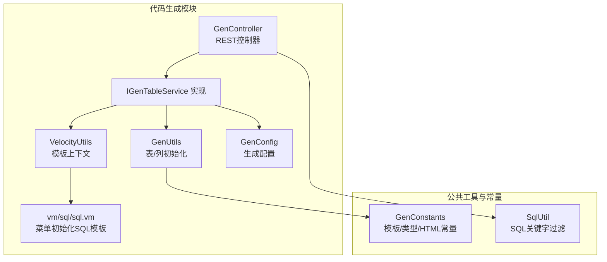
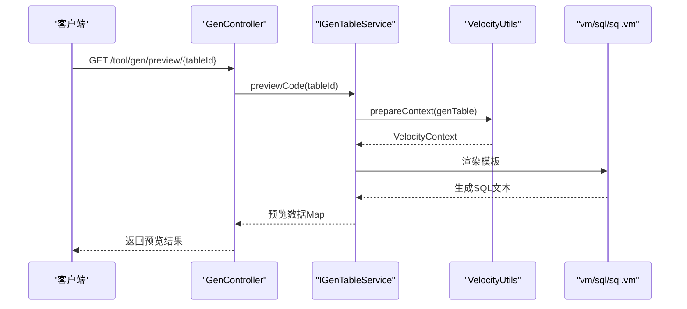
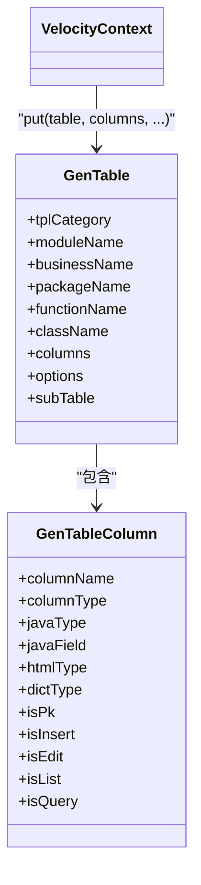
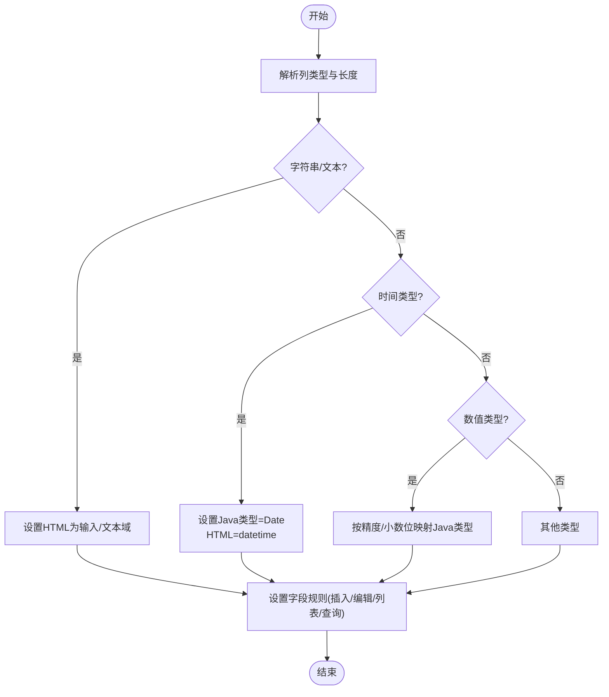
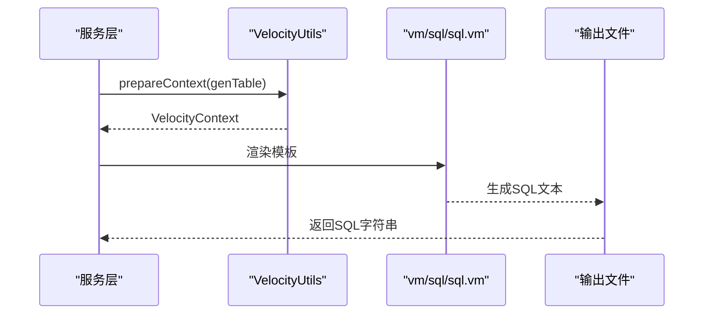
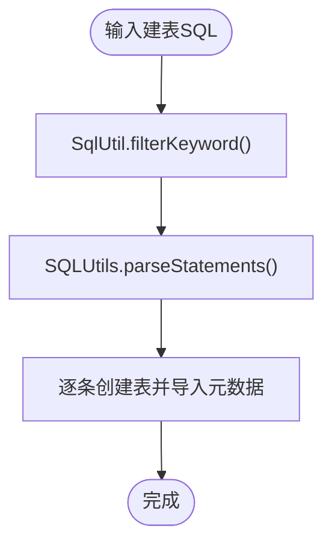
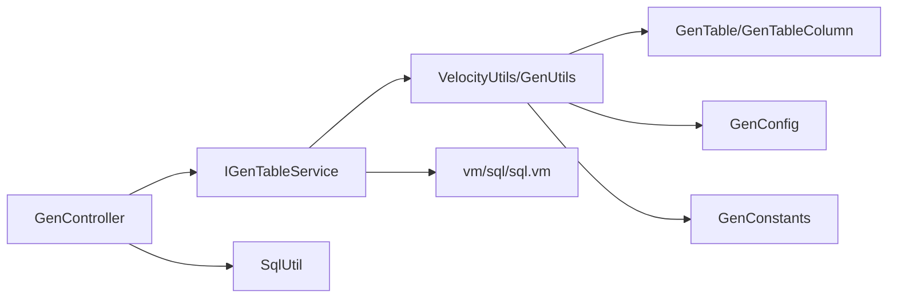

# SQL数据库模板

<cite>
**本文引用的文件**
- [VelocityUtils.java](file://blog-generator/src/main/java/blog/generator/util/VelocityUtils.java)
- [GenUtils.java](file://blog-generator/src/main/java/blog/generator/util/GenUtils.java)
- [GenTable.java](file://blog-generator/src/main/java/blog/generator/domain/GenTable.java)
- [GenTableColumn.java](file://blog-generator/src/main/java/blog/generator/domain/GenTableColumn.java)
- [GenController.java](file://blog-generator/src/main/java/blog/generator/controller/GenController.java)
- [GenConfig.java](file://blog-generator/src/main/java/blog/generator/config/GenConfig.java)
- [IGenTableService.java](file://blog-generator/src/main/java/blog/generator/service/IGenTableService.java)
- [GenConstants.java](file://blog-common/src/main/java/blog/common/constant/GenConstants.java)
- [SqlUtil.java](file://blog-common/src/main/java/blog/common/utils/sql/SqlUtil.java)
- [sql.vm](file://blog-generator/src/main/resources/vm/sql/sql.vm)
- [generator.yml](file://blog-generator/src/main/resources/generator.yml)
- [ry-vue-owner.sql](file://ry-vue-owner.sql)
</cite>

## 目录
1. [简介](#简介)
2. [项目结构](#项目结构)
3. [核心组件](#核心组件)
4. [架构总览](#架构总览)
5. [详细组件分析](#详细组件分析)
6. [依赖关系分析](#依赖关系分析)
7. [性能考量](#性能考量)
8. [故障排查指南](#故障排查指南)
9. [结论](#结论)
10. [附录](#附录)

## 简介
本技术文档围绕“SQL数据库模板系统”展开，聚焦于基于Velocity模板引擎的数据库脚本生成能力，涵盖菜单与权限初始化SQL、模板变量替换、DDL/DML模板化、安全防护、可扩展性与调试测试方法。该系统通过统一的业务表模型与模板文件，将数据库结构与前端菜单、后端代码生成串联起来，形成从表结构到脚本、再到前后端的完整自动化流水线。

## 项目结构
SQL模板系统位于代码生成模块中，主要由以下层次构成：
- 控制层：对外提供REST接口，负责接收请求、调用服务层并返回结果或下载产物
- 服务层：封装业务逻辑，包括表结构导入、模板渲染、SQL生成与下载
- 领域模型：GenTable与GenTableColumn承载表与列元数据
- 模板与配置：Velocity模板与generator.yml配置文件
- 工具与常量：模板变量准备、类型映射、安全过滤等

图表来源
- [GenController.java:1-242](file://blog-generator/src/main/java/blog/generator/controller/GenController.java#L1-L242)
- [IGenTableService.java:1-131](file://blog-generator/src/main/java/blog/generator/service/IGenTableService.java#L1-L131)
- [VelocityUtils.java:1-364](file://blog-generator/src/main/java/blog/generator/util/VelocityUtils.java#L1-L364)
- [GenUtils.java:1-223](file://blog-generator/src/main/java/blog/generator/util/GenUtils.java#L1-L223)
- [GenConfig.java:1-87](file://blog-generator/src/main/java/blog/generator/config/GenConfig.java#L1-L87)
- [sql.vm:1-22](file://blog-generator/src/main/resources/vm/sql/sql.vm#L1-L22)
- [GenConstants.java:1-187](file://blog-common/src/main/java/blog/common/constant/GenConstants.java#L1-L187)
- [SqlUtil.java:1-62](file://blog-common/src/main/java/blog/common/utils/sql/SqlUtil.java#L1-L62)

章节来源
- [GenController.java:1-242](file://blog-generator/src/main/java/blog/generator/controller/GenController.java#L1-L242)
- [IGenTableService.java:1-131](file://blog-generator/src/main/java/blog/generator/service/IGenTableService.java#L1-L131)
- [VelocityUtils.java:1-364](file://blog-generator/src/main/java/blog/generator/util/VelocityUtils.java#L1-L364)
- [GenUtils.java:1-223](file://blog-generator/src/main/java/blog/generator/util/GenUtils.java#L1-L223)
- [GenConfig.java:1-87](file://blog-generator/src/main/java/blog/generator/config/GenConfig.java#L1-L87)
- [sql.vm:1-22](file://blog-generator/src/main/resources/vm/sql/sql.vm#L1-L22)
- [GenConstants.java:1-187](file://blog-common/src/main/java/blog/common/constant/GenConstants.java#L1-L187)
- [SqlUtil.java:1-62](file://blog-common/src/main/java/blog/common/utils/sql/SqlUtil.java#L1-L62)

## 核心组件
- 业务表模型
  - GenTable：承载表元信息、模板类别、包名、模块名、业务名、作者、选项等
  - GenTableColumn：承载列元信息、Java类型、HTML类型、字典类型、是否必填/插入/编辑/列表/查询等
- 模板工具
  - VelocityUtils：构建VelocityContext，填充模板变量（如表名、类名、权限前缀、树形/父子表上下文等）
  - GenUtils：表名/业务名转换、列类型映射、HTML控件类型推断、字段规则初始化
- 配置与常量
  - GenConfig：读取generator.yml中的作者、包名、自动去前缀、表前缀、是否允许覆盖等
  - GenConstants：模板类别、数据库类型分类、HTML控件类型、Java类型、查询方式、必需标记等
- 安全工具
  - SqlUtil：SQL关键字过滤、orderBy合法性校验
- 控制器
  - GenController：提供预览、下载、生成、同步、创建表等接口，并在创建表时进行安全过滤与解析

章节来源
- [GenTable.java:1-177](file://blog-generator/src/main/java/blog/generator/domain/GenTable.java#L1-L177)
- [GenTableColumn.java:1-348](file://blog-generator/src/main/java/blog/generator/domain/GenTableColumn.java#L1-L348)
- [VelocityUtils.java:1-364](file://blog-generator/src/main/java/blog/generator/util/VelocityUtils.java#L1-L364)
- [GenUtils.java:1-223](file://blog-generator/src/main/java/blog/generator/util/GenUtils.java#L1-L223)
- [GenConfig.java:1-87](file://blog-generator/src/main/java/blog/generator/config/GenConfig.java#L1-L87)
- [GenConstants.java:1-187](file://blog-common/src/main/java/blog/common/constant/GenConstants.java#L1-L187)
- [SqlUtil.java:1-62](file://blog-common/src/main/java/blog/common/utils/sql/SqlUtil.java#L1-L62)
- [GenController.java:1-242](file://blog-generator/src/main/java/blog/generator/controller/GenController.java#L1-L242)

## 架构总览
SQL模板系统以“表元数据 + 模板上下文 + 模板文件”的组合驱动SQL生成。典型流程如下：
- 控制器接收请求，调用服务层
- 服务层准备模板上下文（VelocityUtils.prepareContext）
- 渲染模板（vm/sql/sql.vm），输出初始化菜单与权限的SQL
- 对外部输入的建表SQL进行安全过滤与解析，再导入表元数据
- 支持预览、下载与自定义路径生成

图表来源
- [GenController.java:174-180](file://blog-generator/src/main/java/blog/generator/controller/GenController.java#L174-L180)
- [VelocityUtils.java:43-77](file://blog-generator/src/main/java/blog/generator/util/VelocityUtils.java#L43-L77)
- [sql.vm:1-22](file://blog-generator/src/main/resources/vm/sql/sql.vm#L1-L22)

章节来源
- [GenController.java:174-180](file://blog-generator/src/main/java/blog/generator/controller/GenController.java#L174-L180)
- [VelocityUtils.java:43-77](file://blog-generator/src/main/java/blog/generator/util/VelocityUtils.java#L43-L77)
- [sql.vm:1-22](file://blog-generator/src/main/resources/vm/sql/sql.vm#L1-L22)

## 详细组件分析

### 组件A：模板变量与上下文构建（VelocityUtils）
- 职责
  - 构建VelocityContext，注入表名、类名、模块名、业务名、作者、时间、权限前缀、列集合、字典组、菜单上下文、树形上下文、父子表上下文等
  - 提供模板列表选择（含vm/sql/sql.vm）
  - 计算文件名（如生成的菜单SQL文件名为业务名+“Menu.sql”）
- 关键点
  - 权限前缀：基于模块名与业务名拼接
  - 树形/父子表上下文：从options中提取树编码、父编码、名称等
  - 导入包列表：根据列的Java类型动态决定导入（如Date、BigDecimal、Jackson注解）

图表来源
- [VelocityUtils.java:43-120](file://blog-generator/src/main/java/blog/generator/util/VelocityUtils.java#L43-L120)
- [GenTable.java:1-177](file://blog-generator/src/main/java/blog/generator/domain/GenTable.java#L1-L177)
- [GenTableColumn.java:1-348](file://blog-generator/src/main/java/blog/generator/domain/GenTableColumn.java#L1-L348)

章节来源
- [VelocityUtils.java:43-120](file://blog-generator/src/main/java/blog/generator/util/VelocityUtils.java#L43-L120)
- [GenTable.java:1-177](file://blog-generator/src/main/java/blog/generator/domain/GenTable.java#L1-L177)
- [GenTableColumn.java:1-348](file://blog-generator/src/main/java/blog/generator/domain/GenTableColumn.java#L1-L348)

### 组件B：表/列初始化与类型映射（GenUtils）
- 职责
  - 表名转类名、模块名、业务名
  - 列类型映射：字符串/文本域、时间、数值（整型/长整型/高精度）、HTML控件类型推断
  - 字段规则：是否插入/编辑/列表/查询字段，查询方式（LIKE/EQ）
- 关键点
  - 数值类型解析：根据精度与小数位判断Java类型
  - 特殊字段命名规则：name/status/type/sex/image/file/content等自动匹配HTML控件

图表来源
- [GenUtils.java:35-113](file://blog-generator/src/main/java/blog/generator/util/GenUtils.java#L35-L113)

章节来源
- [GenUtils.java:35-113](file://blog-generator/src/main/java/blog/generator/util/GenUtils.java#L35-L113)

### 组件C：SQL模板与生成（vm/sql/sql.vm）
- 职责
  - 生成sys_menu的初始化SQL，包含菜单项与按钮权限
  - 使用模板变量完成表名、业务名、权限前缀、图标、时间等动态替换
- 关键点
  - 通过LAST_INSERT_ID()获取父菜单ID，再批量插入按钮权限
  - 输出文件命名为“业务名Menu.sql”，便于直接执行

图表来源
- [VelocityUtils.java:159-207](file://blog-generator/src/main/java/blog/generator/util/VelocityUtils.java#L159-L207)
- [sql.vm:1-22](file://blog-generator/src/main/resources/vm/sql/sql.vm#L1-L22)

章节来源
- [VelocityUtils.java:159-207](file://blog-generator/src/main/java/blog/generator/util/VelocityUtils.java#L159-L207)
- [sql.vm:1-22](file://blog-generator/src/main/resources/vm/sql/sql.vm#L1-L22)

### 组件D：安全与权限控制（SqlUtil、GenController）
- 职责
  - SqlUtil：过滤危险SQL关键字、校验orderBy合法性，防止注入
  - GenController：在创建表接口中先进行关键字过滤，再解析SQL并导入表元数据
- 关键点
  - 过滤规则基于正则与关键字集合
  - 创建表接口仅管理员可用，且对输入进行严格校验

图表来源
- [GenController.java:125-147](file://blog-generator/src/main/java/blog/generator/controller/GenController.java#L125-L147)
- [SqlUtil.java:50-60](file://blog-common/src/main/java/blog/common/utils/sql/SqlUtil.java#L50-L60)

章节来源
- [GenController.java:125-147](file://blog-generator/src/main/java/blog/generator/controller/GenController.java#L125-L147)
- [SqlUtil.java:50-60](file://blog-common/src/main/java/blog/common/utils/sql/SqlUtil.java#L50-L60)

### 组件E：配置与常量（GenConfig、GenConstants）
- 职责
  - GenConfig：从generator.yml读取作者、包名、自动去前缀、表前缀、是否允许覆盖等
  - GenConstants：模板类别、数据库类型分类、HTML控件类型、Java类型、查询方式、必需标记等
- 关键点
  - 配置项影响类名生成、文件输出策略与覆盖行为
  - 常量统一了模板与代码生成的约定

章节来源
- [GenConfig.java:1-87](file://blog-generator/src/main/java/blog/generator/config/GenConfig.java#L1-L87)
- [generator.yml:1-12](file://blog-generator/src/main/resources/generator.yml#L1-L12)
- [GenConstants.java:1-187](file://blog-common/src/main/java/blog/common/constant/GenConstants.java#L1-L187)

## 依赖关系分析
- 组件耦合
  - 控制器依赖服务接口，服务层依赖工具类与模板
  - 模板变量依赖领域模型与常量配置
  - 安全工具独立于模板，但被控制器在关键入口使用
- 外部依赖
  - Velocity模板引擎、MyBatis XML映射（用于其他模板）
  - Druid SQL解析（用于建表SQL解析）

图表来源
- [GenController.java:1-242](file://blog-generator/src/main/java/blog/generator/controller/GenController.java#L1-L242)
- [IGenTableService.java:1-131](file://blog-generator/src/main/java/blog/generator/service/IGenTableService.java#L1-L131)
- [VelocityUtils.java:1-364](file://blog-generator/src/main/java/blog/generator/util/VelocityUtils.java#L1-L364)
- [GenUtils.java:1-223](file://blog-generator/src/main/java/blog/generator/util/GenUtils.java#L1-L223)
- [GenConfig.java:1-87](file://blog-generator/src/main/java/blog/generator/config/GenConfig.java#L1-L87)
- [GenConstants.java:1-187](file://blog-common/src/main/java/blog/common/constant/GenConstants.java#L1-L187)
- [SqlUtil.java:1-62](file://blog-common/src/main/java/blog/common/utils/sql/SqlUtil.java#L1-L62)
- [sql.vm:1-22](file://blog-generator/src/main/resources/vm/sql/sql.vm#L1-L22)

章节来源
- [GenController.java:1-242](file://blog-generator/src/main/java/blog/generator/controller/GenController.java#L1-L242)
- [IGenTableService.java:1-131](file://blog-generator/src/main/java/blog/generator/service/IGenTableService.java#L1-L131)
- [VelocityUtils.java:1-364](file://blog-generator/src/main/java/blog/generator/util/VelocityUtils.java#L1-L364)
- [GenUtils.java:1-223](file://blog-generator/src/main/java/blog/generator/util/GenUtils.java#L1-L223)
- [GenConfig.java:1-87](file://blog-generator/src/main/java/blog/generator/config/GenConfig.java#L1-L87)
- [GenConstants.java:1-187](file://blog-common/src/main/java/blog/common/constant/GenConstants.java#L1-L187)
- [SqlUtil.java:1-62](file://blog-common/src/main/java/blog/common/utils/sql/SqlUtil.java#L1-L62)
- [sql.vm:1-22](file://blog-generator/src/main/resources/vm/sql/sql.vm#L1-L22)

## 性能考量
- 模板渲染
  - 采用Velocity模板，渲染开销低；建议避免在模板中进行复杂循环与嵌套
- SQL生成
  - 初始化SQL数量有限，性能瓶颈不在生成阶段
- 安全过滤
  - 关键字过滤与SQL解析在创建表接口执行，建议对批量输入进行分批处理与超时控制
- I/O与下载
  - 预览与下载采用内存流输出，注意控制单次生成文件大小，避免内存压力

## 故障排查指南
- 预览/下载失败
  - 检查模板变量是否完整（如表名、类名、权限前缀等）
  - 确认模板文件是否存在且可读
- 创建表异常
  - 核查输入SQL是否包含被过滤的关键字
  - 检查SQL语法与目标数据库兼容性
- 权限未生效
  - 确认生成的菜单SQL是否正确执行
  - 检查sys_menu表中父菜单ID与按钮权限是否一致
- 配置不生效
  - 检查generator.yml中作者、包名、表前缀、覆盖开关等配置项

章节来源
- [GenController.java:125-147](file://blog-generator/src/main/java/blog/generator/controller/GenController.java#L125-L147)
- [SqlUtil.java:50-60](file://blog-common/src/main/java/blog/common/utils/sql/SqlUtil.java#L50-L60)
- [sql.vm:1-22](file://blog-generator/src/main/resources/vm/sql/sql.vm#L1-L22)
- [generator.yml:1-12](file://blog-generator/src/main/resources/generator.yml#L1-L12)

## 结论
该SQL数据库模板系统通过统一的业务表模型与Velocity模板，实现了菜单与权限初始化SQL的自动化生成，具备良好的可扩展性与安全性。结合严格的SQL关键字过滤与权限控制，能够在保障安全的前提下高效生成高质量的数据库脚本。建议在实际使用中完善单元测试与集成测试，确保模板变量替换与SQL生成的准确性与一致性。

## 附录
- 实际数据库脚本参考
  - 可参考项目根目录下的数据库脚本文件，了解系统初始表结构与数据分布
- 最佳实践
  - 在生成前核对模板变量与配置项
  - 对外部输入的SQL进行安全过滤后再执行
  - 将生成的SQL纳入版本管理，便于审计与回滚

章节来源
- [ry-vue-owner.sql:1-200](file://ry-vue-owner.sql#L1-L200)