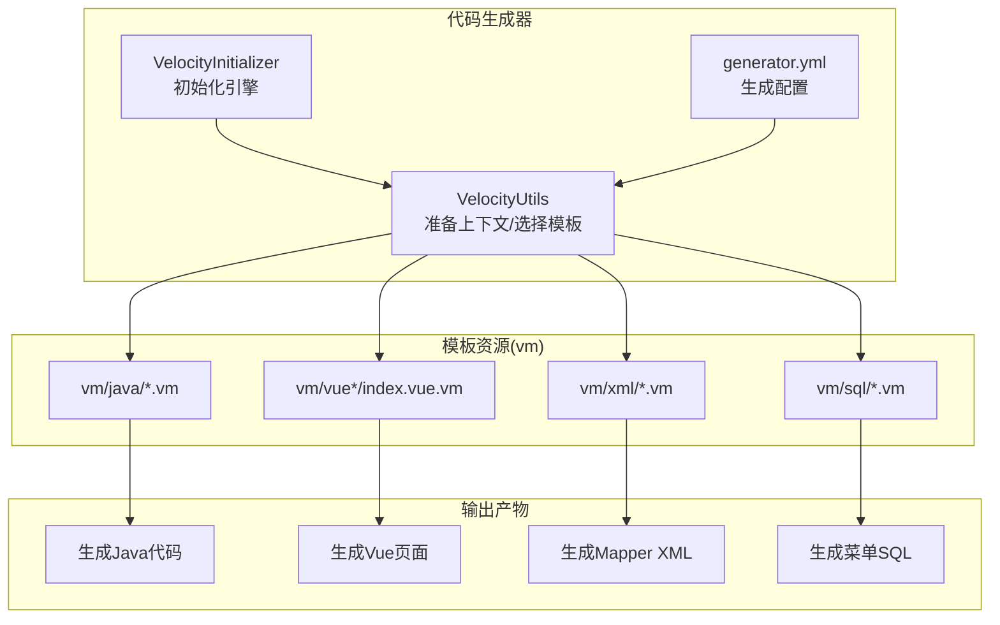
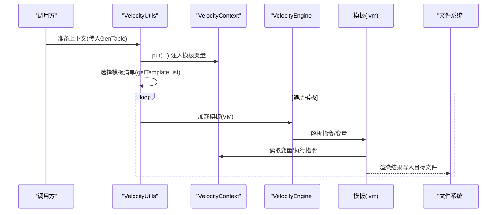
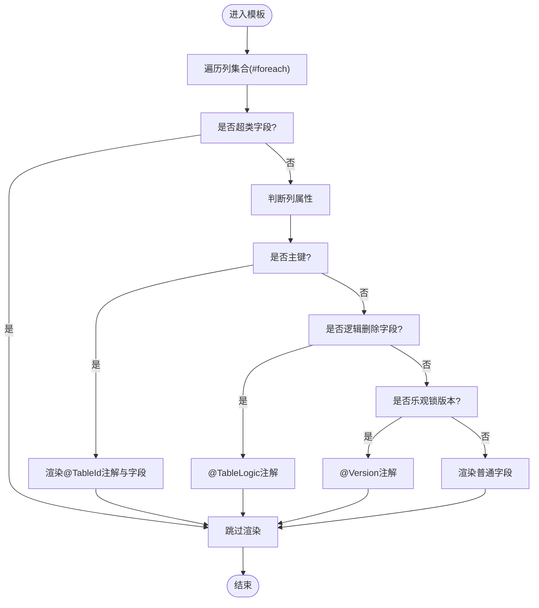
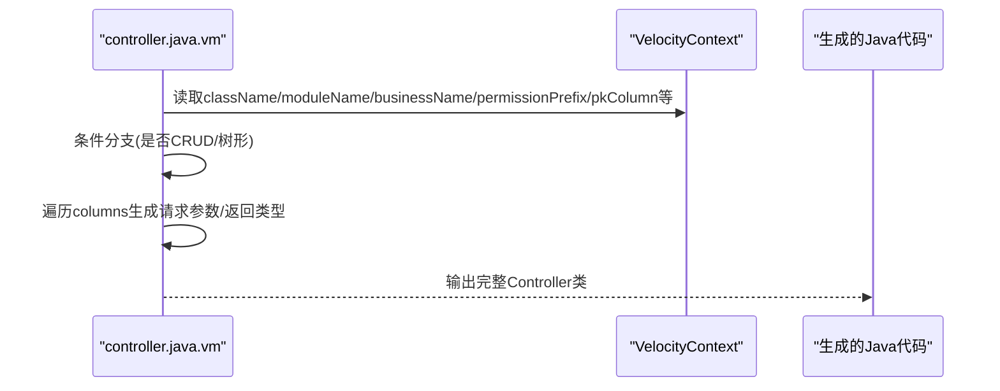
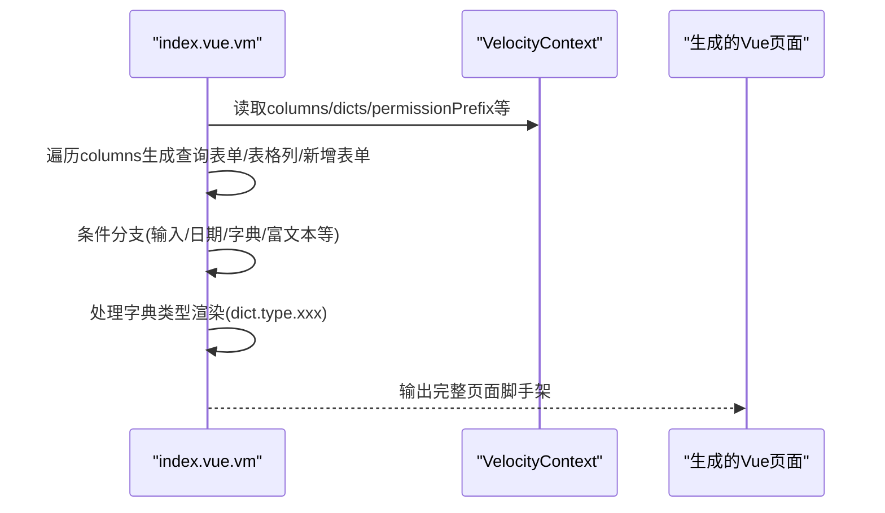
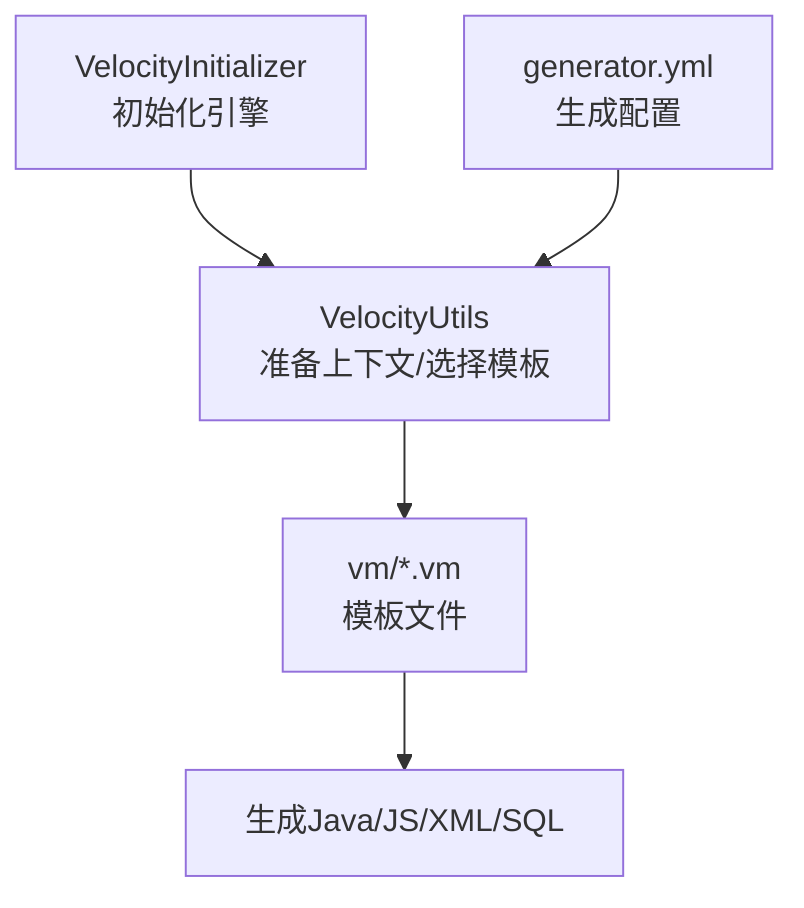
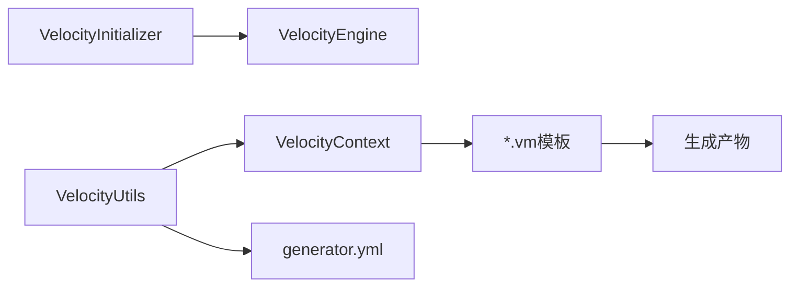

# Velocity模板语法

<cite>
**本文档引用的文件**
- [VelocityInitializer.java](file://blog-generator/src/main/java/blog/generator/util/VelocityInitializer.java)
- [VelocityUtils.java](file://blog-generator/src/main/java/blog/generator/util/VelocityUtils.java)
- [generator.yml](file://blog-generator/src/main/resources/generator.yml)
- [domain.java.vm](file://blog-generator/src/main/resources/vm/java/domain.java.vm)
- [controller.java.vm](file://blog-generator/src/main/resources/vm/java/controller.java.vm)
- [service.java.vm](file://blog-generator/src/main/resources/vm/java/service.java.vm)
- [mapper.java.vm](file://blog-generator/src/main/resources/vm/java/mapper.java.vm)
- [mapper.xml.vm](file://blog-generator/src/main/resources/vm/xml/mapper.xml.vm)
- [index.vue.vm](file://blog-generator/src/main/resources/vm/vue/index.vue.vm)
- [index.vue.vm(v3)](file://blog-generator/src/main/resources/vm/vue/v3/index.vue.vm)
- [sql.vm](file://blog-generator/src/main/resources/vm/sql/sql.vm)
</cite>

## 目录
1. [简介](#简介)
2. [项目结构](#项目结构)
3. [核心组件](#核心组件)
4. [架构总览](#架构总览)
5. [详细组件分析](#详细组件分析)
6. [依赖关系分析](#依赖关系分析)
7. [性能考量](#性能考量)
8. [故障排查指南](#故障排查指南)
9. [结论](#结论)
10. [附录](#附录)

## 简介
本指南聚焦于Velocity模板在RuoYi博客项目中的实际应用，系统讲解模板语法要点：指令（以#开头）、变量引用（以$开头）、注释（##）；条件判断（#if/#else/#elseif/#end）与嵌套；循环控制（#foreach）；变量定义与赋值（#set）；以及内置对象与工具类的使用场景。文档结合项目中的真实模板文件，给出可直接对照的“片段路径”，并提供调试与排错建议，帮助开发者快速掌握Velocity模板编写技巧。

## 项目结构
本项目通过代码生成模块（blog-generator）使用Velocity模板批量生成后端Java代码、前端Vue页面、MyBatis映射XML及初始化SQL。模板位于资源目录vm下，按语言/框架分类组织，Velocity运行时由VelocityInitializer初始化，VelocityUtils负责准备模板上下文（VelocityContext）并选择模板清单。

图示来源
- [VelocityInitializer.java:17-29](file://blog-generator/src/main/java/blog/generator/util/VelocityInitializer.java#L17-L29)
- [VelocityUtils.java:43-77](file://blog-generator/src/main/java/blog/generator/util/VelocityUtils.java#L43-L77)
- [generator.yml:1-12](file://blog-generator/src/main/resources/generator.yml#L1-L12)

章节来源
- [VelocityInitializer.java:17-29](file://blog-generator/src/main/java/blog/generator/util/VelocityInitializer.java#L17-L29)
- [VelocityUtils.java:129-154](file://blog-generator/src/main/java/blog/generator/util/VelocityUtils.java#L129-L154)
- [generator.yml:1-12](file://blog-generator/src/main/resources/generator.yml#L1-L12)

## 核心组件
- VelocityInitializer：设置资源加载器与字符集，初始化VelocityEngine。
- VelocityUtils：构建VelocityContext（如tplCategory、tableName、functionName、className、columns、table、dicts、权限前缀等），根据模板类别选择模板清单，计算文件名，处理树形/子表等特殊上下文。
- 模板资源：vm/java、vm/vue、vm/xml、vm/sql目录下的.vm文件，承载具体的模板逻辑。
- 生成配置：generator.yml提供作者、包名、表前缀、是否允许覆盖等全局配置。

章节来源
- [VelocityInitializer.java:17-29](file://blog-generator/src/main/java/blog/generator/util/VelocityInitializer.java#L17-L29)
- [VelocityUtils.java:43-77](file://blog-generator/src/main/java/blog/generator/util/VelocityUtils.java#L43-L77)
- [VelocityUtils.java:129-154](file://blog-generator/src/main/java/blog/generator/util/VelocityUtils.java#L129-L154)
- [generator.yml:1-12](file://blog-generator/src/main/resources/generator.yml#L1-L12)

## 架构总览
以下序列图展示从准备上下文到渲染模板并生成文件的流程，体现Velocity指令与变量在模板中的使用方式。

图示来源
- [VelocityUtils.java:43-77](file://blog-generator/src/main/java/blog/generator/util/VelocityUtils.java#L43-L77)
- [VelocityUtils.java:129-154](file://blog-generator/src/main/java/blog/generator/util/VelocityUtils.java#L129-L154)
- [VelocityInitializer.java:17-29](file://blog-generator/src/main/java/blog/generator/util/VelocityInitializer.java#L17-L29)

## 详细组件分析

### 指令与变量基础
- 指令以#开头，如#foreach、#if/#else/#elseif/#end、#set、##注释等。
- 变量以$开头，如$table、$columns、$className、$permissionPrefix等。
- 注释以##开头，用于模板内注释。

示例片段路径（不直接展示代码内容）
- 条件判断与注释：[domain.java.vm:3-7](file://blog-generator/src/main/resources/vm/java/domain.java.vm#L3-L7)
- 变量引用与注释：[domain.java.vm:18-28](file://blog-generator/src/main/resources/vm/java/domain.java.vm#L18-L28)
- 注释示例：[mapper.xml.vm:1-3](file://blog-generator/src/main/resources/vm/xml/mapper.xml.vm#L1-L3)

章节来源
- [domain.java.vm:3-7](file://blog-generator/src/main/resources/vm/java/domain.java.vm#L3-L7)
- [domain.java.vm:18-28](file://blog-generator/src/main/resources/vm/java/domain.java.vm#L18-L28)
- [mapper.xml.vm:1-3](file://blog-generator/src/main/resources/vm/xml/mapper.xml.vm#L1-L3)

### 条件判断语法（#if/#else/#elseif/#end）
- 作用：根据上下文布尔值或比较结果决定渲染分支。
- 嵌套规则：支持多层#end闭合，注意成对出现。
- 常见场景：根据列属性（如是否为主键、是否逻辑删除、是否树形字段）动态生成注解与字段。

示例片段路径
- 基础条件与嵌套：[domain.java.vm:24-28](file://blog-generator/src/main/resources/vm/java/domain.java.vm#L24-L28)
- 列级条件判断：[domain.java.vm:34-54](file://blog-generator/src/main/resources/vm/java/domain.java.vm#L34-L54)
- 控制器分支：[controller.java.vm:21-54](file://blog-generator/src/main/resources/vm/java/controller.java.vm#L21-L54)
- Vue条件渲染（含字典类型分支）：[index.vue.vm:23-62](file://blog-generator/src/main/resources/vm/vue/index.vue.vm#L23-L62)

章节来源
- [domain.java.vm:24-28](file://blog-generator/src/main/resources/vm/java/domain.java.vm#L24-L28)
- [domain.java.vm:34-54](file://blog-generator/src/main/resources/vm/java/domain.java.vm#L34-L54)
- [controller.java.vm:21-54](file://blog-generator/src/main/resources/vm/java/controller.java.vm#L21-L54)
- [index.vue.vm:23-62](file://blog-generator/src/main/resources/vm/vue/index.vue.vm#L23-L62)

### 循环控制语法（#foreach）
- 作用：遍历集合（如$columns、$importList、$dicts、$subTable.columns等）逐项渲染。
- 迭代器使用：Velocity内置迭代状态变量（如$foreach.count），可在模板中引用。
- 常见场景：生成实体字段、导入包、表格列、表单项、字典渲染等。

示例片段路径
- 遍历列生成字段与注解：[domain.java.vm:34-54](file://blog-generator/src/main/resources/vm/java/domain.java.vm#L34-L54)
- 遍历导入列表：[domain.java.vm:12-14](file://blog-generator/src/main/resources/vm/java/domain.java.vm#L12-L14)
- 遍历列生成查询表单与表格列：[index.vue.vm:4-63](file://blog-generator/src/main/resources/vm/vue/index.vue.vm#L4-L63)
- 遍历列生成查询表单（v3）：[index.vue.vm(v3):4-62](file://blog-generator/src/main/resources/vm/vue/v3/index.vue.vm#L4-L62)
- 遍历子表列生成子表编辑区：[index.vue.vm:300-344](file://blog-generator/src/main/resources/vm/vue/index.vue.vm#L300-L344)
- MyBatis映射resultMap遍历列：[mapper.xml.vm:8-11](file://blog-generator/src/main/resources/vm/xml/mapper.xml.vm#L8-L11)

章节来源
- [domain.java.vm:34-54](file://blog-generator/src/main/resources/vm/java/domain.java.vm#L34-L54)
- [domain.java.vm:12-14](file://blog-generator/src/main/resources/vm/java/domain.java.vm#L12-L14)
- [index.vue.vm:4-63](file://blog-generator/src/main/resources/vm/vue/index.vue.vm#L4-L63)
- [index.vue.vm(v3):4-62](file://blog-generator/src/main/resources/vm/vue/v3/index.vue.vm#L4-L62)
- [index.vue.vm:300-344](file://blog-generator/src/main/resources/vm/vue/index.vue.vm#L300-L344)
- [mapper.xml.vm:8-11](file://blog-generator/src/main/resources/vm/xml/mapper.xml.vm#L8-L11)

### 变量定义与赋值（#set）
- 作用：在模板内部临时定义或修改变量，便于复用表达式或简化复杂逻辑。
- 常见场景：提取列注释中的中文部分、构造变量名、设置字典类型、处理日期范围等。

示例片段路径
- 设置字典类型与变量名：[index.vue.vm:6-13](file://blog-generator/src/main/resources/vm/vue/index.vue.vm#L6-L13)
- 设置注释文本（去除括号内容）：[index.vue.vm:8-13](file://blog-generator/src/main/resources/vm/vue/index.vue.vm#L8-L13)
- 设置日期范围变量名：[index.vue.vm:392-396](file://blog-generator/src/main/resources/vm/vue/index.vue.vm#L392-L396)
- v3模板中的字典类型简化：[index.vue.vm(v3):27](file://blog-generator/src/main/resources/vm/vue/v3/index.vue.vm#L27)

章节来源
- [index.vue.vm:6-13](file://blog-generator/src/main/resources/vm/vue/index.vue.vm#L6-L13)
- [index.vue.vm:8-13](file://blog-generator/src/main/resources/vm/vue/index.vue.vm#L8-L13)
- [index.vue.vm:392-396](file://blog-generator/src/main/resources/vm/vue/index.vue.vm#L392-L396)
- [index.vue.vm(v3):27](file://blog-generator/src/main/resources/vm/vue/v3/index.vue.vm#L27)

### 内置对象与工具类
- VelocityContext：由VelocityUtils.prepareContext注入，包含tplCategory、tableName、functionName、className、columns、table、dicts、权限前缀等。
- 工具方法（在模板中以变量形式可用）：
  - 字符串处理：如首字母大小写转换、驼峰命名等（通过工具类方法实现，模板中以变量形式使用）。
  - 日期格式化：如DateUtils.getDate()注入到datetime变量。
  - JSON解析：JSON.parseObject(options)用于读取生成选项。
- 模板中常见变量：
  - $columns：当前表的列集合。
  - $table：当前表元信息（如crud、tree、sub等标记）。
  - $permissionPrefix：权限前缀。
  - $pkColumn：主键列信息。
  - $dicts：字典类型集合字符串。
  - $subTable/$subclassName等：子表相关上下文。

示例片段路径
- 上下文准备与注入：[VelocityUtils.java:43-77](file://blog-generator/src/main/java/blog/generator/util/VelocityUtils.java#L43-L77)
- 生成选项解析与树形上下文：[VelocityUtils.java:79-120](file://blog-generator/src/main/java/blog/generator/util/VelocityUtils.java#L79-L120)
- 权限前缀与字典组：[VelocityUtils.java:284-286](file://blog-generator/src/main/java/blog/generator/util/VelocityUtils.java#L284-L286), [VelocityUtils.java:250-275](file://blog-generator/src/main/java/blog/generator/util/VelocityUtils.java#L250-L275)
- 模板中使用上下文变量：[domain.java.vm:52-68](file://blog-generator/src/main/resources/vm/java/domain.java.vm#L52-L68), [controller.java.vm:35-36](file://blog-generator/src/main/resources/vm/java/controller.java.vm#L35-L36)

章节来源
- [VelocityUtils.java:43-77](file://blog-generator/src/main/java/blog/generator/util/VelocityUtils.java#L43-L77)
- [VelocityUtils.java:79-120](file://blog-generator/src/main/java/blog/generator/util/VelocityUtils.java#L79-L120)
- [VelocityUtils.java:250-275](file://blog-generator/src/main/java/blog/generator/util/VelocityUtils.java#L250-L275)
- [VelocityUtils.java:284-286](file://blog-generator/src/main/java/blog/generator/util/VelocityUtils.java#L284-L286)
- [domain.java.vm:52-68](file://blog-generator/src/main/resources/vm/java/domain.java.vm#L52-L68)
- [controller.java.vm:35-36](file://blog-generator/src/main/resources/vm/java/controller.java.vm#L35-L36)

### 条件判断与循环综合流程（算法流程图）
以下流程图展示模板中常见的“根据列属性渲染”的决策过程，体现#set、#if/#elseif/#else/#end与#foreach的组合使用。

图示来源
- [domain.java.vm:34-54](file://blog-generator/src/main/resources/vm/java/domain.java.vm#L34-L54)

章节来源
- [domain.java.vm:34-54](file://blog-generator/src/main/resources/vm/java/domain.java.vm#L34-L54)

### API/服务组件渲染流程（序列图）
该序列图展示控制器模板如何依据上下文变量生成REST接口与权限注解。

图示来源
- [controller.java.vm:21-114](file://blog-generator/src/main/resources/vm/java/controller.java.vm#L21-L114)

章节来源
- [controller.java.vm:21-114](file://blog-generator/src/main/resources/vm/java/controller.java.vm#L21-L114)

### 前端页面渲染流程（序列图）
该序列图展示Vue模板如何根据列属性与字典类型生成表单、表格与对话框。

图示来源
- [index.vue.vm:4-63](file://blog-generator/src/main/resources/vm/vue/index.vue.vm#L4-L63)
- [index.vue.vm:118-153](file://blog-generator/src/main/resources/vm/vue/index.vue.vm#L118-L153)
- [index.vue.vm:185-286](file://blog-generator/src/main/resources/vm/vue/index.vue.vm#L185-L286)

章节来源
- [index.vue.vm:4-63](file://blog-generator/src/main/resources/vm/vue/index.vue.vm#L4-L63)
- [index.vue.vm:118-153](file://blog-generator/src/main/resources/vm/vue/index.vue.vm#L118-L153)
- [index.vue.vm:185-286](file://blog-generator/src/main/resources/vm/vue/index.vue.vm#L185-L286)

### 概念性总览
以下概念图展示Velocity模板在项目中的位置与职责，帮助理解模板与生成器的关系。

图示来源
- [VelocityInitializer.java:17-29](file://blog-generator/src/main/java/blog/generator/util/VelocityInitializer.java#L17-L29)
- [VelocityUtils.java:43-77](file://blog-generator/src/main/java/blog/generator/util/VelocityUtils.java#L43-L77)
- [generator.yml:1-12](file://blog-generator/src/main/resources/generator.yml#L1-L12)

## 依赖关系分析
- VelocityInitializer依赖Velocity引擎与字符集常量。
- VelocityUtils依赖工具类（如DateUtils、StringUtils、JSON）与生成配置（generator.yml）。
- 模板依赖VelocityContext中的变量，变量来源于VelocityUtils的上下文准备。
- 模板间存在依赖：如Java实体模板依赖导入列表与列集合；Vue模板依赖字典类型与权限前缀；XML模板依赖主表列集合与子表上下文。

图示来源
- [VelocityInitializer.java:17-29](file://blog-generator/src/main/java/blog/generator/util/VelocityInitializer.java#L17-L29)
- [VelocityUtils.java:43-77](file://blog-generator/src/main/java/blog/generator/util/VelocityUtils.java#L43-L77)
- [generator.yml:1-12](file://blog-generator/src/main/resources/generator.yml#L1-L12)

章节来源
- [VelocityInitializer.java:17-29](file://blog-generator/src/main/java/blog/generator/util/VelocityInitializer.java#L17-L29)
- [VelocityUtils.java:43-77](file://blog-generator/src/main/java/blog/generator/util/VelocityUtils.java#L43-L77)
- [generator.yml:1-12](file://blog-generator/src/main/resources/generator.yml#L1-L12)

## 性能考量
- 模板数量与复杂度：模板越多、嵌套越深，渲染耗时越高。建议合并相似模板、减少重复逻辑。
- 变量访问成本：尽量避免在循环中进行昂贵的计算，可借助#set缓存中间结果。
- 字符集与资源加载：确保统一字符集与合适的资源加载器，避免重复初始化。
- 生成策略：合理使用模板类别（如CRUD/树形/子表）与模板清单选择，减少不必要的文件生成。

## 故障排查指南
- 语法检查
  - 指令配对：确保#end与#foreach/#if/#set等一一对应，避免遗漏或多余。
  - 变量存在性：若$var未定义，模板会输出空字符串或报错，需在VelocityUtils中保证上下文变量已注入。
- 变量追踪
  - 在VelocityUtils中打印或断点检查上下文变量（如columns、table、permissionPrefix等）。
  - 使用#set临时变量辅助定位问题，逐步缩小范围。
- 异常捕获
  - VelocityInitializer初始化异常需关注资源加载器与字符集配置。
  - 模板渲染异常可通过查看具体模板行号定位问题。
- 常见问题
  - 字典类型未生效：检查dicts变量与模板中对dict.type.xxx的引用是否一致。
  - 权限前缀不匹配：核对permissionPrefix生成逻辑与模板中的权限注解。
  - 子表渲染异常：确认subTable上下文是否正确注入，以及模板中对$subTable/$subclassName的使用。

章节来源
- [VelocityInitializer.java:17-29](file://blog-generator/src/main/java/blog/generator/util/VelocityInitializer.java#L17-L29)
- [VelocityUtils.java:43-77](file://blog-generator/src/main/java/blog/generator/util/VelocityUtils.java#L43-L77)

## 结论
通过本指南，读者可以系统掌握Velocity模板在RuoYi博客项目中的使用方式：从上下文准备、指令与变量的基础语法，到条件判断、循环控制、变量赋值的实际应用，并结合真实模板文件的片段路径进行对照学习。配合调试与排错建议，能够高效完成高质量的代码生成与页面脚手架构建。

## 附录
- 生成配置参考：[generator.yml:1-12](file://blog-generator/src/main/resources/generator.yml#L1-L12)
- Java实体模板：[domain.java.vm:1-57](file://blog-generator/src/main/resources/vm/java/domain.java.vm#L1-L57)
- 控制器模板：[controller.java.vm:1-115](file://blog-generator/src/main/resources/vm/java/controller.java.vm#L1-L115)
- 服务接口模板：[service.java.vm:1-74](file://blog-generator/src/main/resources/vm/java/service.java.vm#L1-L74)
- Mapper接口模板：[mapper.java.vm:1-16](file://blog-generator/src/main/resources/vm/java/mapper.java.vm#L1-L16)
- MyBatis映射模板：[mapper.xml.vm:1-25](file://blog-generator/src/main/resources/vm/xml/mapper.xml.vm#L1-L25)
- Vue页面模板（v2）：[index.vue.vm:1-603](file://blog-generator/src/main/resources/vm/vue/index.vue.vm#L1-L603)
- Vue页面模板（v3）：[index.vue.vm(v3):1-200](file://blog-generator/src/main/resources/vm/vue/v3/index.vue.vm#L1-L200)
- 菜单SQL模板：[sql.vm:1-22](file://blog-generator/src/main/resources/vm/sql/sql.vm#L1-L22)