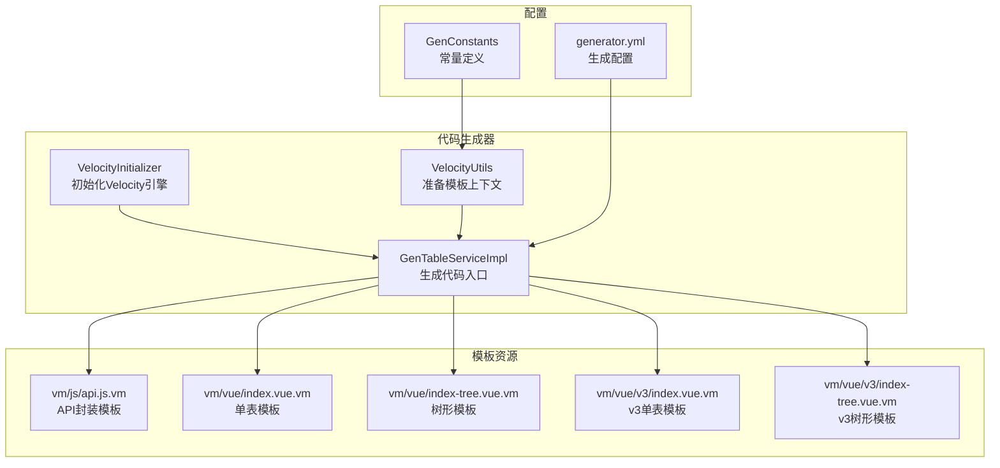
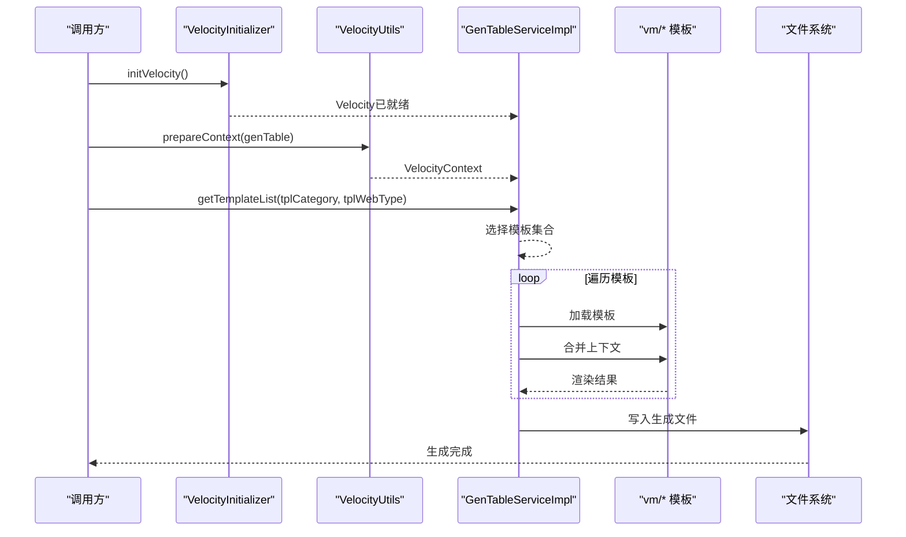
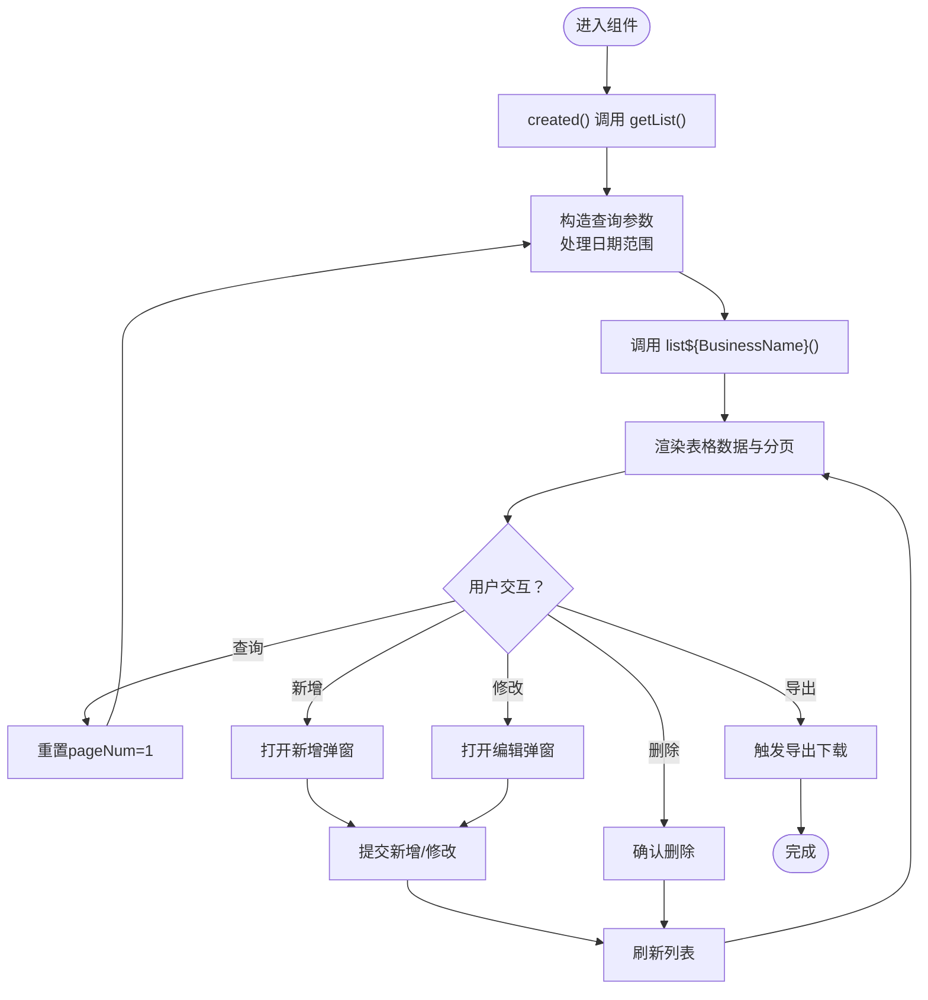
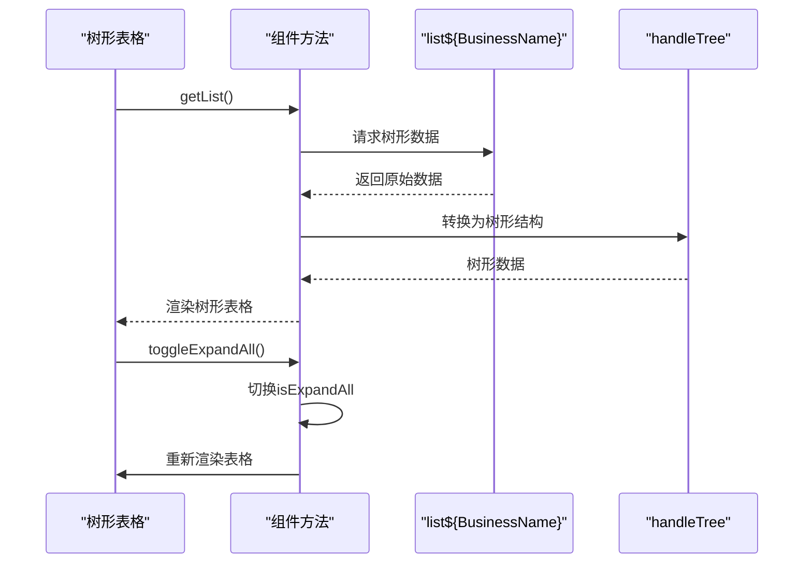
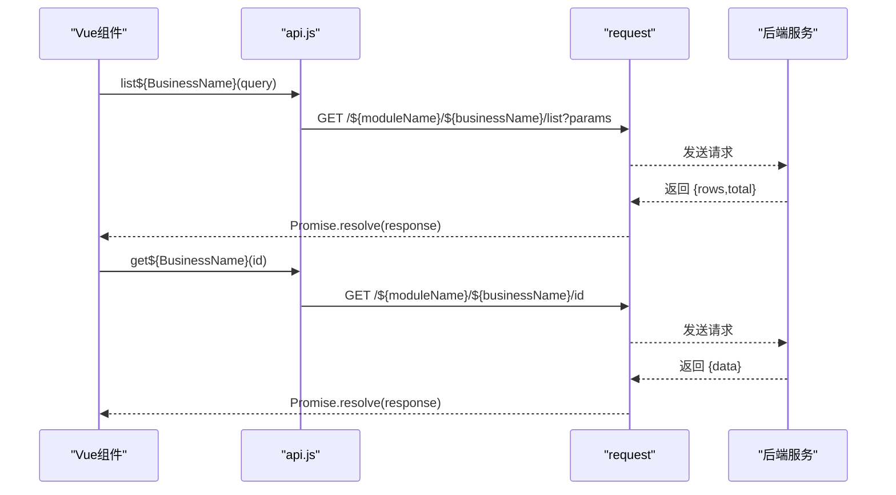
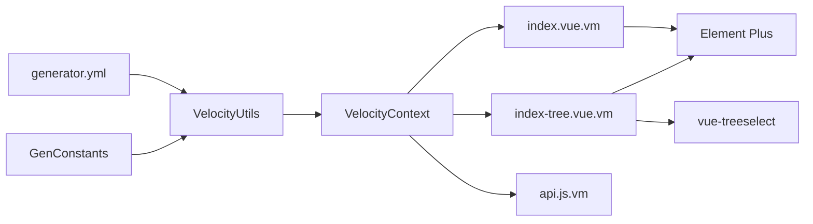

# Vue前端模板

<cite>
**本文引用的文件**
- [index.vue.vm](file://blog-generator/src/main/resources/vm/vue/index.vue.vm)
- [index-tree.vue.vm](file://blog-generator/src/main/resources/vm/vue/index-tree.vue.vm)
- [api.js.vm](file://blog-generator/src/main/resources/vm/js/api.js.vm)
- [generator.yml](file://blog-generator/src/main/resources/generator.yml)
- [VelocityUtils.java](file://blog-generator/src/main/java/blog/generator/util/VelocityUtils.java)
- [VelocityInitializer.java](file://blog-generator/src/main/java/blog/generator/util/VelocityInitializer.java)
- [GenTable.java](file://blog-generator/src/main/java/blog/generator/domain/GenTable.java)
- [GenTableColumn.java](file://blog-generator/src/main/java/blog/generator/domain/GenTableColumn.java)
- [GenConstants.java](file://blog-common/src/main/java/blog/common/constant/GenConstants.java)
- [GenConfig.java](file://blog-generator/src/main/java/blog/generator/config/GenConfig.java)
- [GenTableServiceImpl.java](file://blog-generator/src/main/java/blog/generator/service/GenTableServiceImpl.java)
- [index.vue.vm(v3)](file://blog-generator/src/main/resources/vm/vue/v3/index.vue.vm)
- [index-tree.vue.vm(v3)](file://blog-generator/src/main/resources/vm/vue/v3/index-tree.vue.vm)
</cite>

## 目录
1. [简介](#简介)
2. [项目结构](#项目结构)
3. [核心组件](#核心组件)
4. [架构总览](#架构总览)
5. [详细组件分析](#详细组件分析)
6. [依赖关系分析](#依赖关系分析)
7. [性能考虑](#性能考虑)
8. [故障排查指南](#故障排查指南)
9. [结论](#结论)
10. [附录](#附录)

## 简介
本技术文档面向Vue前端模板系统，聚焦于代码生成器如何通过Velocity模板引擎，自动输出符合Element Plus生态的Vue单文件组件与API封装。重点涵盖两类模板：
- index.vue.vm：适用于“单表 CRUD”场景，自动生成查询表单、表格、分页、增删改弹窗等完整界面与逻辑。
- index-tree.vue.vm：适用于“树形结构”场景，自动生成树形表格、父子关系选择、展开/折叠控制等复杂UI交互。

同时，文档还解释了API接口模板(api.js.vm)的设计思路、模板语法在代码生成中的应用（模板结构、数据绑定、事件处理、组件通信）、树形模板的特殊处理、动态内容生成（表格列、表单控件、按钮权限控制），以及前端模板的定制方法（样式、组件扩展、国际化）。

## 项目结构
该模板系统位于后端工程的代码生成模块中，模板资源集中于vm目录，Velocity工具类负责上下文准备与模板渲染，配置文件控制生成行为。

图表来源
- [VelocityInitializer.java:17-29](file://blog-generator/src/main/java/blog/generator/util/VelocityInitializer.java#L17-L29)
- [VelocityUtils.java:43-77](file://blog-generator/src/main/java/blog/generator/util/VelocityUtils.java#L43-L77)
- [GenTableServiceImpl.java:247-267](file://blog-generator/src/main/java/blog/generator/service/GenTableServiceImpl.java#L247-L267)
- [generator.yml:1-12](file://blog-generator/src/main/resources/generator.yml#L1-L12)
- [GenConstants.java:8-187](file://blog-common/src/main/java/blog/common/constant/GenConstants.java#L8-L187)

章节来源
- [VelocityInitializer.java:1-31](file://blog-generator/src/main/java/blog/generator/util/VelocityInitializer.java#L1-L31)
- [VelocityUtils.java:1-364](file://blog-generator/src/main/java/blog/generator/util/VelocityUtils.java#L1-L364)
- [GenTableServiceImpl.java:208-279](file://blog-generator/src/main/java/blog/generator/service/GenTableServiceImpl.java#L208-L279)
- [generator.yml:1-12](file://blog-generator/src/main/resources/generator.yml#L1-L12)
- [GenConstants.java:1-187](file://blog-common/src/main/java/blog/common/constant/GenConstants.java#L1-L187)

## 核心组件
- Velocity模板引擎：加载vm模板，合并上下文变量，输出目标代码。
- VelocityUtils：构建VelocityContext，注入业务表元信息、权限前缀、字典组、树形参数等。
- GenTable/GenTableColumn：承载数据库表与列的元数据，决定模板渲染细节。
- API模板：统一RESTful封装，便于前端直接调用。
- 配置中心：generator.yml与GenConfig，控制作者、包路径、表前缀、覆盖策略等。

章节来源
- [VelocityUtils.java:43-120](file://blog-generator/src/main/java/blog/generator/util/VelocityUtils.java#L43-L120)
- [GenTable.java:15-177](file://blog-generator/src/main/java/blog/generator/domain/GenTable.java#L15-L177)
- [GenTableColumn.java:12-348](file://blog-generator/src/main/java/blog/generator/domain/GenTableColumn.java#L12-L348)
- [api.js.vm:1-45](file://blog-generator/src/main/resources/vm/js/api.js.vm#L1-L45)
- [generator.yml:1-12](file://blog-generator/src/main/resources/generator.yml#L1-L12)
- [GenConfig.java:1-87](file://blog-generator/src/main/java/blog/generator/config/GenConfig.java#L1-L87)

## 架构总览
模板生成流程如下：初始化Velocity引擎 -> 准备模板上下文 -> 选择模板列表 -> 渲染模板 -> 写入目标文件。

图表来源
- [VelocityInitializer.java:17-29](file://blog-generator/src/main/java/blog/generator/util/VelocityInitializer.java#L17-L29)
- [VelocityUtils.java:129-154](file://blog-generator/src/main/java/blog/generator/util/VelocityUtils.java#L129-L154)
- [GenTableServiceImpl.java:247-267](file://blog-generator/src/main/java/blog/generator/service/GenTableServiceImpl.java#L247-L267)

章节来源
- [GenTableServiceImpl.java:208-279](file://blog-generator/src/main/java/blog/generator/service/GenTableServiceImpl.java#L208-L279)

## 详细组件分析

### index.vue.vm（单表模板）
- 模板结构
  - 顶部查询表单：根据列的htmlType与query标记动态生成输入/日期/下拉等控件；支持字典类型与日期范围查询。
  - 工具栏：新增、修改、删除、导出按钮，配合权限指令v-hasPermi。
  - 表格区域：根据列的list与htmlType生成列，支持日期格式化、图片预览、字典标签等。
  - 分页组件：基于total/pageNum/pageSize进行分页。
  - 弹窗表单：根据insert与superColumn规则生成表单项，支持多选/单选/复选/富文本/上传等控件。
  - 子表编辑：当存在子表时，生成子表表格与增删操作。
- 数据绑定与事件
  - 查询参数：queryParams（含分页与查询字段），daterangeXxx用于日期范围。
  - 表单参数：form，rules用于校验。
  - 方法：getList、handleQuery、resetQuery、handleAdd、handleUpdate、submitForm、handleDelete、handleExport等。
- 组件通信
  - 通过API模块导入list/get/add/update/del函数，实现与后端的HTTP通信。
  - 权限指令v-hasPermi控制按钮显隐。
- 动态内容生成
  - 表格列：根据column.list与htmlType动态生成列与渲染插槽。
  - 表单控件：根据column.htmlType与dictType生成对应控件。
  - 权限控制：根据permissionPrefix与权限指令生成按钮权限。
- 适用场景
  - 单表增删改查、带查询条件、导出、分页、字典联动、图片/文件上传、富文本编辑、主子表联动。

图表来源
- [index.vue.vm:428-601](file://blog-generator/src/main/resources/vm/vue/index.vue.vm#L428-L601)

章节来源
- [index.vue.vm:1-603](file://blog-generator/src/main/resources/vm/vue/index.vue.vm#L1-L603)

### index-tree.vue.vm（树形模板）
- 特殊处理
  - 树形表格：使用ElTable的树形属性，row-key、default-expand-all、tree-props配置。
  - 树形选择：使用@riophae/vue-treeselect组件，通过normalizer转换节点结构。
  - 展开/折叠：toggleExpandAll通过重新渲染表格实现全展开/折叠。
  - 树参数：从GenTable.options中提取treeCode、treeParentCode、treeName等。
- 模板结构
  - 查询表单与工具栏同单表模板。
  - 树形表格列：支持日期格式化、图片预览、字典标签。
  - 弹窗表单：包含树形父节点选择（treeselect）。
- 方法
  - getList：调用list${BusinessName}并将数据转换为树形结构。
  - normalizer：标准化节点id/label/children。
  - getTreeselect：生成treeselect选项树。
  - toggleExpandAll：切换展开/折叠。
- 适用场景
  - 组织架构、分类树、父子关系管理等树形数据的增删改查与层级展示。

图表来源
- [index-tree.vue.vm:356-397](file://blog-generator/src/main/resources/vm/vue/index-tree.vue.vm#L356-L397)
- [index-tree.vue.vm:444-450](file://blog-generator/src/main/resources/vm/vue/index-tree.vue.vm#L444-L450)

章节来源
- [index-tree.vue.vm:1-506](file://blog-generator/src/main/resources/vm/vue/index-tree.vue.vm#L1-L506)

### API接口模板（api.js.vm）
- 设计要点
  - 统一RESTful封装：list/get/add/update/del五个基础方法，分别映射GET/GET/POST/PUT/DELETE。
  - 参数传递：查询参数通过params传入，新增/修改通过data传入。
  - 路由约定：/模块名/业务名/列表、详情、新增、更新、删除。
- 适用性
  - 与index.vue.vm/index-tree.vue.vm配套使用，组件内直接import并调用。
  - 可扩展：如需拦截器、鉴权、错误处理，可在request模块中统一增强。

图表来源
- [api.js.vm:3-44](file://blog-generator/src/main/resources/vm/js/api.js.vm#L3-L44)

章节来源
- [api.js.vm:1-45](file://blog-generator/src/main/resources/vm/js/api.js.vm#L1-L45)

### 模板语法与数据绑定
- 模板语法
  - Velocity表达式：#foreach/#if/#set/#end用于循环与条件判断，动态生成HTML与JS片段。
  - 变量替换：${xxx}用于注入业务名、模块名、权限前缀、列信息等。
- 数据绑定
  - Vue v-model双向绑定：查询表单、弹窗表单、日期范围等。
  - El-Plus指令：v-hasPermi、v-show、:disabled等。
- 事件处理
  - @click/@keyup.enter等事件绑定到methods中的具体方法。
- 组件通信
  - 组件内部通过import引入API模块，实现与后端的HTTP通信。
  - 权限指令v-hasPermi控制按钮显隐，确保前端权限控制。

章节来源
- [index.vue.vm:3-603](file://blog-generator/src/main/resources/vm/vue/index.vue.vm#L3-L603)
- [index-tree.vue.vm:1-506](file://blog-generator/src/main/resources/vm/vue/index-tree.vue.vm#L1-L506)
- [api.js.vm:1-45](file://blog-generator/src/main/resources/vm/js/api.js.vm#L1-L45)

### 树形结构模板的特殊处理
- 树形数据转换
  - 通过handleTree将扁平数据转换为树形结构，供ElTable树形渲染使用。
- 树形选择器
  - 使用treeselect组件，normalizer标准化节点结构，支持父子关系选择。
- 展开/折叠控制
  - 通过isExpandAll与refreshTable实现全展开/折叠切换，避免渲染闪烁。
- 树参数注入
  - 从GenTable.options中读取treeCode、treeParentCode、treeName等，作为模板变量。

章节来源
- [index-tree.vue.vm:378-388](file://blog-generator/src/main/resources/vm/vue/index-tree.vue.vm#L378-L388)
- [index-tree.vue.vm:390-397](file://blog-generator/src/main/resources/vm/vue/index-tree.vue.vm#L390-L397)
- [index-tree.vue.vm:444-450](file://blog-generator/src/main/resources/vm/vue/index-tree.vue.vm#L444-L450)
- [VelocityUtils.java:86-103](file://blog-generator/src/main/java/blog/generator/util/VelocityUtils.java#L86-L103)

### 动态内容生成（表格列、表单控件、按钮权限）
- 表格列定义
  - 根据column.list与htmlType生成列，支持日期格式化、图片预览、字典标签等。
- 表单控件生成
  - 根据column.htmlType与dictType生成对应控件，如input/select/radio/checkbox/datetime/textarea等。
- 按钮权限控制
  - 根据permissionPrefix与v-hasPermi指令控制新增/修改/删除/导出按钮的显示与隐藏。

章节来源
- [index.vue.vm:116-172](file://blog-generator/src/main/resources/vm/vue/index.vue.vm#L116-L172)
- [index.vue.vm:185-351](file://blog-generator/src/main/resources/vm/vue/index.vue.vm#L185-L351)
- [index-tree.vue.vm:93-165](file://blog-generator/src/main/resources/vm/vue/index-tree.vue.vm#L93-L165)
- [index-tree.vue.vm:168-281](file://blog-generator/src/main/resources/vm/vue/index-tree.vue.vm#L168-L281)

### 前端模板定制方法
- 样式定制
  - 在Vue组件中通过style或外部CSS覆盖Element Plus样式，或引入主题变量。
- 组件扩展
  - 在模板中引入第三方组件（如treeselect），并在组件注册处声明。
- 国际化支持
  - 使用字典类型与dict-tag组件，结合后端字典数据实现标签本地化。
- 生成配置
  - generator.yml与GenConfig控制作者、包路径、表前缀、覆盖策略等，影响生成文件命名与路径。

章节来源
- [index-tree.vue.vm:287-288](file://blog-generator/src/main/resources/vm/vue/index-tree.vue.vm#L287-L288)
- [generator.yml:1-12](file://blog-generator/src/main/resources/generator.yml#L1-L12)
- [GenConfig.java:1-87](file://blog-generator/src/main/java/blog/generator/config/GenConfig.java#L1-L87)

## 依赖关系分析
- 模板依赖
  - index.vue.vm/index-tree.vue.vm依赖api.js.vm提供的HTTP封装。
  - 两者均依赖VelocityUtils注入的上下文变量（columns、businessName、moduleName、permissionPrefix、dicts等）。
- 运行时依赖
  - Element Plus UI库、@riophae/vue-treeselect（树形选择器）、字典标签组件等。
- 配置依赖
  - generator.yml与GenConstants定义生成行为与常量，VelocityUtils据此组装模板上下文。

图表来源
- [VelocityUtils.java:43-77](file://blog-generator/src/main/java/blog/generator/util/VelocityUtils.java#L43-L77)
- [index.vue.vm:356-356](file://blog-generator/src/main/resources/vm/vue/index.vue.vm#L356-L356)
- [index-tree.vue.vm:287-288](file://blog-generator/src/main/resources/vm/vue/index-tree.vue.vm#L287-L288)
- [generator.yml:1-12](file://blog-generator/src/main/resources/generator.yml#L1-L12)
- [GenConstants.java:8-187](file://blog-common/src/main/java/blog/common/constant/GenConstants.java#L8-L187)

章节来源
- [VelocityUtils.java:129-154](file://blog-generator/src/main/java/blog/generator/util/VelocityUtils.java#L129-L154)
- [GenConstants.java:1-187](file://blog-common/src/main/java/blog/common/constant/GenConstants.java#L1-L187)

## 性能考虑
- 渲染优化
  - 树形表格通过toggleExpandAll与refreshTable避免不必要的重复渲染。
  - 分页查询仅在必要时重置pageNum，减少无效请求。
- 数据处理
  - handleTree转换树形结构应在客户端进行，建议对大数据量场景做懒加载或服务端分页。
- 模板体积
  - 通过条件渲染与字典标签减少DOM节点数量，提升渲染效率。

## 故障排查指南
- 模板未生效
  - 检查VelocityInitializer是否正确初始化，确认模板路径与编码设置。
- 字典未显示
  - 确认GenTableColumn.dictType与GenConstants中HTML类型匹配，检查dicts注入。
- 树形数据异常
  - 检查GenTable.options中treeCode/treeParentCode/treeName配置，确认handleTree转换逻辑。
- 权限按钮不可见
  - 检查permissionPrefix与v-hasPermi指令使用是否正确。
- 生成文件路径异常
  - 检查generator.yml与GenConfig配置，确认包路径与表前缀设置。

章节来源
- [VelocityInitializer.java:17-29](file://blog-generator/src/main/java/blog/generator/util/VelocityInitializer.java#L17-L29)
- [VelocityUtils.java:250-275](file://blog-generator/src/main/java/blog/generator/util/VelocityUtils.java#L250-L275)
- [GenTable.java:130-142](file://blog-generator/src/main/java/blog/generator/domain/GenTable.java#L130-L142)
- [GenConfig.java:1-87](file://blog-generator/src/main/java/blog/generator/config/GenConfig.java#L1-L87)

## 结论
该Vue前端模板系统通过Velocity模板引擎与完善的上下文注入，实现了对单表与树形结构的高效代码生成。index.vue.vm与index-tree.vue.vm分别覆盖了常见的CRUD与树形管理场景，api.js.vm提供了统一的RESTful封装。借助权限指令、字典标签与可定制的生成配置，开发者可以快速产出高质量、可维护的前端界面与交互逻辑。

## 附录
- 生成流程参考
  - [GenTableServiceImpl.java:247-267](file://blog-generator/src/main/java/blog/generator/service/GenTableServiceImpl.java#L247-L267)
- 模板列表选择
  - [VelocityUtils.java:129-154](file://blog-generator/src/main/java/blog/generator/util/VelocityUtils.java#L129-L154)
- 常量与HTML类型
  - [GenConstants.java:8-187](file://blog-common/src/main/java/blog/common/constant/GenConstants.java#L8-L187)