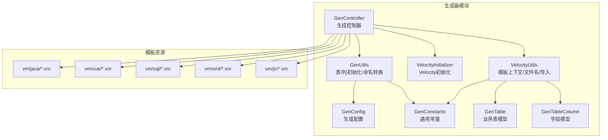
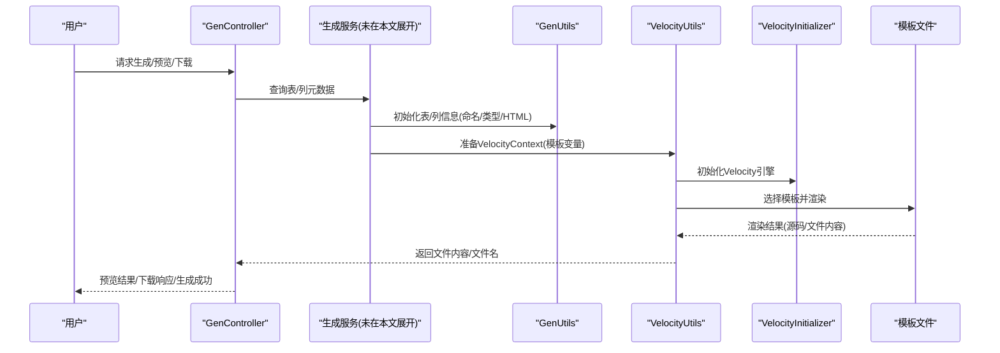
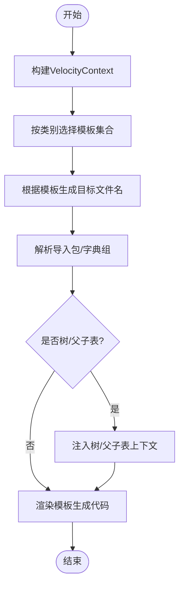
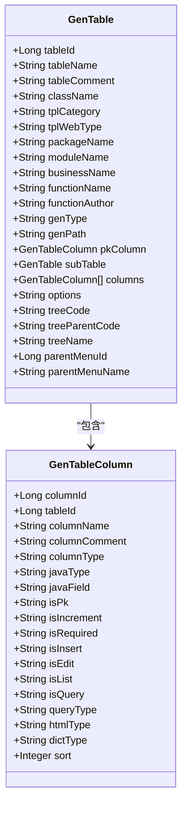
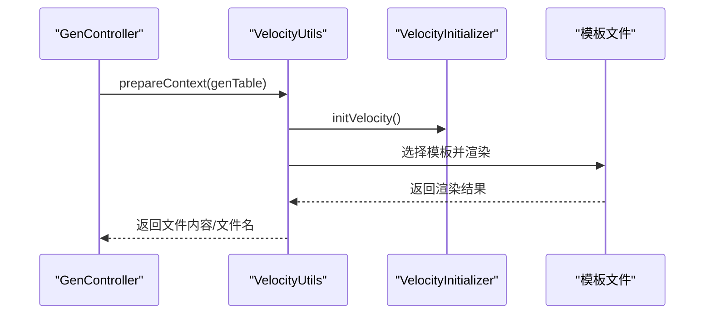
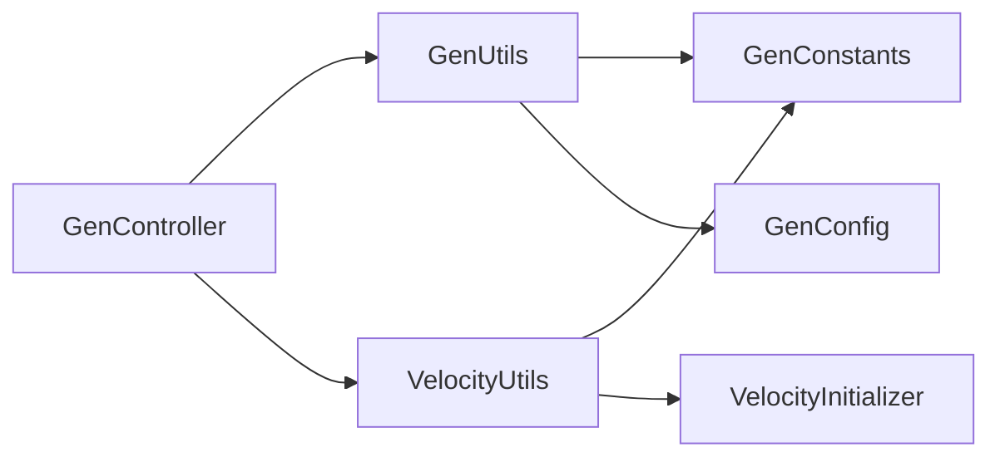

# 模板引擎系统

<cite>
**本文引用的文件**
- [VelocityUtils.java](file://blog-generator/src/main/java/blog/generator/util/VelocityUtils.java)
- [VelocityInitializer.java](file://blog-generator/src/main/java/blog/generator/util/VelocityInitializer.java)
- [GenUtils.java](file://blog-generator/src/main/java/blog/generator/util/GenUtils.java)
- [GenConfig.java](file://blog-generator/src/main/java/blog/generator/config/GenConfig.java)
- [GenTable.java](file://blog-generator/src/main/java/blog/generator/domain/GenTable.java)
- [GenTableColumn.java](file://blog-generator/src/main/java/blog/generator/domain/GenTableColumn.java)
- [GenController.java](file://blog-generator/src/main/java/blog/generator/controller/GenController.java)
- [GenConstants.java](file://blog-common/src/main/java/blog/common/constant/GenConstants.java)
- [generator.yml](file://blog-generator/src/main/resources/generator.yml)
- [domain.java.vm](file://blog-generator/src/main/resources/vm/java/domain.java.vm)
- [controller.java.vm](file://blog-generator/src/main/resources/vm/java/controller.java.vm)
- [mapper.java.vm](file://blog-generator/src/main/resources/vm/java/mapper.java.vm)
- [service.java.vm](file://blog-generator/src/main/resources/vm/java/service.java.vm)
- [index.vue.vm](file://blog-generator/src/main/resources/vm/vue/index.vue.vm)
- [index-tree.vue.vm](file://blog-generator/src/main/resources/vm/vue/index-tree.vue.vm)
</cite>

## 目录
1. [简介](#简介)
2. [项目结构](#项目结构)
3. [核心组件](#核心组件)
4. [架构总览](#架构总览)
5. [详细组件分析](#详细组件分析)
6. [依赖分析](#依赖分析)
7. [性能考虑](#性能考虑)
8. [故障排查指南](#故障排查指南)
9. [结论](#结论)
10. [附录](#附录)

## 简介
本系统基于 Velocity 模板引擎实现代码与界面的自动化生成，支持 Java 后端实体、DTO、VO、Mapper、Service、Controller、MyBatis XML、SQL 脚本以及 Vue 前端页面与 API 的一键生成。通过统一的模板变量体系与可配置的生成策略，开发者可以快速完成 CRUD、树形结构、主子表等多场景的代码骨架生成，并支持权限前缀、字典类型、树形字段、父子表联动等高级特性。

## 项目结构
模板引擎位于 blog-generator 模块，核心由以下部分组成：
- 配置与常量：生成配置读取、通用常量定义
- 数据模型：GenTable、GenTableColumn 表与字段元数据
- 工具类：Velocity 初始化、模板上下文准备、文件名与导入包解析、字典与树形字段处理
- 控制器：对外暴露生成、预览、下载、同步数据库等接口
- 模板资源：vm/java、vm/vue、vm/sql、vm/js、vm/xml 等模板文件

**图表来源**
- [GenController.java:1-241](file://blog-generator/src/main/java/blog/generator/controller/GenController.java#L1-L241)
- [VelocityUtils.java:1-364](file://blog-generator/src/main/java/blog/generator/util/VelocityUtils.java#L1-L364)
- [VelocityInitializer.java:1-31](file://blog-generator/src/main/java/blog/generator/util/VelocityInitializer.java#L1-L31)
- [GenUtils.java:1-223](file://blog-generator/src/main/java/blog/generator/util/GenUtils.java#L1-L223)
- [GenConfig.java:1-87](file://blog-generator/src/main/java/blog/generator/config/GenConfig.java#L1-L87)
- [GenConstants.java:1-187](file://blog-common/src/main/java/blog/common/constant/GenConstants.java#L1-L187)
- [GenTable.java:1-177](file://blog-generator/src/main/java/blog/generator/domain/GenTable.java#L1-L177)
- [GenTableColumn.java:1-348](file://blog-generator/src/main/java/blog/generator/domain/GenTableColumn.java#L1-L348)

**章节来源**
- [GenController.java:1-241](file://blog-generator/src/main/java/blog/generator/controller/GenController.java#L1-L241)
- [VelocityUtils.java:1-364](file://blog-generator/src/main/java/blog/generator/util/VelocityUtils.java#L1-L364)
- [VelocityInitializer.java:1-31](file://blog-generator/src/main/java/blog/generator/util/VelocityInitializer.java#L1-L31)
- [GenUtils.java:1-223](file://blog-generator/src/main/java/blog/generator/util/GenUtils.java#L1-L223)
- [GenConfig.java:1-87](file://blog-generator/src/main/java/blog/generator/config/GenConfig.java#L1-L87)
- [GenConstants.java:1-187](file://blog-common/src/main/java/blog/common/constant/GenConstants.java#L1-L187)
- [GenTable.java:1-177](file://blog-generator/src/main/java/blog/generator/domain/GenTable.java#L1-L177)
- [GenTableColumn.java:1-348](file://blog-generator/src/main/java/blog/generator/domain/GenTableColumn.java#L1-L348)

## 核心组件
- 生成配置 GenConfig：从 generator.yml 读取作者、包路径、表前缀、是否允许覆盖等配置。
- 通用常量 GenConstants：定义模板类别（crud/tree/sub）、HTML 输入类型、Java 类型映射、查询方式、字段过滤清单等。
- 数据模型 GenTable/GenTableColumn：封装表与字段元数据，包含是否主键、是否必填、是否列表、是否查询、HTML 类型、字典类型、排序等。
- 生成工具 GenUtils：负责表名/业务名转换、列类型推断、HTML 类型与查询类型设置、字段白名单等。
- 模板工具 VelocityUtils：构建 VelocityContext、选择模板列表、生成文件名、导入包、字典组、树形字段、父子表上下文等。
- Velocity 初始化 VelocityInitializer：加载 ClasspathResourceLoader 并初始化 Velocity 引擎。
- 控制器 GenController：提供生成列表、数据库表查询、导入/创建表、预览、下载、生成到本地、同步数据库、批量生成等接口。

**章节来源**
- [GenConfig.java:1-87](file://blog-generator/src/main/java/blog/generator/config/GenConfig.java#L1-L87)
- [GenConstants.java:1-187](file://blog-common/src/main/java/blog/common/constant/GenConstants.java#L1-L187)
- [GenTable.java:1-177](file://blog-generator/src/main/java/blog/generator/domain/GenTable.java#L1-L177)
- [GenTableColumn.java:1-348](file://blog-generator/src/main/java/blog/generator/domain/GenTableColumn.java#L1-L348)
- [GenUtils.java:1-223](file://blog-generator/src/main/java/blog/generator/util/GenUtils.java#L1-L223)
- [VelocityUtils.java:1-364](file://blog-generator/src/main/java/blog/generator/util/VelocityUtils.java#L1-L364)
- [VelocityInitializer.java:1-31](file://blog-generator/src/main/java/blog/generator/util/VelocityInitializer.java#L1-L31)
- [GenController.java:1-241](file://blog-generator/src/main/java/blog/generator/controller/GenController.java#L1-L241)

## 架构总览
模板引擎的执行链路如下：
- 控制器接收请求，调用服务层进行表/列元数据处理与生成策略决策
- 生成工具根据表结构推断列类型与页面控件类型
- 模板工具准备 VelocityContext，按模板类别选择模板集合
- Velocity 渲染模板，生成目标文件内容
- 支持预览返回 Map、下载打包 zip、或直接写入本地磁盘（受配置限制）

**图表来源**
- [GenController.java:170-241](file://blog-generator/src/main/java/blog/generator/controller/GenController.java#L170-L241)
- [GenUtils.java:17-114](file://blog-generator/src/main/java/blog/generator/util/GenUtils.java#L17-L114)
- [VelocityUtils.java:43-154](file://blog-generator/src/main/java/blog/generator/util/VelocityUtils.java#L43-L154)
- [VelocityInitializer.java:17-29](file://blog-generator/src/main/java/blog/generator/util/VelocityInitializer.java#L17-L29)

**章节来源**
- [GenController.java:170-241](file://blog-generator/src/main/java/blog/generator/controller/GenController.java#L170-L241)
- [GenUtils.java:17-114](file://blog-generator/src/main/java/blog/generator/util/GenUtils.java#L17-L114)
- [VelocityUtils.java:43-154](file://blog-generator/src/main/java/blog/generator/util/VelocityUtils.java#L43-L154)
- [VelocityInitializer.java:17-29](file://blog-generator/src/main/java/blog/generator/util/VelocityInitializer.java#L17-L29)

## 详细组件分析

### Velocity 模板上下文与文件名生成
- 上下文构建：prepareContext 将表名、功能名、类名、包名、作者、时间、主键列、导入包、权限前缀、列集合、字典组、菜单/树/父子表上下文注入 VelocityContext。
- 模板选择：getTemplateList 根据模板类别与前端类型选择 Java/SQL/JS/XML/Vue 模板集合。
- 文件名生成：getFileName 根据模板类型与表信息生成 Java、XML、Vue、API、SQL 等目标文件路径。
- 导入包与字典：getImportList 基于列类型生成 import 列表；getDicts 基于列的 dictType 生成字典组。
- 树形与父子表：setTreeVelocityContext/setSubVelocityContext 注入树编码、父编码、名称、展开列、子表上下文等。

**图表来源**
- [VelocityUtils.java:43-207](file://blog-generator/src/main/java/blog/generator/util/VelocityUtils.java#L43-L207)
- [VelocityUtils.java:226-275](file://blog-generator/src/main/java/blog/generator/util/VelocityUtils.java#L226-L275)
- [VelocityUtils.java:86-120](file://blog-generator/src/main/java/blog/generator/util/VelocityUtils.java#L86-L120)

**章节来源**
- [VelocityUtils.java:43-207](file://blog-generator/src/main/java/blog/generator/util/VelocityUtils.java#L43-L207)
- [VelocityUtils.java:226-275](file://blog-generator/src/main/java/blog/generator/util/VelocityUtils.java#L226-L275)
- [VelocityUtils.java:86-120](file://blog-generator/src/main/java/blog/generator/util/VelocityUtils.java#L86-L120)

### 生成配置与常量
- 生成配置：从 generator.yml 读取作者、包路径、自动去除表前缀、表前缀、是否允许覆盖等。
- 通用常量：模板类别、HTML 控件类型、Java 类型映射、查询方式、字段过滤清单、树与基类字段集合等。

**章节来源**
- [GenConfig.java:1-87](file://blog-generator/src/main/java/blog/generator/config/GenConfig.java#L1-L87)
- [generator.yml:1-12](file://blog-generator/src/main/resources/generator.yml#L1-L12)
- [GenConstants.java:1-187](file://blog-common/src/main/java/blog/common/constant/GenConstants.java#L1-L187)

### 数据模型与初始化
- GenTable：封装表元数据、模板类别、前端类型、包名、模块名、业务名、功能名、作者、生成方式、生成路径、主键列、子表、列集合、树字段、菜单字段等。
- GenTableColumn：封装列元数据、Java 类型、Java 字段名、是否主键/自增/必填/插入/编辑/列表/查询、查询方式、HTML 类型、字典类型、排序、是否基类字段等。
- GenUtils：表名转类名、业务名提取、列类型推断、HTML 类型与查询类型设置、字段白名单、表前缀处理等。

**图表来源**
- [GenTable.java:23-177](file://blog-generator/src/main/java/blog/generator/domain/GenTable.java#L23-L177)
- [GenTableColumn.java:12-348](file://blog-generator/src/main/java/blog/generator/domain/GenTableColumn.java#L12-L348)

**章节来源**
- [GenTable.java:23-177](file://blog-generator/src/main/java/blog/generator/domain/GenTable.java#L23-L177)
- [GenTableColumn.java:12-348](file://blog-generator/src/main/java/blog/generator/domain/GenTableColumn.java#L12-L348)
- [GenUtils.java:21-114](file://blog-generator/src/main/java/blog/generator/util/GenUtils.java#L21-L114)

### 模板类型与用途
- Java 实体模板：生成领域对象，包含注解、字段、逻辑删除、乐观锁等特性识别。
- DTO/VO 模板：生成传输与展示对象，配合导入包与注解生成。
- Mapper 模板：生成 MyBatis Plus Mapper 接口。
- Service 接口模板：生成业务接口，包含分页查询、列表查询、增删改校验等方法签名。
- Controller 模板：生成 REST 控制器，包含权限注解、分页/列表/导出/增删改等接口。
- Vue 前端模板：生成 CRUD/树形/主子表视图，包含查询表单、列表、弹窗表单、分页、字典渲染、树形组件等。
- SQL 脚本模板：生成菜单/权限 SQL。
- XML 映射模板：生成 MyBatis XML 映射文件。

**章节来源**
- [domain.java.vm:1-57](file://blog-generator/src/main/resources/vm/java/domain.java.vm#L1-L57)
- [controller.java.vm:1-115](file://blog-generator/src/main/resources/vm/java/controller.java.vm#L1-L115)
- [mapper.java.vm:1-16](file://blog-generator/src/main/resources/vm/java/mapper.java.vm#L1-L16)
- [service.java.vm:1-74](file://blog-generator/src/main/resources/vm/java/service.java.vm#L1-L74)
- [index.vue.vm:1-603](file://blog-generator/src/main/resources/vm/vue/index.vue.vm#L1-L603)
- [index-tree.vue.vm:1-506](file://blog-generator/src/main/resources/vm/vue/index-tree.vue.vm#L1-L506)

### 模板变量与数据绑定
- 表信息变量：表名、功能名、类名、模块名、业务名、包名、作者、时间、主键列、权限前缀、表对象、列集合、字典组等。
- 字段信息变量：列名、注释、Java 类型、Java 字段名、是否主键/自增/必填/插入/编辑/列表/查询、HTML 类型、字典类型、排序等。
- 生成配置变量：作者、包路径、自动去除表前缀、表前缀、是否允许覆盖等。
- 树形变量：树编码字段、树父编码字段、树名称字段、展开列索引等。
- 父子表变量：子表对象、子表名、子表外键名、子表类名、子表类名小写、子表导入包等。

**章节来源**
- [VelocityUtils.java:43-120](file://blog-generator/src/main/java/blog/generator/util/VelocityUtils.java#L43-L120)
- [GenTable.java:23-177](file://blog-generator/src/main/java/blog/generator/domain/GenTable.java#L23-L177)
- [GenTableColumn.java:12-348](file://blog-generator/src/main/java/blog/generator/domain/GenTableColumn.java#L12-L348)
- [GenConfig.java:1-87](file://blog-generator/src/main/java/blog/generator/config/GenConfig.java#L1-L87)

### 模板继承与复用机制
- 模板组合：根据模板类别（crud/tree/sub）动态选择模板集合，实现不同场景的模板组合。
- 条件渲染：模板中广泛使用条件判断（如字段是否查询、是否列表、HTML 类型、字典类型等）实现按需渲染。
- 公共模板抽取：通过统一的上下文变量与工具函数，减少重复逻辑，提升模板复用性。

**章节来源**
- [VelocityUtils.java:129-154](file://blog-generator/src/main/java/blog/generator/util/VelocityUtils.java#L129-L154)
- [index.vue.vm:4-63](file://blog-generator/src/main/resources/vm/vue/index.vue.vm#L4-L63)
- [index-tree.vue.vm:4-63](file://blog-generator/src/main/resources/vm/vue/index-tree.vue.vm#L4-L63)

### 模板渲染执行流程
- 上下文构建：prepareContext 注入表/列/树/父子表等上下文。
- 模板选择：getTemplateList 根据类别与前端类型选择模板。
- 文件名解析：getFileName 生成目标文件路径。
- 渲染输出：Velocity 渲染模板，生成代码内容。
- 输出方式：预览返回 Map、下载返回 zip、生成到本地受配置限制。

**图表来源**
- [GenController.java:175-204](file://blog-generator/src/main/java/blog/generator/controller/GenController.java#L175-L204)
- [VelocityUtils.java:43-77](file://blog-generator/src/main/java/blog/generator/util/VelocityUtils.java#L43-L77)
- [VelocityInitializer.java:17-29](file://blog-generator/src/main/java/blog/generator/util/VelocityInitializer.java#L17-L29)

**章节来源**
- [GenController.java:175-204](file://blog-generator/src/main/java/blog/generator/controller/GenController.java#L175-L204)
- [VelocityUtils.java:43-77](file://blog-generator/src/main/java/blog/generator/util/VelocityUtils.java#L43-L77)
- [VelocityInitializer.java:17-29](file://blog-generator/src/main/java/blog/generator/util/VelocityInitializer.java#L17-L29)

### 模板定制与扩展指南
- 自定义模板：在 vm/java、vm/vue、vm/sql、vm/js、vm/xml 下新增 vm 文件，遵循现有变量命名与条件渲染模式。
- 模板参数配置：通过 generator.yml 调整作者、包路径、表前缀、是否允许覆盖等全局配置。
- 生成规则调整：在 GenUtils 中扩展列类型推断与 HTML 类型映射，在 VelocityUtils 中扩展上下文变量与模板选择逻辑。
- 权限与菜单：通过 options 字段传入树形字段与菜单字段，VelocityUtils 解析后注入上下文。

**章节来源**
- [generator.yml:1-12](file://blog-generator/src/main/resources/generator.yml#L1-L12)
- [GenUtils.java:17-114](file://blog-generator/src/main/java/blog/generator/util/GenUtils.java#L17-L114)
- [VelocityUtils.java:79-120](file://blog-generator/src/main/java/blog/generator/util/VelocityUtils.java#L79-L120)

## 依赖分析
- 组件耦合：控制器依赖生成工具与模板工具；模板工具依赖常量与配置；生成工具依赖常量与配置。
- 外部依赖：Velocity 引擎、Spring 安全注解、Apache Commons IO、FastJSON2、MyBatis Plus 基类等。
- 潜在风险：模板变量缺失可能导致渲染失败；配置错误（如 allowOverwrite）会阻止本地生成。

**图表来源**
- [GenController.java:1-241](file://blog-generator/src/main/java/blog/generator/controller/GenController.java#L1-L241)
- [GenUtils.java:1-223](file://blog-generator/src/main/java/blog/generator/util/GenUtils.java#L1-L223)
- [VelocityUtils.java:1-364](file://blog-generator/src/main/java/blog/generator/util/VelocityUtils.java#L1-L364)
- [VelocityInitializer.java:1-31](file://blog-generator/src/main/java/blog/generator/util/VelocityInitializer.java#L1-L31)
- [GenConfig.java:1-87](file://blog-generator/src/main/java/blog/generator/config/GenConfig.java#L1-L87)
- [GenConstants.java:1-187](file://blog-common/src/main/java/blog/common/constant/GenConstants.java#L1-L187)

**章节来源**
- [GenController.java:1-241](file://blog-generator/src/main/java/blog/generator/controller/GenController.java#L1-L241)
- [GenUtils.java:1-223](file://blog-generator/src/main/java/blog/generator/util/GenUtils.java#L1-L223)
- [VelocityUtils.java:1-364](file://blog-generator/src/main/java/blog/generator/util/VelocityUtils.java#L1-L364)
- [VelocityInitializer.java:1-31](file://blog-generator/src/main/java/blog/generator/util/VelocityInitializer.java#L1-L31)
- [GenConfig.java:1-87](file://blog-generator/src/main/java/blog/generator/config/GenConfig.java#L1-L87)
- [GenConstants.java:1-187](file://blog-common/src/main/java/blog/common/constant/GenConstants.java#L1-L187)

## 性能考虑
- 模板数量与渲染次数：模板越多，渲染耗时越长；建议按需选择模板类别，避免不必要的模板渲染。
- 字典与导入包解析：字典组与导入包在上下文中一次性计算，避免重复解析。
- 生成路径与覆盖策略：本地生成受 allowOverwrite 限制，建议在开发环境谨慎开启覆盖以避免频繁 IO。
- 大批量生成：批量生成时优先使用下载 zip 方式，减少多次 IO 操作。

## 故障排查指南
- 无法初始化 Velocity：检查 VelocityInitializer 的 ClasspathResourceLoader 配置与字符集设置。
- 模板变量缺失：检查 prepareContext 是否正确注入变量，特别是树形与父子表上下文。
- 生成文件路径异常：核对 getFileName 的路径拼接逻辑与模块/业务名映射。
- 本地生成被拒绝：确认 generator.yml 中 allowOverwrite 配置，以及控制器中对该配置的判断。
- 字典/导入包未生效：检查 getDicts 与 getImportList 的过滤条件与列属性。

**章节来源**
- [VelocityInitializer.java:17-29](file://blog-generator/src/main/java/blog/generator/util/VelocityInitializer.java#L17-L29)
- [VelocityUtils.java:43-120](file://blog-generator/src/main/java/blog/generator/util/VelocityUtils.java#L43-L120)
- [GenController.java:198-204](file://blog-generator/src/main/java/blog/generator/controller/GenController.java#L198-L204)
- [generator.yml:11-12](file://blog-generator/src/main/resources/generator.yml#L11-L12)

## 结论
该模板引擎系统通过统一的配置、常量与数据模型，结合 Velocity 的强大渲染能力，实现了对 Java 后端与 Vue 前端的高效生成。其可配置性强、模板复用度高，适合在多场景（CRUD、树形、主子表）下快速产出高质量代码骨架。建议在团队内规范模板变量命名与条件渲染逻辑，确保模板的可维护性与一致性。

## 附录
- 生成接口一览
  - 预览：GET /tool/gen/preview/{tableId}
  - 下载：GET /tool/gen/download/{tableName}
  - 生成到本地：GET /tool/gen/genCode/{tableName}
  - 同步数据库：GET /tool/gen/synchDb/{tableName}
  - 批量生成：GET /tool/gen/batchGenCode?tables={names}

**章节来源**
- [GenController.java:175-227](file://blog-generator/src/main/java/blog/generator/controller/GenController.java#L175-L227)