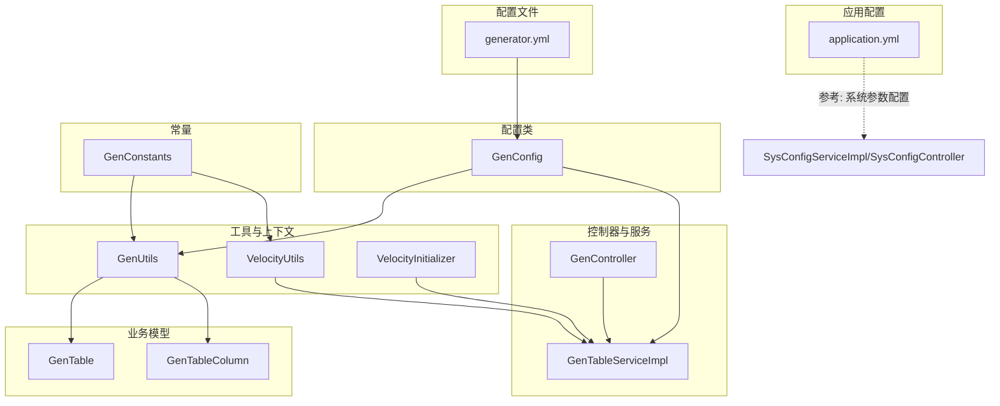
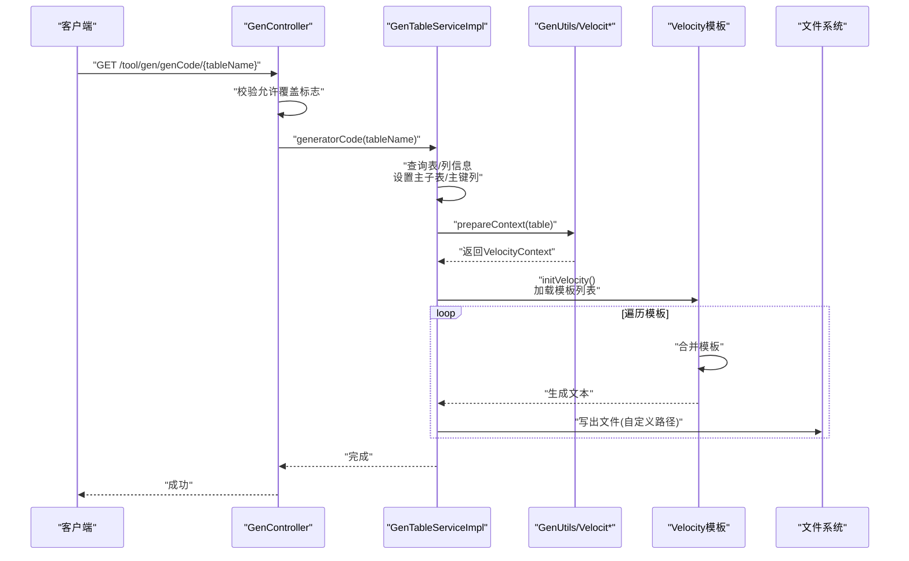
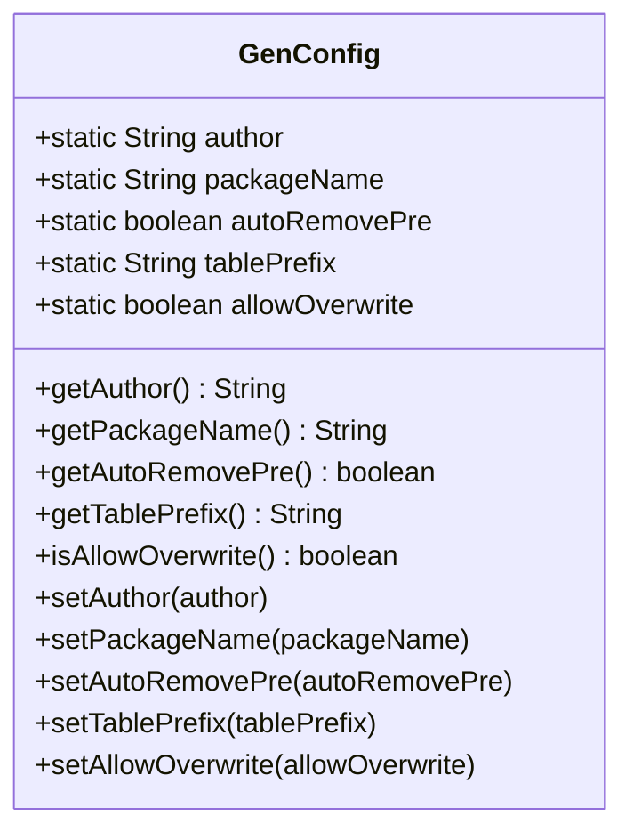
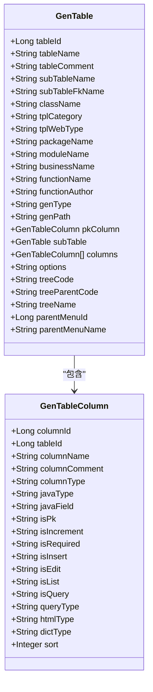
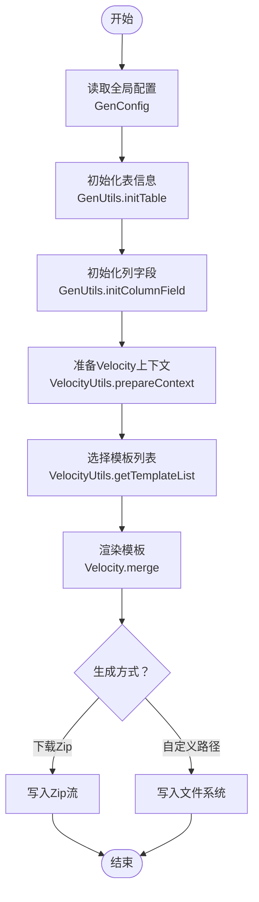
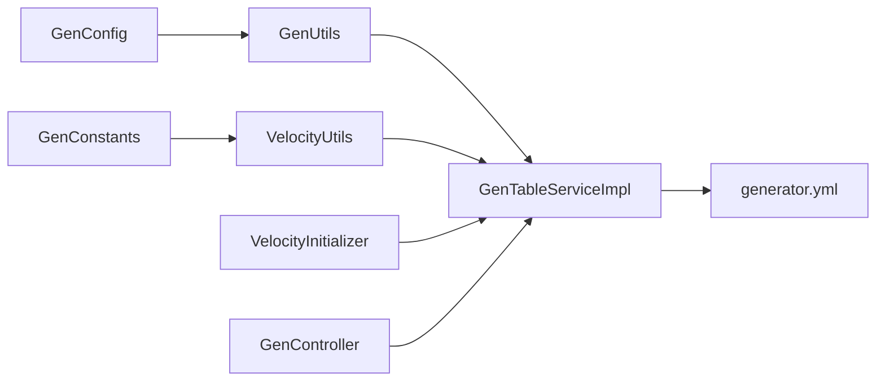

# 配置管理

<cite>
**本文引用的文件**
- [generator.yml](file://blog-generator/src/main/resources/generator.yml)
- [GenConfig.java](file://blog-generator/src/main/java/blog/generator/config/GenConfig.java)
- [GenUtils.java](file://blog-generator/src/main/java/blog/generator/util/GenUtils.java)
- [GenTable.java](file://blog-generator/src/main/java/blog/generator/domain/GenTable.java)
- [GenTableColumn.java](file://blog-generator/src/main/java/blog/generator/domain/GenTableColumn.java)
- [GenConstants.java](file://blog-common/src/main/java/blog/common/constant/GenConstants.java)
- [GenController.java](file://blog-generator/src/main/java/blog/generator/controller/GenController.java)
- [GenTableServiceImpl.java](file://blog-generator/src/main/java/blog/generator/service/GenTableServiceImpl.java)
- [VelocityInitializer.java](file://blog-generator/src/main/java/blog/generator/util/VelocityInitializer.java)
- [VelocityUtils.java](file://blog-generator/src/main/java/blog/generator/util/VelocityUtils.java)
- [domain.java.vm](file://blog-generator/src/main/resources/vm/java/domain.java.vm)
- [application.yml](file://blog-admin/src/main/resources/application.yml)
- [SysConfigServiceImpl.java](file://blog-system/src/main/java/blog/system/service/impl/SysConfigServiceImpl.java)
- [SysConfigController.java](file://blog-admin/src/main/java/blog/web/controller/system/SysConfigController.java)
</cite>

## 目录
1. [简介](#简介)
2. [项目结构](#项目结构)
3. [核心组件](#核心组件)
4. [架构总览](#架构总览)
5. [详细组件分析](#详细组件分析)
6. [依赖关系分析](#依赖关系分析)
7. [性能考量](#性能考量)
8. [故障排查指南](#故障排查指南)
9. [结论](#结论)
10. [附录](#附录)

## 简介
本文件面向“代码生成配置管理”的技术文档，围绕 generator.yml 配置文件与 GenConfig 配置类展开，系统阐述以下内容：
- generator.yml 的结构与关键配置项：作者、包名前缀、表前缀处理、覆盖策略等
- GenConfig 的实现：配置读取、默认值、校验与暴露方式
- 生成选项配置：模板类型、前端类型、生成路径、覆盖控制等
- 配置优先级与覆盖机制：全局配置、表级配置、用户自定义配置的多层体系
- 动态更新与热加载：变更检测、重新加载、生效验证
- 最佳实践与常见问题：性能、安全、兼容性建议

## 项目结构
与配置管理直接相关的模块与文件如下：
- 配置文件：generator.yml（位于 generator 模块 resources）
- 配置类：GenConfig（位于 generator 模块 config）
- 工具与上下文：GenUtils、VelocityUtils、VelocityInitializer（位于 generator 模块 util）
- 业务模型：GenTable、GenTableColumn（位于 generator 模块 domain）
- 控制器与服务：GenController、GenTableServiceImpl（位于 generator 模块 controller 与 service）
- 常量：GenConstants（位于 common 模块）
- 应用配置：application.yml（位于 admin 模块 resources）
- 参考：系统参数配置（SysConfigServiceImpl、SysConfigController，位于 system 模块）

图表来源
- [generator.yml:1-12](file://blog-generator/src/main/resources/generator.yml#L1-L12)
- [GenConfig.java:1-87](file://blog-generator/src/main/java/blog/generator/config/GenConfig.java#L1-L87)
- [GenUtils.java:1-223](file://blog-generator/src/main/java/blog/generator/util/GenUtils.java#L1-L223)
- [VelocityUtils.java:1-364](file://blog-generator/src/main/java/blog/generator/util/VelocityUtils.java#L1-L364)
- [VelocityInitializer.java:1-31](file://blog-generator/src/main/java/blog/generator/util/VelocityInitializer.java#L1-L31)
- [GenTable.java:1-177](file://blog-generator/src/main/java/blog/generator/domain/GenTable.java#L1-L177)
- [GenTableColumn.java:1-348](file://blog-generator/src/main/java/blog/generator/domain/GenTableColumn.java#L1-L348)
- [GenController.java:1-241](file://blog-generator/src/main/java/blog/generator/controller/GenController.java#L1-L241)
- [GenTableServiceImpl.java:1-470](file://blog-generator/src/main/java/blog/generator/service/GenTableServiceImpl.java#L1-L470)
- [GenConstants.java:1-187](file://blog-common/src/main/java/blog/common/constant/GenConstants.java#L1-L187)
- [application.yml:1-161](file://blog-admin/src/main/resources/application.yml#L1-L161)
- [SysConfigServiceImpl.java:1-167](file://blog-system/src/main/java/blog/system/service/impl/SysConfigServiceImpl.java#L1-L167)
- [SysConfigController.java:100-123](file://blog-admin/src/main/java/blog/web/controller/system/SysConfigController.java#L100-L123)

章节来源
- [generator.yml:1-12](file://blog-generator/src/main/resources/generator.yml#L1-L12)
- [GenConfig.java:1-87](file://blog-generator/src/main/java/blog/generator/config/GenConfig.java#L1-L87)
- [GenUtils.java:1-223](file://blog-generator/src/main/java/blog/generator/util/GenUtils.java#L1-L223)
- [GenTable.java:1-177](file://blog-generator/src/main/java/blog/generator/domain/GenTable.java#L1-L177)
- [GenTableColumn.java:1-348](file://blog-generator/src/main/java/blog/generator/domain/GenTableColumn.java#L1-L348)
- [GenConstants.java:1-187](file://blog-common/src/main/java/blog/common/constant/GenConstants.java#L1-L187)
- [GenController.java:1-241](file://blog-generator/src/main/java/blog/generator/controller/GenController.java#L1-L241)
- [GenTableServiceImpl.java:1-470](file://blog-generator/src/main/java/blog/generator/service/GenTableServiceImpl.java#L1-L470)
- [VelocityUtils.java:1-364](file://blog-generator/src/main/java/blog/generator/util/VelocityUtils.java#L1-L364)
- [VelocityInitializer.java:1-31](file://blog-generator/src/main/java/blog/generator/util/VelocityInitializer.java#L1-L31)
- [application.yml:1-161](file://blog-admin/src/main/resources/application.yml#L1-L161)
- [SysConfigServiceImpl.java:1-167](file://blog-system/src/main/java/blog/system/service/impl/SysConfigServiceImpl.java#L1-L167)
- [SysConfigController.java:100-123](file://blog-admin/src/main/java/blog/web/controller/system/SysConfigController.java#L100-L123)

## 核心组件
- generator.yml：定义全局生成配置，如作者、包名前缀、自动去除表前缀、表前缀列表、是否允许覆盖本地生成等。
- GenConfig：将 generator.yml 中的配置映射为静态字段，提供 getter/setter，并通过注解完成属性绑定与加载。
- GenUtils：负责表名/业务名转换、模块名提取、列字段初始化、HTML/Java类型映射、表前缀处理等。
- GenTable/GenTableColumn：持久化生成配置的业务模型，包含模板类别、前端类型、包路径、模块名、业务名、作者、生成方式、生成路径、选项等。
- VelocityUtils/VelocityInitializer：模板上下文准备与 Velocity 引擎初始化，决定模板选择与文件输出路径。
- GenController/GenTableServiceImpl：对外提供生成接口，支持预览、下载、自定义路径生成、批量生成、同步数据库等；对内解析模板、渲染并写出文件。

章节来源
- [generator.yml:1-12](file://blog-generator/src/main/resources/generator.yml#L1-L12)
- [GenConfig.java:1-87](file://blog-generator/src/main/java/blog/generator/config/GenConfig.java#L1-L87)
- [GenUtils.java:1-223](file://blog-generator/src/main/java/blog/generator/util/GenUtils.java#L1-L223)
- [GenTable.java:1-177](file://blog-generator/src/main/java/blog/generator/domain/GenTable.java#L1-L177)
- [GenTableColumn.java:1-348](file://blog-generator/src/main/java/blog/generator/domain/GenTableColumn.java#L1-L348)
- [VelocityUtils.java:1-364](file://blog-generator/src/main/java/blog/generator/util/VelocityUtils.java#L1-L364)
- [VelocityInitializer.java:1-31](file://blog-generator/src/main/java/blog/generator/util/VelocityInitializer.java#L1-L31)
- [GenController.java:1-241](file://blog-generator/src/main/java/blog/generator/controller/GenController.java#L1-L241)
- [GenTableServiceImpl.java:1-470](file://blog-generator/src/main/java/blog/generator/service/GenTableServiceImpl.java#L1-L470)

## 架构总览
下图展示从配置到生成的关键流程：配置加载 → 表与列初始化 → 模板选择与上下文准备 → 渲染与写出。

图表来源
- [GenController.java:194-204](file://blog-generator/src/main/java/blog/generator/controller/GenController.java#L194-L204)
- [GenTableServiceImpl.java:238-267](file://blog-generator/src/main/java/blog/generator/service/GenTableServiceImpl.java#L238-L267)
- [VelocityUtils.java:43-77](file://blog-generator/src/main/java/blog/generator/util/VelocityUtils.java#L43-L77)
- [VelocityInitializer.java:17-29](file://blog-generator/src/main/java/blog/generator/util/VelocityInitializer.java#L17-L29)
- [GenUtils.java:21-30](file://blog-generator/src/main/java/blog/generator/util/GenUtils.java#L21-L30)

## 详细组件分析

### 配置文件 generator.yml
- 作用：定义全局生成行为，作为 GenConfig 的数据源
- 关键项：
  - 作者：用于生成文件注释中的作者字段
  - 包名前缀：生成包路径，如 blog.biz
  - 自动去除表前缀：启用后按表前缀列表移除表名前缀
  - 表前缀列表：逗号分隔的前缀集合
  - 允许覆盖：控制是否允许将生成文件写入本地自定义路径

章节来源
- [generator.yml:1-12](file://blog-generator/src/main/resources/generator.yml#L1-L12)

### 配置类 GenConfig
- 实现要点：
  - 使用 @ConfigurationProperties(prefix = "gen") 将配置绑定到 gen.* 前缀
  - 使用 @PropertySource 指定 generator.yml 路径
  - 提供静态字段与 setter 注入，便于在工具类中直接读取
  - 通过 @Value 注解配合 setter 完成属性注入
- 读取与暴露：
  - 在 GenUtils 中通过静态方法读取包名、作者、表前缀、是否自动去前缀、是否允许覆盖等
- 默认值与校验：
  - 采用配置文件默认值；无显式校验逻辑，建议在业务层进行参数校验（如控制器已做覆盖开关校验）

图表来源
- [GenConfig.java:1-87](file://blog-generator/src/main/java/blog/generator/config/GenConfig.java#L1-L87)

章节来源
- [GenConfig.java:1-87](file://blog-generator/src/main/java/blog/generator/config/GenConfig.java#L1-L87)

### 生成选项与表级配置
- 表级配置模型：
  - GenTable：包含模板类别（crud/tree/sub）、前端类型（element-ui/element-plus）、包路径、模块名、业务名、功能名、作者、生成方式（zip/自定义路径）、生成路径、选项（JSON）等
  - GenTableColumn：包含列的 Java 类型、Java 字段名、是否主键/自增/必填、是否插入/编辑/列表/查询、查询方式、显示类型、字典类型、排序等
- 选项解析：
  - GenTableServiceImpl 在设置表信息时解析 options JSON，填充树表字段、父子菜单等
- 模板选择：
  - VelocityUtils 根据 tplCategory 与 tplWebType 选择模板列表（含 Vue 版本差异）

图表来源
- [GenTable.java:1-177](file://blog-generator/src/main/java/blog/generator/domain/GenTable.java#L1-L177)
- [GenTableColumn.java:1-348](file://blog-generator/src/main/java/blog/generator/domain/GenTableColumn.java#L1-L348)

章节来源
- [GenTable.java:1-177](file://blog-generator/src/main/java/blog/generator/domain/GenTable.java#L1-L177)
- [GenTableColumn.java:1-348](file://blog-generator/src/main/java/blog/generator/domain/GenTableColumn.java#L1-L348)
- [GenTableServiceImpl.java:439-454](file://blog-generator/src/main/java/blog/generator/service/GenTableServiceImpl.java#L439-L454)
- [VelocityUtils.java:129-154](file://blog-generator/src/main/java/blog/generator/util/VelocityUtils.java#L129-L154)

### 生成流程与模板渲染
- 预览与下载：
  - 预览：渲染模板并返回文本映射
  - 下载：打包为 zip 输出
- 自定义路径生成：
  - 仅当允许覆盖时才写入本地；否则返回错误提示
- 模板选择与文件命名：
  - 根据模板类别与前端类型选择模板
  - 根据包路径、模块名、类名等生成目标文件路径

图表来源
- [GenUtils.java:21-113](file://blog-generator/src/main/java/blog/generator/util/GenUtils.java#L21-L113)
- [VelocityUtils.java:43-154](file://blog-generator/src/main/java/blog/generator/util/VelocityUtils.java#L43-L154)
- [GenTableServiceImpl.java:194-267](file://blog-generator/src/main/java/blog/generator/service/GenTableServiceImpl.java#L194-L267)

章节来源
- [GenController.java:175-204](file://blog-generator/src/main/java/blog/generator/controller/GenController.java#L175-L204)
- [GenTableServiceImpl.java:238-267](file://blog-generator/src/main/java/blog/generator/service/GenTableServiceImpl.java#L238-L267)
- [VelocityUtils.java:129-207](file://blog-generator/src/main/java/blog/generator/util/VelocityUtils.java#L129-L207)

### 配置优先级与覆盖机制
- 全局配置（generator.yml + GenConfig）：
  - 由 GenConfig 从 generator.yml 加载，提供默认值与全局行为
- 表级配置（GenTable/GenTableColumn）：
  - 通过数据库表记录维护，支持模板类别、前端类型、生成路径、选项（如树表字段、父子菜单、字典类型、查询方式等）
  - 选项 JSON 在服务层解析并注入上下文
- 用户自定义配置：
  - 支持在 Web 界面修改表配置（编辑保存），服务层进行参数校验（如树表字段完整性）
- 覆盖控制：
  - 自定义路径生成受 allowOverwrite 控制；控制器在执行前进行开关校验

章节来源
- [generator.yml:1-12](file://blog-generator/src/main/resources/generator.yml#L1-L12)
- [GenConfig.java:1-87](file://blog-generator/src/main/java/blog/generator/config/GenConfig.java#L1-L87)
- [GenTable.java:60-127](file://blog-generator/src/main/java/blog/generator/domain/GenTable.java#L60-L127)
- [GenTableColumn.java:40-94](file://blog-generator/src/main/java/blog/generator/domain/GenTableColumn.java#L40-L94)
- [GenTableServiceImpl.java:120-130](file://blog-generator/src/main/java/blog/generator/service/GenTableServiceImpl.java#L120-L130)
- [GenController.java:199-204](file://blog-generator/src/main/java/blog/generator/controller/GenController.java#L199-L204)

### 动态更新与热加载机制
- 配置读取：
  - GenConfig 通过 @ConfigurationProperties 与 @PropertySource 在启动时绑定配置
- 热加载能力：
  - 当前实现未见显式的动态刷新机制；如需热加载，可参考系统参数配置的缓存与刷新模式（SysConfigServiceImpl 中的缓存与刷新接口）
- 建议方案（参考系统参数）：
  - 引入缓存层（如 Redis）存储配置键值
  - 提供刷新接口，删除旧缓存并重新加载数据库配置
  - 对于代码生成配置，可在启动阶段或通过管理接口触发重新绑定与初始化

章节来源
- [GenConfig.java:1-87](file://blog-generator/src/main/java/blog/generator/config/GenConfig.java#L1-L87)
- [SysConfigServiceImpl.java:38-167](file://blog-system/src/main/java/blog/system/service/impl/SysConfigServiceImpl.java#L38-L167)
- [SysConfigController.java:115-122](file://blog-admin/src/main/java/blog/web/controller/system/SysConfigController.java#L115-L122)

## 依赖关系分析
- 配置依赖：
  - GenUtils 依赖 GenConfig（读取包名、作者、表前缀、覆盖开关）
  - VelocityUtils 依赖 GenConstants（模板类别、HTML类型、查询类型等常量）
- 业务依赖：
  - GenTableServiceImpl 依赖 GenUtils（表/列初始化）、VelocityUtils（模板选择/文件名）、VelocityInitializer（引擎初始化）
- 控制器依赖：
  - GenController 依赖 GenTableServiceImpl（生成、预览、下载、同步），并在自定义路径生成前校验覆盖开关

图表来源
- [GenConfig.java:1-87](file://blog-generator/src/main/java/blog/generator/config/GenConfig.java#L1-L87)
- [GenUtils.java:1-223](file://blog-generator/src/main/java/blog/generator/util/GenUtils.java#L1-L223)
- [VelocityUtils.java:1-364](file://blog-generator/src/main/java/blog/generator/util/VelocityUtils.java#L1-L364)
- [VelocityInitializer.java:1-31](file://blog-generator/src/main/java/blog/generator/util/VelocityInitializer.java#L1-L31)
- [GenTableServiceImpl.java:1-470](file://blog-generator/src/main/java/blog/generator/service/GenTableServiceImpl.java#L1-L470)
- [GenController.java:1-241](file://blog-generator/src/main/java/blog/generator/controller/GenController.java#L1-L241)
- [generator.yml:1-12](file://blog-generator/src/main/resources/generator.yml#L1-L12)

章节来源
- [GenUtils.java:1-223](file://blog-generator/src/main/java/blog/generator/util/GenUtils.java#L1-L223)
- [VelocityUtils.java:1-364](file://blog-generator/src/main/java/blog/generator/util/VelocityUtils.java#L1-L364)
- [GenTableServiceImpl.java:1-470](file://blog-generator/src/main/java/blog/generator/service/GenTableServiceImpl.java#L1-L470)
- [GenController.java:1-241](file://blog-generator/src/main/java/blog/generator/controller/GenController.java#L1-L241)

## 性能考量
- 模板渲染性能：
  - 一次性初始化 Velocity 引擎（VelocityInitializer），避免重复初始化开销
  - 批量生成时复用 VelocityContext，减少上下文构建成本
- I/O 优化：
  - 下载方式使用 Zip 输出流，避免内存峰值过高
  - 自定义路径生成时按模板逐一写出，注意磁盘写入与权限
- 数据库交互：
  - 导入/同步时尽量批量操作，减少事务拆分
- 建议：
  - 对高频生成场景，可考虑缓存常用模板与上下文
  - 控制模板数量与复杂度，避免过度渲染

章节来源
- [VelocityInitializer.java:17-29](file://blog-generator/src/main/java/blog/generator/util/VelocityInitializer.java#L17-L29)
- [GenTableServiceImpl.java:224-231](file://blog-generator/src/main/java/blog/generator/service/GenTableServiceImpl.java#L224-L231)
- [GenTableServiceImpl.java:336-366](file://blog-generator/src/main/java/blog/generator/service/GenTableServiceImpl.java#L336-L366)

## 故障排查指南
- 无法生成到本地：
  - 检查 allowOverwrite 是否开启；控制器会拒绝未允许的覆盖请求
- 表前缀未正确去除：
  - 确认 generator.yml 中 autoRemovePre 与 tablePrefix 设置；GenUtils 会在转换类名时按前缀列表移除
- 模板未生成或路径异常：
  - 检查 GenTable.genPath 与 VelocityUtils.getFileName 的拼接规则；根路径“/”会被替换为项目根目录
- 模板变量缺失：
  - 确认 GenTable.options 的 JSON 结构完整（树表字段、父子菜单等）；服务层会解析并注入上下文
- 生成结果不符合预期：
  - 检查列字段的 Java 类型与 HTML 类型映射逻辑；GenUtils 会根据数据库类型推断默认类型与控件类型

章节来源
- [GenController.java:199-204](file://blog-generator/src/main/java/blog/generator/controller/GenController.java#L199-L204)
- [GenUtils.java:156-182](file://blog-generator/src/main/java/blog/generator/util/GenUtils.java#L156-L182)
- [VelocityUtils.java:159-207](file://blog-generator/src/main/java/blog/generator/util/VelocityUtils.java#L159-L207)
- [GenTableServiceImpl.java:439-454](file://blog-generator/src/main/java/blog/generator/service/GenTableServiceImpl.java#L439-L454)

## 结论
本配置管理体系以 generator.yml 为核心，结合 GenConfig、GenUtils、VelocityUtils 与业务模型 GenTable/GenTableColumn，实现了从全局配置到表级配置的多层控制。通过控制器与服务层的协作，支持预览、下载与自定义路径生成，并在覆盖策略上提供了安全控制。对于动态更新与热加载，可借鉴系统参数配置的缓存与刷新机制，在不破坏现有启动绑定的基础上扩展运行时配置能力。

## 附录

### 配置项一览与说明
- 作者（author）
  - 用途：生成文件注释中的作者字段
  - 来源：generator.yml → GenConfig → GenUtils/Velocity 上下文
- 生成包路径（packageName）
  - 用途：生成代码的包路径
  - 来源：generator.yml → GenConfig → GenUtils.initTable
- 自动去除表前缀（autoRemovePre）
  - 用途：启用后按表前缀列表移除表名前缀
  - 来源：generator.yml → GenConfig → GenUtils.convertClassName
- 表前缀列表（tablePrefix）
  - 用途：逗号分隔的前缀集合
  - 来源：generator.yml → GenConfig → GenUtils.convertClassName
- 允许覆盖（allowOverwrite）
  - 用途：控制是否允许将生成文件写入本地自定义路径
  - 来源：generator.yml → GenConfig → GenController 校验

章节来源
- [generator.yml:1-12](file://blog-generator/src/main/resources/generator.yml#L1-L12)
- [GenConfig.java:1-87](file://blog-generator/src/main/java/blog/generator/config/GenConfig.java#L1-L87)
- [GenUtils.java:21-30](file://blog-generator/src/main/java/blog/generator/util/GenUtils.java#L21-L30)
- [GenUtils.java:156-164](file://blog-generator/src/main/java/blog/generator/util/GenUtils.java#L156-L164)
- [GenController.java:199-204](file://blog-generator/src/main/java/blog/generator/controller/GenController.java#L199-L204)

### 模板与生成路径映射（示例）
- Java 实体类模板：domain.java.vm
  - 生成路径：基于包名与类名拼接
- 前端页面模板：index.vue.vm / index-tree.vue.vm
  - 生成路径：基于模块名与业务名拼接
- Mapper XML 模板：mapper.xml.vm
  - 生成路径：基于模块名与类名拼接

章节来源
- [domain.java.vm:1-57](file://blog-generator/src/main/resources/vm/java/domain.java.vm#L1-L57)
- [VelocityUtils.java:159-207](file://blog-generator/src/main/java/blog/generator/util/VelocityUtils.java#L159-L207)