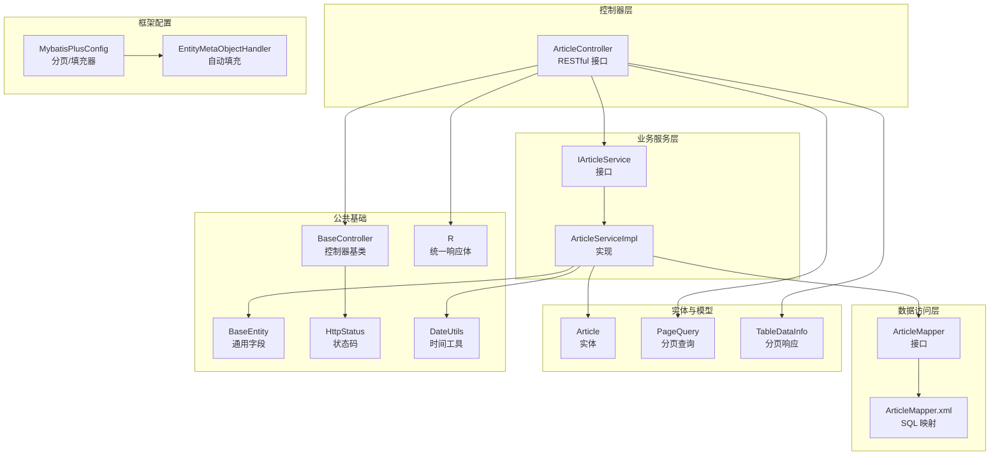
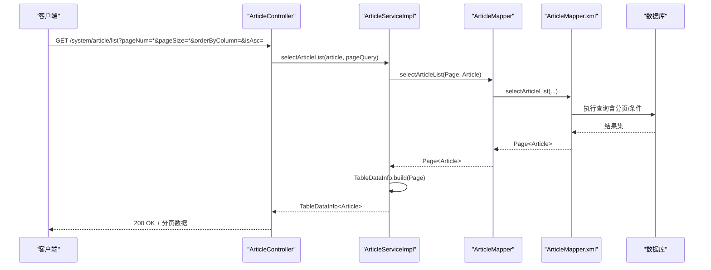
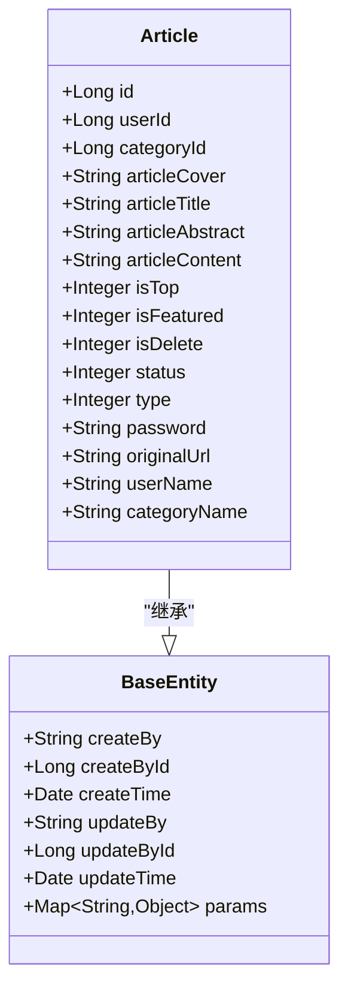
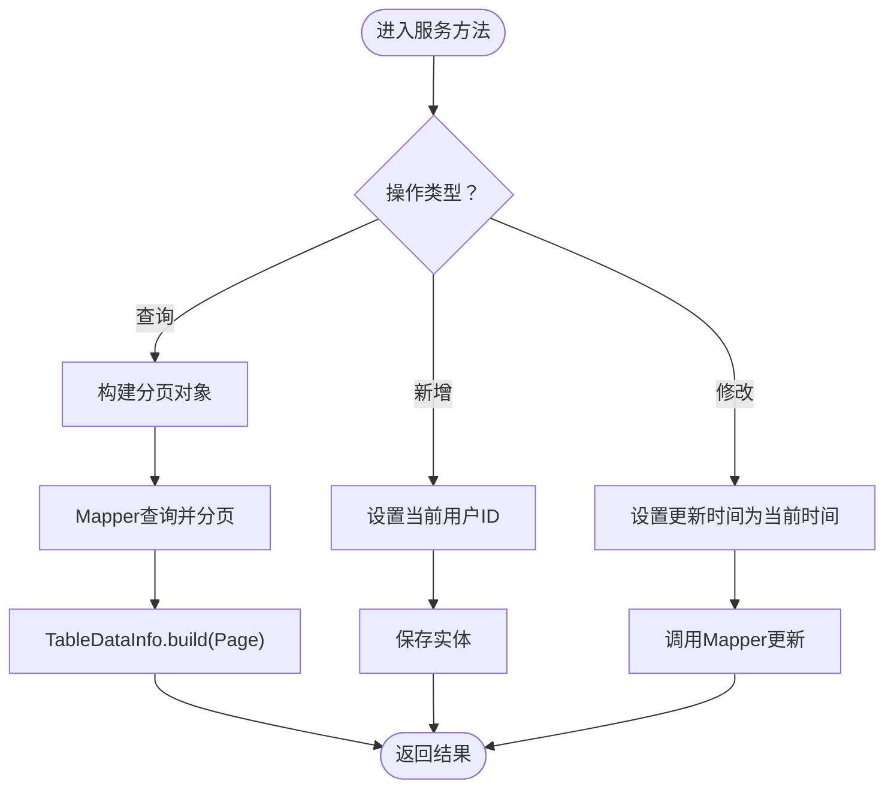
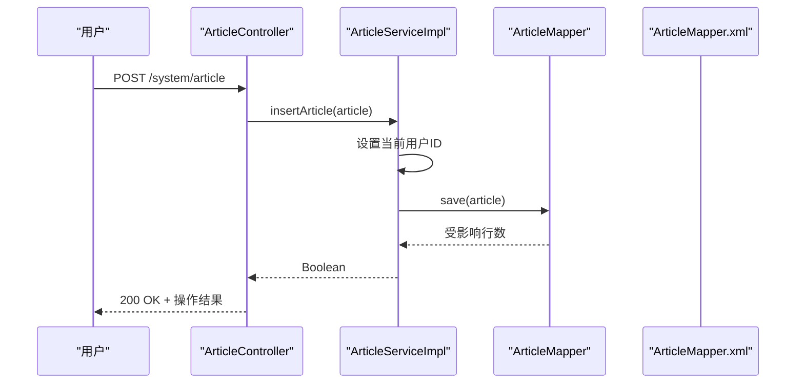
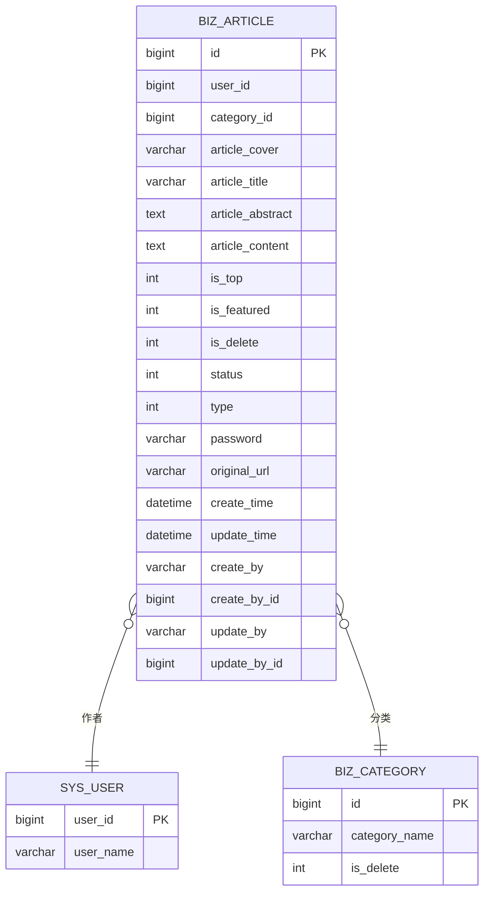
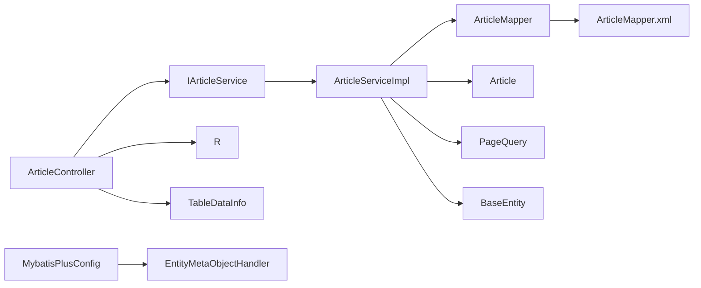

# 内容管理系统

<cite>
**本文引用的文件**
- [Article.java](file://blog-biz/src/main/java/blog/biz/domain/Article.java)
- [IArticleService.java](file://blog-biz/src/main/java/blog/biz/service/IArticleService.java)
- [ArticleServiceImpl.java](file://blog-biz/src/main/java/blog/biz/service/impl/ArticleServiceImpl.java)
- [ArticleMapper.java](file://blog-biz/src/main/java/blog/biz/mapper/ArticleMapper.java)
- [ArticleMapper.xml](file://blog-biz/src/main/resources/mapper/ArticleMapper.xml)
- [ArticleController.java](file://blog-admin/src/main/java/blog/web/controller/business/ArticleController.java)
- [MybatisPlusConfig.java](file://blog-framework/src/main/java/blog/framework/config/MybatisPlusConfig.java)
- [BaseEntity.java](file://blog-common/src/main/java/blog/common/base/entity/BaseEntity.java)
- [BaseController.java](file://blog-common/src/main/java/blog/common/base/controller/BaseController.java)
- [R.java](file://blog-common/src/main/java/blog/common/base/resp/R.java)
- [TableDataInfo.java](file://blog-common/src/main/java/blog/common/base/resp/TableDataInfo.java)
- [PageQuery.java](file://blog-common/src/main/java/blog/common/base/req/PageQuery.java)
- [HttpStatus.java](file://blog-common/src/main/java/blog/common/constant/HttpStatus.java)
- [DateUtils.java](file://blog-common/src/main/java/blog/common/utils/DateUtils.java)
- [EntityMetaObjectHandler.java](file://blog-framework/src/main/java/blog/framework/handler/EntityMetaObjectHandler.java)
</cite>

## 目录
1. [简介](#简介)
2. [项目结构](#项目结构)
3. [核心组件](#核心组件)
4. [架构总览](#架构总览)
5. [详细组件分析](#详细组件分析)
6. [依赖分析](#依赖分析)
7. [性能考虑](#性能考虑)
8. [故障排查指南](#故障排查指南)
9. [结论](#结论)
10. [附录：API 接口文档](#附录api-接口文档)

## 简介
本项目为博客内容管理系统，围绕“文章”这一核心实体，提供完整的 CRUD、分页查询、导出、权限控制与审计日志等能力。系统采用分层架构：控制器层负责对外暴露 RESTful 接口；服务层承载业务逻辑与数据校验；持久层基于 MyBatis-Plus 实现，通过 Mapper 接口与 XML 映射文件完成数据库交互；公共模块提供统一响应体、分页模型、安全工具等基础设施。

## 项目结构
- 控制器层：位于 admin 模块，对外暴露文章管理接口，包含鉴权与日志注解。
- 业务服务层：位于 biz 模块，封装文章的新增、修改、删除、查询等业务流程。
- 数据访问层：位于 biz 模块，定义 Mapper 接口并通过 XML 映射 SQL。
- 实体与模型：位于 biz 模块 domain 包，定义文章实体及 DTO/VO。
- 公共基础：位于 common 模块，提供 BaseEntity、分页查询、统一响应体、常量等。
- 框架配置：位于 framework 模块，包含 MyBatis-Plus 配置、元对象填充器等。

图表来源
- [ArticleController.java:36-101](file://blog-admin/src/main/java/blog/web/controller/business/ArticleController.java#L36-L101)
- [IArticleService.java:14-63](file://blog-biz/src/main/java/blog/biz/service/IArticleService.java#L14-L63)
- [ArticleServiceImpl.java:22-94](file://blog-biz/src/main/java/blog/biz/service/impl/ArticleServiceImpl.java#L22-L94)
- [ArticleMapper.java:17-65](file://blog-biz/src/main/java/blog/biz/mapper/ArticleMapper.java#L17-L65)
- [ArticleMapper.xml:5-292](file://blog-biz/src/main/resources/mapper/ArticleMapper.xml#L5-L292)
- [Article.java:24-94](file://blog-biz/src/main/java/blog/biz/domain/Article.java#L24-L94)
- [PageQuery.java:24-127](file://blog-common/src/main/java/blog/common/base/req/PageQuery.java#L24-L127)
- [TableDataInfo.java:14-97](file://blog-common/src/main/java/blog/common/base/resp/TableDataInfo.java#L14-L97)
- [BaseEntity.java:22-84](file://blog-common/src/main/java/blog/common/base/entity/BaseEntity.java#L22-L84)
- [BaseController.java:30-181](file://blog-common/src/main/java/blog/common/base/controller/BaseController.java#L30-L181)
- [R.java:12-106](file://blog-common/src/main/java/blog/common/base/resp/R.java#L12-L106)
- [HttpStatus.java:8-93](file://blog-common/src/main/java/blog/common/constant/HttpStatus.java#L8-L93)
- [DateUtils.java:21-169](file://blog-common/src/main/java/blog/common/utils/DateUtils.java#L21-L169)
- [MybatisPlusConfig.java:17-55](file://blog-framework/src/main/java/blog/framework/config/MybatisPlusConfig.java#L17-L55)
- [EntityMetaObjectHandler.java:16-76](file://blog-framework/src/main/java/blog/framework/handler/EntityMetaObjectHandler.java#L16-L76)

章节来源
- [ArticleController.java:36-101](file://blog-admin/src/main/java/blog/web/controller/business/ArticleController.java#L36-L101)
- [ArticleServiceImpl.java:22-94](file://blog-biz/src/main/java/blog/biz/service/impl/ArticleServiceImpl.java#L22-L94)
- [ArticleMapper.xml:5-292](file://blog-biz/src/main/resources/mapper/ArticleMapper.xml#L5-L292)
- [MybatisPlusConfig.java:17-55](file://blog-framework/src/main/java/blog/framework/config/MybatisPlusConfig.java#L17-L55)

## 核心组件
- 文章实体 Article：定义文章字段、业务含义与逻辑删除标记，并继承通用实体基类。
- 文章服务 IArticleService/ArticleServiceImpl：提供查询、新增、修改、批量删除等业务方法，集成分页与更新时间填充。
- 文章 Mapper/ArticleMapper.xml：定义 SQL 方法与动态条件查询，支持分页与关联查询。
- 控制器 ArticleController：暴露 RESTful 接口，集成鉴权、日志与 Excel 导出。
- 基础设施：BaseEntity 提供创建/更新字段自动填充；MyBatis-Plus 配置启用分页与 ID 生成策略；统一响应体与分页包装。

章节来源
- [Article.java:24-94](file://blog-biz/src/main/java/blog/biz/domain/Article.java#L24-L94)
- [IArticleService.java:14-63](file://blog-biz/src/main/java/blog/biz/service/IArticleService.java#L14-L63)
- [ArticleServiceImpl.java:22-94](file://blog-biz/src/main/java/blog/biz/service/impl/ArticleServiceImpl.java#L22-L94)
- [ArticleMapper.java:17-65](file://blog-biz/src/main/java/blog/biz/mapper/ArticleMapper.java#L17-L65)
- [ArticleMapper.xml:5-292](file://blog-biz/src/main/resources/mapper/ArticleMapper.xml#L5-L292)
- [ArticleController.java:36-101](file://blog-admin/src/main/java/blog/web/controller/business/ArticleController.java#L36-L101)
- [BaseEntity.java:22-84](file://blog-common/src/main/java/blog/common/base/entity/BaseEntity.java#L22-L84)
- [MybatisPlusConfig.java:17-55](file://blog-framework/src/main/java/blog/framework/config/MybatisPlusConfig.java#L17-L55)
- [R.java:12-106](file://blog-common/src/main/java/blog/common/base/resp/R.java#L12-L106)
- [TableDataInfo.java:14-97](file://blog-common/src/main/java/blog/common/base/resp/TableDataInfo.java#L14-L97)
- [PageQuery.java:24-127](file://blog-common/src/main/java/blog/common/base/req/PageQuery.java#L24-L127)

## 架构总览
系统遵循经典的分层架构，控制器层负责请求接入与响应封装，服务层负责业务编排与数据校验，持久层负责数据读写。MyBatis-Plus 提供分页、自动填充与 ID 生成等能力，配合统一响应体与分页模型，形成清晰的调用链路。

图表来源
- [ArticleController.java:45-49](file://blog-admin/src/main/java/blog/web/controller/business/ArticleController.java#L45-L49)
- [ArticleServiceImpl.java:44-47](file://blog-biz/src/main/java/blog/biz/service/impl/ArticleServiceImpl.java#L44-L47)
- [ArticleMapper.java:32-32](file://blog-biz/src/main/java/blog/biz/mapper/ArticleMapper.java#L32-L32)
- [ArticleMapper.xml:55-124](file://blog-biz/src/main/resources/mapper/ArticleMapper.xml#L55-L124)

## 详细组件分析

### 文章实体设计（Article）
- 字段定义与业务规则
  - 作者标识、分类标识、封面、标题、摘要、正文、置顶/推荐标记、状态（公开/私密/草稿）、类型（原创/转载/翻译）、访问密码、原文链接等。
  - 逻辑删除字段用于软删除，避免物理删除造成数据丢失。
  - 用户名与分类名称为关联查询的展示字段，不落库。
- 继承与扩展
  - 继承 BaseEntity，自动获得创建/更新时间与人员信息字段。
- 关系映射
  - 通过 XML 的 left join 关联 sys_user 与 biz_category，实现作者名与分类名的展示。

图表来源
- [Article.java:24-94](file://blog-biz/src/main/java/blog/biz/domain/Article.java#L24-L94)
- [BaseEntity.java:22-84](file://blog-common/src/main/java/blog/common/base/entity/BaseEntity.java#L22-L84)

章节来源
- [Article.java:24-94](file://blog-biz/src/main/java/blog/biz/domain/Article.java#L24-L94)
- [BaseEntity.java:22-84](file://blog-common/src/main/java/blog/common/base/entity/BaseEntity.java#L22-L84)

### 文章服务层（IArticleService / ArticleServiceImpl）
- 业务职责
  - 查询单条、列表与分页查询；新增时设置当前用户 ID；修改时自动更新时间；批量删除委托 Mapper。
- 分页与响应
  - 使用 PageQuery 构建分页对象，结合 TableDataInfo 包装分页结果。
- 自动填充
  - 新增时由 BaseEntity 元对象处理器自动填充创建者信息；修改时更新时间自动填充。

图表来源
- [ArticleServiceImpl.java:56-71](file://blog-biz/src/main/java/blog/biz/service/impl/ArticleServiceImpl.java#L56-L71)
- [PageQuery.java:62-74](file://blog-common/src/main/java/blog/common/base/req/PageQuery.java#L62-L74)
- [TableDataInfo.java:57-64](file://blog-common/src/main/java/blog/common/base/resp/TableDataInfo.java#L57-L64)
- [EntityMetaObjectHandler.java:24-51](file://blog-framework/src/main/java/blog/framework/handler/EntityMetaObjectHandler.java#L24-L51)

章节来源
- [IArticleService.java:14-63](file://blog-biz/src/main/java/blog/biz/service/IArticleService.java#L14-L63)
- [ArticleServiceImpl.java:22-94](file://blog-biz/src/main/java/blog/biz/service/impl/ArticleServiceImpl.java#L22-L94)
- [PageQuery.java:24-127](file://blog-common/src/main/java/blog/common/base/req/PageQuery.java#L24-L127)
- [TableDataInfo.java:14-97](file://blog-common/src/main/java/blog/common/base/resp/TableDataInfo.java#L14-L97)
- [EntityMetaObjectHandler.java:16-76](file://blog-framework/src/main/java/blog/framework/handler/EntityMetaObjectHandler.java#L16-L76)

### 文章控制器（ArticleController）
- 接口设计
  - GET /list：分页查询文章列表，支持多条件过滤。
  - POST /export：导出文章列表为 Excel。
  - GET /{id}：获取单篇文章详情。
  - POST：新增文章。
  - PUT：修改文章。
  - DELETE /{ids}：批量删除文章。
- 权限与日志
  - 使用注解进行权限校验与操作日志记录。
- 响应封装
  - 统一使用 Result 或 TableDataInfo 包装响应。

图表来源
- [ArticleController.java:77-80](file://blog-admin/src/main/java/blog/web/controller/business/ArticleController.java#L77-L80)
- [ArticleServiceImpl.java:56-59](file://blog-biz/src/main/java/blog/biz/service/impl/ArticleServiceImpl.java#L56-L59)

章节来源
- [ArticleController.java:36-101](file://blog-admin/src/main/java/blog/web/controller/business/ArticleController.java#L36-L101)

### MyBatis-Plus 使用（Mapper 与 XML）
- Mapper 接口
  - 继承 BaseMapper，覆盖常用方法以满足业务需求。
- XML 映射
  - 定义结果映射、动态查询条件、插入/更新/删除 SQL。
  - 查询时通过 left join 关联用户与分类，实现作者名与分类名展示。
- 分页与拦截器
  - MyBatis-Plus 配置启用分页插件与 ID 生成器，提升分页与唯一性保障。

图表来源
- [ArticleMapper.xml:6-29](file://blog-biz/src/main/resources/mapper/ArticleMapper.xml#L6-L29)
- [ArticleMapper.xml:77-81](file://blog-biz/src/main/resources/mapper/ArticleMapper.xml#L77-L81)

章节来源
- [ArticleMapper.java:17-65](file://blog-biz/src/main/java/blog/biz/mapper/ArticleMapper.java#L17-L65)
- [ArticleMapper.xml:5-292](file://blog-biz/src/main/resources/mapper/ArticleMapper.xml#L5-L292)
- [MybatisPlusConfig.java:19-52](file://blog-framework/src/main/java/blog/framework/config/MybatisPlusConfig.java#L19-L52)

## 依赖分析
- 控制器依赖服务接口，服务实现依赖 Mapper 与实体。
- 服务层依赖分页查询模型与统一响应体。
- 持久层依赖 MyBatis-Plus 配置与元对象填充器。
- 实体依赖通用基类，自动获得创建/更新字段。

图表来源
- [ArticleController.java:36-101](file://blog-admin/src/main/java/blog/web/controller/business/ArticleController.java#L36-L101)
- [IArticleService.java:14-63](file://blog-biz/src/main/java/blog/biz/service/IArticleService.java#L14-L63)
- [ArticleServiceImpl.java:22-94](file://blog-biz/src/main/java/blog/biz/service/impl/ArticleServiceImpl.java#L22-L94)
- [ArticleMapper.java:17-65](file://blog-biz/src/main/java/blog/biz/mapper/ArticleMapper.java#L17-L65)
- [ArticleMapper.xml:5-292](file://blog-biz/src/main/resources/mapper/ArticleMapper.xml#L5-L292)
- [Article.java:24-94](file://blog-biz/src/main/java/blog/biz/domain/Article.java#L24-L94)
- [PageQuery.java:24-127](file://blog-common/src/main/java/blog/common/base/req/PageQuery.java#L24-L127)
- [TableDataInfo.java:14-97](file://blog-common/src/main/java/blog/common/base/resp/TableDataInfo.java#L14-L97)
- [BaseEntity.java:22-84](file://blog-common/src/main/java/blog/common/base/entity/BaseEntity.java#L22-L84)
- [MybatisPlusConfig.java:17-55](file://blog-framework/src/main/java/blog/framework/config/MybatisPlusConfig.java#L17-L55)
- [EntityMetaObjectHandler.java:16-76](file://blog-framework/src/main/java/blog/framework/handler/EntityMetaObjectHandler.java#L16-L76)

章节来源
- [ArticleController.java:36-101](file://blog-admin/src/main/java/blog/web/controller/business/ArticleController.java#L36-L101)
- [ArticleServiceImpl.java:22-94](file://blog-biz/src/main/java/blog/biz/service/impl/ArticleServiceImpl.java#L22-L94)
- [ArticleMapper.xml:5-292](file://blog-biz/src/main/resources/mapper/ArticleMapper.xml#L5-L292)

## 性能考虑
- 分页与排序
  - 使用 PageQuery 构建分页与排序，注意排序字段需与数据库列一致，避免全表扫描。
- SQL 优化
  - 查询条件尽量命中索引；对高频过滤字段（如作者、分类、状态）建立索引。
- 缓存与导出
  - 对热点查询可引入缓存；导出时建议异步处理并限制一次性导出数量。
- 并发与幂等
  - 幂等性：新增/更新接口应具备幂等保护；分布式场景下可结合唯一键或令牌机制。
- 日志与监控
  - 对慢查询与异常进行日志记录与告警，结合指标监控数据库负载。

## 故障排查指南
- 常见问题
  - 分页参数非法：检查 pageNum/pageSize 与排序参数格式，确保 isAsc 与 orderByColumn 同步。
  - 新增失败：确认当前登录用户存在，自动填充器会根据登录态填充创建者信息。
  - 查询无结果：确认 is_delete=0 的软删除条件与关联表过滤条件。
- 错误码参考
  - 成功：200；未授权：401；禁止访问：403；资源不存在：404；服务器错误：500。
- 排查步骤
  - 检查控制器权限注解与日志；查看服务层分页构建与 Mapper 条件；核对 XML 中的动态 SQL 与关联表。

章节来源
- [PageQuery.java:85-115](file://blog-common/src/main/java/blog/common/base/req/PageQuery.java#L85-L115)
- [EntityMetaObjectHandler.java:24-51](file://blog-framework/src/main/java/blog/framework/handler/EntityMetaObjectHandler.java#L24-L51)
- [ArticleMapper.xml:82-124](file://blog-biz/src/main/resources/mapper/ArticleMapper.xml#L82-L124)
- [HttpStatus.java:8-93](file://blog-common/src/main/java/blog/common/constant/HttpStatus.java#L8-L93)

## 结论
本系统围绕文章实体构建了完整的 CRUD 与分页查询能力，结合 MyBatis-Plus 的分页与自动填充特性，实现了良好的开发体验与运行效率。通过统一的响应体与分页模型，接口设计清晰、易于维护与扩展。建议在生产环境中进一步完善索引、缓存与异步导出策略，持续优化查询性能与用户体验。

## 附录：API 接口文档

- 基础信息
  - 基础路径：/system/article
  - 认证方式：基于 Spring Security 的权限注解
  - 响应格式：统一 Result 或 TableDataInfo

- 查询文章列表
  - 方法与路径：GET /list
  - 权限：system:article:list
  - 查询参数
    - pageNum：当前页码
    - pageSize：每页条数
    - orderByColumn：排序字段（支持多个，以下划线命名）
    - isAsc：排序方向（asc/desc 或 ascending/descending）
    - 其他过滤字段：userId、categoryId、articleTitle、status、type 等（对应 Article 实体字段）
  - 响应：TableDataInfo<Article>

- 导出文章列表
  - 方法与路径：POST /export
  - 权限：system:article:export
  - 请求参数：同上（可选）
  - 响应：Excel 文件流

- 获取文章详情
  - 方法与路径：GET /{id}
  - 权限：system:article:query
  - 路径参数：id（文章主键）
  - 响应：Result<Article>

- 新增文章
  - 方法与路径：POST /
  - 权限：system:article:add
  - 请求体：Article（除自增 id、逻辑删除、创建/更新字段外）
  - 响应：Result（操作结果）

- 修改文章
  - 方法与路径：PUT /
  - 权限：system:article:edit
  - 请求体：Article（包含 id）
  - 响应：Result（操作结果）

- 删除文章
  - 方法与路径：DELETE /{ids}
  - 权限：system:article:remove
  - 路径参数：ids（逗号分隔的多个主键）
  - 响应：Result（操作结果）

- 统一响应体
  - Result：包含 code、msg、data
  - TableDataInfo：包含 code、msg、rows、total

- 错误码
  - 成功：200
  - 未授权：401
  - 禁止访问：403
  - 资源不存在：404
  - 服务器错误：500

章节来源
- [ArticleController.java:45-100](file://blog-admin/src/main/java/blog/web/controller/business/ArticleController.java#L45-L100)
- [R.java:12-106](file://blog-common/src/main/java/blog/common/base/resp/R.java#L12-L106)
- [TableDataInfo.java:14-97](file://blog-common/src/main/java/blog/common/base/resp/TableDataInfo.java#L14-L97)
- [HttpStatus.java:8-93](file://blog-common/src/main/java/blog/common/constant/HttpStatus.java#L8-L93)