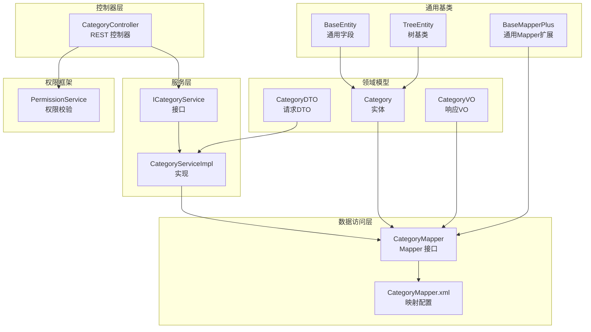
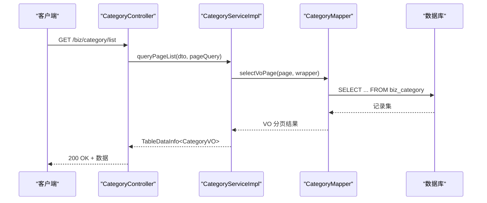
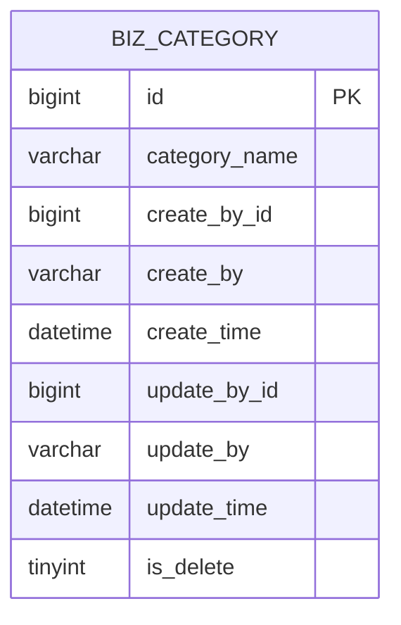
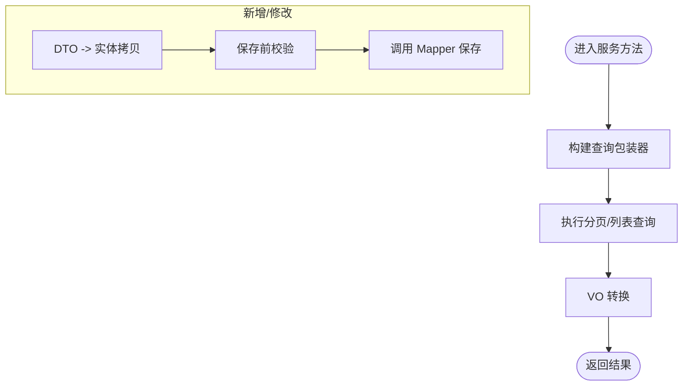
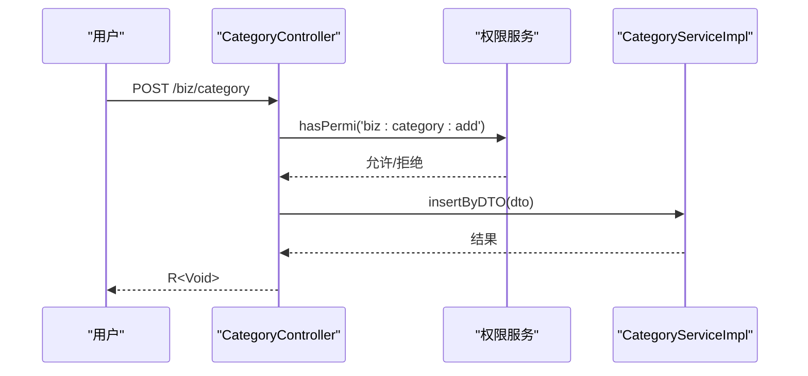
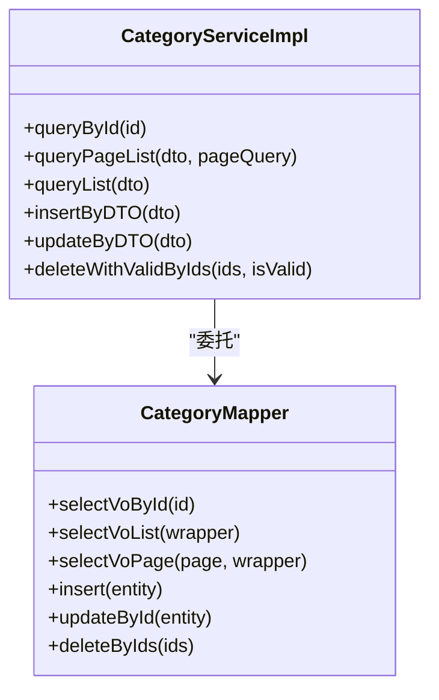
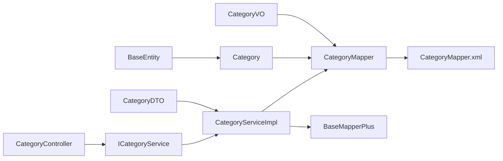

# 分类管理

<cite>
**本文引用的文件**
- [Category.java](file://blog-biz/src/main/java/blog/biz/domain/Category.java)
- [CategoryDTO.java](file://blog-biz/src/main/java/blog/biz/domain/dto/CategoryDTO.java)
- [CategoryVO.java](file://blog-biz/src/main/java/blog/biz/domain/vo/CategoryVO.java)
- [ICategoryService.java](file://blog-biz/src/main/java/blog/biz/service/ICategoryService.java)
- [CategoryServiceImpl.java](file://blog-biz/src/main/java/blog/biz/service/impl/CategoryServiceImpl.java)
- [CategoryMapper.java](file://blog-biz/src/main/java/blog/biz/mapper/CategoryMapper.java)
- [CategoryMapper.xml](file://blog-biz/src/main/resources/mapper/CategoryMapper.xml)
- [CategoryController.java](file://blog-admin/src/main/java/blog/web/controller/business/CategoryController.java)
- [BaseEntity.java](file://blog-common/src/main/java/blog/common/base/entity/BaseEntity.java)
- [BaseMapperPlus.java](file://blog-common/src/main/java/blog/common/base/mapper/BaseMapperPlus.java)
- [TreeEntity.java](file://blog-common/src/main/java/blog/common/core/domain/TreeEntity.java)
- [PermissionService.java](file://blog-framework/src/main/java/blog/framework/web/service/PermissionService.java)
- [ry-vue-owner.sql](file://ry-vue-owner.sql)
</cite>

## 目录
1. [简介](#简介)
2. [项目结构](#项目结构)
3. [核心组件](#核心组件)
4. [架构总览](#架构总览)
5. [详细组件分析](#详细组件分析)
6. [依赖分析](#依赖分析)
7. [性能考虑](#性能考虑)
8. [故障排查指南](#故障排查指南)
9. [结论](#结论)
10. [附录：分类管理API文档](#附录分类管理api文档)

## 简介
本文件系统性梳理博客系统的“分类管理”能力，覆盖实体设计、服务层实现、控制器接口、数据访问层以及权限与业务规则。当前代码库中的分类实体为扁平结构，未包含父子关系与层级排序字段；服务层与控制器提供基础的增删改查与导出能力；权限控制通过统一鉴权注解实现；业务规则中尚未实现分类重名校验与删除保护等策略，后续可按需扩展。

## 项目结构
分类管理涉及三层：控制器层、服务层、数据访问层，配合通用基类与权限框架，形成清晰的分层架构。

图表来源
- [CategoryController.java:31-106](file://blog-admin/src/main/java/blog/web/controller/business/CategoryController.java#L31-L106)
- [ICategoryService.java:19-70](file://blog-biz/src/main/java/blog/biz/service/ICategoryService.java#L19-L70)
- [CategoryServiceImpl.java:36-132](file://blog-biz/src/main/java/blog/biz/service/impl/CategoryServiceImpl.java#L36-L132)
- [CategoryMapper.java:13-15](file://blog-biz/src/main/java/blog/biz/mapper/CategoryMapper.java#L13-L15)
- [CategoryMapper.xml:5-16](file://blog-biz/src/main/resources/mapper/CategoryMapper.xml#L5-L16)
- [Category.java:19-37](file://blog-biz/src/main/java/blog/biz/domain/Category.java#L19-L37)
- [CategoryDTO.java:19-28](file://blog-biz/src/main/java/blog/biz/domain/dto/CategoryDTO.java#L19-L28)
- [CategoryVO.java:13-41](file://blog-biz/src/main/java/blog/biz/domain/vo/CategoryVO.java#L13-L41)
- [BaseEntity.java:22-84](file://blog-common/src/main/java/blog/common/base/entity/BaseEntity.java#L22-L84)
- [BaseMapperPlus.java:32-334](file://blog-common/src/main/java/blog/common/base/mapper/BaseMapperPlus.java#L32-L334)
- [TreeEntity.java:13-79](file://blog-common/src/main/java/blog/common/core/domain/TreeEntity.java#L13-L79)
- [PermissionService.java:45-71](file://blog-framework/src/main/java/blog/framework/web/service/PermissionService.java#L45-L71)

章节来源
- [CategoryController.java:31-106](file://blog-admin/src/main/java/blog/web/controller/business/CategoryController.java#L31-L106)
- [ICategoryService.java:19-70](file://blog-biz/src/main/java/blog/biz/service/ICategoryService.java#L19-L70)
- [CategoryServiceImpl.java:36-132](file://blog-biz/src/main/java/blog/biz/service/impl/CategoryServiceImpl.java#L36-L132)
- [CategoryMapper.java:13-15](file://blog-biz/src/main/java/blog/biz/mapper/CategoryMapper.java#L13-L15)
- [CategoryMapper.xml:5-16](file://blog-biz/src/main/resources/mapper/CategoryMapper.xml#L5-L16)
- [Category.java:19-37](file://blog-biz/src/main/java/blog/biz/domain/Category.java#L19-L37)
- [CategoryDTO.java:19-28](file://blog-biz/src/main/java/blog/biz/domain/dto/CategoryDTO.java#L19-L28)
- [CategoryVO.java:13-41](file://blog-biz/src/main/java/blog/biz/domain/vo/CategoryVO.java#L13-L41)
- [BaseEntity.java:22-84](file://blog-common/src/main/java/blog/common/base/entity/BaseEntity.java#L22-L84)
- [BaseMapperPlus.java:32-334](file://blog-common/src/main/java/blog/common/base/mapper/BaseMapperPlus.java#L32-L334)
- [TreeEntity.java:13-79](file://blog-common/src/main/java/blog/common/core/domain/TreeEntity.java#L13-L79)
- [PermissionService.java:45-71](file://blog-framework/src/main/java/blog/framework/web/service/PermissionService.java#L45-L71)

## 核心组件
- 实体与映射
  - 实体：分类实体包含主键、分类名与软删除字段，继承通用实体基类，具备创建/更新人员与时间字段。
  - 映射：MyBatis XML 定义了实体与表字段的映射关系。
- 数据传输对象
  - DTO：封装请求参数，包含分类名，使用校验分组。
  - VO：封装对外响应，包含分类信息与通用字段序列化处理。
- 服务层
  - 接口：定义查询、分页、列表、新增、修改、批量删除等方法。
  - 实现：基于通用 Mapper 扩展，完成查询包装、分页转换、保存前校验与批量删除。
- 控制器
  - 提供列表、导出、详情、新增、修改、删除等接口，使用权限注解与日志注解。
- 通用基类
  - BaseEntity：统一的审计字段与参数容器。
  - BaseMapperPlus：提供 VO 查询、分页、批量操作等通用能力。
  - TreeEntity：树形结构基类（用于菜单/部门等），当前分类未直接继承该类。

章节来源
- [Category.java:19-37](file://blog-biz/src/main/java/blog/biz/domain/Category.java#L19-L37)
- [CategoryMapper.xml:7-16](file://blog-biz/src/main/resources/mapper/CategoryMapper.xml#L7-L16)
- [CategoryDTO.java:19-28](file://blog-biz/src/main/java/blog/biz/domain/dto/CategoryDTO.java#L19-L28)
- [CategoryVO.java:13-41](file://blog-biz/src/main/java/blog/biz/domain/vo/CategoryVO.java#L13-L41)
- [ICategoryService.java:19-70](file://blog-biz/src/main/java/blog/biz/service/ICategoryService.java#L19-L70)
- [CategoryServiceImpl.java:36-132](file://blog-biz/src/main/java/blog/biz/service/impl/CategoryServiceImpl.java#L36-L132)
- [CategoryController.java:35-106](file://blog-admin/src/main/java/blog/web/controller/business/CategoryController.java#L35-L106)
- [BaseEntity.java:22-84](file://blog-common/src/main/java/blog/common/base/entity/BaseEntity.java#L22-L84)
- [BaseMapperPlus.java:32-334](file://blog-common/src/main/java/blog/common/base/mapper/BaseMapperPlus.java#L32-L334)
- [TreeEntity.java:13-79](file://blog-common/src/main/java/blog/common/core/domain/TreeEntity.java#L13-L79)

## 架构总览
分类管理采用经典的分层架构：控制器负责接口暴露与权限控制，服务层编排业务逻辑与数据转换，数据访问层负责与数据库交互。当前分类未实现树形结构与层级统计，后续可在服务层扩展树形构建与统计聚合。

图表来源
- [CategoryController.java:42-46](file://blog-admin/src/main/java/blog/web/controller/business/CategoryController.java#L42-L46)
- [CategoryServiceImpl.java:58-63](file://blog-biz/src/main/java/blog/biz/service/impl/CategoryServiceImpl.java#L58-L63)
- [CategoryMapper.java:13-15](file://blog-biz/src/main/java/blog/biz/mapper/CategoryMapper.java#L13-L15)
- [CategoryMapper.xml:5-16](file://blog-biz/src/main/resources/mapper/CategoryMapper.xml#L5-L16)

## 详细组件分析

### 实体与数据模型
- 字段设计
  - 主键：自增长整型
  - 名称：非空字符串
  - 软删除：逻辑删除字段
  - 审计：创建/更新人员与时间字段来自通用基类
- 表结构
  - 表名：biz_category
  - 约束：名称非空、软删除默认值、主键自增

图表来源
- [ry-vue-owner.sql:298-312](file://ry-vue-owner.sql#L298-L312)

章节来源
- [Category.java:19-37](file://blog-biz/src/main/java/blog/biz/domain/Category.java#L19-L37)
- [BaseEntity.java:37-70](file://blog-common/src/main/java/blog/common/base/entity/BaseEntity.java#L37-L70)
- [ry-vue-owner.sql:298-312](file://ry-vue-owner.sql#L298-L312)

### 服务层实现
- 查询与分页
  - 支持按名称模糊查询与默认排序
  - 使用 LambdaQueryWrapper 构建查询条件
- 新增与修改
  - DTO -> 实体拷贝后进行保存前校验
  - 统一使用 Mapper 进行插入/更新
- 批量删除
  - 支持传入是否进行有效性校验的开关
  - 调用 Mapper 批量删除

图表来源
- [CategoryServiceImpl.java:77-83](file://blog-biz/src/main/java/blog/biz/service/impl/CategoryServiceImpl.java#L77-L83)
- [CategoryServiceImpl.java:91-109](file://blog-biz/src/main/java/blog/biz/service/impl/CategoryServiceImpl.java#L91-L109)
- [CategoryServiceImpl.java:118-131](file://blog-biz/src/main/java/blog/biz/service/impl/CategoryServiceImpl.java#L118-L131)

章节来源
- [ICategoryService.java:19-70](file://blog-biz/src/main/java/blog/biz/service/ICategoryService.java#L19-L70)
- [CategoryServiceImpl.java:36-132](file://blog-biz/src/main/java/blog/biz/service/impl/CategoryServiceImpl.java#L36-L132)
- [BaseMapperPlus.java:127-176](file://blog-common/src/main/java/blog/common/base/mapper/BaseMapperPlus.java#L127-L176)

### 控制器接口设计
- 权限注解
  - 列表、导出、查询、新增、编辑、删除均使用权限注解进行校验
- 接口清单
  - GET /biz/category/list：分页列表
  - POST /biz/category/export：导出列表
  - GET /biz/category/{id}：获取详情
  - POST：新增
  - PUT：修改
  - DELETE /biz/category/{ids}：批量删除

图表来源
- [CategoryController.java:75-81](file://blog-admin/src/main/java/blog/web/controller/business/CategoryController.java#L75-L81)
- [PermissionService.java:45-71](file://blog-framework/src/main/java/blog/framework/web/service/PermissionService.java#L45-L71)

章节来源
- [CategoryController.java:35-106](file://blog-admin/src/main/java/blog/web/controller/business/CategoryController.java#L35-L106)
- [PermissionService.java:45-71](file://blog-framework/src/main/java/blog/framework/web/service/PermissionService.java#L45-L71)

### 数据访问层实现
- Mapper 接口
  - 继承通用 Mapper 扩展，获得 VO 查询、分页、批量等能力
- XML 映射
  - 明确实体字段与表列的映射关系
- 复杂查询
  - 当前仅支持基础 CRUD 与分页
  - 可在 XML 中扩展树形查询、层级计算与关联统计

图表来源
- [CategoryMapper.java:13-15](file://blog-biz/src/main/java/blog/biz/mapper/CategoryMapper.java#L13-L15)
- [CategoryServiceImpl.java:36-132](file://blog-biz/src/main/java/blog/biz/service/impl/CategoryServiceImpl.java#L36-L132)

章节来源
- [CategoryMapper.java:13-15](file://blog-biz/src/main/java/blog/biz/mapper/CategoryMapper.java#L13-L15)
- [CategoryMapper.xml:5-16](file://blog-biz/src/main/resources/mapper/CategoryMapper.xml#L5-L16)
- [BaseMapperPlus.java:127-320](file://blog-common/src/main/java/blog/common/base/mapper/BaseMapperPlus.java#L127-L320)

### 权限控制与业务规则
- 权限控制
  - 控制器使用权限注解进行细粒度授权
- 业务规则现状
  - 未实现分类重名校验
  - 未实现删除保护（例如存在文章时禁止删除）
- 建议扩展点
  - 在服务层新增唯一性校验与依赖检查
  - 在控制器或服务层增加业务前置校验

章节来源
- [CategoryController.java:42-105](file://blog-admin/src/main/java/blog/web/controller/business/CategoryController.java#L42-L105)
- [CategoryServiceImpl.java:114-116](file://blog-biz/src/main/java/blog/biz/service/impl/CategoryServiceImpl.java#L114-L116)

## 依赖分析
- 组件耦合
  - 控制器依赖服务接口
  - 服务实现依赖 Mapper 接口与通用 Mapper 扩展
  - 实体依赖通用实体基类
- 外部依赖
  - MyBatis Plus：ORM 与分页
  - Spring Security：权限注解
  - Hutool：Bean 复制
- 潜在风险
  - 当前分类未体现树形结构，若未来扩展父子关系，需调整实体与查询逻辑

图表来源
- [CategoryController.java:35-106](file://blog-admin/src/main/java/blog/web/controller/business/CategoryController.java#L35-L106)
- [ICategoryService.java:19-70](file://blog-biz/src/main/java/blog/biz/service/ICategoryService.java#L19-L70)
- [CategoryServiceImpl.java:36-132](file://blog-biz/src/main/java/blog/biz/service/impl/CategoryServiceImpl.java#L36-L132)
- [CategoryMapper.java:13-15](file://blog-biz/src/main/java/blog/biz/mapper/CategoryMapper.java#L13-L15)
- [CategoryMapper.xml:5-16](file://blog-biz/src/main/resources/mapper/CategoryMapper.xml#L5-L16)
- [BaseMapperPlus.java:32-334](file://blog-common/src/main/java/blog/common/base/mapper/BaseMapperPlus.java#L32-L334)
- [Category.java:19-37](file://blog-biz/src/main/java/blog/biz/domain/Category.java#L19-L37)
- [BaseEntity.java:22-84](file://blog-common/src/main/java/blog/common/base/entity/BaseEntity.java#L22-L84)

章节来源
- [CategoryController.java:35-106](file://blog-admin/src/main/java/blog/web/controller/business/CategoryController.java#L35-L106)
- [CategoryServiceImpl.java:36-132](file://blog-biz/src/main/java/blog/biz/service/impl/CategoryServiceImpl.java#L36-L132)
- [CategoryMapper.java:13-15](file://blog-biz/src/main/java/blog/biz/mapper/CategoryMapper.java#L13-L15)
- [BaseMapperPlus.java:32-334](file://blog-common/src/main/java/blog/common/base/mapper/BaseMapperPlus.java#L32-L334)

## 性能考虑
- 查询优化
  - 合理使用分页参数，避免一次性加载大量数据
  - 在 DTO 中仅传递必要字段，减少网络传输
- 写入优化
  - 批量插入/更新可通过通用 Mapper 扩展提升效率
- 缓存建议
  - 对高频读取的分类列表可引入缓存，结合软更新策略
- 日志与监控
  - 控制器已集成日志注解，便于追踪接口耗时与异常

## 故障排查指南
- 常见问题
  - 权限不足：确认用户是否具备对应权限字符串
  - 参数校验失败：检查 DTO 的校验分组与必填字段
  - 数据库连接异常：检查数据源配置与事务管理
- 排查步骤
  - 查看控制器返回的统一响应结构
  - 检查服务层日志输出
  - 核对 Mapper XML 的 SQL 与参数绑定
- 相关实现参考
  - 权限校验：权限服务的 hasPermi 与 lacksPermi 方法
  - 统一响应：控制器返回 R 与 TableDataInfo

章节来源
- [CategoryController.java:42-105](file://blog-admin/src/main/java/blog/web/controller/business/CategoryController.java#L42-L105)
- [PermissionService.java:45-71](file://blog-framework/src/main/java/blog/framework/web/service/PermissionService.java#L45-L71)

## 结论
当前分类管理实现了基础的增删改查与导出能力，权限控制通过注解实现，具备良好的扩展性。若未来需要树形分类、层级统计与更严格的业务约束（如重名校验、删除保护），可在服务层与数据访问层进行增强，同时保持现有接口的兼容性。

## 附录：分类管理API文档

- 分类列表
  - 方法：GET
  - 路径：/biz/category/list
  - 权限：biz:category:list
  - 查询参数：分类名（模糊）、分页参数
  - 返回：分页数据（TableDataInfo）

- 分类导出
  - 方法：POST
  - 路径：/biz/category/export
  - 权限：biz:category:export
  - 查询参数：分类名（模糊）
  - 返回：Excel 文件流

- 分类详情
  - 方法：GET
  - 路径：/biz/category/{id}
  - 权限：biz:category:query
  - 路径参数：id（主键）
  - 返回：单条记录（R<CategoryVO>）

- 新增分类
  - 方法：POST
  - 路径：/
  - 权限：biz:category:add
  - 请求体：CategoryDTO（分类名必填）
  - 返回：操作结果（R<Void>）

- 修改分类
  - 方法：PUT
  - 路径：/
  - 权限：biz:category:edit
  - 请求体：CategoryDTO（分类名必填）
  - 返回：操作结果（R<Void>）

- 删除分类
  - 方法：DELETE
  - 路径：/biz/category/{ids}
  - 权限：biz:category:remove
  - 路径参数：ids（主键数组）
  - 返回：操作结果（R<Void>）

章节来源
- [CategoryController.java:42-105](file://blog-admin/src/main/java/blog/web/controller/business/CategoryController.java#L42-L105)
- [CategoryDTO.java:19-28](file://blog-biz/src/main/java/blog/biz/domain/dto/CategoryDTO.java#L19-L28)
- [CategoryVO.java:13-41](file://blog-biz/src/main/java/blog/biz/domain/vo/CategoryVO.java#L13-L41)