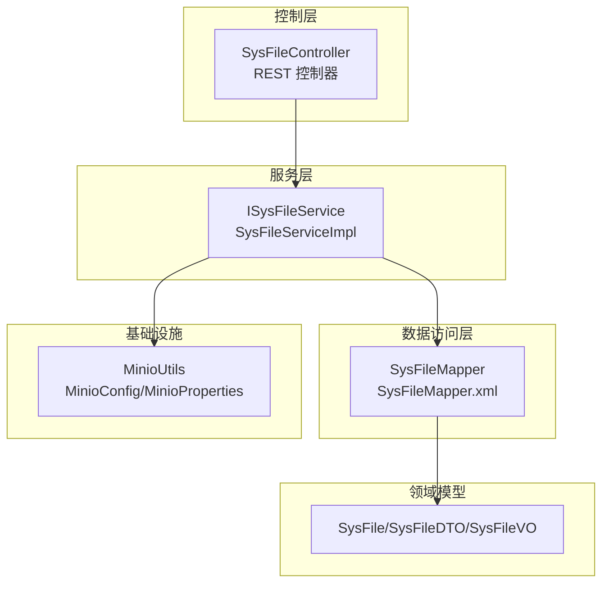
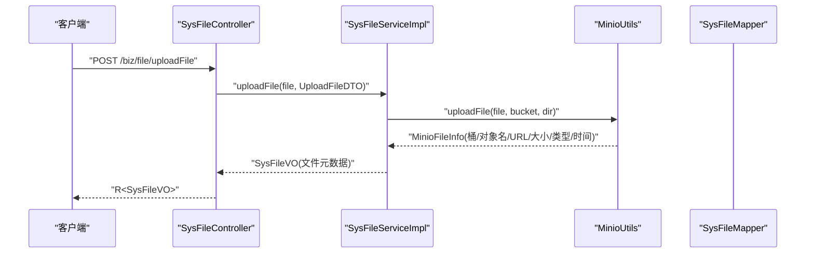
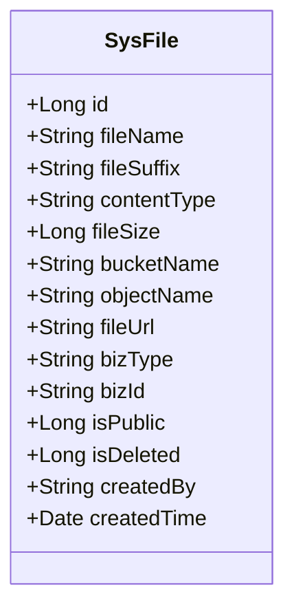
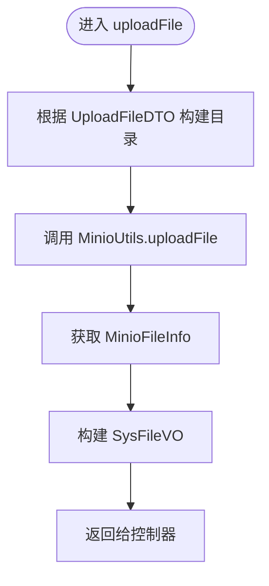
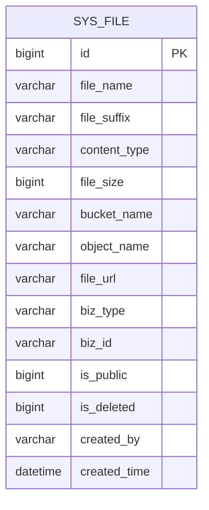
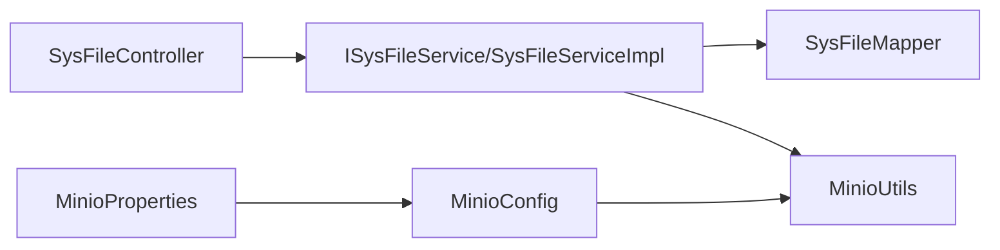

# 文件管理

<cite>
**本文引用的文件**
- [SysFile.java](file://blog-biz/src/main/java/blog/biz/domain/SysFile.java)
- [ISysFileService.java](file://blog-biz/src/main/java/blog/biz/service/ISysFileService.java)
- [SysFileServiceImpl.java](file://blog-biz/src/main/java/blog/biz/service/impl/SysFileServiceImpl.java)
- [SysFileController.java](file://blog-admin/src/main/java/blog/web/controller/common/SysFileController.java)
- [SysFileMapper.java](file://blog-biz/src/main/java/blog/biz/mapper/SysFileMapper.java)
- [SysFileMapper.xml](file://blog-biz/src/main/resources/mapper/SysFileMapper.xml)
- [SysFileDTO.java](file://blog-biz/src/main/java/blog/biz/domain/dto/SysFileDTO.java)
- [UploadFileDTO.java](file://blog-biz/src/main/java/blog/biz/domain/dto/UploadFileDTO.java)
- [SysFileVO.java](file://blog-biz/src/main/java/blog/biz/domain/vo/SysFileVO.java)
- [MinioUtils.java](file://blog-common/src/main/java/blog/common/utils/minio/MinioUtils.java)
- [MinioConfig.java](file://blog-common/src/main/java/blog/common/config/minio/MinioConfig.java)
- [MinioProperties.java](file://blog-common/src/main/java/blog/common/config/minio/MinioProperties.java)
- [FileUploadUtils.java](file://blog-common/src/main/java/blog/common/utils/file/FileUploadUtils.java)
- [InvalidExtensionException.java](file://blog-common/src/main/java/blog/common/exception/file/InvalidExtensionException.java)
- [FileUploadException.java](file://blog-common/src/main/java/blog/common/exception/file/FileUploadException.java)
</cite>

## 目录
1. [简介](#简介)
2. [项目结构](#项目结构)
3. [核心组件](#核心组件)
4. [架构总览](#架构总览)
5. [详细组件分析](#详细组件分析)
6. [依赖分析](#依赖分析)
7. [性能考虑](#性能考虑)
8. [故障排查指南](#故障排查指南)
9. [结论](#结论)
10. [附录：API 规范与参数](#附录api-规范与参数)

## 简介
本文件围绕“文件管理”能力进行系统化文档化，覆盖实体设计、服务层实现、控制器接口、数据访问层以及与 MinIO 的集成。重点说明：
- SysFile 实体的字段含义与用途
- 文件上传流程、存储策略、访问控制与删除机制
- 控制器提供的 API 接口规范
- 数据访问层的查询、分页与批量操作
- 关键特性：文件类型验证、大小限制、安全防护

## 项目结构
文件管理模块采用典型的分层架构：
- 控制层：对外暴露 REST 接口，负责请求接收、鉴权与返回包装
- 服务层：业务编排，调用存储工具与数据访问层
- 数据访问层：MyBatis Plus 映射数据库表，提供查询与分页
- 基础设施：MinIO 工具类封装对象存储操作

图表来源
- [SysFileController.java:1-123](file://blog-admin/src/main/java/blog/web/controller/common/SysFileController.java#L1-L123)
- [ISysFileService.java:1-75](file://blog-biz/src/main/java/blog/biz/service/ISysFileService.java#L1-L75)
- [SysFileServiceImpl.java:1-169](file://blog-biz/src/main/java/blog/biz/service/impl/SysFileServiceImpl.java#L1-L169)
- [SysFileMapper.java:1-16](file://blog-biz/src/main/java/blog/biz/mapper/SysFileMapper.java#L1-L16)
- [SysFileMapper.xml:1-24](file://blog-biz/src/main/resources/mapper/SysFileMapper.xml#L1-L24)
- [MinioUtils.java:1-325](file://blog-common/src/main/java/blog/common/utils/minio/MinioUtils.java#L1-L325)
- [MinioConfig.java:1-34](file://blog-common/src/main/java/blog/common/config/minio/MinioConfig.java#L1-L34)
- [MinioProperties.java:1-23](file://blog-common/src/main/java/blog/common/config/minio/MinioProperties.java#L1-L23)
- [SysFile.java:1-95](file://blog-biz/src/main/java/blog/biz/domain/SysFile.java#L1-L95)
- [SysFileDTO.java:1-83](file://blog-biz/src/main/java/blog/biz/domain/dto/SysFileDTO.java#L1-L83)
- [SysFileVO.java:1-114](file://blog-biz/src/main/java/blog/biz/domain/vo/SysFileVO.java#L1-L114)

章节来源
- [SysFileController.java:1-123](file://blog-admin/src/main/java/blog/web/controller/common/SysFileController.java#L1-L123)
- [SysFileServiceImpl.java:1-169](file://blog-biz/src/main/java/blog/biz/service/impl/SysFileServiceImpl.java#L1-L169)
- [SysFileMapper.xml:1-24](file://blog-biz/src/main/resources/mapper/SysFileMapper.xml#L1-L24)
- [MinioUtils.java:1-325](file://blog-common/src/main/java/blog/common/utils/minio/MinioUtils.java#L1-L325)

## 核心组件
- SysFile 实体：持久化文件元数据，包含原始文件名、后缀、类型、大小、MinIO 桶与对象名、访问 URL、业务类型与 ID、公开状态、删除标记、创建人与时间等
- 服务接口与实现：提供分页查询、列表查询、新增/更新、批量删除与文件上传
- 控制器：提供文件列表、导出、详情、新增、编辑、删除、上传等接口
- 数据访问层：基于 MyBatis Plus 的 Mapper 与 XML 映射
- MinIO 工具：封装上传、下载、删除、列举、URL 生成等操作

章节来源
- [SysFile.java:11-95](file://blog-biz/src/main/java/blog/biz/domain/SysFile.java#L11-L95)
- [ISysFileService.java:15-75](file://blog-biz/src/main/java/blog/biz/service/ISysFileService.java#L15-L75)
- [SysFileServiceImpl.java:29-169](file://blog-biz/src/main/java/blog/biz/service/impl/SysFileServiceImpl.java#L29-L169)
- [SysFileController.java:29-123](file://blog-admin/src/main/java/blog/web/controller/common/SysFileController.java#L29-L123)
- [SysFileMapper.java:7-16](file://blog-biz/src/main/java/blog/biz/mapper/SysFileMapper.java#L7-L16)
- [SysFileMapper.xml:7-24](file://blog-biz/src/main/resources/mapper/SysFileMapper.xml#L7-L24)
- [MinioUtils.java:22-325](file://blog-common/src/main/java/blog/common/utils/minio/MinioUtils.java#L22-L325)

## 架构总览
文件管理的端到端流程如下：

图表来源
- [SysFileController.java:111-121](file://blog-admin/src/main/java/blog/web/controller/common/SysFileController.java#L111-L121)
- [SysFileServiceImpl.java:151-167](file://blog-biz/src/main/java/blog/biz/service/impl/SysFileServiceImpl.java#L151-L167)
- [MinioUtils.java:85-111](file://blog-common/src/main/java/blog/common/utils/minio/MinioUtils.java#L85-L111)

## 详细组件分析

### SysFile 实体设计
- 字段说明
  - 主键与业务标识：id、bizType、bizId
  - 文件元信息：fileName、fileSuffix、contentType、fileSize
  - 存储定位：bucketName、objectName
  - 访问与可见性：fileUrl、isPublic
  - 生命周期：isDeleted、createdBy、createdTime
- 设计要点
  - 使用 MyBatis-Plus 注解映射数据库表
  - 继承 BaseEntity，统一审计字段
  - 便于与 VO/DTO 解耦，支持导出与展示

图表来源
- [SysFile.java:20-95](file://blog-biz/src/main/java/blog/biz/domain/SysFile.java#L20-L95)

章节来源
- [SysFile.java:11-95](file://blog-biz/src/main/java/blog/biz/domain/SysFile.java#L11-L95)

### 服务层实现逻辑
- 查询与分页
  - 支持按文件名、后缀、类型、大小、桶名、对象名、URL、业务类型/ID、公开状态、创建人、创建时间等多维过滤
  - 分页使用 PageQuery 构建查询条件
- 新增/更新
  - DTO -> Entity 转换，保存前预留校验扩展点
- 批量删除
  - 支持传入是否进行有效性校验的开关
- 文件上传
  - 基于 MinioUtils 上传，自动拼接目录（bizType/bizId），生成唯一对象名
  - 返回包含原始文件名、类型、大小、桶、对象名、URL、上传时间的 VO

图表来源
- [SysFileServiceImpl.java:151-167](file://blog-biz/src/main/java/blog/biz/service/impl/SysFileServiceImpl.java#L151-L167)
- [UploadFileDTO.java:32-34](file://blog-biz/src/main/java/blog/biz/domain/dto/UploadFileDTO.java#L32-L34)
- [MinioUtils.java:85-111](file://blog-common/src/main/java/blog/common/utils/minio/MinioUtils.java#L85-L111)

章节来源
- [SysFileServiceImpl.java:49-167](file://blog-biz/src/main/java/blog/biz/service/impl/SysFileServiceImpl.java#L49-L167)
- [UploadFileDTO.java:15-35](file://blog-biz/src/main/java/blog/biz/domain/dto/UploadFileDTO.java#L15-L35)

### 控制器接口设计
- 文件列表与导出
  - GET /biz/file/list：分页查询
  - POST /biz/file/export：导出 Excel
- 文件详情、新增、编辑、删除
  - GET /biz/file/{id}：按主键查询
  - POST /biz/file：新增
  - PUT /biz/file：编辑
  - DELETE /biz/file/{ids}：批量删除
- 文件上传
  - POST /biz/file/uploadFile：表单上传，参数包含 file、bizType、bizId

权限控制
- 使用 @PreAuthorize 配合权限表达式，确保仅授权用户可执行相应操作

章节来源
- [SysFileController.java:46-121](file://blog-admin/src/main/java/blog/web/controller/common/SysFileController.java#L46-L121)

### 数据访问层实现
- Mapper 接口继承 BaseMapperPlus，支持 VO 分页与列表查询
- XML 映射 SysFile 实体字段，保证数据库字段与实体一致
- 服务层通过 LambdaQueryWrapper 动态拼装查询条件，支持多字段过滤

图表来源
- [SysFileMapper.xml:7-22](file://blog-biz/src/main/resources/mapper/SysFileMapper.xml#L7-L22)

章节来源
- [SysFileMapper.java:13-15](file://blog-biz/src/main/java/blog/biz/mapper/SysFileMapper.java#L13-L15)
- [SysFileMapper.xml:7-24](file://blog-biz/src/main/resources/mapper/SysFileMapper.xml#L7-L24)
- [SysFileServiceImpl.java:80-97](file://blog-biz/src/main/java/blog/biz/service/impl/SysFileServiceImpl.java#L80-L97)

### MinIO 集成与安全
- MinIO 客户端初始化与连接验证
- 上传策略
  - 自动创建桶（若不存在）
  - 自动生成唯一对象名（目录为 bizType/bizId + UUID.后缀）
  - 返回临时访问 URL（默认有效期 24 小时）
- 下载与删除
  - 提供获取文件流、删除单个/批量文件、列举目录等功能
- 安全与访问控制
  - 通过权限注解控制接口访问
  - 临时 URL 用于受控下载；永久 URL 需要桶具备公共读权限

章节来源
- [MinioConfig.java:17-31](file://blog-common/src/main/java/blog/common/config/minio/MinioConfig.java#L17-L31)
- [MinioProperties.java:12-22](file://blog-common/src/main/java/blog/common/config/minio/MinioProperties.java#L12-L22)
- [MinioUtils.java:85-111](file://blog-common/src/main/java/blog/common/utils/minio/MinioUtils.java#L85-L111)
- [MinioUtils.java:164-182](file://blog-common/src/main/java/blog/common/utils/minio/MinioUtils.java#L164-L182)
- [MinioUtils.java:233-255](file://blog-common/src/main/java/blog/common/utils/minio/MinioUtils.java#L233-L255)

## 依赖分析
- 控制器依赖服务接口
- 服务实现依赖 Mapper 与 MinioUtils
- MinIO 配置依赖属性类
- 异常体系用于文件上传校验

图表来源
- [SysFileController.java:41-41](file://blog-admin/src/main/java/blog/web/controller/common/SysFileController.java#L41-L41)
- [SysFileServiceImpl.java:40-41](file://blog-biz/src/main/java/blog/biz/service/impl/SysFileServiceImpl.java#L40-L41)
- [MinioConfig.java:18-31](file://blog-common/src/main/java/blog/common/config/minio/MinioConfig.java#L18-L31)
- [MinioProperties.java:12-22](file://blog-common/src/main/java/blog/common/config/minio/MinioProperties.java#L12-L22)

章节来源
- [SysFileController.java:1-123](file://blog-admin/src/main/java/blog/web/controller/common/SysFileController.java#L1-L123)
- [SysFileServiceImpl.java:1-169](file://blog-biz/src/main/java/blog/biz/service/impl/SysFileServiceImpl.java#L1-L169)
- [MinioConfig.java:1-34](file://blog-common/src/main/java/blog/common/config/minio/MinioConfig.java#L1-L34)
- [MinioProperties.java:1-23](file://blog-common/src/main/java/blog/common/config/minio/MinioProperties.java#L1-L23)

## 性能考虑
- 上传性能
  - MinIO 采用流式上传，避免大文件内存占用
  - 临时 URL 降低直连压力，适合高并发下载场景
- 查询性能
  - 建议在高频查询字段（如 bizType、bizId、bucketName、objectName）建立合适索引
- 存储策略
  - 建议按业务维度分桶与目录，便于隔离与清理
- 并发与幂等
  - 控制器使用重复提交注解，结合业务 ID 去重策略，避免重复上传

## 故障排查指南
- 上传失败
  - 检查 MinIO 连接配置与桶权限
  - 查看服务日志中的异常栈
- 文件类型/大小限制
  - 若使用本地文件上传工具链路，会触发文件名校验、大小限制与类型校验异常
- 权限问题
  - 确认接口权限表达式是否正确配置
- 下载失败
  - 临时 URL 是否过期；对象是否存在；桶是否可读

章节来源
- [MinioConfig.java:24-30](file://blog-common/src/main/java/blog/common/config/minio/MinioConfig.java#L24-L30)
- [FileUploadUtils.java:114-193](file://blog-common/src/main/java/blog/common/utils/file/FileUploadUtils.java#L114-L193)
- [InvalidExtensionException.java:10-68](file://blog-common/src/main/java/blog/common/exception/file/InvalidExtensionException.java#L10-L68)
- [FileUploadException.java:11-53](file://blog-common/src/main/java/blog/common/exception/file/FileUploadException.java#L11-L53)

## 结论
该文件管理模块以 SysFile 为核心实体，结合服务层与控制器，实现了从上传、存储、查询到删除的完整闭环，并通过 MinIO 实现了高可用的对象存储能力。通过权限注解与异常体系，提升了安全性与可观测性。建议后续在查询字段上完善索引、优化目录命名策略，并在网关层增加速率限制与文件类型白名单。

## 附录：API 规范与参数

- 文件列表查询
  - 方法与路径：GET /biz/file/list
  - 权限：biz:file:list
  - 请求参数（示例）
    - sysFileDTO：fileName、fileSuffix、contentType、fileSize、bucketName、objectName、fileUrl、bizType、bizId、isPublic、createBy、createTime
    - pageQuery：page、limit
  - 响应：TableDataInfo<SysFileVO>
- 导出文件列表
  - 方法与路径：POST /biz/file/export
  - 权限：biz:file:export
  - 请求参数：sysFileDTO
  - 响应：Excel 文件
- 获取文件详情
  - 方法与路径：GET /biz/file/{id}
  - 权限：biz:file:query
  - 路径参数：id（Long）
  - 响应：R<SysFileVO>
- 新增文件信息
  - 方法与路径：POST /biz/file
  - 权限：biz:file:add
  - 请求体：SysFileDTO
  - 响应：R<Boolean>
- 修改文件信息
  - 方法与路径：PUT /biz/file
  - 权限：biz:file:edit
  - 请求体：SysFileDTO
  - 响应：R<Boolean>
- 删除文件信息
  - 方法与路径：DELETE /biz/file/{ids}
  - 权限：biz:file:remove
  - 路径参数：ids（Long[]）
  - 响应：R<Boolean>
- 上传文件
  - 方法与路径：POST /biz/file/uploadFile
  - 权限：biz:file:add
  - 表单参数：
    - file：MultipartFile（必填）
    - bizType：String（必填，业务类型）
    - bizId：String（必填，业务 ID）
  - 响应：R<SysFileVO>
  - SysFileVO 字段：fileName、fileSuffix、contentType、fileSize、bucketName、objectName、fileUrl、bizType、bizId、isPublic、isDeleted、createdBy、createdTime

章节来源
- [SysFileController.java:46-121](file://blog-admin/src/main/java/blog/web/controller/common/SysFileController.java#L46-L121)
- [SysFileVO.java:28-114](file://blog-biz/src/main/java/blog/biz/domain/vo/SysFileVO.java#L28-L114)