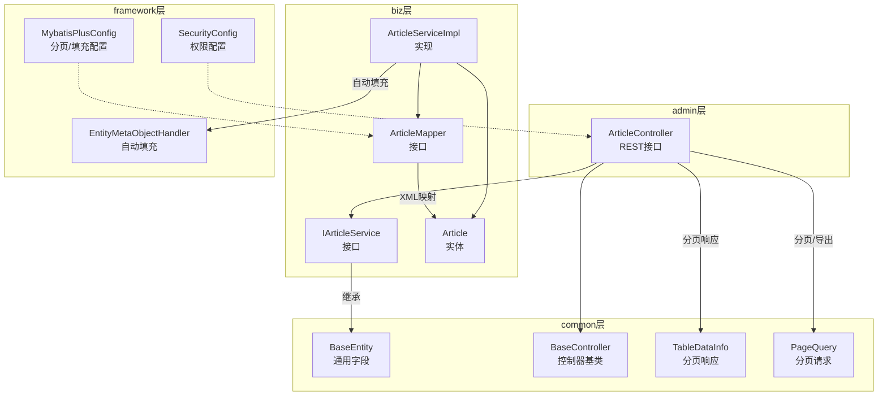
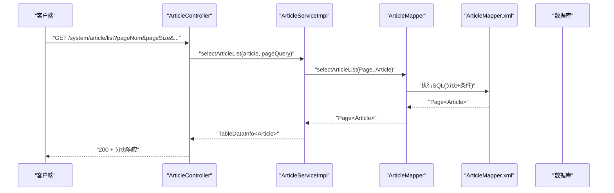
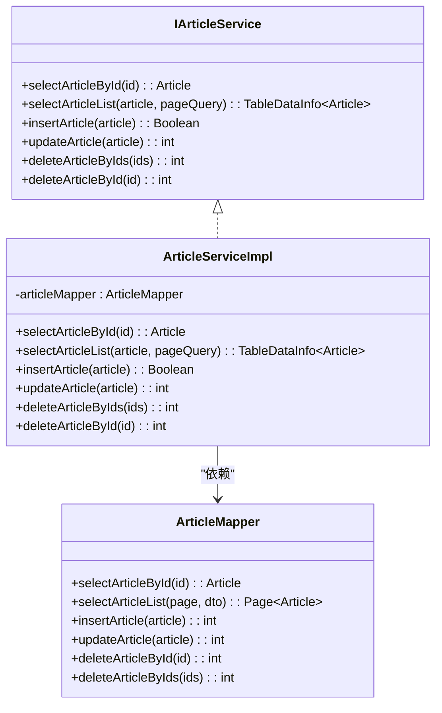
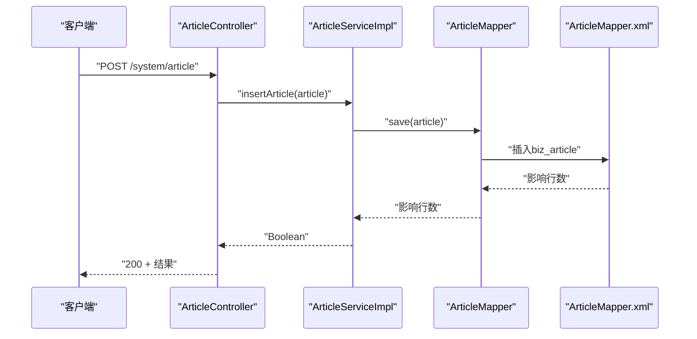
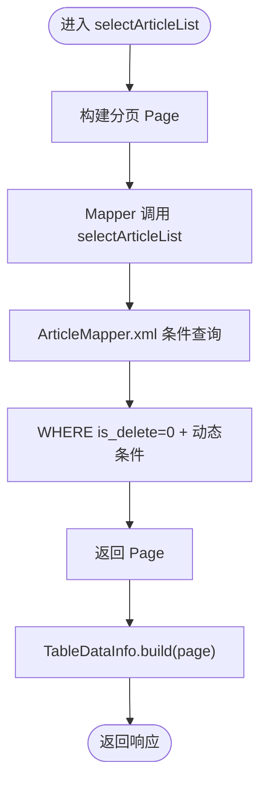
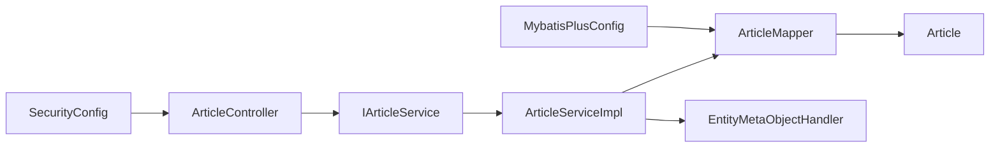

# 文章管理

<cite>
**本文引用的文件**
- [Article.java](file://blog-biz/src/main/java/blog/biz/domain/Article.java)
- [IArticleService.java](file://blog-biz/src/main/java/blog/biz/service/IArticleService.java)
- [ArticleServiceImpl.java](file://blog-biz/src/main/java/blog/biz/service/impl/ArticleServiceImpl.java)
- [ArticleMapper.java](file://blog-biz/src/main/java/blog/biz/mapper/ArticleMapper.java)
- [ArticleMapper.xml](file://blog-biz/src/main/resources/mapper/ArticleMapper.xml)
- [ArticleController.java](file://blog-admin/src/main/java/blog/web/controller/business/ArticleController.java)
- [BaseEntity.java](file://blog-common/src/main/java/blog/common/base/entity/BaseEntity.java)
- [BaseController.java](file://blog-common/src/main/java/blog/common/base/controller/BaseController.java)
- [TableDataInfo.java](file://blog-common/src/main/java/blog/common/base/resp/TableDataInfo.java)
- [PageQuery.java](file://blog-common/src/main/java/blog/common/base/req/PageQuery.java)
- [MybatisPlusConfig.java](file://blog-framework/src/main/java/blog/framework/config/MybatisPlusConfig.java)
- [EntityMetaObjectHandler.java](file://blog-framework/src/main/java/blog/framework/handler/EntityMetaObjectHandler.java)
- [SecurityConfig.java](file://blog-framework/src/main/java/blog/framework/config/SecurityConfig.java)
- [PermissionService.java](file://blog-framework/src/main/java/blog/framework/web/service/PermissionService.java)
- [BusinessType.java](file://blog-common/src/main/java/blog/common/enums/BusinessType.java)
- [ry-vue-owner.sql](file://ry-vue-owner.sql)
</cite>

## 目录
1. [简介](#简介)
2. [项目结构](#项目结构)
3. [核心组件](#核心组件)
4. [架构总览](#架构总览)
5. [组件详解](#组件详解)
6. [依赖关系分析](#依赖关系分析)
7. [性能考量](#性能考量)
8. [故障排查指南](#故障排查指南)
9. [结论](#结论)
10. [附录](#附录)

## 简介
本章节面向“文章管理”功能，系统性阐述从实体设计、服务层实现、控制器接口到持久层(MyBatis-Plus)应用的完整方案。重点覆盖：
- Article实体字段设计与业务语义
- CRUD与业务规则、数据校验、事务管理
- 控制器RESTful接口规范、参数处理、响应格式、权限控制
- MyBatis-Plus在文章管理中的Mapper接口、XML映射、分页与条件查询
- 完整API接口文档（请求参数、响应格式、错误码说明）
- 高级特性：文章状态管理、置顶/推荐、逻辑删除

## 项目结构
文章管理模块位于多模块工程中，涉及领域模型、服务层、持久层、Web控制器以及框架配置与通用基础能力。

图表来源
- [ArticleController.java:36-101](file://blog-admin/src/main/java/blog/web/controller/business/ArticleController.java#L36-L101)
- [IArticleService.java:14-63](file://blog-biz/src/main/java/blog/biz/service/IArticleService.java#L14-L63)
- [ArticleServiceImpl.java:22-94](file://blog-biz/src/main/java/blog/biz/service/impl/ArticleServiceImpl.java#L22-L94)
- [ArticleMapper.java:17-65](file://blog-biz/src/main/java/blog/biz/mapper/ArticleMapper.java#L17-L65)
- [Article.java:24-94](file://blog-biz/src/main/java/blog/biz/domain/Article.java#L24-L94)
- [BaseEntity.java:22-84](file://blog-common/src/main/java/blog/common/base/entity/BaseEntity.java#L22-L84)
- [BaseController.java:30-181](file://blog-common/src/main/java/blog/common/base/controller/BaseController.java#L30-L181)
- [TableDataInfo.java:14-97](file://blog-common/src/main/java/blog/common/base/resp/TableDataInfo.java#L14-L97)
- [PageQuery.java:24-127](file://blog-common/src/main/java/blog/common/base/req/PageQuery.java#L24-L127)
- [MybatisPlusConfig.java:17-55](file://blog-framework/src/main/java/blog/framework/config/MybatisPlusConfig.java#L17-L55)
- [EntityMetaObjectHandler.java:16-76](file://blog-framework/src/main/java/blog/framework/handler/EntityMetaObjectHandler.java#L16-L76)
- [SecurityConfig.java:31-126](file://blog-framework/src/main/java/blog/framework/config/SecurityConfig.java#L31-L126)

章节来源
- [ArticleController.java:36-101](file://blog-admin/src/main/java/blog/web/controller/business/ArticleController.java#L36-L101)
- [ArticleServiceImpl.java:22-94](file://blog-biz/src/main/java/blog/biz/service/impl/ArticleServiceImpl.java#L22-L94)
- [ArticleMapper.xml:5-293](file://blog-biz/src/main/resources/mapper/ArticleMapper.xml#L5-L293)

## 核心组件
- 实体(Article)：承载文章业务字段，继承通用基类(BaseEntity)，包含作者、分类、封面、标题、摘要、正文、置顶、推荐、状态、类型、访问密码、原文链接等，并支持动态扩展的作者名与分类名。
- Mapper(ArticleMapper)：基于MyBatis-Plus的BaseMapper扩展，定义文章的查询、新增、修改、删除方法。
- Service(ArticleServiceImpl)：实现CRUD与分页查询，负责业务规则（如新增时填充当前用户），并调用Mapper完成持久化。
- Controller(ArticleController)：提供RESTful接口，进行权限校验、日志记录、Excel导出、分页查询与单条查询。
- 框架配置：MyBatis-Plus分页拦截器、自动填充处理器；Spring Security权限控制；通用响应封装TableDataInfo与分页请求PageQuery。

章节来源
- [Article.java:24-94](file://blog-biz/src/main/java/blog/biz/domain/Article.java#L24-L94)
- [ArticleMapper.java:17-65](file://blog-biz/src/main/java/blog/biz/mapper/ArticleMapper.java#L17-L65)
- [ArticleServiceImpl.java:22-94](file://blog-biz/src/main/java/blog/biz/service/impl/ArticleServiceImpl.java#L22-L94)
- [ArticleController.java:36-101](file://blog-admin/src/main/java/blog/web/controller/business/ArticleController.java#L36-L101)
- [MybatisPlusConfig.java:17-55](file://blog-framework/src/main/java/blog/framework/config/MybatisPlusConfig.java#L17-L55)
- [EntityMetaObjectHandler.java:16-76](file://blog-framework/src/main/java/blog/framework/handler/EntityMetaObjectHandler.java#L16-L76)
- [TableDataInfo.java:14-97](file://blog-common/src/main/java/blog/common/base/resp/TableDataInfo.java#L14-L97)
- [PageQuery.java:24-127](file://blog-common/src/main/java/blog/common/base/req/PageQuery.java#L24-L127)

## 架构总览
文章管理采用经典的分层架构：Web层(Controller)接收请求，调用Service层执行业务逻辑，Service层通过Mapper访问数据库，MyBatis-Plus提供分页与自动填充能力，Spring Security保障接口权限。

图表来源
- [ArticleController.java:45-49](file://blog-admin/src/main/java/blog/web/controller/business/ArticleController.java#L45-L49)
- [ArticleServiceImpl.java:44-47](file://blog-biz/src/main/java/blog/biz/service/impl/ArticleServiceImpl.java#L44-L47)
- [ArticleMapper.java:32](file://blog-biz/src/main/java/blog/biz/mapper/ArticleMapper.java#L32)
- [ArticleMapper.xml:55-124](file://blog-biz/src/main/resources/mapper/ArticleMapper.xml#L55-L124)

## 组件详解

### 实体设计：Article
- 字段与业务含义
  - 主键与通用字段：继承BaseEntity，包含创建/更新信息与时间戳。
  - 作者(userId)、分类(categoryId)：关联用户与分类。
  - 封面(articleCover)、标题(articleTitle)、摘要(articleAbstract)、正文(articleContent)：内容载体。
  - 置顶(isTop)、推荐(isFeatured)：展示策略。
  - 状态(status)：公开/私密/草稿；配合访问密码(password)与原文链接(originalUrl)实现不同发布形态。
  - 类型(type)：原创/转载/翻译。
  - 逻辑删除(isDelete)：使用@TableLogic实现软删除。
  - 动态字段：userName、categoryName（用于联表查询展示）。
- 数据类型选择
  - 数值型：Long主键、Long用户/分类ID、Integer状态/类型/开关字段。
  - 字符串：封面URL、标题、摘要、密码、原文链接。
  - 日期：创建/更新时间。
- 设计要点
  - 使用@JsonSerialize将Long序列化为字符串，避免前端精度丢失。
  - 使用@TableLogic启用逻辑删除，确保历史审计与数据安全。
  - 使用@Excel标注便于导出与导入。

章节来源
- [Article.java:24-94](file://blog-biz/src/main/java/blog/biz/domain/Article.java#L24-L94)
- [BaseEntity.java:22-84](file://blog-common/src/main/java/blog/common/base/entity/BaseEntity.java#L22-L84)

### 服务层：IArticleService 与 ArticleServiceImpl
- 接口职责
  - 提供查询单条、查询列表（含分页）、新增、修改、批量删除、单条删除等标准CRUD。
- 实现要点
  - 新增时自动设置当前用户ID（insertArticle）。
  - 修改时自动更新时间（updateArticle）。
  - 列表查询通过PageQuery构建分页参数，返回TableDataInfo。
  - 删除统一委托Mapper执行。
- 事务与一致性
  - 服务层未显式声明事务，遵循Spring默认传播行为；若需跨表事务，请在Service层添加@Transactional。

图表来源
- [IArticleService.java:14-63](file://blog-biz/src/main/java/blog/biz/service/IArticleService.java#L14-L63)
- [ArticleServiceImpl.java:22-94](file://blog-biz/src/main/java/blog/biz/service/impl/ArticleServiceImpl.java#L22-L94)
- [ArticleMapper.java:17-65](file://blog-biz/src/main/java/blog/biz/mapper/ArticleMapper.java#L17-L65)

章节来源
- [IArticleService.java:14-63](file://blog-biz/src/main/java/blog/biz/service/IArticleService.java#L14-L63)
- [ArticleServiceImpl.java:22-94](file://blog-biz/src/main/java/blog/biz/service/impl/ArticleServiceImpl.java#L22-L94)

### 控制器：ArticleController
- 接口规范
  - GET /system/article/list：分页查询文章列表（支持按作者、分类、标题等条件过滤）。
  - POST /system/article/export：导出文章列表为Excel。
  - GET /system/article/{id}：获取单篇文章详情。
  - POST /system/article：新增文章。
  - PUT /system/article：修改文章。
  - DELETE /system/article/{ids}：批量删除文章。
- 参数与响应
  - 分页参数：pageNum/pageSize/orderByColumn/isAsc。
  - 响应：统一使用Result或TableDataInfo封装。
- 权限控制
  - 使用@PreAuthorize结合权限表达式，要求具备相应菜单权限（如system:article:list等）。
- 日志与导出
  - 使用@Log记录业务类型（新增/修改/删除/导出）。
  - 导出使用ExcelUtil对查询结果进行导出。

图表来源
- [ArticleController.java:77-80](file://blog-admin/src/main/java/blog/web/controller/business/ArticleController.java#L77-L80)
- [ArticleServiceImpl.java:56-59](file://blog-biz/src/main/java/blog/biz/service/impl/ArticleServiceImpl.java#L56-L59)
- [ArticleMapper.java:40](file://blog-biz/src/main/java/blog/biz/mapper/ArticleMapper.java#L40)
- [ArticleMapper.xml:131-227](file://blog-biz/src/main/resources/mapper/ArticleMapper.xml#L131-L227)

章节来源
- [ArticleController.java:36-101](file://blog-admin/src/main/java/blog/web/controller/business/ArticleController.java#L36-L101)
- [SecurityConfig.java:31-126](file://blog-framework/src/main/java/blog/framework/config/SecurityConfig.java#L31-L126)
- [PermissionService.java:19-81](file://blog-framework/src/main/java/blog/framework/web/service/PermissionService.java#L19-L81)

### MyBatis-Plus 应用
- Mapper接口
  - 继承BaseMapper，扩展selectArticleById、selectArticleList、insertArticle、updateArticle、deleteArticleById、deleteArticleByIds。
- XML映射
  - 定义ResultMap映射biz_article字段。
  - 条件查询：支持按userId、categoryId、articleTitle等字段过滤；默认隐藏is_delete=1的记录。
  - 插入/更新：根据非空字段动态拼接SQL。
  - 删除：提供单条与批量删除。
- 分页与排序
  - MybatisPlusConfig注册PaginationInnerInterceptor，自动分页。
  - PageQuery.build()将pageNum/pageSize/orderByColumn/isAsc转换为MyBatis-Plus的Page与OrderItem。
- 自动填充
  - EntityMetaObjectHandler在插入/更新时自动填充创建/更新人与时间。

图表来源
- [ArticleMapper.java:32](file://blog-biz/src/main/java/blog/biz/mapper/ArticleMapper.java#L32)
- [ArticleMapper.xml:55-124](file://blog-biz/src/main/resources/mapper/ArticleMapper.xml#L55-L124)
- [MybatisPlusConfig.java:20-35](file://blog-framework/src/main/java/blog/framework/config/MybatisPlusConfig.java#L20-L35)
- [PageQuery.java:62-74](file://blog-common/src/main/java/blog/common/base/req/PageQuery.java#L62-L74)
- [TableDataInfo.java:57-64](file://blog-common/src/main/java/blog/common/base/resp/TableDataInfo.java#L57-L64)

章节来源
- [ArticleMapper.java:17-65](file://blog-biz/src/main/java/blog/biz/mapper/ArticleMapper.java#L17-L65)
- [ArticleMapper.xml:5-293](file://blog-biz/src/main/resources/mapper/ArticleMapper.xml#L5-L293)
- [MybatisPlusConfig.java:17-55](file://blog-framework/src/main/java/blog/framework/config/MybatisPlusConfig.java#L17-L55)
- [EntityMetaObjectHandler.java:16-76](file://blog-framework/src/main/java/blog/framework/handler/EntityMetaObjectHandler.java#L16-L76)
- [PageQuery.java:24-127](file://blog-common/src/main/java/blog/common/base/req/PageQuery.java#L24-L127)
- [TableDataInfo.java:14-97](file://blog-common/src/main/java/blog/common/base/resp/TableDataInfo.java#L14-L97)

### 高级特性
- 文章状态管理
  - status=1公开、2私密、3草稿；可结合password实现私密访问控制。
- 置顶与推荐
  - isTop、isFeatured用于内容运营与首页展示策略。
- 逻辑删除
  - isDelete=1软删除，查询默认过滤已删除记录，保证数据安全与审计需求。

章节来源
- [Article.java:62-80](file://blog-biz/src/main/java/blog/biz/domain/Article.java#L62-L80)
- [ArticleMapper.xml:82-123](file://blog-biz/src/main/resources/mapper/ArticleMapper.xml#L82-L123)
- [ry-vue-owner.sql:251-262](file://ry-vue-owner.sql#L251-L262)

## 依赖关系分析
- 控制器依赖服务接口，服务实现依赖Mapper与实体。
- Mapper依赖XML映射文件与数据库。
- 服务层通过自动填充处理器填充创建/更新信息。
- MyBatis-Plus拦截器提供分页能力。
- Spring Security通过权限服务校验接口权限。

图表来源
- [ArticleController.java:36-101](file://blog-admin/src/main/java/blog/web/controller/business/ArticleController.java#L36-L101)
- [ArticleServiceImpl.java:22-94](file://blog-biz/src/main/java/blog/biz/service/impl/ArticleServiceImpl.java#L22-L94)
- [ArticleMapper.java:17-65](file://blog-biz/src/main/java/blog/biz/mapper/ArticleMapper.java#L17-L65)
- [Article.java:24-94](file://blog-biz/src/main/java/blog/biz/domain/Article.java#L24-L94)
- [EntityMetaObjectHandler.java:16-76](file://blog-framework/src/main/java/blog/framework/handler/EntityMetaObjectHandler.java#L16-L76)
- [MybatisPlusConfig.java:17-55](file://blog-framework/src/main/java/blog/framework/config/MybatisPlusConfig.java#L17-L55)
- [SecurityConfig.java:31-126](file://blog-framework/src/main/java/blog/framework/config/SecurityConfig.java#L31-L126)

章节来源
- [ArticleController.java:36-101](file://blog-admin/src/main/java/blog/web/controller/business/ArticleController.java#L36-L101)
- [ArticleServiceImpl.java:22-94](file://blog-biz/src/main/java/blog/biz/service/impl/ArticleServiceImpl.java#L22-L94)
- [ArticleMapper.xml:5-293](file://blog-biz/src/main/resources/mapper/ArticleMapper.xml#L5-L293)

## 性能考量
- 分页与排序
  - 使用MyBatis-Plus分页插件，避免一次性加载全量数据；PageQuery支持多字段排序，注意数据库索引优化。
- SQL条件
  - XML中采用动态where与if标签，仅拼接非空条件，减少无效过滤。
- 自动填充
  - 通过MetaObjectHandler减少重复赋值，降低业务代码复杂度。
- 导出性能
  - 导出接口建议限制最大导出条数或采用异步任务，避免大表导出阻塞线程。

## 故障排查指南
- 权限不足
  - 现象：403拒绝访问。
  - 排查：确认用户是否具备system:article:*权限；检查SecurityConfig与PermissionService。
- 分页参数错误
  - 现象：排序参数异常导致查询失败。
  - 排查：PageQuery对isAsc与orderByColumn进行兼容与校验，检查传参格式。
- 逻辑删除影响查询
  - 现象：查询不到已删除数据属预期。
  - 排查：确认查询条件未排除is_delete；如需查看，请调整过滤逻辑。
- Excel导出异常
  - 现象：导出失败或无数据。
  - 排查：确认查询结果存在且未超过导出上限；检查ExcelUtil使用方式。

章节来源
- [SecurityConfig.java:31-126](file://blog-framework/src/main/java/blog/framework/config/SecurityConfig.java#L31-L126)
- [PermissionService.java:19-81](file://blog-framework/src/main/java/blog/framework/web/service/PermissionService.java#L19-L81)
- [PageQuery.java:85-115](file://blog-common/src/main/java/blog/common/base/req/PageQuery.java#L85-L115)
- [ArticleMapper.xml:82-123](file://blog-biz/src/main/resources/mapper/ArticleMapper.xml#L82-L123)
- [ArticleController.java:54-61](file://blog-admin/src/main/java/blog/web/controller/business/ArticleController.java#L54-L61)

## 结论
文章管理模块以清晰的分层设计实现了从实体、服务、持久层到Web接口的完整闭环。借助MyBatis-Plus的分页与自动填充能力，结合Spring Security的权限控制，既满足了日常CRUD与高级特性（状态、置顶、推荐、逻辑删除），又保证了可维护性与扩展性。后续可在Service层引入事务管理与更严格的参数校验，进一步提升健壮性。

## 附录

### API 接口文档

- 列表查询
  - 方法：GET
  - 路径：/system/article/list
  - 权限：system:article:list
  - 请求参数：
    - pageNum：页码
    - pageSize：每页数量
    - orderByColumn：排序字段（下划线命名）
    - isAsc：排序方向 asc/desc
    - 其他过滤字段：userId、categoryId、articleTitle、articleAbstract、articleContent、isTop、isFeatured、status、type、password、originalUrl
  - 响应：TableDataInfo(rows,total,code,msg)
  - 示例响应字段：rows(List<Article>)、total(long)、code(int)、msg(String)

- 导出列表
  - 方法：POST
  - 路径：/system/article/export
  - 权限：system:article:export
  - 请求参数：同列表查询（可选）
  - 响应：Excel文件下载

- 获取详情
  - 方法：GET
  - 路径：/system/article/{id}
  - 权限：system:article:query
  - 路径参数：id(Long)
  - 响应：Result(Article)

- 新增文章
  - 方法：POST
  - 路径：/system/article
  - 权限：system:article:add
  - 请求体：Article（除主键与自动填充字段外）
  - 响应：Result(Boolean)

- 修改文章
  - 方法：PUT
  - 路径：/system/article
  - 权限：system:article:edit
  - 请求体：Article（包含id）
  - 响应：Result(int)

- 删除文章
  - 方法：DELETE
  - 路径：/system/article/{ids}
  - 权限：system:article:remove
  - 路径参数：ids(数组)
  - 响应：Result(int)

- 错误码说明
  - 成功：HTTP 200 + code=200
  - 未授权/权限不足：HTTP 401/403
  - 参数错误：由PageQuery校验抛出业务异常（如排序参数错误）
  - 服务器异常：HTTP 500 + 异常信息

章节来源
- [ArticleController.java:45-100](file://blog-admin/src/main/java/blog/web/controller/business/ArticleController.java#L45-L100)
- [TableDataInfo.java:57-64](file://blog-common/src/main/java/blog/common/base/resp/TableDataInfo.java#L57-L64)
- [BusinessType.java:8-58](file://blog-common/src/main/java/blog/common/enums/BusinessType.java#L8-L58)