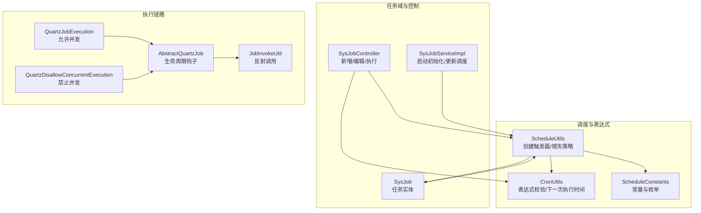
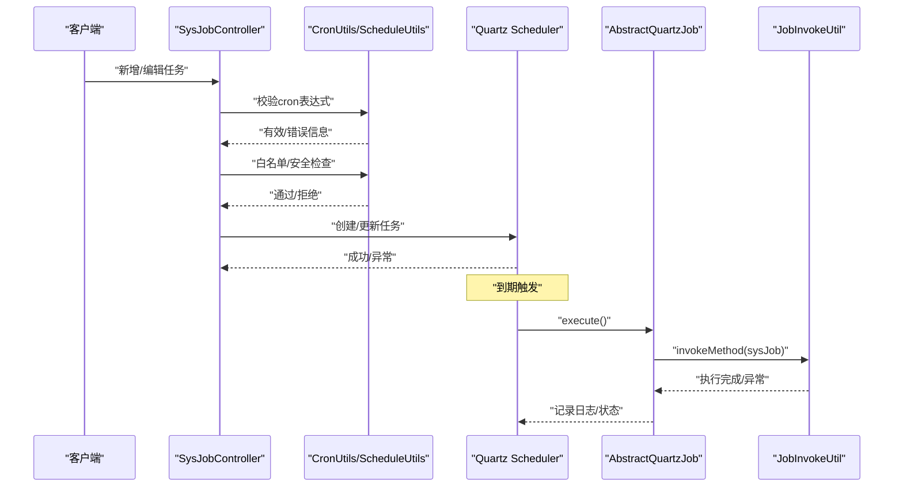
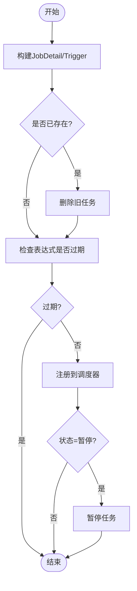
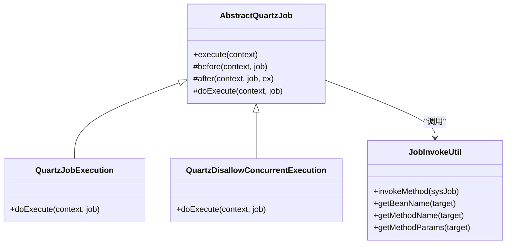
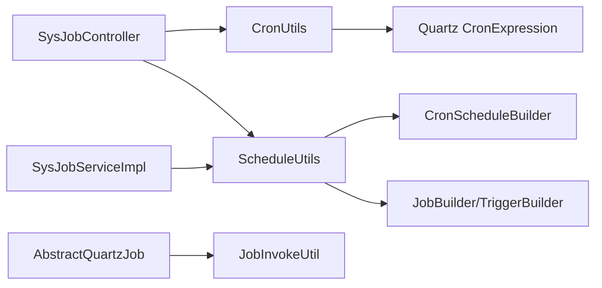

# Cron表达式详解

<cite>
**本文引用的文件**
- [CronUtils.java](file://blog-quartz/src/main/java/blog/quartz/util/CronUtils.java)
- [ScheduleUtils.java](file://blog-quartz/src/main/java/blog/quartz/util/ScheduleUtils.java)
- [ScheduleConstants.java](file://blog-common/src/main/java/blog/common/constant/ScheduleConstants.java)
- [SysJob.java](file://blog-quartz/src/main/java/blog/quartz/domain/SysJob.java)
- [SysJobController.java](file://blog-quartz/src/main/java/blog/quartz/controller/SysJobController.java)
- [AbstractQuartzJob.java](file://blog-quartz/src/main/java/blog/quartz/util/AbstractQuartzJob.java)
- [QuartzJobExecution.java](file://blog-quartz/src/main/java/blog/quartz/util/QuartzJobExecution.java)
- [QuartzDisallowConcurrentExecution.java](file://blog-quartz/src/main/java/blog/quartz/util/QuartzDisallowConcurrentExecution.java)
- [JobInvokeUtil.java](file://blog-quartz/src/main/java/blog/quartz/util/JobInvokeUtil.java)
- [SysJobServiceImpl.java](file://blog-quartz/src/main/java/blog/quartz/service/impl/SysJobServiceImpl.java)
- [TaskException.java](file://blog-common/src/main/java/blog/common/exception/job/TaskException.java)
- [application.yml](file://blog-admin/src/main/resources/application.yml)
</cite>

## 目录
1. [简介](#简介)
2. [项目结构](#项目结构)
3. [核心组件](#核心组件)
4. [架构总览](#架构总览)
5. [详细组件分析](#详细组件分析)
6. [依赖关系分析](#依赖关系分析)
7. [性能与可靠性考量](#性能与可靠性考量)
8. [调试与排错指南](#调试与排错指南)
9. [结论](#结论)
10. [附录：Cron表达式语法与示例](#附录cron表达式语法与示例)

## 简介
本指南围绕项目中的Cron表达式体系进行系统性讲解，涵盖：
- Cron表达式的语法规则与字段含义（秒、分钟、小时、日、月、周、年）
- 常用时间表达式示例（每分钟、每日、每周、每月等）
- CronUtils工具类的功能与使用方法（表达式校验、下一次执行时间计算）
- 错失触发（misfire）策略及其适用场景
- 调试技巧与常见问题排查

## 项目结构
与Cron表达式相关的核心模块位于 blog-quartz 与 blog-common 中，主要涉及：
- 表达式工具：CronUtils
- 调度工具：ScheduleUtils
- 任务模型：SysJob
- 控制器：SysJobController
- 作业执行：AbstractQuartzJob、QuartzJobExecution、QuartzDisallowConcurrentExecution
- 方法调用：JobInvokeUtil
- 服务初始化：SysJobServiceImpl
- 常量与异常：ScheduleConstants、TaskException

图表来源
- [CronUtils.java:1-63](file://blog-quartz/src/main/java/blog/quartz/util/CronUtils.java#L1-L63)
- [ScheduleUtils.java:1-142](file://blog-quartz/src/main/java/blog/quartz/util/ScheduleUtils.java#L1-L142)
- [ScheduleConstants.java:1-56](file://blog-common/src/main/java/blog/common/constant/ScheduleConstants.java#L1-L56)
- [SysJob.java:1-172](file://blog-quartz/src/main/java/blog/quartz/domain/SysJob.java#L1-L172)
- [SysJobController.java:1-186](file://blog-quartz/src/main/java/blog/quartz/controller/SysJobController.java#L1-L186)
- [SysJobServiceImpl.java:1-94](file://blog-quartz/src/main/java/blog/quartz/service/impl/SysJobServiceImpl.java#L1-L94)
- [AbstractQuartzJob.java:1-107](file://blog-quartz/src/main/java/blog/quartz/util/AbstractQuartzJob.java#L1-L107)
- [QuartzJobExecution.java:1-20](file://blog-quartz/src/main/java/blog/quartz/util/QuartzJobExecution.java#L1-L20)
- [QuartzDisallowConcurrentExecution.java:1-22](file://blog-quartz/src/main/java/blog/quartz/util/QuartzDisallowConcurrentExecution.java#L1-L22)
- [JobInvokeUtil.java:1-183](file://blog-quartz/src/main/java/blog/quartz/util/JobInvokeUtil.java#L1-L183)

章节来源
- [application.yml:1-161](file://blog-admin/src/main/resources/application.yml#L1-L161)

## 核心组件
- CronUtils：提供表达式有效性判断、错误消息获取、下一次执行时间计算。
- ScheduleUtils：负责创建Quartz任务、构建触发器、应用错失触发策略、白名单检查、暂停/恢复等。
- SysJob：任务实体，包含cron表达式、错失策略、并发策略、状态等字段，并提供“下一次执行时间”的便捷访问。
- SysJobController：对外暴露任务管理接口，新增/编辑时进行表达式校验与安全检查。
- AbstractQuartzJob 及其子类：封装Quartz作业的生命周期（前置/后置钩子），统一记录日志与异常。
- JobInvokeUtil：解析 invokeTarget 并通过Spring容器或反射调用目标方法。

章节来源
- [CronUtils.java:1-63](file://blog-quartz/src/main/java/blog/quartz/util/CronUtils.java#L1-L63)
- [ScheduleUtils.java:1-142](file://blog-quartz/src/main/java/blog/quartz/util/ScheduleUtils.java#L1-L142)
- [SysJob.java:1-172](file://blog-quartz/src/main/java/blog/quartz/domain/SysJob.java#L1-L172)
- [SysJobController.java:1-186](file://blog-quartz/src/main/java/blog/quartz/controller/SysJobController.java#L1-L186)
- [AbstractQuartzJob.java:1-107](file://blog-quartz/src/main/java/blog/quartz/util/AbstractQuartzJob.java#L1-L107)
- [QuartzJobExecution.java:1-20](file://blog-quartz/src/main/java/blog/quartz/util/QuartzJobExecution.java#L1-L20)
- [QuartzDisallowConcurrentExecution.java:1-22](file://blog-quartz/src/main/java/blog/quartz/util/QuartzDisallowConcurrentExecution.java#L1-L22)
- [JobInvokeUtil.java:1-183](file://blog-quartz/src/main/java/blog/quartz/util/JobInvokeUtil.java#L1-L183)

## 架构总览
Cron表达式在系统中的工作流如下：
- 控制器接收任务请求，先用 CronUtils 校验表达式，再进行白名单与安全检查。
- 使用 ScheduleUtils 将任务注册到Quartz调度器，应用错失策略与并发策略。
- 任务到期由Quartz触发，AbstractQuartzJob统一拦截，调用 JobInvokeUtil 执行具体业务方法。
- SysJobServiceImpl 在应用启动时重建调度器中的所有任务。

图表来源
- [SysJobController.java:80-147](file://blog-quartz/src/main/java/blog/quartz/controller/SysJobController.java#L80-L147)
- [CronUtils.java:21-62](file://blog-quartz/src/main/java/blog/quartz/util/CronUtils.java#L21-L62)
- [ScheduleUtils.java:60-98](file://blog-quartz/src/main/java/blog/quartz/util/ScheduleUtils.java#L60-L98)
- [AbstractQuartzJob.java:32-51](file://blog-quartz/src/main/java/blog/quartz/util/AbstractQuartzJob.java#L32-L51)
- [JobInvokeUtil.java:23-63](file://blog-quartz/src/main/java/blog/quartz/util/JobInvokeUtil.java#L23-L63)

## 详细组件分析

### CronUtils 工具类
- 功能要点
  - 表达式有效性判断：基于 Quartz 的 CronExpression.isValidExpression。
  - 错误消息获取：尝试构造 CronExpression，捕获解析异常并返回消息。
  - 下一次执行时间：基于当前时间计算下一个有效执行时刻。
- 使用建议
  - 新增/编辑任务前务必调用 isValid 校验。
  - 若表达式无效，结合 getInvalidMessage 提示用户修正。
  - 通过 getNextExecution 预判下次执行时间，便于前端展示或自动化测试。

章节来源
- [CronUtils.java:1-63](file://blog-quartz/src/main/java/blog/quartz/util/CronUtils.java#L1-L63)

### ScheduleUtils 调度工具
- 功能要点
  - 构建 JobDetail 与 Trigger，设置并发策略（允许/禁止）。
  - 应用错失触发策略：默认、忽略错失、触发一次、不做任何处理。
  - 白名单检查：限制 invokeTarget 的可调用范围，避免高危调用。
  - 任务状态控制：根据状态暂停/恢复。
- 关键流程
  - 创建任务：校验过期、删除旧任务、注册新任务。
  - 错失策略：依据 SysJob.misfirePolicy 分支处理。

图表来源
- [ScheduleUtils.java:60-98](file://blog-quartz/src/main/java/blog/quartz/util/ScheduleUtils.java#L60-L98)

章节来源
- [ScheduleUtils.java:1-142](file://blog-quartz/src/main/java/blog/quartz/util/ScheduleUtils.java#L1-L142)
- [ScheduleConstants.java:1-56](file://blog-common/src/main/java/blog/common/constant/ScheduleConstants.java#L1-L56)

### SysJob 任务实体
- 字段与行为
  - cronExpression：Cron表达式。
  - misfirePolicy：错失策略（默认/忽略/触发一次/不做）。
  - concurrent：并发策略（允许/禁止）。
  - status：任务状态（正常/暂停）。
  - getNextValidTime：基于 CronUtils 计算下一次执行时间。
- 设计意义
  - 将调度相关的关键信息集中于实体，便于控制器与服务层直接使用。

章节来源
- [SysJob.java:1-172](file://blog-quartz/src/main/java/blog/quartz/domain/SysJob.java#L1-L172)
- [CronUtils.java:51-62](file://blog-quartz/src/main/java/blog/quartz/util/CronUtils.java#L51-L62)

### SysJobController 控制器
- 校验与安全
  - 新增/编辑时调用 CronUtils 校验表达式。
  - 对 invokeTarget 进行白名单与安全关键字过滤。
- 其他能力
  - 导出、查询、变更状态、立即执行一次、删除等。

章节来源
- [SysJobController.java:1-186](file://blog-quartz/src/main/java/blog/quartz/controller/SysJobController.java#L1-L186)

### 作业执行链路
- AbstractQuartzJob：统一的生命周期钩子，记录开始/结束时间、异常信息与执行时长。
- QuartzJobExecution：允许并发执行。
- QuartzDisallowConcurrentExecution：禁止并发执行。
- JobInvokeUtil：解析 invokeTarget，支持无参/有参、字符串/布尔/整型/长整型/双精度等参数类型。

图表来源
- [AbstractQuartzJob.java:1-107](file://blog-quartz/src/main/java/blog/quartz/util/AbstractQuartzJob.java#L1-L107)
- [QuartzJobExecution.java:1-20](file://blog-quartz/src/main/java/blog/quartz/util/QuartzJobExecution.java#L1-L20)
- [QuartzDisallowConcurrentExecution.java:1-22](file://blog-quartz/src/main/java/blog/quartz/util/QuartzDisallowConcurrentExecution.java#L1-L22)
- [JobInvokeUtil.java:1-183](file://blog-quartz/src/main/java/blog/quartz/util/JobInvokeUtil.java#L1-L183)

章节来源
- [AbstractQuartzJob.java:1-107](file://blog-quartz/src/main/java/blog/quartz/util/AbstractQuartzJob.java#L1-L107)
- [QuartzJobExecution.java:1-20](file://blog-quartz/src/main/java/blog/quartz/util/QuartzJobExecution.java#L1-L20)
- [QuartzDisallowConcurrentExecution.java:1-22](file://blog-quartz/src/main/java/blog/quartz/util/QuartzDisallowConcurrentExecution.java#L1-L22)
- [JobInvokeUtil.java:1-183](file://blog-quartz/src/main/java/blog/quartz/util/JobInvokeUtil.java#L1-L183)

### SysJobServiceImpl 初始化与更新
- 启动时重建：清空调度器，遍历数据库中所有任务，逐个创建。
- 更新时重建：删除旧任务并重新创建，确保调度器与数据库一致。

章节来源
- [SysJobServiceImpl.java:34-46](file://blog-quartz/src/main/java/blog/quartz/service/impl/SysJobServiceImpl.java#L34-L46)
- [SysJobServiceImpl.java:237-248](file://blog-quartz/src/main/java/blog/quartz/service/impl/SysJobServiceImpl.java#L237-L248)

## 依赖关系分析
- CronUtils 依赖 Quartz CronExpression 进行表达式解析与时间推导。
- ScheduleUtils 依赖 CronScheduleBuilder、TriggerBuilder、JobBuilder 构建调度对象，并应用错失策略。
- SysJobController 依赖 CronUtils 与 ScheduleUtils 完成业务校验与调度注册。
- AbstractQuartzJob 依赖 JobInvokeUtil 执行业务逻辑。
- SysJobServiceImpl 依赖 Scheduler 与 ScheduleUtils 完成启动初始化与更新。

图表来源
- [CronUtils.java:1-63](file://blog-quartz/src/main/java/blog/quartz/util/CronUtils.java#L1-L63)
- [ScheduleUtils.java:1-142](file://blog-quartz/src/main/java/blog/quartz/util/ScheduleUtils.java#L1-L142)
- [SysJobController.java:1-186](file://blog-quartz/src/main/java/blog/quartz/controller/SysJobController.java#L1-L186)
- [SysJobServiceImpl.java:1-94](file://blog-quartz/src/main/java/blog/quartz/service/impl/SysJobServiceImpl.java#L1-L94)
- [AbstractQuartzJob.java:1-107](file://blog-quartz/src/main/java/blog/quartz/util/AbstractQuartzJob.java#L1-L107)
- [JobInvokeUtil.java:1-183](file://blog-quartz/src/main/java/blog/quartz/util/JobInvokeUtil.java#L1-L183)

## 性能与可靠性考量
- 表达式复杂度：过于复杂的表达式可能增加计算成本，建议优先使用简单明确的组合。
- 错失策略选择：
  - 默认：遵循Quartz默认行为。
  - 忽略错失：适合批量重跑场景，快速补齐。
  - 触发一次：适合补偿型任务，仅执行一次。
  - 不做：适合严格按时执行且不希望补跑的任务。
- 并发策略：若任务执行时间不确定或存在状态竞争，建议禁止并发，避免数据不一致。
- 白名单与安全：通过白名单限制 invokeTarget，降低远程代码执行风险。

[本节为通用指导，无需特定文件引用]

## 调试与排错指南
- 表达式校验
  - 使用 CronUtils.isValid 快速判断；若失败，使用 getInvalidMessage 获取具体错误提示。
  - 使用 getNextExecution 预测下一次执行时间，核对预期是否一致。
- 常见问题
  - 表达式格式错误：检查各字段取值范围与分隔符。
  - 任务已过期：当表达式不再有未来执行时间时，调度器不会注册。
  - 并发冲突：若任务长时间运行导致堆积，考虑禁止并发或缩短执行时间。
  - 安全拦截：invokeTarget 不在白名单或包含禁用关键字会被拒绝。
- 异常处理
  - 错失策略非法：抛出 TaskException，需检查 misfirePolicy 的取值。
  - 作业执行异常：AbstractQuartzJob 的 after 钩子会记录异常信息，便于定位。

章节来源
- [CronUtils.java:21-62](file://blog-quartz/src/main/java/blog/quartz/util/CronUtils.java#L21-L62)
- [ScheduleUtils.java:103-120](file://blog-quartz/src/main/java/blog/quartz/util/ScheduleUtils.java#L103-L120)
- [TaskException.java:1-29](file://blog-common/src/main/java/blog/common/exception/job/TaskException.java#L1-L29)
- [SysJobController.java:80-147](file://blog-quartz/src/main/java/blog/quartz/controller/SysJobController.java#L80-L147)
- [AbstractQuartzJob.java:46-96](file://blog-quartz/src/main/java/blog/quartz/util/AbstractQuartzJob.java#L46-L96)

## 结论
本项目以 Quartz 为基础，提供了完善的 Cron 表达式校验、调度注册、错失策略与安全控制能力。通过 CronUtils 与 ScheduleUtils 的清晰分工，以及 SysJob 的统一建模，开发者可以快速、安全地构建定时任务。建议在实际使用中：
- 优先使用简单明确的表达式；
- 明确错失策略与并发策略；
- 严格控制 invokeTarget 的可调用范围；
- 借助 getNextExecution 进行预演与测试。

[本节为总结性内容，无需特定文件引用]

## 附录：Cron表达式语法与示例

### 字段说明与取值范围
- 秒：0–59，支持*, -, /, ?
- 分钟：0–59，支持*, -, /, ?
- 小时：0–23，支持*, -, /, ?
- 日：1–31，支持*, -, /, ?, L, W, LW
- 月：1–12 或 JAN–DEC，支持*, -, /, ?
- 周：1–7 或 SUN–SAT，支持*, -, /, ?, L, #
- 年（可选）：1970–2099，支持*, -, /, ?

注：部分特殊字符含义
- *：匹配任意值
- -：范围
- /：步进
- ?：不指定具体值（日期/星期二选一）
- L：最后
- W：最近的工作日
- LW：最后一个工作日
- #：第几个星期几

### 常用表达式示例（语义说明）
- 每分钟执行：0 * * * * ?
- 每小时执行：0 0 * * * ?
- 每日执行（例如每天02:00）：0 0 2 * * ?
- 每周一上午9:00：0 0 9 ? * 2
- 每月1日00:00：0 0 0 1 * ?
- 每季度首月首日00:00：0 0 0 1 1/3 ?
- 每年1月1日00:00：0 0 0 1 1 ? *

说明：以上示例为常见场景的表达式写法，具体请结合业务需求调整。

[本节为通用知识，无需特定文件引用]