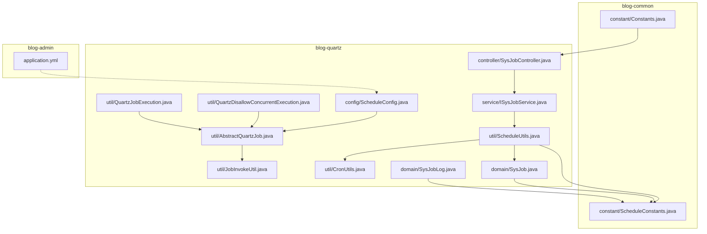
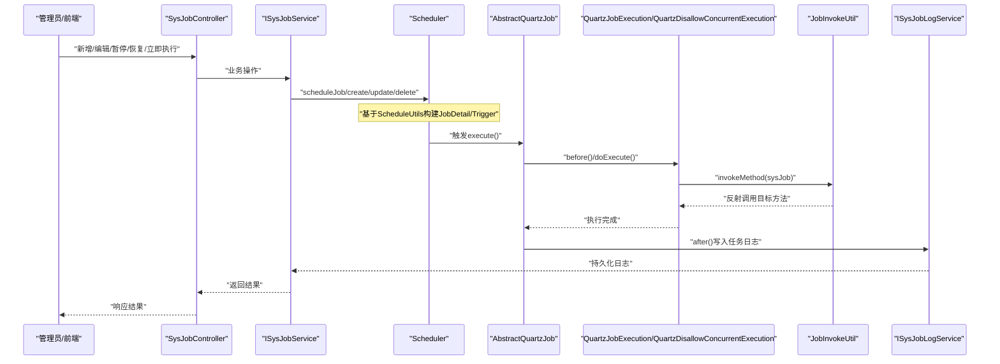
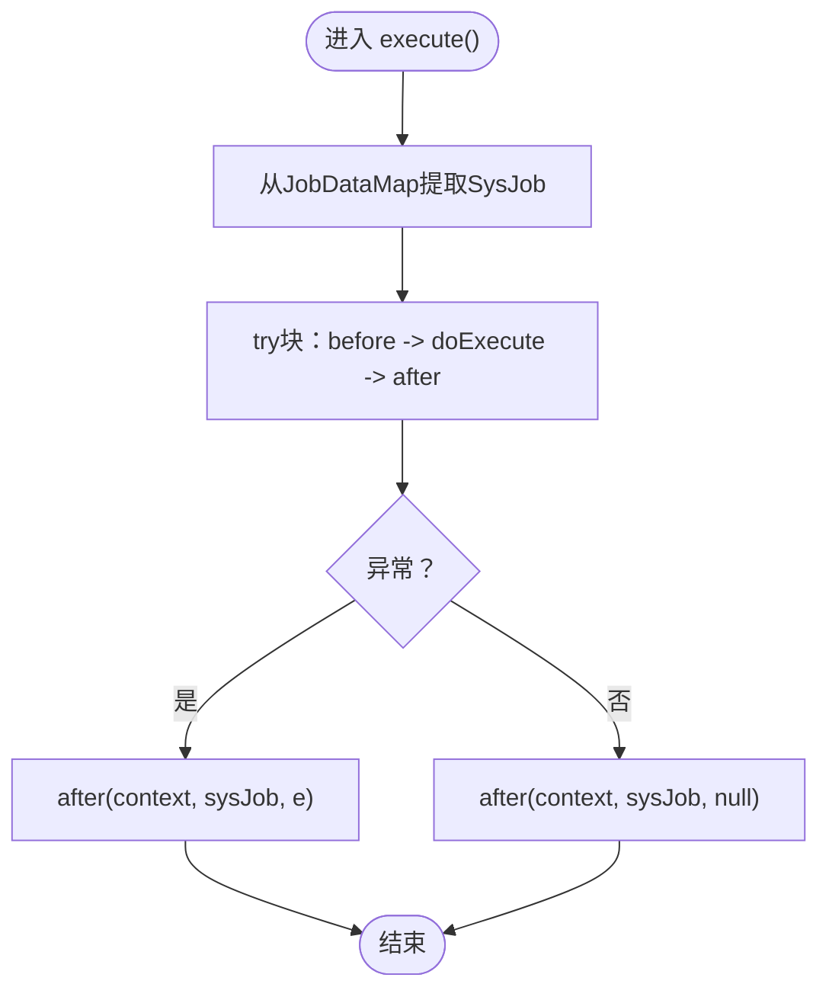
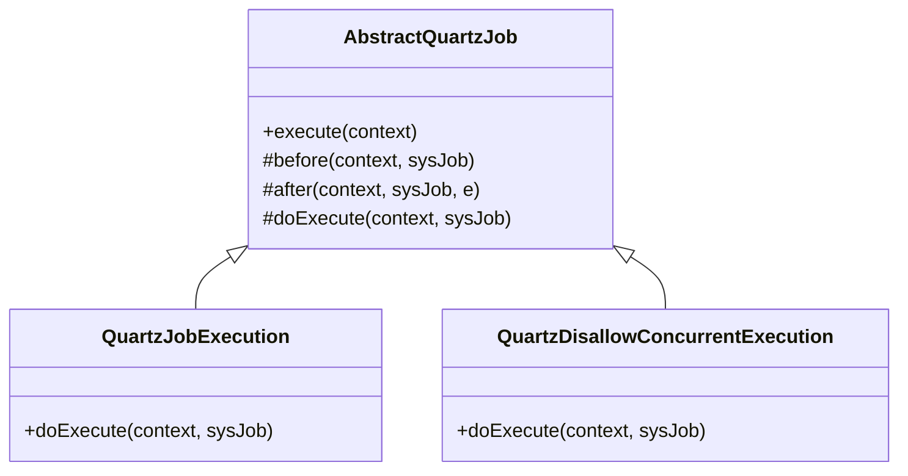
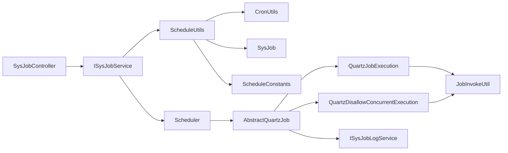

# Quartz集成配置

<cite>
**本文引用的文件**
- [ScheduleConfig.java](file://blog-quartz/src/main/java/blog/quartz/config/ScheduleConfig.java)
- [AbstractQuartzJob.java](file://blog-quartz/src/main/java/blog/quartz/util/AbstractQuartzJob.java)
- [QuartzDisallowConcurrentExecution.java](file://blog-quartz/src/main/java/blog/quartz/util/QuartzDisallowConcurrentExecution.java)
- [QuartzJobExecution.java](file://blog-quartz/src/main/java/blog/quartz/util/QuartzJobExecution.java)
- [JobInvokeUtil.java](file://blog-quartz/src/main/java/blog/quartz/util/JobInvokeUtil.java)
- [ScheduleUtils.java](file://blog-quartz/src/main/java/blog/quartz/util/ScheduleUtils.java)
- [CronUtils.java](file://blog-quartz/src/main/java/blog/quartz/util/CronUtils.java)
- [SysJob.java](file://blog-quartz/src/main/java/blog/quartz/domain/SysJob.java)
- [SysJobLog.java](file://blog-quartz/src/main/java/blog/quartz/domain/SysJobLog.java)
- [ISysJobService.java](file://blog-quartz/src/main/java/blog/quartz/service/ISysJobService.java)
- [SysJobController.java](file://blog-quartz/src/main/java/blog/quartz/controller/SysJobController.java)
- [ScheduleConstants.java](file://blog-common/src/main/java/blog/common/constant/ScheduleConstants.java)
- [Constants.java](file://blog-common/src/main/java/blog/common/constant/Constants.java)
- [application.yml](file://blog-admin/src/main/resources/application.yml)
</cite>

## 目录
1. [简介](#简介)
2. [项目结构](#项目结构)
3. [核心组件](#核心组件)
4. [架构总览](#架构总览)
5. [详细组件分析](#详细组件分析)
6. [依赖分析](#依赖分析)
7. [性能考虑](#性能考虑)
8. [故障排查指南](#故障排查指南)
9. [结论](#结论)
10. [附录](#附录)

## 简介
本文件系统性梳理项目中Quartz调度框架的集成与使用，重点围绕以下方面展开：
- ScheduleConfig配置类的设计与实现要点
- AbstractQuartzJob抽象基类及其继承体系
- QuartzDisallowConcurrentExecution与QuartzJobExecution的职责与差异
- 关键配置参数、线程池与作业存储策略
- 任务执行生命周期：初始化、执行、完成、异常处理
- 最佳实践与性能调优建议

## 项目结构
Quartz相关代码主要位于blog-quartz模块，配合blog-common中的常量与工具类，形成“配置-作业-调度-控制台”的完整闭环。

图表来源
- [ScheduleConfig.java:1-58](file://blog-quartz/src/main/java/blog/quartz/config/ScheduleConfig.java#L1-L58)
- [AbstractQuartzJob.java:1-107](file://blog-quartz/src/main/java/blog/quartz/util/AbstractQuartzJob.java#L1-L107)
- [QuartzDisallowConcurrentExecution.java:1-22](file://blog-quartz/src/main/java/blog/quartz/util/QuartzDisallowConcurrentExecution.java#L1-L22)
- [QuartzJobExecution.java:1-20](file://blog-quartz/src/main/java/blog/quartz/util/QuartzJobExecution.java#L1-L20)
- [JobInvokeUtil.java:1-183](file://blog-quartz/src/main/java/blog/quartz/util/JobInvokeUtil.java#L1-L183)
- [ScheduleUtils.java:1-142](file://blog-quartz/src/main/java/blog/quartz/util/ScheduleUtils.java#L1-L142)
- [CronUtils.java:1-64](file://blog-quartz/src/main/java/blog/quartz/util/CronUtils.java#L1-L64)
- [SysJob.java:1-172](file://blog-quartz/src/main/java/blog/quartz/domain/SysJob.java#L1-L172)
- [SysJobLog.java:1-156](file://blog-quartz/src/main/java/blog/quartz/domain/SysJobLog.java#L1-L156)
- [ISysJobService.java:1-103](file://blog-quartz/src/main/java/blog/quartz/service/ISysJobService.java#L1-L103)
- [SysJobController.java:1-186](file://blog-quartz/src/main/java/blog/quartz/controller/SysJobController.java#L1-L186)
- [ScheduleConstants.java:1-57](file://blog-common/src/main/java/blog/common/constant/ScheduleConstants.java#L1-L57)
- [Constants.java:1-235](file://blog-common/src/main/java/blog/common/constant/Constants.java#L1-L235)
- [application.yml:1-161](file://blog-admin/src/main/resources/application.yml#L1-L161)

章节来源
- [ScheduleConfig.java:1-58](file://blog-quartz/src/main/java/blog/quartz/config/ScheduleConfig.java#L1-L58)
- [application.yml:1-161](file://blog-admin/src/main/resources/application.yml#L1-L161)

## 核心组件
- ScheduleConfig：Spring配置类，负责装配SchedulerFactoryBean，设置Quartz属性、线程池、JobStore、集群参数、启动延迟、覆盖策略等。
- AbstractQuartzJob：Quartz Job接口实现的抽象基类，统一执行流程（before/doExecute/after），并封装日志记录与异常处理。
- QuartzDisallowConcurrentExecution：禁止并发执行的具体实现，通过注解@DisallowConcurrentExecution确保同一任务实例不会并发运行。
- QuartzJobExecution：允许并发执行的具体实现，适用于可重入、无状态的任务。
- JobInvokeUtil：根据SysJob.invokeTarget动态解析并调用目标方法，支持Spring Bean与全限定类名两种模式。
- ScheduleUtils：任务创建、触发器构建、Misfire策略处理、白名单校验等调度逻辑的工具类。
- CronUtils：Cron表达式有效性校验与下一次执行时间推导。
- SysJob/SysJobLog：任务与日志的数据模型。
- ISysJobService/SysJobController：业务接口与REST控制器，提供任务的增删改查、暂停/恢复、立即执行等操作。

章节来源
- [AbstractQuartzJob.java:18-107](file://blog-quartz/src/main/java/blog/quartz/util/AbstractQuartzJob.java#L18-L107)
- [QuartzDisallowConcurrentExecution.java:7-22](file://blog-quartz/src/main/java/blog/quartz/util/QuartzDisallowConcurrentExecution.java#L7-L22)
- [QuartzJobExecution.java:6-20](file://blog-quartz/src/main/java/blog/quartz/util/QuartzJobExecution.java#L6-L20)
- [JobInvokeUtil.java:11-183](file://blog-quartz/src/main/java/blog/quartz/util/JobInvokeUtil.java#L11-L183)
- [ScheduleUtils.java:21-142](file://blog-quartz/src/main/java/blog/quartz/util/ScheduleUtils.java#L21-L142)
- [CronUtils.java:7-64](file://blog-quartz/src/main/java/blog/quartz/util/CronUtils.java#L7-L64)
- [SysJob.java:16-172](file://blog-quartz/src/main/java/blog/quartz/domain/SysJob.java#L16-L172)
- [SysJobLog.java:9-156](file://blog-quartz/src/main/java/blog/quartz/domain/SysJobLog.java#L9-L156)
- [ISysJobService.java:8-103](file://blog-quartz/src/main/java/blog/quartz/service/ISysJobService.java#L8-L103)
- [SysJobController.java:30-186](file://blog-quartz/src/main/java/blog/quartz/controller/SysJobController.java#L30-L186)

## 架构总览
下图展示从控制器到调度器、再到作业执行与日志记录的整体流程。

图表来源
- [SysJobController.java:30-186](file://blog-quartz/src/main/java/blog/quartz/controller/SysJobController.java#L30-L186)
- [ISysJobService.java:8-103](file://blog-quartz/src/main/java/blog/quartz/service/ISysJobService.java#L8-L103)
- [ScheduleUtils.java:58-98](file://blog-quartz/src/main/java/blog/quartz/util/ScheduleUtils.java#L58-L98)
- [AbstractQuartzJob.java:32-51](file://blog-quartz/src/main/java/blog/quartz/util/AbstractQuartzJob.java#L32-L51)
- [QuartzJobExecution.java:12-19](file://blog-quartz/src/main/java/blog/quartz/util/QuartzJobExecution.java#L12-L19)
- [QuartzDisallowConcurrentExecution.java:13-21](file://blog-quartz/src/main/java/blog/quartz/util/QuartzDisallowConcurrentExecution.java#L13-L21)
- [JobInvokeUtil.java:23-40](file://blog-quartz/src/main/java/blog/quartz/util/JobInvokeUtil.java#L23-L40)
- [SysJobLog.java:75-96](file://blog-quartz/src/main/java/blog/quartz/domain/SysJobLog.java#L75-L96)

## 详细组件分析

### ScheduleConfig配置类
- 作用：装配SchedulerFactoryBean，集中管理Quartz调度器的初始化参数。
- 关键点：
  - 实例名与实例ID：用于区分不同调度器实例。
  - 线程池：SimpleThreadPool，线程数量与优先级。
  - JobStore：LocalDataSourceJobStore，结合数据库持久化任务。
  - 集群：启用集群、检查间隔、并发阈值、事务隔离级别、Misfire阈值、表前缀。
  - 启动策略：延迟启动、覆盖现有任务、自动启动。
  - 上下文键：将ApplicationContext注入到Scheduler上下文。
- 注意：注释提示单机部署可禁用持久化配置，直接使用内存模式以获得更高性能。

章节来源
- [ScheduleConfig.java:9-58](file://blog-quartz/src/main/java/blog/quartz/config/ScheduleConfig.java#L9-L58)

### AbstractQuartzJob抽象基类
- 设计：实现Quartz Job接口，统一生命周期钩子before/after/doExecute，避免重复样板代码。
- 生命周期：
  - before：记录开始时间。
  - doExecute：由子类实现具体业务。
  - after：计算耗时、记录日志、写入数据库；异常时记录异常信息。
- 线程本地变量：ThreadLocal用于记录开始时间，避免多线程干扰。
- 日志落库：通过SpringUtils获取ISysJobLogService，异步或同步写入任务日志。

图表来源
- [AbstractQuartzJob.java:32-51](file://blog-quartz/src/main/java/blog/quartz/util/AbstractQuartzJob.java#L32-L51)
- [AbstractQuartzJob.java:59-96](file://blog-quartz/src/main/java/blog/quartz/util/AbstractQuartzJob.java#L59-L96)

章节来源
- [AbstractQuartzJob.java:18-107](file://blog-quartz/src/main/java/blog/quartz/util/AbstractQuartzJob.java#L18-L107)

### QuartzDisallowConcurrentExecution与QuartzJobExecution
- QuartzDisallowConcurrentExecution：通过@DisallowConcurrentExecution注解禁止并发执行，适合有状态或互斥需求的任务。
- QuartzJobExecution：允许并发执行，适合无状态、可并行的任务。
- 两者均继承AbstractQuartzJob，复用统一的日志与异常处理机制。

图表来源
- [AbstractQuartzJob.java:23-107](file://blog-quartz/src/main/java/blog/quartz/util/AbstractQuartzJob.java#L23-L107)
- [QuartzJobExecution.java:12-19](file://blog-quartz/src/main/java/blog/quartz/util/QuartzJobExecution.java#L12-L19)
- [QuartzDisallowConcurrentExecution.java:13-21](file://blog-quartz/src/main/java/blog/quartz/util/QuartzDisallowConcurrentExecution.java#L13-L21)

章节来源
- [QuartzJobExecution.java:6-20](file://blog-quartz/src/main/java/blog/quartz/util/QuartzJobExecution.java#L6-L20)
- [QuartzDisallowConcurrentExecution.java:7-22](file://blog-quartz/src/main/java/blog/quartz/util/QuartzDisallowConcurrentExecution.java#L7-L22)

### JobInvokeUtil：目标方法解析与调用
- 解析规则：
  - invokeTarget格式支持“包名.类名.方法(参数...)”或“Bean名.方法(参数...)”。
  - 参数类型自动识别：字符串、布尔、长整型、双精度、整型。
- 调用策略：
  - 若为类名则Class.forName加载；
  - 若为Bean名则通过Spring容器获取。
- 安全性：与白名单与违规词常量配合，防止危险调用。

章节来源
- [JobInvokeUtil.java:11-183](file://blog-quartz/src/main/java/blog/quartz/util/JobInvokeUtil.java#L11-L183)
- [Constants.java:164-172](file://blog-common/src/main/java/blog/common/constant/Constants.java#L164-L172)

### ScheduleUtils：任务创建与Misfire策略
- 任务类选择：根据SysJob.concurrent决定使用允许并发还是禁止并发的实现。
- 触发器构建：基于Cron表达式生成CronTrigger，并应用Misfire策略。
- 白名单校验：对invokeTarget进行包名白名单检查，避免越权调用。
- 过期判断：若下一次执行时间为null，则不调度。

章节来源
- [ScheduleUtils.java:27-142](file://blog-quartz/src/main/java/blog/quartz/util/ScheduleUtils.java#L27-L142)
- [ScheduleConstants.java:8-57](file://blog-common/src/main/java/blog/common/constant/ScheduleConstants.java#L8-L57)

### CronUtils：Cron表达式工具
- 有效性校验：基于Quartz CronExpression。
- 错误信息：捕获解析异常并返回错误描述。
- 下次执行：推导表达式下一次有效执行时间。

章节来源
- [CronUtils.java:13-64](file://blog-quartz/src/main/java/blog/quartz/util/CronUtils.java#L13-L64)

### SysJob与SysJobLog：数据模型
- SysJob：任务元数据（名称、组、Cron表达式、Misfire策略、并发策略、状态等）。
- SysJobLog：任务执行日志（开始/结束时间、耗时、状态、异常信息等）。

章节来源
- [SysJob.java:16-172](file://blog-quartz/src/main/java/blog/quartz/domain/SysJob.java#L16-L172)
- [SysJobLog.java:9-156](file://blog-quartz/src/main/java/blog/quartz/domain/SysJobLog.java#L9-L156)

### ISysJobService与SysJobController：业务与控制台
- ISysJobService：提供任务列表、查询、暂停/恢复、删除、立即执行、新增/更新、Cron有效性校验等。
- SysJobController：暴露REST接口，包含鉴权注解与日志记录，调用服务层完成业务操作。

章节来源
- [ISysJobService.java:8-103](file://blog-quartz/src/main/java/blog/quartz/service/ISysJobService.java#L8-L103)
- [SysJobController.java:30-186](file://blog-quartz/src/main/java/blog/quartz/controller/SysJobController.java#L30-L186)

## 依赖分析
- 组件耦合：
  - AbstractQuartzJob作为基类，被两个具体实现继承，降低重复代码。
  - ScheduleUtils依赖SysJob、ScheduleConstants、CronUtils与Quartz API，承担调度编排职责。
  - JobInvokeUtil独立于调度器，仅依赖SysJob与Spring工具类，便于单元测试。
  - 控制器依赖服务接口与工具类，不直接操作调度器。
- 外部依赖：
  - Quartz核心API（Scheduler、Job、Trigger等）
  - Spring容器（@DisallowConcurrentExecution、SpringUtils）
  - 数据源（用于持久化JobStore）

图表来源
- [SysJobController.java:30-186](file://blog-quartz/src/main/java/blog/quartz/controller/SysJobController.java#L30-L186)
- [ISysJobService.java:8-103](file://blog-quartz/src/main/java/blog/quartz/service/ISysJobService.java#L8-L103)
- [ScheduleUtils.java:27-142](file://blog-quartz/src/main/java/blog/quartz/util/ScheduleUtils.java#L27-L142)
- [AbstractQuartzJob.java:23-107](file://blog-quartz/src/main/java/blog/quartz/util/AbstractQuartzJob.java#L23-L107)
- [QuartzJobExecution.java:12-19](file://blog-quartz/src/main/java/blog/quartz/util/QuartzJobExecution.java#L12-L19)
- [QuartzDisallowConcurrentExecution.java:13-21](file://blog-quartz/src/main/java/blog/quartz/util/QuartzDisallowConcurrentExecution.java#L13-L21)
- [JobInvokeUtil.java:11-183](file://blog-quartz/src/main/java/blog/quartz/util/JobInvokeUtil.java#L11-L183)
- [SysJob.java:16-172](file://blog-quartz/src/main/java/blog/quartz/domain/SysJob.java#L16-L172)
- [ScheduleConstants.java:8-57](file://blog-common/src/main/java/blog/common/constant/ScheduleConstants.java#L8-L57)
- [CronUtils.java:13-64](file://blog-quartz/src/main/java/blog/quartz/util/CronUtils.java#L13-L64)

## 性能考虑
- 线程池规模：根据CPU核数与任务特性调整线程数量，避免过多导致上下文切换开销增大。
- 并发策略：默认允许并发（QuartzJobExecution），若任务有状态或共享资源，应使用禁止并发（QuartzDisallowConcurrentExecution）。
- 集群与持久化：生产环境建议开启集群与数据库JobStore，保证高可用与任务一致性。
- Misfire策略：合理设置Misfire阈值与处理指令，避免大量积压任务同时执行造成抖动。
- 白名单与安全：严格限制invokeTarget白名单，避免任意代码执行风险。
- 启动策略：延迟启动与覆盖现有任务有助于平滑上线与热更新。

## 故障排查指南
- Cron表达式无效：使用CronUtils校验表达式，查看错误信息定位问题。
- 任务未执行：确认任务状态（暂停/正常）、下次执行时间、Misfire策略与调度器是否启动。
- 并发冲突：若任务有状态或共享资源，改为禁止并发执行。
- 反射调用失败：检查invokeTarget格式、参数类型与Bean/类可见性。
- 日志缺失：确认after阶段日志写入逻辑与ISysJobLogService可用性。
- 安全拦截：若被拦截，检查Constants中白名单与违规词配置。

章节来源
- [CronUtils.java:21-62](file://blog-quartz/src/main/java/blog/quartz/util/CronUtils.java#L21-L62)
- [ScheduleUtils.java:128-141](file://blog-quartz/src/main/java/blog/quartz/util/ScheduleUtils.java#L128-L141)
- [AbstractQuartzJob.java:70-96](file://blog-quartz/src/main/java/blog/quartz/util/AbstractQuartzJob.java#L70-L96)
- [Constants.java:164-172](file://blog-common/src/main/java/blog/common/constant/Constants.java#L164-L172)

## 结论
本项目通过清晰的分层设计与工具化封装，将Quartz调度能力与业务需求紧密结合。ScheduleConfig提供标准化的调度器装配，AbstractQuartzJob统一生命周期与日志，ScheduleUtils与CronUtils保障调度编排与表达式校验，SysJob/SysJobLog支撑任务治理与可观测性。遵循并发策略、集群持久化与白名单安全原则，可获得稳定高效的调度能力。

## 附录
- 配置参数速览（来源于配置类）：
  - 调度器实例名与ID
  - 线程池类与线程数、优先级
  - JobStore类、集群开关、检查间隔、并发阈值、事务隔离级别、Misfire阈值、表前缀
  - 启动延迟、覆盖现有任务、自动启动、上下文键
- 常用Misfire策略枚举：
  - 默认、忽略Misfire、立即触发、不触发立即执行

章节来源
- [ScheduleConfig.java:23-53](file://blog-quartz/src/main/java/blog/quartz/config/ScheduleConfig.java#L23-L53)
- [ScheduleConstants.java:18-34](file://blog-common/src/main/java/blog/common/constant/ScheduleConstants.java#L18-L34)