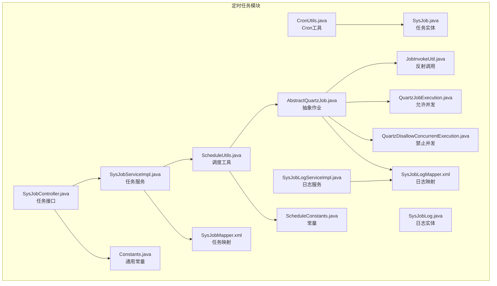
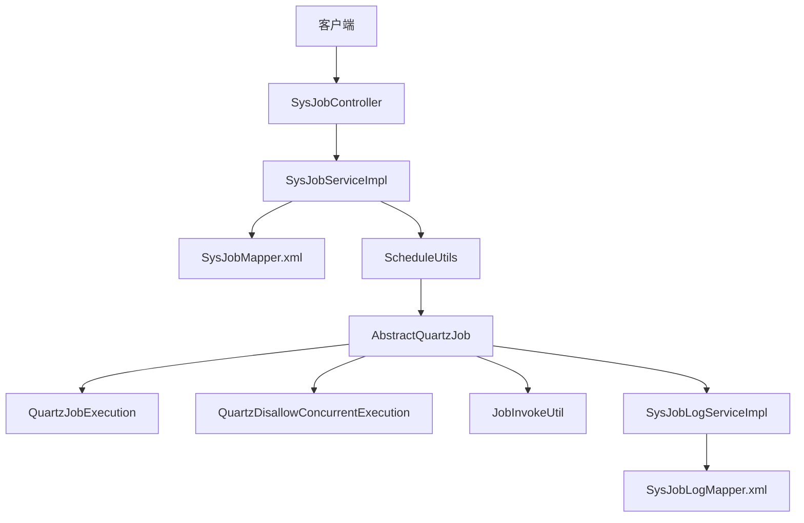
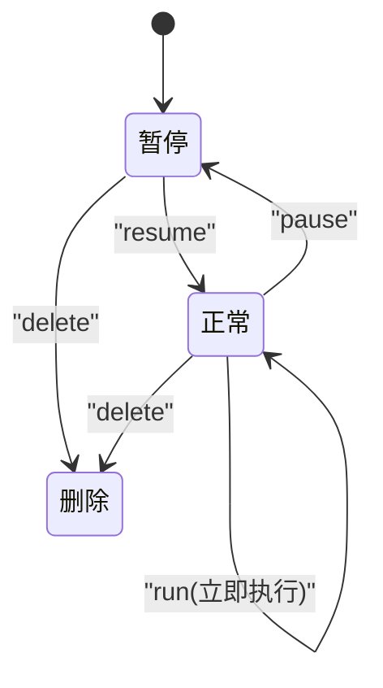
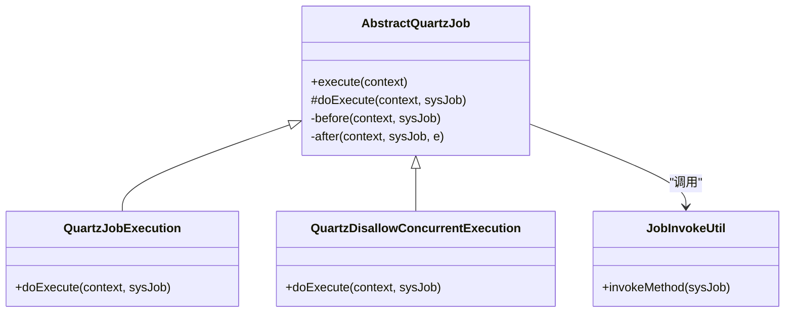
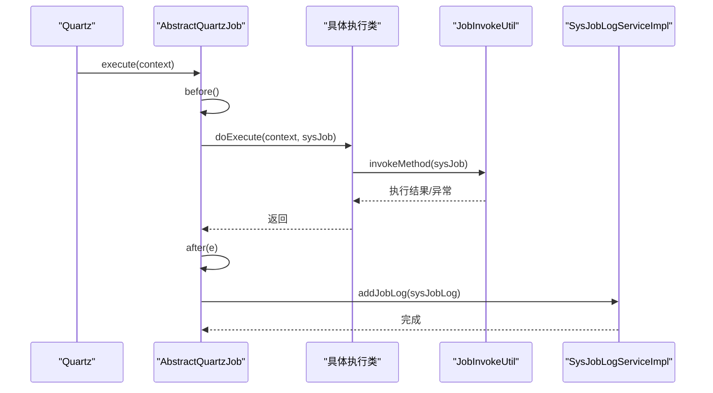
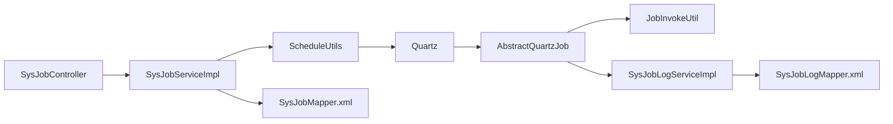

# 任务实体管理

<cite>
**本文引用的文件**
- [SysJob.java](file://blog-quartz/src/main/java/blog/quartz/domain/SysJob.java)
- [SysJobLog.java](file://blog-quartz/src/main/java/blog/quartz/domain/SysJobLog.java)
- [SysJobMapper.xml](file://blog-quartz/src/main/resources/mapper/quartz/SysJobMapper.xml)
- [SysJobLogMapper.xml](file://blog-quartz/src/main/resources/mapper/quartz/SysJobLogMapper.xml)
- [ScheduleUtils.java](file://blog-quartz/src/main/java/blog/quartz/util/ScheduleUtils.java)
- [ScheduleConstants.java](file://blog-common/src/main/java/blog/common/constant/ScheduleConstants.java)
- [CronUtils.java](file://blog-quartz/src/main/java/blog/quartz/util/CronUtils.java)
- [AbstractQuartzJob.java](file://blog-quartz/src/main/java/blog/quartz/util/AbstractQuartzJob.java)
- [QuartzJobExecution.java](file://blog-quartz/src/main/java/blog/quartz/util/QuartzJobExecution.java)
- [QuartzDisallowConcurrentExecution.java](file://blog-quartz/src/main/java/blog/quartz/util/QuartzDisallowConcurrentExecution.java)
- [JobInvokeUtil.java](file://blog-quartz/src/main/java/blog/quartz/util/JobInvokeUtil.java)
- [SysJobController.java](file://blog-quartz/src/main/java/blog/quartz/controller/SysJobController.java)
- [SysJobServiceImpl.java](file://blog-quartz/src/main/java/blog/quartz/service/impl/SysJobServiceImpl.java)
- [SysJobLogServiceImpl.java](file://blog-quartz/src/main/java/blog/quartz/service/impl/SysJobLogServiceImpl.java)
- [Constants.java](file://blog-common/src/main/java/blog/common/constant/Constants.java)
</cite>

## 目录
1. [简介](#简介)
2. [项目结构](#项目结构)
3. [核心组件](#核心组件)
4. [架构总览](#架构总览)
5. [详细组件分析](#详细组件分析)
6. [依赖分析](#依赖分析)
7. [性能考虑](#性能考虑)
8. [故障排查指南](#故障排查指南)
9. [结论](#结论)
10. [附录](#附录)

## 简介
本文件系统性梳理“任务实体管理”的设计与实现，围绕 SysJob 任务实体与 SysJobLog 日志实体展开，覆盖字段定义、验证规则、数据库映射、业务逻辑（状态转换、执行策略、并发控制）、以及最佳实践与注意事项。文档同时给出关键流程的时序图与类图，帮助读者快速理解从控制器到调度器再到日志落库的完整链路。

## 项目结构
任务实体管理位于 quartz 子模块中，采用“领域模型 + MyBatis 映射 + 控制器 + 服务层 + 调度工具 + 日志记录”的分层组织方式。SysJob 与 SysJobLog 分别对应定时任务表与任务执行日志表，通过 Mapper XML 实现 ORM 映射；调度器使用 Quartz，结合 ScheduleUtils、AbstractQuartzJob 及具体执行类完成任务的创建、暂停、恢复、立即执行与日志记录。

图表来源
- [SysJob.java:1-172](file://blog-quartz/src/main/java/blog/quartz/domain/SysJob.java#L1-L172)
- [SysJobLog.java:1-156](file://blog-quartz/src/main/java/blog/quartz/domain/SysJobLog.java#L1-L156)
- [SysJobMapper.xml:1-111](file://blog-quartz/src/main/resources/mapper/quartz/SysJobMapper.xml#L1-L111)
- [SysJobLogMapper.xml:1-94](file://blog-quartz/src/main/resources/mapper/quartz/SysJobLogMapper.xml#L1-L94)
- [ScheduleUtils.java:1-142](file://blog-quartz/src/main/java/blog/quartz/util/ScheduleUtils.java#L1-L142)
- [AbstractQuartzJob.java:1-107](file://blog-quartz/src/main/java/blog/quartz/util/AbstractQuartzJob.java#L1-L107)
- [QuartzJobExecution.java:1-20](file://blog-quartz/src/main/java/blog/quartz/util/QuartzJobExecution.java#L1-L20)
- [QuartzDisallowConcurrentExecution.java:1-22](file://blog-quartz/src/main/java/blog/quartz/util/QuartzDisallowConcurrentExecution.java#L1-L22)
- [JobInvokeUtil.java:1-183](file://blog-quartz/src/main/java/blog/quartz/util/JobInvokeUtil.java#L1-L183)
- [SysJobController.java:1-186](file://blog-quartz/src/main/java/blog/quartz/controller/SysJobController.java#L1-L186)
- [SysJobServiceImpl.java:1-262](file://blog-quartz/src/main/java/blog/quartz/service/impl/SysJobServiceImpl.java#L1-L262)
- [SysJobLogServiceImpl.java:1-88](file://blog-quartz/src/main/java/blog/quartz/service/impl/SysJobLogServiceImpl.java#L1-L88)
- [CronUtils.java:1-64](file://blog-quartz/src/main/java/blog/quartz/util/CronUtils.java#L1-L64)
- [ScheduleConstants.java:1-57](file://blog-common/src/main/java/blog/common/constant/ScheduleConstants.java#L1-L57)
- [Constants.java:1-235](file://blog-common/src/main/java/blog/common/constant/Constants.java#L1-L235)

章节来源
- [SysJob.java:1-172](file://blog-quartz/src/main/java/blog/quartz/domain/SysJob.java#L1-L172)
- [SysJobLog.java:1-156](file://blog-quartz/src/main/java/blog/quartz/domain/SysJobLog.java#L1-L156)
- [SysJobMapper.xml:1-111](file://blog-quartz/src/main/resources/mapper/quartz/SysJobMapper.xml#L1-L111)
- [SysJobLogMapper.xml:1-94](file://blog-quartz/src/main/resources/mapper/quartz/SysJobLogMapper.xml#L1-L94)

## 核心组件
- SysJob 任务实体：承载任务元数据与调度配置，包含任务ID、名称、组名、调用目标、Cron 表达式、执行策略、并发控制、状态等。
- SysJobLog 日志实体：记录每次任务执行的开始/结束时间、执行结果、异常信息与日志消息。
- 调度工具与常量：ScheduleUtils 负责创建/更新/暂停/恢复任务；ScheduleConstants 提供调度相关枚举与常量；CronUtils 提供 Cron 表达式有效性与下一次执行时间计算。
- 作业执行链路：AbstractQuartzJob 统一封装执行前后置处理与日志写入；QuartzJobExecution 与 QuartzDisallowConcurrentExecution 分别对应允许/禁止并发的执行策略；JobInvokeUtil 解析调用目标并反射调用。
- 控制器与服务：SysJobController 对外暴露任务 CRUD、状态变更、立即执行等接口；SysJobServiceImpl 在服务层协调数据库与调度器；SysJobLogServiceImpl 提供日志查询与清理。

章节来源
- [SysJob.java:21-172](file://blog-quartz/src/main/java/blog/quartz/domain/SysJob.java#L21-L172)
- [SysJobLog.java:14-156](file://blog-quartz/src/main/java/blog/quartz/domain/SysJobLog.java#L14-L156)
- [ScheduleUtils.java:27-142](file://blog-quartz/src/main/java/blog/quartz/util/ScheduleUtils.java#L27-L142)
- [ScheduleConstants.java:8-57](file://blog-common/src/main/java/blog/common/constant/ScheduleConstants.java#L8-L57)
- [CronUtils.java:13-64](file://blog-quartz/src/main/java/blog/quartz/util/CronUtils.java#L13-L64)
- [AbstractQuartzJob.java:23-107](file://blog-quartz/src/main/java/blog/quartz/util/AbstractQuartzJob.java#L23-L107)
- [QuartzJobExecution.java:12-20](file://blog-quartz/src/main/java/blog/quartz/util/QuartzJobExecution.java#L12-L20)
- [QuartzDisallowConcurrentExecution.java:13-22](file://blog-quartz/src/main/java/blog/quartz/util/QuartzDisallowConcurrentExecution.java#L13-L22)
- [JobInvokeUtil.java:16-183](file://blog-quartz/src/main/java/blog/quartz/util/JobInvokeUtil.java#L16-L183)
- [SysJobController.java:35-186](file://blog-quartz/src/main/java/blog/quartz/controller/SysJobController.java#L35-L186)
- [SysJobServiceImpl.java:25-262](file://blog-quartz/src/main/java/blog/quartz/service/impl/SysJobServiceImpl.java#L25-L262)
- [SysJobLogServiceImpl.java:15-88](file://blog-quartz/src/main/java/blog/quartz/service/impl/SysJobLogServiceImpl.java#L15-L88)

## 架构总览
下图展示从控制器到调度器再到日志记录的整体架构与交互关系。

图表来源
- [SysJobController.java:35-186](file://blog-quartz/src/main/java/blog/quartz/controller/SysJobController.java#L35-L186)
- [SysJobServiceImpl.java:25-262](file://blog-quartz/src/main/java/blog/quartz/service/impl/SysJobServiceImpl.java#L25-L262)
- [SysJobMapper.xml:1-111](file://blog-quartz/src/main/resources/mapper/quartz/SysJobMapper.xml#L1-L111)
- [ScheduleUtils.java:27-142](file://blog-quartz/src/main/java/blog/quartz/util/ScheduleUtils.java#L27-L142)
- [AbstractQuartzJob.java:23-107](file://blog-quartz/src/main/java/blog/quartz/util/AbstractQuartzJob.java#L23-L107)
- [QuartzJobExecution.java:12-20](file://blog-quartz/src/main/java/blog/quartz/util/QuartzJobExecution.java#L12-L20)
- [QuartzDisallowConcurrentExecution.java:13-22](file://blog-quartz/src/main/java/blog/quartz/util/QuartzDisallowConcurrentExecution.java#L13-L22)
- [JobInvokeUtil.java:16-183](file://blog-quartz/src/main/java/blog/quartz/util/JobInvokeUtil.java#L16-L183)
- [SysJobLogServiceImpl.java:15-88](file://blog-quartz/src/main/java/blog/quartz/service/impl/SysJobLogServiceImpl.java#L15-L88)
- [SysJobLogMapper.xml:1-94](file://blog-quartz/src/main/resources/mapper/quartz/SysJobLogMapper.xml#L1-L94)

## 详细组件分析

### SysJob 任务实体设计与字段定义
- 核心字段
  - 任务ID：唯一标识，用于调度器的 JobKey 与 Mapper 主键。
  - 任务名称：必填，长度限制，用于展示与检索。
  - 任务组名：用于分组管理与调度器内的命名空间。
  - 调用目标：必填，长度限制，格式为“包名.类名.方法(参数)”或类全限定名+方法，支持参数类型自动识别。
  - Cron 表达式：必填，长度限制，用于表达下次执行时间。
  - 执行策略（Misfire 策略）：默认/忽略/触发一次/不触发，影响错过触发时的行为。
  - 并发控制：0 允许并发，1 禁止并发，决定使用哪种 Quartz 作业类。
  - 状态：0 正常，1 暂停，用于控制调度器启停。
  - 备注与审计字段：继承 BaseEntity，包含创建人、创建时间、更新人、更新时间等。
- 关键方法
  - 计算下次有效执行时间：基于 Cron 表达式推导。
  - toString：便于日志输出与调试。
- 验证规则
  - 使用注解对必填、长度进行约束。
  - 控制器在新增/修改时再次校验 Cron 表达式合法性与调用目标安全性（白名单、RMI/LDAP/HTTP 等限制）。

章节来源
- [SysJob.java:21-172](file://blog-quartz/src/main/java/blog/quartz/domain/SysJob.java#L21-L172)
- [SysJobController.java:83-147](file://blog-quartz/src/main/java/blog/quartz/controller/SysJobController.java#L83-L147)
- [CronUtils.java:21-62](file://blog-quartz/src/main/java/blog/quartz/util/CronUtils.java#L21-L62)
- [Constants.java:144-173](file://blog-common/src/main/java/blog/common/constant/Constants.java#L144-L173)

### SysJobLog 日志实体作用与数据结构
- 用途：记录每次任务执行的生命周期事件，包括开始/结束时间、执行结果（成功/失败）、异常信息、日志消息等。
- 数据结构要点
  - 任务维度：任务名、组名、调用目标。
  - 时间维度：开始时间、结束时间。
  - 结果维度：执行状态（成功/失败）、异常信息、执行耗时消息。
  - 审计维度：继承 BaseEntity 的创建时间等。
- 日志生成时机
  - 作业执行前设置开始时间。
  - 作业执行后根据异常与否设置状态与异常信息，并持久化到 sys_job_log。

章节来源
- [SysJobLog.java:14-156](file://blog-quartz/src/main/java/blog/quartz/domain/SysJobLog.java#L14-L156)
- [AbstractQuartzJob.java:59-96](file://blog-quartz/src/main/java/blog/quartz/util/AbstractQuartzJob.java#L59-L96)

### 任务实体验证规则与约束条件
- 字段级约束
  - 任务名称：非空且长度不超过 64。
  - 调用目标：非空且长度不超过 500。
  - Cron 表达式：非空且长度不超过 255。
- 表达式与安全校验
  - Cron 表达式有效性检查。
  - 调用目标禁止包含 RMI/LDAP/HTTPS 等高危协议或关键字。
  - 调用目标必须在白名单包范围内，避免任意代码执行风险。
- 并发与策略
  - concurrent=0 允许并发，使用 QuartzJobExecution。
  - concurrent=1 禁止并发，使用 QuartzDisallowConcurrentExecution。

章节来源
- [SysJob.java:67-111](file://blog-quartz/src/main/java/blog/quartz/domain/SysJob.java#L67-L111)
- [SysJobController.java:83-147](file://blog-quartz/src/main/java/blog/quartz/controller/SysJobController.java#L83-L147)
- [ScheduleUtils.java:35-39](file://blog-quartz/src/main/java/blog/quartz/util/ScheduleUtils.java#L35-L39)
- [Constants.java:144-173](file://blog-common/src/main/java/blog/common/constant/Constants.java#L144-L173)

### 任务实体与数据库表映射关系与 ORM 配置
- SysJob 映射
  - 表名：sys_job
  - 字段映射：job_id、job_name、job_group、invoke_target、cron_expression、misfire_policy、concurrent、status、create_by、create_time、update_by、update_time、remark
  - 查询条件：支持按任务名、组名、状态、调用目标模糊匹配。
- SysJobLog 映射
  - 表名：sys_job_log
  - 字段映射：job_log_id、job_name、job_group、invoke_target、job_message、status、exception_info、create_time
  - 查询条件：支持按任务名、组名、状态、调用目标模糊匹配及日期区间过滤。
- 插入/更新策略
  - insert/update 均采用动态 SQL，仅当字段非空时写入。
  - 更新时统一设置 update_time 与 update_by。

章节来源
- [SysJobMapper.xml:7-111](file://blog-quartz/src/main/resources/mapper/quartz/SysJobMapper.xml#L7-L111)
- [SysJobLogMapper.xml:7-94](file://blog-quartz/src/main/resources/mapper/quartz/SysJobLogMapper.xml#L7-L94)

### 任务实体的业务逻辑与状态转换
- 状态枚举与含义
  - NORMAL（0）：正常运行。
  - PAUSE（1）：暂停。
- 状态转换
  - 新增任务默认状态为 PAUSE，插入数据库后尝试创建调度任务。
  - changeStatus：根据目标状态切换至 resume 或 pause。
  - run：立即触发一次执行。
  - delete：删除任务并移除对应调度器中的 Trigger。
- 调度器集成
  - createScheduleJob：根据 Cron 表达式与 Misfire 策略创建 Trigger，并根据并发策略选择作业类。
  - handleCronScheduleMisfirePolicy：将 SysJob 的策略映射为 Quartz 的 Misfire 处理指令。
  - 白名单校验：确保调用目标在允许范围内，避免高危调用。

图表来源
- [SysJobServiceImpl.java:77-110](file://blog-quartz/src/main/java/blog/quartz/service/impl/SysJobServiceImpl.java#L77-L110)
- [SysJobServiceImpl.java:153-168](file://blog-quartz/src/main/java/blog/quartz/service/impl/SysJobServiceImpl.java#L153-L168)
- [SysJobServiceImpl.java:175-193](file://blog-quartz/src/main/java/blog/quartz/service/impl/SysJobServiceImpl.java#L175-L193)
- [SysJobServiceImpl.java:117-129](file://blog-quartz/src/main/java/blog/quartz/service/impl/SysJobServiceImpl.java#L117-L129)
- [ScheduleUtils.java:103-120](file://blog-quartz/src/main/java/blog/quartz/util/ScheduleUtils.java#L103-L120)

章节来源
- [ScheduleConstants.java:36-55](file://blog-common/src/main/java/blog/common/constant/ScheduleConstants.java#L36-L55)
- [SysJobServiceImpl.java:77-193](file://blog-quartz/src/main/java/blog/quartz/service/impl/SysJobServiceImpl.java#L77-L193)
- [ScheduleUtils.java:60-98](file://blog-quartz/src/main/java/blog/quartz/util/ScheduleUtils.java#L60-L98)

### 执行策略与并发控制
- 允许并发：QuartzJobExecution 直接调用目标方法，不加锁。
- 禁止并发：QuartzDisallowConcurrentExecution 使用 @DisallowConcurrentExecution 注解，确保同一任务实例不会并行执行。
- 选择依据：SysJob.concurrent=0 选前者，=1 选后者。

图表来源
- [AbstractQuartzJob.java:23-107](file://blog-quartz/src/main/java/blog/quartz/util/AbstractQuartzJob.java#L23-L107)
- [QuartzJobExecution.java:12-20](file://blog-quartz/src/main/java/blog/quartz/util/QuartzJobExecution.java#L12-L20)
- [QuartzDisallowConcurrentExecution.java:13-22](file://blog-quartz/src/main/java/blog/quartz/util/QuartzDisallowConcurrentExecution.java#L13-L22)
- [JobInvokeUtil.java:23-63](file://blog-quartz/src/main/java/blog/quartz/util/JobInvokeUtil.java#L23-L63)

章节来源
- [ScheduleUtils.java:35-39](file://blog-quartz/src/main/java/blog/quartz/util/ScheduleUtils.java#L35-L39)
- [QuartzJobExecution.java:12-20](file://blog-quartz/src/main/java/blog/quartz/util/QuartzJobExecution.java#L12-L20)
- [QuartzDisallowConcurrentExecution.java:13-22](file://blog-quartz/src/main/java/blog/quartz/util/QuartzDisallowConcurrentExecution.java#L13-L22)

### 错误处理与日志记录
- 执行前：记录开始时间。
- 执行后：计算耗时，设置执行消息；若发生异常则记录异常信息与失败状态，否则记录成功状态。
- 日志持久化：通过 ISysJobLogService 将 SysJobLog 写入 sys_job_log。

图表来源
- [AbstractQuartzJob.java:32-96](file://blog-quartz/src/main/java/blog/quartz/util/AbstractQuartzJob.java#L32-L96)
- [JobInvokeUtil.java:23-63](file://blog-quartz/src/main/java/blog/quartz/util/JobInvokeUtil.java#L23-L63)
- [SysJobLogServiceImpl.java:50-54](file://blog-quartz/src/main/java/blog/quartz/service/impl/SysJobLogServiceImpl.java#L50-L54)

章节来源
- [AbstractQuartzJob.java:59-96](file://blog-quartz/src/main/java/blog/quartz/util/AbstractQuartzJob.java#L59-L96)
- [SysJobLogServiceImpl.java:50-54](file://blog-quartz/src/main/java/blog/quartz/service/impl/SysJobLogServiceImpl.java#L50-L54)

### 接口与控制器行为
- 列表/导出/详情：提供分页列表、Excel 导出、按 ID 查询。
- 新增/修改：进行 Cron 合法性与调用目标安全校验，再写入数据库并创建/更新调度任务。
- 状态变更：支持暂停/恢复。
- 立即执行：触发一次任务执行。
- 删除：删除任务并移除调度器中的 Trigger。

章节来源
- [SysJobController.java:45-186](file://blog-quartz/src/main/java/blog/quartz/controller/SysJobController.java#L45-L186)

## 依赖分析
- 组件耦合
  - SysJobServiceImpl 依赖 Scheduler、SysJobMapper、ScheduleUtils、CronUtils。
  - AbstractQuartzJob 依赖 JobInvokeUtil、SysJobLogServiceImpl。
  - SysJobController 依赖 ISysJobService、CronUtils、ScheduleUtils。
- 外部依赖
  - Quartz：提供 Job、Trigger、Scheduler 等调度能力。
  - MyBatis：负责 XML 映射与 SQL 执行。
  - Spring：依赖注入与事务管理。

图表来源
- [SysJobController.java:35-186](file://blog-quartz/src/main/java/blog/quartz/controller/SysJobController.java#L35-L186)
- [SysJobServiceImpl.java:25-262](file://blog-quartz/src/main/java/blog/quartz/service/impl/SysJobServiceImpl.java#L25-L262)
- [ScheduleUtils.java:27-142](file://blog-quartz/src/main/java/blog/quartz/util/ScheduleUtils.java#L27-L142)
- [AbstractQuartzJob.java:23-107](file://blog-quartz/src/main/java/blog/quartz/util/AbstractQuartzJob.java#L23-L107)
- [JobInvokeUtil.java:16-183](file://blog-quartz/src/main/java/blog/quartz/util/JobInvokeUtil.java#L16-L183)
- [SysJobLogServiceImpl.java:15-88](file://blog-quartz/src/main/java/blog/quartz/service/impl/SysJobLogServiceImpl.java#L15-L88)

章节来源
- [SysJobServiceImpl.java:25-262](file://blog-quartz/src/main/java/blog/quartz/service/impl/SysJobServiceImpl.java#L25-L262)
- [ScheduleUtils.java:27-142](file://blog-quartz/src/main/java/blog/quartz/util/ScheduleUtils.java#L27-L142)

## 性能考虑
- Cron 表达式复杂度：尽量使用简单明确的表达式，避免过于复杂的组合导致下一次执行时间计算开销增大。
- 并发策略：频繁短任务建议允许并发（concurrent=0），长任务或资源敏感任务建议禁止并发（concurrent=1）。
- 日志写入：日志记录为轻量级写入，但大量任务并发执行时仍需关注数据库写入压力，可考虑异步日志或批量落库策略。
- 调度器重建：应用启动时会清空并重建所有任务，确保数据库与调度器一致，但大规模任务重启可能带来短暂延迟。

## 故障排查指南
- Cron 表达式无效
  - 现象：新增/修改任务失败，提示表达式不正确。
  - 排查：使用 CronUtils 校验表达式有效性；检查表达式语法与边界值。
- 调用目标不合法
  - 现象：新增/修改任务失败，提示目标字符串不在白名单或包含高危关键字。
  - 排查：确认调用目标格式为“包名.类名.方法(参数)”；检查是否包含 RMI/LDAP/HTTP 等关键字；确认包名在白名单范围内。
- 任务无法执行或立即执行失败
  - 现象：run 接口返回不存在或已过期。
  - 排查：确认任务状态为正常；检查 Cron 表达式是否已过期；确认调度器中存在对应 JobKey。
- 日志缺失
  - 现象：sys_job_log 中无记录。
  - 排查：确认 AbstractQuartzJob.after 是否执行；检查 ISysJobLogService 的实现与 Mapper 是否正确；确认数据库连接与事务配置。

章节来源
- [SysJobController.java:83-147](file://blog-quartz/src/main/java/blog/quartz/controller/SysJobController.java#L83-L147)
- [ScheduleUtils.java:86-98](file://blog-quartz/src/main/java/blog/quartz/util/ScheduleUtils.java#L86-L98)
- [AbstractQuartzJob.java:70-96](file://blog-quartz/src/main/java/blog/quartz/util/AbstractQuartzJob.java#L70-L96)
- [SysJobLogMapper.xml:72-92](file://blog-quartz/src/main/resources/mapper/quartz/SysJobLogMapper.xml#L72-L92)

## 结论
本方案通过 SysJob 与 SysJobLog 实体清晰地定义了任务的元数据与执行日志，结合 ScheduleUtils 与 Quartz 实现了灵活可靠的调度能力。通过严格的验证规则与白名单机制保障了安全性，通过并发控制与状态管理实现了稳定的运行与可观测性。建议在生产环境中遵循最佳实践，合理配置 Cron 表达式与并发策略，并定期清理日志以维持系统性能。

## 附录
- 最佳实践
  - Cron 表达式应简洁明确，避免过于复杂的组合。
  - 调用目标必须在白名单内，避免高危协议与关键字。
  - 长耗时任务建议禁止并发，短任务可允许并发提升吞吐。
  - 定期清理历史日志，避免日志表膨胀。
  - 应用重启后调度器会重建任务，确保数据库与调度器一致。
- 注意事项
  - 不要手动修改数据库中的任务 ID 与组名，可能导致调度器与数据库不一致。
  - 修改 Cron 表达式后需重新创建调度任务，确保生效。
  - 并发策略与任务性质匹配，避免资源竞争与数据不一致。