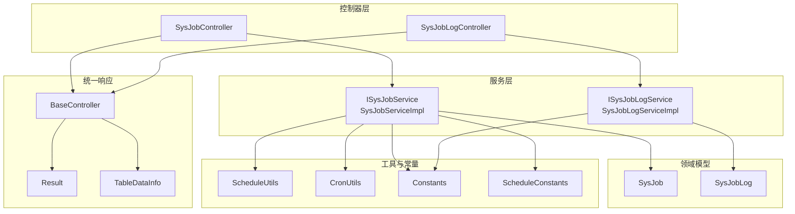
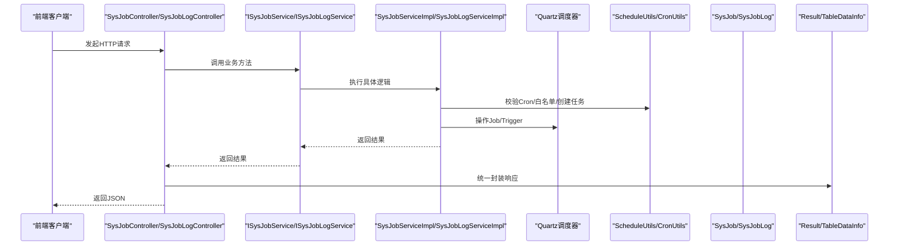
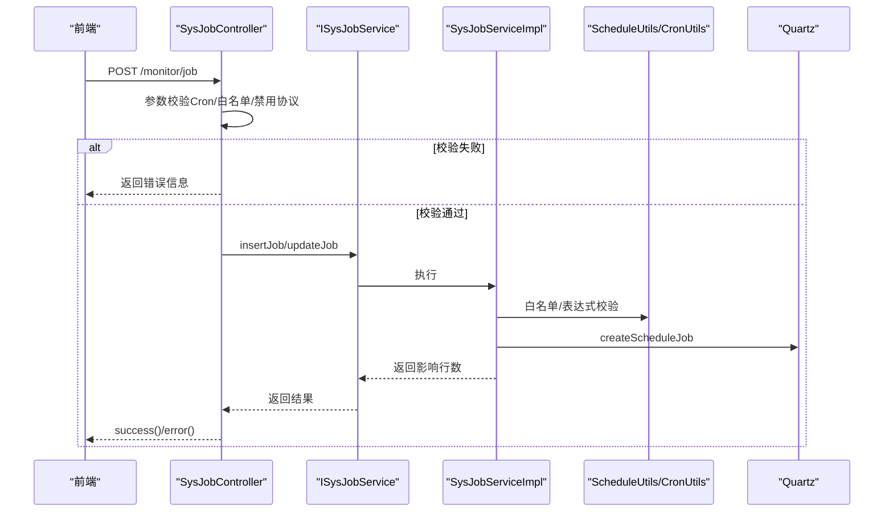
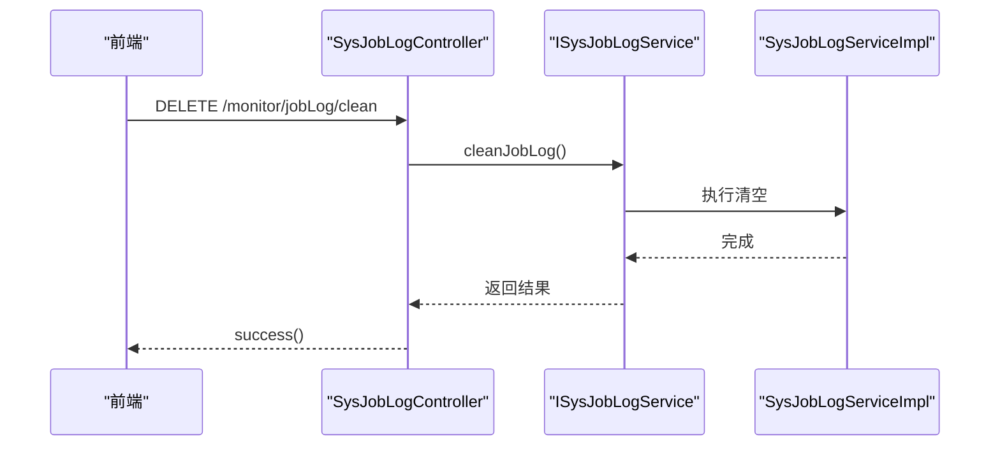
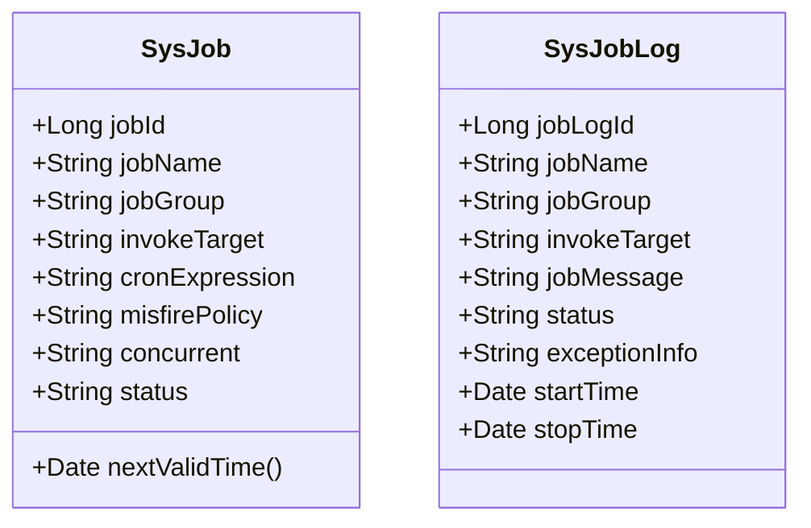
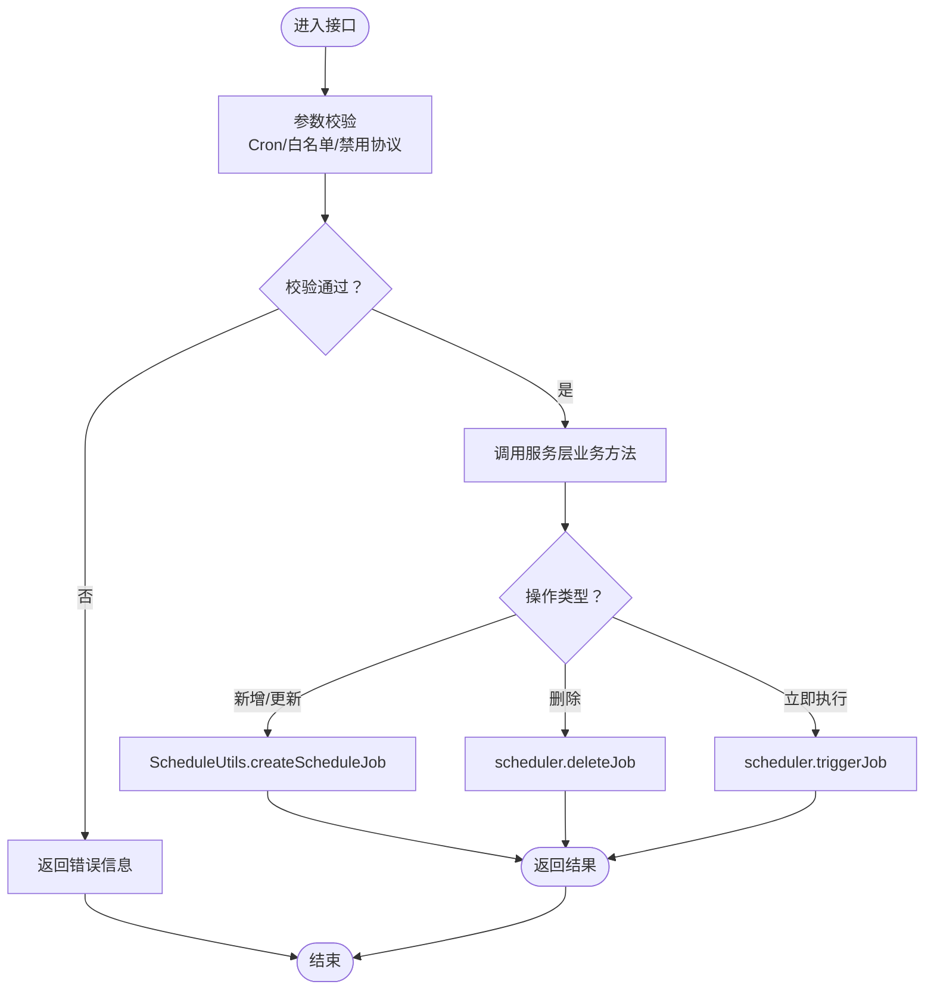
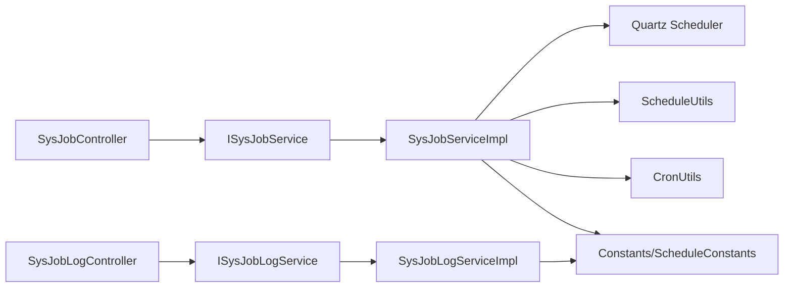

# 任务控制器接口

<cite>
**本文引用的文件**
- [SysJobController.java](file://blog-quartz/src/main/java/blog/quartz/controller/SysJobController.java)
- [SysJobLogController.java](file://blog-quartz/src/main/java/blog/quartz/controller/SysJobLogController.java)
- [SysJob.java](file://blog-quartz/src/main/java/blog/quartz/domain/SysJob.java)
- [SysJobLog.java](file://blog-quartz/src/main/java/blog/quartz/domain/SysJobLog.java)
- [ISysJobService.java](file://blog-quartz/src/main/java/blog/quartz/service/ISysJobService.java)
- [ISysJobLogService.java](file://blog-quartz/src/main/java/blog/quartz/service/ISysJobLogService.java)
- [SysJobServiceImpl.java](file://blog-quartz/src/main/java/blog/quartz/service/impl/SysJobServiceImpl.java)
- [SysJobLogServiceImpl.java](file://blog-quartz/src/main/java/blog/quartz/service/impl/SysJobLogServiceImpl.java)
- [ScheduleUtils.java](file://blog-quartz/src/main/java/blog/quartz/util/ScheduleUtils.java)
- [CronUtils.java](file://blog-quartz/src/main/java/blog/quartz/util/CronUtils.java)
- [BaseController.java](file://blog-common/src/main/java/blog/common/base/controller/BaseController.java)
- [Result.java](file://blog-common/src/main/java/blog/common/base/resp/Result.java)
- [TableDataInfo.java](file://blog-common/src/main/java/blog/common/base/resp/TableDataInfo.java)
- [Constants.java](file://blog-common/src/main/java/blog/common/constant/Constants.java)
- [ScheduleConstants.java](file://blog-common/src/main/java/blog/common/constant/ScheduleConstants.java)
</cite>

## 目录
1. [简介](#简介)
2. [项目结构](#项目结构)
3. [核心组件](#核心组件)
4. [架构总览](#架构总览)
5. [详细组件分析](#详细组件分析)
6. [依赖关系分析](#依赖关系分析)
7. [性能与扩展性](#性能与扩展性)
8. [故障排查指南](#故障排查指南)
9. [结论](#结论)
10. [附录：接口清单与规范](#附录接口清单与规范)

## 简介
本文件面向前端与后端开发者，系统化梳理任务调度模块的控制器接口与实现，重点覆盖以下内容：
- SysJobController 的任务管理接口：列表查询、详情获取、创建/更新、删除、状态变更、立即执行、导出等。
- SysJobLogController 的日志管理接口：日志列表、详情、导出、批量删除、清空。
- 接口参数校验、权限控制、异常处理与统一响应格式。
- 请求/响应规范、状态码约定、错误处理策略。
- 使用示例与最佳实践。

## 项目结构
任务调度模块位于 blog-quartz 子模块，采用典型的分层架构：
- 控制器层：SysJobController、SysJobLogController
- 领域模型：SysJob、SysJobLog
- 服务接口与实现：ISysJobService/ISysJobServiceImpl、ISysJobLogService/ISysJobLogServiceImpl
- 工具类：ScheduleUtils（Quartz集成）、CronUtils（Cron表达式校验）
- 统一响应：BaseController、Result、TableDataInfo
- 安全与常量：Constants、ScheduleConstants

图表来源
- [SysJobController.java:35-185](file://blog-quartz/src/main/java/blog/quartz/controller/SysJobController.java#L35-L185)
- [SysJobLogController.java:27-92](file://blog-quartz/src/main/java/blog/quartz/controller/SysJobLogController.java#L27-L92)
- [ISysJobService.java:13-102](file://blog-quartz/src/main/java/blog/quartz/service/ISysJobService.java#L13-L102)
- [ISysJobLogService.java:11-56](file://blog-quartz/src/main/java/blog/quartz/service/ISysJobLogService.java#L11-L56)
- [SysJobServiceImpl.java:25-261](file://blog-quartz/src/main/java/blog/quartz/service/impl/SysJobServiceImpl.java#L25-L261)
- [SysJobLogServiceImpl.java:15-87](file://blog-quartz/src/main/java/blog/quartz/service/impl/SysJobLogServiceImpl.java#L15-L87)
- [ScheduleUtils.java:27-141](file://blog-quartz/src/main/java/blog/quartz/util/ScheduleUtils.java#L27-L141)
- [CronUtils.java:13-63](file://blog-quartz/src/main/java/blog/quartz/util/CronUtils.java#L13-L63)
- [Constants.java:12-234](file://blog-common/src/main/java/blog/common/constant/Constants.java#L12-L234)
- [ScheduleConstants.java:8-56](file://blog-common/src/main/java/blog/common/constant/ScheduleConstants.java#L8-L56)
- [BaseController.java:30-181](file://blog-common/src/main/java/blog/common/base/controller/BaseController.java#L30-L181)
- [Result.java:14-204](file://blog-common/src/main/java/blog/common/base/resp/Result.java#L14-L204)
- [TableDataInfo.java:14-97](file://blog-common/src/main/java/blog/common/base/resp/TableDataInfo.java#L14-L97)

章节来源
- [SysJobController.java:35-185](file://blog-quartz/src/main/java/blog/quartz/controller/SysJobController.java#L35-L185)
- [SysJobLogController.java:27-92](file://blog-quartz/src/main/java/blog/quartz/controller/SysJobLogController.java#L27-L92)

## 核心组件
- SysJobController：提供任务管理的REST接口，基于权限注解进行访问控制，使用统一响应封装。
- SysJobLogController：提供任务调度日志的查询、导出、删除、清空等接口。
- ISysJobService/ISysJobLogService：定义任务与日志的服务契约，包含业务方法与事务语义。
- SysJobServiceImpl/SysJobLogServiceImpl：实现具体调度与日志操作，集成Quartz与Mapper。
- ScheduleUtils/CronUtils：负责Quartz任务创建、Misfire策略、Cron表达式校验与白名单校验。
- Constants/ScheduleConstants：集中定义任务调度相关常量与白名单规则。
- BaseController/Result/TableDataInfo：统一响应封装，提供分页、成功/失败消息与状态码。

章节来源
- [ISysJobService.java:13-102](file://blog-quartz/src/main/java/blog/quartz/service/ISysJobService.java#L13-L102)
- [ISysJobLogService.java:11-56](file://blog-quartz/src/main/java/blog/quartz/service/ISysJobLogService.java#L11-L56)
- [SysJobServiceImpl.java:25-261](file://blog-quartz/src/main/java/blog/quartz/service/impl/SysJobServiceImpl.java#L25-L261)
- [SysJobLogServiceImpl.java:15-87](file://blog-quartz/src/main/java/blog/quartz/service/impl/SysJobLogServiceImpl.java#L15-L87)
- [ScheduleUtils.java:27-141](file://blog-quartz/src/main/java/blog/quartz/util/ScheduleUtils.java#L27-L141)
- [CronUtils.java:13-63](file://blog-quartz/src/main/java/blog/quartz/util/CronUtils.java#L13-L63)
- [Constants.java:12-234](file://blog-common/src/main/java/blog/common/constant/Constants.java#L12-L234)
- [ScheduleConstants.java:8-56](file://blog-common/src/main/java/blog/common/constant/ScheduleConstants.java#L8-L56)
- [BaseController.java:30-181](file://blog-common/src/main/java/blog/common/base/controller/BaseController.java#L30-L181)
- [Result.java:14-204](file://blog-common/src/main/java/blog/common/base/resp/Result.java#L14-L204)
- [TableDataInfo.java:14-97](file://blog-common/src/main/java/blog/common/base/resp/TableDataInfo.java#L14-L97)

## 架构总览
下图展示控制器到服务、工具与常量的整体交互关系：

图表来源
- [SysJobController.java:35-185](file://blog-quartz/src/main/java/blog/quartz/controller/SysJobController.java#L35-L185)
- [SysJobLogController.java:27-92](file://blog-quartz/src/main/java/blog/quartz/controller/SysJobLogController.java#L27-L92)
- [ISysJobService.java:13-102](file://blog-quartz/src/main/java/blog/quartz/service/ISysJobService.java#L13-L102)
- [ISysJobLogService.java:11-56](file://blog-quartz/src/main/java/blog/quartz/service/ISysJobLogService.java#L11-L56)
- [SysJobServiceImpl.java:25-261](file://blog-quartz/src/main/java/blog/quartz/service/impl/SysJobServiceImpl.java#L25-L261)
- [SysJobLogServiceImpl.java:15-87](file://blog-quartz/src/main/java/blog/quartz/service/impl/SysJobLogServiceImpl.java#L15-L87)
- [ScheduleUtils.java:27-141](file://blog-quartz/src/main/java/blog/quartz/util/ScheduleUtils.java#L27-L141)
- [CronUtils.java:13-63](file://blog-quartz/src/main/java/blog/quartz/util/CronUtils.java#L13-L63)
- [Result.java:14-204](file://blog-common/src/main/java/blog/common/base/resp/Result.java#L14-L204)
- [TableDataInfo.java:14-97](file://blog-common/src/main/java/blog/common/base/resp/TableDataInfo.java#L14-L97)

## 详细组件分析

### SysJobController（任务控制器）
- 基础路径：/monitor/job
- 权限注解：@PreAuthorize 控制各接口访问权限
- 统一响应：继承 BaseController，使用 Result/TableDataInfo
- 关键接口与行为
  - GET /list：分页查询任务列表
  - POST /export：导出任务列表为Excel
  - GET /{jobId}：获取任务详情
  - POST：新增任务（含Cron校验、白名单校验、RMI/LDAP/HTTP限制）
  - PUT：修改任务（同上校验）
  - PUT /changeStatus：切换任务状态（暂停/启用）
  - PUT /run：立即执行一次任务
  - DELETE /{jobIds}：批量删除任务
- 参数校验与安全
  - Cron表达式有效性由 CronUtils 校验
  - 调用目标字符串白名单由 ScheduleUtils.whiteList 校验
  - 禁止 rmi:/ldap(s):/http(s): 等高危协议
  - 违规关键字过滤（如特定包路径）
- 事务与异常
  - 新增/更新/删除/状态变更均在服务层以事务包裹
  - 异常通过统一响应返回，错误信息明确提示

图表来源
- [SysJobController.java:77-147](file://blog-quartz/src/main/java/blog/quartz/controller/SysJobController.java#L77-L147)
- [SysJobServiceImpl.java:200-229](file://blog-quartz/src/main/java/blog/quartz/service/impl/SysJobServiceImpl.java#L200-L229)
- [ScheduleUtils.java:128-140](file://blog-quartz/src/main/java/blog/quartz/util/ScheduleUtils.java#L128-L140)
- [CronUtils.java:21-24](file://blog-quartz/src/main/java/blog/quartz/util/CronUtils.java#L21-L24)

章节来源
- [SysJobController.java:35-185](file://blog-quartz/src/main/java/blog/quartz/controller/SysJobController.java#L35-L185)
- [SysJobServiceImpl.java:25-261](file://blog-quartz/src/main/java/blog/quartz/service/impl/SysJobServiceImpl.java#L25-L261)
- [ScheduleUtils.java:27-141](file://blog-quartz/src/main/java/blog/quartz/util/ScheduleUtils.java#L27-L141)
- [CronUtils.java:13-63](file://blog-quartz/src/main/java/blog/quartz/util/CronUtils.java#L13-L63)
- [Constants.java:164-172](file://blog-common/src/main/java/blog/common/constant/Constants.java#L164-L172)

### SysJobLogController（日志控制器）
- 基础路径：/monitor/jobLog
- 权限注解：@PreAuthorize 控制日志查询、导出、删除、清空
- 关键接口与行为
  - GET /list：分页查询调度日志
  - POST /export：导出日志为Excel
  - GET /{jobLogId}：获取日志详情
  - DELETE /{jobLogIds}：批量删除日志
  - DELETE /clean：清空所有日志
- 统一响应：使用 BaseController 的 success/error/toAjax

图表来源
- [SysJobLogController.java:27-92](file://blog-quartz/src/main/java/blog/quartz/controller/SysJobLogController.java#L27-L92)
- [SysJobLogServiceImpl.java:82-86](file://blog-quartz/src/main/java/blog/quartz/service/impl/SysJobLogServiceImpl.java#L82-L86)

章节来源
- [SysJobLogController.java:27-92](file://blog-quartz/src/main/java/blog/quartz/controller/SysJobLogController.java#L27-L92)
- [SysJobLogServiceImpl.java:15-87](file://blog-quartz/src/main/java/blog/quartz/service/impl/SysJobLogServiceImpl.java#L15-L87)

### 数据模型与字段约束
- SysJob（任务）
  - 关键字段：jobName、invokeTarget、cronExpression、misfirePolicy、concurrent、status
  - 校验注解：NotBlank/Size 等
  - 计算属性：nextValidTime 基于 cronExpression 计算
- SysJobLog（日志）
  - 关键字段：jobName、jobGroup、invokeTarget、jobMessage、status、exceptionInfo、startTime、stopTime

图表来源
- [SysJob.java:21-171](file://blog-quartz/src/main/java/blog/quartz/domain/SysJob.java#L21-L171)
- [SysJobLog.java:14-155](file://blog-quartz/src/main/java/blog/quartz/domain/SysJobLog.java#L14-L155)

章节来源
- [SysJob.java:21-171](file://blog-quartz/src/main/java/blog/quartz/domain/SysJob.java#L21-L171)
- [SysJobLog.java:14-155](file://blog-quartz/src/main/java/blog/quartz/domain/SysJobLog.java#L14-L155)

### 处理流程与算法要点
- Cron表达式校验：CronUtils.isValid
- 任务白名单校验：ScheduleUtils.whiteList（基于包名与Bean所在包名）
- 任务创建与更新：ScheduleUtils.createScheduleJob（含Misfire策略）
- 立即执行：SysJobServiceImpl.run（triggerJob）

图表来源
- [SysJobController.java:83-146](file://blog-quartz/src/main/java/blog/quartz/controller/SysJobController.java#L83-L146)
- [SysJobServiceImpl.java:60-193](file://blog-quartz/src/main/java/blog/quartz/service/impl/SysJobServiceImpl.java#L60-L193)
- [ScheduleUtils.java:60-98](file://blog-quartz/src/main/java/blog/quartz/util/ScheduleUtils.java#L60-L98)
- [CronUtils.java:21-24](file://blog-quartz/src/main/java/blog/quartz/util/CronUtils.java#L21-L24)

## 依赖关系分析
- 控制器依赖服务接口，服务实现依赖Quartz调度器与工具类。
- SysJobServiceImpl 在初始化时重建所有任务，确保数据库与调度器一致。
- ScheduleUtils 负责将 SysJob 映射为 Quartz Job/Trigger，并应用 Misfire 策略。
- Constants 与 ScheduleConstants 提供白名单与状态枚举等常量。

图表来源
- [SysJobController.java:35-185](file://blog-quartz/src/main/java/blog/quartz/controller/SysJobController.java#L35-L185)
- [SysJobLogController.java:27-92](file://blog-quartz/src/main/java/blog/quartz/controller/SysJobLogController.java#L27-L92)
- [ISysJobService.java:13-102](file://blog-quartz/src/main/java/blog/quartz/service/ISysJobService.java#L13-L102)
- [ISysJobLogService.java:11-56](file://blog-quartz/src/main/java/blog/quartz/service/ISysJobLogService.java#L11-L56)
- [SysJobServiceImpl.java:25-261](file://blog-quartz/src/main/java/blog/quartz/service/impl/SysJobServiceImpl.java#L25-L261)
- [SysJobLogServiceImpl.java:15-87](file://blog-quartz/src/main/java/blog/quartz/service/impl/SysJobLogServiceImpl.java#L15-L87)
- [ScheduleUtils.java:27-141](file://blog-quartz/src/main/java/blog/quartz/util/ScheduleUtils.java#L27-L141)
- [CronUtils.java:13-63](file://blog-quartz/src/main/java/blog/quartz/util/CronUtils.java#L13-L63)
- [Constants.java:12-234](file://blog-common/src/main/java/blog/common/constant/Constants.java#L12-L234)
- [ScheduleConstants.java:8-56](file://blog-common/src/main/java/blog/common/constant/ScheduleConstants.java#L8-L56)

章节来源
- [SysJobServiceImpl.java:34-46](file://blog-quartz/src/main/java/blog/quartz/service/impl/SysJobServiceImpl.java#L34-L46)
- [ScheduleUtils.java:27-141](file://blog-quartz/src/main/java/blog/quartz/util/ScheduleUtils.java#L27-L141)

## 性能与扩展性
- 分页查询：控制器统一使用 BaseController.startPage()，结合 TableDataInfo 返回分页数据，避免一次性加载大量数据。
- 事务边界：新增/更新/删除/状态变更均在服务层以事务包裹，保证一致性。
- Quartz集成：通过 ScheduleUtils 统一创建/更新任务，减少重复逻辑；初始化时重建任务，降低脏数据风险。
- 白名单与Cron校验：前置校验可减少无效任务进入调度器，降低运行期开销。
- 扩展建议：
  - 对高频查询增加索引（如按状态、组名、创建时间）。
  - 对日志清理策略设置保留周期与阈值。
  - 对批量操作增加异步处理与进度反馈。

[本节为通用指导，无需列出章节来源]

## 故障排查指南
- Cron表达式无效
  - 现象：新增/修改任务时报错“Cron表达式不正确”
  - 排查：使用 CronUtils.isValid 校验；检查表达式语法
  - 参考
    - [CronUtils.java:21-24](file://blog-quartz/src/main/java/blog/quartz/util/CronUtils.java#L21-L24)
    - [SysJobController.java:85-124](file://blog-quartz/src/main/java/blog/quartz/controller/SysJobController.java#L85-L124)
- 调用目标字符串违规
  - 现象：报错“目标字符串不允许...”或“目标字符串存在违规”
  - 排查：确认 invokeTarget 是否包含 rmi:/ldap(s):/http(s): 或违规关键字；检查白名单
  - 参考
    - [Constants.java:144-172](file://blog-common/src/main/java/blog/common/constant/Constants.java#L144-L172)
    - [ScheduleUtils.java:128-140](file://blog-quartz/src/main/java/blog/quartz/util/ScheduleUtils.java#L128-L140)
    - [SysJobController.java:89-108](file://blog-quartz/src/main/java/blog/quartz/controller/SysJobController.java#L89-L108)
- 任务不存在或已过期
  - 现象：立即执行返回“任务不存在或已过期”
  - 排查：确认任务ID、状态与Cron是否仍有效
  - 参考
    - [SysJobController.java:168-172](file://blog-quartz/src/main/java/blog/quartz/controller/SysJobController.java#L168-L172)
    - [SysJobServiceImpl.java:177-193](file://blog-quartz/src/main/java/blog/quartz/service/impl/SysJobServiceImpl.java#L177-L193)
- 权限不足
  - 现象：返回403/无权限
  - 排查：确认用户是否具备 monitor:job:list/export/query/add/edit/changeStatus/remove 等权限
  - 参考
    - [SysJobController.java:45-184](file://blog-quartz/src/main/java/blog/quartz/controller/SysJobController.java#L45-L184)
    - [SysJobLogController.java:37-91](file://blog-quartz/src/main/java/blog/quartz/controller/SysJobLogController.java#L37-L91)

章节来源
- [CronUtils.java:21-24](file://blog-quartz/src/main/java/blog/quartz/util/CronUtils.java#L21-L24)
- [Constants.java:144-172](file://blog-common/src/main/java/blog/common/constant/Constants.java#L144-L172)
- [ScheduleUtils.java:128-140](file://blog-quartz/src/main/java/blog/quartz/util/ScheduleUtils.java#L128-L140)
- [SysJobController.java:85-172](file://blog-quartz/src/main/java/blog/quartz/controller/SysJobController.java#L85-L172)
- [SysJobServiceImpl.java:177-193](file://blog-quartz/src/main/java/blog/quartz/service/impl/SysJobServiceImpl.java#L177-L193)

## 结论
- SysJobController 与 SysJobLogController 提供了完整的任务与日志管理能力，接口清晰、权限明确、响应统一。
- 通过 CronUtils 与 ScheduleUtils 实现了安全与可靠的调度集成，配合 Constants 中的白名单与违规关键字，有效降低了安全风险。
- BaseController/Result/TableDataInfo 提供一致的响应格式与分页支持，便于前端消费。
- 建议在生产环境中结合索引优化、日志清理策略与异步批处理进一步提升性能与稳定性。

[本节为总结，无需列出章节来源]

## 附录：接口清单与规范

### 任务接口（/monitor/job）
- GET /list
  - 权限：monitor:job:list
  - 功能：分页查询任务列表
  - 响应：TableDataInfo
- POST /export
  - 权限：monitor:job:export
  - 功能：导出任务列表为Excel
  - 响应：二进制流
- GET /{jobId}
  - 权限：monitor:job:query
  - 功能：获取任务详情
  - 响应：Result
- POST
  - 权限：monitor:job:add
  - 功能：新增任务
  - 校验：Cron表达式、invokeTarget白名单、禁用协议、违规关键字
  - 响应：Result
- PUT
  - 权限：monitor:job:edit
  - 功能：修改任务
  - 校验：同上
  - 响应：Result
- PUT /changeStatus
  - 权限：monitor:job:changeStatus
  - 功能：切换任务状态（暂停/启用）
  - 响应：Result
- PUT /run
  - 权限：monitor:job:changeStatus
  - 功能：立即执行一次
  - 响应：Result
- DELETE /{jobIds}
  - 权限：monitor:job:remove
  - 功能：批量删除任务
  - 响应：Result

章节来源
- [SysJobController.java:45-184](file://blog-quartz/src/main/java/blog/quartz/controller/SysJobController.java#L45-L184)

### 日志接口（/monitor/jobLog）
- GET /list
  - 权限：monitor:job:list
  - 功能：分页查询调度日志
  - 响应：TableDataInfo
- POST /export
  - 权限：monitor:job:export
  - 功能：导出日志为Excel
  - 响应：二进制流
- GET /{jobLogId}
  - 权限：monitor:job:query
  - 功能：获取日志详情
  - 响应：Result
- DELETE /{jobLogIds}
  - 权限：monitor:job:remove
  - 功能：批量删除日志
  - 响应：Result
- DELETE /clean
  - 权限：monitor:job:remove
  - 功能：清空所有日志
  - 响应：Result

章节来源
- [SysJobLogController.java:37-91](file://blog-quartz/src/main/java/blog/quartz/controller/SysJobLogController.java#L37-L91)

### 统一响应与状态码
- 响应结构：Result/HashMap，包含 code、msg、data
- 分页结构：TableDataInfo，包含 code、msg、rows、total
- 状态码：SUCCESS/WARN/ERROR（来自 HttpStatus），用于区分成功/警告/错误

章节来源
- [Result.java:14-204](file://blog-common/src/main/java/blog/common/base/resp/Result.java#L14-L204)
- [TableDataInfo.java:14-97](file://blog-common/src/main/java/blog/common/base/resp/TableDataInfo.java#L14-L97)
- [BaseController.java:76-83](file://blog-common/src/main/java/blog/common/base/controller/BaseController.java#L76-L83)

### 最佳实践与示例指引
- 前端调用建议
  - 使用分页参数（页码、大小、排序）调用 /list 与 /list（日志）
  - 新增/修改任务前先校验 Cron 表达式与 invokeTarget 白名单
  - 批量删除使用逗号分隔的 jobIds 或 jobLogIds
  - 导出接口需处理下载响应
- 后端集成建议
  - 在服务层捕获 SchedulerException 与 TaskException 并转换为 Result
  - 对外部输入进行严格校验，避免注入与越权
  - 对日志清理设置周期性任务，避免日志无限增长

[本节为通用指导，无需列出章节来源]