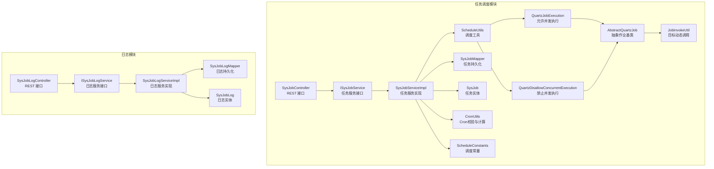
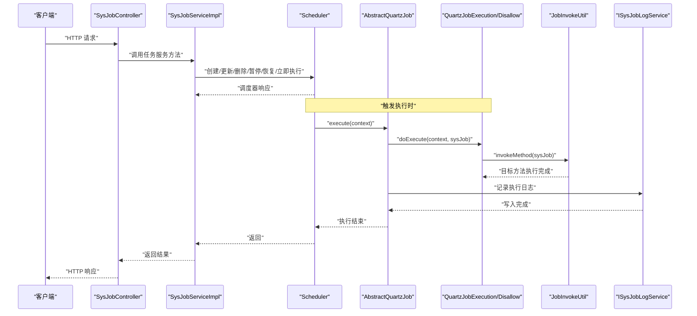
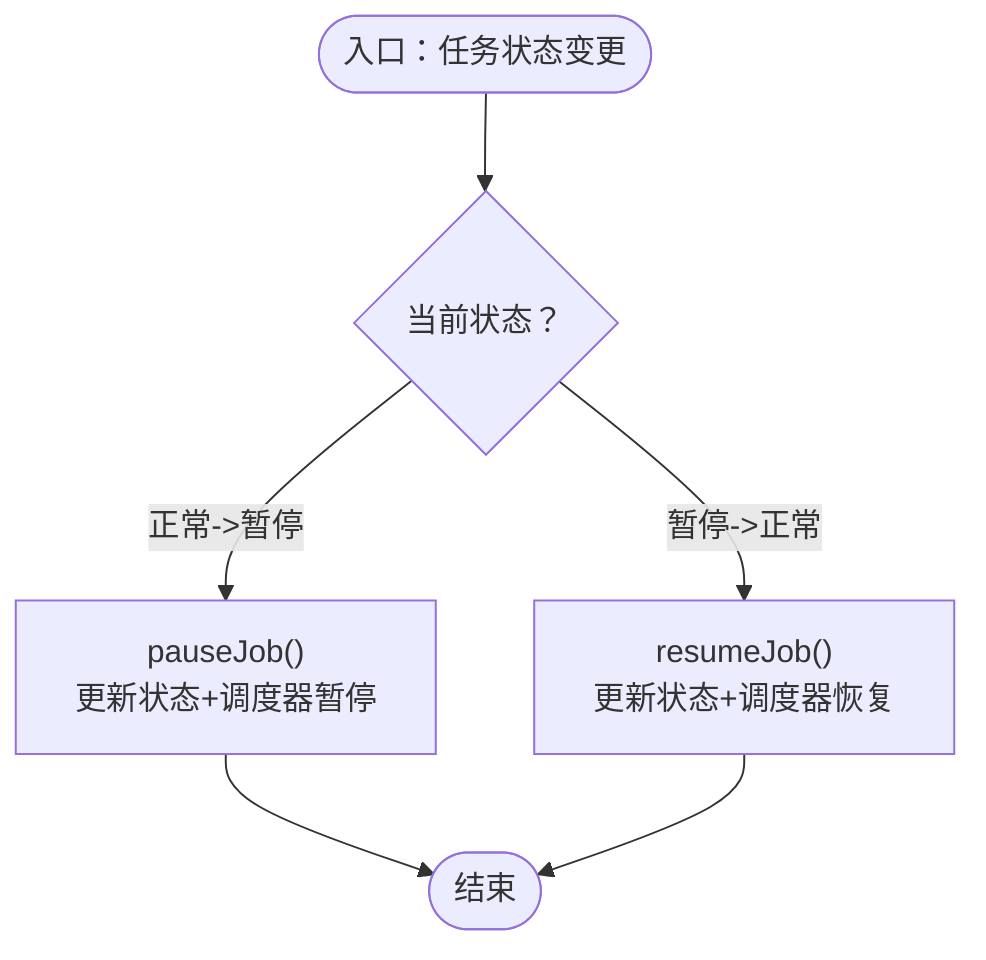
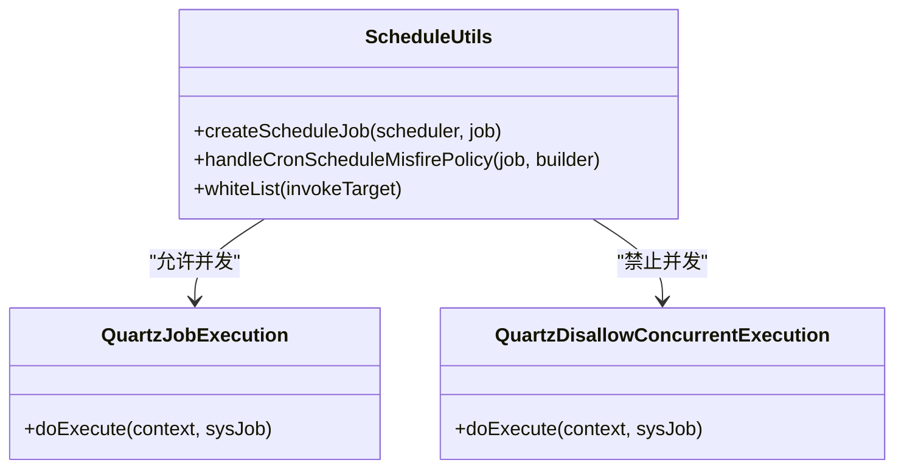
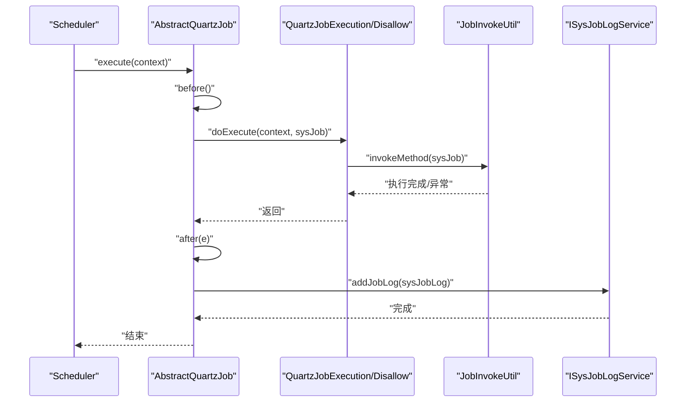
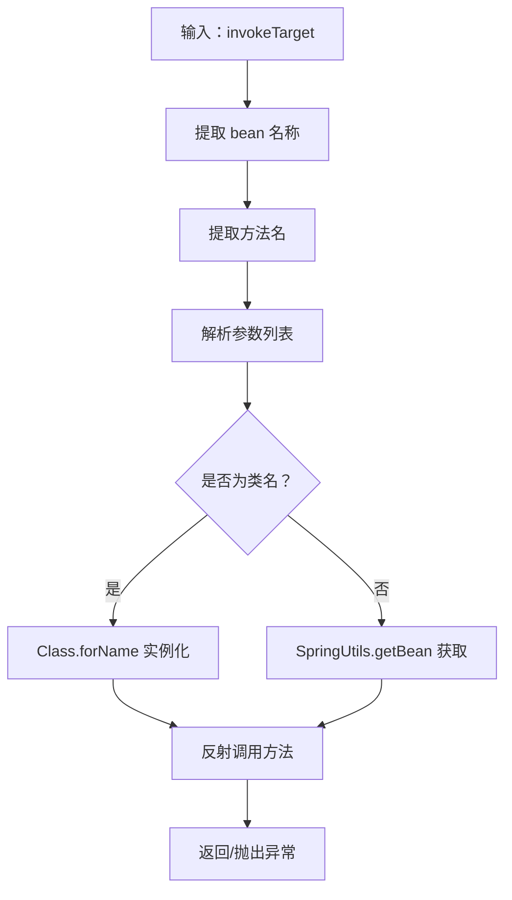
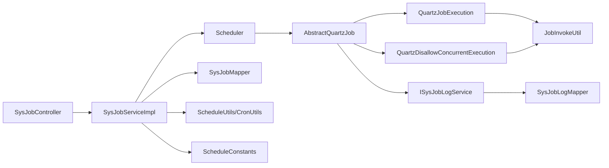

# 任务服务实现

<cite>
**本文引用的文件**
- [SysJobServiceImpl.java](file://blog-quartz/src/main/java/blog/quartz/service/impl/SysJobServiceImpl.java)
- [SysJobLogServiceImpl.java](file://blog-quartz/src/main/java/blog/quartz/service/impl/SysJobLogServiceImpl.java)
- [JobInvokeUtil.java](file://blog-quartz/src/main/java/blog/quartz/util/JobInvokeUtil.java)
- [SysJob.java](file://blog-quartz/src/main/java/blog/quartz/domain/SysJob.java)
- [SysJobLog.java](file://blog-quartz/src/main/java/blog/quartz/domain/SysJobLog.java)
- [ISysJobService.java](file://blog-quartz/src/main/java/blog/quartz/service/ISysJobService.java)
- [ISysJobLogService.java](file://blog-quartz/src/main/java/blog/quartz/service/ISysJobLogService.java)
- [ScheduleUtils.java](file://blog-quartz/src/main/java/blog/quartz/util/ScheduleUtils.java)
- [CronUtils.java](file://blog-quartz/src/main/java/blog/quartz/util/CronUtils.java)
- [ScheduleConstants.java](file://blog-common/src/main/java/blog/common/constant/ScheduleConstants.java)
- [AbstractQuartzJob.java](file://blog-quartz/src/main/java/blog/quartz/util/AbstractQuartzJob.java)
- [QuartzJobExecution.java](file://blog-quartz/src/main/java/blog/quartz/util/QuartzJobExecution.java)
- [QuartzDisallowConcurrentExecution.java](file://blog-quartz/src/main/java/blog/quartz/util/QuartzDisallowConcurrentExecution.java)
- [SysJobController.java](file://blog-quartz/src/main/java/blog/quartz/controller/SysJobController.java)
- [SysJobLogController.java](file://blog-quartz/src/main/java/blog/quartz/controller/SysJobLogController.java)
- [SysJobMapper.java](file://blog-quartz/src/main/java/blog/quartz/mapper/SysJobMapper.java)
- [SysJobLogMapper.java](file://blog-quartz/src/main/java/blog/quartz/mapper/SysJobLogMapper.java)
</cite>

## 目录
1. [简介](#简介)
2. [项目结构](#项目结构)
3. [核心组件](#核心组件)
4. [架构总览](#架构总览)
5. [详细组件分析](#详细组件分析)
6. [依赖分析](#依赖分析)
7. [性能考虑](#性能考虑)
8. [故障排查指南](#故障排查指南)
9. [结论](#结论)
10. [附录](#附录)

## 简介
本文件面向任务调度服务的实现与维护，围绕以下目标展开：
- 深入解析 SysJobServiceImpl 的实现逻辑，覆盖任务的创建、修改、删除、暂停、恢复、立即执行等核心操作。
- 阐述任务调度的业务流程，包括任务状态管理、执行时机控制、并发处理策略等。
- 解释 SysJobLogServiceImpl 日志服务的实现，包括执行日志的记录、查询、清理等能力。
- 说明 JobInvokeUtil 工具类的作用，包括任务目标的动态解析与调用、参数传递、异常处理等执行机制。
- 提供服务层的事务管理与异常处理策略说明，并给出性能优化建议与故障排查指南。

## 项目结构
任务调度模块位于 blog-quartz 子模块中，采用“领域模型 + 服务层 + 工具类 + 控制器 + Mapper”的分层设计，配合 Quartz 调度框架完成定时任务的生命周期管理与执行日志记录。

图表来源
- [SysJobController.java:1-186](file://blog-quartz/src/main/java/blog/quartz/controller/SysJobController.java#L1-L186)
- [ISysJobService.java:1-103](file://blog-quartz/src/main/java/blog/quartz/service/ISysJobService.java#L1-L103)
- [SysJobServiceImpl.java:1-262](file://blog-quartz/src/main/java/blog/quartz/service/impl/SysJobServiceImpl.java#L1-L262)
- [ScheduleUtils.java:1-142](file://blog-quartz/src/main/java/blog/quartz/util/ScheduleUtils.java#L1-L142)
- [QuartzJobExecution.java:1-20](file://blog-quartz/src/main/java/blog/quartz/util/QuartzJobExecution.java#L1-L20)
- [QuartzDisallowConcurrentExecution.java:1-22](file://blog-quartz/src/main/java/blog/quartz/util/QuartzDisallowConcurrentExecution.java#L1-L22)
- [AbstractQuartzJob.java:1-107](file://blog-quartz/src/main/java/blog/quartz/util/AbstractQuartzJob.java#L1-L107)
- [JobInvokeUtil.java:1-183](file://blog-quartz/src/main/java/blog/quartz/util/JobInvokeUtil.java#L1-L183)
- [SysJobMapper.java:1-68](file://blog-quartz/src/main/java/blog/quartz/mapper/SysJobMapper.java#L1-L68)
- [SysJob.java:1-172](file://blog-quartz/src/main/java/blog/quartz/domain/SysJob.java#L1-L172)
- [CronUtils.java:1-64](file://blog-quartz/src/main/java/blog/quartz/util/CronUtils.java#L1-L64)
- [ScheduleConstants.java:1-57](file://blog-common/src/main/java/blog/common/constant/ScheduleConstants.java#L1-L57)
- [SysJobLogController.java:1-93](file://blog-quartz/src/main/java/blog/quartz/controller/SysJobLogController.java#L1-L93)
- [ISysJobLogService.java:1-57](file://blog-quartz/src/main/java/blog/quartz/service/ISysJobLogService.java#L1-L57)
- [SysJobLogServiceImpl.java:1-88](file://blog-quartz/src/main/java/blog/quartz/service/impl/SysJobLogServiceImpl.java#L1-L88)
- [SysJobLogMapper.java:1-65](file://blog-quartz/src/main/java/blog/quartz/mapper/SysJobLogMapper.java#L1-L65)
- [SysJobLog.java:1-156](file://blog-quartz/src/main/java/blog/quartz/domain/SysJobLog.java#L1-L156)

章节来源
- [SysJobController.java:1-186](file://blog-quartz/src/main/java/blog/quartz/controller/SysJobController.java#L1-L186)
- [SysJobLogController.java:1-93](file://blog-quartz/src/main/java/blog/quartz/controller/SysJobLogController.java#L1-L93)

## 核心组件
- 任务服务接口与实现：ISysJobService 与 SysJobServiceImpl 提供任务全生命周期管理，包括初始化、查询、创建、修改、删除、暂停、恢复、立即执行、状态切换与 Cron 校验。
- 调度工具：ScheduleUtils 将 SysJob 映射为 Quartz 的 JobDetail/Trigger，并根据并发策略选择具体执行类；CronUtils 提供 Cron 表达式有效性与下一次执行时间计算。
- 作业执行链路：AbstractQuartzJob 抽象出统一的 before/after 生命周期钩子，负责记录执行耗时、成功/失败状态与异常信息；QuartzJobExecution 与 QuartzDisallowConcurrentExecution 分别对应允许/禁止并发的执行策略；JobInvokeUtil 动态解析并调用目标方法。
- 日志服务：ISysJobLogService 与 SysJobLogServiceImpl 提供日志的查询、新增、批量删除、清空等能力；SysJobLogMapper 负责持久化。
- 控制器：SysJobController 与 SysJobLogController 对外暴露 REST 接口，进行权限控制、参数校验与结果封装。

章节来源
- [ISysJobService.java:1-103](file://blog-quartz/src/main/java/blog/quartz/service/ISysJobService.java#L1-L103)
- [SysJobServiceImpl.java:1-262](file://blog-quartz/src/main/java/blog/quartz/service/impl/SysJobServiceImpl.java#L1-L262)
- [ScheduleUtils.java:1-142](file://blog-quartz/src/main/java/blog/quartz/util/ScheduleUtils.java#L1-L142)
- [AbstractQuartzJob.java:1-107](file://blog-quartz/src/main/java/blog/quartz/util/AbstractQuartzJob.java#L1-L107)
- [QuartzJobExecution.java:1-20](file://blog-quartz/src/main/java/blog/quartz/util/QuartzJobExecution.java#L1-L20)
- [QuartzDisallowConcurrentExecution.java:1-22](file://blog-quartz/src/main/java/blog/quartz/util/QuartzDisallowConcurrentExecution.java#L1-L22)
- [JobInvokeUtil.java:1-183](file://blog-quartz/src/main/java/blog/quartz/util/JobInvokeUtil.java#L1-L183)
- [ISysJobLogService.java:1-57](file://blog-quartz/src/main/java/blog/quartz/service/ISysJobLogService.java#L1-L57)
- [SysJobLogServiceImpl.java:1-88](file://blog-quartz/src/main/java/blog/quartz/service/impl/SysJobLogServiceImpl.java#L1-L88)
- [SysJobLogMapper.java:1-65](file://blog-quartz/src/main/java/blog/quartz/mapper/SysJobLogMapper.java#L1-L65)

## 架构总览
任务调度从“控制器 -> 服务 -> Quartz -> 作业 -> 日志”形成闭环，服务层负责与数据库交互与 Quartz 调度器对接，作业层负责实际方法调用与日志落库。

图表来源
- [SysJobController.java:1-186](file://blog-quartz/src/main/java/blog/quartz/controller/SysJobController.java#L1-L186)
- [SysJobServiceImpl.java:1-262](file://blog-quartz/src/main/java/blog/quartz/service/impl/SysJobServiceImpl.java#L1-L262)
- [AbstractQuartzJob.java:1-107](file://blog-quartz/src/main/java/blog/quartz/util/AbstractQuartzJob.java#L1-L107)
- [QuartzJobExecution.java:1-20](file://blog-quartz/src/main/java/blog/quartz/util/QuartzJobExecution.java#L1-L20)
- [QuartzDisallowConcurrentExecution.java:1-22](file://blog-quartz/src/main/java/blog/quartz/util/QuartzDisallowConcurrentExecution.java#L1-L22)
- [JobInvokeUtil.java:1-183](file://blog-quartz/src/main/java/blog/quartz/util/JobInvokeUtil.java#L1-L183)
- [SysJobLogServiceImpl.java:1-88](file://blog-quartz/src/main/java/blog/quartz/service/impl/SysJobLogServiceImpl.java#L1-L88)

## 详细组件分析

### SysJobServiceImpl：任务服务实现
- 初始化与同步：应用启动时清空并重建调度器中的所有任务，确保数据库与调度器一致。
- 任务 CRUD：提供插入、更新、删除、批量删除；更新时先查旧组名，再删除旧 Job 并按新定义重新创建。
- 状态管理：pauseJob/resumeJob/changeStatus 统一通过状态字段与调度器状态联动；暂停时停止触发，恢复时允许继续。
- 立即执行：run 方法基于 JobDataMap 注入任务属性并直接触发一次执行。
- Cron 校验：checkCronExpressionIsValid 委托 CronUtils 校验表达式有效性。

图表来源
- [SysJobServiceImpl.java:77-110](file://blog-quartz/src/main/java/blog/quartz/service/impl/SysJobServiceImpl.java#L77-L110)

章节来源
- [SysJobServiceImpl.java:1-262](file://blog-quartz/src/main/java/blog/quartz/service/impl/SysJobServiceImpl.java#L1-L262)
- [ISysJobService.java:1-103](file://blog-quartz/src/main/java/blog/quartz/service/ISysJobService.java#L1-L103)

### ScheduleUtils：调度工具与并发策略
- 并发策略选择：根据任务 concurrent 字段选择 QuartzJobExecution 或 QuartzDisallowConcurrentExecution。
- 触发器构建：基于 cron 表达式与错失触发策略（Misfire Policy）生成 CronTrigger。
- 白名单校验：对 invokeTarget 进行包名白名单检查，避免不安全调用。
- 过期判断：仅当下一有效执行时间存在时才调度，避免过期任务入队。

图表来源
- [ScheduleUtils.java:1-142](file://blog-quartz/src/main/java/blog/quartz/util/ScheduleUtils.java#L1-L142)
- [QuartzJobExecution.java:1-20](file://blog-quartz/src/main/java/blog/quartz/util/QuartzJobExecution.java#L1-L20)
- [QuartzDisallowConcurrentExecution.java:1-22](file://blog-quartz/src/main/java/blog/quartz/util/QuartzDisallowConcurrentExecution.java#L1-L22)

章节来源
- [ScheduleUtils.java:1-142](file://blog-quartz/src/main/java/blog/quartz/util/ScheduleUtils.java#L1-L142)
- [ScheduleConstants.java:1-57](file://blog-common/src/main/java/blog/common/constant/ScheduleConstants.java#L1-L57)

### AbstractQuartzJob 与作业执行链路
- 生命周期：before 记录开始时间；doExecute 由子类实现；after 统一封装日志，包含执行耗时、状态与异常信息，并持久化。
- 日志字段：任务名、组名、调用目标、开始/结束时间、执行消息、状态、异常信息。
- 异常处理：捕获异常并标记失败，同时截取异常信息长度限制。

图表来源
- [AbstractQuartzJob.java:1-107](file://blog-quartz/src/main/java/blog/quartz/util/AbstractQuartzJob.java#L1-L107)
- [QuartzJobExecution.java:1-20](file://blog-quartz/src/main/java/blog/quartz/util/QuartzJobExecution.java#L1-L20)
- [QuartzDisallowConcurrentExecution.java:1-22](file://blog-quartz/src/main/java/blog/quartz/util/QuartzDisallowConcurrentExecution.java#L1-L22)
- [JobInvokeUtil.java:1-183](file://blog-quartz/src/main/java/blog/quartz/util/JobInvokeUtil.java#L1-L183)
- [SysJobLogServiceImpl.java:1-88](file://blog-quartz/src/main/java/blog/quartz/service/impl/SysJobLogServiceImpl.java#L1-L88)

章节来源
- [AbstractQuartzJob.java:1-107](file://blog-quartz/src/main/java/blog/quartz/util/AbstractQuartzJob.java#L1-L107)

### JobInvokeUtil：动态调用与参数解析
- 目标解析：支持 Spring Bean 名称与全限定类名两种形式；解析出 bean 名称、方法名与参数列表。
- 参数类型识别：支持字符串、布尔、长整型、双精度、整型等；参数以逗号分隔且能识别带引号的字符串。
- 反射调用：根据参数类型数组定位方法并调用，支持无参与多参场景。
- 安全性：结合 ScheduleUtils 的白名单校验共同约束调用范围。

图表来源
- [JobInvokeUtil.java:1-183](file://blog-quartz/src/main/java/blog/quartz/util/JobInvokeUtil.java#L1-L183)
- [ScheduleUtils.java:128-140](file://blog-quartz/src/main/java/blog/quartz/util/ScheduleUtils.java#L128-L140)

章节来源
- [JobInvokeUtil.java:1-183](file://blog-quartz/src/main/java/blog/quartz/util/JobInvokeUtil.java#L1-L183)

### SysJobLogServiceImpl：日志服务
- 查询与详情：selectJobLogList/selectJobLogById 支持分页与条件过滤。
- 新增与批量删除：addJobLog、deleteJobLogByIds、deleteJobLogById 提供日志写入与清理能力。
- 清空日志：cleanJobLog 清理历史日志，避免表膨胀。

章节来源
- [SysJobLogServiceImpl.java:1-88](file://blog-quartz/src/main/java/blog/quartz/service/impl/SysJobLogServiceImpl.java#L1-L88)
- [ISysJobLogService.java:1-57](file://blog-quartz/src/main/java/blog/quartz/service/ISysJobLogService.java#L1-L57)

### 控制器与事务/异常处理
- SysJobController：对新增/修改进行 Cron 校验、白名单与敏感协议检查；状态变更与立即执行均委托服务层；返回统一的结果封装。
- SysJobLogController：提供日志列表、导出、详情、删除与清空接口。
- 事务与异常：服务层方法普遍标注事务回滚，保证数据库状态与调度器状态一致性；异常通过 TaskException 与通用异常体系向上抛出。

章节来源
- [SysJobController.java:1-186](file://blog-quartz/src/main/java/blog/quartz/controller/SysJobController.java#L1-L186)
- [SysJobLogController.java:1-93](file://blog-quartz/src/main/java/blog/quartz/controller/SysJobLogController.java#L1-L93)
- [SysJobServiceImpl.java:77-110](file://blog-quartz/src/main/java/blog/quartz/service/impl/SysJobServiceImpl.java#L77-L110)

## 依赖分析
- 服务层对 Quartz 的耦合：通过 Scheduler 与 ScheduleUtils 间接依赖 Quartz；并发策略通过注解与类选择实现。
- 工具层对 Spring 的依赖：JobInvokeUtil 使用 SpringUtils 获取 Bean；AbstractQuartzJob 在 after 中通过 SpringUtils 获取日志服务。
- 常量与策略：ScheduleConstants 定义 Misfire 策略与状态枚举；CronUtils 提供表达式校验与下一执行时间推算。
- 控制器与服务：控制器仅负责参数校验与结果封装，核心逻辑集中在服务层。

图表来源
- [SysJobController.java:1-186](file://blog-quartz/src/main/java/blog/quartz/controller/SysJobController.java#L1-L186)
- [SysJobServiceImpl.java:1-262](file://blog-quartz/src/main/java/blog/quartz/service/impl/SysJobServiceImpl.java#L1-L262)
- [ScheduleUtils.java:1-142](file://blog-quartz/src/main/java/blog/quartz/util/ScheduleUtils.java#L1-L142)
- [AbstractQuartzJob.java:1-107](file://blog-quartz/src/main/java/blog/quartz/util/AbstractQuartzJob.java#L1-L107)
- [QuartzJobExecution.java:1-20](file://blog-quartz/src/main/java/blog/quartz/util/QuartzJobExecution.java#L1-L20)
- [QuartzDisallowConcurrentExecution.java:1-22](file://blog-quartz/src/main/java/blog/quartz/util/QuartzDisallowConcurrentExecution.java#L1-L22)
- [JobInvokeUtil.java:1-183](file://blog-quartz/src/main/java/blog/quartz/util/JobInvokeUtil.java#L1-L183)
- [SysJobLogServiceImpl.java:1-88](file://blog-quartz/src/main/java/blog/quartz/service/impl/SysJobLogServiceImpl.java#L1-L88)
- [SysJobMapper.java:1-68](file://blog-quartz/src/main/java/blog/quartz/mapper/SysJobMapper.java#L1-L68)
- [SysJobLogMapper.java:1-65](file://blog-quartz/src/main/java/blog/quartz/mapper/SysJobLogMapper.java#L1-L65)

## 性能考虑
- 并发策略选择
  - 允许并发：适用于无状态、可并行的任务，提升吞吐；通过 QuartzJobExecution 实现。
  - 禁止并发：适用于有状态或资源竞争的任务，避免重复执行；通过 QuartzDisallowConcurrentExecution 实现。
- Cron 表达式优化
  - 使用合理的周期与边界，减少瞬时高并发；利用 Misfire 策略（忽略/立即/不做）平衡准确性与性能。
- 日志落库
  - 执行日志包含开始/结束时间与异常信息，建议定期清理历史日志，避免表增长影响查询性能。
- 反射调用
  - JobInvokeUtil 使用反射，参数解析与方法查找存在开销；建议尽量使用简单参数与稳定签名，减少反射成本。
- 初始化与同步
  - 应用启动时重建调度器，确保一致性；建议在低峰时段进行，避免启动抖动。

## 故障排查指南
- 任务无法启动/立即执行失败
  - 检查 Cron 表达式是否有效；通过 checkCronExpressionIsValid 或 CronUtils.getInvalidMessage 定位问题。
  - 确认任务状态为正常；若为暂停，需先恢复。
  - 确认 invokeTarget 符合白名单；控制器层已做敏感协议与违规关键字拦截。
- 任务重复执行或未执行
  - 查看 Misfire 策略设置；根据业务需求调整为忽略、立即或不做。
  - 检查任务是否过期（下一次执行时间为空）；过期任务不会被调度。
- 并发冲突
  - 若任务有状态或共享资源，应设置禁止并发；否则可能导致竞态。
- 日志缺失
  - 确认 AbstractQuartzJob.after 是否被调用；异常会被捕获并记录；检查日志服务是否可用。
  - 定期清理历史日志，避免磁盘压力过大。
- 事务与一致性
  - 服务层方法普遍开启事务；若数据库更新成功但调度器未同步，检查调度器异常与日志。

章节来源
- [SysJobServiceImpl.java:256-260](file://blog-quartz/src/main/java/blog/quartz/service/impl/SysJobServiceImpl.java#L256-L260)
- [ScheduleUtils.java:103-120](file://blog-quartz/src/main/java/blog/quartz/util/ScheduleUtils.java#L103-L120)
- [AbstractQuartzJob.java:46-50](file://blog-quartz/src/main/java/blog/quartz/util/AbstractQuartzJob.java#L46-L50)
- [SysJobLogServiceImpl.java:82-86](file://blog-quartz/src/main/java/blog/quartz/service/impl/SysJobLogServiceImpl.java#L82-L86)

## 结论
本实现以 Quartz 为核心，结合自研工具类与服务层封装，提供了完整的任务生命周期管理与日志记录能力。通过并发策略与 Misfire 策略的合理配置，可在保证业务正确性的前提下获得良好的性能表现。建议在生产环境中严格控制任务目标的安全性与稳定性，并定期清理日志以维持系统健康。

## 附录
- 关键实体字段说明
  - SysJob：任务标识、名称、组名、调用目标、Cron 表达式、错失触发策略、并发策略、状态等。
  - SysJobLog：日志标识、任务名称/组、调用目标、执行消息、状态、异常信息、开始/结束时间等。
- 常量与策略
  - ScheduleConstants：任务键名、任务属性键、Misfire 策略枚举、状态枚举。
  - CronUtils：表达式有效性校验、异常消息获取、下一次执行时间推算。

章节来源
- [SysJob.java:1-172](file://blog-quartz/src/main/java/blog/quartz/domain/SysJob.java#L1-L172)
- [SysJobLog.java:1-156](file://blog-quartz/src/main/java/blog/quartz/domain/SysJobLog.java#L1-L156)
- [ScheduleConstants.java:1-57](file://blog-common/src/main/java/blog/common/constant/ScheduleConstants.java#L1-L57)
- [CronUtils.java:1-64](file://blog-quartz/src/main/java/blog/quartz/util/CronUtils.java#L1-L64)