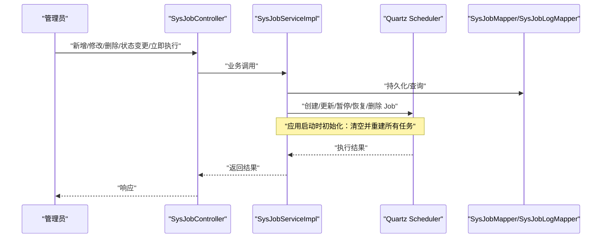
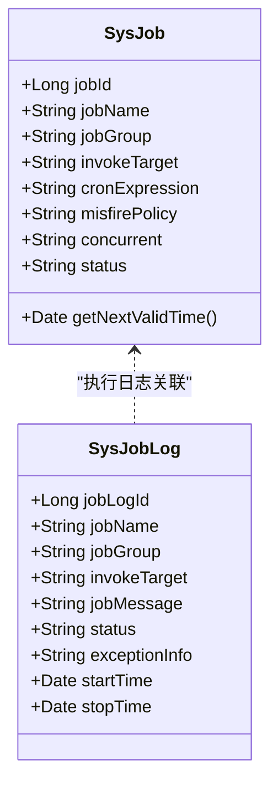
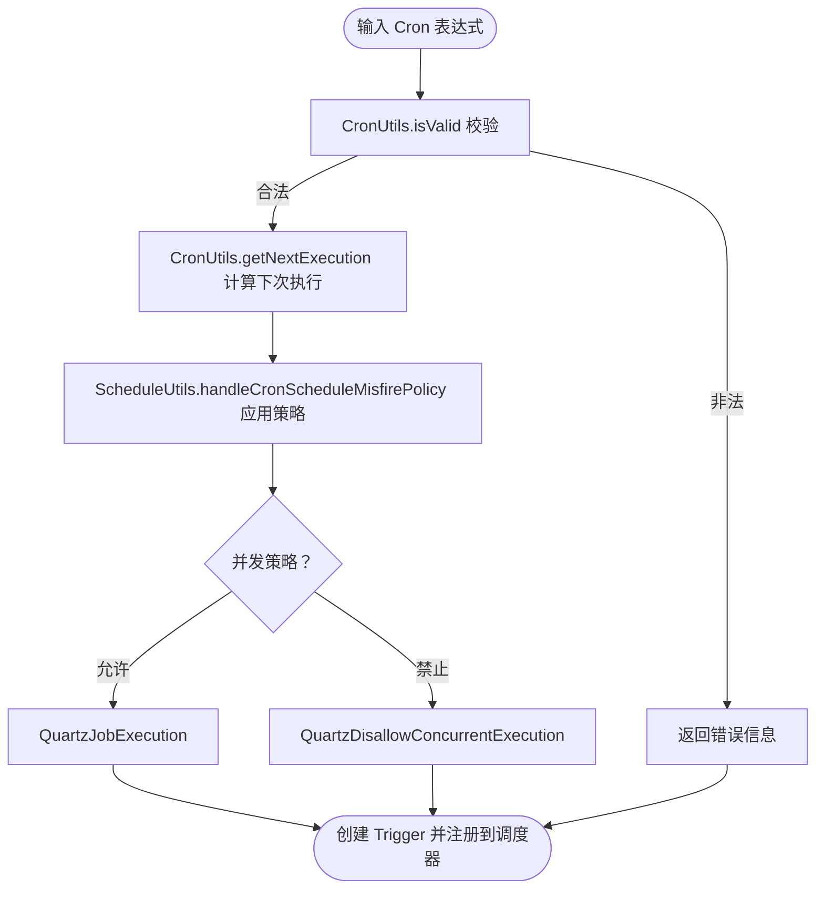
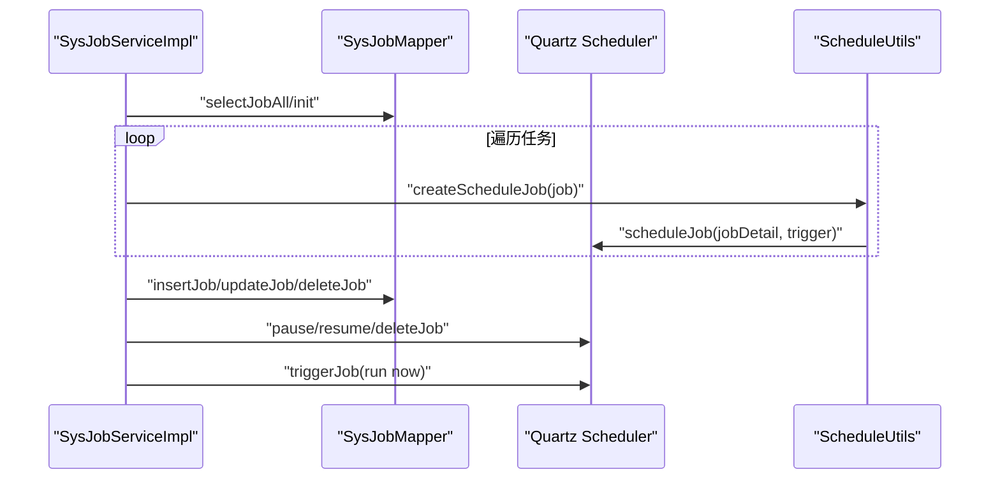
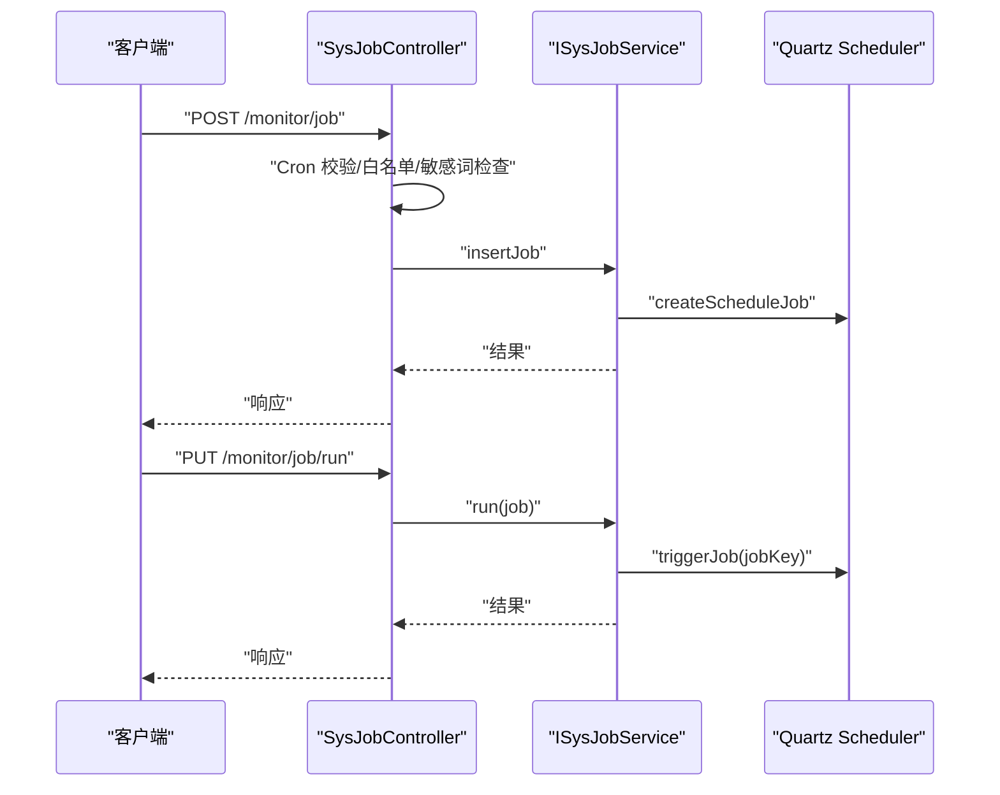
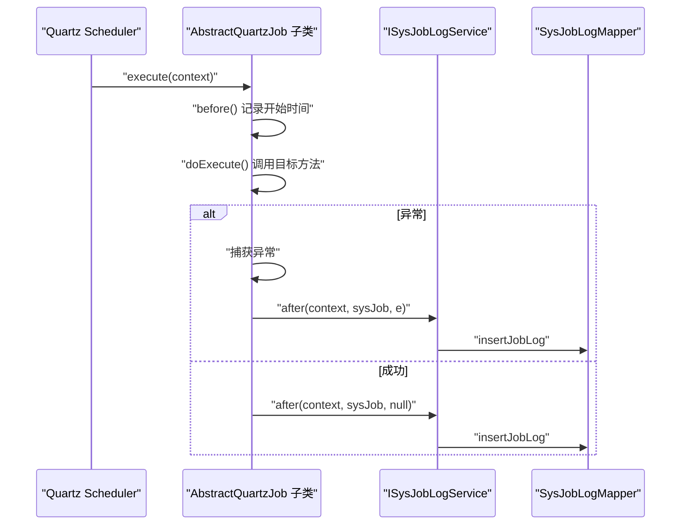
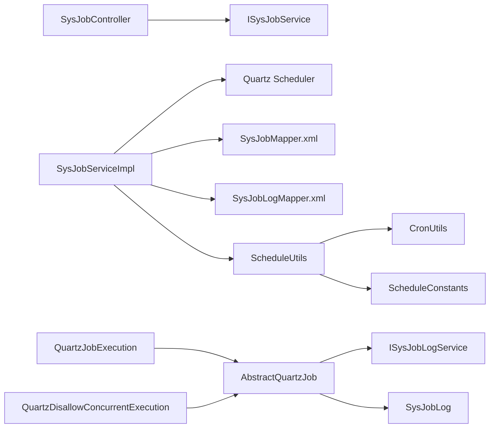

# 定时任务系统

<cite>
**本文引用的文件**
- [SysJob.java](file://blog-quartz/src/main/java/blog/quartz/domain/SysJob.java)
- [SysJobLog.java](file://blog-quartz/src/main/java/blog/quartz/domain/SysJobLog.java)
- [SysJobController.java](file://blog-quartz/src/main/java/blog/quartz/controller/SysJobController.java)
- [SysJobLogController.java](file://blog-quartz/src/main/java/blog/quartz/controller/SysJobLogController.java)
- [ISysJobService.java](file://blog-quartz/src/main/java/blog/quartz/service/ISysJobService.java)
- [SysJobServiceImpl.java](file://blog-quartz/src/main/java/blog/quartz/service/impl/SysJobServiceImpl.java)
- [CronUtils.java](file://blog-quartz/src/main/java/blog/quartz/util/CronUtils.java)
- [ScheduleUtils.java](file://blog-quartz/src/main/java/blog/quartz/util/ScheduleUtils.java)
- [AbstractQuartzJob.java](file://blog-quartz/src/main/java/blog/quartz/util/AbstractQuartzJob.java)
- [QuartzJobExecution.java](file://blog-quartz/src/main/java/blog/quartz/util/QuartzJobExecution.java)
- [QuartzDisallowConcurrentExecution.java](file://blog-quartz/src/main/java/blog/quartz/util/QuartzDisallowConcurrentExecution.java)
- [RyTask.java](file://blog-quartz/src/main/java/blog/quartz/task/RyTask.java)
- [SysJobMapper.xml](file://blog-quartz/src/main/resources/mapper/quartz/SysJobMapper.xml)
- [SysJobLogMapper.xml](file://blog-quartz/src/main/resources/mapper/quartz/SysJobLogMapper.xml)
- [ScheduleConstants.java](file://blog-common/src/main/java/blog/common/constant/ScheduleConstants.java)
</cite>

## 目录
1. [引言](#引言)
2. [项目结构](#项目结构)
3. [核心组件](#核心组件)
4. [架构总览](#架构总览)
5. [详细组件分析](#详细组件分析)
6. [依赖分析](#依赖分析)
7. [性能考虑](#性能考虑)
8. [故障排查指南](#故障排查指南)
9. [结论](#结论)
10. [附录](#附录)

## 引言
本文件面向开发者与运维人员，系统化梳理基于 Quartz 的定时任务系统实现，覆盖任务定义、调度配置、执行监控、Cron 表达式校验、并发策略、安全白名单、以及最佳实践与性能优化建议。通过对 SysJob 实体、服务层、控制器、工具类与映射文件的逐层解析，帮助读者快速掌握从任务创建到执行监控的完整闭环。

## 项目结构
定时任务模块位于独立的 blog-quartz 子工程中，采用分层架构：
- 控制层：SysJobController、SysJobLogController 提供 REST 接口
- 服务层：ISysJobService 及其实现 SysJobServiceImpl
- 领域模型：SysJob（任务）、SysJobLog（日志）
- 工具与调度：ScheduleUtils、CronUtils、AbstractQuartzJob 及其子类
- 数据访问：MyBatis 映射文件 SysJobMapper.xml、SysJobLogMapper.xml
- 常量与枚举：ScheduleConstants

```mermaid
graph TB
subgraph "控制层"
C1["SysJobController"]
C2["SysJobLogController"]
end
subgraph "服务层"
S1["ISysJobService"]
S2["SysJobServiceImpl"]
end
subgraph "领域模型"
D1["SysJob"]
D2["SysJobLog"]
end
subgraph "调度与工具"
U1["ScheduleUtils"]
U2["CronUtils"]
U3["AbstractQuartzJob"]
U4["QuartzJobExecution"]
U5["QuartzDisallowConcurrentExecution"]
end
subgraph "数据访问"
M1["SysJobMapper.xml"]
M2["SysJobLogMapper.xml"]
end
subgraph "常量"
K1["ScheduleConstants"]
end
C1 --> S1
C2 --> S1
S1 < --> S2
S2 --> U1
U1 --> U2
U1 --> U5
U2 --> D1
U5 --> D1
S2 --> M1
S2 --> M2
U3 --> D2
U1 --> K1
```

图表来源
- [SysJobController.java:35-185](file://blog-quartz/src/main/java/blog/quartz/controller/SysJobController.java#L35-L185)
- [SysJobLogController.java:27-92](file://blog-quartz/src/main/java/blog/quartz/controller/SysJobLogController.java#L27-L92)
- [ISysJobService.java:13-102](file://blog-quartz/src/main/java/blog/quartz/service/ISysJobService.java#L13-L102)
- [SysJobServiceImpl.java:25-261](file://blog-quartz/src/main/java/blog/quartz/service/impl/SysJobServiceImpl.java#L25-L261)
- [ScheduleUtils.java:27-141](file://blog-quartz/src/main/java/blog/quartz/util/ScheduleUtils.java#L27-L141)
- [CronUtils.java:13-63](file://blog-quartz/src/main/java/blog/quartz/util/CronUtils.java#L13-L63)
- [AbstractQuartzJob.java:23-106](file://blog-quartz/src/main/java/blog/quartz/util/AbstractQuartzJob.java#L23-L106)
- [QuartzJobExecution.java:12-19](file://blog-quartz/src/main/java/blog/quartz/util/QuartzJobExecution.java#L12-L19)
- [QuartzDisallowConcurrentExecution.java:13-21](file://blog-quartz/src/main/java/blog/quartz/util/QuartzDisallowConcurrentExecution.java#L13-L21)
- [SysJobMapper.xml:5-110](file://blog-quartz/src/main/resources/mapper/quartz/SysJobMapper.xml#L5-L110)
- [SysJobLogMapper.xml:5-93](file://blog-quartz/src/main/resources/mapper/quartz/SysJobLogMapper.xml#L5-L93)
- [ScheduleConstants.java:8-56](file://blog-common/src/main/java/blog/common/constant/ScheduleConstants.java#L8-L56)

章节来源
- [SysJobController.java:35-185](file://blog-quartz/src/main/java/blog/quartz/controller/SysJobController.java#L35-L185)
- [SysJobLogController.java:27-92](file://blog-quartz/src/main/java/blog/quartz/controller/SysJobLogController.java#L27-L92)
- [SysJobServiceImpl.java:25-261](file://blog-quartz/src/main/java/blog/quartz/service/impl/SysJobServiceImpl.java#L25-L261)
- [ScheduleUtils.java:27-141](file://blog-quartz/src/main/java/blog/quartz/util/ScheduleUtils.java#L27-L141)
- [CronUtils.java:13-63](file://blog-quartz/src/main/java/blog/quartz/util/CronUtils.java#L13-L63)
- [AbstractQuartzJob.java:23-106](file://blog-quartz/src/main/java/blog/quartz/util/AbstractQuartzJob.java#L23-L106)
- [SysJobMapper.xml:5-110](file://blog-quartz/src/main/resources/mapper/quartz/SysJobMapper.xml#L5-L110)
- [SysJobLogMapper.xml:5-93](file://blog-quartz/src/main/resources/mapper/quartz/SysJobLogMapper.xml#L5-L93)
- [ScheduleConstants.java:8-56](file://blog-common/src/main/java/blog/common/constant/ScheduleConstants.java#L8-L56)

## 核心组件
- SysJob：任务实体，包含任务标识、名称、组、调用目标、Cron 表达式、错失触发策略、并发策略、状态等字段；提供计算下一次执行时间的能力。
- SysJobLog：任务执行日志实体，记录任务名、组、调用目标、开始/结束时间、状态、异常信息与耗时摘要。
- 控制器：SysJobController 提供任务 CRUD、状态变更、立即执行、导出；SysJobLogController 提供日志查询、导出、清空。
- 服务层：SysJobServiceImpl 实现任务的持久化、调度器同步、暂停/恢复/删除、立即执行、Cron 合法性校验。
- 调度工具：ScheduleUtils 将 SysJob 映射为 Quartz JobDetail/Trigger，处理并发策略与错失触发策略；CronUtils 提供表达式合法性与下一次执行时间计算。
- 抽象与具体作业：AbstractQuartzJob 统一执行生命周期与日志落库；QuartzJobExecution/QuartzDisallowConcurrentExecution 分别支持并发与禁止并发两种执行策略。
- MyBatis 映射：SysJobMapper.xml、SysJobLogMapper.xml 完成任务与日志的数据库读写。

章节来源
- [SysJob.java:21-171](file://blog-quartz/src/main/java/blog/quartz/domain/SysJob.java#L21-L171)
- [SysJobLog.java:14-155](file://blog-quartz/src/main/java/blog/quartz/domain/SysJobLog.java#L14-L155)
- [SysJobController.java:35-185](file://blog-quartz/src/main/java/blog/quartz/controller/SysJobController.java#L35-L185)
- [SysJobLogController.java:27-92](file://blog-quartz/src/main/java/blog/quartz/controller/SysJobLogController.java#L27-L92)
- [ISysJobService.java:13-102](file://blog-quartz/src/main/java/blog/quartz/service/ISysJobService.java#L13-L102)
- [SysJobServiceImpl.java:25-261](file://blog-quartz/src/main/java/blog/quartz/service/impl/SysJobServiceImpl.java#L25-L261)
- [ScheduleUtils.java:27-141](file://blog-quartz/src/main/java/blog/quartz/util/ScheduleUtils.java#L27-L141)
- [CronUtils.java:13-63](file://blog-quartz/src/main/java/blog/quartz/util/CronUtils.java#L13-L63)
- [AbstractQuartzJob.java:23-106](file://blog-quartz/src/main/java/blog/quartz/util/AbstractQuartzJob.java#L23-L106)
- [QuartzJobExecution.java:12-19](file://blog-quartz/src/main/java/blog/quartz/util/QuartzJobExecution.java#L12-L19)
- [QuartzDisallowConcurrentExecution.java:13-21](file://blog-quartz/src/main/java/blog/quartz/util/QuartzDisallowConcurrentExecution.java#L13-L21)
- [SysJobMapper.xml:5-110](file://blog-quartz/src/main/resources/mapper/quartz/SysJobMapper.xml#L5-L110)
- [SysJobLogMapper.xml:5-93](file://blog-quartz/src/main/resources/mapper/quartz/SysJobLogMapper.xml#L5-L93)

## 架构总览
系统围绕 Quartz 调度器展开，SysJob 作为持久化任务元数据，SysJobServiceImpl 在应用启动时与数据库同步至调度器；执行阶段由 AbstractQuartzJob 抽象类统一采集执行前后信息并写入 SysJobLog；ScheduleUtils 负责将 SysJob 转换为 Quartz 的 JobDetail/Trigger 并设置并发与错失触发策略。



图表来源
- [SysJobController.java:35-185](file://blog-quartz/src/main/java/blog/quartz/controller/SysJobController.java#L35-L185)
- [SysJobServiceImpl.java:37-46](file://blog-quartz/src/main/java/blog/quartz/service/impl/SysJobServiceImpl.java#L37-L46)
- [SysJobMapper.xml:5-110](file://blog-quartz/src/main/resources/mapper/quartz/SysJobMapper.xml#L5-L110)
- [SysJobLogMapper.xml:5-93](file://blog-quartz/src/main/resources/mapper/quartz/SysJobLogMapper.xml#L5-L93)

## 详细组件分析

### SysJob 实体设计
- 关键字段
  - 任务标识、名称、组、调用目标字符串、Cron 表达式、错失触发策略、并发策略、状态
  - 提供下一次有效执行时间的计算入口，依赖 CronUtils
- 设计要点
  - 使用注解标注导出与长度限制，便于前端展示与校验
  - 通过继承 BaseEntity 获得审计字段能力
  - toString 输出包含任务关键信息，便于日志与调试



图表来源
- [SysJob.java:21-171](file://blog-quartz/src/main/java/blog/quartz/domain/SysJob.java#L21-L171)
- [SysJobLog.java:14-155](file://blog-quartz/src/main/java/blog/quartz/domain/SysJobLog.java#L14-L155)

章节来源
- [SysJob.java:21-171](file://blog-quartz/src/main/java/blog/quartz/domain/SysJob.java#L21-L171)
- [SysJobLog.java:14-155](file://blog-quartz/src/main/java/blog/quartz/domain/SysJobLog.java#L14-L155)

### Cron 表达式与调度配置
- 表达式校验
  - CronUtils.isValid 与 getInvalidMessage 提供表达式合法性判断与错误提示
  - SysJobController 在新增/修改时进行前置校验
- 下一次执行时间
  - SysJob.getNextValidTime 委托 CronUtils 计算
- 错失触发策略
  - ScheduleConstants 定义默认、忽略、触发一次、不处理四种策略
  - ScheduleUtils.handleCronScheduleMisfirePolicy 将策略映射为 Quartz 的 Misfire 处理指令
- 并发策略
  - 0 表示允许并发，使用 QuartzJobExecution；1 表示禁止并发，使用 QuartzDisallowConcurrentExecution
- 白名单与安全
  - ScheduleUtils.whiteList 对调用目标进行包路径与白名单检查，避免危险调用



图表来源
- [CronUtils.java:13-63](file://blog-quartz/src/main/java/blog/quartz/util/CronUtils.java#L13-L63)
- [ScheduleUtils.java:27-141](file://blog-quartz/src/main/java/blog/quartz/util/ScheduleUtils.java#L27-L141)
- [ScheduleConstants.java:8-56](file://blog-common/src/main/java/blog/common/constant/ScheduleConstants.java#L8-L56)

章节来源
- [CronUtils.java:13-63](file://blog-quartz/src/main/java/blog/quartz/util/CronUtils.java#L13-L63)
- [ScheduleUtils.java:27-141](file://blog-quartz/src/main/java/blog/quartz/util/ScheduleUtils.java#L27-L141)
- [ScheduleConstants.java:8-56](file://blog-common/src/main/java/blog/common/constant/ScheduleConstants.java#L8-L56)

### 任务服务层实现逻辑
- 初始化同步
  - 应用启动时清空并重建所有任务，确保数据库与调度器一致
- 任务 CRUD
  - 新增/修改：持久化后通过 ScheduleUtils.createScheduleJob 注册到调度器
  - 删除：先删除数据库记录，再删除对应 Job
- 状态变更
  - 暂停/恢复：更新状态并调用 scheduler.pauseJob/scheduler.resumeJob
- 立即执行
  - 构造 JobDataMap 并 triggerJob，用于一次性执行
- Cron 合法性校验
  - 通过 CronUtils 校验表达式有效性



图表来源
- [SysJobServiceImpl.java:37-46](file://blog-quartz/src/main/java/blog/quartz/service/impl/SysJobServiceImpl.java#L37-L46)
- [SysJobServiceImpl.java:200-248](file://blog-quartz/src/main/java/blog/quartz/service/impl/SysJobServiceImpl.java#L200-L248)
- [ScheduleUtils.java:60-98](file://blog-quartz/src/main/java/blog/quartz/util/ScheduleUtils.java#L60-L98)

章节来源
- [SysJobServiceImpl.java:25-261](file://blog-quartz/src/main/java/blog/quartz/service/impl/SysJobServiceImpl.java#L25-L261)
- [ScheduleUtils.java:27-141](file://blog-quartz/src/main/java/blog/quartz/util/ScheduleUtils.java#L27-L141)

### 任务控制器接口设计
- 任务接口
  - 列表查询、导出、详情、新增、修改、状态变更、立即执行、删除（批量）
  - 新增/修改前进行 Cron 合法性与调用目标白名单/敏感词校验
- 日志接口
  - 列表查询、导出、详情、删除（批量）、清空



图表来源
- [SysJobController.java:77-172](file://blog-quartz/src/main/java/blog/quartz/controller/SysJobController.java#L77-L172)
- [ISysJobService.java:13-102](file://blog-quartz/src/main/java/blog/quartz/service/ISysJobService.java#L13-L102)

章节来源
- [SysJobController.java:35-185](file://blog-quartz/src/main/java/blog/quartz/controller/SysJobController.java#L35-L185)
- [SysJobLogController.java:27-92](file://blog-quartz/src/main/java/blog/quartz/controller/SysJobLogController.java#L27-L92)

### 任务执行监控机制
- 执行生命周期
  - AbstractQuartzJob.before/after 统一封装：记录开始时间、构造 SysJobLog、计算耗时、写入状态与异常信息
- 日志落库
  - after 中通过 SpringUtils 获取 ISysJobLogService 并持久化执行日志
- 异常处理
  - 捕获执行异常，记录异常信息与状态，保证监控不中断



图表来源
- [AbstractQuartzJob.java:32-96](file://blog-quartz/src/main/java/blog/quartz/util/AbstractQuartzJob.java#L32-L96)
- [SysJobLogMapper.xml:72-92](file://blog-quartz/src/main/resources/mapper/quartz/SysJobLogMapper.xml#L72-L92)

章节来源
- [AbstractQuartzJob.java:23-106](file://blog-quartz/src/main/java/blog/quartz/util/AbstractQuartzJob.java#L23-L106)
- [SysJobLogMapper.xml:5-93](file://blog-quartz/src/main/resources/mapper/quartz/SysJobLogMapper.xml#L5-L93)

### 调用目标与示例任务
- 调用目标格式
  - 通过 ScheduleUtils.whiteList 校验，支持 Spring Bean 名称或限定包路径
- 示例任务
  - RyTask 提供无参、有参、多参三种方法，演示不同参数类型的调用方式

章节来源
- [ScheduleUtils.java:128-140](file://blog-quartz/src/main/java/blog/quartz/util/ScheduleUtils.java#L128-L140)
- [RyTask.java:11-28](file://blog-quartz/src/main/java/blog/quartz/task/RyTask.java#L11-L28)

## 依赖分析
- 控制器依赖服务接口，服务实现依赖调度器与 Mapper
- ScheduleUtils 依赖 CronUtils 与 ScheduleConstants
- 抽象作业类依赖 SysJob、SysJobLog、ISysJobLogService
- Mapper XML 与实体类一一对应，提供完整的 CRUD 能力



图表来源
- [SysJobController.java:35-185](file://blog-quartz/src/main/java/blog/quartz/controller/SysJobController.java#L35-L185)
- [ISysJobService.java:13-102](file://blog-quartz/src/main/java/blog/quartz/service/ISysJobService.java#L13-L102)
- [SysJobServiceImpl.java:25-261](file://blog-quartz/src/main/java/blog/quartz/service/impl/SysJobServiceImpl.java#L25-L261)
- [ScheduleUtils.java:27-141](file://blog-quartz/src/main/java/blog/quartz/util/ScheduleUtils.java#L27-L141)
- [CronUtils.java:13-63](file://blog-quartz/src/main/java/blog/quartz/util/CronUtils.java#L13-L63)
- [AbstractQuartzJob.java:23-106](file://blog-quartz/src/main/java/blog/quartz/util/AbstractQuartzJob.java#L23-L106)
- [SysJobMapper.xml:5-110](file://blog-quartz/src/main/resources/mapper/quartz/SysJobMapper.xml#L5-L110)
- [SysJobLogMapper.xml:5-93](file://blog-quartz/src/main/resources/mapper/quartz/SysJobLogMapper.xml#L5-L93)

章节来源
- [SysJobServiceImpl.java:25-261](file://blog-quartz/src/main/java/blog/quartz/service/impl/SysJobServiceImpl.java#L25-L261)
- [ScheduleUtils.java:27-141](file://blog-quartz/src/main/java/blog/quartz/util/ScheduleUtils.java#L27-L141)
- [AbstractQuartzJob.java:23-106](file://blog-quartz/src/main/java/blog/quartz/util/AbstractQuartzJob.java#L23-L106)

## 性能考虑
- 并发策略选择
  - CPU 密集型任务建议禁止并发，避免资源争用
  - IO 密集型任务可允许并发，提升吞吐
- 错失触发策略
  - 高可用场景优先考虑忽略错失或触发一次，减少阻塞
- 表达式设计
  - 避免过于频繁的执行频率，合理利用“仅在需要时触发”的策略
- 日志落库
  - 批量导出与清理接口可用于降低日志表压力
- 初始化同步
  - 应用启动时全量重建任务，确保一致性但可能带来短暂延迟，建议在低峰时段部署

## 故障排查指南
- Cron 表达式错误
  - 使用 CronUtils.getInvalidMessage 获取具体错误描述
  - 在控制器层已有前置校验，若仍出现异常，检查表达式格式
- 调用目标异常
  - 检查 ScheduleUtils.whiteList 白名单匹配与敏感词过滤
  - 确认目标 Bean 名称或包路径正确
- 任务未执行或状态异常
  - 检查 SysJob.status 与调度器 JobKey 是否一致
  - 查看 SysJobLog 中异常信息定位问题
- 立即执行失败
  - 确认任务存在且未过期，检查 scheduler.checkExists 与 triggerJob 调用

章节来源
- [SysJobController.java:83-146](file://blog-quartz/src/main/java/blog/quartz/controller/SysJobController.java#L83-L146)
- [ScheduleUtils.java:128-140](file://blog-quartz/src/main/java/blog/quartz/util/ScheduleUtils.java#L128-L140)
- [AbstractQuartzJob.java:46-50](file://blog-quartz/src/main/java/blog/quartz/util/AbstractQuartzJob.java#L46-L50)
- [SysJobLogController.java:74-91](file://blog-quartz/src/main/java/blog/quartz/controller/SysJobLogController.java#L74-L91)

## 结论
本定时任务系统以 Quartz 为核心，结合自研工具类与严格的校验策略，实现了从任务定义、调度配置、并发与错失策略、到执行监控与日志落库的完整闭环。通过清晰的分层设计与完善的接口能力，开发者可便捷地创建、管理与观测定时任务，同时具备良好的扩展性与安全性。

## 附录
- 常用接口路径
  - 任务：GET/POST/PUT/DELETE /monitor/job
  - 任务导出：POST /monitor/job/export
  - 立即执行：PUT /monitor/job/run
  - 日志：GET/POST/DELETE /monitor/jobLog
  - 日志导出与清空：POST /monitor/jobLog/export, DELETE /monitor/jobLog/clean
- 调用目标示例
  - 通过 @Component("ryTask") 注册，可在 SysJob.invokeTarget 中直接引用

章节来源
- [SysJobController.java:35-185](file://blog-quartz/src/main/java/blog/quartz/controller/SysJobController.java#L35-L185)
- [SysJobLogController.java:27-92](file://blog-quartz/src/main/java/blog/quartz/controller/SysJobLogController.java#L27-L92)
- [RyTask.java:11-28](file://blog-quartz/src/main/java/blog/quartz/task/RyTask.java#L11-L28)