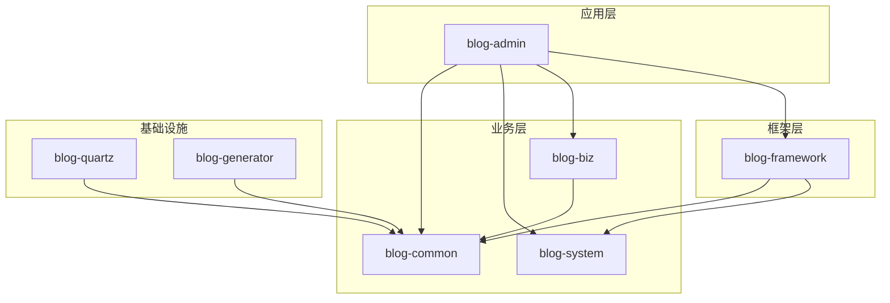
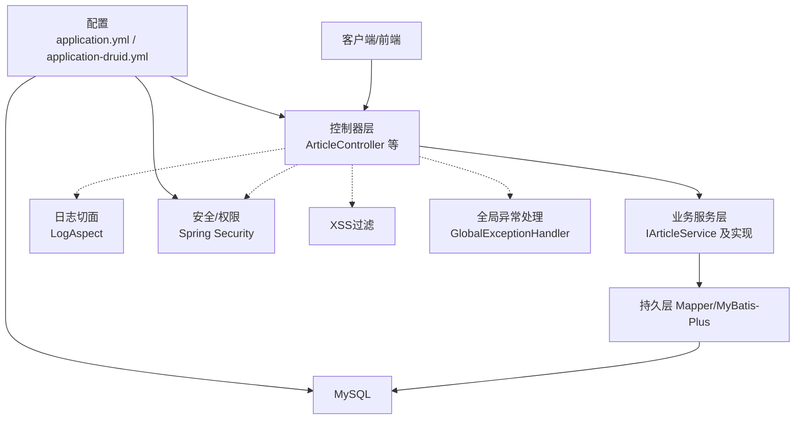
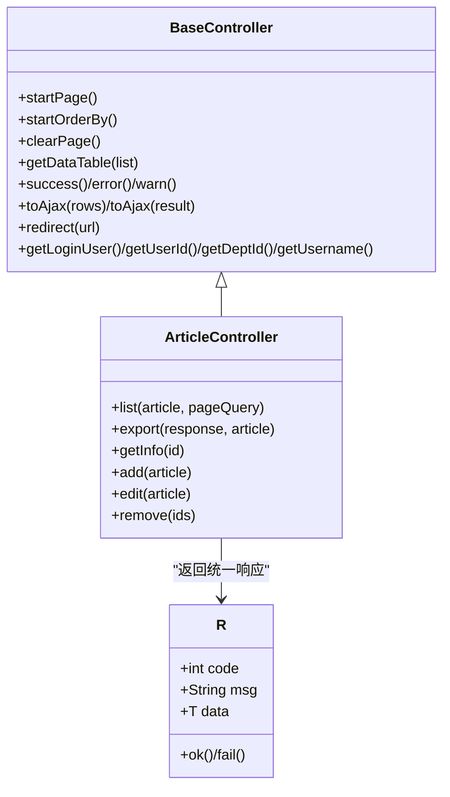
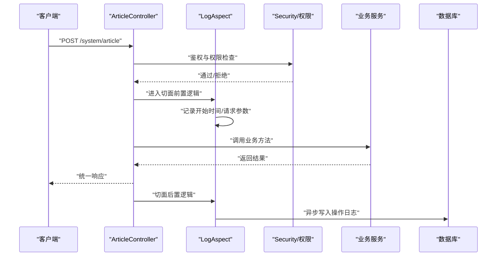
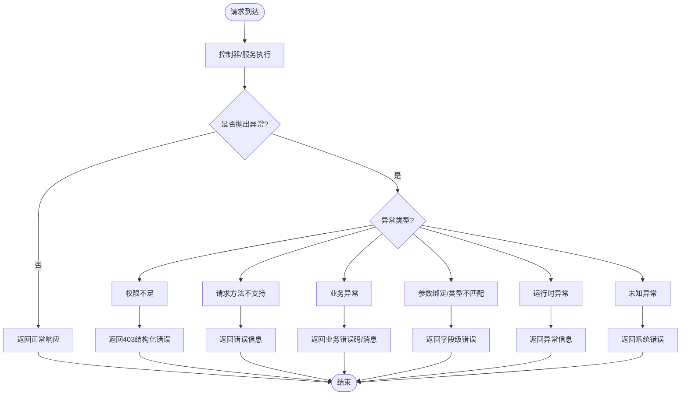
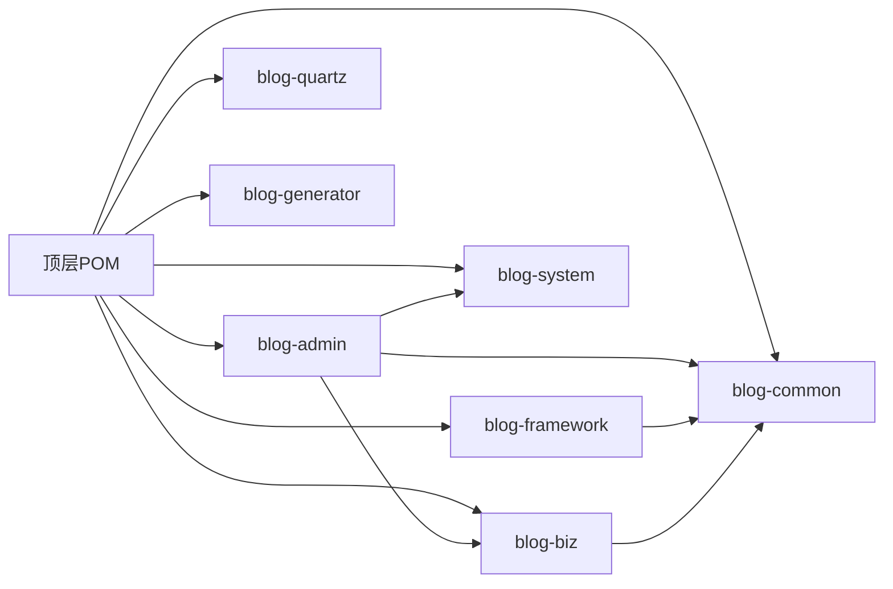

# 开发指南

<cite>
**本文引用的文件**
- [application.yml](file://blog-admin/src/main/resources/application.yml)
- [application-druid.yml](file://blog-admin/src/main/resources/application-druid.yml)
- [logback.xml](file://blog-admin/src/main/resources/logback.xml)
- [BlogServerApplication.java](file://blog-admin/src/main/java/blog/BlogServerApplication.java)
- [pom.xml](file://pom.xml)
- [BaseController.java](file://blog-common/src/main/java/blog/common/base/controller/BaseController.java)
- [BaseEntity.java](file://blog-common/src/main/java/blog/common/base/entity/BaseEntity.java)
- [R.java](file://blog-common/src/main/java/blog/common/base/resp/R.java)
- [Log.java](file://blog-common/src/main/java/blog/common/annotation/Log.java)
- [LogAspect.java](file://blog-framework/src/main/java/blog/framework/aspectj/LogAspect.java)
- [GlobalExceptionHandler.java](file://blog-framework/src/main/java/blog/framework/web/exception/GlobalExceptionHandler.java)
- [GlobalException.java](file://blog-common/src/main/java/blog/common/exception/GlobalException.java)
- [ArticleController.java](file://blog-admin/src/main/java/blog/web/controller/business/ArticleController.java)
</cite>

## 目录
1. [简介](#简介)
2. [项目结构](#项目结构)
3. [核心组件](#核心组件)
4. [架构总览](#架构总览)
5. [详细组件分析](#详细组件分析)
6. [依赖分析](#依赖分析)
7. [性能考虑](#性能考虑)
8. [故障排查指南](#故障排查指南)
9. [结论](#结论)
10. [附录](#附录)

## 简介
本开发指南面向Leejie博客系统的后端团队，覆盖开发环境搭建、IDE配置、Maven构建、热部署、代码规范与最佳实践、开发流程（分支管理、代码审查、单元测试与集成测试）、扩展开发方法（新增模块、功能扩展、第三方集成）、调试技巧与问题排查、配置管理策略以及开发工具推荐与常见问题解决方案。内容以仓库现有实现为依据，确保可落地、可复用。

## 项目结构
系统采用多模块聚合工程，核心模块包括：
- blog-admin：应用入口与Web控制器层
- blog-framework：框架层（安全、切面、异步、拦截器、配置等）
- blog-system：系统管理相关领域（用户、角色、菜单、配置等）
- blog-biz：业务域（文章、分类、文件等）
- blog-common：通用工具、基础实体、响应封装、异常体系、注解等
- blog-quartz：定时任务
- blog-generator：代码生成

图表来源
- [pom.xml:225-233](file://pom.xml#L225-L233)

章节来源
- [pom.xml:225-233](file://pom.xml#L225-L233)

## 核心组件
- 应用入口与启动
  - 启动类位于应用模块，排除默认数据源自动装配，便于集中配置。
  - 端口、上下文路径、Tomcat线程池、国际化、Swagger、MyBatis-Plus、分页、MinIO、Redis、XSS、防盗链等均通过配置文件集中管理。
- 控制器基类与统一响应
  - 控制器基类提供分页、排序、重定向、登录用户信息获取等通用能力，并封装统一响应结构。
- 统一日志注解与切面
  - 注解用于标记操作日志，切面负责收集请求/响应、IP、耗时、异常等信息并异步落库。
- 全局异常处理
  - 统一捕获各类异常，输出结构化错误信息，保障接口稳定性与可观测性。
- 配置与日志
  - YAML配置集中管理各子系统参数；Logback按级别与策略滚动输出。

章节来源
- [BlogServerApplication.java:12-18](file://blog-admin/src/main/java/blog/BlogServerApplication.java#L12-L18)
- [application.yml:12-161](file://blog-admin/src/main/resources/application.yml#L12-L161)
- [application-druid.yml:1-61](file://blog-admin/src/main/resources/application-druid.yml#L1-L61)
- [logback.xml:1-93](file://blog-admin/src/main/resources/logback.xml#L1-L93)
- [BaseController.java:30-182](file://blog-common/src/main/java/blog/common/base/controller/BaseController.java#L30-L182)
- [R.java:12-107](file://blog-common/src/main/java/blog/common/base/resp/R.java#L12-L107)
- [Log.java:17-51](file://blog-common/src/main/java/blog/common/annotation/Log.java#L17-L51)
- [LogAspect.java:42-231](file://blog-framework/src/main/java/blog/framework/aspectj/LogAspect.java#L42-L231)
- [GlobalExceptionHandler.java:27-134](file://blog-framework/src/main/java/blog/framework/web/exception/GlobalExceptionHandler.java#L27-L134)

## 架构总览
系统采用“控制器-服务-持久层”分层，结合AOP切面与全局异常处理，形成清晰的横切关注点（日志、权限、限流、XSS防护等）。配置集中在application.yml与profile配置文件中，便于环境隔离与外部化配置。

图表来源
- [ArticleController.java:36-101](file://blog-admin/src/main/java/blog/web/controller/business/ArticleController.java#L36-L101)
- [LogAspect.java:42-134](file://blog-framework/src/main/java/blog/framework/aspectj/LogAspect.java#L42-L134)
- [GlobalExceptionHandler.java:27-134](file://blog-framework/src/main/java/blog/framework/web/exception/GlobalExceptionHandler.java#L27-L134)
- [application.yml:12-161](file://blog-admin/src/main/resources/application.yml#L12-L161)
- [application-druid.yml:1-61](file://blog-admin/src/main/resources/application-druid.yml#L1-L61)

## 详细组件分析

### 控制器层与统一响应
- 控制器基类提供分页、排序、登录用户信息、重定向、统一结果封装等能力。
- 统一响应体封装了状态码、消息与数据，便于前端消费与一致性处理。
- 控制器示例展示了权限注解、日志注解、导出Excel、分页查询等典型用法。

图表来源
- [BaseController.java:30-182](file://blog-common/src/main/java/blog/common/base/controller/BaseController.java#L30-L182)
- [R.java:12-107](file://blog-common/src/main/java/blog/common/base/resp/R.java#L12-L107)
- [ArticleController.java:36-101](file://blog-admin/src/main/java/blog/web/controller/business/ArticleController.java#L36-L101)

章节来源
- [BaseController.java:30-182](file://blog-common/src/main/java/blog/common/base/controller/BaseController.java#L30-L182)
- [R.java:12-107](file://blog-common/src/main/java/blog/common/base/resp/R.java#L12-L107)
- [ArticleController.java:36-101](file://blog-admin/src/main/java/blog/web/controller/business/ArticleController.java#L36-L101)

### 日志注解与切面
- 注解用于在方法上声明模块、业务类型、是否保存请求/响应参数等。
- 切面在方法前后织入，收集请求参数、响应结果、IP、URL、耗时、异常等，异步写入操作日志表。

图表来源
- [Log.java:17-51](file://blog-common/src/main/java/blog/common/annotation/Log.java#L17-L51)
- [LogAspect.java:42-134](file://blog-framework/src/main/java/blog/framework/aspectj/LogAspect.java#L42-L134)
- [ArticleController.java:36-101](file://blog-admin/src/main/java/blog/web/controller/business/ArticleController.java#L36-L101)

章节来源
- [Log.java:17-51](file://blog-common/src/main/java/blog/common/annotation/Log.java#L17-L51)
- [LogAspect.java:42-231](file://blog-framework/src/main/java/blog/framework/aspectj/LogAspect.java#L42-L231)

### 全局异常处理
- 集中处理权限不足、请求方法不支持、业务异常、参数绑定/类型不匹配、运行时异常、未知异常等。
- 输出结构化错误码与消息，便于前端展示与定位问题。

图表来源
- [GlobalExceptionHandler.java:27-134](file://blog-framework/src/main/java/blog/framework/web/exception/GlobalExceptionHandler.java#L27-L134)

章节来源
- [GlobalExceptionHandler.java:27-134](file://blog-framework/src/main/java/blog/framework/web/exception/GlobalExceptionHandler.java#L27-L134)

### 配置与日志
- 应用配置集中于application.yml，包含端口、Tomcat线程池、国际化、文件上传、devtools、Redis、MyBatis-Plus、分页、Swagger、XSS、防盗链、MinIO等。
- Druid配置独立于application-druid.yml，便于切换不同环境。
- Logback按级别与策略滚动输出，支持控制台与文件输出。

章节来源
- [application.yml:12-161](file://blog-admin/src/main/resources/application.yml#L12-L161)
- [application-druid.yml:1-61](file://blog-admin/src/main/resources/application-druid.yml#L1-L61)
- [logback.xml:1-93](file://blog-admin/src/main/resources/logback.xml#L1-L93)

## 依赖分析
- 版本与依赖管理：顶层POM集中管理Spring Boot版本与各子模块依赖，确保一致性。
- 模块间耦合：admin依赖common、biz、system、framework；framework依赖common；biz依赖common；quartz与generator作为独立模块被顶层聚合。
- 关键技术栈：Spring Boot 3、MyBatis-Plus、Druid、PageHelper、SpringDoc OpenAPI、MinIO、Lombok等。

图表来源
- [pom.xml:40-233](file://pom.xml#L40-L233)

章节来源
- [pom.xml:40-233](file://pom.xml#L40-L233)

## 性能考虑
- 线程池与连接池
  - Tomcat线程池参数可根据并发量调整，注意最大线程与最小空闲线程的平衡。
  - Druid连接池参数（初始连接、最大活跃、最小空闲、最大等待）需结合数据库性能与QPS评估。
- 分页与排序
  - 使用分页插件与安全的排序注入防护，避免全表扫描与SQL注入风险。
- 缓存与异步
  - Redis用于会话与缓存，结合异步任务处理非关键路径（如操作日志写入）。
- 日志与监控
  - 合理的日志级别与滚动策略，避免磁盘与IO压力；开启慢SQL统计有助于定位瓶颈。

## 故障排查指南
- 启动与热部署
  - 启动类已禁用devtools热重启，若需启用可在配置或VM参数中调整。
  - 若端口冲突或上下文路径异常，检查配置文件对应项。
- 数据库连接
  - Druid控制台默认开启，账号密码在配置文件中；确认master/slave配置与连通性。
- 权限与安全
  - 权限不足通常由注解或拦截器触发，查看全局异常处理返回的错误码与消息。
- 日志定位
  - 控制台与文件日志分别输出INFO/ERROR级别；操作日志由切面异步入库，可通过数据库核对。
- 文件与对象存储
  - MinIO配置需与实际服务一致，确认endpoint、access-key、secret-key与bucket-name。

章节来源
- [BlogServerApplication.java:12-18](file://blog-admin/src/main/java/blog/BlogServerApplication.java#L12-L18)
- [application.yml:12-161](file://blog-admin/src/main/resources/application.yml#L12-L161)
- [application-druid.yml:1-61](file://blog-admin/src/main/resources/application-druid.yml#L1-L61)
- [logback.xml:1-93](file://blog-admin/src/main/resources/logback.xml#L1-L93)
- [GlobalExceptionHandler.java:27-134](file://blog-framework/src/main/java/blog/framework/web/exception/GlobalExceptionHandler.java#L27-L134)
- [LogAspect.java:42-134](file://blog-framework/src/main/java/blog/framework/aspectj/LogAspect.java#L42-L134)

## 结论
本指南基于仓库现有实现，提供了从环境搭建到扩展开发、从编码规范到调试排错的完整路径。建议在开发过程中严格遵循统一响应、日志与异常处理规范，合理利用AOP与配置中心，持续优化性能与可观测性。

## 附录

### 开发环境搭建与IDE配置
- JDK与Maven
  - Java版本：17；Maven编译插件版本已在顶层POM中固定。
- IDE建议
  - IntelliJ IDEA：启用Lombok插件；配置Maven导入与自动构建；设置代码风格与检查规则。
- 热部署
  - devtools热部署默认关闭；如需启用，可在配置中开启并调整策略。

章节来源
- [pom.xml:14-38](file://pom.xml#L14-L38)
- [BlogServerApplication.java:12-18](file://blog-admin/src/main/java/blog/BlogServerApplication.java#L12-L18)
- [application.yml:60-63](file://blog-admin/src/main/resources/application.yml#L60-L63)

### Maven构建与打包
- 模块聚合：顶层POM声明所有子模块，使用spring-boot-maven-plugin进行打包。
- 依赖版本：通过dependencyManagement统一管理，避免版本漂移。

章节来源
- [pom.xml:225-255](file://pom.xml#L225-L255)

### 代码规范与最佳实践
- 命名约定
  - 包名使用小写与点分隔；类名采用帕斯卡命名；常量全大写；变量与方法采用驼峰。
- 注释规范
  - 类与方法添加必要注释；日志注解用于记录操作模块、业务类型与参数保存策略。
- 异常处理
  - 使用统一异常处理器输出结构化错误；业务异常使用业务码与消息分离。
- 日志记录
  - 控制台与文件分级输出；操作日志切面异步入库，避免阻塞主流程。

章节来源
- [Log.java:17-51](file://blog-common/src/main/java/blog/common/annotation/Log.java#L17-L51)
- [LogAspect.java:42-134](file://blog-framework/src/main/java/blog/framework/aspectj/LogAspect.java#L42-L134)
- [GlobalExceptionHandler.java:27-134](file://blog-framework/src/main/java/blog/framework/web/exception/GlobalExceptionHandler.java#L27-L134)

### 开发流程规范
- 分支管理
  - 建议采用Git Flow：develop、release、hotfix与feature分支策略。
- 代码审查
  - PR前自检：编译通过、单元测试通过、日志与异常处理符合规范。
- 测试
  - 单元测试覆盖核心业务；集成测试覆盖关键流程（登录、权限、CRUD、导出）。
- 提交流程
  - 提交信息清晰描述变更内容与影响范围；关联Issue或需求编号。

### 扩展开发指南
- 新增模块
  - 在顶层POM中注册新模块；在模块内按领域划分包结构（controller/service/mapper/domain）。
- 功能扩展
  - 复用BaseController与统一响应；在需要的地方使用日志注解与切面。
- 第三方集成
  - 配置中心与外部化配置：将敏感与环境相关参数放入独立配置文件或环境变量。
  - 对象存储：参考MinIO配置，统一工具类封装上传/下载/删除。

章节来源
- [pom.xml:225-233](file://pom.xml#L225-L233)
- [application.yml:155-161](file://blog-admin/src/main/resources/application.yml#L155-L161)

### 调试技巧与问题排查
- 断点调试
  - 在控制器、服务与切面关键节点设置断点；观察请求参数、响应结果与异常堆栈。
- 日志分析
  - 查看控制台与滚动日志文件；结合操作日志表定位用户行为轨迹。
- 性能分析
  - 结合Druid慢SQL统计与线程池参数，定位热点接口与数据库瓶颈。

章节来源
- [logback.xml:1-93](file://blog-admin/src/main/resources/logback.xml#L1-L93)
- [LogAspect.java:42-134](file://blog-framework/src/main/java/blog/framework/aspectj/LogAspect.java#L42-L134)
- [application-druid.yml:52-61](file://blog-admin/src/main/resources/application-druid.yml#L52-L61)

### 配置管理策略
- 环境配置
  - 通过profiles切换不同环境配置；将数据库、Redis、MinIO等参数外置。
- 参数管理
  - 使用application.yml集中管理通用参数；使用application-druid.yml管理数据源。
- 外部化配置
  - 支持环境变量与命令行参数覆盖；生产环境建议使用配置中心。

章节来源
- [application.yml:44-161](file://blog-admin/src/main/resources/application.yml#L44-L161)
- [application-druid.yml:1-61](file://blog-admin/src/main/resources/application-druid.yml#L1-L61)

### 开发工具推荐与使用技巧
- IntelliJ IDEA
  - Lombok插件、Maven视图、Git集成、REST Client、日志工具窗口。
- Postman/Thunder Client
  - 统一管理接口集合，配合权限与鉴权头。
- Druid监控
  - 通过控制台查看SQL、连接池与慢查询。
- Swagger
  - 通过UI浏览接口文档与在线调试。

章节来源
- [application.yml:125-137](file://blog-admin/src/main/resources/application.yml#L125-L137)
- [application-druid.yml:42-61](file://blog-admin/src/main/resources/application-druid.yml#L42-L61)

### 常见问题与解决方案
- 热部署无效
  - 检查devtools配置与启动类禁用策略；必要时清理缓存并重启。
- 权限不足
  - 检查权限注解与用户角色/菜单配置；查看全局异常返回的错误码。
- 文件上传失败
  - 检查文件大小限制、MIME类型与MinIO配置。
- 操作日志未入库
  - 检查切面是否生效、异步任务是否执行、数据库连接是否正常。

章节来源
- [BlogServerApplication.java:12-18](file://blog-admin/src/main/java/blog/BlogServerApplication.java#L12-L18)
- [GlobalExceptionHandler.java:27-134](file://blog-framework/src/main/java/blog/framework/web/exception/GlobalExceptionHandler.java#L27-L134)
- [LogAspect.java:42-134](file://blog-framework/src/main/java/blog/framework/aspectj/LogAspect.java#L42-L134)
- [application.yml:52-58](file://blog-admin/src/main/resources/application.yml#L52-L58)
- [application.yml:155-161](file://blog-admin/src/main/resources/application.yml#L155-L161)