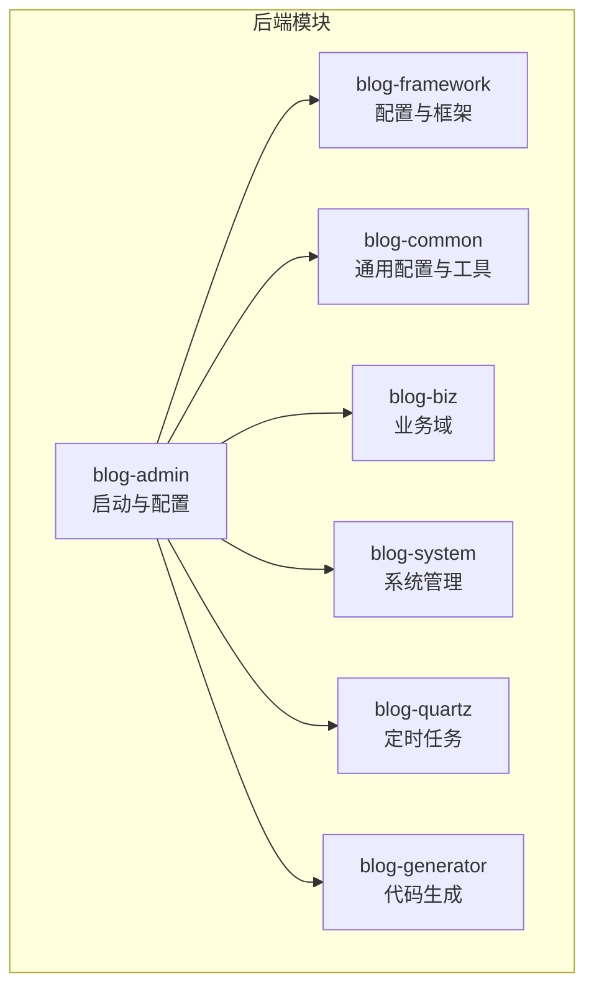
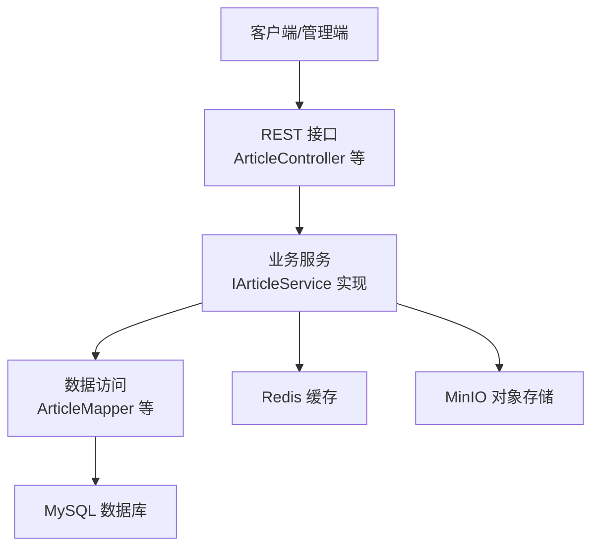
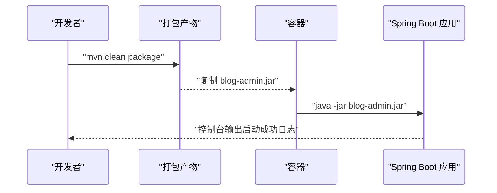
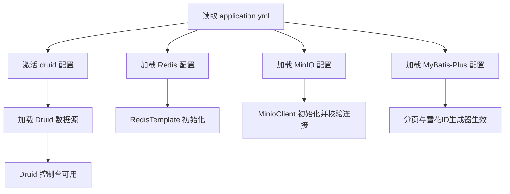
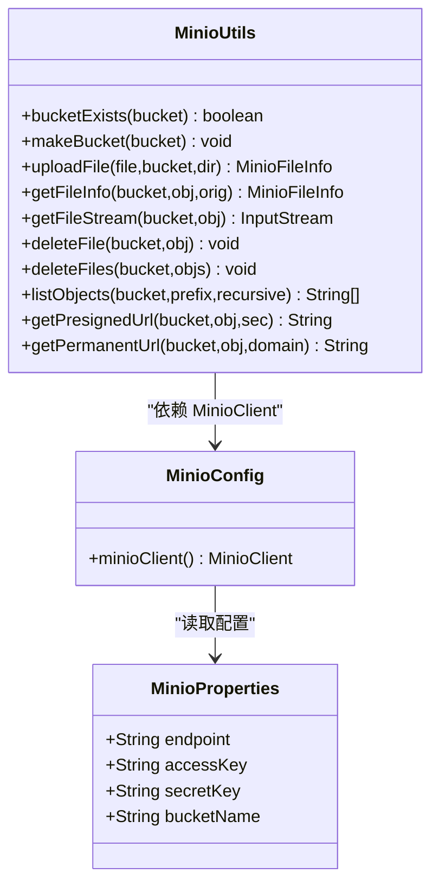
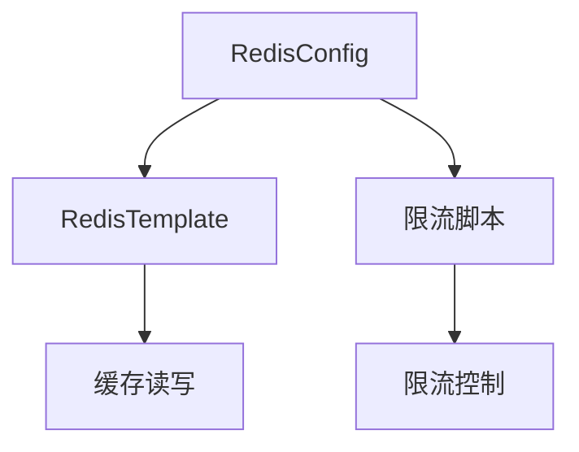
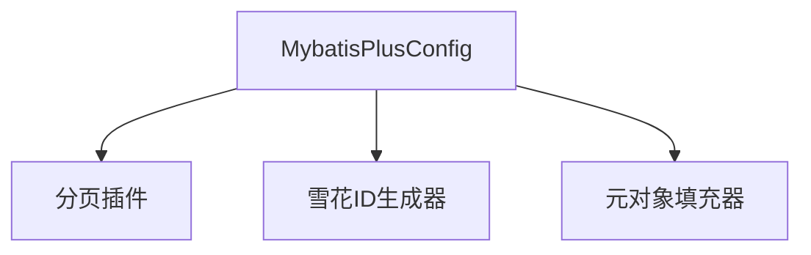
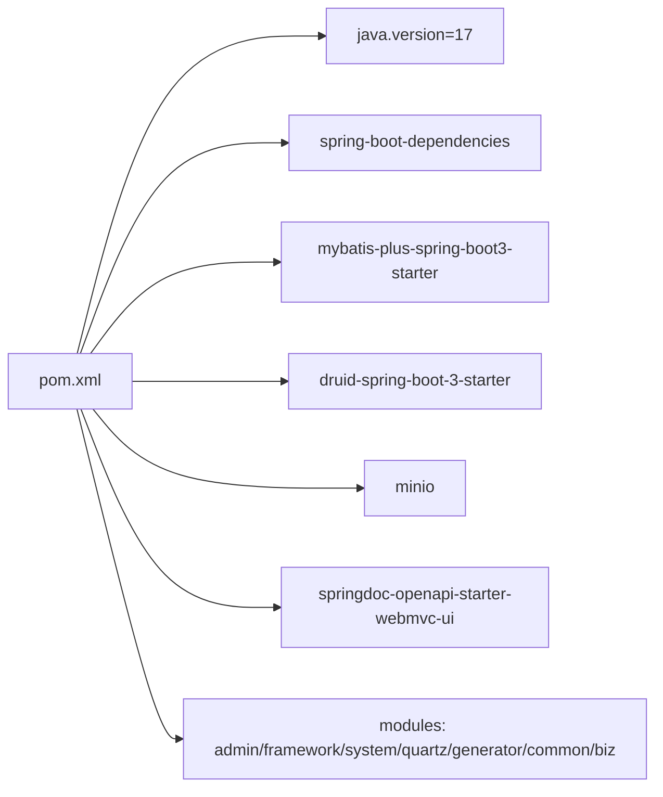

# 快速开始

<cite>
**本文引用的文件**
- [application.yml](file://blog-admin/src/main/resources/application.yml)
- [application-druid.yml](file://blog-admin/src/main/resources/application-druid.yml)
- [MinioConfig.java](file://blog-common/src/main/java/blog/common/config/minio/MinioConfig.java)
- [MinioProperties.java](file://blog-common/src/main/java/blog/common/config/minio/MinioProperties.java)
- [MinioUtils.java](file://blog-common/src/main/java/blog/common/utils/minio/MinioUtils.java)
- [RedisConfig.java](file://blog-framework/src/main/java/blog/framework/config/RedisConfig.java)
- [MybatisPlusConfig.java](file://blog-framework/src/main/java/blog/framework/config/MybatisPlusConfig.java)
- [BlogServerApplication.java](file://blog-admin/src/main/java/blog/BlogServerApplication.java)
- [BlogServerServletInitializer.java](file://blog-admin/src/main/java/blog/BlogServerServletInitializer.java)
- [Dockerfile](file://blog-admin/Dockerfile)
- [pom.xml](file://pom.xml)
- [ry-vue-owner.sql](file://ry-vue-owner.sql)
- [ArticleController.java](file://blog-admin/src/main/java/blog/web/controller/business/ArticleController.java)
</cite>

## 目录
1. [简介](#简介)
2. [项目结构](#项目结构)
3. [核心组件](#核心组件)
4. [架构总览](#架构总览)
5. [详细组件分析](#详细组件分析)
6. [依赖分析](#依赖分析)
7. [性能考虑](#性能考虑)
8. [故障排查指南](#故障排查指南)
9. [结论](#结论)
10. [附录](#附录)

## 简介
本指南面向首次部署 Leejie 博客系统的用户，提供从环境准备、项目克隆、依赖安装、数据库初始化，到配置文件修改、Docker 与传统部署方式、启动与验证、以及常见问题排查的完整流程。系统基于 Spring Boot 3.x、MyBatis-Plus、Druid 数据源、Redis 缓存、MinIO 对象存储，并通过 Maven 多模块组织。

## 项目结构
系统采用多模块 Maven 结构，核心模块包括：
- blog-admin：Web 后端入口模块，包含启动类、资源配置与 Dockerfile
- blog-framework：框架层，包含 Redis、MyBatis-Plus、安全、拦截器等配置
- blog-common：通用工具与配置，如 MinIO 配置与工具类
- blog-biz：业务领域模型与 Mapper/Service
- blog-system：系统管理相关实体与 Mapper/Service
- blog-quartz：定时任务模块
- blog-generator：代码生成模块
- ry-vue-owner.sql：数据库初始化 SQL

**图表来源**
- [pom.xml:225-233](file://pom.xml#L225-L233)

**章节来源**
- [pom.xml:225-233](file://pom.xml#L225-L233)

## 核心组件
- 启动入口：Spring Boot 启动类负责加载配置并启动应用
- 配置中心：application.yml 与 application-druid.yml 提供运行参数
- 缓存：RedisConfig 定义缓存与限流脚本
- ORM：MyBatis-Plus 配置与分页、雪花 ID 生成器
- 对象存储：MinIO 配置与工具类封装常用操作
- 安全与权限：后续章节将结合控制器与框架配置说明

**章节来源**
- [BlogServerApplication.java:12-19](file://blog-admin/src/main/java/blog/BlogServerApplication.java#L12-L19)
- [application.yml:13-161](file://blog-admin/src/main/resources/application.yml#L13-L161)
- [application-druid.yml:1-61](file://blog-admin/src/main/resources/application-druid.yml#L1-L61)
- [RedisConfig.java:18-67](file://blog-framework/src/main/java/blog/framework/config/RedisConfig.java#L18-L67)
- [MybatisPlusConfig.java:16-56](file://blog-framework/src/main/java/blog/framework/config/MybatisPlusConfig.java#L16-L56)
- [MinioConfig.java:12-34](file://blog-common/src/main/java/blog/common/config/minio/MinioConfig.java#L12-L34)
- [MinioProperties.java:11-22](file://blog-common/src/main/java/blog/common/config/minio/MinioProperties.java#L11-L22)
- [MinioUtils.java:25-325](file://blog-common/src/main/java/blog/common/utils/minio/MinioUtils.java#L25-L325)

## 架构总览
系统采用“多模块 + 配置分离”的架构，启动类加载配置文件，框架层注入 Redis、MyBatis-Plus、安全等能力，业务通过控制器暴露 REST 接口。

**图表来源**
- [ArticleController.java:36-102](file://blog-admin/src/main/java/blog/web/controller/business/ArticleController.java#L36-L102)
- [MybatisPlusConfig.java:16-56](file://blog-framework/src/main/java/blog/framework/config/MybatisPlusConfig.java#L16-L56)
- [RedisConfig.java:18-67](file://blog-framework/src/main/java/blog/framework/config/RedisConfig.java#L18-L67)
- [MinioConfig.java:12-34](file://blog-common/src/main/java/blog/common/config/minio/MinioConfig.java#L12-L34)

## 详细组件分析

### 启动与部署
- 启动类排除了自动数据源配置，由 Druid Starter 提供数据源
- 支持以 WAR 方式部署于外部 Servlet 容器
- Dockerfile 指定 JDK 17 基础镜像、暴露端口并运行 JAR

**图表来源**
- [BlogServerApplication.java:12-19](file://blog-admin/src/main/java/blog/BlogServerApplication.java#L12-L19)
- [BlogServerServletInitializer.java:11-16](file://blog-admin/src/main/java/blog/BlogServerServletInitializer.java#L11-L16)
- [Dockerfile:1-15](file://blog-admin/Dockerfile#L1-L15)

**章节来源**
- [BlogServerApplication.java:12-19](file://blog-admin/src/main/java/blog/BlogServerApplication.java#L12-L19)
- [BlogServerServletInitializer.java:11-16](file://blog-admin/src/main/java/blog/BlogServerServletInitializer.java#L11-L16)
- [Dockerfile:1-15](file://blog-admin/Dockerfile#L1-L15)

### 配置文件详解
- 服务器端口与上下文路径、Tomcat 线程池、国际化、文件上传大小、Swagger 文档路径等
- Redis 连接参数（主机、端口、数据库、密码、连接池）
- MyBatis-Plus 映射与逻辑删除字段
- MinIO 连接参数（endpoint、access-key、secret-key、bucket-name）
- Druid 数据源参数（master/slave、连接池、监控）

**图表来源**
- [application.yml:13-161](file://blog-admin/src/main/resources/application.yml#L13-L161)
- [application-druid.yml:1-61](file://blog-admin/src/main/resources/application-druid.yml#L1-L61)
- [MinioConfig.java:12-34](file://blog-common/src/main/java/blog/common/config/minio/MinioConfig.java#L12-L34)
- [RedisConfig.java:18-67](file://blog-framework/src/main/java/blog/framework/config/RedisConfig.java#L18-L67)
- [MybatisPlusConfig.java:16-56](file://blog-framework/src/main/java/blog/framework/config/MybatisPlusConfig.java#L16-L56)

**章节来源**
- [application.yml:13-161](file://blog-admin/src/main/resources/application.yml#L13-L161)
- [application-druid.yml:1-61](file://blog-admin/src/main/resources/application-druid.yml#L1-L61)
- [MinioProperties.java:11-22](file://blog-common/src/main/java/blog/common/config/minio/MinioProperties.java#L11-L22)
- [MinioConfig.java:12-34](file://blog-common/src/main/java/blog/common/config/minio/MinioConfig.java#L12-L34)
- [RedisConfig.java:18-67](file://blog-framework/src/main/java/blog/framework/config/RedisConfig.java#L18-L67)
- [MybatisPlusConfig.java:16-56](file://blog-framework/src/main/java/blog/framework/config/MybatisPlusConfig.java#L16-L56)

### MinIO 组件
- 配置类根据属性创建 MinioClient，并调用 listBuckets 验证连接
- 工具类封装桶创建、文件上传、信息查询、下载、删除、列表与预签名 URL 生成

**图表来源**
- [MinioProperties.java:11-22](file://blog-common/src/main/java/blog/common/config/minio/MinioProperties.java#L11-L22)
- [MinioConfig.java:12-34](file://blog-common/src/main/java/blog/common/config/minio/MinioConfig.java#L12-L34)
- [MinioUtils.java:25-325](file://blog-common/src/main/java/blog/common/utils/minio/MinioUtils.java#L25-L325)

**章节来源**
- [MinioProperties.java:11-22](file://blog-common/src/main/java/blog/common/config/minio/MinioProperties.java#L11-L22)
- [MinioConfig.java:12-34](file://blog-common/src/main/java/blog/common/config/minio/MinioConfig.java#L12-L34)
- [MinioUtils.java:25-325](file://blog-common/src/main/java/blog/common/utils/minio/MinioUtils.java#L25-L325)

### Redis 组件
- 配置启用缓存注解，定义 RedisTemplate 的序列化策略
- 提供基于 Lua 的限流脚本，便于分布式限流

**图表来源**
- [RedisConfig.java:18-67](file://blog-framework/src/main/java/blog/framework/config/RedisConfig.java#L18-L67)

**章节来源**
- [RedisConfig.java:18-67](file://blog-framework/src/main/java/blog/framework/config/RedisConfig.java#L18-L67)

### MyBatis-Plus 组件
- 注册分页插件与逻辑删除字段
- 使用网卡信息绑定雪花 ID 生成器，避免集群重复

**图表来源**
- [MybatisPlusConfig.java:16-56](file://blog-framework/src/main/java/blog/framework/config/MybatisPlusConfig.java#L16-L56)

**章节来源**
- [MybatisPlusConfig.java:16-56](file://blog-framework/src/main/java/blog/framework/config/MybatisPlusConfig.java#L16-L56)

## 依赖分析
- 版本与依赖管理：Java 17、Spring Boot 3.x、MyBatis-Plus、Druid、MinIO、Swagger 等
- 模块聚合：多模块构建，admin 作为入口模块
- 插件：编译插件与 Spring Boot Maven 插件

**图表来源**
- [pom.xml:14-38](file://pom.xml#L14-L38)
- [pom.xml:225-233](file://pom.xml#L225-L233)
- [pom.xml:236-255](file://pom.xml#L236-L255)

**章节来源**
- [pom.xml:14-38](file://pom.xml#L14-L38)
- [pom.xml:225-233](file://pom.xml#L225-L233)
- [pom.xml:236-255](file://pom.xml#L236-L255)

## 性能考虑
- Redis 连接池参数需结合并发与延迟要求调整
- MyBatis-Plus 分页插件开启溢出保护，避免大数据量误判
- MinIO 上传建议使用分片与断点续传（可在工具类扩展）
- Druid 监控可辅助定位慢 SQL 与连接池瓶颈

## 故障排查指南
- 启动失败（端口占用）：检查 server.port 与防火墙
- 数据库连接失败：核对 application-druid.yml 中 master.url、username、password
- Redis 连接失败：核对 host、port、database、password；确认 Redis 服务可达
- MinIO 连接失败：核对 endpoint、access-key、secret-key、bucket-name；使用 MinioConfig 的连接校验日志定位
- 文件上传失败：检查 blog.profile 指向的本地目录可写，或改为 MinIO 存储
- Swagger 访问：确认 springdoc.group-configs 与路径映射
- Docker 启动失败：确认 EXPOSE 端口与 CMD 参数一致，JAR 文件存在

**章节来源**
- [application.yml:13-161](file://blog-admin/src/main/resources/application.yml#L13-L161)
- [application-druid.yml:1-61](file://blog-admin/src/main/resources/application-druid.yml#L1-L61)
- [MinioConfig.java:12-34](file://blog-common/src/main/java/blog/common/config/minio/MinioConfig.java#L12-L34)
- [Dockerfile:1-15](file://blog-admin/Dockerfile#L1-L15)

## 结论
按照本指南完成环境准备、配置修改与数据库初始化后，即可通过传统方式或 Docker 快速启动系统。若遇到连接类问题，优先检查配置项与服务可达性；若涉及性能问题，可结合 Druid 监控与 Redis/MinIO 参数优化。

## 附录

### 环境准备清单
- JDK 17：用于编译与运行
- MySQL 8.2.0：用于业务数据存储
- Redis：用于缓存与会话
- MinIO：用于对象存储（图片、附件等）

### 项目克隆与依赖安装
- 克隆仓库后，使用 Maven 完成依赖安装与打包
- 打包命令示例：mvn clean package
- 产物位置：blog-admin/target 下的 JAR 文件

**章节来源**
- [pom.xml:236-255](file://pom.xml#L236-L255)

### 数据库初始化
- 使用 ry-vue-owner.sql 初始化数据库结构与数据
- 确认数据库字符集与时区设置符合 application-druid.yml 中的连接参数

**章节来源**
- [ry-vue-owner.sql:1-200](file://ry-vue-owner.sql#L1-L200)

### 配置文件修改指南
- 数据库连接：application-druid.yml 的 master.url、username、password
- Redis：application.yml 的 spring.redis.* 参数
- MinIO：application.yml 的 minio.* 参数
- 文件存储路径：blog.profile 指向本地目录或切换为 MinIO
- 端口与上下文：application.yml 的 server.port、context-path

**章节来源**
- [application-druid.yml:1-61](file://blog-admin/src/main/resources/application-druid.yml#L1-L61)
- [application.yml:13-161](file://blog-admin/src/main/resources/application.yml#L13-L161)

### Docker 部署
- 构建镜像：docker build -t blog-admin .
- 运行容器：docker run -d -p 9997:9997 --name blog-admin blog-admin
- 注意：Dockerfile 中 CMD 的 JAR 名称需与实际产物一致

**章节来源**
- [Dockerfile:1-15](file://blog-admin/Dockerfile#L1-L15)

### 传统部署
- 本地运行：java -jar blog-admin/target/blog-admin.jar
- WAR 部署：使用 BlogServerServletInitializer 配合外部容器

**章节来源**
- [BlogServerApplication.java:12-19](file://blog-admin/src/main/java/blog/BlogServerApplication.java#L12-L19)
- [BlogServerServletInitializer.java:11-16](file://blog-admin/src/main/java/blog/BlogServerServletInitializer.java#L11-L16)

### 启动与验证
- 启动后查看控制台输出“后台项目启动成功”
- 访问 Swagger UI：/swagger-ui.html
- 访问 API 文档：/v3/api-docs
- 登录接口：/system/login（示例，具体以实际控制器为准）

**章节来源**
- [BlogServerApplication.java:12-19](file://blog-admin/src/main/java/blog/BlogServerApplication.java#L12-L19)
- [application.yml:125-137](file://blog-admin/src/main/resources/application.yml#L125-L137)
- [ArticleController.java:36-102](file://blog-admin/src/main/java/blog/web/controller/business/ArticleController.java#L36-L102)