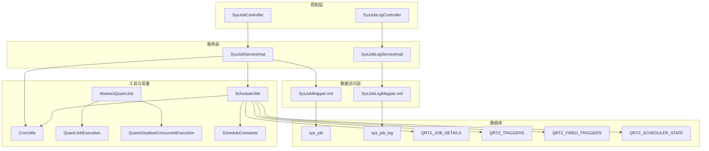
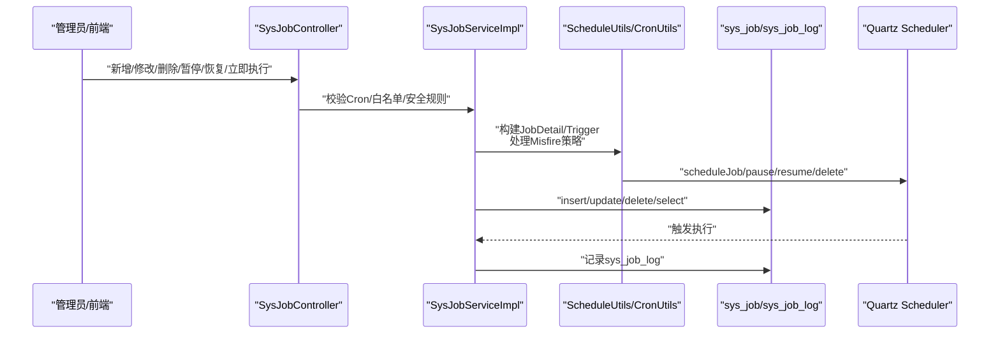
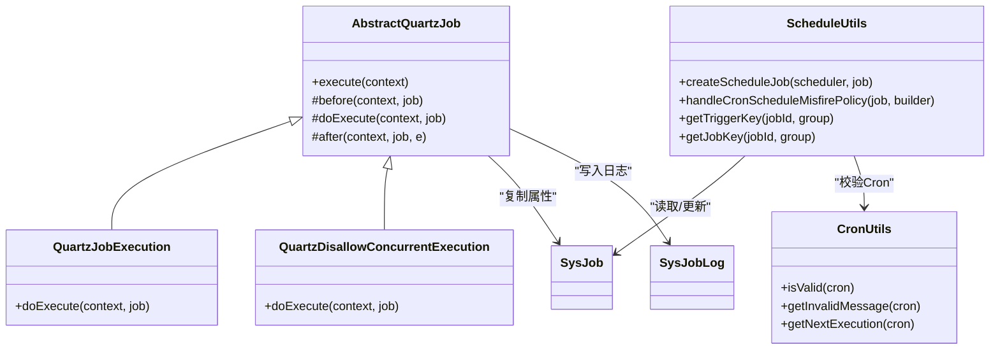
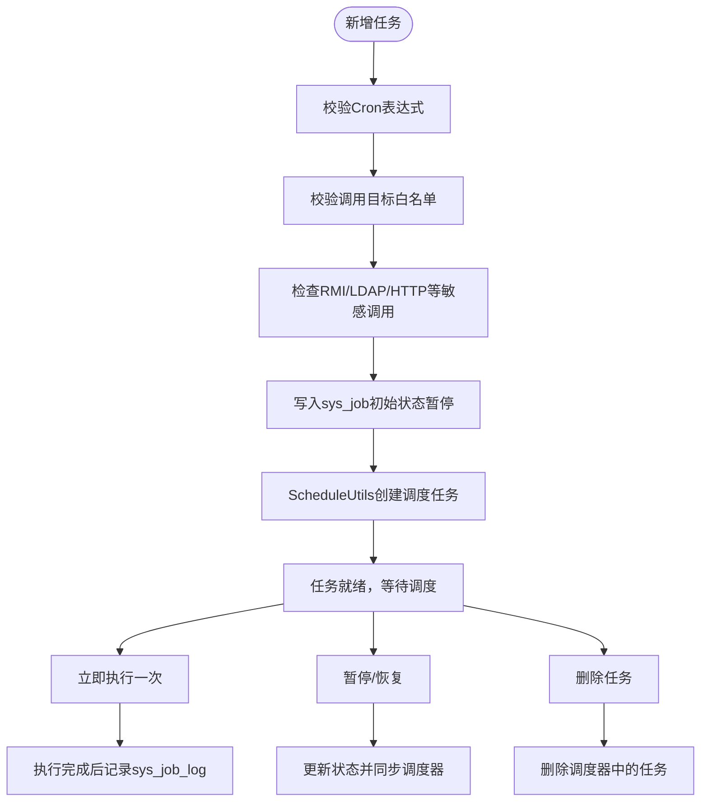
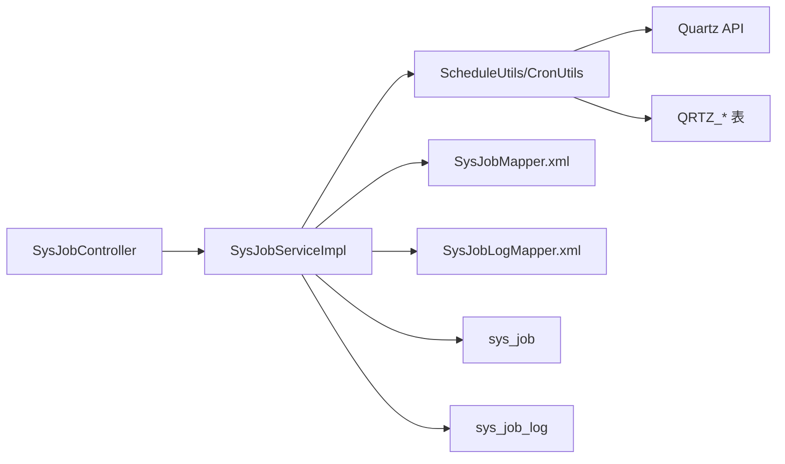

# 任务监控表设计

<cite>
**本文档引用的文件**
- [SysJob.java](file://blog-quartz/src/main/java/blog/quartz/domain/SysJob.java)
- [SysJobLog.java](file://blog-quartz/src/main/java/blog/quartz/domain/SysJobLog.java)
- [SysJobMapper.xml](file://blog-quartz/src/main/resources/mapper/quartz/SysJobMapper.xml)
- [SysJobLogMapper.xml](file://blog-quartz/src/main/resources/mapper/quartz/SysJobLogMapper.xml)
- [ry-vue-owner.sql](file://ry-vue-owner.sql)
- [CronUtils.java](file://blog-quartz/src/main/java/blog/quartz/util/CronUtils.java)
- [ScheduleUtils.java](file://blog-quartz/src/main/java/blog/quartz/util/ScheduleUtils.java)
- [AbstractQuartzJob.java](file://blog-quartz/src/main/java/blog/quartz/util/AbstractQuartzJob.java)
- [QuartzJobExecution.java](file://blog-quartz/src/main/java/blog/quartz/util/QuartzJobExecution.java)
- [QuartzDisallowConcurrentExecution.java](file://blog-quartz/src/main/java/blog/quartz/util/QuartzDisallowConcurrentExecution.java)
- [SysJobController.java](file://blog-quartz/src/main/java/blog/quartz/controller/SysJobController.java)
- [SysJobLogController.java](file://blog-quartz/src/main/java/blog/quartz/controller/SysJobLogController.java)
- [SysJobServiceImpl.java](file://blog-quartz/src/main/java/blog/quartz/service/impl/SysJobServiceImpl.java)
- [SysJobLogServiceImpl.java](file://blog-quartz/src/main/java/blog/quartz/service/impl/SysJobLogServiceImpl.java)
- [ScheduleConstants.java](file://blog-common/src/main/java/blog/common/constant/ScheduleConstants.java)
</cite>

## 目录
1. [简介](#简介)
2. [项目结构](#项目结构)
3. [核心组件](#核心组件)
4. [架构总览](#架构总览)
5. [详细组件分析](#详细组件分析)
6. [依赖关系分析](#依赖关系分析)
7. [性能考量](#性能考量)
8. [故障排查指南](#故障排查指南)
9. [结论](#结论)
10. [附录](#附录)

## 简介
本文件围绕定时任务系统与系统监控相关的数据库表结构进行深入设计解析，重点覆盖以下方面：
- 定时任务表（sys_job）：任务名称、任务组、Cron 表达式、执行策略、并发控制、状态管理等字段设计与约束。
- 任务日志表（sys_job_log）：任务执行状态、执行结果、异常信息、执行时间等监控数据的存储设计。
- Quartz 调度器相关表（QRTZ_*）：触发器表、作业详情表、调度状态表等调度器内部数据结构的设计与作用。
- 生命周期管理：从任务创建、调度、执行、日志记录到状态跟踪的完整数据库实现。
- 可视化：提供任务调度流程图、监控数据流向图，帮助开发者快速理解系统。

## 项目结构
定时任务与监控模块位于独立的 quartz 子模块中，采用典型的分层架构：
- 控制层：负责对外暴露 REST 接口，处理请求与鉴权。
- 服务层：封装业务逻辑，协调调度器与数据库。
- 数据访问层：基于 MyBatis 的 XML 映射，完成 CRUD 与查询。
- 工具与常量：提供 Cron 解析、调度工具、并发策略、调度常量等支撑能力。
- 数据库：包含业务表（sys_job、sys_job_log）与 Quartz 内部表（QRTZ_*）。

图表来源
- [SysJobController.java:35-186](file://blog-quartz/src/main/java/blog/quartz/controller/SysJobController.java#L35-L186)
- [SysJobLogController.java:27-93](file://blog-quartz/src/main/java/blog/quartz/controller/SysJobLogController.java#L27-L93)
- [SysJobServiceImpl.java:25-262](file://blog-quartz/src/main/java/blog/quartz/service/impl/SysJobServiceImpl.java#L25-L262)
- [SysJobLogServiceImpl.java:15-88](file://blog-quartz/src/main/java/blog/quartz/service/impl/SysJobLogServiceImpl.java#L15-L88)
- [ScheduleUtils.java:27-142](file://blog-quartz/src/main/java/blog/quartz/util/ScheduleUtils.java#L27-L142)
- [CronUtils.java:13-64](file://blog-quartz/src/main/java/blog/quartz/util/CronUtils.java#L13-L64)
- [AbstractQuartzJob.java:23-107](file://blog-quartz/src/main/java/blog/quartz/util/AbstractQuartzJob.java#L23-L107)
- [QuartzJobExecution.java:12-20](file://blog-quartz/src/main/java/blog/quartz/util/QuartzJobExecution.java#L12-L20)
- [QuartzDisallowConcurrentExecution.java:13-22](file://blog-quartz/src/main/java/blog/quartz/util/QuartzDisallowConcurrentExecution.java#L13-L22)
- [SysJobMapper.xml:5-111](file://blog-quartz/src/main/resources/mapper/quartz/SysJobMapper.xml#L5-L111)
- [SysJobLogMapper.xml:5-94](file://blog-quartz/src/main/resources/mapper/quartz/SysJobLogMapper.xml#L5-L94)
- [ry-vue-owner.sql:637-683](file://ry-vue-owner.sql#L637-L683)

章节来源
- [SysJobController.java:35-186](file://blog-quartz/src/main/java/blog/quartz/controller/SysJobController.java#L35-L186)
- [SysJobLogController.java:27-93](file://blog-quartz/src/main/java/blog/quartz/controller/SysJobLogController.java#L27-L93)
- [SysJobServiceImpl.java:25-262](file://blog-quartz/src/main/java/blog/quartz/service/impl/SysJobServiceImpl.java#L25-L262)
- [SysJobLogServiceImpl.java:15-88](file://blog-quartz/src/main/java/blog/quartz/service/impl/SysJobLogServiceImpl.java#L15-L88)

## 核心组件
本节聚焦于三个核心表及其对应实体与映射文件，说明字段含义、约束与典型用途。

- sys_job（定时任务表）
  - 字段要点：任务ID、任务名称、任务组、调用目标字符串、Cron 表达式、计划执行错误策略、并发控制、状态、创建/更新信息等。
  - 关键约束：任务组与任务名联合主键；状态枚举（正常/暂停）；并发控制（允许/禁止）。
  - 典型用途：存储定时任务元数据，驱动 Quartz 调度器创建与管理触发器。

- sys_job_log（任务日志表）
  - 字段要点：日志ID、任务名称、任务组、调用目标、日志信息、执行状态（成功/失败）、异常信息、创建时间。
  - 关键约束：按创建时间倒序查询；支持清理与批量删除。
  - 典型用途：记录每次任务执行的开始/结束时间、耗时、状态与异常，用于监控与审计。

- Quartz QRTZ_* 表族
  - QRTZ_JOB_DETAILS：作业详情（类名、是否持久化、并发策略、是否接收恢复执行等）。
  - QRTZ_TRIGGERS：触发器详情（所属作业、描述、下次/上次触发时间、优先级、状态、类型、起止时间、日历名、补偿策略等）。
  - QRTZ_FIRED_TRIGGERS：已触发的触发器（实例名、触发时间、调度时间、状态、是否并发、是否恢复执行等）。
  - QRTZ_SCHEDULER_STATE：调度器状态（实例名、上次检查时间、检查间隔）。
  - QRTZ_CRON_TRIGGERS：Cron 类型触发器（cron 表达式、时区）。
  - 其他：BLOB_TRIGGERS、SIMPLE_TRIGGERS、SIMPROP_TRIGGERS、CALENDARS、PAUSED_TRIGGER_GRPS、LOCKS 等。

章节来源
- [SysJob.java:21-172](file://blog-quartz/src/main/java/blog/quartz/domain/SysJob.java#L21-L172)
- [SysJobLog.java:14-156](file://blog-quartz/src/main/java/blog/quartz/domain/SysJobLog.java#L14-L156)
- [SysJobMapper.xml:7-26](file://blog-quartz/src/main/resources/mapper/quartz/SysJobMapper.xml#L7-L26)
- [SysJobLogMapper.xml:7-21](file://blog-quartz/src/main/resources/mapper/quartz/SysJobLogMapper.xml#L7-L21)
- [ry-vue-owner.sql:637-683](file://ry-vue-owner.sql#L637-L683)
- [ry-vue-owner.sql:21-231](file://ry-vue-owner.sql#L21-L231)

## 架构总览
定时任务系统通过控制层接收请求，服务层协调调度器与数据库，工具层提供 Cron 解析与调度构建，最终将任务元数据与执行日志分别写入业务表与 Quartz 内部表。

图表来源
- [SysJobController.java:83-147](file://blog-quartz/src/main/java/blog/quartz/controller/SysJobController.java#L83-L147)
- [SysJobServiceImpl.java:60-248](file://blog-quartz/src/main/java/blog/quartz/service/impl/SysJobServiceImpl.java#L60-L248)
- [ScheduleUtils.java:60-98](file://blog-quartz/src/main/java/blog/quartz/util/ScheduleUtils.java#L60-L98)
- [CronUtils.java:51-62](file://blog-quartz/src/main/java/blog/quartz/util/CronUtils.java#L51-L62)
- [SysJobMapper.xml:83-109](file://blog-quartz/src/main/resources/mapper/quartz/SysJobMapper.xml#L83-L109)
- [SysJobLogMapper.xml:72-92](file://blog-quartz/src/main/resources/mapper/quartz/SysJobLogMapper.xml#L72-L92)

## 详细组件分析

### 定时任务表（sys_job）设计
- 设计要点
  - 任务标识：job_id（自增主键），配合 job_name 与 job_group 组成联合主键，确保唯一性与分组能力。
  - 调用目标：invoke_target 存放可执行的目标字符串（如 Spring Bean 方法调用），受白名单与安全规则约束。
  - 执行计划：cron_expression 使用标准 Cron 表达式；misfire_policy 控制错过触发后的策略（默认/忽略/仅一次/不触发）。
  - 并发控制：concurrent（0 允许并发，1 禁止并发），对应 Quartz 的并发策略实现。
  - 状态管理：status（0 正常，1 暂停），与调度器状态保持一致。
  - 元数据：create_by/create_time/update_by/update_time/remark 等通用审计字段。

- 字段与约束
  - 非空与长度限制：任务名称、调用目标、Cron 表达式均有长度限制与非空校验。
  - 状态与分组字典：通过系统字典维护状态与分组枚举值，保证一致性。
  - 唯一性：联合主键避免同组同名任务重复。

- 典型查询与更新
  - 条件查询：支持按任务名模糊、任务组精确、状态过滤、调用目标关键字过滤。
  - 动态更新：按需更新各字段，并自动更新更新时间。

章节来源
- [SysJob.java:25-151](file://blog-quartz/src/main/java/blog/quartz/domain/SysJob.java#L25-L151)
- [SysJobMapper.xml:28-81](file://blog-quartz/src/main/resources/mapper/quartz/SysJobMapper.xml#L28-L81)
- [ry-vue-owner.sql:639-655](file://ry-vue-owner.sql#L639-L655)

### 任务日志表（sys_job_log）设计
- 设计要点
  - 记录维度：任务名称、任务组、调用目标、日志信息、执行状态（成功/失败）、异常信息、创建时间。
  - 时间统计：通过开始/结束时间计算执行耗时，便于性能分析。
  - 查询与清理：支持按任务名、任务组、状态、调用目标、时间区间过滤；支持清空日志表。

- 数据流向
  - 任务执行完成后，AbstractQuartzJob 在 after 钩子中构造 SysJobLog 对象，写入数据库。
  - 控制层提供导出与批量删除接口，便于运维与审计。

- 异常处理
  - 将异常信息截断至最大长度，避免超长异常文本导致入库失败。

章节来源
- [SysJobLog.java:18-140](file://blog-quartz/src/main/java/blog/quartz/domain/SysJobLog.java#L18-L140)
- [SysJobLogMapper.xml:23-92](file://blog-quartz/src/main/resources/mapper/quartz/SysJobLogMapper.xml#L23-L92)
- [AbstractQuartzJob.java:75-96](file://blog-quartz/src/main/java/blog/quartz/util/AbstractQuartzJob.java#L75-L96)
- [SysJobLogController.java:36-91](file://blog-quartz/src/main/java/blog/quartz/controller/SysJobLogController.java#L36-L91)

### Quartz 调度器相关表（QRTZ_*）设计
- QRTZ_JOB_DETAILS
  - 存放作业类名、是否持久化、并发策略、是否更新数据、是否接收恢复执行等。
- QRTZ_TRIGGERS
  - 存放触发器与作业的关联、描述、下次/上次触发时间、优先级、状态、类型、起止时间、日历名、补偿策略等。
- QRTZ_FIRED_TRIGGERS
  - 记录已触发的触发器实例，包含触发时间、调度时间、状态、并发标记、恢复执行标记等。
- QRTZ_SCHEDULER_STATE
  - 记录调度器实例的健康状态（上次检查时间、检查间隔）。
- QRTZ_CRON_TRIGGERS
  - 存放 Cron 表达式与时区信息，与触发器表关联。
- 其他表
  - BLOB_TRIGGERS、SIMPLE_TRIGGERS、SIMPROP_TRIGGERS、CALENDARS、PAUSED_TRIGGER_GRPS、LOCKS 等，满足不同触发器类型与并发控制场景。

章节来源
- [ry-vue-owner.sql:21-231](file://ry-vue-owner.sql#L21-L231)

### 并发策略与调度工具
- 并发策略
  - 允许并发：QuartzJobExecution 直接继承抽象基类，执行时不做并发限制。
  - 禁止并发：QuartzDisallowConcurrentExecution 使用注解禁止并发，避免同一任务同时执行。
- 调度工具
  - ScheduleUtils：构建 JobDetail/Trigger，应用 Misfire 策略，创建/更新/删除调度任务，处理暂停/恢复。
  - CronUtils：验证 Cron 表达式有效性、计算下一次执行时间。
  - AbstractQuartzJob：统一 before/after 钩子，记录执行耗时与异常，写入日志表。

图表来源
- [AbstractQuartzJob.java:23-107](file://blog-quartz/src/main/java/blog/quartz/util/AbstractQuartzJob.java#L23-L107)
- [QuartzJobExecution.java:12-20](file://blog-quartz/src/main/java/blog/quartz/util/QuartzJobExecution.java#L12-L20)
- [QuartzDisallowConcurrentExecution.java:13-22](file://blog-quartz/src/main/java/blog/quartz/util/QuartzDisallowConcurrentExecution.java#L13-L22)
- [ScheduleUtils.java:27-142](file://blog-quartz/src/main/java/blog/quartz/util/ScheduleUtils.java#L27-L142)
- [CronUtils.java:13-64](file://blog-quartz/src/main/java/blog/quartz/util/CronUtils.java#L13-L64)
- [SysJob.java:21-172](file://blog-quartz/src/main/java/blog/quartz/domain/SysJob.java#L21-L172)
- [SysJobLog.java:14-156](file://blog-quartz/src/main/java/blog/quartz/domain/SysJobLog.java#L14-L156)

章节来源
- [ScheduleConstants.java:8-57](file://blog-common/src/main/java/blog/common/constant/ScheduleConstants.java#L8-L57)
- [ScheduleUtils.java:27-142](file://blog-quartz/src/main/java/blog/quartz/util/ScheduleUtils.java#L27-L142)
- [AbstractQuartzJob.java:23-107](file://blog-quartz/src/main/java/blog/quartz/util/AbstractQuartzJob.java#L23-L107)

### 控制层与服务层协作
- 控制层职责
  - 提供 REST 接口：列表、导出、查询、新增、修改、状态变更、立即执行、删除等。
  - 安全校验：Cron 表达式合法性、调用目标白名单、RMI/LDAP/HTTP 等敏感协议拦截。
- 服务层职责
  - 初始化：应用启动时清空并重建所有任务。
  - 生命周期：暂停/恢复/删除/更新/立即执行等操作，同步到调度器与数据库。
  - 与调度器交互：使用 ScheduleUtils 构建与更新任务，处理 Misfire 策略。

图表来源
- [SysJobController.java:83-172](file://blog-quartz/src/main/java/blog/quartz/controller/SysJobController.java#L83-L172)
- [SysJobServiceImpl.java:200-248](file://blog-quartz/src/main/java/blog/quartz/service/impl/SysJobServiceImpl.java#L200-L248)
- [ScheduleUtils.java:60-98](file://blog-quartz/src/main/java/blog/quartz/util/ScheduleUtils.java#L60-L98)
- [AbstractQuartzJob.java:75-96](file://blog-quartz/src/main/java/blog/quartz/util/AbstractQuartzJob.java#L75-L96)

章节来源
- [SysJobController.java:45-184](file://blog-quartz/src/main/java/blog/quartz/controller/SysJobController.java#L45-L184)
- [SysJobServiceImpl.java:37-248](file://blog-quartz/src/main/java/blog/quartz/service/impl/SysJobServiceImpl.java#L37-L248)

## 依赖关系分析
- 控制层依赖服务层；服务层依赖工具层与数据访问层；工具层依赖 Quartz API 与通用常量。
- 数据访问层通过 MyBatis 映射文件与数据库交互；业务表与 Quartz 内部表相互独立但共同构成完整的任务监控体系。
- 并发策略通过 Quartz 注解与工具类实现，避免业务代码重复。

图表来源
- [SysJobController.java:35-186](file://blog-quartz/src/main/java/blog/quartz/controller/SysJobController.java#L35-L186)
- [SysJobServiceImpl.java:25-262](file://blog-quartz/src/main/java/blog/quartz/service/impl/SysJobServiceImpl.java#L25-L262)
- [ScheduleUtils.java:27-142](file://blog-quartz/src/main/java/blog/quartz/util/ScheduleUtils.java#L27-L142)
- [CronUtils.java:13-64](file://blog-quartz/src/main/java/blog/quartz/util/CronUtils.java#L13-L64)
- [SysJobMapper.xml:5-111](file://blog-quartz/src/main/resources/mapper/quartz/SysJobMapper.xml#L5-L111)
- [SysJobLogMapper.xml:5-94](file://blog-quartz/src/main/resources/mapper/quartz/SysJobLogMapper.xml#L5-L94)
- [ry-vue-owner.sql:21-231](file://ry-vue-owner.sql#L21-L231)

章节来源
- [SysJobServiceImpl.java:25-262](file://blog-quartz/src/main/java/blog/quartz/service/impl/SysJobServiceImpl.java#L25-L262)
- [ScheduleUtils.java:27-142](file://blog-quartz/src/main/java/blog/quartz/util/ScheduleUtils.java#L27-L142)

## 性能考量
- Cron 表达式校验：在新增/修改时提前校验表达式有效性，避免无效任务占用调度资源。
- 并发控制：根据业务需要选择允许/禁止并发，避免重复执行带来的资源竞争与数据不一致。
- 日志清理：提供清空日志接口，定期清理历史日志，降低查询与存储压力。
- 查询优化：日志表按创建时间倒序查询，建议在 create_time 上建立索引（如已有）以提升排序与分页性能。
- 调度器健康：通过 QRTZ_SCHEDULER_STATE 监控调度器实例状态，及时发现异常。

## 故障排查指南
- Cron 表达式错误
  - 现象：任务无法创建或调度异常。
  - 处理：使用 CronUtils 校验表达式，查看无效消息；修正表达式后重新创建任务。
- 调用目标违规
  - 现象：新增/修改任务被拒绝。
  - 处理：检查调用目标是否包含 RMI/LDAP/HTTP 等敏感协议；确认是否在白名单内。
- 并发冲突
  - 现象：任务执行时间过长或重复执行。
  - 处理：调整并发策略（允许/禁止）；必要时拆分任务或优化执行逻辑。
- 调度器状态异常
  - 现象：任务长时间未触发或状态异常。
  - 处理：检查 QRTZ_SCHEDULER_STATE 与 QRTZ_TRIGGERS；确认调度器实例健康与下次触发时间。
- 日志异常
  - 现象：日志缺失或异常信息截断。
  - 处理：确认 AbstractQuartzJob 的异常捕获与截断逻辑；检查异常信息长度限制。

章节来源
- [SysJobController.java:85-108](file://blog-quartz/src/main/java/blog/quartz/controller/SysJobController.java#L85-L108)
- [SysJobController.java:121-144](file://blog-quartz/src/main/java/blog/quartz/controller/SysJobController.java#L121-L144)
- [ScheduleUtils.java:128-140](file://blog-quartz/src/main/java/blog/quartz/util/ScheduleUtils.java#L128-L140)
- [AbstractQuartzJob.java:83-96](file://blog-quartz/src/main/java/blog/quartz/util/AbstractQuartzJob.java#L83-L96)
- [ry-vue-owner.sql:146-159](file://ry-vue-owner.sql#L146-L159)

## 结论
本设计通过清晰的表结构、严格的校验与并发控制、完善的日志记录与调度器集成，实现了从任务创建到执行监控的全生命周期管理。业务表（sys_job、sys_job_log）与 Quartz 内部表（QRTZ_*）协同工作，既能满足灵活的调度需求，又能提供可靠的监控与审计能力。建议在生产环境中结合日志清理策略与调度器健康监控，持续优化任务执行效率与稳定性。

## 附录
- 常用接口与用途
  - 任务管理：列表、导出、查询、新增、修改、状态变更、立即执行、删除。
  - 日志管理：列表、导出、查询、删除、清空。
- 关键字段速览
  - sys_job：job_id、job_name、job_group、invoke_target、cron_expression、misfire_policy、concurrent、status。
  - sys_job_log：job_log_id、job_name、job_group、invoke_target、job_message、status、exception_info、create_time。
- Quartz 关键表速览
  - QRTZ_JOB_DETAILS、QRTZ_TRIGGERS、QRTZ_FIRED_TRIGGERS、QRTZ_SCHEDULER_STATE、QRTZ_CRON_TRIGGERS。