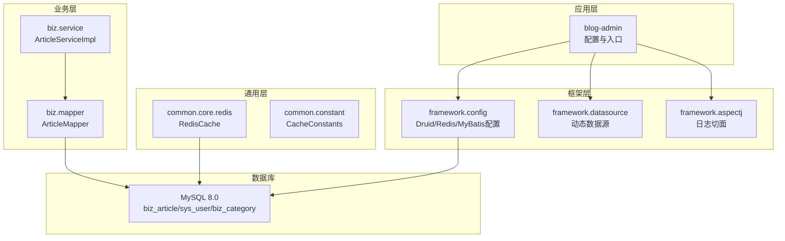
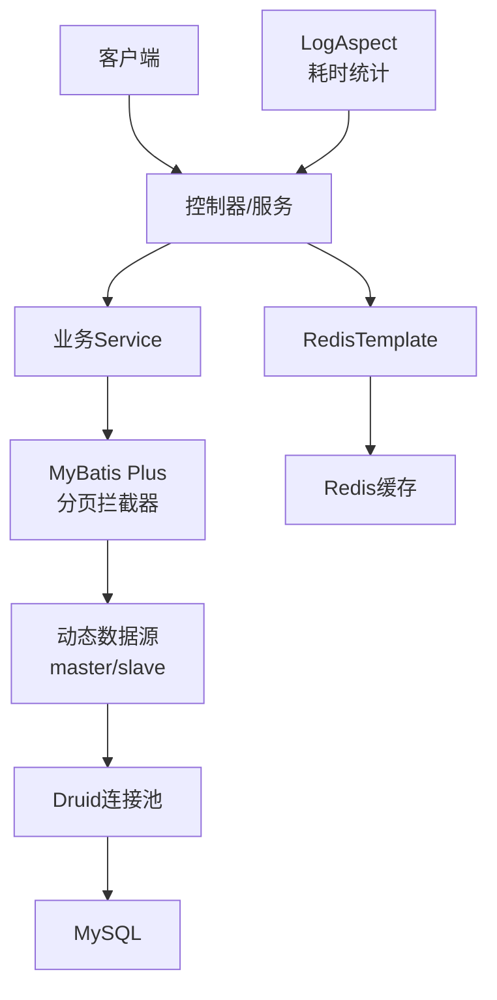
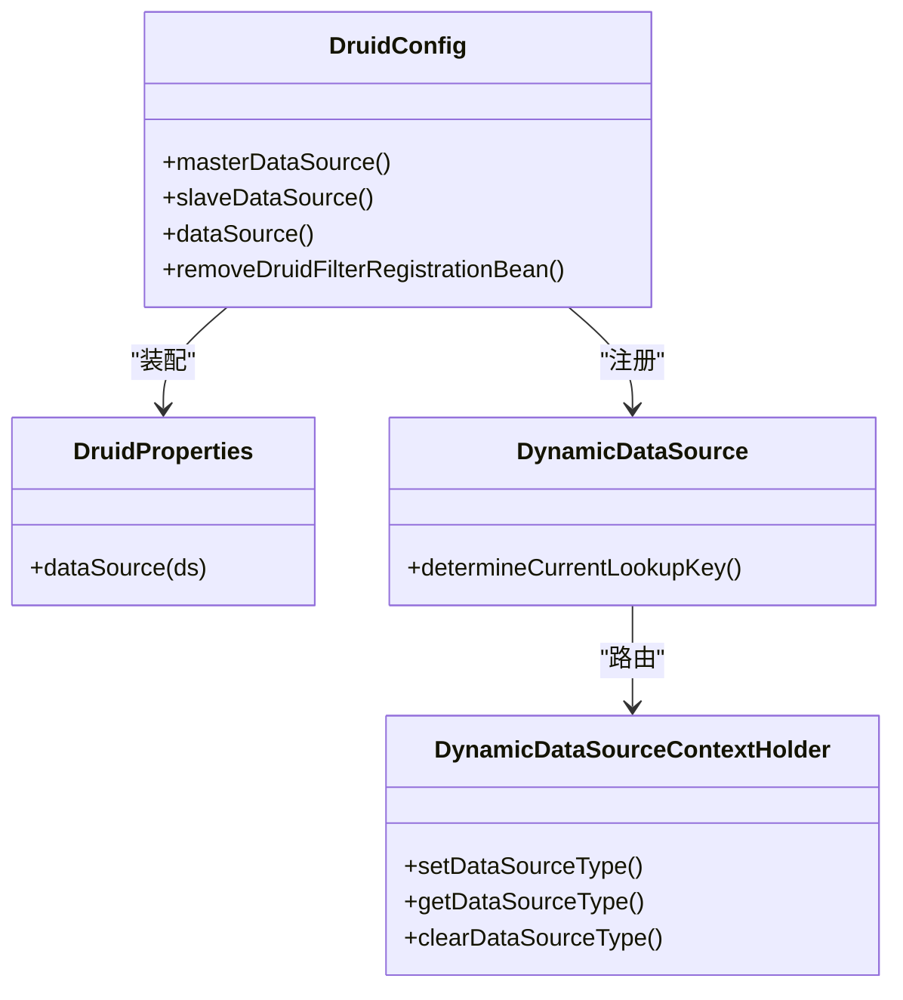
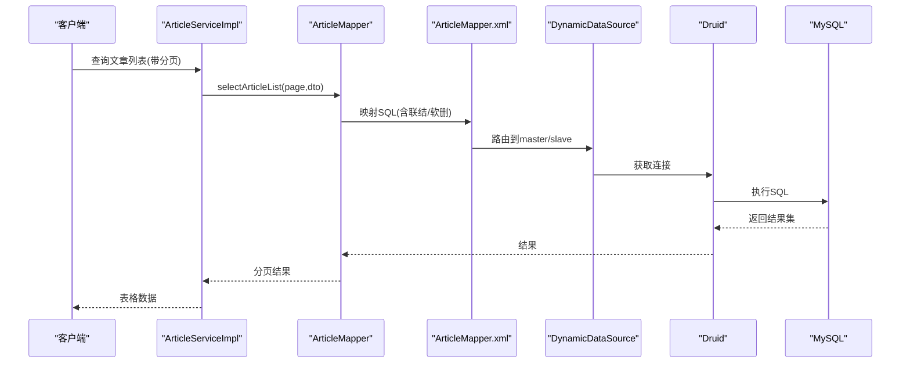
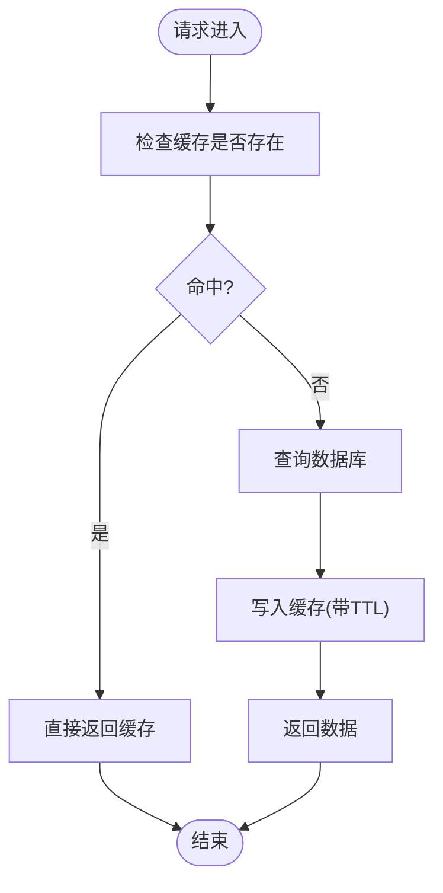
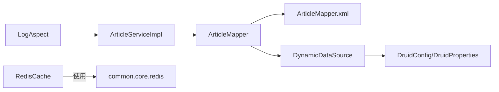

# 数据库性能优化

<cite>
**本文引用的文件**
- [application.yml](file://blog-admin/src/main/resources/application.yml)
- [application-druid.yml](file://blog-admin/src/main/resources/application-druid.yml)
- [DruidConfig.java](file://blog-framework/src/main/java/blog/framework/config/DruidConfig.java)
- [DruidProperties.java](file://blog-framework/src/main/java/blog/framework/config/properties/DruidProperties.java)
- [DynamicDataSource.java](file://blog-framework/src/main/java/blog/framework/datasource/DynamicDataSource.java)
- [DynamicDataSourceContextHolder.java](file://blog-framework/src/main/java/blog/framework/datasource/DynamicDataSourceContextHolder.java)
- [RedisConfig.java](file://blog-framework/src/main/java/blog/framework/config/RedisConfig.java)
- [RedisCache.java](file://blog-common/src/main/java/blog/common/core/redis/RedisCache.java)
- [CacheConstants.java](file://blog-common/src/main/java/blog/common/constant/CacheConstants.java)
- [MybatisPlusConfig.java](file://blog-framework/src/main/java/blog/framework/config/MybatisPlusConfig.java)
- [ArticleMapper.java](file://blog-biz/src/main/java/blog/biz/mapper/ArticleMapper.java)
- [ArticleMapper.xml](file://blog-biz/src/main/resources/mapper/ArticleMapper.xml)
- [ArticleServiceImpl.java](file://blog-biz/src/main/java/blog/biz/service/impl/ArticleServiceImpl.java)
- [LogAspect.java](file://blog-framework/src/main/java/blog/framework/aspectj/LogAspect.java)
- [ry-vue-owner.sql](file://ry-vue-owner.sql)
</cite>

## 目录
1. [简介](#简介)
2. [项目结构](#项目结构)
3. [核心组件](#核心组件)
4. [架构总览](#架构总览)
5. [详细组件分析](#详细组件分析)
6. [依赖分析](#依赖分析)
7. [性能考量](#性能考量)
8. [故障排查指南](#故障排查指南)
9. [结论](#结论)
10. [附录](#附录)

## 简介
本文件面向博客系统的数据库性能优化，结合现有代码与配置，系统性梳理索引优化、查询优化、连接池优化、缓存策略、监控指标与维护策略，形成可落地的优化指南。文档同时提供架构图、流程图与类图，帮助开发者快速定位问题并实施改进。

## 项目结构
博客系统采用多模块分层架构：admin负责对外接口与配置，framework封装框架能力（连接池、缓存、MyBatis Plus、动态数据源），biz承载业务模型与Mapper/Service，common提供通用工具与常量，system/quartz等模块支撑系统功能。

图表来源
- [application.yml:45-161](file://blog-admin/src/main/resources/application.yml#L45-L161)
- [application-druid.yml:1-61](file://blog-admin/src/main/resources/application-druid.yml#L1-L61)
- [DruidConfig.java:34-57](file://blog-framework/src/main/java/blog/framework/config/DruidConfig.java#L34-L57)
- [RedisConfig.java:18-39](file://blog-framework/src/main/java/blog/framework/config/RedisConfig.java#L18-L39)
- [MybatisPlusConfig.java:16-52](file://blog-framework/src/main/java/blog/framework/config/MybatisPlusConfig.java#L16-L52)
- [ArticleMapper.java:17-65](file://blog-biz/src/main/java/blog/biz/mapper/ArticleMapper.java#L17-L65)
- [ArticleServiceImpl.java:21-94](file://blog-biz/src/main/java/blog/biz/service/impl/ArticleServiceImpl.java#L21-L94)
- [RedisCache.java:24-247](file://blog-common/src/main/java/blog/common/core/redis/RedisCache.java#L24-L247)
- [ry-vue-owner.sql:1-200](file://ry-vue-owner.sql#L1-L200)

章节来源
- [application.yml:45-161](file://blog-admin/src/main/resources/application.yml#L45-L161)
- [application-druid.yml:1-61](file://blog-admin/src/main/resources/application-druid.yml#L1-L61)
- [DruidConfig.java:34-57](file://blog-framework/src/main/java/blog/framework/config/DruidConfig.java#L34-L57)
- [RedisConfig.java:18-39](file://blog-framework/src/main/java/blog/framework/config/RedisConfig.java#L18-L39)
- [MybatisPlusConfig.java:16-52](file://blog-framework/src/main/java/blog/framework/config/MybatisPlusConfig.java#L16-L52)
- [ArticleMapper.java:17-65](file://blog-biz/src/main/java/blog/biz/mapper/ArticleMapper.java#L17-L65)
- [ArticleServiceImpl.java:21-94](file://blog-biz/src/main/java/blog/biz/service/impl/ArticleServiceImpl.java#L21-L94)
- [RedisCache.java:24-247](file://blog-common/src/main/java/blog/common/core/redis/RedisCache.java#L24-L247)
- [ry-vue-owner.sql:1-200](file://ry-vue-owner.sql#L1-L200)

## 核心组件
- 连接池与数据源
  - Druid连接池通过配置文件与DruidConfig装配，支持主从分离、慢SQL记录、监控视图与白名单访问。
  - DruidProperties集中注入并应用连接池参数，确保连接池行为可控。
  - DynamicDataSource与DynamicDataSourceContextHolder实现动态数据源路由。
- ORM与分页
  - MyBatis Plus拦截器启用分页插件，溢出保护开启，避免越界分页。
  - PageHelper配置位于application.yml，支持MySQL方言与参数传递。
- 缓存
  - RedisConfig配置序列化策略与限流脚本；RedisCache提供统一的KV/Hash/List/Set操作与过期控制。
  - CacheConstants定义缓存键命名规范，便于治理与清理。
- 日志与监控
  - LogAspect记录接口耗时、请求参数与响应结果，便于定位慢查询与异常。
- 业务Mapper
  - ArticleMapper与ArticleMapper.xml定义文章查询条件与联表逻辑，包含软删过滤与联结策略。

章节来源
- [application-druid.yml:1-61](file://blog-admin/src/main/resources/application-druid.yml#L1-L61)
- [DruidConfig.java:34-57](file://blog-framework/src/main/java/blog/framework/config/DruidConfig.java#L34-L57)
- [DruidProperties.java:53-86](file://blog-framework/src/main/java/blog/framework/config/properties/DruidProperties.java#L53-L86)
- [DynamicDataSource.java:13-24](file://blog-framework/src/main/java/blog/framework/datasource/DynamicDataSource.java#L13-L24)
- [DynamicDataSourceContextHolder.java:11-41](file://blog-framework/src/main/java/blog/framework/datasource/DynamicDataSourceContextHolder.java#L11-L41)
- [MybatisPlusConfig.java:16-52](file://blog-framework/src/main/java/blog/framework/config/MybatisPlusConfig.java#L16-L52)
- [application.yml:108-124](file://blog-admin/src/main/resources/application.yml#L108-L124)
- [RedisConfig.java:18-66](file://blog-framework/src/main/java/blog/framework/config/RedisConfig.java#L18-L66)
- [RedisCache.java:24-247](file://blog-common/src/main/java/blog/common/core/redis/RedisCache.java#L24-L247)
- [CacheConstants.java:8-43](file://blog-common/src/main/java/blog/common/constant/CacheConstants.java#L8-L43)
- [LogAspect.java:44-134](file://blog-framework/src/main/java/blog/framework/aspectj/LogAspect.java#L44-L134)
- [ArticleMapper.java:17-65](file://blog-biz/src/main/java/blog/biz/mapper/ArticleMapper.java#L17-L65)
- [ArticleMapper.xml:55-124](file://blog-biz/src/main/resources/mapper/ArticleMapper.xml#L55-L124)

## 架构总览
下图展示应用与数据库交互的关键路径，包括ORM、连接池、缓存与监控。

图表来源
- [MybatisPlusConfig.java:16-52](file://blog-framework/src/main/java/blog/framework/config/MybatisPlusConfig.java#L16-L52)
- [DynamicDataSource.java:13-24](file://blog-framework/src/main/java/blog/framework/datasource/DynamicDataSource.java#L13-L24)
- [DruidConfig.java:34-57](file://blog-framework/src/main/java/blog/framework/config/DruidConfig.java#L34-L57)
- [RedisConfig.java:18-39](file://blog-framework/src/main/java/blog/framework/config/RedisConfig.java#L18-L39)
- [LogAspect.java:44-134](file://blog-framework/src/main/java/blog/framework/aspectj/LogAspect.java#L44-L134)

## 详细组件分析

### 连接池与数据源优化
- 参数调优要点
  - 连接数：initialSize/minIdle/maxActive需结合QPS与事务并发度评估；建议先按峰值QPS×P99延时估算。
  - 等待超时：maxWait应小于业务超时阈值，避免请求堆积；socketTimeout/connectTimeout需匹配网络与数据库负载。
  - 空闲回收：timeBetweenEvictionRunsMillis、minEvictableIdleTimeMillis、maxEvictableIdleTimeMillis平衡资源占用与抖动。
  - 校验：validationQuery与testWhileIdle开启，减少僵尸连接；testOnBorrow/testOnReturn谨慎使用以免降性能。
- 监控与运维
  - statViewServlet与stat过滤器开启，记录慢SQL与合并统计；wall过滤器允许多语句（谨慎）。
  - druid控制台白名单与登录凭据需严格管理。
- 动态数据源
  - 通过DynamicDataSourceContextHolder在线程上下文中切换数据源，配合注解或拦截器实现读写分离与流量整形。

图表来源
- [DruidConfig.java:34-115](file://blog-framework/src/main/java/blog/framework/config/DruidConfig.java#L34-L115)
- [DruidProperties.java:53-86](file://blog-framework/src/main/java/blog/framework/config/properties/DruidProperties.java#L53-L86)
- [DynamicDataSource.java:13-24](file://blog-framework/src/main/java/blog/framework/datasource/DynamicDataSource.java#L13-L24)
- [DynamicDataSourceContextHolder.java:11-41](file://blog-framework/src/main/java/blog/framework/datasource/DynamicDataSourceContextHolder.java#L11-L41)

章节来源
- [application-druid.yml:1-61](file://blog-admin/src/main/resources/application-druid.yml#L1-L61)
- [DruidConfig.java:34-115](file://blog-framework/src/main/java/blog/framework/config/DruidConfig.java#L34-L115)
- [DruidProperties.java:53-86](file://blog-framework/src/main/java/blog/framework/config/properties/DruidProperties.java#L53-L86)
- [DynamicDataSource.java:13-24](file://blog-framework/src/main/java/blog/framework/datasource/DynamicDataSource.java#L13-L24)
- [DynamicDataSourceContextHolder.java:11-41](file://blog-framework/src/main/java/blog/framework/datasource/DynamicDataSourceContextHolder.java#L11-L41)

### ORM与分页优化
- 分页策略
  - MyBatis Plus分页拦截器已启用，overflow=true避免越界；建议在高频查询场景显式传入合理页码范围。
  - PageHelper配置位于application.yml，确保方言与参数传递正确。
- SQL与联结
  - ArticleMapper.xml中对biz_article与sys_user、biz_category进行左联结，注意软删过滤与索引覆盖。
  - 建议为联结字段与过滤字段建立复合索引，减少回表与临时表。

图表来源
- [ArticleServiceImpl.java:43-47](file://blog-biz/src/main/java/blog/biz/service/impl/ArticleServiceImpl.java#L43-L47)
- [ArticleMapper.java:32-32](file://blog-biz/src/main/java/blog/biz/mapper/ArticleMapper.java#L32-L32)
- [ArticleMapper.xml:55-124](file://blog-biz/src/main/resources/mapper/ArticleMapper.xml#L55-L124)
- [DynamicDataSource.java:13-24](file://blog-framework/src/main/java/blog/framework/datasource/DynamicDataSource.java#L13-L24)
- [DruidConfig.java:34-57](file://blog-framework/src/main/java/blog/framework/config/DruidConfig.java#L34-L57)

章节来源
- [MybatisPlusConfig.java:16-52](file://blog-framework/src/main/java/blog/framework/config/MybatisPlusConfig.java#L16-L52)
- [application.yml:120-124](file://blog-admin/src/main/resources/application.yml#L120-L124)
- [ArticleMapper.java:32-32](file://blog-biz/src/main/java/blog/biz/mapper/ArticleMapper.java#L32-L32)
- [ArticleMapper.xml:55-124](file://blog-biz/src/main/resources/mapper/ArticleMapper.xml#L55-L124)

### 缓存策略设计
- Redis集成
  - RedisConfig配置了String与JSON序列化策略，支持限流脚本；RedisCache提供KV/Hash/List/Set统一操作与过期控制。
  - CacheConstants定义命名空间，便于缓存治理与批量清理。
- 命中率优化
  - 将热点查询结果（如文章详情、分类列表、字典项）缓存，设置合理TTL；对冷数据采用懒加载与预热。
  - 使用Hash存储对象字段，减少键数量与内存碎片。
- 失效策略
  - 写操作采用“先更新数据库，再删除缓存”策略，避免脏读；读操作缺失时再回源补写。
- 穿透防护
  - 对空结果设置短TTL；对非法参数进行校验与限流；必要时引入布隆过滤器（可在Redis中用位图模拟）。

图表来源
- [RedisConfig.java:18-66](file://blog-framework/src/main/java/blog/framework/config/RedisConfig.java#L18-L66)
- [RedisCache.java:24-247](file://blog-common/src/main/java/blog/common/core/redis/RedisCache.java#L24-L247)
- [CacheConstants.java:8-43](file://blog-common/src/main/java/blog/common/constant/CacheConstants.java#L8-L43)

章节来源
- [RedisConfig.java:18-66](file://blog-framework/src/main/java/blog/framework/config/RedisConfig.java#L18-L66)
- [RedisCache.java:24-247](file://blog-common/src/main/java/blog/common/core/redis/RedisCache.java#L24-L247)
- [CacheConstants.java:8-43](file://blog-common/src/main/java/blog/common/constant/CacheConstants.java#L8-L43)

### 查询优化与慢查询排查
- SQL层面
  - 使用ArticleMapper.xml的where条件与联结，确保过滤条件走索引；避免SELECT *，仅取必要列。
  - 软删字段is_delete加入过滤，避免误读历史数据。
- 执行计划
  - 在MySQL中使用EXPLAIN分析联结顺序、索引选择与是否使用临时表/排序。
- 慢查询定位
  - Druid慢SQL记录与控制台统计；LogAspect记录接口耗时，辅助定位慢接口与热点方法。
- 查询缓存
  - 对稳定查询结果使用Redis缓存；对频繁变更的数据采用短TTL或失效策略。

章节来源
- [ArticleMapper.xml:55-124](file://blog-biz/src/main/resources/mapper/ArticleMapper.xml#L55-L124)
- [application-druid.yml:52-58](file://blog-admin/src/main/resources/application-druid.yml#L52-L58)
- [LogAspect.java:44-134](file://blog-framework/src/main/java/blog/framework/aspectj/LogAspect.java#L44-L134)

### 索引设计原则与实践
- 设计原则
  - 主键索引：自增或雪花ID，保证唯一性与局部性。
  - 唯一索引：用户名、邮箱、唯一标识等去重字段。
  - 复合索引：将高选择性字段放前，覆盖常见过滤/联结/排序字段。
  - 前缀索引：对长文本字段（如URL）使用前缀索引，平衡存储与匹配。
- 实践建议
  - 为biz_article的user_id、category_id、status、is_delete建立复合索引，覆盖常见查询。
  - sys_user与biz_category的联结字段需建立索引，避免笛卡尔积与全表扫描。
  - 定期分析表与重建索引，保持统计信息准确。

章节来源
- [ry-vue-owner.sql:1-200](file://ry-vue-owner.sql#L1-L200)
- [ArticleMapper.xml:77-81](file://blog-biz/src/main/resources/mapper/ArticleMapper.xml#L77-L81)

## 依赖分析
- 组件耦合
  - Service依赖Mapper，Mapper依赖XML与数据源；RedisCache被通用模块广泛使用。
  - DruidConfig与DruidProperties强耦合，确保连接池参数一致生效。
- 外部依赖
  - MySQL驱动与版本兼容；Redis客户端；Druid监控与统计。
- 潜在风险
  - 动态数据源切换未显式标注读写分离注解，可能造成误用；建议在关键方法上增加注解或拦截器约束。

图表来源
- [ArticleServiceImpl.java:21-94](file://blog-biz/src/main/java/blog/biz/service/impl/ArticleServiceImpl.java#L21-L94)
- [ArticleMapper.java:17-65](file://blog-biz/src/main/java/blog/biz/mapper/ArticleMapper.java#L17-L65)
- [ArticleMapper.xml:55-124](file://blog-biz/src/main/resources/mapper/ArticleMapper.xml#L55-L124)
- [DynamicDataSource.java:13-24](file://blog-framework/src/main/java/blog/framework/datasource/DynamicDataSource.java#L13-L24)
- [DruidConfig.java:34-57](file://blog-framework/src/main/java/blog/framework/config/DruidConfig.java#L34-L57)
- [DruidProperties.java:53-86](file://blog-framework/src/main/java/blog/framework/config/properties/DruidProperties.java#L53-L86)
- [RedisCache.java:24-247](file://blog-common/src/main/java/blog/common/core/redis/RedisCache.java#L24-L247)
- [LogAspect.java:44-134](file://blog-framework/src/main/java/blog/framework/aspectj/LogAspect.java#L44-L134)

章节来源
- [ArticleServiceImpl.java:21-94](file://blog-biz/src/main/java/blog/biz/service/impl/ArticleServiceImpl.java#L21-L94)
- [ArticleMapper.java:17-65](file://blog-biz/src/main/java/blog/biz/mapper/ArticleMapper.java#L17-L65)
- [ArticleMapper.xml:55-124](file://blog-biz/src/main/resources/mapper/ArticleMapper.xml#L55-L124)
- [DynamicDataSource.java:13-24](file://blog-framework/src/main/java/blog/framework/datasource/DynamicDataSource.java#L13-L24)
- [DruidConfig.java:34-57](file://blog-framework/src/main/java/blog/framework/config/DruidConfig.java#L34-L57)
- [DruidProperties.java:53-86](file://blog-framework/src/main/java/blog/framework/config/properties/DruidProperties.java#L53-L86)
- [RedisCache.java:24-247](file://blog-common/src/main/java/blog/common/core/redis/RedisCache.java#L24-L247)
- [LogAspect.java:44-134](file://blog-framework/src/main/java/blog/framework/aspectj/LogAspect.java#L44-L134)

## 性能考量
- 连接池
  - 合理设置maxActive与maxWait，避免连接饥饿；开启validationQuery与testWhileIdle，降低无效连接比例。
  - 监控druid控制台，关注活跃连接数、等待队列长度、慢SQL数量。
- 缓存
  - 通过RedisCache统一管理TTL与序列化；对热点数据设置较长TTL，对变更频繁数据设置短TTL。
  - 使用Hash存储对象字段，减少键数量；对空结果设置短TTL防止穿透。
- 查询
  - 使用复合索引覆盖过滤/联结/排序；避免SELECT *与函数包裹导致索引失效。
  - 分页查询避免深度分页，必要时使用基于游标的翻页。
- 监控
  - 结合LogAspect记录的耗时与Druid慢SQL，定位热点接口与慢查询。
  - 关键指标：QPS、连接池活跃数、慢查询数、锁等待、缓冲池命中率、磁盘IO。

## 故障排查指南
- 连接池问题
  - 症状：请求堆积、超时增多；排查连接池参数与慢SQL，调整maxActive、maxWait与回收策略。
  - 参考：[application-druid.yml:19-61](file://blog-admin/src/main/resources/application-druid.yml#L19-L61)、[DruidProperties.java:53-86](file://blog-framework/src/main/java/blog/framework/config/properties/DruidProperties.java#L53-L86)
- 缓存问题
  - 症状：缓存击穿/穿透/雪崩；检查TTL设置与限流脚本，必要时引入布隆过滤器。
  - 参考：[RedisConfig.java:18-66](file://blog-framework/src/main/java/blog/framework/config/RedisConfig.java#L18-L66)、[RedisCache.java:24-247](file://blog-common/src/main/java/blog/common/core/redis/RedisCache.java#L24-L247)
- 查询问题
  - 症状：慢查询增多；使用EXPLAIN分析，优化索引与SQL结构。
  - 参考：[ArticleMapper.xml:55-124](file://blog-biz/src/main/resources/mapper/ArticleMapper.xml#L55-L124)
- 监控问题
  - 症状：无法定位慢接口；启用LogAspect耗时统计，结合druid控制台分析。
  - 参考：[LogAspect.java:44-134](file://blog-framework/src/main/java/blog/framework/aspectj/LogAspect.java#L44-L134)

章节来源
- [application-druid.yml:19-61](file://blog-admin/src/main/resources/application-druid.yml#L19-L61)
- [DruidProperties.java:53-86](file://blog-framework/src/main/java/blog/framework/config/properties/DruidProperties.java#L53-L86)
- [RedisConfig.java:18-66](file://blog-framework/src/main/java/blog/framework/config/RedisConfig.java#L18-L66)
- [RedisCache.java:24-247](file://blog-common/src/main/java/blog/common/core/redis/RedisCache.java#L24-L247)
- [ArticleMapper.xml:55-124](file://blog-biz/src/main/resources/mapper/ArticleMapper.xml#L55-L124)
- [LogAspect.java:44-134](file://blog-framework/src/main/java/blog/framework/aspectj/LogAspect.java#L44-L134)

## 结论
通过连接池参数调优、索引与SQL优化、缓存策略设计以及完善的监控与维护机制，博客系统可显著提升数据库性能与稳定性。建议在生产环境中持续观测关键指标，定期复盘慢查询与连接池瓶颈，迭代优化索引与缓存策略，确保系统在高并发场景下的可靠运行。

## 附录
- 数据库维护最佳实践
  - 定期分析表与更新统计信息，重建碎片化索引。
  - 清理历史数据与归档旧日志，控制表规模增长。
  - 制定备份策略与演练，确保数据安全与快速恢复。
- 关键配置参考
  - 连接池：[application-druid.yml:1-61](file://blog-admin/src/main/resources/application-druid.yml#L1-L61)
  - 缓存：[application.yml:65-88](file://blog-admin/src/main/resources/application.yml#L65-L88)、[RedisConfig.java:18-66](file://blog-framework/src/main/java/blog/framework/config/RedisConfig.java#L18-L66)
  - ORM分页：[MybatisPlusConfig.java:16-52](file://blog-framework/src/main/java/blog/framework/config/MybatisPlusConfig.java#L16-L52)、[application.yml:120-124](file://blog-admin/src/main/resources/application.yml#L120-L124)
  - 动态数据源：[DruidConfig.java:34-57](file://blog-framework/src/main/java/blog/framework/config/DruidConfig.java#L34-L57)、[DynamicDataSource.java:13-24](file://blog-framework/src/main/java/blog/framework/datasource/DynamicDataSource.java#L13-L24)