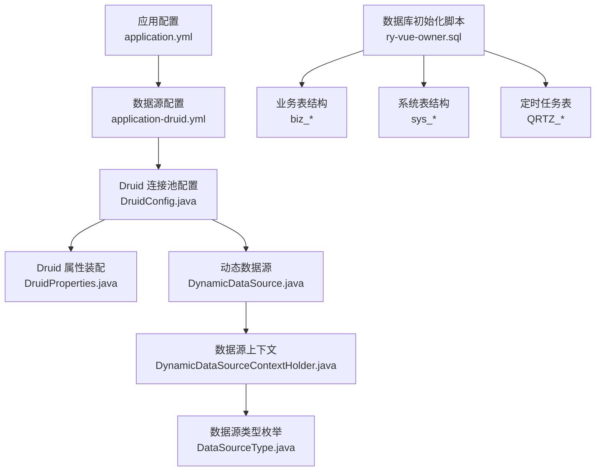
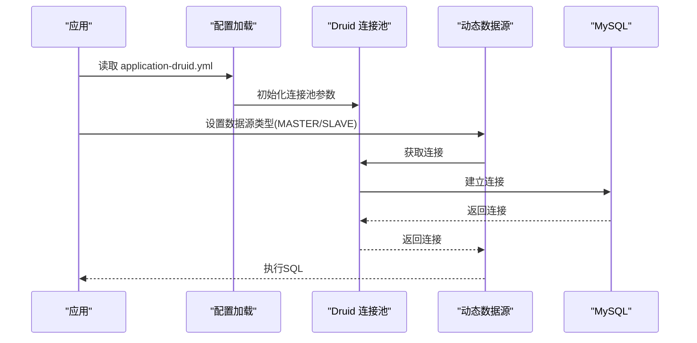
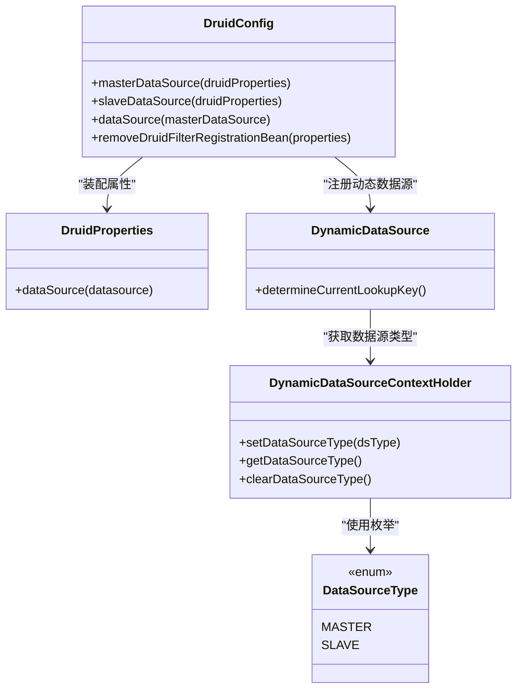
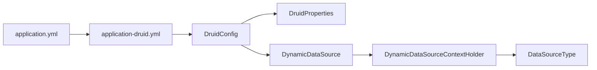

# 数据库概览

<cite>
**本文档引用的文件**
- [application.yml](file://blog-admin/src/main/resources/application.yml)
- [application-druid.yml](file://blog-admin/src/main/resources/application-druid.yml)
- [DruidConfig.java](file://blog-framework/src/main/java/blog/framework/config/DruidConfig.java)
- [DruidProperties.java](file://blog-framework/src/main/java/blog/framework/config/properties/DruidProperties.java)
- [DynamicDataSource.java](file://blog-framework/src/main/java/blog/framework/datasource/DynamicDataSource.java)
- [DynamicDataSourceContextHolder.java](file://blog-framework/src/main/java/blog/framework/datasource/DynamicDataSourceContextHolder.java)
- [DataSourceType.java](file://blog-common/src/main/java/blog/common/enums/DataSourceType.java)
- [ry-vue-owner.sql](file://ry-vue-owner.sql)
</cite>

## 目录
1. [简介](#简介)
2. [项目结构](#项目结构)
3. [核心组件](#核心组件)
4. [架构总览](#架构总览)
5. [详细组件分析](#详细组件分析)
6. [依赖关系分析](#依赖关系分析)
7. [性能考虑](#性能考虑)
8. [故障排查指南](#故障排查指南)
9. [结论](#结论)
10. [附录](#附录)

## 简介
本文件面向博客系统的数据库基础设施，系统采用 MySQL 8.2.0 作为数据库引擎，结合 Druid 连接池与动态数据源实现主从分离与连接池优化。配置覆盖了数据库选型、连接配置、连接池参数、字符集与排序规则、版本兼容性、性能优化、备份策略、初始化脚本、安全配置、监控指标与故障排查等方面，帮助开发者快速理解并高效使用数据库系统。

## 项目结构
- 配置文件位于 blog-admin 模块的 resources 目录，包含 Spring Boot 的主配置与 Druid 专用配置。
- 连接池与动态数据源由 blog-framework 模块提供，通过注解与配置类实现。
- 数据库初始化脚本位于仓库根目录，包含完整的建表、索引、约束与示例数据。

**图表来源**
- [application.yml:45-124](file://blog-admin/src/main/resources/application.yml#L45-L124)
- [application-druid.yml:1-61](file://blog-admin/src/main/resources/application-druid.yml#L1-L61)
- [DruidConfig.java:34-57](file://blog-framework/src/main/java/blog/framework/config/DruidConfig.java#L34-L57)
- [DruidProperties.java:53-86](file://blog-framework/src/main/java/blog/framework/config/properties/DruidProperties.java#L53-L86)
- [DynamicDataSource.java:13-24](file://blog-framework/src/main/java/blog/framework/datasource/DynamicDataSource.java#L13-L24)
- [DynamicDataSourceContextHolder.java:23-40](file://blog-framework/src/main/java/blog/framework/datasource/DynamicDataSourceContextHolder.java#L23-L40)
- [DataSourceType.java:8-18](file://blog-common/src/main/java/blog/common/enums/DataSourceType.java#L8-L18)
- [ry-vue-owner.sql:1-1349](file://ry-vue-owner.sql#L1-L1349)

**章节来源**
- [application.yml:45-124](file://blog-admin/src/main/resources/application.yml#L45-L124)
- [application-druid.yml:1-61](file://blog-admin/src/main/resources/application-druid.yml#L1-L61)
- [ry-vue-owner.sql:1-1349](file://ry-vue-owner.sql#L1-L1349)

## 核心组件
- 数据库选型与版本：MySQL 8.2.0（初始化脚本中目标版本为 8.0.43，具备向后兼容性）。
- 连接配置：通过 application-druid.yml 定义主库连接串、驱动类、用户名与密码。
- 连接池：Druid 连接池，提供连接数、超时、检测、慢SQL记录与监控视图。
- 动态数据源：基于 ThreadLocal 的数据源切换，支持主库与可选从库。
- ORM 集成：MyBatis-Plus 配置与 PageHelper 分页方言设置。
- 初始化脚本：包含业务表（biz_*）、系统表（sys_*）、定时任务表（QRTZ_*）与文件表（sys_file）。

**章节来源**
- [application-druid.yml:1-61](file://blog-admin/src/main/resources/application-druid.yml#L1-L61)
- [DruidConfig.java:34-57](file://blog-framework/src/main/java/blog/framework/config/DruidConfig.java#L34-L57)
- [DynamicDataSource.java:13-24](file://blog-framework/src/main/java/blog/framework/datasource/DynamicDataSource.java#L13-L24)
- [application.yml:108-124](file://blog-admin/src/main/resources/application.yml#L108-L124)
- [ry-vue-owner.sql:1-1349](file://ry-vue-owner.sql#L1-L1349)

## 架构总览
系统数据库层采用“配置驱动 + 连接池 + 动态数据源”的组合模式：
- 配置驱动：application-druid.yml 提供主库连接参数；从库开关默认关闭。
- 连接池：Druid 提供连接生命周期管理、健康检测与慢SQL审计。
- 动态数据源：根据业务上下文在主从库之间切换，确保读写分离与负载均衡。
- ORM：MyBatis-Plus 统一实体与映射，PageHelper 提供分页支持。

**图表来源**
- [application-druid.yml:1-61](file://blog-admin/src/main/resources/application-druid.yml#L1-L61)
- [DruidConfig.java:34-57](file://blog-framework/src/main/java/blog/framework/config/DruidConfig.java#L34-L57)
- [DynamicDataSource.java:13-24](file://blog-framework/src/main/java/blog/framework/datasource/DynamicDataSource.java#L13-L24)

## 详细组件分析

### 数据库选型与版本兼容性
- 版本信息：初始化脚本目标版本为 8.0.43，当前系统使用 MySQL 8.2.0，具备向后兼容性。
- 时间与时区：连接串包含 serverTimezone=GMT%2B8，确保时区一致性。
- SSL 与字符集：useSSL=true 与 characterEncoding=utf8，配合 utf8mb4 字符集与 utf8mb4_0900_ai_ci 排序规则，满足多语言与排序需求。

**章节来源**
- [ry-vue-owner.sql:6-14](file://ry-vue-owner.sql#L6-L14)
- [application-druid.yml:9-9](file://blog-admin/src/main/resources/application-druid.yml#L9-L9)

### 连接配置与连接池设置
- 主库连接：driverClassName=com.mysql.cj.jdbc.Driver，url 指向本地 3306 端口的 ry-vue-owner 库。
- 连接池参数：initialSize、minIdle、maxActive、maxWait、connectTimeout、socketTimeout、eviction 检测周期与空闲时间阈值。
- 监控与审计：statViewServlet 启用控制台，记录慢SQL（默认 1000ms），wall 过滤器允许多语句。

**图表来源**
- [DruidConfig.java:34-115](file://blog-framework/src/main/java/blog/framework/config/DruidConfig.java#L34-L115)
- [DruidProperties.java:53-86](file://blog-framework/src/main/java/blog/framework/config/properties/DruidProperties.java#L53-L86)
- [DynamicDataSource.java:13-24](file://blog-framework/src/main/java/blog/framework/datasource/DynamicDataSource.java#L13-L24)
- [DynamicDataSourceContextHolder.java:23-40](file://blog-framework/src/main/java/blog/framework/datasource/DynamicDataSourceContextHolder.java#L23-L40)
- [DataSourceType.java:8-18](file://blog-common/src/main/java/blog/common/enums/DataSourceType.java#L8-L18)

**章节来源**
- [application-druid.yml:1-61](file://blog-admin/src/main/resources/application-druid.yml#L1-L61)
- [DruidConfig.java:34-115](file://blog-framework/src/main/java/blog/framework/config/DruidConfig.java#L34-L115)
- [DruidProperties.java:53-86](file://blog-framework/src/main/java/blog/framework/config/properties/DruidProperties.java#L53-L86)
- [DynamicDataSource.java:13-24](file://blog-framework/src/main/java/blog/framework/datasource/DynamicDataSource.java#L13-L24)
- [DynamicDataSourceContextHolder.java:23-40](file://blog-framework/src/main/java/blog/framework/datasource/DynamicDataSourceContextHolder.java#L23-L40)
- [DataSourceType.java:8-18](file://blog-common/src/main/java/blog/common/enums/DataSourceType.java#L8-L18)

### 字符集与排序规则
- 字符集：utf8mb4，支持四字节字符（如 emoji）。
- 排序规则：utf8mb4_0900_ai_ci，符合 MySQL 8.x 默认排序规则，兼顾大小写不敏感与 AI（带重音符号）排序。
- 初始化脚本中大量表采用该字符集与排序规则，确保全文检索与排序一致性。

**章节来源**
- [ry-vue-owner.sql:17-31](file://ry-vue-owner.sql#L17-L31)

### 版本兼容性与性能优化配置
- 版本兼容：MySQL 8.2.0 与 8.0.43 在语法与行为上高度一致，初始化脚本可在两者间无缝迁移。
- 性能优化：
  - 连接池参数：合理设置 maxActive、minIdle、maxWait，避免连接争用与超时。
  - 连接超时：connectTimeout 与 socketTimeout 控制网络异常场景下的稳定性。
  - 空闲连接回收：timeBetweenEvictionRunsMillis 与空闲阈值减少无效连接占用。
  - 慢SQL审计：stat 记录与 wall 过滤器，便于定位性能瓶颈。

**章节来源**
- [application-druid.yml:19-61](file://blog-admin/src/main/resources/application-druid.yml#L19-L61)

### 备份策略
- 建议采用逻辑备份（mysqldump）与物理备份（xtrabackup/LVM快照）相结合的方式：
  - 逻辑备份：定期全量+增量，便于跨平台迁移与快速恢复。
  - 物理备份：针对大体量库的快速恢复场景，结合 binlog 实现点恢复。
- 备份保留周期：按法规与业务需求设定（如 7-14 天滚动备份），并定期校验恢复流程。

[本节为通用运维建议，无需特定文件引用]

### 数据库初始化脚本说明
- 脚本位置：ry-vue-owner.sql
- 主要内容：
  - 定时任务表：QRTZ_*（触发器、作业、日历等）
  - 业务表：biz_article、biz_category、biz_comment、biz_friend_link、biz_article_tag、sys_file
  - 系统表：sys_user、sys_dept、sys_role、sys_menu、sys_config、sys_dict_* 等
  - 示例数据：大量 INSERT 示例，便于快速验证
- 部署流程：
  1) 准备 MySQL 8.2.0 环境，创建数据库与用户。
  2) 执行初始化脚本，完成建表、索引与约束。
  3) 校验表结构与索引，确认字符集与排序规则。
  4) 启动应用，验证连接与基本功能。

**章节来源**
- [ry-vue-owner.sql:1-1349](file://ry-vue-owner.sql#L1-L1349)

### 安全配置
- 用户权限管理：应用配置中使用 root 用户连接（开发环境），生产环境应创建专用应用账号并限制权限。
- 访问控制：Druid 控制台启用登录校验（login-username/login-password），仅限内网访问。
- 数据加密：连接串启用 useSSL=true，建议在生产环境强制 TLS；密码采用 BCrypt 存储于 sys_user 表。
- SQL 审计：wall 过滤器允许多语句，生产环境建议关闭以降低注入风险。

**章节来源**
- [application-druid.yml:42-61](file://blog-admin/src/main/resources/application-druid.yml#L42-L61)
- [ry-vue-owner.sql:1255-1286](file://ry-vue-owner.sql#L1255-L1286)

### 监控指标与性能调优
- Druid 监控：
  - 控制台：/druid，展示连接池状态、SQL 执行统计、慢SQL 与错误率。
  - 慢SQL：slow-sql-millis 默认 1000ms，可根据业务调整。
- 性能调优建议：
  - 合理设置连接池大小，避免 maxActive 过小导致排队、过大导致资源争用。
  - 定期清理长时间空闲连接，降低 GC 压力。
  - 对热点查询添加合适索引，避免全表扫描。
  - 使用 EXPLAIN 分析慢查询，结合慢SQL日志定位瓶颈。

**章节来源**
- [application-druid.yml:42-61](file://blog-admin/src/main/resources/application-druid.yml#L42-L61)

## 依赖关系分析
- 配置层：application.yml 与 application-druid.yml 提供运行时参数。
- 连接层：DruidConfig 注入 DruidProperties，装配连接池与监控。
- 数据源层：DynamicDataSource 与 DynamicDataSourceContextHolder 实现主从切换。
- 枚举层：DataSourceType 定义数据源类型，贯穿切换逻辑。

**图表来源**
- [application.yml:45-124](file://blog-admin/src/main/resources/application.yml#L45-L124)
- [application-druid.yml:1-61](file://blog-admin/src/main/resources/application-druid.yml#L1-L61)
- [DruidConfig.java:34-57](file://blog-framework/src/main/java/blog/framework/config/DruidConfig.java#L34-L57)
- [DruidProperties.java:53-86](file://blog-framework/src/main/java/blog/framework/config/properties/DruidProperties.java#L53-L86)
- [DynamicDataSource.java:13-24](file://blog-framework/src/main/java/blog/framework/datasource/DynamicDataSource.java#L13-L24)
- [DynamicDataSourceContextHolder.java:23-40](file://blog-framework/src/main/java/blog/framework/datasource/DynamicDataSourceContextHolder.java#L23-L40)
- [DataSourceType.java:8-18](file://blog-common/src/main/java/blog/common/enums/DataSourceType.java#L8-L18)

**章节来源**
- [application.yml:45-124](file://blog-admin/src/main/resources/application.yml#L45-L124)
- [application-druid.yml:1-61](file://blog-admin/src/main/resources/application-druid.yml#L1-L61)
- [DruidConfig.java:34-57](file://blog-framework/src/main/java/blog/framework/config/DruidConfig.java#L34-L57)
- [DruidProperties.java:53-86](file://blog-framework/src/main/java/blog/framework/config/properties/DruidProperties.java#L53-L86)
- [DynamicDataSource.java:13-24](file://blog-framework/src/main/java/blog/framework/datasource/DynamicDataSource.java#L13-L24)
- [DynamicDataSourceContextHolder.java:23-40](file://blog-framework/src/main/java/blog/framework/datasource/DynamicDataSourceContextHolder.java#L23-L40)
- [DataSourceType.java:8-18](file://blog-common/src/main/java/blog/common/enums/DataSourceType.java#L8-L18)

## 性能考虑
- 连接池参数：根据 QPS 与并发度调整 maxActive、minIdle、maxWait，避免连接池耗尽或资源浪费。
- 查询优化：为高频查询字段建立索引，避免 SELECT *，使用 LIMIT 控制结果集大小。
- 缓存策略：结合 Redis 缓存热点数据，降低数据库压力。
- 定时任务：QRTZ 表结构与索引需保持一致，避免调度延迟与锁竞争。

[本节提供通用指导，无需特定文件引用]

## 故障排查指南
- 连接失败：
  - 检查 MySQL 服务状态与端口可达性。
  - 核对 application-druid.yml 中的 url、用户名与密码。
  - 确认 useSSL 与 serverTimezone 配置。
- 连接池异常：
  - 查看 Druid 控制台 /druid，关注活跃连接数、等待时间与错误率。
  - 调整 maxWait、maxActive 与 eviction 参数。
- 慢SQL：
  - 启用 stat.log-slow-sql 并设置合理阈值，结合慢SQL日志定位问题。
- 权限问题：
  - 生产环境使用专用账号，避免使用 root；核对 GRANT 权限范围。
- 主从切换：
  - 确认 DynamicDataSourceContextHolder 的数据源类型设置正确，避免误切从库。

**章节来源**
- [application-druid.yml:42-61](file://blog-admin/src/main/resources/application-druid.yml#L42-L61)
- [DruidConfig.java:78-115](file://blog-framework/src/main/java/blog/framework/config/DruidConfig.java#L78-L115)
- [DynamicDataSourceContextHolder.java:23-40](file://blog-framework/src/main/java/blog/framework/datasource/DynamicDataSourceContextHolder.java#L23-L40)

## 结论
本博客系统数据库层以 MySQL 8.2.0 为基础，结合 Druid 连接池与动态数据源，实现了稳定、可观测与可扩展的数据访问能力。通过合理的字符集与排序规则、完善的初始化脚本与安全配置，以及基于监控的性能调优与故障排查流程，能够满足博客业务的日常运营与演进需求。

## 附录
- 初始化脚本：ry-vue-owner.sql
- 关键配置：application.yml、application-druid.yml
- 核心代码：DruidConfig、DruidProperties、DynamicDataSource、DynamicDataSourceContextHolder、DataSourceType

**章节来源**
- [ry-vue-owner.sql:1-1349](file://ry-vue-owner.sql#L1-L1349)
- [application.yml:45-124](file://blog-admin/src/main/resources/application.yml#L45-L124)
- [application-druid.yml:1-61](file://blog-admin/src/main/resources/application-druid.yml#L1-L61)
- [DruidConfig.java:34-115](file://blog-framework/src/main/java/blog/framework/config/DruidConfig.java#L34-L115)
- [DruidProperties.java:53-86](file://blog-framework/src/main/java/blog/framework/config/properties/DruidProperties.java#L53-L86)
- [DynamicDataSource.java:13-24](file://blog-framework/src/main/java/blog/framework/datasource/DynamicDataSource.java#L13-L24)
- [DynamicDataSourceContextHolder.java:23-40](file://blog-framework/src/main/java/blog/framework/datasource/DynamicDataSourceContextHolder.java#L23-L40)
- [DataSourceType.java:8-18](file://blog-common/src/main/java/blog/common/enums/DataSourceType.java#L8-L18)