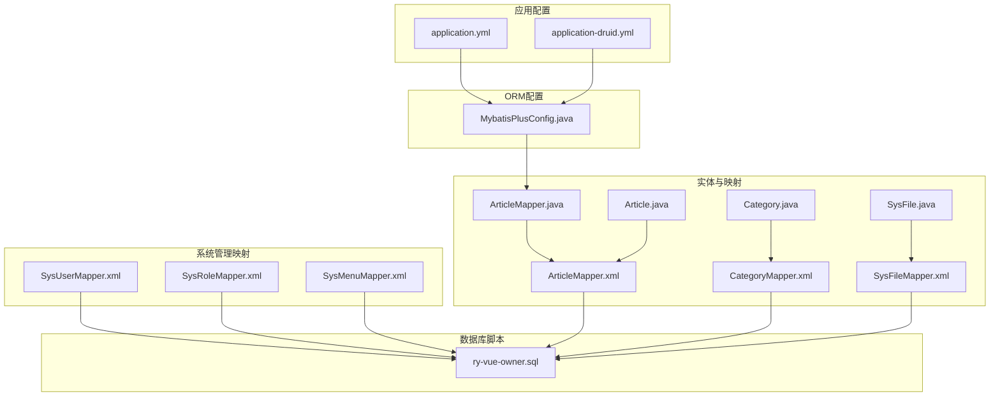
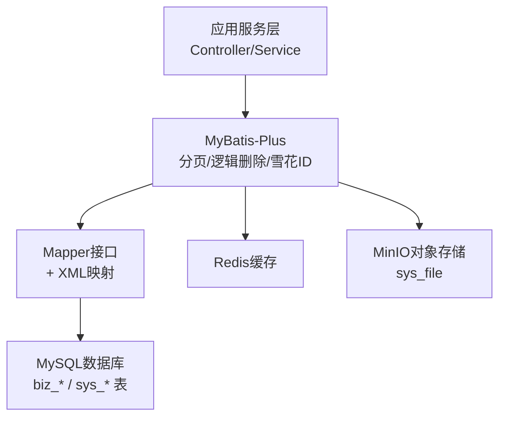
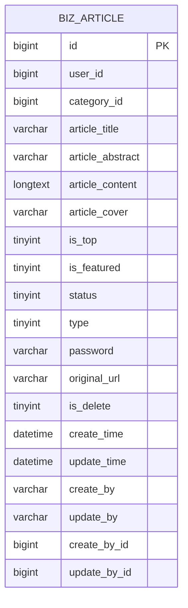
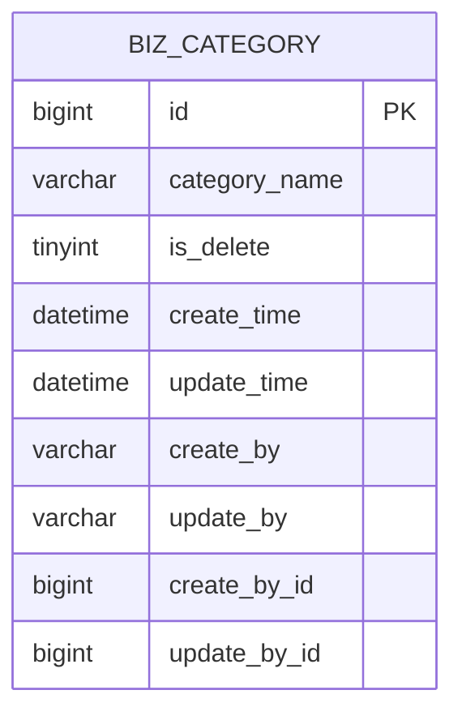
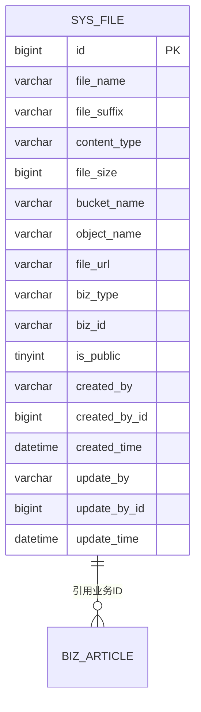
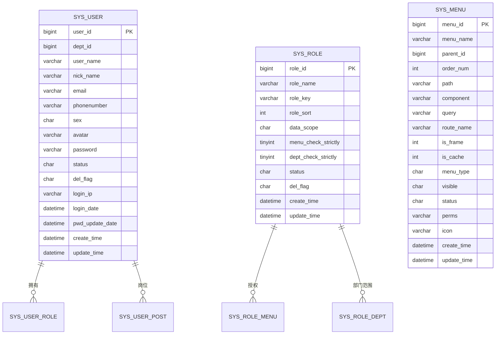
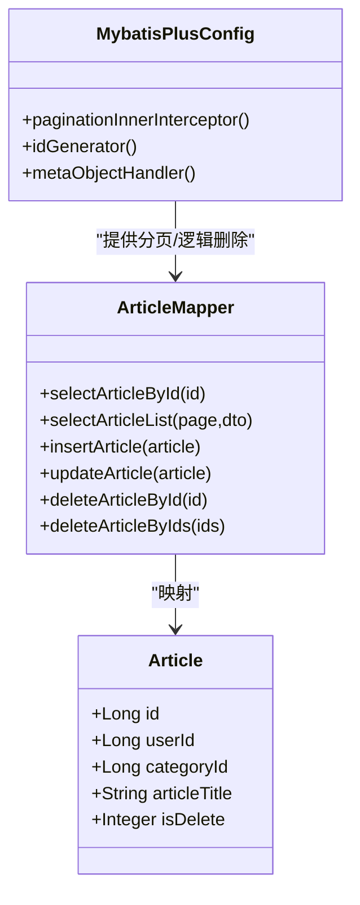
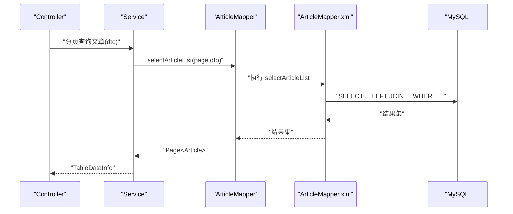
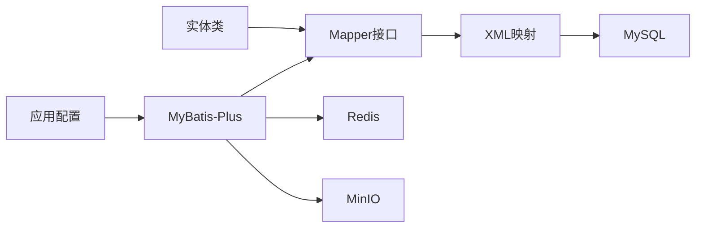

# 数据库设计

<cite>
**本文引用的文件**
- [ry-vue-owner.sql](file://ry-vue-owner.sql)
- [application.yml](file://blog-admin/src/main/resources/application.yml)
- [application-druid.yml](file://blog-admin/src/main/resources/application-druid.yml)
- [MybatisPlusConfig.java](file://blog-framework/src/main/java/blog/framework/config/MybatisPlusConfig.java)
- [Article.java](file://blog-biz/src/main/java/blog/biz/domain/Article.java)
- [Category.java](file://blog-biz/src/main/java/blog/biz/domain/Category.java)
- [SysFile.java](file://blog-biz/src/main/java/blog/biz/domain/SysFile.java)
- [ArticleMapper.java](file://blog-biz/src/main/java/blog/biz/mapper/ArticleMapper.java)
- [ArticleMapper.xml](file://blog-biz/src/main/resources/mapper/ArticleMapper.xml)
- [CategoryMapper.xml](file://blog-biz/src/main/resources/mapper/CategoryMapper.xml)
- [SysFileMapper.xml](file://blog-biz/src/main/resources/mapper/SysFileMapper.xml)
- [SysUserMapper.xml](file://blog-system/src/main/resources/mapper/system/SysUserMapper.xml)
- [SysRoleMapper.xml](file://blog-system/src/main/resources/mapper/system/SysRoleMapper.xml)
- [SysMenuMapper.xml](file://blog-system/src/main/resources/mapper/system/SysMenuMapper.xml)
</cite>

## 目录
1. [简介](#简介)
2. [项目结构](#项目结构)
3. [核心组件](#核心组件)
4. [架构总览](#架构总览)
5. [详细组件分析](#详细组件分析)
6. [依赖分析](#依赖分析)
7. [性能考虑](#性能考虑)
8. [故障排查指南](#故障排查指南)
9. [结论](#结论)
10. [附录](#附录)

## 简介
本文件系统化梳理博客系统的数据库设计，覆盖核心业务表（文章、分类、评论、友链）、系统管理表（用户、角色、菜单、字典、配置等）、文件存储表（MinIO文件元数据），并深入解析实体关系、索引与约束、ORM映射与分页配置、性能优化策略、数据安全与备份建议，以及数据库迁移与版本管理方案。

## 项目结构
- 数据库脚本：通过统一的 SQL 脚本集中定义所有表结构、索引、约束与初始数据。
- 配置文件：
  - 应用配置：定义 MyBatis-Plus、分页插件、MinIO 等运行期参数。
  - 数据源配置：Druid 连接池参数、慢 SQL 监控、控制台访问等。
- ORM 层：
  - MyBatis-Plus 配置：分页拦截器、雪花 ID 生成器、逻辑删除字段。
  - 实体类：标注表名、逻辑删除、字段映射与序列化策略。
  - Mapper 接口与 XML：定义 CRUD 与复杂查询、结果映射。

**图表来源**
- [application.yml:108-124](file://blog-admin/src/main/resources/application.yml#L108-L124)
- [application-druid.yml:1-61](file://blog-admin/src/main/resources/application-druid.yml#L1-L61)
- [MybatisPlusConfig.java:1-56](file://blog-framework/src/main/java/blog/framework/config/MybatisPlusConfig.java#L1-L56)
- [Article.java:1-95](file://blog-biz/src/main/java/blog/biz/domain/Article.java#L1-L95)
- [Category.java:1-38](file://blog-biz/src/main/java/blog/biz/domain/Category.java#L1-L38)
- [SysFile.java:1-95](file://blog-biz/src/main/java/blog/biz/domain/SysFile.java#L1-L95)
- [ArticleMapper.java:1-66](file://blog-biz/src/main/java/blog/biz/mapper/ArticleMapper.java#L1-L66)
- [ArticleMapper.xml:1-293](file://blog-biz/src/main/resources/mapper/ArticleMapper.xml#L1-L293)
- [CategoryMapper.xml:1-18](file://blog-biz/src/main/resources/mapper/CategoryMapper.xml#L1-L18)
- [SysFileMapper.xml:1-24](file://blog-biz/src/main/resources/mapper/SysFileMapper.xml#L1-L24)
- [SysUserMapper.xml:1-232](file://blog-system/src/main/resources/mapper/system/SysUserMapper.xml#L1-L232)
- [SysRoleMapper.xml:1-152](file://blog-system/src/main/resources/mapper/system/SysRoleMapper.xml#L1-L152)
- [SysMenuMapper.xml:1-206](file://blog-system/src/main/resources/mapper/system/SysMenuMapper.xml#L1-L206)
- [ry-vue-owner.sql:238-471](file://ry-vue-owner.sql#L238-L471)

**章节来源**
- [application.yml:108-124](file://blog-admin/src/main/resources/application.yml#L108-L124)
- [application-druid.yml:1-61](file://blog-admin/src/main/resources/application-druid.yml#L1-L61)
- [MybatisPlusConfig.java:1-56](file://blog-framework/src/main/java/blog/framework/config/MybatisPlusConfig.java#L1-L56)

## 核心组件
- 文章表 biz_article：记录文章元数据、内容、状态、类型、置顶/推荐、访问密码、原文链接等，并通过逻辑删除实现软删除。
- 文章分类表 biz_category：记录分类名称与删除标记。
- 文章标签中间表 biz_article_tag：多对多关联文章与标签（脚本中存在，但未见对应实体与映射文件）。
- 评论表 biz_comment：记录评论主体、回复关系、类型、审核状态与删除标记。
- 友链表 biz_friend_link：记录友链名称、头像、地址与简介。
- 文件表 sys_file：记录 MinIO 存储的文件元数据（名称、类型、大小、桶名、对象名、URL、业务类型与ID、公开性、创建/更新信息）。
- 系统管理表：用户 sys_user、角色 sys_role、菜单 sys_menu、部门 sys_dept、岗位 sys_post、操作日志 sys_oper_log、登录日志 sys_logininfor、参数配置 sys_config、字典 sys_dict_type/sys_dict_data、角色-菜单/用户关联表等。

**章节来源**
- [ry-vue-owner.sql:238-471](file://ry-vue-owner.sql#L238-L471)
- [ry-vue-owner.sql:1323-1347](file://ry-vue-owner.sql#L1323-L1347)

## 架构总览
数据库层采用 MyBatis-Plus 简化 CRUD 与分页；通过逻辑删除字段统一软删除；结合 Druid 进行连接池与慢 SQL 监控；应用层通过实体类与 XML 映射实现强类型查询与结果映射。

**图表来源**
- [MybatisPlusConfig.java:1-56](file://blog-framework/src/main/java/blog/framework/config/MybatisPlusConfig.java#L1-L56)
- [application.yml:108-124](file://blog-admin/src/main/resources/application.yml#L108-L124)
- [application.yml:155-161](file://blog-admin/src/main/resources/application.yml#L155-L161)
- [ry-vue-owner.sql:1323-1347](file://ry-vue-owner.sql#L1323-L1347)

## 详细组件分析

### 文章表 biz_article 设计
- 关键字段
  - 主键与自增：id
  - 作者与分类：user_id、category_id
  - 基本信息：article_title、article_abstract、article_content、article_cover
  - 状态与类型：status（公开/私密/草稿）、type（原创/转载/翻译）
  - 审核与访问控制：is_top、is_featured、password、original_url
  - 时间戳与审计：create_time、update_time、create_by、update_by、create_by_id、update_by_id
  - 逻辑删除：is_delete
- 索引与约束
  - 主键：PRIMARY KEY (id)
  - 逻辑删除：is_delete 默认 0，配合 MyBatis-Plus 全局逻辑删除配置
- 业务含义
  - 支持文章置顶、推荐、私密与草稿状态；支持访问密码与原文链接；软删除避免数据丢失。
- ORM 映射
  - 实体类：@TableName("biz_article")、@TableLogic(isDelete)
  - Mapper 接口：BaseMapper<Article>，提供 select/update/delete 等方法
  - XML：定义查询条件（按 DTO 动态拼接 where）、分页查询、插入/更新字段选择

**图表来源**
- [ry-vue-owner.sql:238-263](file://ry-vue-owner.sql#L238-L263)
- [Article.java:23-64](file://blog-biz/src/main/java/blog/biz/domain/Article.java#L23-L64)
- [ArticleMapper.xml:55-124](file://blog-biz/src/main/resources/mapper/ArticleMapper.xml#L55-L124)

**章节来源**
- [ry-vue-owner.sql:238-263](file://ry-vue-owner.sql#L238-L263)
- [Article.java:23-94](file://blog-biz/src/main/java/blog/biz/domain/Article.java#L23-L94)
- [ArticleMapper.java:17-65](file://blog-biz/src/main/java/blog/biz/mapper/ArticleMapper.java#L17-L65)
- [ArticleMapper.xml:55-124](file://blog-biz/src/main/resources/mapper/ArticleMapper.xml#L55-L124)

### 文章分类表 biz_category 设计
- 关键字段
  - 主键：id
  - 分类名称：category_name
  - 删除标记：is_delete（逻辑删除）
  - 审计字段：create_by、create_by_id、create_time、update_by、update_by_id、update_time
- 索引与约束
  - 主键：PRIMARY KEY (id)
  - 逻辑删除：is_delete 默认 0
- 业务含义
  - 用于文章归类，支持软删除与审计追踪。

**图表来源**
- [ry-vue-owner.sql:298-312](file://ry-vue-owner.sql#L298-L312)
- [Category.java:18-37](file://blog-biz/src/main/java/blog/biz/domain/Category.java#L18-L37)
- [CategoryMapper.xml:7-16](file://blog-biz/src/main/resources/mapper/CategoryMapper.xml#L7-L16)

**章节来源**
- [ry-vue-owner.sql:298-312](file://ry-vue-owner.sql#L298-L312)
- [Category.java:18-37](file://blog-biz/src/main/java/blog/biz/domain/Category.java#L18-L37)
- [CategoryMapper.xml:7-16](file://blog-biz/src/main/resources/mapper/CategoryMapper.xml#L7-L16)

### 文件存储表 sys_file 设计
- 关键字段
  - 主键：id
  - 文件元数据：file_name、file_suffix、content_type、file_size
  - MinIO：bucket_name、object_name、file_url
  - 业务关联：biz_type、biz_id
  - 权限与审计：is_public、created_by、created_by_id、created_time、update_by、update_by_id、update_time
- 索引与约束
  - 主键：PRIMARY KEY (id)
  - 复合索引：idx_biz(biz_type, biz_id)
- 业务含义
  - 统一管理 MinIO 中的文件元数据，支持按业务类型与业务ID检索。

**图表来源**
- [ry-vue-owner.sql:1323-1347](file://ry-vue-owner.sql#L1323-L1347)
- [SysFile.java:19-94](file://blog-biz/src/main/java/blog/biz/domain/SysFile.java#L19-L94)
- [SysFileMapper.xml:7-22](file://blog-biz/src/main/resources/mapper/SysFileMapper.xml#L7-L22)

**章节来源**
- [ry-vue-owner.sql:1323-1347](file://ry-vue-owner.sql#L1323-L1347)
- [SysFile.java:19-94](file://blog-biz/src/main/java/blog/biz/domain/SysFile.java#L19-L94)
- [SysFileMapper.xml:7-22](file://blog-biz/src/main/resources/mapper/SysFileMapper.xml#L7-L22)

### 系统管理表（用户/角色/菜单/字典/配置）
- 用户 sys_user：账号、昵称、邮箱、手机号、性别、头像、密码、状态、删除标记、登录信息、创建/更新信息。
- 角色 sys_role：角色名称、权限字符串、排序、数据范围、状态、删除标记、创建/更新信息。
- 菜单 sys_menu：菜单名称、父级、排序、路由、组件、权限标识、图标、可见/状态、创建/更新信息。
- 字典 sys_dict_type/sys_dict_data：字典类型与字典项，支持业务枚举。
- 配置 sys_config：系统参数键值、类型、备注。
- 关联表：sys_user_role、sys_role_menu、sys_user_post、sys_role_dept 等。

**图表来源**
- [ry-vue-owner.sql:1252-1318](file://ry-vue-owner.sql#L1252-L1318)
- [ry-vue-owner.sql:1021-1042](file://ry-vue-owner.sql#L1021-L1042)
- [ry-vue-owner.sql:746-773](file://ry-vue-owner.sql#L746-L773)
- [ry-vue-owner.sql:602-617](file://ry-vue-owner.sql#L602-L617)
- [ry-vue-owner.sql:473-488](file://ry-vue-owner.sql#L473-L488)

**章节来源**
- [ry-vue-owner.sql:1252-1318](file://ry-vue-owner.sql#L1252-L1318)
- [ry-vue-owner.sql:1021-1042](file://ry-vue-owner.sql#L1021-L1042)
- [ry-vue-owner.sql:746-773](file://ry-vue-owner.sql#L746-L773)
- [ry-vue-owner.sql:602-617](file://ry-vue-owner.sql#L602-L617)
- [ry-vue-owner.sql:473-488](file://ry-vue-owner.sql#L473-L488)

### 数据访问层（ORM）实现
- MyBatis-Plus 配置
  - 分页拦截器：自动分页与溢出保护
  - 雪花 ID 生成器：基于网卡绑定，避免集群重复
  - 元对象处理器：自动填充创建/更新字段
  - 全局逻辑删除：统一字段与值
- 实体映射
  - @TableName 指定表名
  - @TableLogic 指定逻辑删除字段
  - @TableId/@TableField 控制主键与字段映射
- Mapper 接口与 XML
  - BaseMapper<T> 提供通用 CRUD
  - XML 定义动态 where 条件、联表查询、分页查询、插入/更新字段选择

**图表来源**
- [Article.java:23-94](file://blog-biz/src/main/java/blog/biz/domain/Article.java#L23-L94)
- [ArticleMapper.java:17-65](file://blog-biz/src/main/java/blog/biz/mapper/ArticleMapper.java#L17-L65)
- [MybatisPlusConfig.java:19-52](file://blog-framework/src/main/java/blog/framework/config/MybatisPlusConfig.java#L19-L52)
- [ArticleMapper.xml:55-124](file://blog-biz/src/main/resources/mapper/ArticleMapper.xml#L55-L124)

**章节来源**
- [MybatisPlusConfig.java:19-52](file://blog-framework/src/main/java/blog/framework/config/MybatisPlusConfig.java#L19-L52)
- [Article.java:23-94](file://blog-biz/src/main/java/blog/biz/domain/Article.java#L23-L94)
- [ArticleMapper.java:17-65](file://blog-biz/src/main/java/blog/biz/mapper/ArticleMapper.java#L17-L65)
- [ArticleMapper.xml:55-124](file://blog-biz/src/main/resources/mapper/ArticleMapper.xml#L55-L124)

### 关键业务流程（示例：文章列表查询）

**图表来源**
- [ArticleMapper.java](file://blog-biz/src/main/java/blog/biz/mapper/ArticleMapper.java#L32)
- [ArticleMapper.xml:55-124](file://blog-biz/src/main/resources/mapper/ArticleMapper.xml#L55-L124)

**章节来源**
- [ArticleMapper.java](file://blog-biz/src/main/java/blog/biz/mapper/ArticleMapper.java#L32)
- [ArticleMapper.xml:55-124](file://blog-biz/src/main/resources/mapper/ArticleMapper.xml#L55-L124)

## 依赖分析
- 组件耦合
  - 实体类与表结构强绑定（@TableName、字段命名与类型）
  - Mapper 接口与 XML 映射一一对应，查询条件与字段映射需保持一致
  - 业务表与系统管理表通过外键/关联表建立权限与审计关系
- 外部依赖
  - MySQL：主数据库
  - Redis：缓存（配置中启用）
  - MinIO：对象存储（sys_file）

**图表来源**
- [application.yml:65-89](file://blog-admin/src/main/resources/application.yml#L65-L89)
- [application.yml:155-161](file://blog-admin/src/main/resources/application.yml#L155-L161)
- [MybatisPlusConfig.java:19-52](file://blog-framework/src/main/java/blog/framework/config/MybatisPlusConfig.java#L19-L52)

**章节来源**
- [application.yml:65-89](file://blog-admin/src/main/resources/application.yml#L65-L89)
- [application.yml:155-161](file://blog-admin/src/main/resources/application.yml#L155-L161)
- [MybatisPlusConfig.java:19-52](file://blog-framework/src/main/java/blog/framework/config/MybatisPlusConfig.java#L19-L52)

## 性能考虑
- 分页与查询
  - 启用 PageHelper（application.yml）与 MyBatis-Plus 分页拦截器，避免一次性加载大量数据
  - 文章列表使用 LEFT JOIN 与动态 WHERE 条件，建议为高频过滤字段建立索引
- 索引建议
  - biz_article：category_id、status、type、is_delete、create_time
  - sys_user：dept_id、user_name、email、phonenumber
  - sys_oper_log：oper_time、status、business_type
  - sys_file：biz_type、biz_id、bucket_name、object_name
- 缓存策略
  - Redis 缓存热点数据（如配置、菜单树、用户角色）
- 监控与慢 SQL
  - Druid 慢 SQL 记录与控制台访问，便于定位性能瓶颈

**章节来源**
- [application.yml:120-123](file://blog-admin/src/main/resources/application.yml#L120-L123)
- [application-druid.yml:55-58](file://blog-admin/src/main/resources/application-druid.yml#L55-L58)
- [ry-vue-owner.sql:929-931](file://ry-vue-owner.sql#L929-L931)

## 故障排查指南
- 逻辑删除相关
  - 确认全局逻辑删除字段与值已在 MyBatis-Plus 配置中正确设置
  - 查询时注意 is_delete 的过滤条件
- 分页异常
  - 检查分页插件配置与 Page 对象传入
- 数据一致性
  - 关注 sys_user_role、sys_role_menu 等关联表的维护
- 登录与操作日志
  - sys_logininfor、sys_oper_log 提供登录与操作轨迹，便于审计与排障

**章节来源**
- [MybatisPlusConfig.java:113-117](file://blog-framework/src/main/java/blog/framework/config/MybatisPlusConfig.java#L113-L117)
- [application.yml:120-123](file://blog-admin/src/main/resources/application.yml#L120-L123)
- [ry-vue-owner.sql:685-701](file://ry-vue-owner.sql#L685-L701)
- [ry-vue-owner.sql:904-932](file://ry-vue-owner.sql#L904-L932)

## 结论
本设计以 MyBatis-Plus 为核心，结合逻辑删除、分页拦截器与雪花 ID 生成器，形成清晰的 ORM 映射与查询体系；业务表覆盖文章、分类、评论、友链与文件元数据，系统管理表支撑权限与审计；通过索引、缓存与 Druid 监控保障性能与可观测性。建议后续完善标签关联表映射、细化索引覆盖与定期备份策略。

## 附录
- 数据库初始化脚本：ry-vue-owner.sql
- 应用配置：application.yml、application-druid.yml
- ORM 配置：MybatisPlusConfig.java
- 实体与映射：Article.java、Category.java、SysFile.java、各 Mapper 接口与 XML