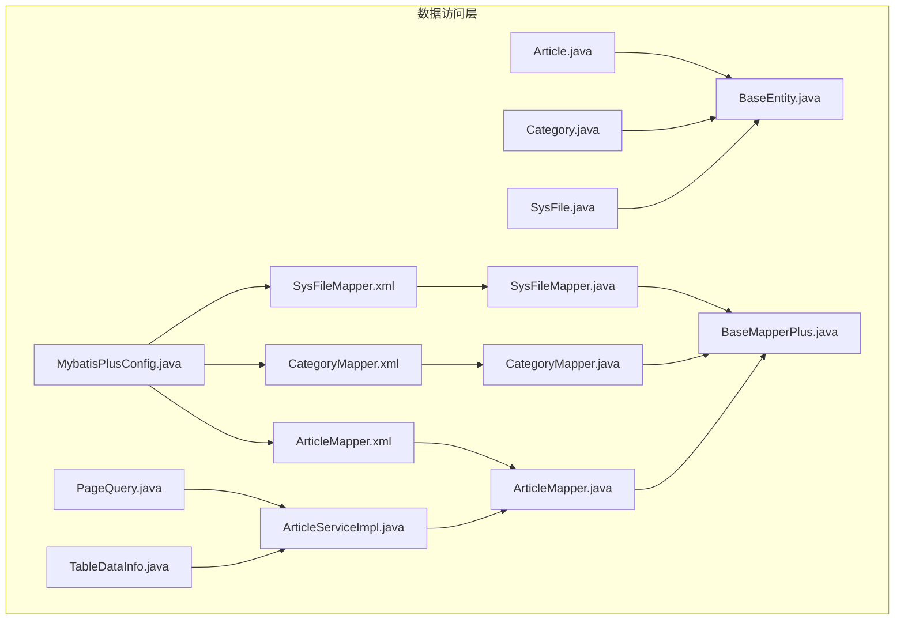
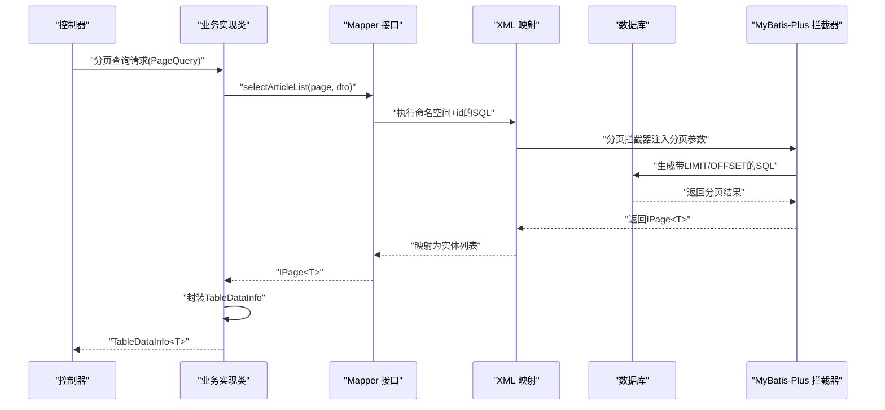
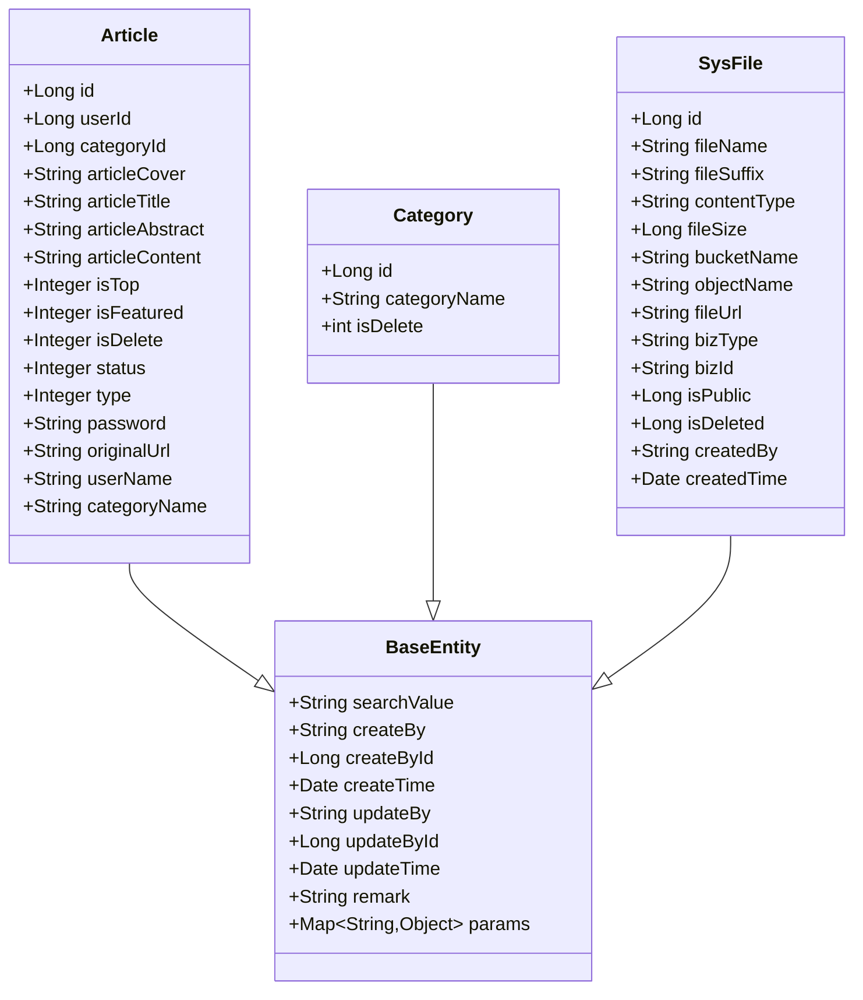
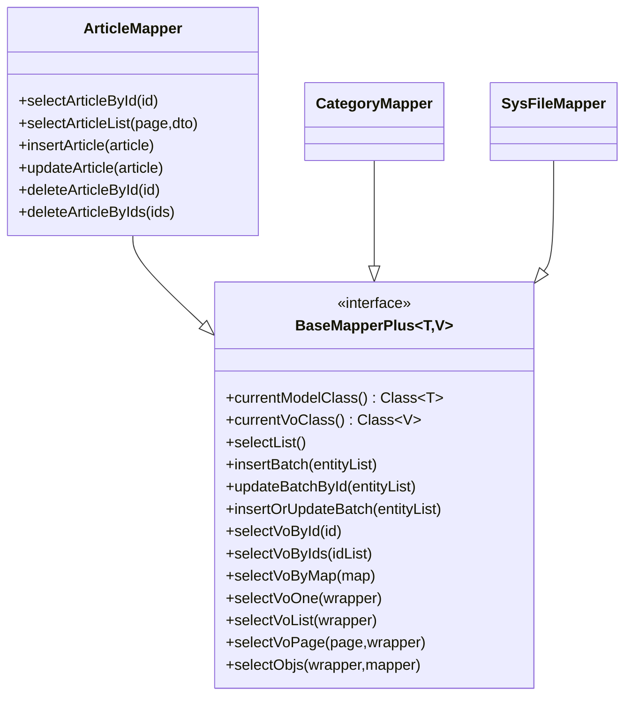
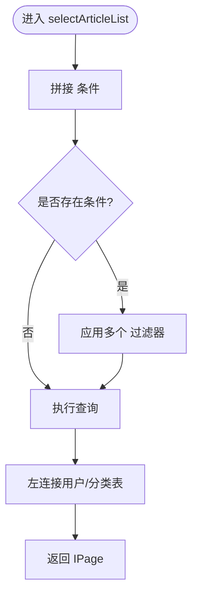
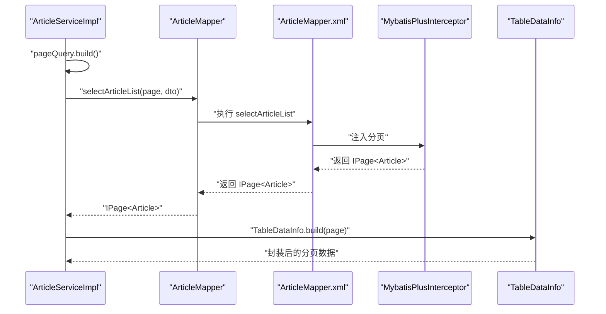
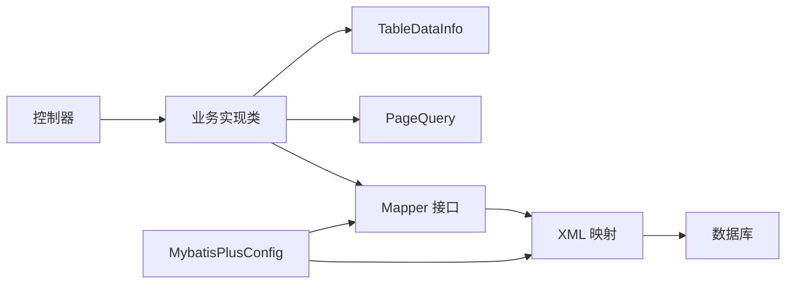

# 数据访问层设计

<cite>
**本文引用的文件**
- [Article.java](file://blog-biz/src/main/java/blog/biz/domain/Article.java)
- [Category.java](file://blog-biz/src/main/java/blog/biz/domain/Category.java)
- [SysFile.java](file://blog-biz/src/main/java/blog/biz/domain/SysFile.java)
- [BaseEntity.java](file://blog-common/src/main/java/blog/common/base/entity/BaseEntity.java)
- [BaseMapperPlus.java](file://blog-common/src/main/java/blog/common/base/mapper/BaseMapperPlus.java)
- [PageQuery.java](file://blog-common/src/main/java/blog/common/base/req/PageQuery.java)
- [TableDataInfo.java](file://blog-common/src/main/java/blog/common/base/resp/TableDataInfo.java)
- [ArticleMapper.java](file://blog-biz/src/main/java/blog/biz/mapper/ArticleMapper.java)
- [CategoryMapper.java](file://blog-biz/src/main/java/blog/biz/mapper/CategoryMapper.java)
- [SysFileMapper.java](file://blog-biz/src/main/java/blog/biz/mapper/SysFileMapper.java)
- [ArticleMapper.xml](file://blog-biz/src/main/resources/mapper/ArticleMapper.xml)
- [CategoryMapper.xml](file://blog-biz/src/main/resources/mapper/CategoryMapper.xml)
- [SysFileMapper.xml](file://blog-biz/src/main/resources/mapper/SysFileMapper.xml)
- [ArticleServiceImpl.java](file://blog-biz/src/main/java/blog/biz/service/impl/ArticleServiceImpl.java)
- [MybatisPlusConfig.java](file://blog-framework/src/main/java/blog/framework/config/MybatisPlusConfig.java)
</cite>

## 目录
1. [简介](#简介)
2. [项目结构](#项目结构)
3. [核心组件](#核心组件)
4. [架构总览](#架构总览)
5. [详细组件分析](#详细组件分析)
6. [依赖分析](#依赖分析)
7. [性能考虑](#性能考虑)
8. [故障排查指南](#故障排查指南)
9. [结论](#结论)
10. [附录](#附录)

## 简介
本文件面向基于 MyBatis-Plus 的博客系统数据访问层（DAO）设计，系统性阐述实体类映射、Mapper 接口定义、XML 配置、分页查询、批量操作、动态 SQL、元对象填充、以及与业务层的交互模式与最佳实践。目标是帮助开发者正确、高效地使用 MyBatis-Plus 进行数据库操作。

## 项目结构
数据访问层主要由以下模块构成：
- 实体域模型：位于 blog-biz 的 domain 包，承载数据库表映射与通用字段。
- Mapper 接口：位于 blog-biz 的 mapper 包，定义 CRUD 与自定义查询方法。
- XML 映射：位于 resources/mapper，定义 SQL、动态 SQL、结果映射与片段复用。
- 基础设施：blog-common 提供 BaseEntity、BaseMapperPlus、分页请求与响应封装。
- 配置：blog-framework 的 MybatisPlusConfig 提供分页插件、ID 生成器、元对象处理器等。

**图表来源**
- [Article.java:1-95](file://blog-biz/src/main/java/blog/biz/domain/Article.java#L1-L95)
- [Category.java:1-38](file://blog-biz/src/main/java/blog/biz/domain/Category.java#L1-L38)
- [SysFile.java:1-95](file://blog-biz/src/main/java/blog/biz/domain/SysFile.java#L1-L95)
- [BaseEntity.java:1-85](file://blog-common/src/main/java/blog/common/base/entity/BaseEntity.java#L1-L85)
- [BaseMapperPlus.java:1-335](file://blog-common/src/main/java/blog/common/base/mapper/BaseMapperPlus.java#L1-L335)
- [PageQuery.java:1-128](file://blog-common/src/main/java/blog/common/base/req/PageQuery.java#L1-L128)
- [TableDataInfo.java:1-98](file://blog-common/src/main/java/blog/common/base/resp/TableDataInfo.java#L1-L98)
- [ArticleMapper.java:1-66](file://blog-biz/src/main/java/blog/biz/mapper/ArticleMapper.java#L1-L66)
- [CategoryMapper.java:1-16](file://blog-biz/src/main/java/blog/biz/mapper/CategoryMapper.java#L1-L16)
- [SysFileMapper.java:1-16](file://blog-biz/src/main/java/blog/biz/mapper/SysFileMapper.java#L1-L16)
- [ArticleMapper.xml:1-293](file://blog-biz/src/main/resources/mapper/ArticleMapper.xml#L1-L293)
- [CategoryMapper.xml:1-18](file://blog-biz/src/main/resources/mapper/CategoryMapper.xml#L1-L18)
- [SysFileMapper.xml:1-24](file://blog-biz/src/main/resources/mapper/SysFileMapper.xml#L1-L24)
- [ArticleServiceImpl.java:1-95](file://blog-biz/src/main/java/blog/biz/service/impl/ArticleServiceImpl.java#L1-L95)
- [MybatisPlusConfig.java:1-56](file://blog-framework/src/main/java/blog/framework/config/MybatisPlusConfig.java#L1-L56)

**章节来源**
- [Article.java:1-95](file://blog-biz/src/main/java/blog/biz/domain/Article.java#L1-L95)
- [Category.java:1-38](file://blog-biz/src/main/java/blog/biz/domain/Category.java#L1-L38)
- [SysFile.java:1-95](file://blog-biz/src/main/java/blog/biz/domain/SysFile.java#L1-L95)
- [BaseEntity.java:1-85](file://blog-common/src/main/java/blog/common/base/entity/BaseEntity.java#L1-L85)
- [BaseMapperPlus.java:1-335](file://blog-common/src/main/java/blog/common/base/mapper/BaseMapperPlus.java#L1-L335)
- [PageQuery.java:1-128](file://blog-common/src/main/java/blog/common/base/req/PageQuery.java#L1-L128)
- [TableDataInfo.java:1-98](file://blog-common/src/main/java/blog/common/base/resp/TableDataInfo.java#L1-L98)
- [ArticleMapper.java:1-66](file://blog-biz/src/main/java/blog/biz/mapper/ArticleMapper.java#L1-L66)
- [CategoryMapper.java:1-16](file://blog-biz/src/main/java/blog/biz/mapper/CategoryMapper.java#L1-L16)
- [SysFileMapper.java:1-16](file://blog-biz/src/main/java/blog/biz/mapper/SysFileMapper.java#L1-L16)
- [ArticleMapper.xml:1-293](file://blog-biz/src/main/resources/mapper/ArticleMapper.xml#L1-L293)
- [CategoryMapper.xml:1-18](file://blog-biz/src/main/resources/mapper/CategoryMapper.xml#L1-L18)
- [SysFileMapper.xml:1-24](file://blog-biz/src/main/resources/mapper/SysFileMapper.xml#L1-L24)
- [ArticleServiceImpl.java:1-95](file://blog-biz/src/main/java/blog/biz/service/impl/ArticleServiceImpl.java#L1-L95)
- [MybatisPlusConfig.java:1-56](file://blog-framework/src/main/java/blog/framework/config/MybatisPlusConfig.java#L1-L56)

## 核心组件
- 实体类与表映射
  - 使用注解标注表名、逻辑删除、字段填充与序列化策略，继承 BaseEntity 统一审计字段。
  - 示例：[Article.java:23-92](file://blog-biz/src/main/java/blog/biz/domain/Article.java#L23-L92)、[Category.java:18-36](file://blog-biz/src/main/java/blog/biz/domain/Category.java#L18-L36)、[SysFile.java:19-91](file://blog-biz/src/main/java/blog/biz/domain/SysFile.java#L19-L91)、[BaseEntity.java:37-70](file://blog-common/src/main/java/blog/common/base/entity/BaseEntity.java#L37-L70)。
- Mapper 接口
  - 基于 MyBatis-Plus 的 BaseMapper 或自定义 BaseMapperPlus，支持泛型 VO 查询与批量操作。
  - 示例：[ArticleMapper.java:17-64](file://blog-biz/src/main/java/blog/biz/mapper/ArticleMapper.java#L17-L64)、[CategoryMapper.java](file://blog-biz/src/main/java/blog/biz/mapper/CategoryMapper.java#L13)、[SysFileMapper.java](file://blog-biz/src/main/java/blog/biz/mapper/SysFileMapper.java#L13)、[BaseMapperPlus.java:32-334](file://blog-common/src/main/java/blog/common/base/mapper/BaseMapperPlus.java#L32-L334)。
- XML 映射
  - 定义 resultMap、SQL 片段、动态 SQL、参数绑定与批量插入/更新。
  - 示例：[ArticleMapper.xml:6-292](file://blog-biz/src/main/resources/mapper/ArticleMapper.xml#L6-L292)、[CategoryMapper.xml:7-16](file://blog-biz/src/main/resources/mapper/CategoryMapper.xml#L7-L16)、[SysFileMapper.xml:7-22](file://blog-biz/src/main/resources/mapper/SysFileMapper.xml#L7-L22)。
- 分页与响应封装
  - PageQuery 构建分页与排序；TableDataInfo 封装分页响应；MybatisPlusConfig 注册分页拦截器。
  - 示例：[PageQuery.java:62-115](file://blog-common/src/main/java/blog/common/base/req/PageQuery.java#L62-L115)、[TableDataInfo.java:57-64](file://blog-common/src/main/java/blog/common/base/resp/TableDataInfo.java#L57-L64)、[MybatisPlusConfig.java:20-35](file://blog-framework/src/main/java/blog/framework/config/MybatisPlusConfig.java#L20-L35)。
- 业务层交互
  - 通过 Service 实现类调用 Mapper，统一设置审计字段、处理业务逻辑。
  - 示例：[ArticleServiceImpl.java:22-93](file://blog-biz/src/main/java/blog/biz/service/impl/ArticleServiceImpl.java#L22-L93)。

**章节来源**
- [Article.java:14-92](file://blog-biz/src/main/java/blog/biz/domain/Article.java#L14-L92)
- [Category.java:10-36](file://blog-biz/src/main/java/blog/biz/domain/Category.java#L10-L36)
- [SysFile.java:11-91](file://blog-biz/src/main/java/blog/biz/domain/SysFile.java#L11-L91)
- [BaseEntity.java:22-84](file://blog-common/src/main/java/blog/common/base/entity/BaseEntity.java#L22-L84)
- [BaseMapperPlus.java:32-334](file://blog-common/src/main/java/blog/common/base/mapper/BaseMapperPlus.java#L32-L334)
- [ArticleMapper.java:17-64](file://blog-biz/src/main/java/blog/biz/mapper/ArticleMapper.java#L17-L64)
- [CategoryMapper.java](file://blog-biz/src/main/java/blog/biz/mapper/CategoryMapper.java#L13)
- [SysFileMapper.java](file://blog-biz/src/main/java/blog/biz/mapper/SysFileMapper.java#L13)
- [ArticleMapper.xml:6-292](file://blog-biz/src/main/resources/mapper/ArticleMapper.xml#L6-L292)
- [CategoryMapper.xml:7-16](file://blog-biz/src/main/resources/mapper/CategoryMapper.xml#L7-L16)
- [SysFileMapper.xml:7-22](file://blog-biz/src/main/resources/mapper/SysFileMapper.xml#L7-L22)
- [PageQuery.java:24-115](file://blog-common/src/main/java/blog/common/base/req/PageQuery.java#L24-L115)
- [TableDataInfo.java:14-64](file://blog-common/src/main/java/blog/common/base/resp/TableDataInfo.java#L14-L64)
- [MybatisPlusConfig.java:17-35](file://blog-framework/src/main/java/blog/framework/config/MybatisPlusConfig.java#L17-L35)
- [ArticleServiceImpl.java:22-93](file://blog-biz/src/main/java/blog/biz/service/impl/ArticleServiceImpl.java#L22-L93)

## 架构总览
下图展示从控制器到数据访问层的整体流程，包括分页、动态 SQL、批量操作与元对象填充。

**图表来源**
- [ArticleServiceImpl.java:44-46](file://blog-biz/src/main/java/blog/biz/service/impl/ArticleServiceImpl.java#L44-L46)
- [ArticleMapper.java](file://blog-biz/src/main/java/blog/biz/mapper/ArticleMapper.java#L32)
- [ArticleMapper.xml:55-124](file://blog-biz/src/main/resources/mapper/ArticleMapper.xml#L55-L124)
- [MybatisPlusConfig.java:20-35](file://blog-framework/src/main/java/blog/framework/config/MybatisPlusConfig.java#L20-L35)
- [TableDataInfo.java:57-64](file://blog-common/src/main/java/blog/common/base/resp/TableDataInfo.java#L57-L64)

## 详细组件分析

### 实体类与表映射
- 表名映射与字段映射
  - 使用注解声明表名与字段映射，支持逻辑删除、字段填充与 JSON 序列化。
  - 示例：[Article.java:23-92](file://blog-biz/src/main/java/blog/biz/domain/Article.java#L23-L92)、[Category.java:18-36](file://blog-biz/src/main/java/blog/biz/domain/Category.java#L18-L36)、[SysFile.java:19-91](file://blog-biz/src/main/java/blog/biz/domain/SysFile.java#L19-L91)。
- 继承 BaseEntity
  - 统一审计字段（创建/更新者、时间），并由元对象处理器自动填充。
  - 示例：[BaseEntity.java:37-70](file://blog-common/src/main/java/blog/common/base/entity/BaseEntity.java#L37-L70)、[MybatisPlusConfig.java:49-52](file://blog-framework/src/main/java/blog/framework/config/MybatisPlusConfig.java#L49-L52)。

**图表来源**
- [BaseEntity.java:22-84](file://blog-common/src/main/java/blog/common/base/entity/BaseEntity.java#L22-L84)
- [Article.java:24-92](file://blog-biz/src/main/java/blog/biz/domain/Article.java#L24-L92)
- [Category.java:19-36](file://blog-biz/src/main/java/blog/biz/domain/Category.java#L19-L36)
- [SysFile.java:20-91](file://blog-biz/src/main/java/blog/biz/domain/SysFile.java#L20-L91)

**章节来源**
- [Article.java:14-92](file://blog-biz/src/main/java/blog/biz/domain/Article.java#L14-L92)
- [Category.java:10-36](file://blog-biz/src/main/java/blog/biz/domain/Category.java#L10-L36)
- [SysFile.java:11-91](file://blog-biz/src/main/java/blog/biz/domain/SysFile.java#L11-L91)
- [BaseEntity.java:22-84](file://blog-common/src/main/java/blog/common/base/entity/BaseEntity.java#L22-L84)
- [MybatisPlusConfig.java:49-52](file://blog-framework/src/main/java/blog/framework/config/MybatisPlusConfig.java#L49-L52)

### Mapper 接口设计
- 基于 MyBatis-Plus 的 BaseMapper
  - 提供标准 CRUD 与条件构造器能力，适合简单场景。
  - 示例：[ArticleMapper.java](file://blog-biz/src/main/java/blog/biz/mapper/ArticleMapper.java#L17)。
- 基于 BaseMapperPlus 的增强接口
  - 支持 VO 查询、批量操作、分页 VO、对象投影等高级特性。
  - 示例：[CategoryMapper.java](file://blog-biz/src/main/java/blog/biz/mapper/CategoryMapper.java#L13)、[SysFileMapper.java](file://blog-biz/src/main/java/blog/biz/mapper/SysFileMapper.java#L13)、[BaseMapperPlus.java:32-334](file://blog-common/src/main/java/blog/common/base/mapper/BaseMapperPlus.java#L32-L334)。

**图表来源**
- [BaseMapperPlus.java:32-334](file://blog-common/src/main/java/blog/common/base/mapper/BaseMapperPlus.java#L32-L334)
- [ArticleMapper.java:17-64](file://blog-biz/src/main/java/blog/biz/mapper/ArticleMapper.java#L17-L64)
- [CategoryMapper.java](file://blog-biz/src/main/java/blog/biz/mapper/CategoryMapper.java#L13)
- [SysFileMapper.java](file://blog-biz/src/main/java/blog/biz/mapper/SysFileMapper.java#L13)

**章节来源**
- [ArticleMapper.java:17-64](file://blog-biz/src/main/java/blog/biz/mapper/ArticleMapper.java#L17-L64)
- [CategoryMapper.java](file://blog-biz/src/main/java/blog/biz/mapper/CategoryMapper.java#L13)
- [SysFileMapper.java](file://blog-biz/src/main/java/blog/biz/mapper/SysFileMapper.java#L13)
- [BaseMapperPlus.java:32-334](file://blog-common/src/main/java/blog/common/base/mapper/BaseMapperPlus.java#L32-L334)

### XML 配置与动态 SQL
- 结果映射与 SQL 片段
  - 使用 resultMap 将列名映射到驼峰属性；使用 <sql> 定义可复用片段。
  - 示例：[ArticleMapper.xml:6-53](file://blog-biz/src/main/resources/mapper/ArticleMapper.xml#L6-L53)。
- 动态 SQL 与参数绑定
  - 使用 <where>/<if> 构建条件查询；使用 <trim>/<foreach> 实现动态插入/更新与 IN 条件。
  - 示例：[ArticleMapper.xml:82-123](file://blog-biz/src/main/resources/mapper/ArticleMapper.xml#L82-L123)、[ArticleMapper.xml:131-227](file://blog-biz/src/main/resources/mapper/ArticleMapper.xml#L131-L227)、[ArticleMapper.xml:287-292](file://blog-biz/src/main/resources/mapper/ArticleMapper.xml#L287-L292)。
- 关联查询与别名
  - 左连接查询用户与分类信息，使用列别名避免冲突。
  - 示例：[ArticleMapper.xml:79-81](file://blog-biz/src/main/resources/mapper/ArticleMapper.xml#L79-L81)。

**图表来源**
- [ArticleMapper.xml:55-124](file://blog-biz/src/main/resources/mapper/ArticleMapper.xml#L55-L124)
- [ArticleMapper.xml:79-81](file://blog-biz/src/main/resources/mapper/ArticleMapper.xml#L79-L81)

**章节来源**
- [ArticleMapper.xml:6-292](file://blog-biz/src/main/resources/mapper/ArticleMapper.xml#L6-L292)
- [CategoryMapper.xml:7-16](file://blog-biz/src/main/resources/mapper/CategoryMapper.xml#L7-L16)
- [SysFileMapper.xml:7-22](file://blog-biz/src/main/resources/mapper/SysFileMapper.xml#L7-L22)

### 分页查询实现
- 分页参数与排序
  - PageQuery 构建 Page 并解析排序字段与方向，支持多字段排序与 SQL 注入防护。
  - 示例：[PageQuery.java:62-115](file://blog-common/src/main/java/blog/common/base/req/PageQuery.java#L62-L115)。
- 分页拦截与响应封装
  - MybatisPlusInterceptor 注册分页内核；Service 层将 IPage 转为 TableDataInfo。
  - 示例：[MybatisPlusConfig.java:20-35](file://blog-framework/src/main/java/blog/framework/config/MybatisPlusConfig.java#L20-L35)、[ArticleServiceImpl.java:44-46](file://blog-biz/src/main/java/blog/biz/service/impl/ArticleServiceImpl.java#L44-L46)、[TableDataInfo.java:57-64](file://blog-common/src/main/java/blog/common/base/resp/TableDataInfo.java#L57-L64)。

**图表来源**
- [PageQuery.java:62-74](file://blog-common/src/main/java/blog/common/base/req/PageQuery.java#L62-L74)
- [ArticleMapper.java](file://blog-biz/src/main/java/blog/biz/mapper/ArticleMapper.java#L32)
- [ArticleMapper.xml:55-124](file://blog-biz/src/main/resources/mapper/ArticleMapper.xml#L55-L124)
- [MybatisPlusConfig.java:20-35](file://blog-framework/src/main/java/blog/framework/config/MybatisPlusConfig.java#L20-L35)
- [ArticleServiceImpl.java:44-46](file://blog-biz/src/main/java/blog/biz/service/impl/ArticleServiceImpl.java#L44-L46)
- [TableDataInfo.java:57-64](file://blog-common/src/main/java/blog/common/base/resp/TableDataInfo.java#L57-L64)

**章节来源**
- [PageQuery.java:24-115](file://blog-common/src/main/java/blog/common/base/req/PageQuery.java#L24-L115)
- [MybatisPlusConfig.java:17-35](file://blog-framework/src/main/java/blog/framework/config/MybatisPlusConfig.java#L17-L35)
- [ArticleServiceImpl.java:44-46](file://blog-biz/src/main/java/blog/biz/service/impl/ArticleServiceImpl.java#L44-L46)
- [TableDataInfo.java:14-64](file://blog-common/src/main/java/blog/common/base/resp/TableDataInfo.java#L14-L64)

### 批量操作与元对象填充
- 批量操作
  - BaseMapperPlus 提供 insertBatch/updateBatchById/insertOrUpdateBatch 及带批次大小的重载，底层使用 Db 工具链提升性能。
  - 示例：[BaseMapperPlus.java:69-124](file://blog-common/src/main/java/blog/common/base/mapper/BaseMapperPlus.java#L69-L124)。
- 元对象填充
  - 通过 MetaObjectHandler 在插入/更新时自动填充审计字段，结合 BaseEntity 字段填充策略。
  - 示例：[MybatisPlusConfig.java:49-52](file://blog-framework/src/main/java/blog/framework/config/MybatisPlusConfig.java#L49-L52)、[BaseEntity.java:37-70](file://blog-common/src/main/java/blog/common/base/entity/BaseEntity.java#L37-L70)。

**章节来源**
- [BaseMapperPlus.java:69-124](file://blog-common/src/main/java/blog/common/base/mapper/BaseMapperPlus.java#L69-L124)
- [MybatisPlusConfig.java:49-52](file://blog-framework/src/main/java/blog/framework/config/MybatisPlusConfig.java#L49-L52)
- [BaseEntity.java:37-70](file://blog-common/src/main/java/blog/common/base/entity/BaseEntity.java#L37-L70)

### 与业务层的交互模式
- 事务与异常
  - Service 层负责业务事务边界与异常包装，DAO 层保持职责单一，异常向上抛或在 Service 统一封装。
- 数据校验
  - PageQuery 对排序参数进行校验与转义，防止非法排序导致的 SQL 异常。
- 审计字段
  - Service 层设置 createBy/createById 等业务相关字段，BaseEntity 与 MetaObjectHandler 协同保证持久化一致性。

**章节来源**
- [ArticleServiceImpl.java:22-93](file://blog-biz/src/main/java/blog/biz/service/impl/ArticleServiceImpl.java#L22-L93)
- [PageQuery.java:85-114](file://blog-common/src/main/java/blog/common/base/req/PageQuery.java#L85-L114)
- [BaseEntity.java:37-70](file://blog-common/src/main/java/blog/common/base/entity/BaseEntity.java#L37-L70)
- [MybatisPlusConfig.java:49-52](file://blog-framework/src/main/java/blog/framework/config/MybatisPlusConfig.java#L49-L52)

## 依赖分析
- 组件耦合
  - Mapper 依赖 XML 映射；Service 依赖 Mapper；PageQuery/Response 封装贯穿业务层。
- 外部依赖
  - MyBatis-Plus 拦截器、雪花 ID 生成器、元对象处理器。
- 循环依赖
  - 未发现循环依赖，层次清晰：Controller -> Service -> Mapper -> XML -> DB。

**图表来源**
- [ArticleServiceImpl.java:22-93](file://blog-biz/src/main/java/blog/biz/service/impl/ArticleServiceImpl.java#L22-L93)
- [ArticleMapper.java:17-64](file://blog-biz/src/main/java/blog/biz/mapper/ArticleMapper.java#L17-L64)
- [ArticleMapper.xml:55-124](file://blog-biz/src/main/resources/mapper/ArticleMapper.xml#L55-L124)
- [PageQuery.java:62-74](file://blog-common/src/main/java/blog/common/base/req/PageQuery.java#L62-L74)
- [TableDataInfo.java:57-64](file://blog-common/src/main/java/blog/common/base/resp/TableDataInfo.java#L57-L64)
- [MybatisPlusConfig.java:20-35](file://blog-framework/src/main/java/blog/framework/config/MybatisPlusConfig.java#L20-L35)

**章节来源**
- [ArticleServiceImpl.java:22-93](file://blog-biz/src/main/java/blog/biz/service/impl/ArticleServiceImpl.java#L22-L93)
- [ArticleMapper.java:17-64](file://blog-biz/src/main/java/blog/biz/mapper/ArticleMapper.java#L17-L64)
- [ArticleMapper.xml:55-124](file://blog-biz/src/main/resources/mapper/ArticleMapper.xml#L55-L124)
- [PageQuery.java:62-74](file://blog-common/src/main/java/blog/common/base/req/PageQuery.java#L62-L74)
- [TableDataInfo.java:57-64](file://blog-common/src/main/java/blog/common/base/resp/TableDataInfo.java#L57-L64)
- [MybatisPlusConfig.java:20-35](file://blog-framework/src/main/java/blog/framework/config/MybatisPlusConfig.java#L20-L35)

## 性能考虑
- 分页与排序
  - 合理设置分页大小与排序字段，避免全表扫描；PageQuery 对排序参数进行安全处理。
- 批量操作
  - 使用 BaseMapperPlus 的批量方法减少往返次数；必要时调整批次大小以平衡内存与吞吐。
- 动态 SQL
  - 仅在必要时拼接条件，避免过多 OR 条件导致索引失效；对高频过滤字段建立合适索引。
- 元对象填充
  - 减少手动赋值，降低出错概率并提升一致性。

[本节为通用指导，无需列出具体文件来源]

## 故障排查指南
- 分页无效
  - 检查 MybatisPlusInterceptor 是否注册；确认 PageQuery 参数是否正确传入。
  - 参考：[MybatisPlusConfig.java:20-35](file://blog-framework/src/main/java/blog/framework/config/MybatisPlusConfig.java#L20-L35)、[PageQuery.java:62-74](file://blog-common/src/main/java/blog/common/base/req/PageQuery.java#L62-L74)。
- 排序异常
  - PageQuery 对排序参数进行校验与转义，非法参数会抛出异常；检查前端传参格式。
  - 参考：[PageQuery.java:85-114](file://blog-common/src/main/java/blog/common/base/req/PageQuery.java#L85-L114)。
- 审计字段缺失
  - 确认 MetaObjectHandler 已注册且 BaseEntity 字段填充策略生效。
  - 参考：[MybatisPlusConfig.java:49-52](file://blog-framework/src/main/java/blog/framework/config/MybatisPlusConfig.java#L49-L52)、[BaseEntity.java:37-70](file://blog-common/src/main/java/blog/common/base/entity/BaseEntity.java#L37-L70)。
- 动态 SQL 报错
  - 检查 <where>/<if>/<trim>/<foreach> 使用是否正确；确保参数命名一致。
  - 参考：[ArticleMapper.xml:82-123](file://blog-biz/src/main/resources/mapper/ArticleMapper.xml#L82-L123)、[ArticleMapper.xml:131-227](file://blog-biz/src/main/resources/mapper/ArticleMapper.xml#L131-L227)。

**章节来源**
- [MybatisPlusConfig.java:20-35](file://blog-framework/src/main/java/blog/framework/config/MybatisPlusConfig.java#L20-L35)
- [PageQuery.java:85-114](file://blog-common/src/main/java/blog/common/base/req/PageQuery.java#L85-L114)
- [BaseEntity.java:37-70](file://blog-common/src/main/java/blog/common/base/entity/BaseEntity.java#L37-L70)
- [ArticleMapper.xml:82-227](file://blog-biz/src/main/resources/mapper/ArticleMapper.xml#L82-L227)

## 结论
本数据访问层以 MyBatis-Plus 为核心，结合 BaseEntity、BaseMapperPlus、PageQuery 与 TableDataInfo，形成“实体映射 + 接口定义 + XML 动态 SQL + 分页拦截 + 元对象填充”的完整体系。通过标准化的分页与批量操作、严格的参数校验与结果封装，既保证了开发效率，也兼顾了性能与安全性。建议在实际项目中遵循本文档的设计模式与最佳实践，持续优化 SQL 与索引，确保系统稳定与高性能。

[本节为总结，无需列出具体文件来源]

## 附录
- 设计要点速查
  - 实体类：使用注解声明表名、逻辑删除、字段填充；继承 BaseEntity。
  - Mapper：优先使用 BaseMapperPlus 以获得 VO 查询与批量能力。
  - XML：使用 resultMap、SQL 片段与动态 SQL；注意参数命名与 IN 条件。
  - 分页：PageQuery 构建分页与排序；MybatisPlusInterceptor 注册分页插件。
  - 批量：使用 BaseMapperPlus 的批量方法；必要时调整批次大小。
  - 审计：MetaObjectHandler + BaseEntity 自动填充。

[本节为概览，无需列出具体文件来源]