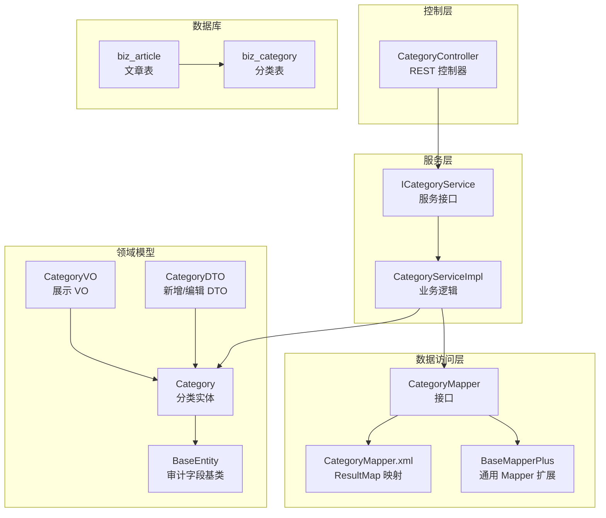
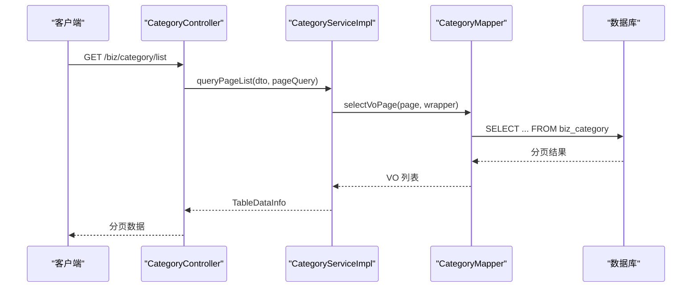
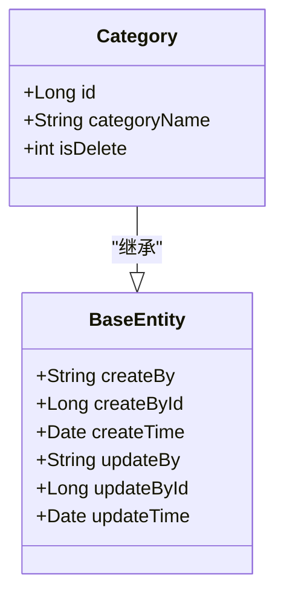
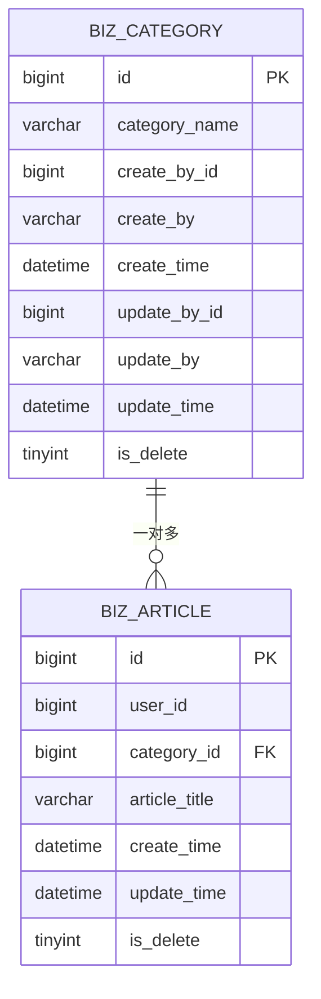
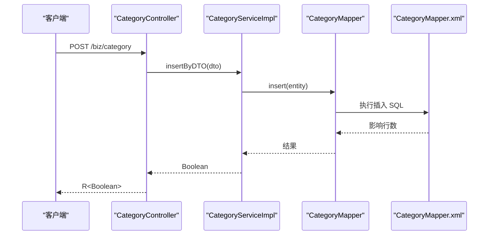
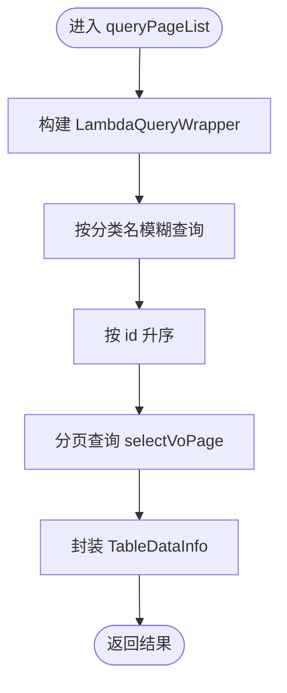
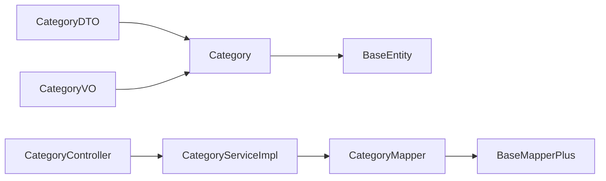

# 分类表设计

<cite>
**本文引用的文件**
- [Category.java](file://blog-biz/src/main/java/blog/biz/domain/Category.java)
- [CategoryMapper.java](file://blog-biz/src/main/java/blog/biz/mapper/CategoryMapper.java)
- [CategoryMapper.xml](file://blog-biz/src/main/resources/mapper/CategoryMapper.xml)
- [CategoryServiceImpl.java](file://blog-biz/src/main/java/blog/biz/service/impl/CategoryServiceImpl.java)
- [ICategoryService.java](file://blog-biz/src/main/java/blog/biz/service/ICategoryService.java)
- [CategoryDTO.java](file://blog-biz/src/main/java/blog/biz/domain/dto/CategoryDTO.java)
- [CategoryVO.java](file://blog-biz/src/main/java/blog/biz/domain/vo/CategoryVO.java)
- [CategoryController.java](file://blog-admin/src/main/java/blog/web/controller/business/CategoryController.java)
- [BaseEntity.java](file://blog-common/src/main/java/blog/common/base/entity/BaseEntity.java)
- [BaseMapperPlus.java](file://blog-common/src/main/java/blog/common/base/mapper/BaseMapperPlus.java)
- [Article.java](file://blog-biz/src/main/java/blog/biz/domain/Article.java)
- [ArticleMapper.java](file://blog-biz/src/main/java/blog/biz/mapper/ArticleMapper.java)
- [ry-vue-owner.sql](file://ry-vue-owner.sql)
</cite>

## 目录
1. [简介](#简介)
2. [项目结构](#项目结构)
3. [核心组件](#核心组件)
4. [架构总览](#架构总览)
5. [详细组件分析](#详细组件分析)
6. [依赖分析](#依赖分析)
7. [性能考量](#性能考量)
8. [故障排查指南](#故障排查指南)
9. [结论](#结论)
10. [附录](#附录)

## 简介
本设计文档围绕文章分类表（biz_category）展开，系统性阐述其结构设计、字段含义与命名规范、与文章表（biz_article）的一对多关联关系、审计与软删除机制、数据字典与索引约束，以及与业务层、控制层的集成方式。旨在帮助开发者与产品人员准确理解并高效使用分类能力。

## 项目结构
分类相关代码位于 blog-biz 模块，采用“领域模型 + Mapper + Service + 控制器”的分层设计；通用审计字段由 BaseEntity 提供，MyBatis-Plus 的 BaseMapperPlus 提供 VO 映射与分页查询能力；数据库脚本在 ry-vue-owner.sql 中定义了 biz_category 表结构及字段约束。

图表来源
- [CategoryController.java:1-107](file://blog-admin/src/main/java/blog/web/controller/business/CategoryController.java#L1-L107)
- [ICategoryService.java:1-71](file://blog-biz/src/main/java/blog/biz/service/ICategoryService.java#L1-L71)
- [CategoryServiceImpl.java:1-133](file://blog-biz/src/main/java/blog/biz/service/impl/CategoryServiceImpl.java#L1-L133)
- [CategoryMapper.java:1-16](file://blog-biz/src/main/java/blog/biz/mapper/CategoryMapper.java#L1-L16)
- [CategoryMapper.xml:1-18](file://blog-biz/src/main/resources/mapper/CategoryMapper.xml#L1-L18)
- [BaseMapperPlus.java:1-335](file://blog-common/src/main/java/blog/common/base/mapper/BaseMapperPlus.java#L1-L335)
- [Category.java:1-38](file://blog-biz/src/main/java/blog/biz/domain/Category.java#L1-L38)
- [BaseEntity.java:1-85](file://blog-common/src/main/java/blog/common/base/entity/BaseEntity.java#L1-L85)
- [ry-vue-owner.sql:298-312](file://ry-vue-owner.sql#L298-L312)

章节来源
- [CategoryController.java:1-107](file://blog-admin/src/main/java/blog/web/controller/business/CategoryController.java#L1-L107)
- [CategoryServiceImpl.java:1-133](file://blog-biz/src/main/java/blog/biz/service/impl/CategoryServiceImpl.java#L1-L133)
- [CategoryMapper.java:1-16](file://blog-biz/src/main/java/blog/biz/mapper/CategoryMapper.java#L1-L16)
- [CategoryMapper.xml:1-18](file://blog-biz/src/main/resources/mapper/CategoryMapper.xml#L1-L18)
- [BaseMapperPlus.java:1-335](file://blog-common/src/main/java/blog/common/base/mapper/BaseMapperPlus.java#L1-L335)
- [Category.java:1-38](file://blog-biz/src/main/java/blog/biz/domain/Category.java#L1-L38)
- [BaseEntity.java:1-85](file://blog-common/src/main/java/blog/common/base/entity/BaseEntity.java#L1-L85)
- [ry-vue-owner.sql:298-312](file://ry-vue-owner.sql#L298-L312)

## 核心组件
- 分类实体（Category）：承载分类主键、分类名、软删除字段，继承 BaseEntity 获取审计字段。
- 分类 Mapper：基于 BaseMapperPlus，提供 VO 查询、分页、批量删除等能力。
- 分类 Service：封装查询、分页、新增、修改、批量删除等业务逻辑。
- 分类 DTO/VO：DTO 用于新增/编辑校验，VO 用于对外展示。
- 控制器（CategoryController）：暴露 REST 接口，完成鉴权、日志、Excel 导出等功能。
- 审计基类（BaseEntity）：统一提供创建人、创建时间、更新人、更新时间字段及填充策略。
- 数据库脚本：定义 biz_category 表结构、字段类型、默认值、注释与索引。

章节来源
- [Category.java:1-38](file://blog-biz/src/main/java/blog/biz/domain/Category.java#L1-L38)
- [CategoryMapper.java:1-16](file://blog-biz/src/main/java/blog/biz/mapper/CategoryMapper.java#L1-L16)
- [CategoryMapper.xml:1-18](file://blog-biz/src/main/resources/mapper/CategoryMapper.xml#L1-L18)
- [ICategoryService.java:1-71](file://blog-biz/src/main/java/blog/biz/service/ICategoryService.java#L1-L71)
- [CategoryServiceImpl.java:1-133](file://blog-biz/src/main/java/blog/biz/service/impl/CategoryServiceImpl.java#L1-L133)
- [CategoryDTO.java:1-29](file://blog-biz/src/main/java/blog/biz/domain/dto/CategoryDTO.java#L1-L29)
- [CategoryVO.java:1-42](file://blog-biz/src/main/java/blog/biz/domain/vo/CategoryVO.java#L1-L42)
- [CategoryController.java:1-107](file://blog-admin/src/main/java/blog/web/controller/business/CategoryController.java#L1-L107)
- [BaseEntity.java:1-85](file://blog-common/src/main/java/blog/common/base/entity/BaseEntity.java#L1-L85)
- [ry-vue-owner.sql:298-312](file://ry-vue-owner.sql#L298-L312)

## 架构总览
分类模块遵循“控制层 -> 服务层 -> 数据访问层 -> 领域模型 -> 数据库”的分层架构。分类实体继承 BaseEntity，自动具备审计字段；Service 层通过 Mapper 完成数据持久化与 VO 转换；控制器负责请求接入与响应输出。

图表来源
- [CategoryController.java:42-46](file://blog-admin/src/main/java/blog/web/controller/business/CategoryController.java#L42-L46)
- [CategoryServiceImpl.java:58-63](file://blog-biz/src/main/java/blog/biz/service/impl/CategoryServiceImpl.java#L58-L63)
- [CategoryMapper.java:1-16](file://blog-biz/src/main/java/blog/biz/mapper/CategoryMapper.java#L1-L16)
- [ry-vue-owner.sql:298-312](file://ry-vue-owner.sql#L298-L312)

## 详细组件分析

### 分类实体与字段设计
- 主键与分类名：id、categoryName。
- 软删除：isDelete，使用 MyBatis-Plus 的逻辑删除注解，避免物理删除。
- 审计字段：继承 BaseEntity，自动填充 createBy、createById、createTime、updateBy、updateById、updateTime。

图表来源
- [Category.java:19-36](file://blog-biz/src/main/java/blog/biz/domain/Category.java#L19-L36)
- [BaseEntity.java:36-70](file://blog-common/src/main/java/blog/common/base/entity/BaseEntity.java#L36-L70)

章节来源
- [Category.java:1-38](file://blog-biz/src/main/java/blog/biz/domain/Category.java#L1-L38)
- [BaseEntity.java:1-85](file://blog-common/src/main/java/blog/common/base/entity/BaseEntity.java#L1-L85)

### 分类与文章的一对多关联
- 关联关系：文章表（biz_article）通过 category_id 指向分类表（biz_category）的 id。
- 一对多语义：一个分类可对应多篇文章；删除分类需谨慎处理已有文章归属。
- 字段映射：文章实体中存在 categoryId 字段，用于建立关联。

图表来源
- [ry-vue-owner.sql:238-263](file://ry-vue-owner.sql#L238-L263)
- [ry-vue-owner.sql:298-312](file://ry-vue-owner.sql#L298-L312)
- [Article.java:34-36](file://blog-biz/src/main/java/blog/biz/domain/Article.java#L34-L36)

章节来源
- [ry-vue-owner.sql:238-263](file://ry-vue-owner.sql#L238-L263)
- [ry-vue-owner.sql:298-312](file://ry-vue-owner.sql#L298-L312)
- [Article.java:1-95](file://blog-biz/src/main/java/blog/biz/domain/Article.java#L1-L95)

### 审计机制与软删除
- 审计字段：createBy、createById、createTime、updateBy、updateById、updateTime 由 BaseEntity 统一注入，插入时填充 create_*，更新时填充 update_*。
- 软删除：分类表与文章表均使用 is_delete 字段进行逻辑删除，配合 MyBatis-Plus 的逻辑删除注解生效，避免误删数据。
- 时间格式：审计时间字段使用统一的 JSON 时间格式化策略。

章节来源
- [BaseEntity.java:36-70](file://blog-common/src/main/java/blog/common/base/entity/BaseEntity.java#L36-L70)
- [Category.java:32-36](file://blog-biz/src/main/java/blog/biz/domain/Category.java#L32-L36)
- [Article.java:62-64](file://blog-biz/src/main/java/blog/biz/domain/Article.java#L62-L64)

### 数据字典与技术细节
- 表名与注释：biz_category，注释为“文章分类表”。
- 字段类型与长度：
  - id：bigint，自增主键。
  - category_name：varchar(20)，分类名，最大 20 个字符。
  - create_by_id：bigint，创建人 ID。
  - create_by：varchar(50)，创建人名称。
  - create_time：datetime，创建时间。
  - update_by_id：bigint，更新人 ID（可空）。
  - update_by：varchar(50)，更新人名称（可空）。
  - update_time：datetime，更新时间（可空）。
  - is_delete：tinyint，默认 0，逻辑删除标志。
- 字符集与排序规则：utf8mb4、utf8mb4_0900_ai_ci。
- 默认值与约束：create_time 默认值为创建时间；update_time 支持空值并在更新时自动更新；is_delete 默认 0。

章节来源
- [ry-vue-owner.sql:298-312](file://ry-vue-owner.sql#L298-L312)

### 索引与唯一性约束
- 主键：id（PRIMARY KEY）。
- 唯一性：当前脚本未定义唯一索引；如需保证分类名唯一，可在迁移脚本中添加唯一约束。
- 其他索引：文章表存在若干索引（如分类外键索引），分类表可按需扩展索引以支持高频查询。

章节来源
- [ry-vue-owner.sql:298-312](file://ry-vue-owner.sql#L298-L312)

### 控制层与服务层交互流程
- 控制层接收请求，进行鉴权与参数校验，调用服务层。
- 服务层构建查询条件，调用 Mapper 进行分页查询与 VO 转换。
- 控制层返回分页数据或执行导出。

图表来源
- [CategoryController.java:77-81](file://blog-admin/src/main/java/blog/web/controller/business/CategoryController.java#L77-L81)
- [CategoryServiceImpl.java:91-96](file://blog-biz/src/main/java/blog/biz/service/impl/CategoryServiceImpl.java#L91-L96)
- [CategoryMapper.java:1-16](file://blog-biz/src/main/java/blog/biz/mapper/CategoryMapper.java#L1-L16)
- [CategoryMapper.xml:1-18](file://blog-biz/src/main/resources/mapper/CategoryMapper.xml#L1-L18)

章节来源
- [CategoryController.java:1-107](file://blog-admin/src/main/java/blog/web/controller/business/CategoryController.java#L1-L107)
- [CategoryServiceImpl.java:1-133](file://blog-biz/src/main/java/blog/biz/service/impl/CategoryServiceImpl.java#L1-L133)
- [CategoryMapper.java:1-16](file://blog-biz/src/main/java/blog/biz/mapper/CategoryMapper.java#L1-L16)
- [CategoryMapper.xml:1-18](file://blog-biz/src/main/resources/mapper/CategoryMapper.xml#L1-L18)

### 查询与分页逻辑
- 查询条件：支持按分类名模糊查询（categoryName LIKE %keyword%）。
- 排序：按 id 升序排列。
- 分页：基于 PageQuery 构建分页包装器，调用 selectVoPage 返回 VO 分页结果。

图表来源
- [CategoryServiceImpl.java:77-83](file://blog-biz/src/main/java/blog/biz/service/impl/CategoryServiceImpl.java#L77-L83)
- [CategoryServiceImpl.java:58-63](file://blog-biz/src/main/java/blog/biz/service/impl/CategoryServiceImpl.java#L58-L63)

章节来源
- [CategoryServiceImpl.java:58-83](file://blog-biz/src/main/java/blog/biz/service/impl/CategoryServiceImpl.java#L58-L83)

### DTO/VO 设计与校验
- DTO：用于新增/编辑场景，包含分类名校验（非空）。
- VO：用于对外展示，包含 id、categoryName、createBy、createTime 等字段。

章节来源
- [CategoryDTO.java:1-29](file://blog-biz/src/main/java/blog/biz/domain/dto/CategoryDTO.java#L1-L29)
- [CategoryVO.java:1-42](file://blog-biz/src/main/java/blog/biz/domain/vo/CategoryVO.java#L1-L42)

## 依赖分析
- 分类实体依赖 BaseEntity 提供审计字段。
- Mapper 继承 BaseMapperPlus，获得 VO 查询、分页、批量删除等能力。
- Service 实现 ICategoryService，组合 Mapper 完成业务逻辑。
- 控制器依赖服务层，提供 REST 接口与导出能力。

图表来源
- [CategoryDTO.java:1-29](file://blog-biz/src/main/java/blog/biz/domain/dto/CategoryDTO.java#L1-L29)
- [CategoryVO.java:1-42](file://blog-biz/src/main/java/blog/biz/domain/vo/CategoryVO.java#L1-L42)
- [Category.java:1-38](file://blog-biz/src/main/java/blog/biz/domain/Category.java#L1-L38)
- [BaseEntity.java:1-85](file://blog-common/src/main/java/blog/common/base/entity/BaseEntity.java#L1-L85)
- [CategoryMapper.java:1-16](file://blog-biz/src/main/java/blog/biz/mapper/CategoryMapper.java#L1-L16)
- [BaseMapperPlus.java:1-335](file://blog-common/src/main/java/blog/common/base/mapper/BaseMapperPlus.java#L1-L335)
- [CategoryServiceImpl.java:1-133](file://blog-biz/src/main/java/blog/biz/service/impl/CategoryServiceImpl.java#L1-L133)
- [CategoryController.java:1-107](file://blog-admin/src/main/java/blog/web/controller/business/CategoryController.java#L1-L107)

章节来源
- [CategoryServiceImpl.java:1-133](file://blog-biz/src/main/java/blog/biz/service/impl/CategoryServiceImpl.java#L1-L133)
- [CategoryMapper.java:1-16](file://blog-biz/src/main/java/blog/biz/mapper/CategoryMapper.java#L1-L16)
- [BaseMapperPlus.java:1-335](file://blog-common/src/main/java/blog/common/base/mapper/BaseMapperPlus.java#L1-L335)
- [CategoryController.java:1-107](file://blog-admin/src/main/java/blog/web/controller/business/CategoryController.java#L1-L107)

## 性能考量
- 查询性能：建议为分类名（categoryName）建立合适索引以支持高频搜索；当前脚本未见唯一索引，如需去重可考虑添加唯一约束。
- 分页性能：合理设置分页大小与排序字段，避免全表扫描；结合业务场景评估是否需要复合索引。
- 写入性能：批量插入/更新可通过 BaseMapperPlus 的批量方法提升效率；注意事务边界与异常回滚。
- 软删除影响：逻辑删除会保留历史数据，查询时需注意过滤 is_delete 条件，避免统计偏差。

## 故障排查指南
- 新增/编辑失败：检查 DTO 校验（分类名非空）与服务端校验逻辑（可扩展唯一性校验）。
- 查询无结果：确认查询条件（分类名模糊匹配）、排序与分页参数是否正确。
- 审计字段为空：确认请求是否携带登录用户上下文，确保 BaseEntity 的字段填充生效。
- 软删除导致数据不可见：确认查询是否过滤 is_delete 条件；如需查看已删除数据，需调整查询策略。

章节来源
- [CategoryDTO.java:24-25](file://blog-biz/src/main/java/blog/biz/domain/dto/CategoryDTO.java#L24-L25)
- [CategoryServiceImpl.java:114-116](file://blog-biz/src/main/java/blog/biz/service/impl/CategoryServiceImpl.java#L114-L116)
- [BaseEntity.java:36-70](file://blog-common/src/main/java/blog/common/base/entity/BaseEntity.java#L36-L70)

## 结论
biz_category 表通过清晰的字段设计、完善的审计与软删除机制，以及与 biz_article 的稳定关联，为文章分类管理提供了可靠基础。建议后续补充分类名唯一性约束与相关索引，以进一步提升数据一致性与查询性能。

## 附录
- 分类表字段一览（来源于数据库脚本）
  - id：bigint，自增主键
  - category_name：varchar(20)，分类名
  - create_by_id：bigint，创建人 ID
  - create_by：varchar(50)，创建人名称
  - create_time：datetime，创建时间
  - update_by_id：bigint，更新人 ID（可空）
  - update_by：varchar(50)，更新人名称（可空）
  - update_time：datetime，更新时间（可空）
  - is_delete：tinyint，默认 0，逻辑删除标志

章节来源
- [ry-vue-owner.sql:298-312](file://ry-vue-owner.sql#L298-L312)