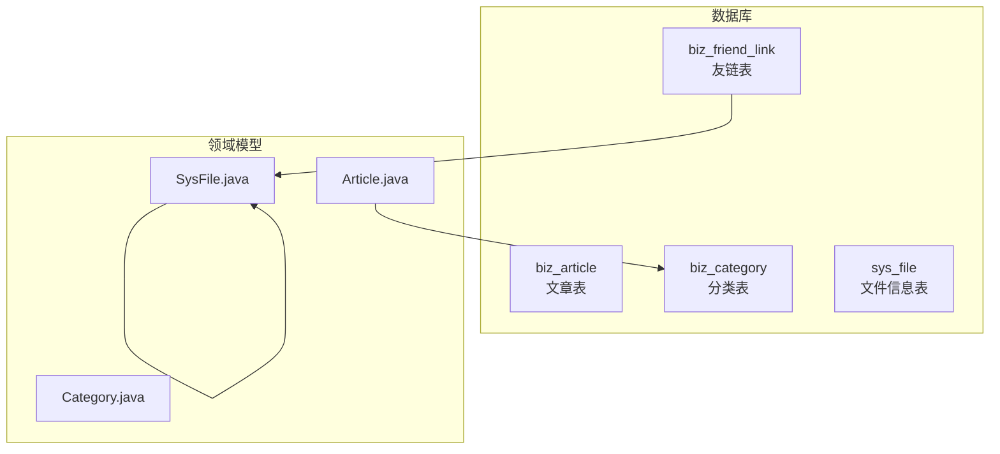
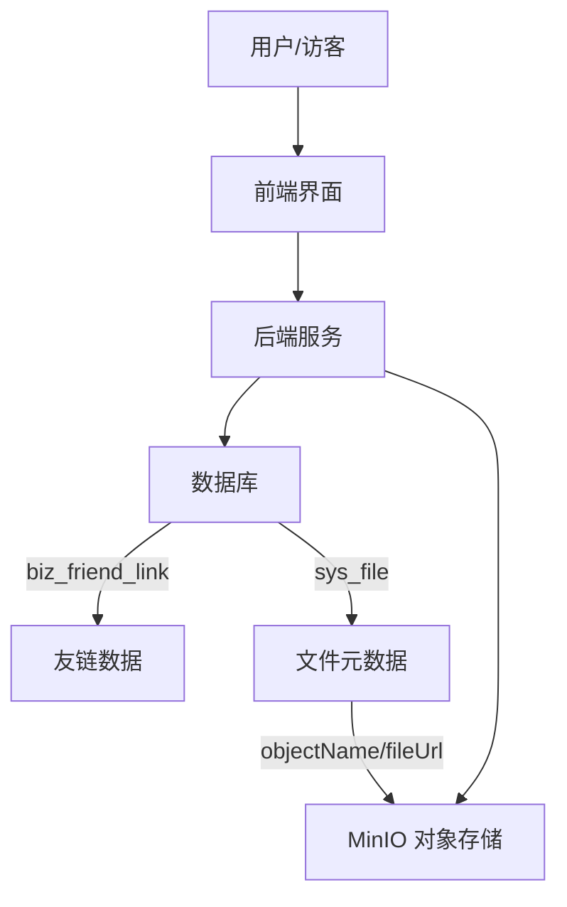
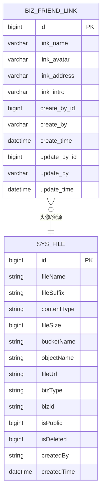
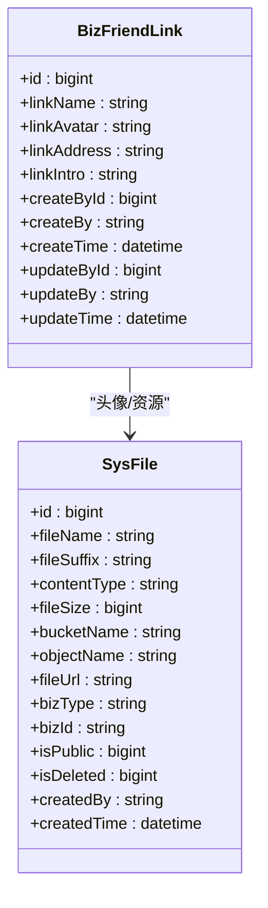

# 友链表设计

<cite>
**本文引用的文件**
- [ry-vue-owner.sql](file://ry-vue-owner.sql)
- [Article.java](file://blog-biz/src/main/java/blog/biz/domain/Article.java)
- [Category.java](file://blog-biz/src/main/java/blog/biz/domain/Category.java)
- [SysFile.java](file://blog-biz/src/main/java/blog/biz/domain/SysFile.java)
</cite>

## 目录
1. [简介](#简介)
2. [项目结构](#项目结构)
3. [核心组件](#核心组件)
4. [架构总览](#架构总览)
5. [详细组件分析](#详细组件分析)
6. [依赖关系分析](#依赖关系分析)
7. [性能考量](#性能考量)
8. [故障排查指南](#故障排查指南)
9. [结论](#结论)
10. [附录](#附录)

## 简介
本设计文档围绕“友链表（biz_friend_link）”展开，系统化阐述其表结构设计、字段语义与约束、元数据审计机制、与博客系统展示与导航的集成方式、数据字典规范、索引与查询优化策略，以及后台管理操作流程。文档同时结合现有代码库中已存在的实体模型与文件存储模型，给出可落地的技术实现建议。

## 项目结构
本项目采用多模块分层架构，其中与友链表直接相关的核心结构来自数据库脚本；与文件存储相关的实体模型位于 blog-biz 模块。下图展示了与友链表相关的结构关系概览：

图表来源
- [ry-vue-owner.sql:350-367](file://ry-vue-owner.sql#L350-L367)
- [Article.java:14-95](file://blog-biz/src/main/java/blog/biz/domain/Article.java#L14-L95)
- [Category.java:10-38](file://blog-biz/src/main/java/blog/biz/domain/Category.java#L10-L38)
- [SysFile.java:11-95](file://blog-biz/src/main/java/blog/biz/domain/SysFile.java#L11-L95)

章节来源
- [ry-vue-owner.sql:350-367](file://ry-vue-owner.sql#L350-L367)

## 核心组件
- 友链表（biz_friend_link）
  - 字段：id、link_name、link_avatar、link_address、link_intro、create_by_id、create_by、create_time、update_by_id、update_by、update_time
  - 约束：非空、长度限制、索引
  - 审计：创建人/时间、更新人/时间
- 文件存储（sys_file）
  - 字段：id、fileName、fileSuffix、contentType、fileSize、bucketName、objectName、fileUrl、bizType、bizId、isPublic、isDeleted、createdBy、createdTime
  - 用途：用于统一管理头像等静态资源，支持 MinIO 存储

章节来源
- [ry-vue-owner.sql:350-367](file://ry-vue-owner.sql#L350-L367)
- [SysFile.java:11-95](file://blog-biz/src/main/java/blog/biz/domain/SysFile.java#L11-L95)

## 架构总览
友链表在系统中的职责与交互如下：
- 数据层：biz_friend_link 存放友链元数据；头像通过 sys_file 统一存储与分发
- 展示层：前端从后端接口获取友链列表并渲染到页面（如“关于我”或独立页面）
- 导航层：友链可作为站点导航的一部分，或在侧边栏/底部展示
- 后台管理：提供友链新增、编辑、删除、排序等功能

图表来源
- [ry-vue-owner.sql:350-367](file://ry-vue-owner.sql#L350-L367)
- [SysFile.java:11-95](file://blog-biz/src/main/java/blog/biz/domain/SysFile.java#L11-L95)

## 详细组件分析

### 表结构与字段设计
- 主键与标识
  - id：自增主键，唯一标识每条友链记录
- 核心字段
  - link_name：友链名称，长度上限 20 字符，非空
  - link_avatar：友链头像，长度上限 255 字符，非空；建议指向 sys_file.objectName 或 fileUrl
  - link_address：友链地址，长度上限 50 字符，非空；建议使用合法 URL
  - link_intro：友链简介，长度上限 100 字符，非空
- 审计字段
  - create_by_id、create_by、create_time：创建人 ID/名称、创建时间
  - update_by_id、update_by、update_time：更新人 ID/名称、更新时间
- 索引
  - 主键索引：PRIMARY KEY(id)
  - 辅助索引：INDEX(fk_friend_link_user(link_name))，便于按名称检索

图表来源
- [ry-vue-owner.sql:350-367](file://ry-vue-owner.sql#L350-L367)
- [SysFile.java:11-95](file://blog-biz/src/main/java/blog/biz/domain/SysFile.java#L11-L95)

章节来源
- [ry-vue-owner.sql:350-367](file://ry-vue-owner.sql#L350-L367)

### 元数据与审计机制
- 审计字段设计遵循通用实践：创建人/时间、更新人/时间，确保数据变更可追溯
- 建议在服务层统一注入 create_by_id、create_by、update_by_id、update_by，避免业务层重复赋值
- 建议对 create_time、update_time 使用数据库默认值或自动填充，保证一致性

章节来源
- [ry-vue-owner.sql:350-367](file://ry-vue-owner.sql#L350-L367)

### 展示位置与作用机制
- 展示位置
  - “关于我”页面：集中展示所有友链，便于访客了解与互链
  - 独立“友链”页面：提供更丰富的展示与筛选能力
  - 侧边栏/底部导航：作为站点导航的一部分，提升可达性
- 作用机制
  - 前端通过接口拉取友链列表，渲染卡片式布局，点击跳转至友链地址
  - 头像通过 sys_file.fileUrl 或 objectName 获取，确保跨域与缓存友好

章节来源
- [ry-vue-owner.sql:350-367](file://ry-vue-owner.sql#L350-L367)
- [SysFile.java:11-95](file://blog-biz/src/main/java/blog/biz/domain/SysFile.java#L11-L95)

### 数据字典与技术规范
- 字段长度与类型
  - link_name：varchar(20)，非空
  - link_avatar：varchar(255)，非空（建议存储 fileUrl 或 objectName）
  - link_address：varchar(50)，非空（建议为合法 URL）
  - link_intro：varchar(100)，非空
- URL 有效性验证
  - 建议在后端校验 link_address 的合法性（协议 http/https、域名格式）
  - 可结合正则表达式与 URL 解析库进行双重校验
- 头像文件存储策略
  - 推荐使用 sys_file 统一管理，字段映射建议：
    - link_avatar 映射到 sys_file.fileUrl 或 objectName
    - bizType 可设为 BIZ_FRIEND_AVATAR，bizId 关联 biz_friend_link.id
  - 支持 MinIO 永久链接，便于 CDN 加速与跨域访问
- 审计字段
  - 建议在持久层或拦截器中统一注入 create_by_id、create_by、update_by_id、update_by

章节来源
- [ry-vue-owner.sql:350-367](file://ry-vue-owner.sql#L350-L367)
- [SysFile.java:11-95](file://blog-biz/src/main/java/blog/biz/domain/SysFile.java#L11-L95)

### 索引设计与查询优化
- 当前索引
  - 主键：id
  - 辅助索引：基于 link_name 的普通索引
- 查询场景与优化建议
  - 按名称模糊匹配：利用 link_name 索引，必要时可增加前缀索引或全文索引（视业务量）
  - 列表分页：按 create_time 或 id 倒序分页，避免全表扫描
  - 联合查询：若需同时查询头像信息，建议通过 JOIN sys_file，确保连接字段有索引
- 索引维护
  - 定期统计表行数与索引碎片率，必要时重建索引
  - 避免过度索引导致写入性能下降

章节来源
- [ry-vue-owner.sql:350-367](file://ry-vue-owner.sql#L350-L367)

### 与导航系统的集成
- 导航来源
  - 友链可作为菜单项出现在“关于我”或“友链”页面
  - 若需要在顶部导航中展示，可在后端聚合友链数据并通过路由/菜单接口下发
- 渲染策略
  - 前端根据返回的友链列表动态渲染导航卡片
  - 支持懒加载与错误兜底（头像加载失败时显示默认占位图）

（本小节为概念性说明，不直接分析具体源码文件）

### 后台管理操作流程
- 新增友链
  - 填写 link_name、link_avatar、link_address、link_intro
  - 提交后由服务层注入审计字段并持久化
- 编辑友链
  - 修改任一字段，提交后更新 update_by、update_time
- 删除友链
  - 支持软删除（标记 isDelete=1）或硬删除（物理删除）
- 排序与展示
  - 可按创建时间倒序或手动排序字段控制展示顺序
- 头像上传
  - 通过文件上传接口生成 sys_file 记录，再将 fileUrl 写入 link_avatar

（本小节为概念性说明，不直接分析具体源码文件）

## 依赖关系分析
- biz_friend_link 与 sys_file 的关系
  - 友链头像通过 sys_file 统一管理，降低耦合度，便于后续迁移与扩展
- 与文章/分类的关系
  - 文章与分类实体存在于同一模块，体现内容与组织维度的清晰分离
- 与文件模型的协同
  - SysFile.java 提供了完整的文件元数据模型，可直接复用以支撑友链头像管理

图表来源
- [ry-vue-owner.sql:350-367](file://ry-vue-owner.sql#L350-L367)
- [SysFile.java:11-95](file://blog-biz/src/main/java/blog/biz/domain/SysFile.java#L11-L95)

章节来源
- [ry-vue-owner.sql:350-367](file://ry-vue-owner.sql#L350-L367)
- [SysFile.java:11-95](file://blog-biz/src/main/java/blog/biz/domain/SysFile.java#L11-L95)

## 性能考量
- 写入性能
  - 控制单次批量导入的事务大小，避免长事务锁表
  - 对 link_name 建立唯一索引可避免重复插入（如需去重）
- 读取性能
  - 列表查询按 create_time 或 id 倒序分页，减少排序开销
  - 头像访问走 CDN 或直链，减少数据库压力
- 存储成本
  - 头像建议统一压缩与裁剪，降低存储与带宽成本
  - 定期清理无效或过期的 sys_file 记录

（本节为通用性能建议，不直接分析具体源码文件）

## 故障排查指南
- 友链无法显示
  - 检查 link_avatar 是否有效（fileUrl/objectName 是否存在）
  - 检查 sys_file.isPublic 与跨域配置
- URL 无效
  - 校验 link_address 协议与域名合法性
  - 建议在接口层增加 URL 校验与异常捕获
- 审计字段缺失
  - 确认服务层是否正确注入 create_by_id、create_by、update_by_id、update_by
  - 检查拦截器或自动填充配置是否生效

章节来源
- [ry-vue-owner.sql:350-367](file://ry-vue-owner.sql#L350-L367)
- [SysFile.java:11-95](file://blog-biz/src/main/java/blog/biz/domain/SysFile.java#L11-L95)

## 结论
友链表（biz_friend_link）以简洁明确的字段设计承载了友链管理的核心需求，并通过 sys_file 实现头像等静态资源的统一治理。配合完善的审计字段与索引策略，可满足日常运营与展示场景。建议在后台管理中强化 URL 校验与头像上传流程，在前端做好懒加载与错误兜底，从而提供稳定、高效的友链体验。

## 附录
- 相关实体参考
  - 文章实体：Article.java
  - 分类实体：Category.java
  - 文件实体：SysFile.java

章节来源
- [Article.java:14-95](file://blog-biz/src/main/java/blog/biz/domain/Article.java#L14-L95)
- [Category.java:10-38](file://blog-biz/src/main/java/blog/biz/domain/Category.java#L10-L38)
- [SysFile.java:11-95](file://blog-biz/src/main/java/blog/biz/domain/SysFile.java#L11-L95)