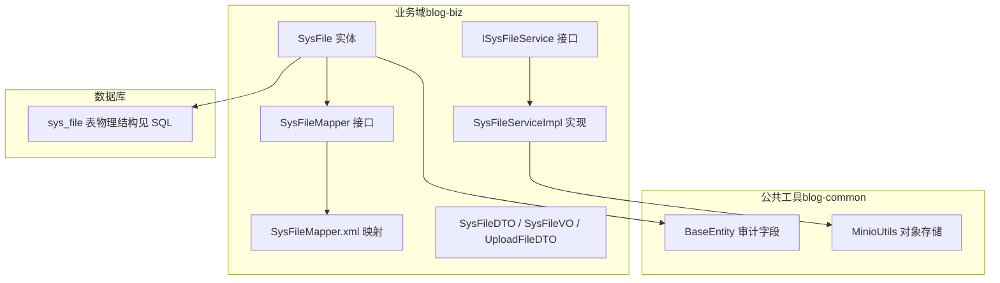
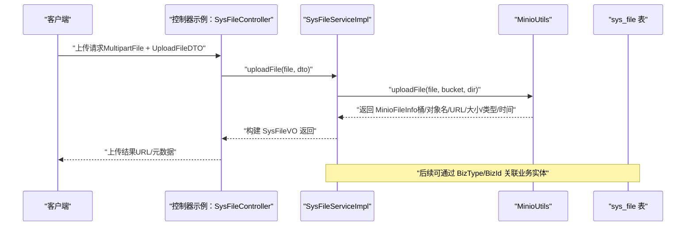
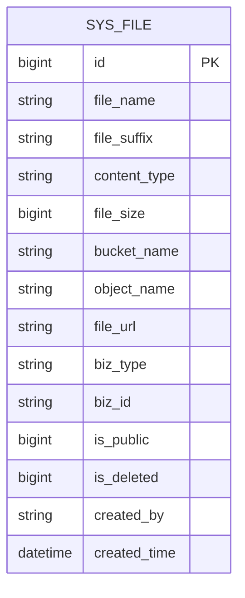
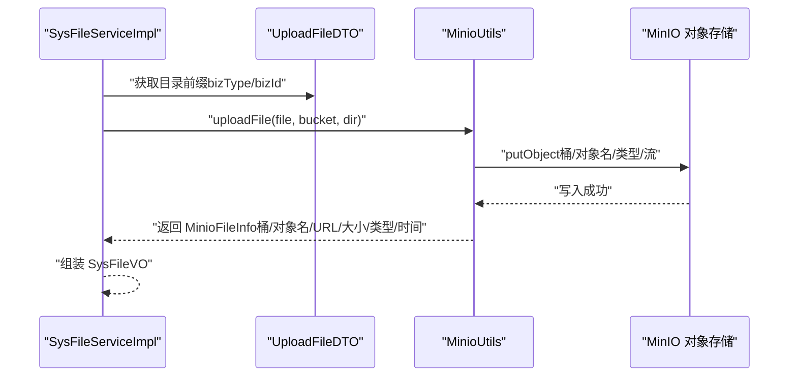
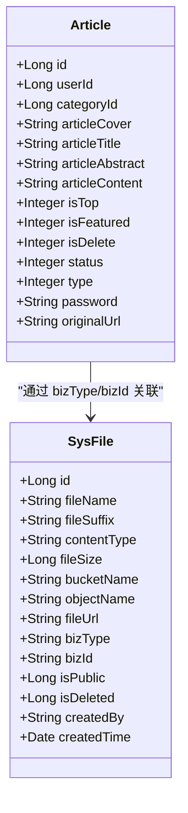
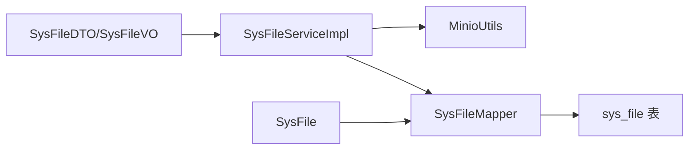

# 文件表设计

<cite>
**本文引用的文件**
- [SysFile.java](file://blog-biz/src/main/java/blog/biz/domain/SysFile.java)
- [SysFileMapper.java](file://blog-biz/src/main/java/blog/biz/mapper/SysFileMapper.java)
- [SysFileMapper.xml](file://blog-biz/src/main/resources/mapper/SysFileMapper.xml)
- [ISysFileService.java](file://blog-biz/src/main/java/blog/biz/service/ISysFileService.java)
- [SysFileServiceImpl.java](file://blog-biz/src/main/java/blog/biz/service/impl/SysFileServiceImpl.java)
- [SysFileDTO.java](file://blog-biz/src/main/java/blog/biz/domain/dto/SysFileDTO.java)
- [SysFileVO.java](file://blog-biz/src/main/java/blog/biz/domain/vo/SysFileVO.java)
- [UploadFileDTO.java](file://blog-biz/src/main/java/blog/biz/domain/dto/UploadFileDTO.java)
- [BaseEntity.java](file://blog-common/src/main/java/blog/common/base/entity/BaseEntity.java)
- [MinioUtils.java](file://blog-common/src/main/java/blog/common/utils/minio/MinioUtils.java)
- [Article.java](file://blog-biz/src/main/java/blog/biz/domain/Article.java)
- [ry-vue-owner.sql](file://ry-vue-owner.sql)
</cite>

## 目录
1. [简介](#简介)
2. [项目结构](#项目结构)
3. [核心组件](#核心组件)
4. [架构总览](#架构总览)
5. [详细组件分析](#详细组件分析)
6. [依赖分析](#依赖分析)
7. [性能考虑](#性能考虑)
8. [故障排查指南](#故障排查指南)
9. [结论](#结论)
10. [附录：数据字典与规范](#附录数据字典与规范)

## 简介
本设计文档围绕“文件表（sys_file）”展开，系统性解析其结构设计、字段含义与约束、与业务实体（如文章）的关联方式、元数据审计字段、软删除策略、索引与性能优化建议，以及与 MinIO 对象存储的集成方案。目标是帮助开发者与运维人员快速理解并正确使用文件表，确保数据一致性与系统稳定性。

## 项目结构
文件表位于业务域（blog-biz），采用典型的分层架构：
- 领域模型：SysFile（实体）
- 数据访问：SysFileMapper（MyBatis Plus 接口）
- 映射文件：SysFileMapper.xml（结果映射）
- 服务接口与实现：ISysFileService、SysFileServiceImpl
- DTO/VO：SysFileDTO、SysFileVO、UploadFileDTO
- 审计基类：BaseEntity
- 对象存储：MinioUtils（封装 MinIO 操作）

**图表来源**
- [SysFile.java:1-95](file://blog-biz/src/main/java/blog/biz/domain/SysFile.java#L1-L95)
- [SysFileMapper.java:1-16](file://blog-biz/src/main/java/blog/biz/mapper/SysFileMapper.java#L1-L16)
- [SysFileMapper.xml:1-24](file://blog-biz/src/main/resources/mapper/SysFileMapper.xml#L1-L24)
- [ISysFileService.java:1-75](file://blog-biz/src/main/java/blog/biz/service/ISysFileService.java#L1-L75)
- [SysFileServiceImpl.java:1-169](file://blog-biz/src/main/java/blog/biz/service/impl/SysFileServiceImpl.java#L1-L169)
- [SysFileDTO.java:1-83](file://blog-biz/src/main/java/blog/biz/domain/dto/SysFileDTO.java#L1-L83)
- [SysFileVO.java:1-114](file://blog-biz/src/main/java/blog/biz/domain/vo/SysFileVO.java#L1-L114)
- [UploadFileDTO.java:1-36](file://blog-biz/src/main/java/blog/biz/domain/dto/UploadFileDTO.java#L1-L36)
- [BaseEntity.java:1-85](file://blog-common/src/main/java/blog/common/base/entity/BaseEntity.java#L1-L85)
- [MinioUtils.java:1-325](file://blog-common/src/main/java/blog/common/utils/minio/MinioUtils.java#L1-L325)

**章节来源**
- [SysFile.java:1-95](file://blog-biz/src/main/java/blog/biz/domain/SysFile.java#L1-L95)
- [SysFileMapper.java:1-16](file://blog-biz/src/main/java/blog/biz/mapper/SysFileMapper.java#L1-L16)
- [SysFileMapper.xml:1-24](file://blog-biz/src/main/resources/mapper/SysFileMapper.xml#L1-L24)
- [ISysFileService.java:1-75](file://blog-biz/src/main/java/blog/biz/service/ISysFileService.java#L1-L75)
- [SysFileServiceImpl.java:1-169](file://blog-biz/src/main/java/blog/biz/service/impl/SysFileServiceImpl.java#L1-L169)
- [SysFileDTO.java:1-83](file://blog-biz/src/main/java/blog/biz/domain/dto/SysFileDTO.java#L1-L83)
- [SysFileVO.java:1-114](file://blog-biz/src/main/java/blog/biz/domain/vo/SysFileVO.java#L1-L114)
- [UploadFileDTO.java:1-36](file://blog-biz/src/main/java/blog/biz/domain/dto/UploadFileDTO.java#L1-L36)
- [BaseEntity.java:1-85](file://blog-common/src/main/java/blog/common/base/entity/BaseEntity.java#L1-L85)
- [MinioUtils.java:1-325](file://blog-common/src/main/java/blog/common/utils/minio/MinioUtils.java#L1-L325)

## 核心组件
- 实体 SysFile：承载文件元数据与业务标识，映射到 sys_file 表。
- Mapper/Xml：定义字段映射与查询能力。
- Service 层：封装上传、查询、分页、删除等业务逻辑，并与 MinIO 集成。
- DTO/VO：用于入参校验、传输与导出展示。
- Audit 基类 BaseEntity：统一注入创建/更新审计字段。
- MinioUtils：封装对象存储上传、URL 生成、列举、删除等操作。

**章节来源**
- [SysFile.java:11-95](file://blog-biz/src/main/java/blog/biz/domain/SysFile.java#L11-L95)
- [SysFileMapper.xml:7-22](file://blog-biz/src/main/resources/mapper/SysFileMapper.xml#L7-L22)
- [SysFileServiceImpl.java:35-169](file://blog-biz/src/main/java/blog/biz/service/impl/SysFileServiceImpl.java#L35-L169)
- [BaseEntity.java:37-70](file://blog-common/src/main/java/blog/common/base/entity/BaseEntity.java#L37-L70)
- [MinioUtils.java:85-182](file://blog-common/src/main/java/blog/common/utils/minio/MinioUtils.java#L85-L182)

## 架构总览
文件表与业务实体（如文章）通过“业务类型+业务ID”进行弱耦合关联；上传流程通过 Service 调用 MinioUtils 完成对象存储写入，并回填 sys_file 的关键字段（桶名、对象名、URL、大小、类型、上传时间等）。查询侧支持按多维条件过滤与分页。

**图表来源**
- [SysFileServiceImpl.java:151-167](file://blog-biz/src/main/java/blog/biz/service/impl/SysFileServiceImpl.java#L151-L167)
- [MinioUtils.java:85-111](file://blog-common/src/main/java/blog/common/utils/minio/MinioUtils.java#L85-L111)
- [UploadFileDTO.java:32-34](file://blog-biz/src/main/java/blog/biz/domain/dto/UploadFileDTO.java#L32-L34)

## 详细组件分析

### 实体与表结构设计
- 字段设计要点
  - 文件名与后缀：fileName、fileSuffix，便于检索与识别扩展名。
  - 内容类型：contentType，便于前端渲染与安全控制。
  - 文件大小：fileSize（字节），统一存储单位，便于排序与容量统计。
  - 存储位置：bucketName（桶）、objectName（对象路径）。
  - 访问地址：fileUrl（临时/永久 URL），便于直接访问。
  - 业务关联：bizType（业务类型）、bizId（业务ID），用于与文章、用户头像等业务实体解耦关联。
  - 可见性：isPublic（0/1），控制是否公开。
  - 软删除：isDeleted（0/1），配合查询过滤实现软删除。
  - 审计：createdBy、createdTime（继承 BaseEntity 注入）。
- 物理表结构参考
  - sys_file 表存在于数据库脚本中，字段与实体一致，包含自增主键、业务字段、审计字段与删除标记等。

**图表来源**
- [SysFile.java:22-91](file://blog-biz/src/main/java/blog/biz/domain/SysFile.java#L22-L91)
- [SysFileMapper.xml:7-22](file://blog-biz/src/main/resources/mapper/SysFileMapper.xml#L7-L22)
- [ry-vue-owner.sql:1324-1380](file://ry-vue-owner.sql#L1324-L1380)

**章节来源**
- [SysFile.java:22-91](file://blog-biz/src/main/java/blog/biz/domain/SysFile.java#L22-L91)
- [SysFileMapper.xml:7-22](file://blog-biz/src/main/resources/mapper/SysFileMapper.xml#L7-L22)
- [ry-vue-owner.sql:1324-1380](file://ry-vue-owner.sql#L1324-L1380)

### 上传流程与对象存储集成
- 上传入口：ISysFileService.uploadFile（MultipartFile + UploadFileDTO）
- 目录组织：UploadFileDTO.getDir() 将 bizType 与 bizId 组合为目录前缀，保证同业务下的文件归档。
- MinIO 写入：MinioUtils.uploadFile 生成随机对象名（UUID + 原始扩展名），自动创建桶，返回 MinioFileInfo。
- 结果落库：SysFileServiceImpl 将 MinioFileInfo 中的桶名、对象名、URL、大小、类型、上传时间等填充到 VO，供上层使用。

**图表来源**
- [SysFileServiceImpl.java:151-167](file://blog-biz/src/main/java/blog/biz/service/impl/SysFileServiceImpl.java#L151-L167)
- [UploadFileDTO.java:32-34](file://blog-biz/src/main/java/blog/biz/domain/dto/UploadFileDTO.java#L32-L34)
- [MinioUtils.java:85-111](file://blog-common/src/main/java/blog/common/utils/minio/MinioUtils.java#L85-L111)

**章节来源**
- [ISysFileService.java:73](file://blog-biz/src/main/java/blog/biz/service/ISysFileService.java#L73)
- [SysFileServiceImpl.java:151-167](file://blog-biz/src/main/java/blog/biz/service/impl/SysFileServiceImpl.java#L151-L167)
- [UploadFileDTO.java:32-34](file://blog-biz/src/main/java/blog/biz/domain/dto/UploadFileDTO.java#L32-L34)
- [MinioUtils.java:85-111](file://blog-common/src/main/java/blog/common/utils/minio/MinioUtils.java#L85-L111)

### 查询与分页
- 条件查询：SysFileServiceImpl.buildQueryWrapper 支持按文件名、后缀、类型、大小、桶名、对象名、URL、业务类型、业务ID、公开性、创建人、创建时间等维度组合查询。
- 分页：基于 PageQuery 构建分页条件，返回 TableDataInfo 包裹的 VO 列表。
- 排序：默认按 ID 升序。

```mermaid
flowchart TD
Start(["开始"]) --> Build["构建 LambdaQueryWrapper"]
Build --> Cond1{"按文件名过滤？"}
Cond1 --> |是| Add1["eq(fileName)"]
Cond1 --> |否| Next1["跳过"]
Add1 --> Next1
Next1 --> Cond2{"按后缀过滤？"}
Cond2 --> |是| Add2["eq(fileSuffix)"]
Cond2 --> |否| Next2["跳过"]
Add2 --> Next2
Next2 --> Cond3{"按类型过滤？"}
Cond3 --> |是| Add3["eq(contentType)"]
Cond3 --> |否| Next3["跳过"]
Add3 --> Next3
Next3 --> Cond4{"按大小过滤？"}
Cond4 --> |是| Add4["eq(fileSize)"]
Cond4 --> |否| Next4["跳过"]
Add4 --> Next4
Next4 --> Cond5{"按桶名过滤？"}
Cond5 --> |是| Add5["like(bucketName)"]
Cond5 --> |否| Next5["跳过"]
Add5 --> Next5
Next5 --> Cond6{"按对象名过滤？"}
Cond6 --> |是| Add6["like(objectName)"]
Cond6 --> |否| Next6["跳过"]
Add6 --> Next6
Next6 --> Cond7{"按URL过滤？"}
Cond7 --> |是| Add7["eq(fileUrl)"]
Cond7 --> |否| Next7["跳过"]
Add7 --> Next7
Next7 --> Cond8{"按业务类型过滤？"}
Cond8 --> |是| Add8["eq(bizType)"]
Cond8 --> |否| Next8["跳过"]
Add8 --> Next8
Next8 --> Cond9{"按业务ID过滤？"}
Cond9 --> |是| Add9["eq(bizId)"]
Cond9 --> |否| Next9["跳过"]
Add9 --> Next9
Next9 --> Cond10{"按公开性过滤？"}
Cond10 --> |是| Add10["eq(isPublic)"]
Cond10 --> |否| Next10["跳过"]
Add10 --> Next10
Next10 --> Cond11{"按创建人过滤？"}
Cond11 --> |是| Add11["eq(createdBy)"]
Cond11 --> |否| Next11["跳过"]
Add11 --> Next11
Next11 --> Cond12{"按创建时间过滤？"}
Cond12 --> |是| Add12["eq(createdTime)"]
Cond12 --> |否| Next12["跳过"]
Add12 --> Next12
Next12 --> Order["按ID升序"]
Order --> Page["分页查询"]
Page --> End(["结束"])
```

**图表来源**
- [SysFileServiceImpl.java:80-97](file://blog-biz/src/main/java/blog/biz/service/impl/SysFileServiceImpl.java#L80-L97)

**章节来源**
- [SysFileServiceImpl.java:62-97](file://blog-biz/src/main/java/blog/biz/service/impl/SysFileServiceImpl.java#L62-L97)

### 与文章表的关联关系
- 弱耦合关联：通过 bizType 与 bizId 关联到业务实体（如文章）。文章实体定义于 Article，包含作者、分类、封面、标题、摘要、内容、状态、类型、密码、原文链接等字段。
- 关联方式：文章内容中的图片链接可指向 sys_file 的 fileUrl；当文章被删除时，可通过 isDelete 字段软删除文章，但文件仍保留，避免内容与资源不一致。
- 建议：在文章编辑器中插入图片时，调用文件上传接口，将返回的 fileUrl 写入文章内容；删除文章时仅更新文章的 isDelete 标记，不删除 sys_file 记录，以保障历史文章仍可访问旧资源。

**图表来源**
- [Article.java:24-94](file://blog-biz/src/main/java/blog/biz/domain/Article.java#L24-L94)
- [SysFile.java:22-91](file://blog-biz/src/main/java/blog/biz/domain/SysFile.java#L22-L91)

**章节来源**
- [Article.java:24-94](file://blog-biz/src/main/java/blog/biz/domain/Article.java#L24-L94)
- [SysFile.java:65-71](file://blog-biz/src/main/java/blog/biz/domain/SysFile.java#L65-L71)

### 元数据管理与审计字段
- 审计字段：继承 BaseEntity，自动注入 createBy、createTime、updateBy、updateTime。
- 上传人与时间：SysFileServiceImpl 在上传成功后可将 created_by 与 created_time 回填至 VO，便于前端展示与导出。
- 建议：在业务层统一设置 createBy、createById 等字段，确保审计完整性。

**章节来源**
- [BaseEntity.java:37-70](file://blog-common/src/main/java/blog/common/base/entity/BaseEntity.java#L37-L70)
- [SysFileServiceImpl.java:155-163](file://blog-biz/src/main/java/blog/biz/service/impl/SysFileServiceImpl.java#L155-L163)

### 软删除实现策略
- 字段：isDeleted（0 否，1 是）。
- 查询策略：默认查询应排除 isDeleted=1 的记录；仅在“回收站/历史查询”场景显式传入 isDeleted 参数。
- 删除策略：SysFileServiceImpl.deleteWithValidByIds 提供批量删除入口，可在业务校验后执行删除（注意：当前实现未直接设置 isDeleted，实际软删需在业务层补充）。

**章节来源**
- [SysFile.java:78-81](file://blog-biz/src/main/java/blog/biz/domain/SysFile.java#L78-L81)
- [SysFileServiceImpl.java:143-149](file://blog-biz/src/main/java/blog/biz/service/impl/SysFileServiceImpl.java#L143-L149)

### 数据模型与字段映射
- 实体与 XML 映射：SysFileMapper.xml 将 Java 字段与数据库列一一对应，确保查询与更新的准确性。
- VO 展示：SysFileVO 用于导出与页面展示，包含 Excel 注解便于报表导出。

**章节来源**
- [SysFileMapper.xml:7-22](file://blog-biz/src/main/resources/mapper/SysFileMapper.xml#L7-L22)
- [SysFileVO.java:36-110](file://blog-biz/src/main/java/blog/biz/domain/vo/SysFileVO.java#L36-L110)

## 依赖分析
- 组件耦合
  - SysFileServiceImpl 依赖 MinioUtils，负责对象存储交互。
  - SysFileMapper 依赖 MyBatis Plus，负责数据持久化。
  - DTO/VO 与实体相互映射，遵循分层职责。
- 外部依赖
  - MinIO 客户端：用于桶创建、文件上传、URL 生成、列举与删除。
  - 数据库：sys_file 表承载文件元数据。

**图表来源**
- [SysFileServiceImpl.java:40-41](file://blog-biz/src/main/java/blog/biz/service/impl/SysFileServiceImpl.java#L40-L41)
- [SysFileMapper.java:13](file://blog-biz/src/main/java/blog/biz/mapper/SysFileMapper.java#L13)
- [MinioUtils.java:28-35](file://blog-common/src/main/java/blog/common/utils/minio/MinioUtils.java#L28-L35)

**章节来源**
- [SysFileServiceImpl.java:40-41](file://blog-biz/src/main/java/blog/biz/service/impl/SysFileServiceImpl.java#L40-L41)
- [SysFileMapper.java:13](file://blog-biz/src/main/java/blog/biz/mapper/SysFileMapper.java#L13)
- [MinioUtils.java:28-35](file://blog-common/src/main/java/blog/common/utils/minio/MinioUtils.java#L28-L35)

## 性能考虑
- 索引设计建议
  - 常用查询维度：bucket_name、object_name、biz_type、biz_id、created_by、created_time、is_deleted。
  - 建议在上述列上建立合适索引，以提升 LIKE/模糊匹配与范围查询性能。
- 上传性能
  - 使用流式上传（MinioUtils 已支持），避免大文件内存占用。
  - URL 生成采用预签名 URL（默认 24 小时），减少鉴权开销。
- 查询优化
  - 分页查询默认按 ID 升序，建议在大数据量场景下增加复合索引或覆盖索引。
  - 对高频过滤条件（如 biz_type、biz_id）建立联合索引，降低扫描成本。
- 缓存策略
  - 对热点文件 URL 可做短期缓存，结合 CDN 加速静态资源访问。

[本节为通用性能建议，无需特定文件引用]

## 故障排查指南
- 上传失败
  - 检查 MinIO 连接配置与桶权限；确认桶存在且可写。
  - 查看 MinioUtils 上传异常堆栈，定位具体原因。
- URL 无法访问
  - 确认 fileUrl 为预签名 URL 或桶具备公开读权限。
  - 校验对象名与桶名是否正确。
- 查询不到数据
  - 检查 isDeleted 过滤条件；默认查询会排除已删除记录。
  - 核对 biz_type、biz_id 是否与业务实体一致。
- 审计字段缺失
  - 确保在业务层正确设置 createBy、createById 等字段，或依赖 BaseEntity 自动填充。

**章节来源**
- [MinioUtils.java:85-111](file://blog-common/src/main/java/blog/common/utils/minio/MinioUtils.java#L85-L111)
- [SysFileServiceImpl.java:151-167](file://blog-biz/src/main/java/blog/biz/service/impl/SysFileServiceImpl.java#L151-L167)
- [BaseEntity.java:37-70](file://blog-common/src/main/java/blog/common/base/entity/BaseEntity.java#L37-L70)

## 结论
文件表（sys_file）通过清晰的字段设计与强健的对象存储集成，实现了与业务实体的弱耦合关联与高效管理。结合 BaseEntity 的审计能力与软删除策略，能够满足生产环境对数据一致性与可追溯性的要求。建议在上线前完善索引与缓存策略，并在业务层严格控制文件生命周期与可见性，确保系统稳定与性能达标。

## 附录：数据字典与规范

- 字段说明（sys_file）
  - id：主键（自增）
  - fileName：原始文件名
  - fileSuffix：文件后缀（如 .jpg、.pdf）
  - contentType：MIME 类型（如 image/jpeg）
  - fileSize：文件大小（字节）
  - bucketName：MinIO 桶名
  - objectName：对象存储路径（含文件名）
  - fileUrl：访问 URL（临时/永久）
  - bizType：业务类型（如 USER_AVATAR、BLOG_IMAGE）
  - bizId：业务 ID（如用户 ID、文章 ID）
  - isPublic：是否公开（0 否，1 是）
  - isDeleted：是否删除（0 否，1 是）
  - createdBy：创建人
  - createdTime：创建时间

- 存储单位
  - 文件大小统一为“字节（Byte）”。

- 文件类型分类标准
  - contentType 使用标准 MIME 类型，如 image/*、video/*、application/pdf 等。

- 文件路径命名规范
  - objectName 由 UploadFileDTO.getDir() 生成目录前缀（bizType/bizId）与 UUID + 原始扩展名组成，保证唯一性与可读性。

- 软删除策略
  - isDeleted=1 标记逻辑删除；默认查询应排除该记录；回收站/历史查询需显式传入 isDeleted 参数。

- 与文章表关联
  - 通过 bizType=biz_article、bizId=文章ID 关联；文章内容中的图片链接指向 sys_file.fileUrl。

**章节来源**
- [SysFile.java:22-91](file://blog-biz/src/main/java/blog/biz/domain/SysFile.java#L22-L91)
- [UploadFileDTO.java:32-34](file://blog-biz/src/main/java/blog/biz/domain/dto/UploadFileDTO.java#L32-L34)
- [Article.java:62-64](file://blog-biz/src/main/java/blog/biz/domain/Article.java#L62-L64)
- [SysFileServiceImpl.java:151-167](file://blog-biz/src/main/java/blog/biz/service/impl/SysFileServiceImpl.java#L151-L167)