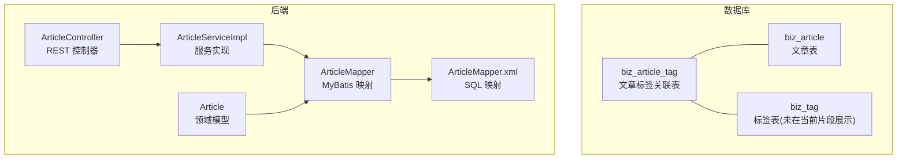
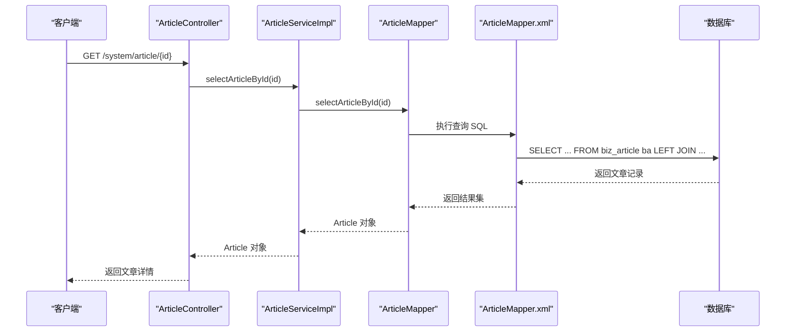
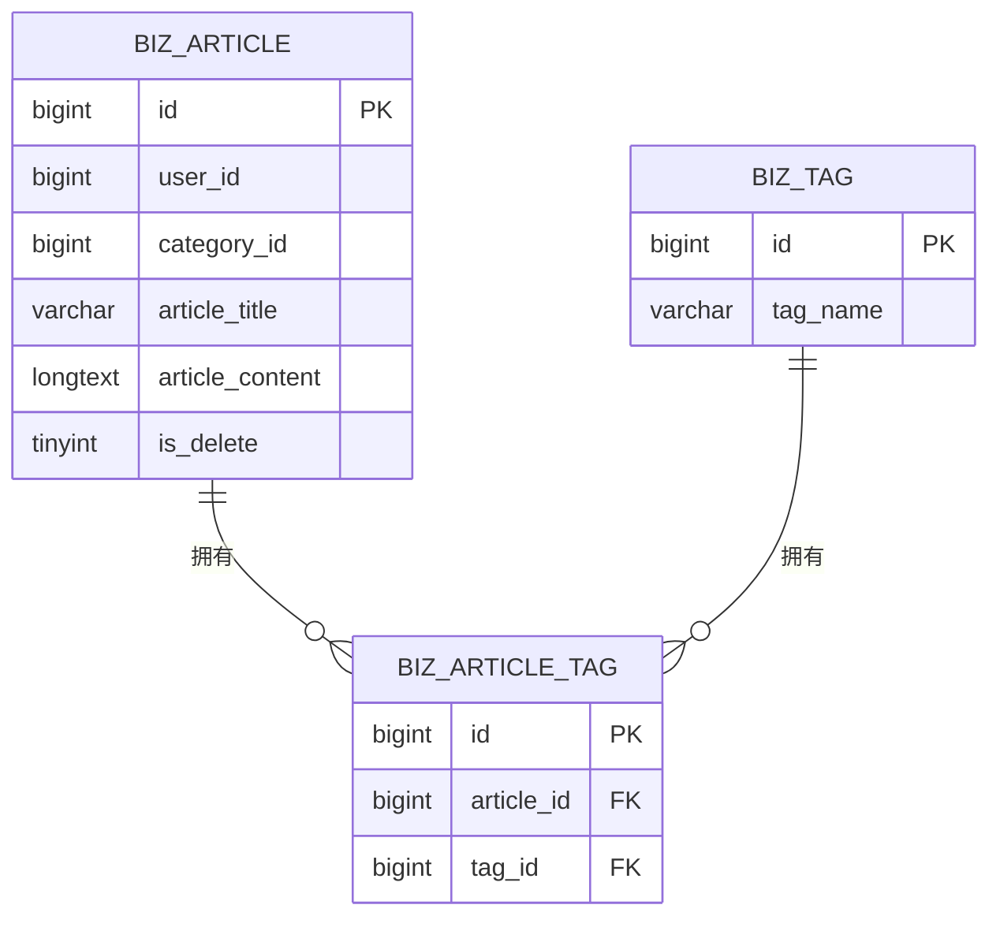
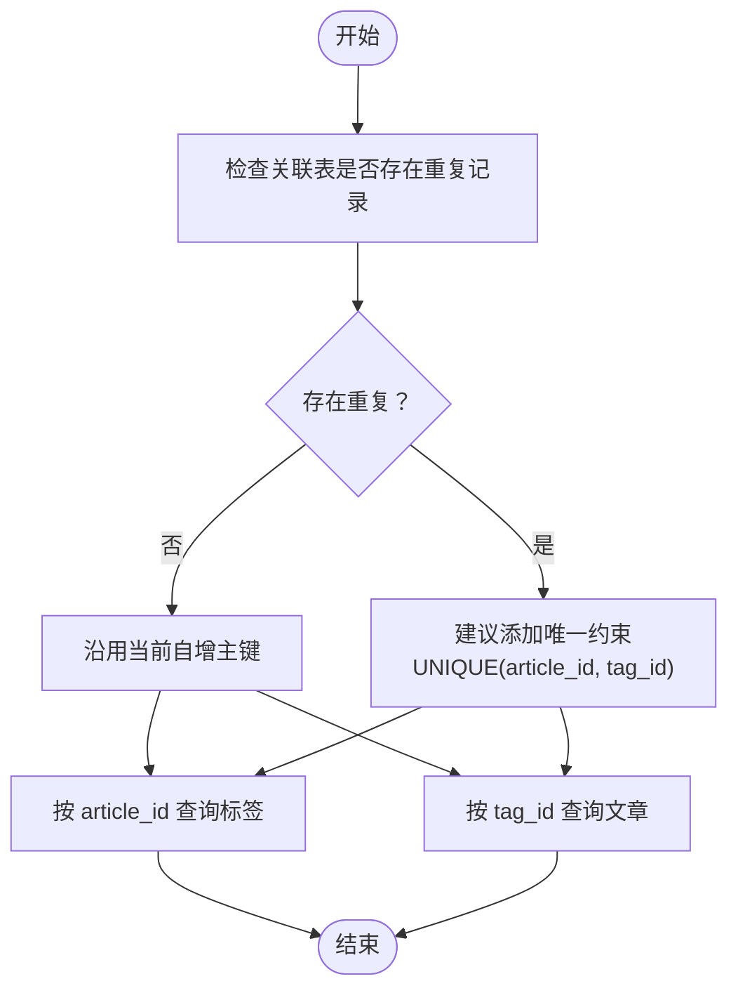
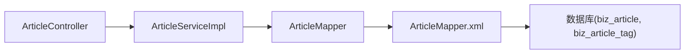

# 文章标签表设计

<cite>
**本文引用的文件**
- [ry-vue-owner.sql](file://ry-vue-owner.sql)
- [Article.java](file://blog-biz/src/main/java/blog/biz/domain/Article.java)
- [ArticleMapper.java](file://blog-biz/src/main/java/blog/biz/mapper/ArticleMapper.java)
- [ArticleMapper.xml](file://blog-biz/src/main/resources/mapper/ArticleMapper.xml)
- [ArticleServiceImpl.java](file://blog-biz/src/main/java/blog/biz/service/impl/ArticleServiceImpl.java)
- [ArticleController.java](file://blog-admin/src/main/java/blog/web/controller/business/ArticleController.java)
</cite>

## 目录
1. [简介](#简介)
2. [项目结构](#项目结构)
3. [核心组件](#核心组件)
4. [架构总览](#架构总览)
5. [详细组件分析](#详细组件分析)
6. [依赖分析](#依赖分析)
7. [性能考量](#性能考量)
8. [故障排查指南](#故障排查指南)
9. [结论](#结论)
10. [附录](#附录)

## 简介
本设计文档围绕“文章标签关联表（biz_article_tag）”展开，系统性阐述其在博客系统中的角色与实现细节。该表采用典型的多对多中间表模式，用于解耦文章与标签之间的复杂关系，支持文章的灵活打标与标签的多文章挂载。本文将从设计理念、字段设计、索引策略、查询与检索机制、数据字典、维护策略与一致性保障等方面进行深入解析，并给出与现有代码库的对应关系与集成方案。

## 项目结构
与文章标签关联表直接相关的代码与资源分布如下：
- 数据库脚本：包含 biz_article_tag 表结构与索引定义
- 文章领域模型与持久化：Article 实体、ArticleMapper 接口与 XML 映射
- 文章服务层：ArticleServiceImpl 提供文章 CRUD 与分页查询能力
- 文章控制层：ArticleController 提供 REST 接口
- 代码生成配置：gen_table、gen_table_column 记录了 biz_article 的元数据，便于理解表结构与字段映射

图表来源
- [ry-vue-owner.sql:280-291](file://ry-vue-owner.sql#L280-L291)
- [ArticleController.java:36-101](file://blog-admin/src/main/java/blog/web/controller/business/ArticleController.java#L36-L101)
- [ArticleServiceImpl.java:21-94](file://blog-biz/src/main/java/blog/biz/service/impl/ArticleServiceImpl.java#L21-L94)
- [ArticleMapper.java:17-65](file://blog-biz/src/main/java/blog/biz/mapper/ArticleMapper.java#L17-L65)
- [ArticleMapper.xml:5-293](file://blog-biz/src/main/resources/mapper/ArticleMapper.xml#L5-L293)
- [Article.java:20-94](file://blog-biz/src/main/java/blog/biz/domain/Article.java#L20-L94)

章节来源
- [ry-vue-owner.sql:280-291](file://ry-vue-owner.sql#L280-L291)
- [ArticleController.java:36-101](file://blog-admin/src/main/java/blog/web/controller/business/ArticleController.java#L36-L101)
- [ArticleServiceImpl.java:21-94](file://blog-biz/src/main/java/blog/biz/service/impl/ArticleServiceImpl.java#L21-L94)
- [ArticleMapper.java:17-65](file://blog-biz/src/main/java/blog/biz/mapper/ArticleMapper.java#L17-L65)
- [ArticleMapper.xml:5-293](file://blog-biz/src/main/resources/mapper/ArticleMapper.xml#L5-L293)
- [Article.java:20-94](file://blog-biz/src/main/java/blog/biz/domain/Article.java#L20-L94)

## 核心组件
- 关联表 biz_article_tag：承载文章与标签的多对多关系，包含自增主键 id、文章外键 article_id、标签外键 tag_id，以及针对两列的二级索引以优化查询。
- 文章实体 Article：映射 biz_article 表，提供文章的基本属性与扩展字段（如作者名、分类名等），并被 MyBatis 识别为 biz_article 的实体映射。
- 文章 Mapper 与 XML：定义文章的查询、新增、更新、删除等 SQL 操作；当前 XML 中未包含与标签关联的查询逻辑，但可扩展。
- 文章服务层：封装文章的业务流程，提供分页查询、新增、修改、批量删除等能力。
- 文章控制器：对外暴露 REST 接口，供前端调用。

章节来源
- [ry-vue-owner.sql:280-291](file://ry-vue-owner.sql#L280-L291)
- [Article.java:20-94](file://blog-biz/src/main/java/blog/biz/domain/Article.java#L20-L94)
- [ArticleMapper.java:17-65](file://blog-biz/src/main/java/blog/biz/mapper/ArticleMapper.java#L17-L65)
- [ArticleMapper.xml:5-293](file://blog-biz/src/main/resources/mapper/ArticleMapper.xml#L5-L293)
- [ArticleServiceImpl.java:21-94](file://blog-biz/src/main/java/blog/biz/service/impl/ArticleServiceImpl.java#L21-L94)
- [ArticleController.java:36-101](file://blog-admin/src/main/java/blog/web/controller/business/ArticleController.java#L36-L101)

## 架构总览
biz_article_tag 作为中间表，将文章与标签解耦，形成灵活的多对多关系。文章侧通过 article_id 关联到 biz_article，标签侧通过 tag_id 关联到 biz_tag（在当前脚本中未展示，但与关联表存在外键约束）。查询时可通过关联表快速定位某文章的所有标签或某标签下的所有文章。

图表来源
- [ArticleController.java:66-70](file://blog-admin/src/main/java/blog/web/controller/business/ArticleController.java#L66-L70)
- [ArticleServiceImpl.java:32-35](file://blog-biz/src/main/java/blog/biz/service/impl/ArticleServiceImpl.java#L32-L35)
- [ArticleMapper.java](file://blog-biz/src/main/java/blog/biz/mapper/ArticleMapper.java#L24)
- [ArticleMapper.xml:126-129](file://blog-biz/src/main/resources/mapper/ArticleMapper.xml#L126-L129)

## 详细组件分析

### 关联表 biz_article_tag 设计要点
- 字段设计
  - id：自增主键，用于唯一标识一条关联记录
  - article_id：文章外键，指向 biz_article.id
  - tag_id：标签外键，指向 biz_tag.id（当前脚本未展示 biz_tag 定义，但与关联表存在外键关系）
- 索引策略
  - 主键索引：PRIMARY KEY (id)，保证每条关联记录唯一
  - 复合索引：分别对 article_id 与 tag_id 建立二级索引，提升按文章查标签、按标签查文章的查询效率
- 复合主键与唯一性
  - 当前表使用自增主键 id，未设置联合唯一索引。若需避免重复关联，可在业务层或数据库层增加唯一约束（例如 UNIQUE(article_id, tag_id)），防止同一文章重复绑定同一标签
- 外键约束
  - 建议在数据库层面为 article_id、tag_id 添加外键约束，确保引用完整性与级联删除行为可控

图表来源
- [ry-vue-owner.sql:280-291](file://ry-vue-owner.sql#L280-L291)

章节来源
- [ry-vue-owner.sql:280-291](file://ry-vue-owner.sql#L280-L291)

### 文章与标签的多对多关系实现机制
- 关系建模
  - 一篇文章可拥有多个标签，一个标签可应用于多篇文章
  - 通过中间表 biz_article_tag 维护这种关系，避免在文章表或标签表中冗余存储数组或逗号分隔字段
- 查询路径
  - 按文章查询标签：以 article_id 为条件查询关联表，再连接标签表获取标签详情
  - 按标签查询文章：以 tag_id 为条件查询关联表，再连接文章表获取文章详情
- 扩展建议
  - 在 ArticleMapper.xml 中增加与标签关联的查询片段，以便在返回文章详情时一并返回标签列表
  - 若未来引入标签统计（如标签使用次数），可在关联表上建立聚合视图或定期任务统计

图表来源
- [ry-vue-owner.sql:280-291](file://ry-vue-owner.sql#L280-L291)

章节来源
- [ry-vue-owner.sql:280-291](file://ry-vue-owner.sql#L280-L291)

### 索引策略对查询性能的影响
- 单列索引
  - article_id 索引：加速“某文章的所有标签”查询
  - tag_id 索引：加速“某标签的所有文章”查询
- 复合唯一索引（建议）
  - 若业务要求同一文章不可重复绑定同一标签，则应添加 UNIQUE(article_id, tag_id)，避免重复关联导致查询结果膨胀
- 联合查询优化
  - 在文章详情查询中，若同时需要作者名与分类名，当前 XML 已通过 LEFT JOIN 实现；若引入标签查询，同样可采用 JOIN 或子查询方式，结合现有索引提升性能

章节来源
- [ry-vue-owner.sql:280-291](file://ry-vue-owner.sql#L280-L291)
- [ArticleMapper.xml:77-81](file://blog-biz/src/main/resources/mapper/ArticleMapper.xml#L77-L81)

### 标签系统在文章检索、分类筛选中的作用机制
- 文章检索
  - 可通过关联表将“标签维度”的过滤条件融入文章查询，例如：WHERE EXISTS(SELECT 1 FROM biz_article_tag WHERE article_id = ba.id AND tag_id IN (...))
- 分类筛选
  - 当前 XML 已支持按分类 ID 进行筛选；标签筛选可采用类似思路，先在关联表中筛选出匹配的文章 ID 集合，再回查文章表
- 性能建议
  - 为 tag_id 建立索引，确保标签筛选的子查询或 JOIN 具备良好性能
  - 对高频筛选条件（如热门标签）可考虑缓存文章 ID 列表

章节来源
- [ArticleMapper.xml:82-124](file://blog-biz/src/main/resources/mapper/ArticleMapper.xml#L82-L124)

### 数据字典
- 关联表：biz_article_tag
  - 字段
    - id：自增主键（bigint，非空）
    - article_id：文章外键（bigint，非空）
    - tag_id：标签外键（bigint，非空）
  - 索引
    - 主键：id
    - 索引：article_id、tag_id
  - 建议约束
    - 唯一约束：UNIQUE(article_id, tag_id)
    - 外键约束：指向 biz_article(id) 与 biz_tag(id)

章节来源
- [ry-vue-owner.sql:280-291](file://ry-vue-owner.sql#L280-L291)

### 关联表的建立时机与业务规则
- 建立时机
  - 文章创建成功后，根据提交的标签列表批量插入 biz_article_tag 记录
  - 标签变更时，先清理旧关联，再插入新关联，确保与提交列表一致
- 业务规则
  - 同一文章不可重复绑定同一标签（建议通过唯一约束强制）
  - 删除文章时，应级联删除关联表中的所有记录（建议外键级联删除）
  - 删除标签时，可选择保留或删除关联记录，取决于业务需求（保留则需处理无效关联）

章节来源
- [ry-vue-owner.sql:280-291](file://ry-vue-owner.sql#L280-L291)

### 标签统计的实现方式
- 使用计数
  - 通过 GROUP BY tag_id 并 COUNT(*) 统计每个标签被使用的次数
- 使用视图
  - 创建视图汇总标签使用次数，定时刷新或异步更新
- 缓存策略
  - 将热门标签及其使用次数缓存于 Redis，降低热点查询压力

章节来源
- [ry-vue-owner.sql:280-291](file://ry-vue-owner.sql#L280-L291)

### 维护策略与数据一致性保障
- 维护策略
  - 定期清理失效关联（如文章或标签被删除后的孤儿记录）
  - 对高频写入场景进行批量插入，减少事务开销
- 一致性保障
  - 使用事务包裹“清理旧关联 + 插入新关联”，确保原子性
  - 引入唯一约束与外键约束，从数据库层面保证引用完整性
  - 对关键路径（文章详情、标签筛选）进行压测与索引优化

章节来源
- [ry-vue-owner.sql:280-291](file://ry-vue-owner.sql#L280-L291)

### 与标签系统的集成方案
- 前端交互
  - 文章编辑页面提供标签选择器，提交时将标签 ID 列表传给后端
- 后端处理
  - 控制器接收标签列表，服务层执行“删除旧关联 + 插入新关联”的流程
  - 若需返回文章详情及标签列表，可在 Mapper XML 中增加 JOIN 查询
- 代码生成与扩展
  - 可参考 gen_table、gen_table_column 的元数据，为标签表与关联表生成对应的实体、Mapper 与 XML

章节来源
- [ArticleController.java:76-90](file://blog-admin/src/main/java/blog/web/controller/business/ArticleController.java#L76-L90)
- [ArticleServiceImpl.java:55-71](file://blog-biz/src/main/java/blog/biz/service/impl/ArticleServiceImpl.java#L55-L71)
- [ArticleMapper.xml:55-124](file://blog-biz/src/main/resources/mapper/ArticleMapper.xml#L55-L124)

## 依赖分析
- 控制层依赖服务层，服务层依赖 Mapper 接口，Mapper 通过 XML 执行 SQL
- 关联表依赖文章表与标签表，当前脚本展示了文章与关联表的依赖关系
- 查询依赖索引，文章详情查询已通过 LEFT JOIN 实现，标签查询可沿用相同模式

图表来源
- [ArticleController.java:36-101](file://blog-admin/src/main/java/blog/web/controller/business/ArticleController.java#L36-L101)
- [ArticleServiceImpl.java:21-94](file://blog-biz/src/main/java/blog/biz/service/impl/ArticleServiceImpl.java#L21-L94)
- [ArticleMapper.java:17-65](file://blog-biz/src/main/java/blog/biz/mapper/ArticleMapper.java#L17-L65)
- [ArticleMapper.xml:5-293](file://blog-biz/src/main/resources/mapper/ArticleMapper.xml#L5-L293)

章节来源
- [ArticleController.java:36-101](file://blog-admin/src/main/java/blog/web/controller/business/ArticleController.java#L36-L101)
- [ArticleServiceImpl.java:21-94](file://blog-biz/src/main/java/blog/biz/service/impl/ArticleServiceImpl.java#L21-L94)
- [ArticleMapper.java:17-65](file://blog-biz/src/main/java/blog/biz/mapper/ArticleMapper.java#L17-L65)
- [ArticleMapper.xml:5-293](file://blog-biz/src/main/resources/mapper/ArticleMapper.xml#L5-L293)

## 性能考量
- 索引覆盖
  - 为 article_id 与 tag_id 建立索引，确保按文章查标签、按标签查文章的查询高效
- 批量写入
  - 标签分配采用批量插入，减少事务次数与网络往返
- 查询优化
  - 在文章详情查询中复用 JOIN 模式，避免 N+1 查询
- 缓存与统计
  - 对热门标签与文章列表进行缓存，降低数据库压力

## 故障排查指南
- 关联重复
  - 现象：同一文章出现重复标签
  - 排查：检查是否缺少唯一约束；确认业务流程是否正确清理旧关联后再插入
- 查询异常
  - 现象：按标签筛选文章耗时过长
  - 排查：确认 tag_id 索引是否存在；评估查询计划与数据分布
- 外键约束失败
  - 现象：插入或删除失败提示违反外键约束
  - 排查：确认目标文章或标签是否存在且未被逻辑删除

章节来源
- [ry-vue-owner.sql:280-291](file://ry-vue-owner.sql#L280-L291)
- [ArticleMapper.xml:82-124](file://blog-biz/src/main/resources/mapper/ArticleMapper.xml#L82-L124)

## 结论
biz_article_tag 通过简洁而稳健的结构实现了文章与标签的多对多解耦，配合合理的索引与约束，能够满足日常检索与筛选需求。建议在现有基础上补充唯一约束与外键约束，并在服务层完善“标签分配”的事务性处理，以进一步提升一致性与可维护性。同时，可按需扩展查询与统计能力，支撑更丰富的标签运营场景。

## 附录
- 代码生成元数据参考
  - biz_article 的表与列元数据由 gen_table、gen_table_column 记录，可用于理解字段映射与生成策略

章节来源
- [ry-vue-owner.sql:405-470](file://ry-vue-owner.sql#L405-L470)