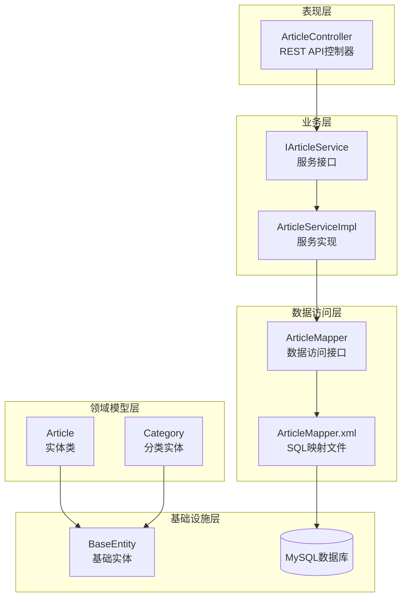
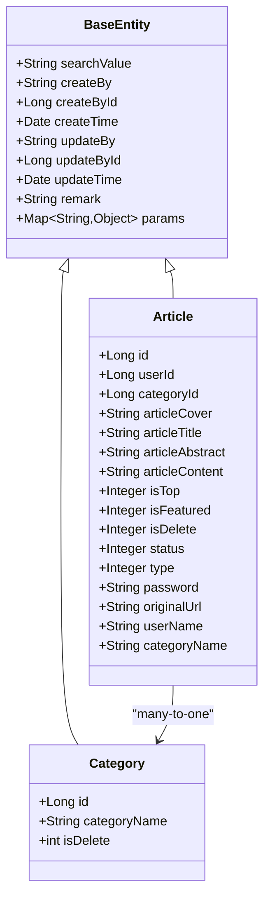
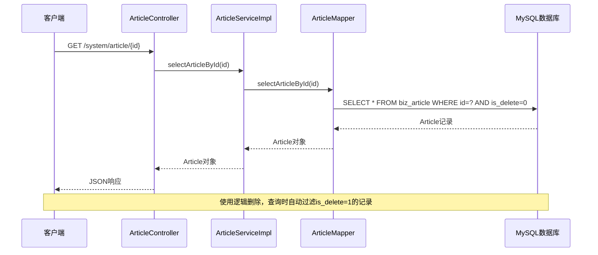
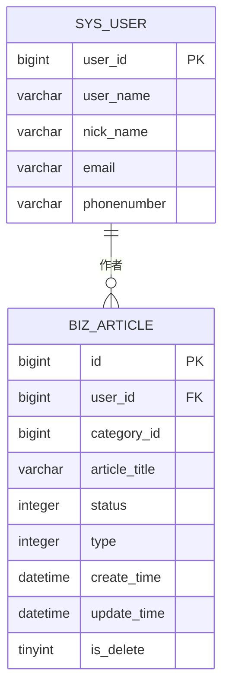
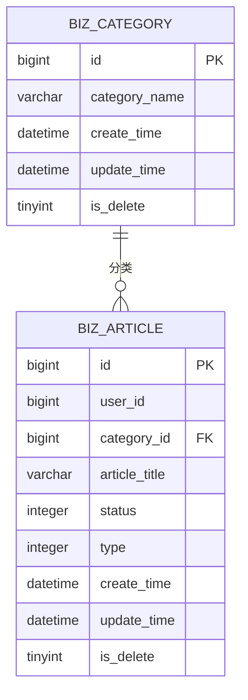
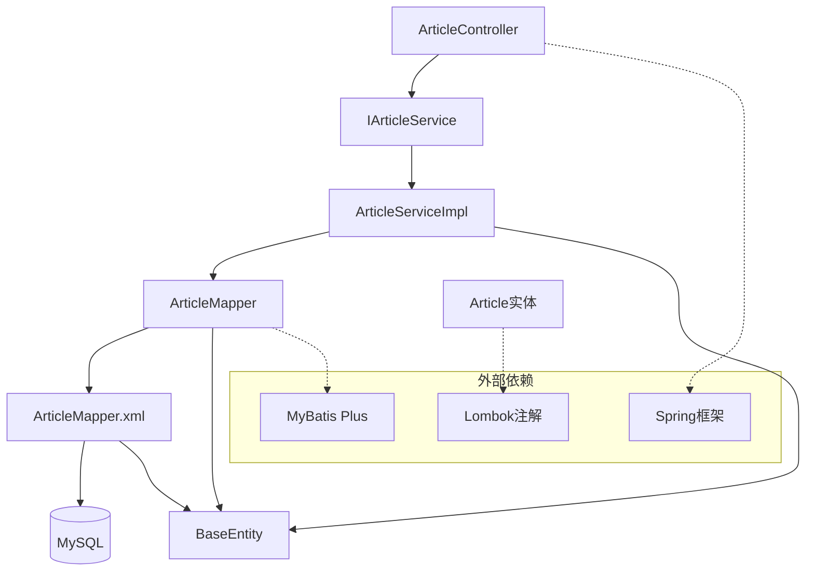
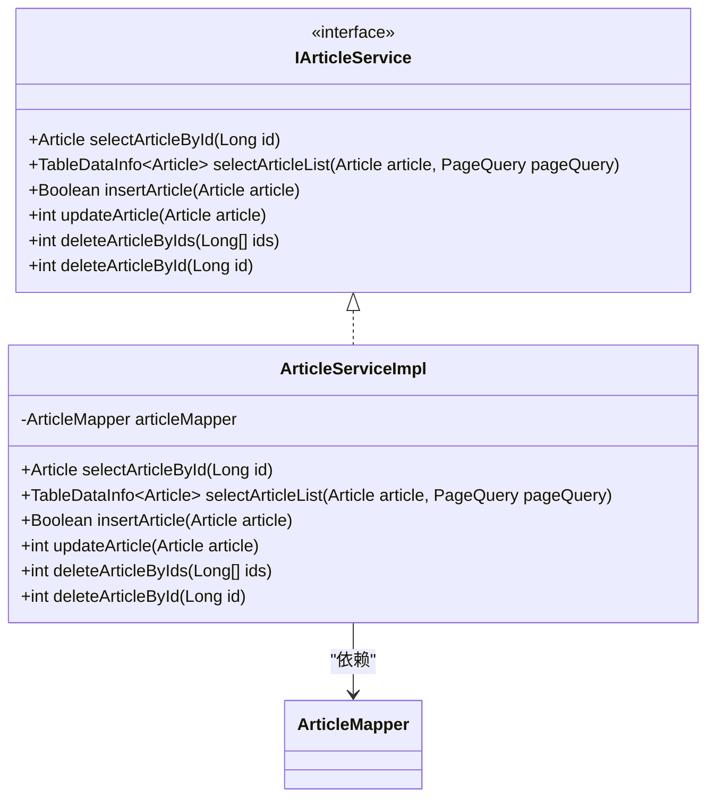
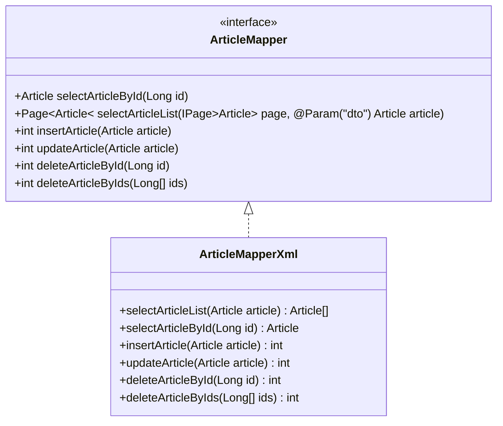

# 文章表设计

<cite>
**本文档引用的文件**
- [Article.java](file://blog-biz/src/main/java/blog/biz/domain/Article.java)
- [ArticleMapper.java](file://blog-biz/src/main/java/blog/biz/mapper/ArticleMapper.java)
- [ArticleMapper.xml](file://blog-biz/src/main/resources/mapper/ArticleMapper.xml)
- [ArticleServiceImpl.java](file://blog-biz/src/main/java/blog/biz/service/impl/ArticleServiceImpl.java)
- [IArticleService.java](file://blog-biz/src/main/java/blog/biz/service/IArticleService.java)
- [BaseEntity.java](file://blog-common/src/main/java/blog/common/base/entity/BaseEntity.java)
- [ry-vue-owner.sql](file://ry-vue-owner.sql)
- [Category.java](file://blog-biz/src/main/java/blog/biz/domain/Category.java)
- [CategoryMapper.java](file://blog-biz/src/main/java/blog/biz/mapper/CategoryMapper.java)
- [ArticleController.java](file://blog-admin/src/main/java/blog/web/controller/business/ArticleController.java)
</cite>

## 目录
1. [简介](#简介)
2. [项目结构](#项目结构)
3. [核心组件](#核心组件)
4. [架构概览](#架构概览)
5. [详细组件分析](#详细组件分析)
6. [依赖关系分析](#依赖关系分析)
7. [性能考虑](#性能考虑)
8. [故障排除指南](#故障排除指南)
9. [结论](#结论)

## 简介

本文档详细分析了博客系统中的文章表（biz_article）设计，这是一个基于Spring Boot + MyBatis Plus + MySQL的现代化博客系统的核心数据表。文章表采用逻辑删除设计，支持多种文章状态和类型，并集成了完整的权限控制和审计功能。

## 项目结构

该博客系统采用分层架构设计，主要包含以下核心模块：

**图表来源**
- [ArticleController.java:36-101](file://blog-admin/src/main/java/blog/web/controller/business/ArticleController.java#L36-L101)
- [IArticleService.java:14-63](file://blog-biz/src/main/java/blog/biz/service/IArticleService.java#L14-L63)
- [ArticleServiceImpl.java:21-94](file://blog-biz/src/main/java/blog/biz/service/impl/ArticleServiceImpl.java#L21-L94)

**章节来源**
- [ArticleController.java:36-101](file://blog-admin/src/main/java/blog/web/controller/business/ArticleController.java#L36-L101)
- [IArticleService.java:14-63](file://blog-biz/src/main/java/blog/biz/service/IArticleService.java#L14-L63)
- [ArticleServiceImpl.java:21-94](file://blog-biz/src/main/java/blog/biz/service/impl/ArticleServiceImpl.java#L21-L94)

## 核心组件

### 数据库表结构

文章表（biz_article）采用完整的字段设计，支持丰富的博客功能：

| 字段名 | 数据类型 | 约束 | 默认值 | 描述 |
|--------|----------|------|--------|------|
| id | bigint | 主键, 自增 | 无 | 文章唯一标识符 |
| user_id | bigint | NOT NULL | 无 | 作者用户ID，关联sys_user表 |
| category_id | bigint | NULL | NULL | 文章分类ID，关联biz_category表 |
| article_cover | varchar(1024) | NULL | NULL | 文章封面图片URL，支持多张图片 |
| article_title | varchar(50) | NOT NULL | '' | 文章标题，最大50字符 |
| article_abstract | varchar(500) | NULL | NULL | 文章摘要，最大500字符 |
| article_content | longtext | NULL | NULL | 文章正文内容，支持长文本 |
| is_top | tinyint(1) | NOT NULL | 0 | 是否置顶，0否1是 |
| is_featured | tinyint(1) | NOT NULL | 0 | 是否推荐，0否1是 |
| status | tinyint(1) | NOT NULL | 1 | 文章状态：1公开2私密3草稿 |
| type | tinyint(1) | NOT NULL | 1 | 文章类型：1原创2转载3翻译 |
| password | varchar(255) | NULL | NULL | 访问密码，用于私密文章 |
| original_url | varchar(255) | NULL | NULL | 原文链接，用于转载文章 |
| create_by_id | bigint | NOT NULL | 无 | 创建人ID |
| create_by | varchar(50) | NOT NULL | 无 | 创建人姓名 |
| create_time | datetime | NOT NULL | CURRENT_TIMESTAMP | 创建时间 |
| update_by_id | bigint | NULL | NULL | 更新人ID |
| update_by | varchar(50) | NULL | NULL | 更新人姓名 |
| update_time | datetime | NULL | NULL | 更新时间 |
| is_delete | tinyint(1) | NOT NULL | 0 | 逻辑删除标志，0存在1删除 |

**章节来源**
- [ry-vue-owner.sql:241-263](file://ry-vue-owner.sql#L241-L263)

### 实体类设计

文章实体类采用Lombok注解简化代码，继承基础实体类提供审计功能：

**图表来源**
- [BaseEntity.java:22-84](file://blog-common/src/main/java/blog/common/base/entity/BaseEntity.java#L22-L84)
- [Article.java:24-94](file://blog-biz/src/main/java/blog/biz/domain/Article.java#L24-L94)
- [Category.java:19-37](file://blog-biz/src/main/java/blog/biz/domain/Category.java#L19-L37)

**章节来源**
- [Article.java:24-94](file://blog-biz/src/main/java/blog/biz/domain/Article.java#L24-L94)
- [BaseEntity.java:22-84](file://blog-common/src/main/java/blog/common/base/entity/BaseEntity.java#L22-L84)

## 架构概览

系统采用经典的三层架构模式，结合MyBatis Plus ORM框架：

**图表来源**
- [ArticleController.java:66-70](file://blog-admin/src/main/java/blog/web/controller/business/ArticleController.java#L66-L70)
- [ArticleServiceImpl.java:32-35](file://blog-biz/src/main/java/blog/biz/service/impl/ArticleServiceImpl.java#L32-L35)
- [ArticleMapper.xml:126-129](file://blog-biz/src/main/resources/mapper/ArticleMapper.xml#L126-L129)

**章节来源**
- [ArticleController.java:66-70](file://blog-admin/src/main/java/blog/web/controller/business/ArticleController.java#L66-L70)
- [ArticleServiceImpl.java:32-35](file://blog-biz/src/main/java/blog/biz/service/impl/ArticleServiceImpl.java#L32-L35)

## 详细组件分析

### 字段设计详解

#### 核心业务字段

**文章标题（article_title）**
- 数据类型：varchar(50)
- 设计理念：限制标题长度确保界面显示效果和数据库索引效率
- 取值范围：1-50字符
- 空值处理：NOT NULL，默认空字符串

**文章摘要（article_abstract）**
- 数据类型：varchar(500)
- 设计理念：支持简短摘要展示，为空时可由系统自动生成
- 取值范围：0-500字符
- 空值处理：NULL，系统默认取文章前500字符

**文章内容（article_content）**
- 数据类型：longtext
- 设计理念：支持长文本内容，满足博客文章的丰富内容需求
- 取值范围：最大约4GB
- 空值处理：NULL

#### 状态管理字段

**状态字段（status）**
- 数据类型：tinyint(1)
- 设计值：1公开、2私密、3草稿
- 业务逻辑：
  - 公开：对外可见，支持全文搜索
  - 私密：仅作者可见或通过密码访问
  - 草稿：仅作者可见，不参与公开展示

**置顶字段（is_top）**
- 数据类型：tinyint(1)
- 设计值：0否、1是
- 业务逻辑：置顶文章在列表中优先显示

**推荐字段（is_featured）**
- 数据类型：tinyint(1)
- 设计值：0否、1是
- 业务逻辑：推荐文章在首页特殊展示

#### 类型区分字段

**文章类型（type）**
- 数据类型：tinyint(1)
- 设计值：1原创、2转载、3翻译
- 不同处理方式：
  - 原创：拥有完整版权，支持全文展示
  - 转载：注明来源，可能包含原文链接
  - 翻译：注明来源翻译来源

#### 访问控制字段

**访问密码（password）**
- 数据类型：varchar(255)
- 设计理念：为私密文章提供访问保护
- 使用场景：私密文章的密码验证

**原文链接（original_url）**
- 数据类型：varchar(255)
- 设计理念：记录转载或翻译文章的原始出处
- 业务价值：维护版权信息和知识溯源

**章节来源**
- [Article.java:46-80](file://blog-biz/src/main/java/blog/biz/domain/Article.java#L46-L80)
- [ry-vue-owner.sql:246-254](file://ry-vue-owner.sql#L246-L254)

### 关联关系设计

#### 与用户表的关联

文章表通过user_id字段关联用户表（sys_user），实现作者身份识别：

**图表来源**
- [ry-vue-owner.sql:243](file://ry-vue-owner.sql#L243)
- [ry-vue-owner.sql:1255-1279](file://ry-vue-owner.sql#L1255-L1279)

#### 与分类表的关联

文章表通过category_id字段关联分类表（biz_category），实现内容分类管理：

**图表来源**
- [ry-vue-owner.sql:244](file://ry-vue-owner.sql#L244)
- [ry-vue-owner.sql:299-312](file://ry-vue-owner.sql#L299-L312)

**章节来源**
- [ArticleMapper.xml:77-81](file://blog-biz/src/main/resources/mapper/ArticleMapper.xml#L77-L81)
- [Category.java:24-30](file://blog-biz/src/main/java/blog/biz/domain/Category.java#L24-L30)

### 索引设计策略

#### 主键索引
- **主键**：PRIMARY KEY (id)
- **作用**：唯一标识每篇文章，保证数据完整性

#### 逻辑删除索引
- **逻辑删除**：is_delete字段
- **作用**：支持软删除，避免物理删除造成的数据丢失

#### 查询优化索引
根据业务查询需求，建议添加以下索引：
- `idx_user_status` (user_id, status)：按作者和状态查询
- `idx_category_status` (category_id, status)：按分类和状态查询
- `idx_create_time` (create_time)：按发布时间排序
- `idx_status_type` (status, type)：按状态和类型组合查询

**章节来源**
- [ry-vue-owner.sql:262](file://ry-vue-owner.sql#L262)

### 数据约束条件

#### 字段约束
- **NOT NULL约束**：user_id、article_title、create_by_id、create_by、create_time
- **默认值约束**：is_top=0、is_featured=0、status=1、type=1、is_delete=0
- **长度约束**：article_title(50)、article_abstract(500)、article_cover(1024)

#### 外键约束
- **user_id**：引用sys_user.user_id
- **category_id**：引用biz_category.id

**章节来源**
- [ry-vue-owner.sql:242-263](file://ry-vue-owner.sql#L242-L263)

## 依赖关系分析

### 组件耦合度分析

**图表来源**
- [ArticleController.java:39-40](file://blog-admin/src/main/java/blog/web/controller/business/ArticleController.java#L39-L40)
- [ArticleServiceImpl.java:23-24](file://blog-biz/src/main/java/blog/biz/service/impl/ArticleServiceImpl.java#L23-L24)

### 服务层设计

服务层采用接口+实现的模式，提供清晰的业务逻辑封装：

**图表来源**
- [IArticleService.java:14-63](file://blog-biz/src/main/java/blog/biz/service/IArticleService.java#L14-L63)
- [ArticleServiceImpl.java:22-94](file://blog-biz/src/main/java/blog/biz/service/impl/ArticleServiceImpl.java#L22-L94)

**章节来源**
- [IArticleService.java:14-63](file://blog-biz/src/main/java/blog/biz/service/IArticleService.java#L14-L63)
- [ArticleServiceImpl.java:22-94](file://blog-biz/src/main/java/blog/biz/service/impl/ArticleServiceImpl.java#L22-L94)

### 数据访问层设计

数据访问层采用MyBatis Plus的通用Mapper接口，提供CRUD操作：

**图表来源**
- [ArticleMapper.java:17-65](file://blog-biz/src/main/java/blog/biz/mapper/ArticleMapper.java#L17-L65)
- [ArticleMapper.xml:126-292](file://blog-biz/src/main/resources/mapper/ArticleMapper.xml#L126-L292)

**章节来源**
- [ArticleMapper.java:17-65](file://blog-biz/src/main/java/blog/biz/mapper/ArticleMapper.java#L17-L65)
- [ArticleMapper.xml:126-292](file://blog-biz/src/main/resources/mapper/ArticleMapper.xml#L126-L292)

## 性能考虑

### 查询性能优化

1. **索引策略**
   - 主键索引确保所有查询的基础性能
   - 建议添加复合索引以优化常用查询模式

2. **分页查询**
   - 使用MyBatis Plus的分页插件
   - 合理设置页面大小，避免大数据量查询

3. **缓存策略**
   - 对热点文章内容可考虑Redis缓存
   - 缓存失效策略需考虑内容更新时机

### 存储优化

1. **大字段处理**
   - article_content使用longtext，注意磁盘空间管理
   - 可考虑内容压缩存储策略

2. **图片资源**
   - article_cover支持多图片URL存储
   - 建议使用CDN加速图片加载

### 安全考虑

1. **SQL注入防护**
   - MyBatis Plus自动防止SQL注入
   - 参数绑定确保安全

2. **权限控制**
   - Spring Security集成权限验证
   - 基于角色的访问控制

## 故障排除指南

### 常见问题诊断

**问题1：文章查询结果为空**
- 检查is_delete字段是否为1
- 验证status字段是否为1（公开）
- 确认用户权限是否足够

**问题2：文章内容显示异常**
- 检查article_content字段是否为空
- 验证数据库连接是否正常
- 确认MyBatis映射配置正确

**问题3：逻辑删除问题**
- 确认查询SQL是否包含is_delete=0条件
- 检查实体类是否正确映射逻辑删除字段

### 性能问题排查

**慢查询诊断**
- 使用EXPLAIN分析查询计划
- 检查索引使用情况
- 优化WHERE条件和JOIN操作

**内存溢出问题**
- 检查大文本字段的处理方式
- 优化分页查询参数
- 考虑内容分页加载策略

**章节来源**
- [ArticleMapper.xml:82-124](file://blog-biz/src/main/resources/mapper/ArticleMapper.xml#L82-L124)
- [ArticleServiceImpl.java:44-47](file://blog-biz/src/main/java/blog/biz/service/impl/ArticleServiceImpl.java#L44-L47)

## 结论

文章表（biz_article）设计体现了现代博客系统的核心需求：

1. **完整性设计**：完整的字段覆盖博客系统的所有核心功能
2. **扩展性考虑**：支持多种文章类型和状态管理
3. **安全性保障**：逻辑删除和权限控制确保数据安全
4. **性能优化**：合理的索引设计和查询策略
5. **易用性**：简洁的API接口和清晰的业务逻辑

该设计为博客系统的稳定运行提供了坚实的数据基础，支持未来功能扩展和性能优化需求。