# 核心业务表设计

<cite>
**本文档引用的文件**
- [Article.java](file://blog-biz/src/main/java/blog/biz/domain/Article.java)
- [Category.java](file://blog-biz/src/main/java/blog/biz/domain/Category.java)
- [SysFile.java](file://blog-biz/src/main/java/blog/biz/domain/SysFile.java)
- [BaseEntity.java](file://blog-common/src/main/java/blog/common/base/entity/BaseEntity.java)
- [ry-vue-owner.sql](file://ry-vue-owner.sql)
- [ArticleMapper.xml](file://blog-biz/src/main/resources/mapper/ArticleMapper.xml)
- [CategoryMapper.xml](file://blog-biz/src/main/resources/mapper/CategoryMapper.xml)
- [CategoryDTO.java](file://blog-biz/src/main/java/blog/biz/domain/dto/CategoryDTO.java)
- [CategoryVO.java](file://blog-biz/src/main/java/blog/biz/domain/vo/CategoryVO.java)
</cite>

## 目录
1. [简介](#简介)
2. [项目结构概览](#项目结构概览)
3. [核心业务表总览](#核心业务表总览)
4. [文章表（biz_article）详细设计](#文章表biz_article详细设计)
5. [分类表（biz_category）详细设计](#分类表biz_category详细设计)
6. [文件表（sys_file）详细设计](#文件表sys_file详细设计)
7. [表间关系与约束](#表间关系与约束)
8. [业务字段与枚举设计](#业务字段与枚举设计)
9. [数据模型与ER图](#数据模型与er图)
10. [索引设计与性能考量](#索引设计与性能考量)
11. [数据字典与业务规则](#数据字典与业务规则)
12. [总结](#总结)

## 简介

本文档详细解析了博客系统的核心业务表设计，重点涵盖文章表（biz_article）、分类表（biz_category）和文件表（sys_file）的设计思路、字段定义、约束条件、索引设计以及表间关系。通过对数据库层面的技术实现进行深入分析，帮助开发者全面理解业务表的设计原理和实现细节。

## 项目结构概览

博客系统采用分层架构设计，核心业务实体位于`blog-biz`模块，基础实体位于`blog-common`模块，数据库结构定义在`ry-vue-owner.sql`文件中。

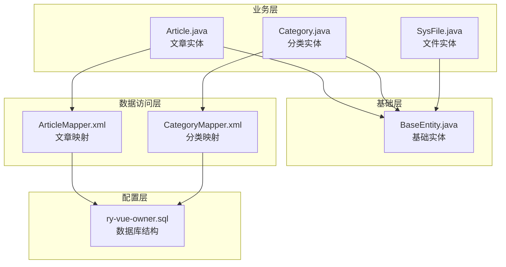

**图表来源**
- [Article.java:1-95](file://blog-biz/src/main/java/blog/biz/domain/Article.java#L1-L95)
- [Category.java:1-38](file://blog-biz/src/main/java/blog/biz/domain/Category.java#L1-L38)
- [SysFile.java:1-95](file://blog-biz/src/main/java/blog/biz/domain/SysFile.java#L1-L95)
- [BaseEntity.java:1-85](file://blog-common/src/main/java/blog/common/base/entity/BaseEntity.java#L1-L85)

## 核心业务表总览

系统包含三个核心业务表，每个表都遵循统一的建模规范：

| 表名 | 实体类 | 描述 | 主要字段数量 |
|------|--------|------|-------------|
| biz_article | Article | 文章内容管理 | 18个业务字段 |
| biz_category | Category | 文章分类管理 | 6个业务字段 |
| sys_file | SysFile | 文件资源管理 | 15个业务字段 |

## 文章表（biz_article）详细设计

### 表结构定义

文章表是博客系统的核心表，负责存储所有文章内容及相关元数据。

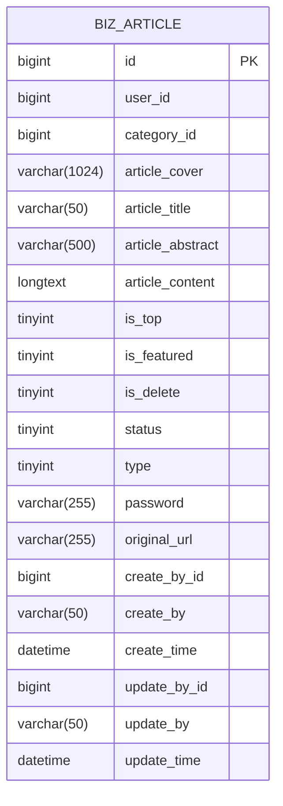

**图表来源**
- [ry-vue-owner.sql:238-263](file://ry-vue-owner.sql#L238-L263)

### 字段详细说明

#### 基础字段
- **id**: 主键，自增ID
- **user_id**: 作者ID，关联系统用户表
- **category_id**: 分类ID，关联文章分类表

#### 内容字段
- **article_cover**: 文章封面图URL，支持多张图片
- **article_title**: 文章标题，最大50字符
- **article_abstract**: 文章摘要，最大500字符
- **article_content**: 文章正文内容，使用长文本类型

#### 展示控制字段
- **is_top**: 是否置顶，0否1是
- **is_featured**: 是否推荐，0否1是
- **status**: 文章状态，1公开2私密3草稿
- **type**: 文章类型，1原创2转载3翻译

#### 安全与链接字段
- **password**: 访问密码，用于私密文章保护
- **original_url**: 原文链接，用于转载文章

#### 审计字段
- **create_by_id/create_by**: 创建人信息
- **create_time**: 创建时间，默认当前时间
- **update_by_id/update_by/update_time**: 更新人信息和时间

**章节来源**
- [Article.java:24-94](file://blog-biz/src/main/java/blog/biz/domain/Article.java#L24-L94)
- [ry-vue-owner.sql:241-262](file://ry-vue-owner.sql#L241-L262)

### 数据验证与约束

文章表采用了多层次的数据验证和约束机制：

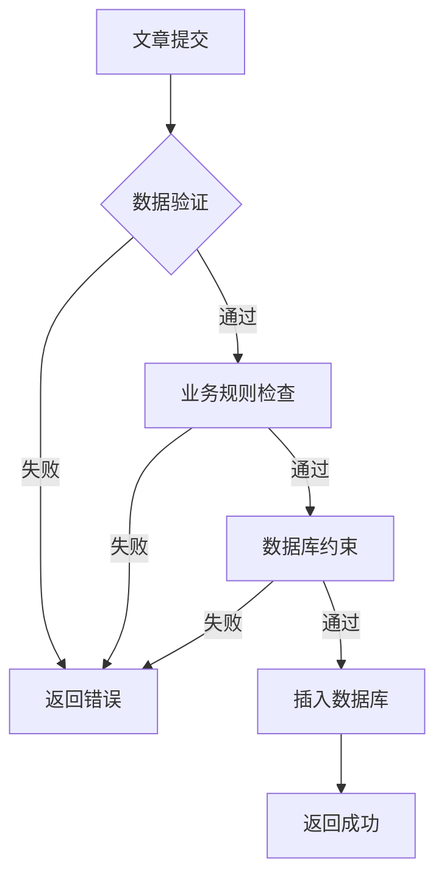

**章节来源**
- [ArticleMapper.xml:55-124](file://blog-biz/src/main/resources/mapper/ArticleMapper.xml#L55-L124)

## 分类表（biz_category）详细设计

### 表结构定义

分类表负责管理文章的分类体系，支持多级分类结构。

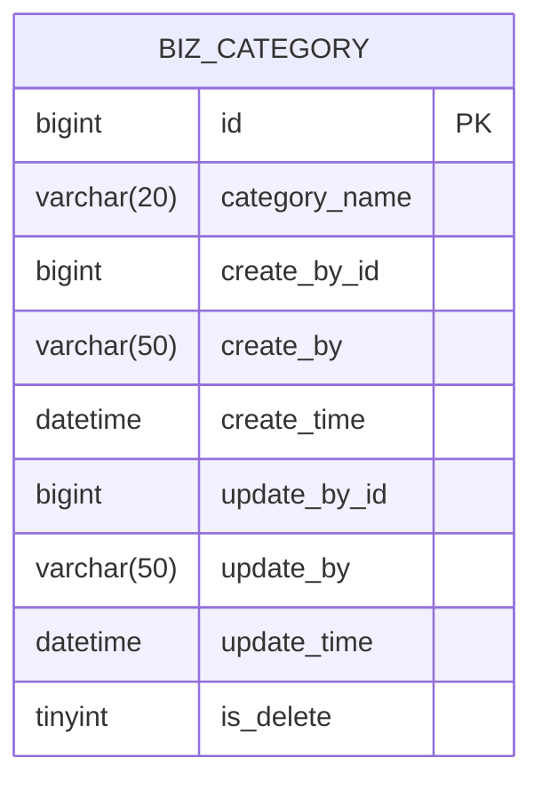

**图表来源**
- [ry-vue-owner.sql:298-312](file://ry-vue-owner.sql#L298-L312)

### 字段详细说明

#### 基础字段
- **id**: 主键，自增ID
- **category_name**: 分类名称，最大20字符

#### 审计字段
- **create_by_id/create_by**: 创建人信息
- **create_time**: 创建时间
- **update_by_id/update_by/update_time**: 更新人信息和时间
- **is_delete**: 逻辑删除标志，0正常1删除

**章节来源**
- [Category.java:19-37](file://blog-biz/src/main/java/blog/biz/domain/Category.java#L19-L37)
- [ry-vue-owner.sql:301-311](file://ry-vue-owner.sql#L301-L311)

### DTO与VO设计

为了满足不同场景的需求，分类表提供了相应的数据传输对象：

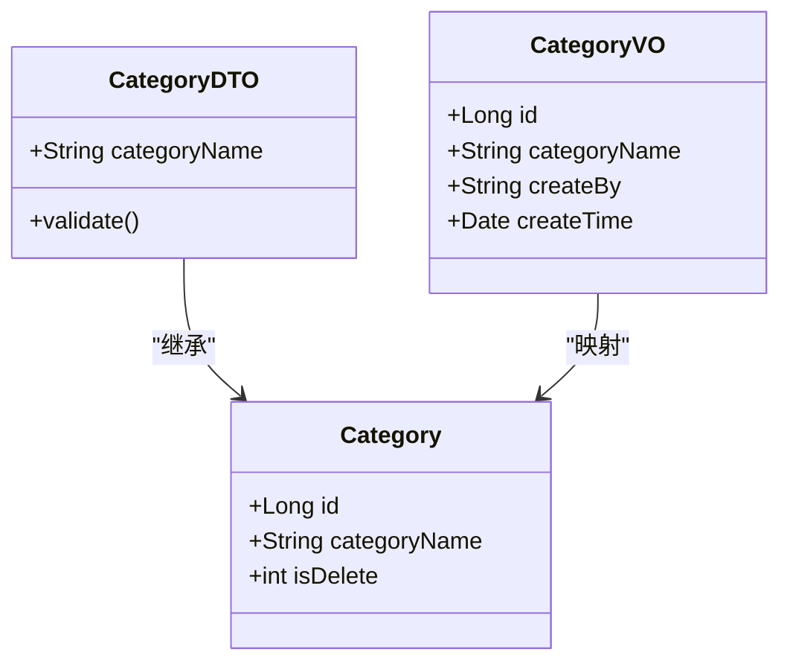

**图表来源**
- [CategoryDTO.java:19-25](file://blog-biz/src/main/java/blog/biz/domain/dto/CategoryDTO.java#L19-L25)
- [CategoryVO.java:18-26](file://blog-biz/src/main/java/blog/biz/domain/vo/CategoryVO.java#L18-L26)

**章节来源**
- [CategoryDTO.java:1-29](file://blog-biz/src/main/java/blog/biz/domain/dto/CategoryDTO.java#L1-L29)
- [CategoryVO.java:1-42](file://blog-biz/src/main/java/blog/biz/domain/vo/CategoryVO.java#L1-L42)

## 文件表（sys_file）详细设计

### 表结构定义

文件表负责管理博客系统中的所有文件资源，采用MinIO存储架构。

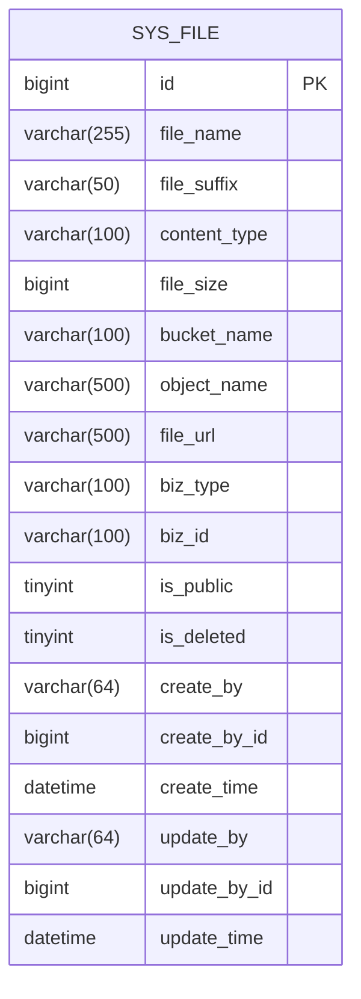

**图表来源**
- [ry-vue-owner.sql:1323-1347](file://ry-vue-owner.sql#L1323-L1347)

### 字段详细说明

#### 基础文件信息
- **file_name**: 原始文件名
- **file_suffix**: 文件后缀名
- **content_type**: MIME类型
- **file_size**: 文件大小（字节）

#### 存储位置信息
- **bucket_name**: MinIO存储桶名称
- **object_name**: 对象在存储桶中的路径
- **file_url**: 文件访问URL

#### 业务关联字段
- **biz_type**: 业务类型，如用户头像、博客图片等
- **biz_id**: 业务ID，关联具体业务实体

#### 权限与状态字段
- **is_public**: 是否公开，0否1是
- **is_deleted**: 是否删除，0正常1删除

#### 审计字段
- **create_by/create_by_id**: 创建人信息
- **create_time**: 创建时间
- **update_by/update_by_id/update_time**: 更新人信息和时间

**章节来源**
- [SysFile.java:20-94](file://blog-biz/src/main/java/blog/biz/domain/SysFile.java#L20-L94)
- [ry-vue-owner.sql:1325-1344](file://ry-vue-owner.sql#L1325-L1344)

## 表间关系与约束

### 关系设计

系统中的表间关系主要体现在文章与分类、文章与文件的关联上：

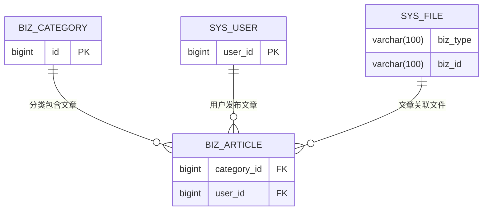

**图表来源**
- [ry-vue-owner.sql:241-262](file://ry-vue-owner.sql#L241-L262)
- [ry-vue-owner.sql:299-312](file://ry-vue-owner.sql#L299-L312)

### 约束设计

#### 主键约束
- 所有表均定义了主键约束，确保数据唯一性

#### 外键约束
- 文章表通过`category_id`关联分类表
- 文章表通过`user_id`关联用户表
- 文件表通过`biz_type`和`biz_id`建立业务关联

#### 非空约束
- 关键业务字段均设置了非空约束
- 审计字段默认值设置合理

**章节来源**
- [ry-vue-owner.sql:238-312](file://ry-vue-owner.sql#L238-L312)

## 业务字段与枚举设计

### 枚举值映射

系统通过字典表实现了业务枚举值的标准化管理：

| 枚举类型 | 值 | 含义 | 字典表 |
|----------|----|------|--------|
| 文章状态 | 1 | 公开 | biz_article_status |
| 文章状态 | 2 | 私密 | biz_article_status |
| 文章状态 | 3 | 草稿 | biz_article_status |
| 文章类型 | 1 | 原创 | biz_article_type |
| 文章类型 | 2 | 转载 | biz_article_type |
| 文章类型 | 3 | 翻译 | biz_article_type |
| 业务是否 | 0 | 否 | biz_yes_no |
| 业务是否 | 1 | 是 | biz_yes_no |

### 业务逻辑字段

#### 文章状态控制
- **公开状态**: 可被所有用户查看
- **私密状态**: 需要访问密码或权限才能查看
- **草稿状态**: 仅作者可查看，不对外发布

#### 展示控制字段
- **置顶功能**: 通过`is_top`字段实现文章置顶
- **推荐功能**: 通过`is_featured`字段实现文章推荐
- **删除机制**: 使用逻辑删除避免数据丢失

**章节来源**
- [ry-vue-owner.sql:592-599](file://ry-vue-owner.sql#L592-L599)

## 数据模型与ER图

### 完整数据模型

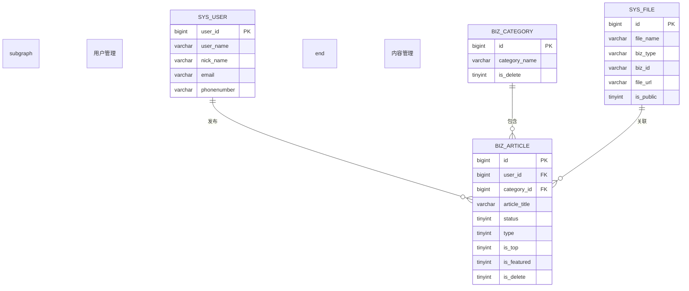

**图表来源**
- [ry-vue-owner.sql:1252-1279](file://ry-vue-owner.sql#L1252-L1279)
- [ry-vue-owner.sql:238-263](file://ry-vue-owner.sql#L238-L263)
- [ry-vue-owner.sql:1323-1347](file://ry-vue-owner.sql#L1323-L1347)

### 关系图

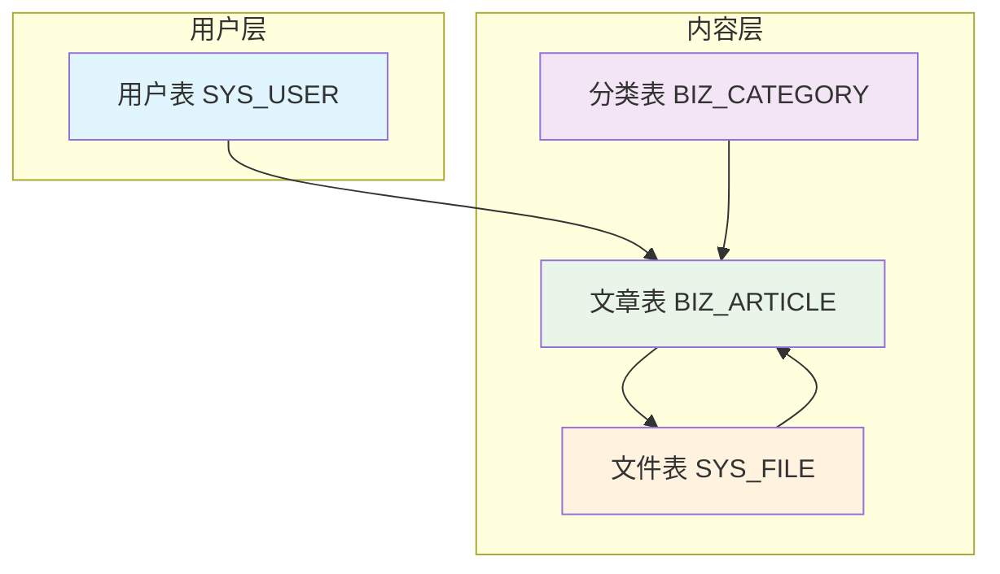

## 索引设计与性能考量

### 现有索引

系统在关键字段上建立了合理的索引以提升查询性能：

#### 文章表索引
- **主键索引**: `PRIMARY KEY (id)`
- **分类索引**: `category_id` (用于按分类查询)
- **状态索引**: `status` (用于状态过滤)
- **创建时间索引**: `create_time` (用于时间排序)

#### 文件表索引
- **业务索引**: `biz_type, biz_id` (复合索引，用于业务关联查询)

### 性能优化建议

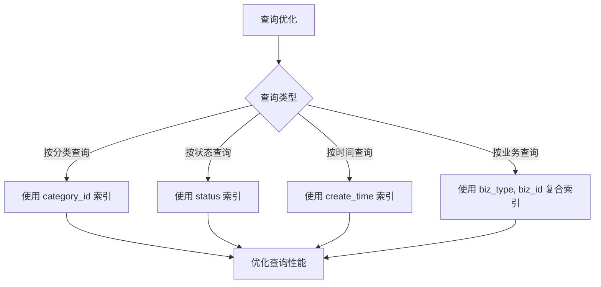

**章节来源**
- [ry-vue-owner.sql:289-290](file://ry-vue-owner.sql#L289-L290)
- [ry-vue-owner.sql](file://ry-vue-owner.sql#L1346)

## 数据字典与业务规则

### 数据字典结构

系统通过字典表实现了业务规则的集中管理：

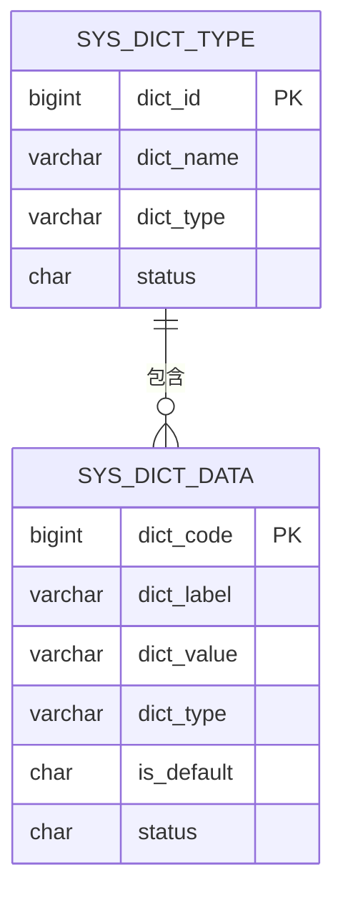

**图表来源**
- [ry-vue-owner.sql:602-617](file://ry-vue-owner.sql#L602-L617)
- [ry-vue-owner.sql:539-558](file://ry-vue-owner.sql#L539-L558)

### 业务规则约束

#### 数据完整性约束
- 所有关键字段设置非空约束
- 审计字段自动填充
- 逻辑删除避免数据丢失

#### 业务流程约束
- 文章状态转换规则
- 分类删除限制
- 文件访问权限控制

**章节来源**
- [BaseEntity.java:37-70](file://blog-common/src/main/java/blog/common/base/entity/BaseEntity.java#L37-L70)
- [ry-vue-owner.sql:542-557](file://ry-vue-owner.sql#L542-L557)

## 总结

博客系统的核心业务表设计体现了以下特点：

1. **规范化设计**: 采用第三范式，消除数据冗余
2. **扩展性强**: 支持多类型业务场景
3. **性能优化**: 合理的索引设计和查询优化
4. **数据安全**: 逻辑删除和权限控制机制
5. **业务抽象**: 通过字典表实现业务规则的集中管理

通过深入理解这些设计原理，开发者可以更好地维护和扩展博客系统的业务功能，同时确保系统的稳定性和可维护性。