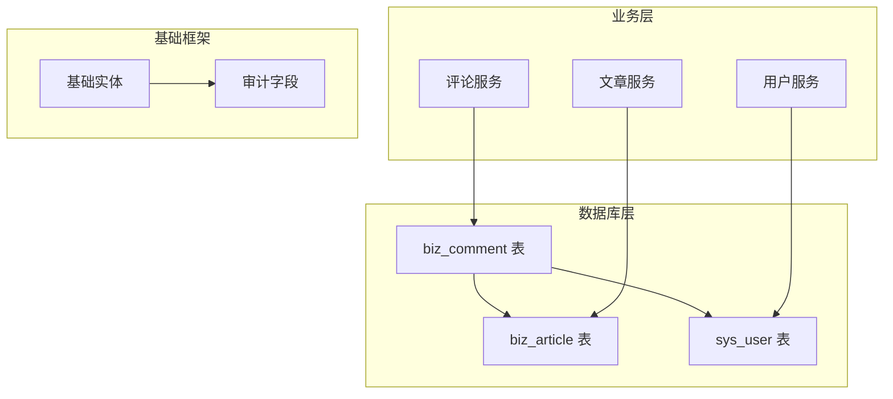
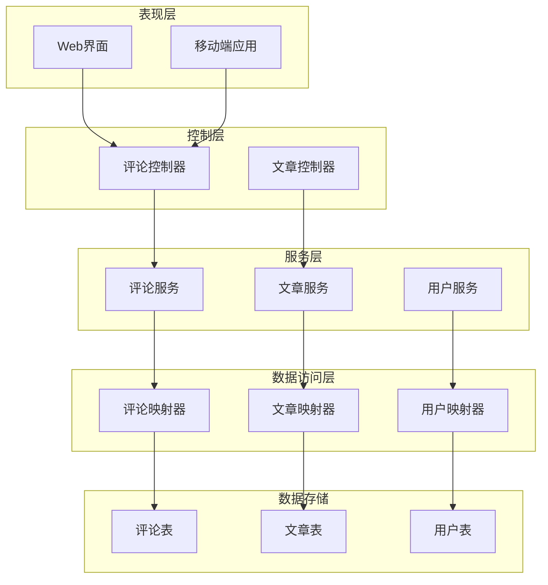
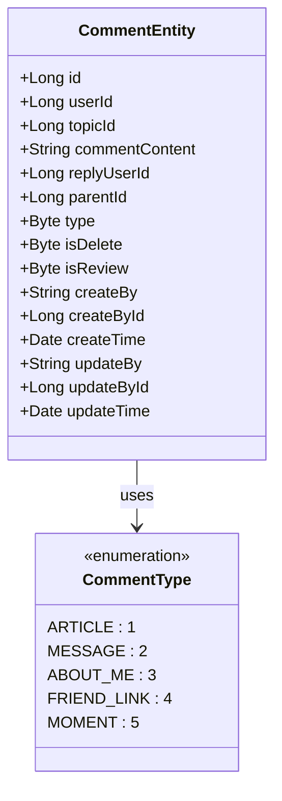
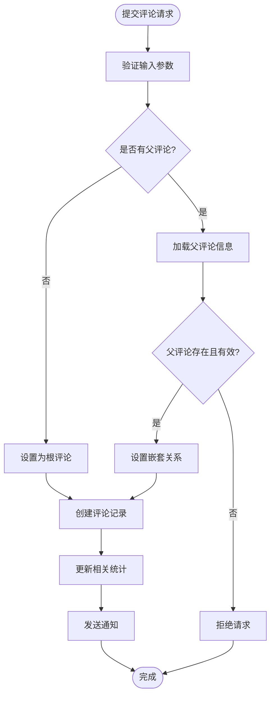
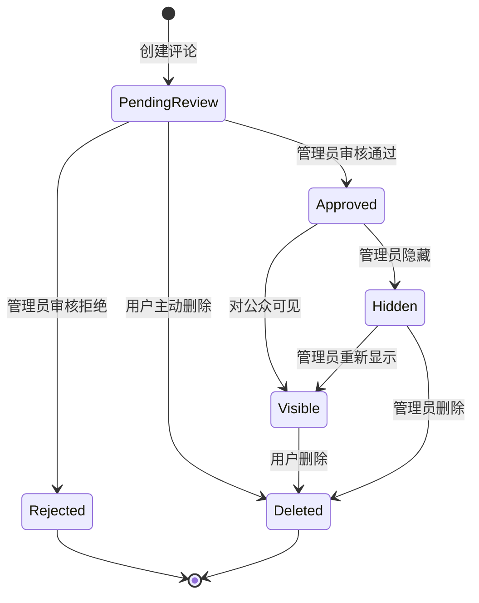
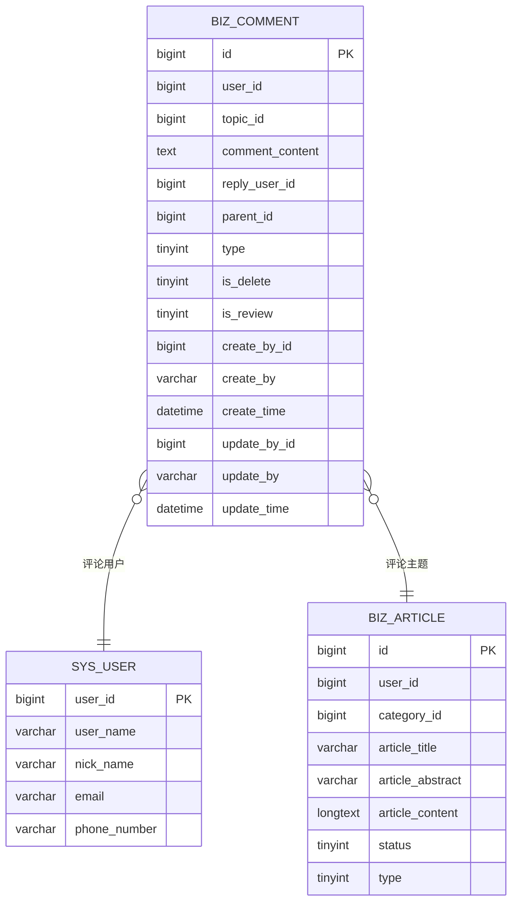
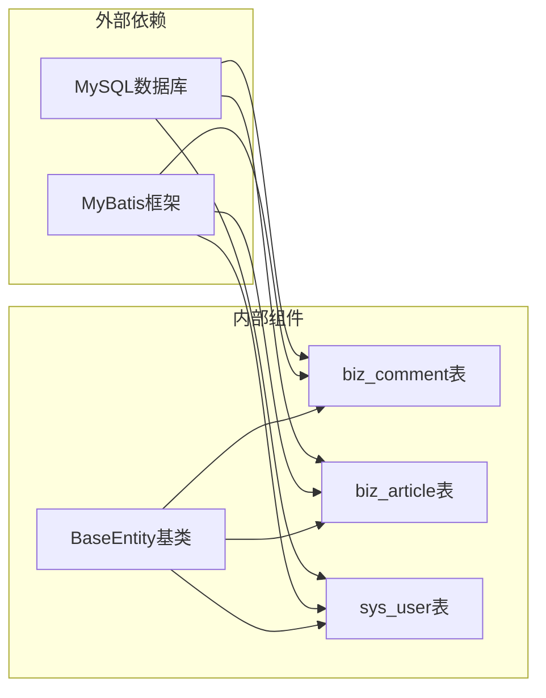
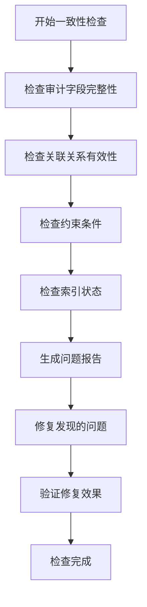

# 评论表设计

<cite>
**本文档引用的文件**
- [ry-vue-owner.sql](file://ry-vue-owner.sql)
- [BaseEntity.java](file://blog-common/src/main/java/blog/common/base/entity/BaseEntity.java)
- [SysUser.java](file://blog-common/src/main/java/blog/common/core/domain/entity/SysUser.java)
- [Article.java](file://blog-biz/src/main/java/blog/biz/domain/Article.java)
</cite>

## 目录
1. [简介](#简介)
2. [项目结构](#项目结构)
3. [核心组件](#核心组件)
4. [架构概览](#架构概览)
5. [详细组件分析](#详细组件分析)
6. [依赖分析](#依赖分析)
7. [性能考虑](#性能考虑)
8. [故障排除指南](#故障排除指南)
9. [结论](#结论)

## 简介

本文档详细解析评论表（biz_comment）的设计，这是一个支撑博客系统评论功能的核心数据表。该表采用MySQL数据库设计，支持多种评论类型和复杂的层级结构，为用户提供完整的评论交互体验。

## 项目结构

基于仓库分析，评论表设计位于以下关键位置：

**图表来源**
- [ry-vue-owner.sql:321-343](file://ry-vue-owner.sql#L321-L343)
- [Article.java:24-94](file://blog-biz/src/main/java/blog/biz/domain/Article.java#L24-L94)
- [SysUser.java:24-339](file://blog-common/src/main/java/blog/common/core/domain/entity/SysUser.java#L24-L339)

**章节来源**
- [ry-vue-owner.sql:321-343](file://ry-vue-owner.sql#L321-L343)

## 核心组件

### 数据表结构设计

评论表采用标准的三层设计模式，确保数据完整性和可维护性：

| 设计层次 | 字段类型 | 数量 | 描述 |
|---------|---------|------|------|
| **核心标识** | bigint | 1 | 主键ID，自增递增 |
| **业务关联** | bigint | 3 | 用户ID、主题ID、父评论ID |
| **内容字段** | text | 1 | 评论内容，支持长文本 |
| **类型标识** | tinyint | 1 | 评论类型枚举 |
| **状态控制** | tinyint | 2 | 审核状态、删除标记 |
| **审计字段** | varchar/datetime | 6 | 创建/更新人员信息及时间戳 |

### 关键字段设计考虑

#### 用户关联字段
- `user_id`: 评论发起用户的唯一标识，建立与用户系统的强关联
- `reply_user_id`: 回复目标用户的标识，支持多层回复追踪
- 索引策略：在user_id上建立普通索引，优化用户评论查询性能

#### 主题关联字段  
- `topic_id`: 评论所属主题的标识符，支持文章、留言、关于我等多种主题类型
- 灵活设计：允许为空，便于实现通用评论机制

#### 层级结构字段
- `parent_id`: 父评论ID，实现无限层级的评论树结构
- 关系设计：自引用外键，支持嵌套回复和评论聚合

**章节来源**
- [ry-vue-owner.sql:324-342](file://ry-vue-owner.sql#L324-L342)

## 架构概览

评论系统采用分层架构设计，确保各组件职责清晰：

**图表来源**
- [ry-vue-owner.sql:321-343](file://ry-vue-owner.sql#L321-L343)
- [Article.java:24-94](file://blog-biz/src/main/java/blog/biz/domain/Article.java#L24-L94)
- [SysUser.java:24-339](file://blog-common/src/main/java/blog/common/core/domain/entity/SysUser.java#L24-L339)

## 详细组件分析

### 评论类型系统设计

评论类型采用枚举设计，支持五种不同的评论场景：

**图表来源**
- [ry-vue-owner.sql:331-331](file://ry-vue-owner.sql#L331-L331)

#### 类型差异与处理方式

| 评论类型 | 编码 | 适用场景 | 特殊处理 |
|---------|------|----------|----------|
| 文章评论 | 1 | 文章内容评论 | 关联文章表，支持文章统计 |
| 留言评论 | 2 | 站点留言区 | 独立展示，不绑定特定文章 |
| 关于我 | 3 | 个人介绍页面评论 | 仅限特定页面显示 |
| 友链评论 | 4 | 友情链接页面评论 | 支持友链验证机制 |
| 说说评论 | 5 | 动态分享评论 | 支持多媒体内容 |

### 层级结构实现机制

评论的层级结构通过父子关系实现无限深度的嵌套评论：

**图表来源**
- [ry-vue-owner.sql:329-330](file://ry-vue-owner.sql#L329-L330)

### 审核机制设计

审核系统采用双层控制机制：

**图表来源**
- [ry-vue-owner.sql:333-333](file://ry-vue-owner.sql#L333-L333)

### 元数据管理机制

系统采用审计字段设计，确保所有数据变更的可追溯性：

**图表来源**
- [ry-vue-owner.sql:324-339](file://ry-vue-owner.sql#L324-L339)
- [SysUser.java:30-32](file://blog-common/src/main/java/blog/common/core/domain/entity/SysUser.java#L30-L32)
- [Article.java:32-36](file://blog-biz/src/main/java/blog/biz/domain/Article.java#L32-L36)

**章节来源**
- [ry-vue-owner.sql:334-339](file://ry-vue-owner.sql#L334-L339)
- [BaseEntity.java:37-70](file://blog-common/src/main/java/blog/common/base/entity/BaseEntity.java#L37-L70)

## 依赖分析

### 数据库依赖关系

**图表来源**
- [ry-vue-owner.sql:321-343](file://ry-vue-owner.sql#L321-L343)
- [BaseEntity.java:22-84](file://blog-common/src/main/java/blog/common/base/entity/BaseEntity.java#L22-L84)

### 关联关系设计

| 关系类型 | 表间关系 | 约束条件 | 性能影响 |
|---------|----------|----------|----------|
| 用户-评论 | 多对一 | 外键约束，级联删除 | 中等，需索引优化 |
| 文章-评论 | 多对一 | 外键约束，级联删除 | 中等，需索引优化 |
| 评论-评论 | 自引用 | 递归约束，支持无限层级 | 低，树形查询复杂度高 |
| 审计-业务 | 一对一 | 数据冗余，保证查询效率 | 低，提升读性能 |

**章节来源**
- [ry-vue-owner.sql:341-342](file://ry-vue-owner.sql#L341-L342)

## 性能考虑

### 索引设计策略

针对评论表的高频查询模式，建议实施以下索引策略：

| 索引类型 | 字段组合 | 查询场景 | 性能收益 |
|---------|----------|----------|----------|
| 主键索引 | id | 主键查询 | 极高 |
| 用户索引 | user_id | 用户评论查询 | 高 |
| 父节点索引 | parent_id | 层级查询 | 中等 |
| 主题索引 | topic_id | 主题评论查询 | 中等 |
| 组合索引 | (user_id, create_time) | 用户时间序列查询 | 中等 |
| 组合索引 | (topic_id, type) | 主题类型过滤 | 中等 |

### 查询优化建议

1. **分页查询优化**
   - 使用覆盖索引减少回表
   - 实施延迟关联避免大结果集排序

2. **层级查询优化**
   - 对于深度嵌套场景，考虑使用路径枚举或邻接列表优化
   - 实施缓存策略减少重复计算

3. **批量操作优化**
   - 评论统计采用异步更新
   - 大批量删除使用分区表策略

## 故障排除指南

### 常见问题诊断

| 问题类型 | 症状描述 | 可能原因 | 解决方案 |
|---------|----------|----------|----------|
| 评论丢失 | 评论内容不可见 | is_delete标记为1 | 检查删除标记状态 |
| 审核异常 | 评论长时间未显示 | is_review状态异常 | 验证审核流程配置 |
| 层级混乱 | 回复顺序错误 | parent_id关联错误 | 检查父子关系完整性 |
| 性能问题 | 查询响应缓慢 | 缺少必要索引 | 添加复合索引优化 |

### 数据一致性检查

**章节来源**
- [ry-vue-owner.sql:333-333](file://ry-vue-owner.sql#L333-L333)

## 结论

评论表（biz_comment）设计体现了现代博客系统对评论功能的全面需求。通过合理的字段设计、完善的层级结构支持、灵活的类型系统和严格的审计机制，该表能够有效支撑各种评论场景。

关键设计亮点包括：
- **灵活的类型系统**：支持文章、留言、关于我、友链、说说五种评论类型
- **强大的层级结构**：通过parent_id实现无限深度的嵌套评论
- **完善的审核机制**：双层控制确保内容质量
- **完整的审计体系**：所有操作都有迹可循
- **性能优化考虑**：合理的索引设计和查询优化策略

该设计为博客系统的评论功能提供了坚实的数据基础，能够满足当前和未来业务发展的需要。