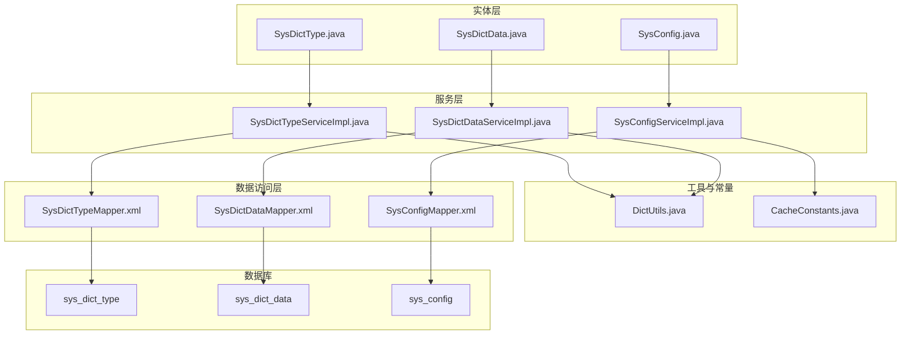
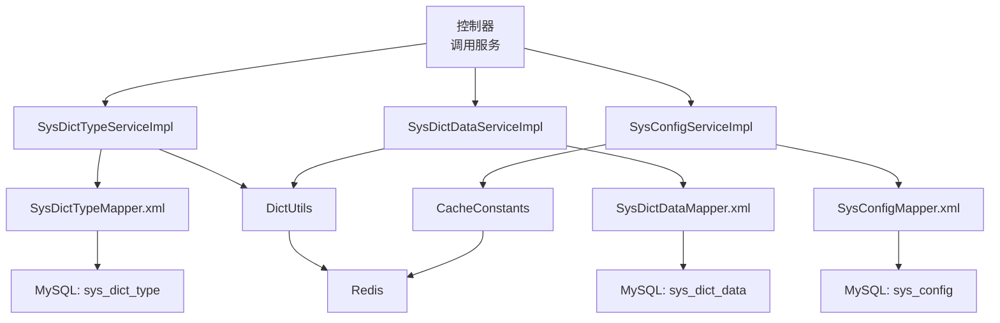
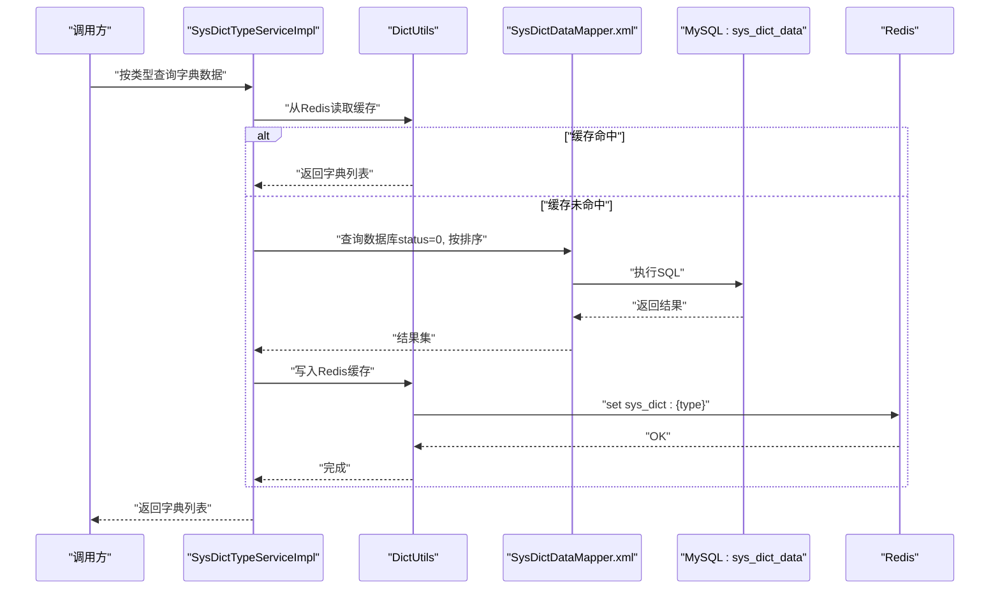
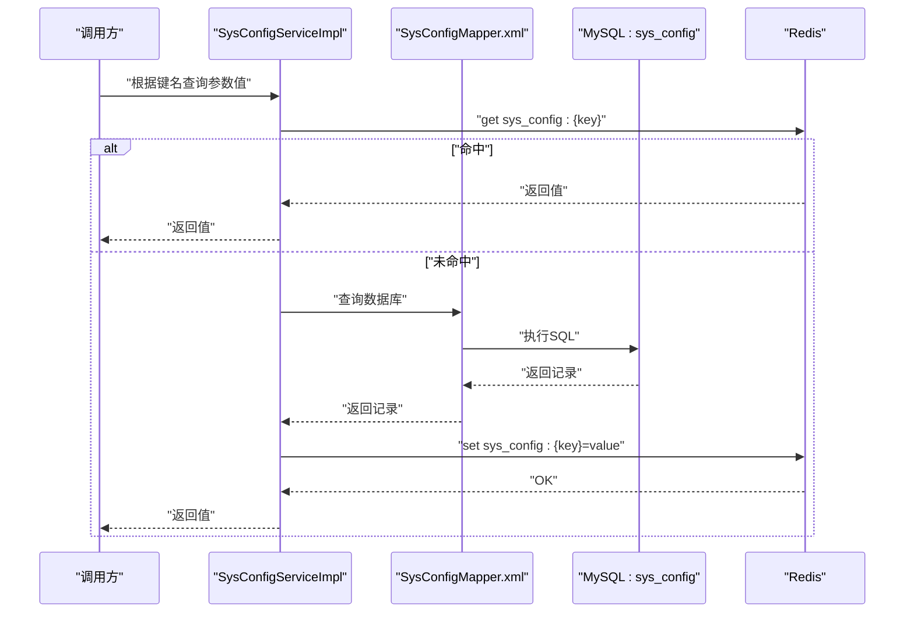
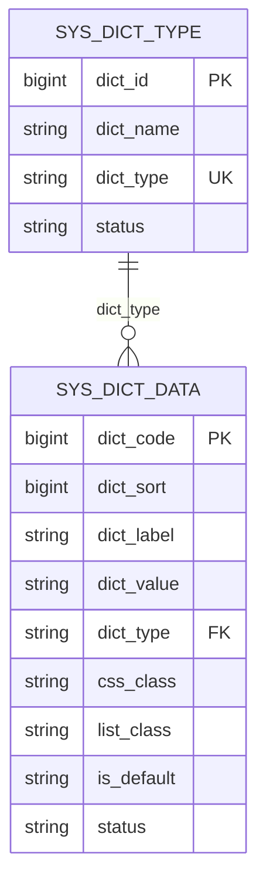
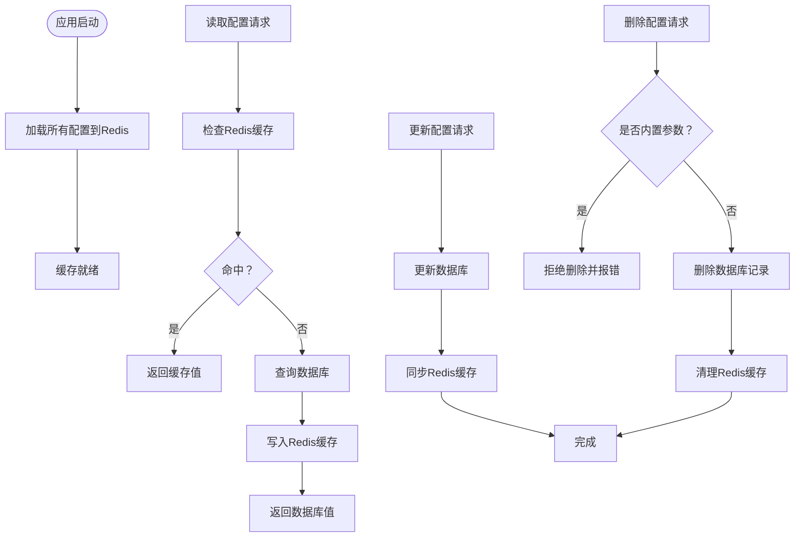
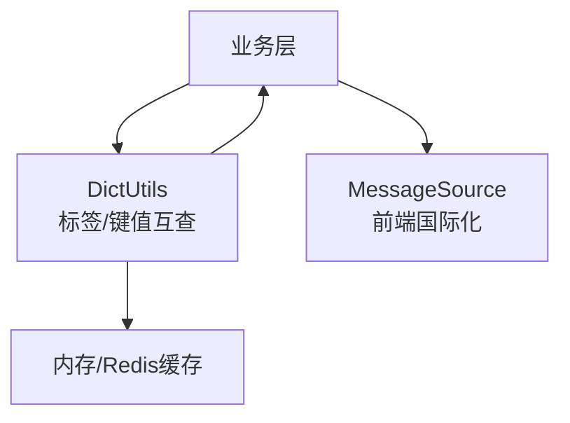
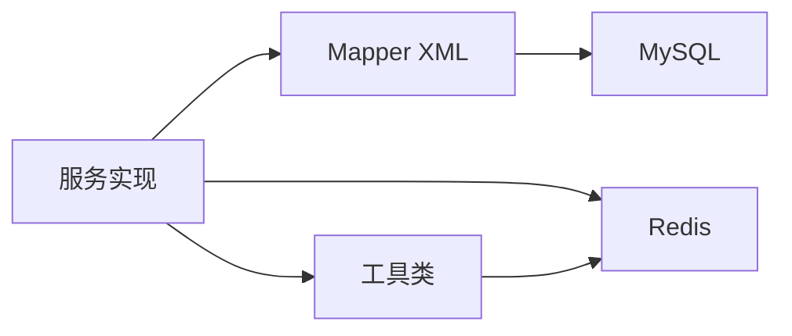

# 字典配置表设计

<cite>
**本文档引用的文件**
- [SysDictType.java](file://blog-common/src/main/java/blog/common/core/domain/entity/SysDictType.java)
- [SysDictData.java](file://blog-common/src/main/java/blog/common/core/domain/entity/SysDictData.java)
- [SysConfig.java](file://blog-system/src/main/java/blog/system/domain/SysConfig.java)
- [SysDictTypeServiceImpl.java](file://blog-system/src/main/java/blog/system/service/impl/SysDictTypeServiceImpl.java)
- [SysDictDataServiceImpl.java](file://blog-system/src/main/java/blog/system/service/impl/SysDictDataServiceImpl.java)
- [SysConfigServiceImpl.java](file://blog-system/src/main/java/blog/system/service/impl/SysConfigServiceImpl.java)
- [DictUtils.java](file://blog-common/src/main/java/blog/common/utils/DictUtils.java)
- [CacheConstants.java](file://blog-common/src/main/java/blog/common/constant/CacheConstants.java)
- [SysDictTypeMapper.xml](file://blog-system/src/main/resources/mapper/system/SysDictTypeMapper.xml)
- [SysDictDataMapper.xml](file://blog-system/src/main/resources/mapper/system/SysDictDataMapper.xml)
- [SysConfigMapper.xml](file://blog-system/src/main/resources/mapper/system/SysConfigMapper.xml)
- [ry-vue-owner.sql](file://ry-vue-owner.sql)
</cite>

## 目录
1. [简介](#简介)
2. [项目结构](#项目结构)
3. [核心组件](#核心组件)
4. [架构总览](#架构总览)
5. [详细组件分析](#详细组件分析)
6. [依赖关系分析](#依赖关系分析)
7. [性能考虑](#性能考虑)
8. [故障排除指南](#故障排除指南)
9. [结论](#结论)
10. [附录](#附录)

## 简介
本文件面向系统配置管理中的“字典配置表设计”，系统性梳理并解释以下数据库表结构与配套实现：
- 字典类型表（sys_dict_type）：用于定义字典分类及状态
- 字典数据表（sys_dict_data）：用于维护具体字典项（标签、键值、排序、样式等）
- 系统参数配置表（sys_config）：用于系统运行期参数的集中管理与缓存

重点覆盖：
- 字典分类与字典项的管理机制
- 字典缓存策略与失效/刷新
- 参数配置的存储、读取、更新与缓存同步
- 国际化支持的可扩展性
- 安全存储与内置参数保护
- 配置变更通知与缓存一致性保障

## 项目结构
围绕配置管理的关键文件分布如下：
- 实体模型：SysDictType、SysDictData、SysConfig
- 服务实现：SysDictTypeServiceImpl、SysDictDataServiceImpl、SysConfigServiceImpl
- 工具与常量：DictUtils、CacheConstants
- 数据访问：各Mapper对应的XML映射文件
- 数据库脚本：ry-vue-owner.sql中包含三张表的建表语句

**图表来源**
- [SysDictType.java:1-100](file://blog-common/src/main/java/blog/common/core/domain/entity/SysDictType.java#L1-L100)
- [SysDictData.java:1-93](file://blog-common/src/main/java/blog/common/core/domain/entity/SysDictData.java#L1-L93)
- [SysConfig.java:1-113](file://blog-system/src/main/java/blog/system/domain/SysConfig.java#L1-L113)
- [SysDictTypeServiceImpl.java:1-204](file://blog-system/src/main/java/blog/system/service/impl/SysDictTypeServiceImpl.java#L1-L204)
- [SysDictDataServiceImpl.java:1-104](file://blog-system/src/main/java/blog/system/service/impl/SysDictDataServiceImpl.java#L1-L104)
- [SysConfigServiceImpl.java:1-211](file://blog-system/src/main/java/blog/system/service/impl/SysConfigServiceImpl.java#L1-L211)
- [DictUtils.java:1-204](file://blog-common/src/main/java/blog/common/utils/DictUtils.java#L1-L204)
- [CacheConstants.java:1-44](file://blog-common/src/main/java/blog/common/constant/CacheConstants.java#L1-L44)
- [SysDictTypeMapper.xml:1-105](file://blog-system/src/main/resources/mapper/system/SysDictTypeMapper.xml#L1-L105)
- [SysDictDataMapper.xml:1-124](file://blog-system/src/main/resources/mapper/system/SysDictDataMapper.xml#L1-L124)
- [SysConfigMapper.xml:1-117](file://blog-system/src/main/resources/mapper/system/SysConfigMapper.xml#L1-L117)

**章节来源**
- [SysDictType.java:1-100](file://blog-common/src/main/java/blog/common/core/domain/entity/SysDictType.java#L1-L100)
- [SysDictData.java:1-93](file://blog-common/src/main/java/blog/common/core/domain/entity/SysDictData.java#L1-L93)
- [SysConfig.java:1-113](file://blog-system/src/main/java/blog/system/domain/SysConfig.java#L1-L113)
- [SysDictTypeServiceImpl.java:1-204](file://blog-system/src/main/java/blog/system/service/impl/SysDictTypeServiceImpl.java#L1-L204)
- [SysDictDataServiceImpl.java:1-104](file://blog-system/src/main/java/blog/system/service/impl/SysDictDataServiceImpl.java#L1-L104)
- [SysConfigServiceImpl.java:1-211](file://blog-system/src/main/java/blog/system/service/impl/SysConfigServiceImpl.java#L1-L211)
- [DictUtils.java:1-204](file://blog-common/src/main/java/blog/common/utils/DictUtils.java#L1-L204)
- [CacheConstants.java:1-44](file://blog-common/src/main/java/blog/common/constant/CacheConstants.java#L1-L44)
- [SysDictTypeMapper.xml:1-105](file://blog-system/src/main/resources/mapper/system/SysDictTypeMapper.xml#L1-L105)
- [SysDictDataMapper.xml:1-124](file://blog-system/src/main/resources/mapper/system/SysDictDataMapper.xml#L1-L124)
- [SysConfigMapper.xml:1-117](file://blog-system/src/main/resources/mapper/system/SysConfigMapper.xml#L1-L117)

## 核心组件
本节从表结构、实体类、服务实现、缓存策略四个维度，系统阐述字典与配置的数据库设计。

- 字典类型表（sys_dict_type）
  - 职责：定义字典分类，包含字典名称、字典类型标识、状态等
  - 关键点：字典类型需满足命名规范；状态区分启用/停用
  - 参考路径：[SysDictType.java:14-98](file://blog-common/src/main/java/blog/common/core/domain/entity/SysDictType.java#L14-L98)，[SysDictTypeMapper.xml:18-61](file://blog-system/src/main/resources/mapper/system/SysDictTypeMapper.xml#L18-L61)

- 字典数据表（sys_dict_data）
  - 职责：维护具体字典项，包括标签、键值、排序、样式、是否默认、状态等
  - 关键点：按排序字段升序排列；状态为启用才参与缓存
  - 参考路径：[SysDictData.java:14-91](file://blog-common/src/main/java/blog/common/core/domain/entity/SysDictData.java#L14-L91)，[SysDictDataMapper.xml:23-61](file://blog-system/src/main/resources/mapper/system/SysDictDataMapper.xml#L23-L61)

- 系统参数配置表（sys_config）
  - 职责：集中存储系统运行期参数，支持内置参数标记与动态更新
  - 关键点：键名唯一；内置参数禁止删除；值通过Redis缓存加速读取
  - 参考路径：[SysConfig.java:12-111](file://blog-system/src/main/java/blog/system/domain/SysConfig.java#L12-L111)，[SysConfigMapper.xml:19-70](file://blog-system/src/main/resources/mapper/system/SysConfigMapper.xml#L19-L70)

- 缓存与工具
  - 缓存键前缀：sys_config:、sys_dict:
  - 字典工具：提供字典标签/键值互查、批量获取、缓存设置/清理
  - 参考路径：[CacheConstants.java:20-27](file://blog-common/src/main/java/blog/common/constant/CacheConstants.java#L20-L27)，[DictUtils.java:17-203](file://blog-common/src/main/java/blog/common/utils/DictUtils.java#L17-L203)

**章节来源**
- [SysDictType.java:14-98](file://blog-common/src/main/java/blog/common/core/domain/entity/SysDictType.java#L14-L98)
- [SysDictData.java:14-91](file://blog-common/src/main/java/blog/common/core/domain/entity/SysDictData.java#L14-L91)
- [SysConfig.java:12-111](file://blog-system/src/main/java/blog/system/domain/SysConfig.java#L12-L111)
- [CacheConstants.java:20-27](file://blog-common/src/main/java/blog/common/constant/CacheConstants.java#L20-L27)
- [DictUtils.java:17-203](file://blog-common/src/main/java/blog/common/utils/DictUtils.java#L17-L203)
- [SysDictTypeMapper.xml:18-61](file://blog-system/src/main/resources/mapper/system/SysDictTypeMapper.xml#L18-L61)
- [SysDictDataMapper.xml:23-61](file://blog-system/src/main/resources/mapper/system/SysDictDataMapper.xml#L23-L61)
- [SysConfigMapper.xml:19-70](file://blog-system/src/main/resources/mapper/system/SysConfigMapper.xml#L19-L70)

## 架构总览
下图展示字典与配置在系统中的整体交互：控制器调用服务层，服务层通过MyBatis访问数据库，并与Redis缓存进行读写同步。

**图表来源**
- [SysDictTypeServiceImpl.java:28-203](file://blog-system/src/main/java/blog/system/service/impl/SysDictTypeServiceImpl.java#L28-L203)
- [SysDictDataServiceImpl.java:18-103](file://blog-system/src/main/java/blog/system/service/impl/SysDictDataServiceImpl.java#L18-L103)
- [SysConfigServiceImpl.java:27-210](file://blog-system/src/main/java/blog/system/service/impl/SysConfigServiceImpl.java#L27-L210)
- [DictUtils.java:17-203](file://blog-common/src/main/java/blog/common/utils/DictUtils.java#L17-L203)
- [CacheConstants.java:20-27](file://blog-common/src/main/java/blog/common/constant/CacheConstants.java#L20-L27)
- [SysDictTypeMapper.xml:5-105](file://blog-system/src/main/resources/mapper/system/SysDictTypeMapper.xml#L5-L105)
- [SysDictDataMapper.xml:5-124](file://blog-system/src/main/resources/mapper/system/SysDictDataMapper.xml#L5-L124)
- [SysConfigMapper.xml:5-117](file://blog-system/src/main/resources/mapper/system/SysConfigMapper.xml#L5-L117)

## 详细组件分析

### 字典类型与字典数据组件
- 设计要点
  - 字典类型：唯一标识（dict_type）用于关联字典数据；状态控制启用/停用
  - 字典数据：按dict_sort升序展示；is_default用于标识默认项；status=0才纳入缓存
- 服务流程
  - 启动加载：服务启动时将所有启用的字典数据按类型分组并写入Redis
  - 读取优先：先查Redis，未命中再查数据库，并回填Redis
  - 写入同步：新增/修改/删除后，按类型刷新Redis缓存或移除
- 关键接口参考
  - 类型管理：[SysDictTypeServiceImpl.java:50-202](file://blog-system/src/main/java/blog/system/service/impl/SysDictTypeServiceImpl.java#L50-L202)
  - 数据管理：[SysDictDataServiceImpl.java:29-102](file://blog-system/src/main/java/blog/system/service/impl/SysDictDataServiceImpl.java#L29-L102)
  - 缓存工具：[DictUtils.java:29-192](file://blog-common/src/main/java/blog/common/utils/DictUtils.java#L29-L192)

**图表来源**
- [SysDictTypeServiceImpl.java:71-83](file://blog-system/src/main/java/blog/system/service/impl/SysDictTypeServiceImpl.java#L71-L83)
- [DictUtils.java:29-45](file://blog-common/src/main/java/blog/common/utils/DictUtils.java#L29-L45)
- [SysDictDataMapper.xml:44-47](file://blog-system/src/main/resources/mapper/system/SysDictDataMapper.xml#L44-L47)

**章节来源**
- [SysDictTypeServiceImpl.java:39-152](file://blog-system/src/main/java/blog/system/service/impl/SysDictTypeServiceImpl.java#L39-L152)
- [SysDictDataServiceImpl.java:78-102](file://blog-system/src/main/java/blog/system/service/impl/SysDictDataServiceImpl.java#L78-L102)
- [DictUtils.java:29-192](file://blog-common/src/main/java/blog/common/utils/DictUtils.java#L29-L192)
- [SysDictDataMapper.xml:44-47](file://blog-system/src/main/resources/mapper/system/SysDictDataMapper.xml#L44-L47)

### 系统参数配置组件
- 设计要点
  - 键名唯一：防止重复配置
  - 内置参数保护：configType=Y 的记录不允许删除
  - 缓存键前缀：sys_config:{key}
- 服务流程
  - 启动加载：应用启动时将所有配置写入Redis
  - 读取优先：先查Redis，未命中再查数据库并回填
  - 更新同步：键名变更需删除旧键并写入新键；值变更同步更新Redis
  - 删除保护：内置参数抛出异常阻止删除
- 关键接口参考
  - 参数管理：[SysConfigServiceImpl.java:49-209](file://blog-system/src/main/java/blog/system/service/impl/SysConfigServiceImpl.java#L49-L209)
  - 缓存键前缀：[CacheConstants.java:20-22](file://blog-common/src/main/java/blog/common/constant/CacheConstants.java#L20-L22)

**图表来源**
- [SysConfigServiceImpl.java:63-77](file://blog-system/src/main/java/blog/system/service/impl/SysConfigServiceImpl.java#L63-L77)
- [SysConfigMapper.xml:36-40](file://blog-system/src/main/resources/mapper/system/SysConfigMapper.xml#L36-L40)
- [CacheConstants.java:20-22](file://blog-common/src/main/java/blog/common/constant/CacheConstants.java#L20-L22)

**章节来源**
- [SysConfigServiceImpl.java:38-183](file://blog-system/src/main/java/blog/system/service/impl/SysConfigServiceImpl.java#L38-L183)
- [SysConfigMapper.xml:36-70](file://blog-system/src/main/resources/mapper/system/SysConfigMapper.xml#L36-L70)
- [CacheConstants.java:20-22](file://blog-common/src/main/java/blog/common/constant/CacheConstants.java#L20-L22)

### 字典配置关系图
- 关系说明
  - sys_dict_type.dict_type 与 sys_dict_data.dict_type 关联
  - 启用状态（status=0）的数据进入缓存
  - 字典排序（dict_sort）决定展示顺序
- ER关系示意

**图表来源**
- [SysDictType.java:23-46](file://blog-common/src/main/java/blog/common/core/domain/entity/SysDictType.java#L23-L46)
- [SysDictData.java:25-62](file://blog-common/src/main/java/blog/common/core/domain/entity/SysDictData.java#L25-L62)
- [SysDictTypeMapper.xml:18-21](file://blog-system/src/main/resources/mapper/system/SysDictTypeMapper.xml#L18-L21)
- [SysDictDataMapper.xml:23-26](file://blog-system/src/main/resources/mapper/system/SysDictDataMapper.xml#L23-L26)

**章节来源**
- [SysDictType.java:23-46](file://blog-common/src/main/java/blog/common/core/domain/entity/SysDictType.java#L23-L46)
- [SysDictData.java:25-62](file://blog-common/src/main/java/blog/common/core/domain/entity/SysDictData.java#L25-L62)
- [SysDictTypeMapper.xml:18-21](file://blog-system/src/main/resources/mapper/system/SysDictTypeMapper.xml#L18-L21)
- [SysDictDataMapper.xml:23-26](file://blog-system/src/main/resources/mapper/system/SysDictDataMapper.xml#L23-L26)

### 配置缓存流程图
- 流程说明
  - 应用启动：遍历sys_config，写入Redis缓存
  - 运行期读取：优先Redis，未命中查库并回填
  - 运行期写入：更新数据库后同步Redis；键名变更需删除旧键
  - 运行期删除：内置参数不可删；删除后同步清理Redis
- 流程示意

**图表来源**
- [SysConfigServiceImpl.java:38-183](file://blog-system/src/main/java/blog/system/service/impl/SysConfigServiceImpl.java#L38-L183)
- [SysConfigMapper.xml:72-115](file://blog-system/src/main/resources/mapper/system/SysConfigMapper.xml#L72-L115)
- [CacheConstants.java:20-22](file://blog-common/src/main/java/blog/common/constant/CacheConstants.java#L20-L22)

**章节来源**
- [SysConfigServiceImpl.java:38-183](file://blog-system/src/main/java/blog/system/service/impl/SysConfigServiceImpl.java#L38-L183)
- [SysConfigMapper.xml:72-115](file://blog-system/src/main/resources/mapper/system/SysConfigMapper.xml#L72-L115)

### 国际化支持架构图
- 支持方式
  - 字典标签/键值通过工具类在内存中进行映射转换
  - 可结合Spring MessageSource实现前端多语言显示
  - 建议在业务层使用工具类提供的标签/键值互查能力
- 架构示意

**图表来源**
- [DictUtils.java:54-139](file://blog-common/src/main/java/blog/common/utils/DictUtils.java#L54-L139)

**章节来源**
- [DictUtils.java:54-139](file://blog-common/src/main/java/blog/common/utils/DictUtils.java#L54-L139)

## 依赖关系分析
- 组件耦合
  - 服务层依赖Mapper XML进行数据库访问
  - 字典服务依赖DictUtils进行缓存读写
  - 配置服务依赖RedisCache与CacheConstants进行缓存键管理
- 外部依赖
  - Redis：作为字典与配置的缓存介质
  - MyBatis：负责SQL映射与数据库交互
- 潜在风险
  - 缓存与数据库不一致：需确保写操作后及时刷新/删除缓存
  - 内置参数误删：通过configType字段与服务层校验共同防护

**图表来源**
- [SysDictTypeServiceImpl.java:28-203](file://blog-system/src/main/java/blog/system/service/impl/SysDictTypeServiceImpl.java#L28-L203)
- [SysDictDataServiceImpl.java:18-103](file://blog-system/src/main/java/blog/system/service/impl/SysDictDataServiceImpl.java#L18-L103)
- [SysConfigServiceImpl.java:27-210](file://blog-system/src/main/java/blog/system/service/impl/SysConfigServiceImpl.java#L27-L210)
- [DictUtils.java:17-203](file://blog-common/src/main/java/blog/common/utils/DictUtils.java#L17-L203)
- [CacheConstants.java:20-27](file://blog-common/src/main/java/blog/common/constant/CacheConstants.java#L20-L27)
- [SysDictTypeMapper.xml:5-105](file://blog-system/src/main/resources/mapper/system/SysDictTypeMapper.xml#L5-L105)
- [SysDictDataMapper.xml:5-124](file://blog-system/src/main/resources/mapper/system/SysDictDataMapper.xml#L5-L124)
- [SysConfigMapper.xml:5-117](file://blog-system/src/main/resources/mapper/system/SysConfigMapper.xml#L5-L117)

**章节来源**
- [SysDictTypeServiceImpl.java:28-203](file://blog-system/src/main/java/blog/system/service/impl/SysDictTypeServiceImpl.java#L28-L203)
- [SysDictDataServiceImpl.java:18-103](file://blog-system/src/main/java/blog/system/service/impl/SysDictDataServiceImpl.java#L18-L103)
- [SysConfigServiceImpl.java:27-210](file://blog-system/src/main/java/blog/system/service/impl/SysConfigServiceImpl.java#L27-L210)
- [DictUtils.java:17-203](file://blog-common/src/main/java/blog/common/utils/DictUtils.java#L17-L203)
- [CacheConstants.java:20-27](file://blog-common/src/main/java/blog/common/constant/CacheConstants.java#L20-L27)
- [SysDictTypeMapper.xml:5-105](file://blog-system/src/main/resources/mapper/system/SysDictTypeMapper.xml#L5-L105)
- [SysDictDataMapper.xml:5-124](file://blog-system/src/main/resources/mapper/system/SysDictDataMapper.xml#L5-L124)
- [SysConfigMapper.xml:5-117](file://blog-system/src/main/resources/mapper/system/SysConfigMapper.xml#L5-L117)

## 性能考虑
- 缓存命中率
  - 字典与配置均采用Redis缓存，读取路径优先走缓存，降低数据库压力
- 写入一致性
  - 写操作后立即刷新/删除对应缓存键，避免脏读
- 批量加载
  - 启动时批量加载配置到Redis，减少首次请求延迟
- 排序与过滤
  - 字典数据按dict_sort升序，减少前端排序开销
- 建议
  - 对高频读取的配置键设置合理的TTL
  - 对字典类型进行分组缓存，避免单键过大

## 故障排除指南
- 字典无法显示
  - 检查字典状态是否为启用（status=0）
  - 检查Redis中是否存在对应键（sys_dict:{type}）
  - 触发服务端重置缓存：调用重置接口或重启应用
- 配置读取为空
  - 检查键名是否正确
  - 检查Redis中是否存在对应键（sys_config:{key}）
  - 确认数据库中是否存在该记录
- 删除失败
  - 若提示内置参数不可删除，请确认configType字段是否为内置
- 缓存不同步
  - 手动触发重置缓存流程，或等待下次启动自动加载

**章节来源**
- [SysDictTypeServiceImpl.java:112-122](file://blog-system/src/main/java/blog/system/service/impl/SysDictTypeServiceImpl.java#L112-L122)
- [SysConfigServiceImpl.java:144-154](file://blog-system/src/main/java/blog/system/service/impl/SysConfigServiceImpl.java#L144-L154)

## 结论
本设计通过清晰的表结构与完善的缓存策略，实现了字典与配置的高效管理：
- 字典类型与字典数据通过状态与排序保证稳定展示
- Redis缓存显著提升读取性能，并通过服务层统一刷新/清理
- 配置管理具备内置参数保护与键名唯一约束，确保系统安全与稳定
- 工具类提供便捷的标签/键值互查能力，便于国际化与多场景使用

## 附录

### 数据库表结构概览
- sys_dict_type
  - 主键：dict_id
  - 唯一键：dict_type
  - 状态：status（0启用，1停用）
  - 参考：[SysDictTypeMapper.xml:18-21](file://blog-system/src/main/resources/mapper/system/SysDictTypeMapper.xml#L18-L21)，[ry-vue-owner.sql:604-620](file://ry-vue-owner.sql#L604-L620)
- sys_dict_data
  - 主键：dict_code
  - 外键：dict_type → sys_dict_type.dict_type
  - 状态：status（0启用，1停用），排序：dict_sort
  - 参考：[SysDictDataMapper.xml:23-26](file://blog-system/src/main/resources/mapper/system/SysDictDataMapper.xml#L23-L26)，[ry-vue-owner.sql:541-560](file://ry-vue-owner.sql#L541-L560)
- sys_config
  - 主键：config_id
  - 唯一键：config_key
  - 内置标记：configType（Y/N）
  - 参考：[SysConfigMapper.xml:19-22](file://blog-system/src/main/resources/mapper/system/SysConfigMapper.xml#L19-L22)，[ry-vue-owner.sql:475-495](file://ry-vue-owner.sql#L475-L495)

**章节来源**
- [SysDictTypeMapper.xml:18-21](file://blog-system/src/main/resources/mapper/system/SysDictTypeMapper.xml#L18-L21)
- [SysDictDataMapper.xml:23-26](file://blog-system/src/main/resources/mapper/system/SysDictDataMapper.xml#L23-L26)
- [SysConfigMapper.xml:19-22](file://blog-system/src/main/resources/mapper/system/SysConfigMapper.xml#L19-L22)
- [ry-vue-owner.sql:475-620](file://ry-vue-owner.sql#L475-L620)