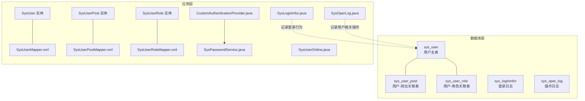
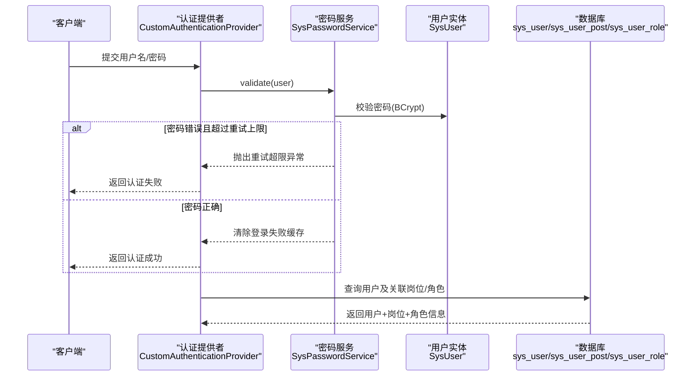
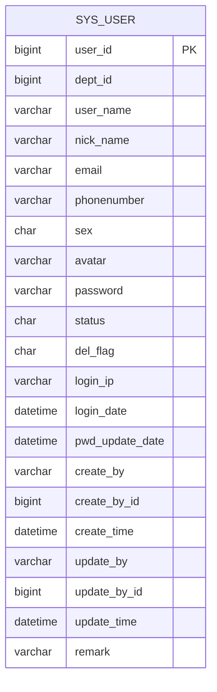
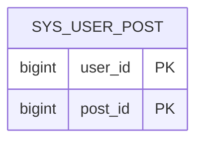
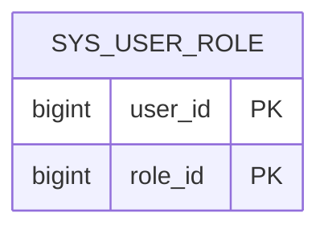
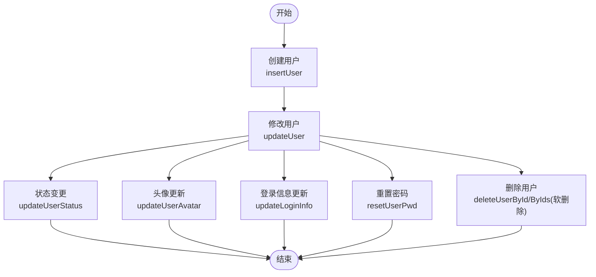
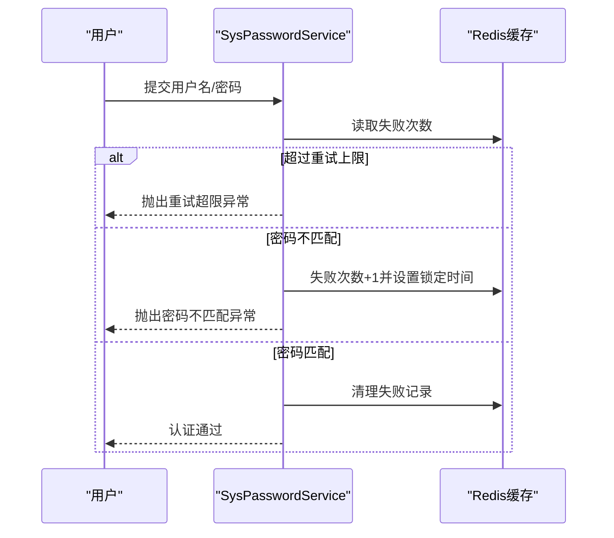
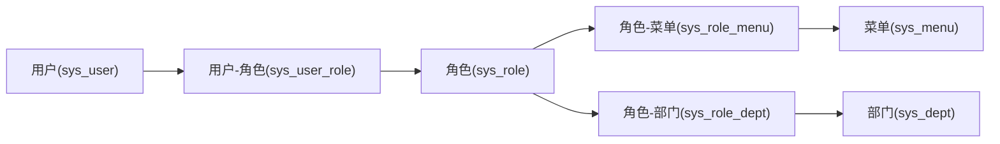
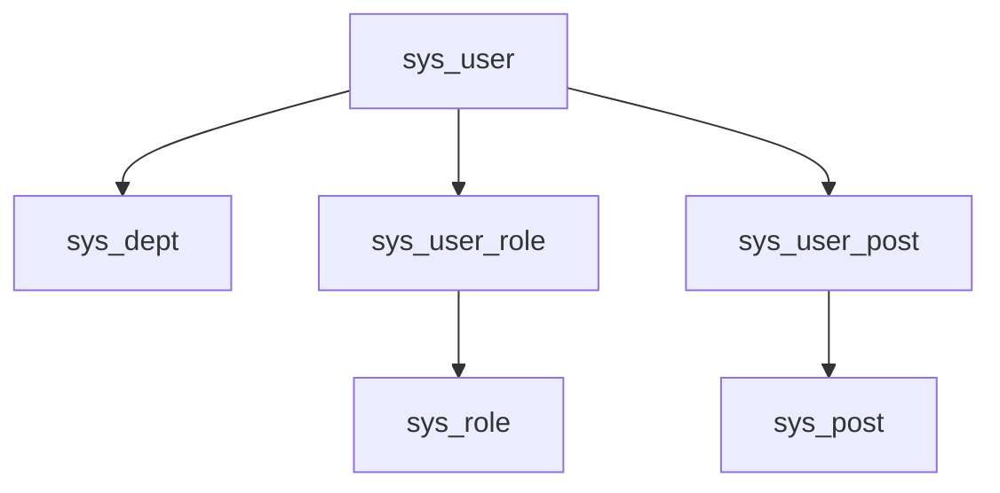

# 用户管理表设计

<cite>
**本文档引用的文件**
- [ry-vue-owner.sql](file://ry-vue-owner.sql)
- [SysUser.java](file://blog-common/src/main/java/blog/common/core/domain/entity/SysUser.java)
- [SysUserPost.java](file://blog-system/src/main/java/blog/system/domain/SysUserPost.java)
- [SysUserRole.java](file://blog-system/src/main/java/blog/system/domain/SysUserRole.java)
- [SysUserMapper.xml](file://blog-system/src/main/resources/mapper/system/SysUserMapper.xml)
- [SysUserPostMapper.xml](file://blog-system/src/main/resources/mapper/system/SysUserPostMapper.xml)
- [SysUserRoleMapper.xml](file://blog-system/src/main/resources/mapper/system/SysUserRoleMapper.xml)
- [SysPasswordService.java](file://blog-framework/src/main/java/blog/framework/web/service/SysPasswordService.java)
- [CustomAuthenticationProvider.java](file://blog-framework/src/main/java/blog/framework/security/provider/CustomAuthenticationProvider.java)
- [SysLogininfor.java](file://blog-system/src/main/java/blog/system/domain/SysLogininfor.java)
- [SysOperLog.java](file://blog-system/src/main/java/blog/system/domain/SysOperLog.java)
- [SysUserOnline.java](file://blog-system/src/main/java/blog/system/domain/SysUserOnline.java)
- [UserConstants.java](file://blog-common/src/main/java/blog/common/constant/UserConstants.java)
- [UserStatus.java](file://blog-common/src/main/java/blog/common/enums/UserStatus.java)
</cite>

## 目录
1. [简介](#简介)
2. [项目结构](#项目结构)
3. [核心组件](#核心组件)
4. [架构总览](#架构总览)
5. [详细组件分析](#详细组件分析)
6. [依赖分析](#依赖分析)
7. [性能考虑](#性能考虑)
8. [故障排除指南](#故障排除指南)
9. [结论](#结论)

## 简介
本文件系统化梳理用户管理相关的数据库表结构与应用层实现，重点覆盖以下方面：
- 用户主表（sys_user）的字段设计、数据类型、约束与索引策略
- 用户岗位关联表（sys_user_post）与用户角色关联表（sys_user_role）的多对多关系实现
- 用户状态管理、密码加密存储、登录失败锁定机制
- 用户生命周期管理（创建、修改、删除、状态变更）的日志记录方案
- 表结构图、关联关系图、权限继承流程图等可视化内容，帮助开发者快速理解用户管理的数据库设计架构

## 项目结构
围绕用户管理的核心文件分布如下：
- 数据库脚本：ry-vue-owner.sql（包含 sys_user、sys_user_post、sys_user_role 等表结构）
- 实体模型：SysUser.java（用户实体）、SysUserPost.java、SysUserRole.java（关联实体）
- 持久层映射：SysUserMapper.xml、SysUserPostMapper.xml、SysUserRoleMapper.xml（MyBatis 映射）
- 安全与认证：SysPasswordService.java、CustomAuthenticationProvider.java（密码校验与认证扩展）
- 日志与在线会话：SysLogininfor.java（登录日志）、SysOperLog.java（操作日志）、SysUserOnline.java（在线会话）

图表来源
- [ry-vue-owner.sql](file://ry-vue-owner.sql)
- [SysUser.java](file://blog-common/src/main/java/blog/common/core/domain/entity/SysUser.java)
- [SysUserPost.java](file://blog-system/src/main/java/blog/system/domain/SysUserPost.java)
- [SysUserRole.java](file://blog-system/src/main/java/blog/system/domain/SysUserRole.java)
- [SysUserMapper.xml](file://blog-system/src/main/resources/mapper/system/SysUserMapper.xml)
- [SysUserPostMapper.xml](file://blog-system/src/main/resources/mapper/system/SysUserPostMapper.xml)
- [SysUserRoleMapper.xml](file://blog-system/src/main/resources/mapper/system/SysUserRoleMapper.xml)
- [SysPasswordService.java](file://blog-framework/src/main/java/blog/framework/web/service/SysPasswordService.java)
- [CustomAuthenticationProvider.java](file://blog-framework/src/main/java/blog/framework/security/provider/CustomAuthenticationProvider.java)
- [SysLogininfor.java](file://blog-system/src/main/java/blog/system/domain/SysLogininfor.java)
- [SysOperLog.java](file://blog-system/src/main/java/blog/system/domain/SysOperLog.java)
- [SysUserOnline.java](file://blog-system/src/main/java/blog/system/domain/SysUserOnline.java)

章节来源
- [ry-vue-owner.sql](file://ry-vue-owner.sql)
- [SysUser.java](file://blog-common/src/main/java/blog/common/core/domain/entity/SysUser.java)
- [SysUserPost.java](file://blog-system/src/main/java/blog/system/domain/SysUserPost.java)
- [SysUserRole.java](file://blog-system/src/main/java/blog/system/domain/SysUserRole.java)
- [SysUserMapper.xml](file://blog-system/src/main/resources/mapper/system/SysUserMapper.xml)
- [SysUserPostMapper.xml](file://blog-system/src/main/resources/mapper/system/SysUserPostMapper.xml)
- [SysUserRoleMapper.xml](file://blog-system/src/main/resources/mapper/system/SysUserRoleMapper.xml)
- [SysPasswordService.java](file://blog-framework/src/main/java/blog/framework/web/service/SysPasswordService.java)
- [CustomAuthenticationProvider.java](file://blog-framework/src/main/java/blog/framework/security/provider/CustomAuthenticationProvider.java)
- [SysLogininfor.java](file://blog-system/src/main/java/blog/system/domain/SysLogininfor.java)
- [SysOperLog.java](file://blog-system/src/main/java/blog/system/domain/SysOperLog.java)
- [SysUserOnline.java](file://blog-system/src/main/java/blog/system/domain/SysUserOnline.java)

## 核心组件
本节聚焦用户管理的关键表与实体，说明字段含义、约束与索引策略，并给出 MyBatis 映射要点。

- sys_user（用户主表）
  - 关键字段：user_id（主键）、dept_id（外键关联部门）、user_name（账号）、nick_name（昵称）、email（邮箱）、phonenumber（手机号）、sex（性别）、avatar（头像）、password（密码）、status（状态）、del_flag（删除标志）、login_ip（最后登录IP）、login_date（最后登录时间）、pwd_update_date（密码最后更新时间）、create_by/update_by/create_time/update_time/remark（审计字段）
  - 约束与索引：主键索引；可按需建立用户名唯一索引、手机号唯一索引、邮箱唯一索引（见唯一性校验查询）
  - 状态管理：status=0 正常，status=1 停用；del_flag=0 存在，del_flag=2 删除（软删除）
  - MyBatis 映射：SysUserMapper.xml 定义了用户列表查询、唯一性校验、插入/更新、状态更新、头像更新、登录信息更新、重置密码、软删除等操作

- sys_user_post（用户-岗位关联表）
  - 关键字段：user_id、post_id（联合主键）
  - 作用：实现用户与岗位的多对多关系
  - MyBatis 映射：SysUserPostMapper.xml 提供批量插入、按用户删除、按岗位计数、按用户批量删除等

- sys_user_role（用户-角色关联表）
  - 关键字段：user_id、role_id（联合主键）
  - 作用：实现用户与角色的多对多关系
  - MyBatis 映射：SysUserRoleMapper.xml 提供批量插入、按用户删除、按角色计数、按用户批量删除、单条删除等

章节来源
- [ry-vue-owner.sql](file://ry-vue-owner.sql)
- [SysUser.java](file://blog-common/src/main/java/blog/common/core/domain/entity/SysUser.java)
- [SysUserMapper.xml](file://blog-system/src/main/resources/mapper/system/SysUserMapper.xml)
- [SysUserPostMapper.xml](file://blog-system/src/main/resources/mapper/system/SysUserPostMapper.xml)
- [SysUserRoleMapper.xml](file://blog-system/src/main/resources/mapper/system/SysUserRoleMapper.xml)

## 架构总览
用户管理涉及表结构、实体映射、安全认证与日志记录的协同工作：

图表来源
- [CustomAuthenticationProvider.java](file://blog-framework/src/main/java/blog/framework/security/provider/CustomAuthenticationProvider.java)
- [SysPasswordService.java](file://blog-framework/src/main/java/blog/framework/web/service/SysPasswordService.java)
- [SysUser.java](file://blog-common/src/main/java/blog/common/core/domain/entity/SysUser.java)
- [SysUserPost.java](file://blog-system/src/main/java/blog/system/domain/SysUserPost.java)
- [SysUserRole.java](file://blog-system/src/main/java/blog/system/domain/SysUserRole.java)
- [SysUserMapper.xml](file://blog-system/src/main/resources/mapper/system/SysUserMapper.xml)

## 详细组件分析

### 用户主表（sys_user）设计
- 字段设计与约束
  - 主键：user_id（自增）
  - 外键：dept_id（关联 sys_dept）
  - 唯一性：用户名、手机号、邮箱建议建立唯一索引（可通过唯一性校验查询实现）
  - 状态：status=0 正常，status=1 停用；del_flag=0 存在，del_flag=2 删除（软删除）
  - 审计：create_by、create_time、update_by、update_time、remark
  - 登录追踪：login_ip、login_date
  - 密码安全：password（BCrypt 加密存储），pwd_update_date（密码更新时间）
- 索引策略
  - 主键索引（user_id）
  - 唯一性索引（username、phonenumber、email）
  - 登录日志查询索引（status、login_time）
- MyBatis 映射要点
  - 列表查询：支持按用户名、手机号、状态、部门、时间范围过滤
  - 唯一性校验：checkUserNameUnique、checkPhoneUnique、checkEmailUnique
  - CRUD：insertUser、updateUser、updateUserStatus、updateUserAvatar、updateLoginInfo、resetUserPwd、deleteUserById/ByIds（软删除）

图表来源
- [ry-vue-owner.sql](file://ry-vue-owner.sql)
- [SysUser.java](file://blog-common/src/main/java/blog/common/core/domain/entity/SysUser.java)

章节来源
- [ry-vue-owner.sql](file://ry-vue-owner.sql)
- [SysUser.java](file://blog-common/src/main/java/blog/common/core/domain/entity/SysUser.java)
- [SysUserMapper.xml](file://blog-system/src/main/resources/mapper/system/SysUserMapper.xml)

### 用户岗位关联表（sys_user_post）设计
- 多对多关系
  - 用户与岗位：一对多（用户）+ 一对多（岗位）= 多对多
  - 联合主键：(user_id, post_id)
- 常用操作
  - 批量插入：batchUserPost
  - 按用户删除：deleteUserPostByUserId
  - 按岗位计数：countUserPostById
  - 按用户批量删除：deleteUserPost

图表来源
- [ry-vue-owner.sql](file://ry-vue-owner.sql)
- [SysUserPost.java](file://blog-system/src/main/java/blog/system/domain/SysUserPost.java)

章节来源
- [ry-vue-owner.sql](file://ry-vue-owner.sql)
- [SysUserPost.java](file://blog-system/src/main/java/blog/system/domain/SysUserPost.java)
- [SysUserPostMapper.xml](file://blog-system/src/main/resources/mapper/system/SysUserPostMapper.xml)

### 用户角色关联表（sys_user_role）设计
- 多对多关系
  - 用户与角色：联合主键 (user_id, role_id)
- 常用操作
  - 批量插入：batchUserRole
  - 按用户删除：deleteUserRoleByUserId
  - 按角色计数：countUserRoleByRoleId
  - 单条删除：deleteUserRoleInfo
  - 批量删除：deleteUserRoleInfos

图表来源
- [ry-vue-owner.sql](file://ry-vue-owner.sql)
- [SysUserRole.java](file://blog-system/src/main/java/blog/system/domain/SysUserRole.java)

章节来源
- [ry-vue-owner.sql](file://ry-vue-owner.sql)
- [SysUserRole.java](file://blog-system/src/main/java/blog/system/domain/SysUserRole.java)
- [SysUserRoleMapper.xml](file://blog-system/src/main/resources/mapper/system/SysUserRoleMapper.xml)

### 用户状态管理与生命周期
- 状态管理
  - 用户状态：正常/停用（0/1），删除采用软删除（del_flag=2）
  - 状态变更：updateUserStatus
- 生命周期操作
  - 创建：insertUser（支持部分字段插入）
  - 修改：updateUser（动态 set 更新）
  - 删除：deleteUserById/ByIds（软删除）
  - 登录信息：updateLoginInfo（记录登录IP与时间）
  - 密码重置：resetUserPwd（同时更新密码与更新时间）

图表来源
- [SysUserMapper.xml](file://blog-system/src/main/resources/mapper/system/SysUserMapper.xml)

章节来源
- [SysUserMapper.xml](file://blog-system/src/main/resources/mapper/system/SysUserMapper.xml)

### 密码加密存储与登录锁定机制
- 密码加密
  - 存储：BCrypt 加密后的密码字符串
  - 校验：SecurityUtils.matchesPassword(raw, hashed)
- 登录失败锁定
  - 重试上限与锁定时长：通过配置项 user.password.maxRetryCount 与 user.password.lockTime 控制
  - 缓存：使用 Redis 记录失败次数与锁定时间
  - 流程：每次登录失败失败次数+1并写入缓存；超过上限抛出异常；登录成功则清理缓存

图表来源
- [SysPasswordService.java](file://blog-framework/src/main/java/blog/framework/web/service/SysPasswordService.java)
- [CustomAuthenticationProvider.java](file://blog-framework/src/main/java/blog/framework/security/provider/CustomAuthenticationProvider.java)

章节来源
- [SysPasswordService.java](file://blog-framework/src/main/java/blog/framework/web/service/SysPasswordService.java)
- [CustomAuthenticationProvider.java](file://blog-framework/src/main/java/blog/framework/security/provider/CustomAuthenticationProvider.java)

### 权限继承流程（基于角色）
用户通过角色获得权限，角色再绑定菜单与部门数据权限。流程如下：

图表来源
- [SysUser.java](file://blog-common/src/main/java/blog/common/core/domain/entity/SysUser.java)
- [SysUserRole.java](file://blog-system/src/main/java/blog/system/domain/SysUserRole.java)
- [SysUserMapper.xml](file://blog-system/src/main/resources/mapper/system/SysUserMapper.xml)

章节来源
- [SysUser.java](file://blog-common/src/main/java/blog/common/core/domain/entity/SysUser.java)
- [SysUserRole.java](file://blog-system/src/main/java/blog/system/domain/SysUserRole.java)
- [SysUserMapper.xml](file://blog-system/src/main/resources/mapper/system/SysUserMapper.xml)

### 日志记录与审计
- 登录日志（sys_logininfor）
  - 记录：用户账号、IP、地点、浏览器、操作系统、状态、消息、时间
  - 索引：status、login_time
- 操作日志（sys_oper_log）
  - 记录：模块、业务类型、请求方法、操作人员、部门、URL、参数、结果、状态、错误信息、时间、耗时
- 在线会话（SysUserOnline）
  - 记录：token、部门、用户、IP、地点、浏览器、OS、登录时间

章节来源
- [ry-vue-owner.sql](file://ry-vue-owner.sql)
- [SysLogininfor.java](file://blog-system/src/main/java/blog/system/domain/SysLogininfor.java)
- [SysOperLog.java](file://blog-system/src/main/java/blog/system/domain/SysOperLog.java)
- [SysUserOnline.java](file://blog-system/src/main/java/blog/system/domain/SysUserOnline.java)

## 依赖分析
- 表间依赖
  - sys_user.dept_id → sys_dept.dept_id
  - sys_user_post(user_id, post_id) → sys_user(user_id), sys_post(post_id)
  - sys_user_role(user_id, role_id) → sys_user(user_id), sys_role(role_id)
- 应用层依赖
  - SysUserMapper.xml 依赖 MyBatis 映射与数据库连接
  - SysPasswordService 依赖 Redis 缓存与安全工具
  - CustomAuthenticationProvider 依赖 SysPasswordService 进行额外认证检查

图表来源
- [ry-vue-owner.sql](file://ry-vue-owner.sql)
- [SysUserMapper.xml](file://blog-system/src/main/resources/mapper/system/SysUserMapper.xml)

章节来源
- [ry-vue-owner.sql](file://ry-vue-owner.sql)
- [SysUserMapper.xml](file://blog-system/src/main/resources/mapper/system/SysUserMapper.xml)

## 性能考虑
- 索引优化
  - sys_user：建议为 user_name、phonenumber、email 建唯一索引；为 status、create_time、login_time 建普通索引以提升查询与日志统计效率
  - sys_user_post、sys_user_role：联合主键已提供高效查找，避免冗余索引
- 查询优化
  - 使用 MyBatis 动态 SQL 过滤（如按部门祖先、时间范围、状态等），减少全表扫描
  - 登录与操作日志查询利用索引（status、login_time、oper_time）
- 缓存策略
  - 登录失败次数与锁定时间使用 Redis 缓存，降低数据库压力
- 软删除
  - 通过 del_flag=0/2 实现软删除，避免物理删除带来的索引重建成本

## 故障排除指南
- 密码错误或重试超限
  - 现象：登录时报错“密码不匹配”或“超出最大重试次数”
  - 处理：等待锁定时间结束或管理员手动解锁（清除 Redis 缓存键）
- 用户被停用
  - 现象：登录时报错“用户不存在/密码错误”
  - 处理：检查 sys_user.status 是否为 1（停用），恢复为 0 后重试
- 唯一性冲突
  - 现象：新增/修改用户时报用户名/手机号/邮箱重复
  - 处理：使用 checkUserNameUnique/checkPhoneUnique/checkEmailUnique 校验唯一性
- 在线强制下线
  - 现象：需要强制某用户下线
  - 处理：删除 Redis 中对应 token 键（CacheConstants.LOGIN_TOKEN_KEY + tokenId）

章节来源
- [SysPasswordService.java](file://blog-framework/src/main/java/blog/framework/web/service/SysPasswordService.java)
- [SysUserMapper.xml](file://blog-system/src/main/resources/mapper/system/SysUserMapper.xml)
- [SysUserOnline.java](file://blog-system/src/main/java/blog/system/domain/SysUserOnline.java)

## 结论
本设计通过清晰的表结构、完善的实体映射与安全认证机制，实现了用户管理的完整闭环。关键点包括：
- 用户主表承载用户核心信息与状态，配合软删除与审计字段
- 用户-岗位、用户-角色采用关联表实现多对多关系，便于灵活扩展
- 密码采用 BCrypt 加密存储，结合 Redis 的登录失败锁定机制保障安全
- 登录日志、操作日志与在线会话形成完整的审计与监控体系
- MyBatis 映射覆盖常用 CRUD 与复杂查询场景，满足业务需求